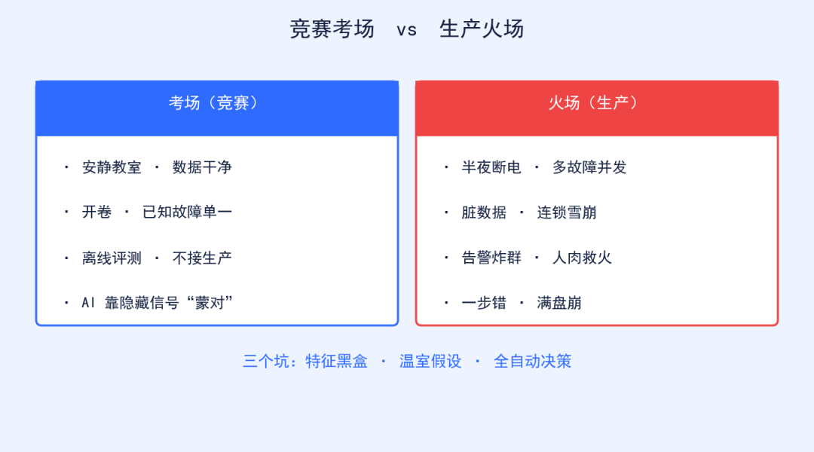

> AIOps 实战避坑 · 第 1/6 篇  
> 系列定位：第一季「落地实战」续作，专讲生产环境里的真问题  
> 适合：正在跑 SRE / oncall / 运维平台的你

封面

有个朋友凌晨两点在群里骂街：他们花了大半年，把某 AIOps 挑战赛冠军方案原封不动搬上线，结果半夜告警照样炸群，**MTTR 不降反升** 。我问他三个问题——「训练数据是你自己的吗？」「特征能解释吗？」「执行要人确认吗？」——全中。

先把 MTTR 翻译成人话：它就像消防员从接警到灭完火的时间，越短越好。可他这套"冠军方案"偏偏把时间拖得更长。问题出在哪？

* * *

## 一、竞赛不是生产

竞赛是**开卷考试在安静教室** ：数据早就清洗过，缺失值被补、异常被标注；故障单一，一种病症一条标签；评测标准固定，跑出一个分数就能排名。

生产是**火灾现场还断电** ：多故障并发，数据库卡了引发缓存雪崩，又触发限流，层层叠加；数据充满噪声，你根本不知道哪条日志是真的、哪条是干扰；更狠的是——竞赛给你满分答案，生产要你在没有标准答案时做决定，而且做错一步就可能满盘崩。

很多竞赛方案靠你没注意到的隐藏信号"蒙对"答案，这些信号在生产里要么拿不到，要么拿到时故障已经扩散了。所以竞赛拿了第一，不代表它能在你机房里救命。

考场 vs 火场

## 二、照搬上线的三个坑

**1\. 特征黑盒**  
AI 说"这个指标异常"，但它为什么异常？你问不到。更危险的是，竞赛里往往拿某个临时字段当强特征——比如"某中间件版本号"——你生产上升级一下，特征直接消失，模型当场懵圈。生产里你敢不敢照着一个"黑盒建议"直接操作？

**2\. 温室假设**  
竞赛数据集里一种故障一种答案。真实环境是组合拳：一个表象背后常藏着三根因果链。模型从没见过这种叠加，给你一个"教科书答案"，实际根本对不上号。

**3\. 全自动决策**  
有人直接让 AIOps 自动执行修复动作。结果它判断错了，把能自愈的小抖动扩成大面积变更——比如自动扩容把成本打爆，或自动重启触发雪崩——你在被窝里被叫醒擦屁股。

## 三、那竞赛方案就一点用没有吗？

也不是。竞赛至少证明了某些特征工程思路、某些模型结构确实有效。但千万别"原封不动搬"，正确姿势是：

  * 把竞赛里验证过的**特征思路** ，结合你自己的历史故障数据重新训练；
  * 把"单点准确率"换成"端到端可用率"——别看离线分数高，要看真出事时它给的建议你敢不敢用。

一句话：**竞赛是起点，不是终点；是灵感，不是答案。**

##  四、写在最后

竞赛结果只能证明"这个团队在特定条件下很强"，不能证明"它能救你的生产"。真正能救命的，是贴着你自家业务长出来的那套系统。

**今天就能用的 3 条清单：**  
1\. **上线前先做历史故障回放** ：拿真实过去 6 个月的故障数据跑一遍，看 AI 给的建议当时能不能用，别只看离线指标。  
2\. **保留"人工确认"这道闸** ：任何影响生产流量的动作，必须人点一下头；按风险设绿（可自动）、黄（需审批）、红（只给建议）三级。  
3\. **知识图谱别砍** ：它是 AI 和生产之间的翻译器，先把"指标—服务—依赖"的轻量映射建起来，没有它，AI 只是在跟数字猜谜。

* * *

**你生产上的 AIOps 踩过哪个坑？**

  * A：上线后准确率跳水
  * B：自动动作差点搞出二次故障
  * C：根因给得对，但修不好
  * D：还没上，正在观望