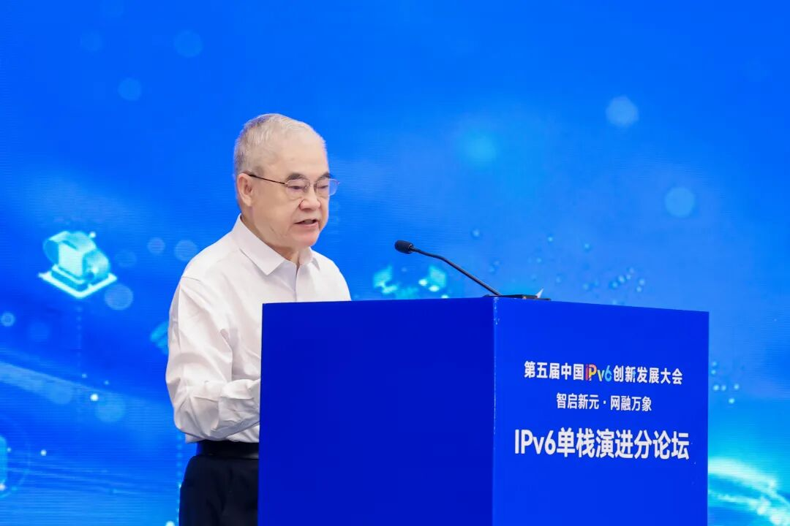
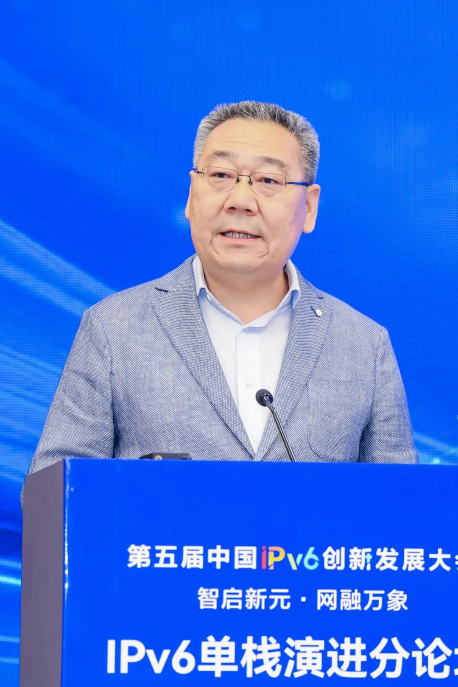
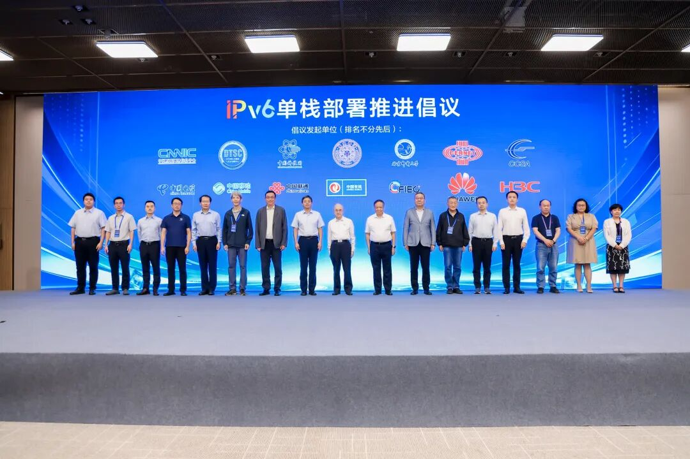

2026年7月28日，第五届中国IPv6创新发展大会IPv6单栈演进分论坛在雄安会展中心举行。论坛由IPv6规模部署和应用专家委主办，我中心与中国互联网络信息中心共同承办。来自相关单位的专家代表围绕IPv6单栈演进趋势、技术创新、设施升级、行业实践和安全保障等议题深入交流，共同推动IPv6从规模部署迈向高质量发展和全面赋能新征途。中国工程院院士邬贺铨在致辞中指出，IPv4/IPv6双栈是规模化普及阶段的过渡方案，IPv6 Only是互联网长期演进的必然方向。推进IPv6单栈演进不是简单关停IPv4通道，而是覆盖网络、终端、云平台、安全和应用的系统性架构重塑，将为人工智能、算力网络、智能体互联等新场景提供重要底层支撑。薄兆一副主任代表我中心提出，加快推进IPv6单栈部署恰逢其时，既符合互联网智能化发展潮流，也满足技术管网治网现实需要。一是智能互联网需要IPv6单栈演进。二是技术管网治网需要IPv6单栈演进。三是智能运维需要IPv6单栈演进。期待各有关单位加强协同，共同打造以IPv6单栈为主的智能互联网服务和应用体系、高水平技术管网治网体系、智能便捷安全的网络运管体系。中国互联网络信息中心副主任李强等与会领导专家，从IPv6单栈演进的不同视角出发，分别作致辞以及主旨报告。论坛期间，我中心与中国互联网络信息中心等单位共同发布《关于有序推进IPv6单栈部署倡议书》。倡议从加强技术攻关、完善标准评测、推进设施升级、深化行业应用、促进融合创新、筑牢安全底座、坚持开放协同七个方面，有序推进IPv6单栈部署，为建设网络强国提供坚实支撑。  

* * *

转载请注明来源：“中央网信办数据与技术保障中心”微信公众号