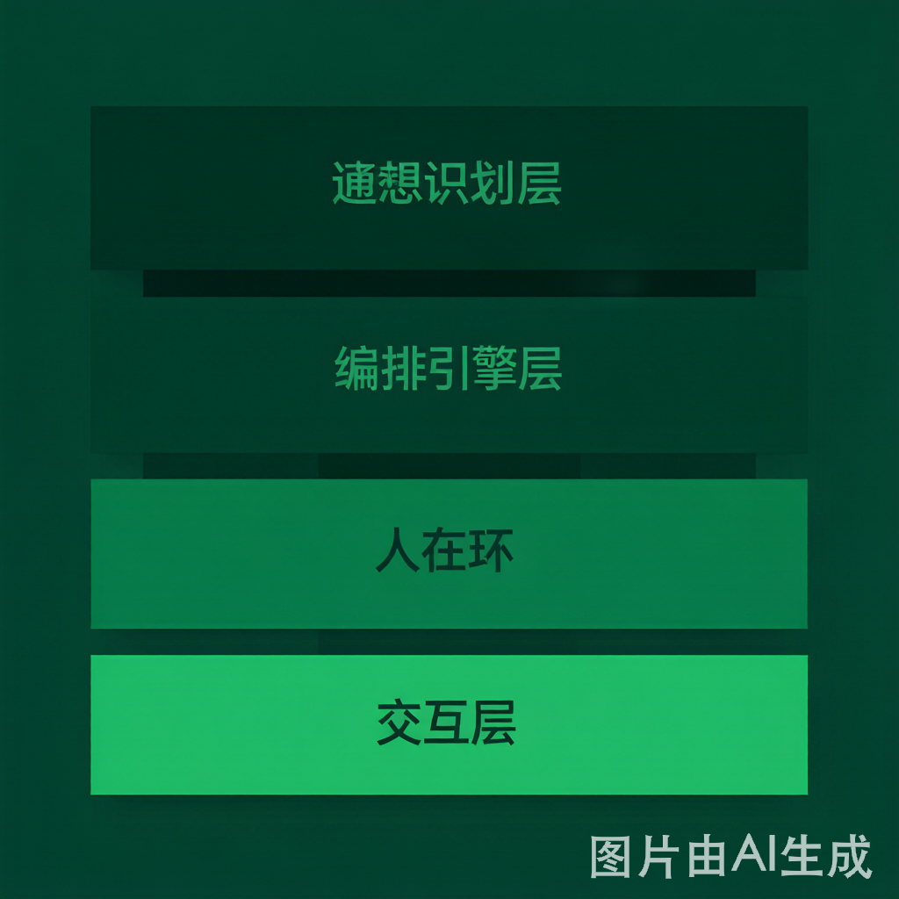
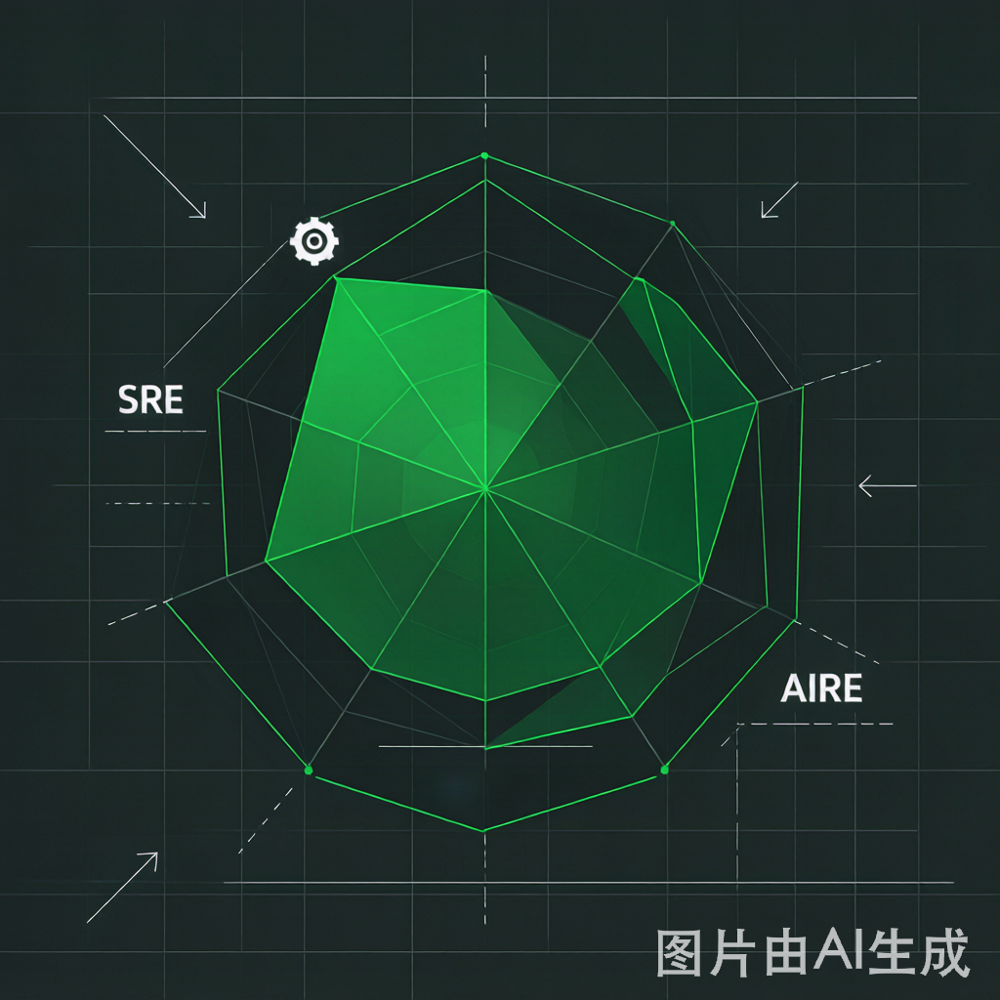

大模型进运维，最怕它"一本正经胡说八道"。唯品会用一套 SREAgent，把幻觉压住、把故障定位从小时级缩到秒级。这篇把它的技术底座拆给你看。

前面三篇把 SRE 的理念、可观测性、SLI/SLO 都铺好了。但真实落地时，经验都在人脑子里、信息散在各个系统里，AI 怎么才能既聪明又不胡来？唯品会的 VIPBrain（SREAgent 产品）是个很值得参考的样本。

## 一、技术底座四件套

**1\. 意图识别**

大模型 + Few-shot，把人说的话（"支付为什么慢了""这次发布影响多大"）映射到故障诊断、容量评估、变更影响分析等标准 SOP。它还支持多意图拆解、指代消歧（"它"指哪个服务）、意图延续切换，以及快速失败拦截（明显不合理的请求直接拦掉，不浪费推理）。

**2\. 编排引擎**

这是整个系统的"调度大脑"，用两种模式：

  * **pipeline（DAG）** ：线性 SOP，步骤固定，适合已知流程。
  * **ReAct（推理—行动循环）** ：边想边干，适合复杂开放场景。

再叠加**四级路由** ：直接回复 / SOP 快路径 / 单工具直通 / ReAct 深度排查。简单的秒回，复杂的才动用重武器。

**3\. HITL（人在环）**

这是克制 AI 胡来的关键。四类场景必须挂起等人：

  * 参数补全（信息不够，问人）
  * 意图消歧（不确定你想干啥）
  * 高危确认（restart、delete 这类，必须人拍板）
  * 主动追问（AI 觉得有隐患，反过来问你）

底线很清晰：**AI 只给建议，高危操作人工最终授权。**

**4\. AI 原生交互层**

思维链可视化（你能看到 AI 怎么想的）、槽位填词、SSE 流式输出（首字 < 1s）、多会话管理。体验上不像在用工具，像在带一个新来的专家同事。

## 二、为什么知识图谱是核心基建

这是全篇最值得记的一点：唯品会明确说，**纯向量检索（RAG）在严肃故障排查里容易幻觉** ，因为故障定位需要的是"精确的关系推理"——A 依赖 B、B 连着 C、C 挂了会炸 D。

他们的解法是用知识图谱平台（Nebula Graph），把拓扑、依赖、责任人关系建成图。好处是能做**秒级"爆炸半径"分析** ：一个节点出问题，图谱立刻算出会影响哪些上游、哪些业务、该拉谁进群。这比 RAG 靠语义相似度"猜"靠谱得多。

## 三、故障精准定位流水线

真实故障进来后的链路是这样的：

告警接收 → 知识图谱关联（穿透爆炸半径）→ CMDB 穿透（定位责任人）→ 并行抓取日志/指标 → AI 根因分析 → 自动拉群 → 输出报告。

效果数据很硬：定位从小时级缩到秒级，准确率 > 85%，专家介入减少约 80%。另外 DBGuard 挡住了约 95% 的 Redis 超时查询，DBA 每周少做 15–30 次手工排查；日常巡检从 > 1.5 小时缩到 < 10 分钟。

## 四、四条最佳实践

  1. **知识图谱是 AI 落地运维的关键基础设施** ——纯 RAG 易幻觉，图谱提供可信推理路径。
  2. **"快思考"和"慢思考"都要** ——已知 SOP 用 pipeline 秒级响应（快思考），复杂场景用 ReAct/多智能体（慢思考）。
  3. **AI 是辅助而非替代** ——所有生产执行计划需人工审批，AI 的价值是"把专家从重复劳动里解放出来"。
  4. **探索自愈闭环** ——从"辅助诊断"走向"辅助处置"：标准化故障自动生成方案 → 人工确认 → 一键执行。安全底线始终是 HITL。

## 下篇预告

P4 是"AI 怎么帮 SRE"，下一篇反过来——"当 AI 成了系统核心引擎，SRE 自己要怎么进化"。医院 AI 影像系统可用率 99.99% 却悄悄失效的故事，就是答案的起点。

* * *

**今日互动**

  * 投票：你们团队用上 AI 运维了吗？①大规模落地 ②试点中 ③只看看 ④完全没动
  * 留言聊聊：最想让 AI 帮你搞定哪类运维活？

**回顾** ：前 3 篇讲了理念/可观测性/SLI-SLO，关注「超时空技术」回复 `SLO` 领模板。