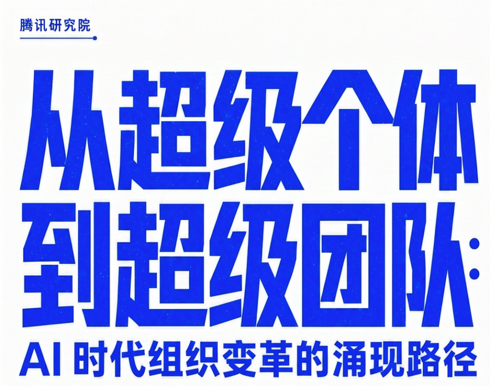

袁晓辉 腾讯研究院副院长、资深专家  

余 一 腾讯研究院高级研究员

  
  

**从田野调研和实验出发**

AI 时代的组织变革，到底是被设计出来的，还是长出来的？  
过去两年，几乎每一家咨询公司都发布了AI 转型路线图，每一个商学院都开设了AI战略课程，每一位CEO都在年度战略里写下了拥抱AI四个字。斯坦福HAI《2026人工智能指数报告》1显示，全球88%的组织已在至少一项业务中采用AI。麦肯锡2026年全球AI调查2则揭示了一个鲜明对比：尽管AI采纳率创下历史新高，仅有1%的公司自认达到了AI成熟：将AI深度嵌入核心业务并产生系统性价值的企业，百中无一。这个1%和88%之间的巨大鸿沟，暴露了一个被广泛忽视的事实：绝大多数组织推进的AI变革，仍然停留在采用AI工具上，远未触及组织借助AI实现彻底蜕变的层面。大家购买了工具、成立了委员会、撰写了政策文件，但组织本身：人如何协作、决策如何流动、价值如何创造，并没有发生根本性变化。在这片广袤的停滞中，有一种完全不同的图景正在发生。这种图景的起点，往往不在高管会议室，也不在重新绘制的组织架构图上，而是出现在一个工程师的深夜编程中，出现在一个产品经理第一次用Claude Code跑通需求验证的那个下午。这让我们开始思考一个问题：真正有效的AI变革，核心驱动力或许并非来自自上而下的推动，而是来自自下而上的涌现。2026年5月15日，腾讯研究院AI原生小组发布了《AI原生工作报告》，我们当时在报告中对自己的描述是八个字一边实践、一边研究。那份报告回答的问题是：在AI真正进入工作流之后，一个人的工作方式应该被怎样重做？在报告里，我们用 10 个关键词把AI 原生工作拆开来讲：驾驭工程、记忆、技能、评估、上下文管理、工作流、多智能体、加法偏见、去技能化、知识工程等。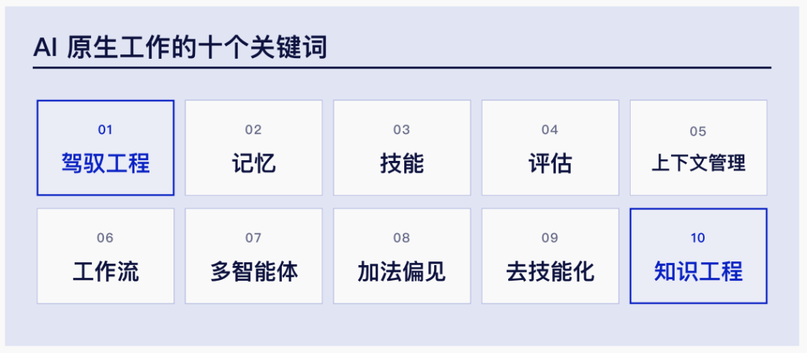而当个体的工作被重做之后，AI原生小组的共识是，下一步必须是协作方式和基础设施的重新设计。这也是我们过去一年在内外部调研中反复观察到的模式：真正深刻的AI 组织变革，几乎总是从一两个人开始。一个人先醒来，发现AI可以将自己的能力放大几倍、十倍甚至百倍，然后这种新的工作方式像涟漪一样向外扩散，感染一个小组、一个部门，最终改变整个组织的运作方式。而目前业内常见的组织变革讨论，无论是红杉与Block提出的从层级到智能的信息结构视角3，还是麦肯锡和BCG的CEO驱动转型框架，抑或学术界基于科斯交易成本理论的组织边界分析，大多从自上而下的设计逻辑出发，回答的是组织应该怎么变。本报告的核心视角是基于演化过程和自下而上涌现的分析框架。我们想回答的是一个不同的问题：组织正在怎么生长？这个视角还帮我们统一了一个看似分裂的光谱。在当下的讨论中，AI 转型和AI 原生常常被视为两个截然不同的命题：一边是存量组织在庞大惯性中的艰难改造，另一边是新创团队在白纸上的全新构建。之前的讨论会把两者视为完全不同的两个问题、两套框架，认为一家AI转型企业如果真的想推进AI变革，最好的方式是另起炉灶重新组建AI原生团队。但后来我们发现，如果我们把镜头从组织拉近到人，会发现成熟企业的AI转型和初创团队的AI原生，都遵循着同一个底层逻辑：AI 转型 = 存量组织内部，超级个体逐步涌现，能力溢出带动团队进化AI 原生 = 超级个体从第一天就按新方式聚合两者的核心命题其实可以是同一个：超级个体如何聚合为超级团队。 二者的区别只在于路径和约束不同。对于今天的企业而言，这意味着一个极具实践意义的转向：不必纠结我们的企业是AI转型还是AI原生，也不必纠结团队是否一定要拆散了重新组建，真正应当关注的是一个更本质的问题，当下的企业环境究竟有没有在培育超级个体？有没有为超级团队的生长创造出足够的空间和环境？我们用了一个公式来校准这场生长：组织竞争力 = 人才密度 x AI杠杆 / 组织摩擦。它的价值在于把变革问题拆成三个独立可操作的方向：人才密度指的是单位团队中具备独立闭环能力的人占比；AI杠杆指的是AI实际嵌入工作流的深度和覆盖面；组织摩擦指的是一个想法从产生到变成可交付成果之间要经过多少等待、审批、对齐和信息衰减。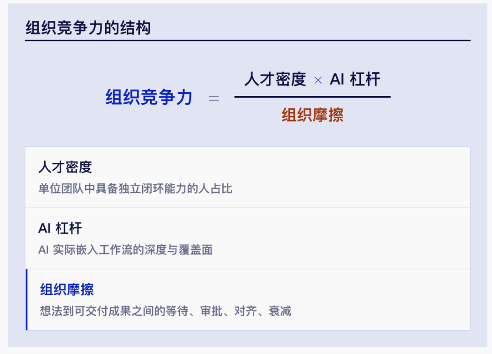三者的关系是乘除而非加减：分子翻倍但分母不动，净效果打折；分母减半的效果等价于分子翻倍。超级个体放大的是分子，超级团队真正解决的是分母。我们观察到的有效变革，极少是被规划出来的，组织能自上而下设计的，至多是让它生长的土壤。本报告将沿着个体觉醒→能力溢出→团队涌现→组织启示这条线索展开。我们从超级个体的诞生讲起，追踪他们如何聚合为超级团队，观察不同组织中的超级个体能力涌现路径，并最终提炼出对组织变革的启示。我们希望通过对变革正在怎么发生的事实记录，找到这些演变路径背后的规律。

关注腾讯研究院公众号，在后台回复关键词“超级个体2026”，获取精致排版的PDF报告。

**  
  
**

**第一章：超级个体的诞生**

1.1 什么是超级个体？演化路径：从知识工作者到超级个体要理解超级个体，先要看它是从哪里来的。把这个概念放在知识工作演进的长链条上看，每一代都比前一代更接近一个人独立创造价值的极限，但每一代也都有自己跨不过去的能力边界：直到AI出现，把一个人做不了所有事这个最根本的限制给消解了。彼得·德鲁克在1960年代提出知识工作者概念4时，定义的是一群用知识创造价值的人。他们是组织的核心资产，但高度依赖组织：组织提供信息、资源、协作环境和分工结构，知识工作者在其中完成被分配的任务。理查德·弗罗里达在2002年提出创意阶层（Creative Class）5，将视角从知识处理扩展到创造力。创意阶层是能够产生新想法、新设计、新内容的人，超越了单纯的信息处理。但他们仍然受限于个人的专业边界：一个设计师就是设计师，一个工程师就是工程师，创造力虽强，局限在单一领域之内。保罗·贾维斯（Paul Jarvis）在2019年出版的《一人公司》（Company of One）6以及此后围绕一人公司的大量讨论（2019-2023），进一步把个体推向了组织的对立面：一个人不需要扩张，不需要雇佣团队，也可以构建一个可持续的商业。 但在AI之前，一人公司面临明确的能力天花板：一个人无法同时胜任所有角色，增长到一定阶段就不得不在继续一个人做和开始雇人之间做出选择。但这条演化链中间有一段容易被忽略的历史：超级个体曾经出现过，又被组织化浪潮压了回去。2000年代初的独立软件开发者天然就是自闭环的角色：自己设计、自己写代码、自己发布、自己回复用户反馈，从发现问题到交付产品在一个人手里完成。但随后，互联网的工业化用了二十年时间把这种完整性拆碎了：岗位化把创造拆成七八个角色，工业化把角色串成流水线，中台化又用平台和权限把复杂度固化。每一步都有合理性，没有分工就没有规模协作，但最终结果是，一个人的自闭环能力被切成了碎片。工程师不再面对用户，产品经理有责任但没有执行手段。AI的出现，第一次系统性地把跨角色行动的成本打了下来，让自闭环重新变得可能。AI 超级个体打破了这条链条上以往所有学者的基本假设，也打破了组织拆分二十年来的惯性 ：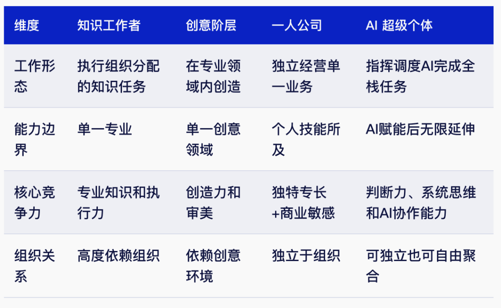这几个概念的核心区别在于：AI 超级个体的工作方式从执行跃迁到了指挥调度。他们设定方向、构建约束、评估产出、迭代优化。核心竞争力已从执行迁移到思考：思考什么值得做、怎么做是对的、做到什么程度算好。这种能力模式的转变，使得个体的能力边界从有限变为可延伸，组织形式从依赖人治走向可能的系统自治。  
超级个体的定义：四个结构性特征在这条演化链的基础上，如果让我们用一句话定义超级个体，那就是：借助AI，一个人能够达到过去需要一个小团队才能达到的产出规模和影响半径。 拆开来看，超级个体有四个结构性特征：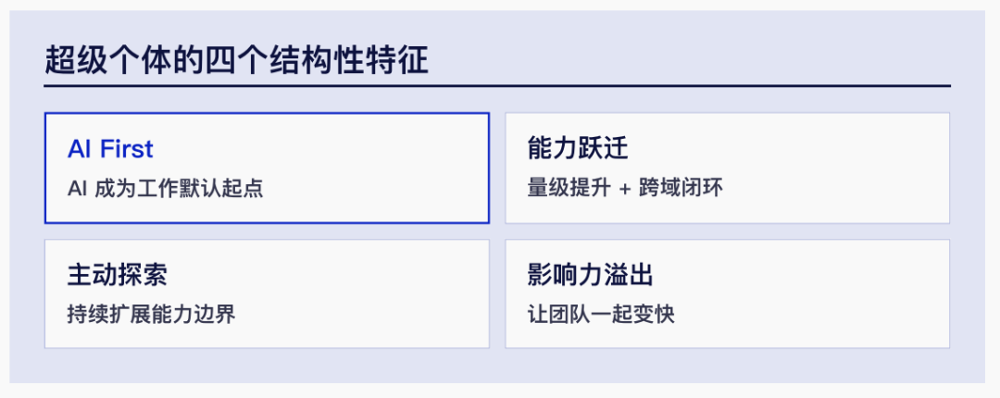第一，AI First的工作动线。 超级个体把AI排进了整个工作动线。AI是工作的默认起点。大多数人用AI的方式是我照常工作，遇到困难时问一下AI；超级个体的方式是我先让AI跑，然后在AI的产出上做判断和修正。这个区别看似微小，实际上决定了AI杠杆能放大到什么程度。第二，能力边界的量级跃迁。 超级个体远超用AI工具的人这一层面。他们借助AI实现的跃迁同时发生在两个维度：量的维度上，产出从提升百分之几十变为提升十倍甚至数十倍；域的维度上，一个人可以独立把一件事从想法做到交付，跑通过去需要产品、设计、研发、运营多个角色接力的整条链路。专业分工的必要性在一定程度上被大幅削弱，一个人可以同时是提出问题的人和解决问题的人。第三，主动性极强。 超级个体不等待组织安排，他们是天然的边界探索者，主动寻找AI能力的极限，不断扩展自己的能力圈。这种自驱力是持续的好奇心与行动力的结合，让他们在组织中成为AI应用的先行者和示范者。第四，影响力溢出。 这是最容易被忽视的特征，也是判定超级个体的关键阈值：高效个体只让自己变快，超级个体让团队变快。 如果一个人用了AI让自己产出翻十倍，但同事毫无察觉，那他还没成为超级个体，只是一个使用AI的优秀员工。超级个体真正的影响力溢出是自然发生的：当一个同事看到你用AI在一个晚上做出了他们一个月的产出，当一个管理者发现团队里用AI最好的人不一定是技术背景最强的那个，变革的种子就已经播下了。以上四个特征缺一不可。少了AI First原则，AI用了但杠杆率上不去；少了能力跃迁，只是传统意义上的高产者；少了主动性，AI工具再多也只是在被动地消耗token；少了影响力溢出，价值停留在个人产能层面，带不动组织。  
量化证据：超级个体并非传说超级个体已经不只是少数案例制造出的想象，越来越多数据正在指向同一个变化：AI 把个体可调用的时间、技能和组织能力同时放大了。Anthropic 于 2025 年 11 月发布一项基于 10 万条 Claude.ai 匿名对话的生产力估算研究7。研究用 Claude 估算如果没有 AI，专业人员完成同一任务需要多久，再与对话内实际耗时对比。结果显示：样本任务若无 AI 辅助，平均约需 1.4 小时，Claude 估算 AI 可使任务完成时间平均减少约 80%。部分任务的效果更为极端：报告信息汇编约节省 95%；课程开发任务从 Claude 估算的 4.5 小时降到 11 分钟，对应约 96% 的时间节省；文档写作节省约 87%，金融分析任务节省约 80%。Harvard Data Science Review 2026 年发表的《The Agent-Centric Enterprise》8进一步解释了为什么不同人和组织之间会出现数量级差距。文章指出，很多企业已经在使用 AI，78% 的公司声称采用了 AI，但 80% 仍未看到可衡量的利润影响。关键差别在于：只把 AI 叠加到原有人类工作流上，常见收益多为 20%–40% 的增量提升；围绕 Agent 重新设计流程，部分场景才可能释放 2–10 倍的生产力潜力。文中案例显示，Linde 的审计报告初稿时间从约 24 小时降至约 2 小时，减少 92%；Stora Enso 的 B2B 销售洞察从 1–2 个被动场景扩展到 10–20 个主动场景。商业侧也已经出现相同信号。AI 原生公司 Cursor 被多家研究机构列为增长最快的软件公司之一，Sacra 估算其从 100 万美元 ARR 到 1 亿美元 ARR 仅用了约 12 个月；后续报道显示，在约 3 亿美元 ARR 阶段，团队规模约 60 人，收入/人效远高于传统 SaaS 公司，传统软件公司达到类似收入规模通常需要 500–1000 人。另一个信号来自一人公司。Carta 2025 年 Solo Founders Report 9 显示，在其覆盖的美国创业公司中，单人创办的新公司占比从 2019 年的 23.7% 上升到 2025 年上半年的 36.3%，约 6 年相对增长 53%，获得的风险投资美元占比约 14.7%。1.2 什么人先醒来？不同角色的觉醒路径超级个体是在不同位置、不同时间、因不同触发事件而觉醒的个体。我们在调研中发现，觉醒发生在组织的各个层级，但觉醒的方式和随后的影响路径截然不同。按照觉醒者的起点和方向，可以归为三条路径。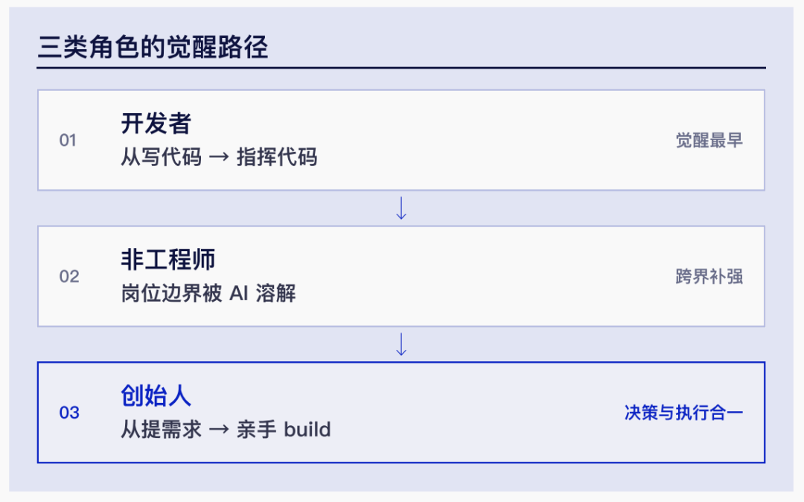开发者的觉醒：从写代码到指挥代码开发者是最早感受到AI冲击的群体，也是觉醒形态最清晰的群体。他们的变化远超效率提升10%或20%，工作方式被根本重构：从亲手写代码，变成设定方向、定义约束、审查产出。CodeBuddy的subo，描述了一种新的工作状态：他90%以上的代码由AI编写。他说：我不关心它写什么代码，只关心代码架构。一个晚上，AI在他的指挥下产出约一万行代码。subo的角色已经并非传统意义上的程序员，他更像是一个代码架构师和AI调度员。他由此说出了一个AI时代反常规的判断：AI是中心，所有人都是边缘，在AI原生的工作流里，人是给AI输入意图的边缘节点，AI是协调一切的中心节点。CodeBuddy团队负责人Bati描述这种变化是：只要你拥抱AI，把你的技能嫁接在AI上，你个体就乘十倍。到十倍，已经需要并行指挥很多AI Agent了。如果你只指挥一个Agent，一般就提高一两倍、两三倍。效率提升的上限，取决于你能同时管理多少个AI Agent。这是一种全新的管理技能：管理的对象从人变成了Agent。这种觉醒也在催生新角色。FDE（前沿部署工程师）正在OpenAI、Anthropic、Google等大模型公司快速扩张，它本身就是开发者觉醒的产物：AI coding让一线工程师能在听到客户炮声后直接改产品、沉淀可复用的能力模块，而不再像Palantir时代那样只能记录问题、等待后方排期。Cresta的Agent负责人jove描述这个岗位需要的是迷你CTO，既能写代码也能对接客户，一个人端到端负责从需求到交付的全链路。开发者觉醒的本质是角色跃迁：从代码的生产者变成代码的架构师和AI的调度员。代码还在被写出来，但写代码的不再是人。非工程师的跨界觉醒：岗位边界在溶解如果说开发者的觉醒改变了代码怎么写，非工程师的觉醒则改变了谁能写代码。这条路径上的案例，每一个都在消解传统岗位边界。在美图，CEO吴欣鸿提出了超级设计师的概念，内部已经出现了多个跨越岗位边界的案例：RoboNeo的产品负责人原来是设计师，自学了模型部署和AI编程，现在很难定义他到底是设计师、产品经理还是工程师；一位原本只跟数据打交道的分析师，通过AI工具掌握了运营全能力，一个人完成了原本五六个人的协同。在特赞，Marketing同事用Claude Code抓取LinkedIn联系人后摇身一变成为Marketing Engineer，产品经理和设计师直接用Cursor出功能不再等研发排期。创始人范凌观察到，公司里用AI工具用得最好的并非研发团队，而是产品经理和设计师。AI最大的价值，是让非专业人士也拿到了过去专属于研发的开发资源。Block 也观察到同样的现象。在安克创新，岗位融合走得更激进。非程序员一个人用三个月搭建了整套供应链运营系统，另一个人用两个月搭建了亚马逊Case自动提交、监控和回复系统：这些过去是整个团队数月的工作量。安克因此提出了明确的组织目标：到 2027 年，进行更广泛的岗位融合，比如以前的前端工程师、测试工程师、Java 工程师、Python 工程师等岗位融合成为业务工程师（全栈），AI 工程师和产品经理。具体到个体案例，koa作为CodeBuddy团队的工程师，在接触AI后转型成了产品经理，在一周之内搭建了一套PRD系统化工具，这在没有AI的时代是一个产品经理加上前端工程师协作数周才能完成的工作。CodeBuddy团队的产品负责人Jason也经历了类似的变化：产品方法论、执行、原型这些以前需要跨界团队才能覆盖的知识鸿沟，被AI抹平了。他可以直接用AI完成以前需要设计师、数据分析师、前端工程师协作才能完成的工作。歸藏原本是产品和交互设计师，从未做过专业开发。但他用Claude Code做出了开源产品Codepilot，一个月16万行代码、39个版本、200多次commit，平均一天1.3个版本，基本上所有版本都有功能迭代。ColaOS的橘子把一个盈利中的产品ListenHub交给一个人继续开发，与其说是维护，不如说是在继续推进产品迭代；一个人加一堆 Agent 维护 20 个 repo，从产品、设计、前后端到测试运营，实际产出提升了 10 倍以上，DAU 和营收也显著提升。这些案例指向同一个趋势：AI正在消解谁能做什么的传统边界，觉醒发生在每一个愿意拿起AI的人身上。创始人转化为Builder：从提需求到亲手做创始人的觉醒在所有路径中最为激烈，因为当一个掌握资源和决策权的人亲自变成builder，改变的不只是他自己的工作方式，而是整个组织的运转逻辑。flomo联合创始人少楠的觉醒代表了非技术背景创始人的路径。在开始使用Claude Code之前，少楠从未写过代码。但现在，他每天花三个小时用Claude Code跑需求验证，直接把想法变成可运行的原型来测试，跳过了写需求文档、等工程师排期、来回沟通细节、等待开发完成再验证的全部流程。现在少楠对 flomo 所有产品经理提了一个新要求：提需求之前，必须先拿到代码库权限，在自己的分支上用代码把需求跑通，在真实数据库里拿到结果，再写 PRD 交给工程师上线。工程师那侧也在变。Web 端做完一个功能，移动端工程师直接去代码库级别参考实现，不需要重新写 PRD，打点（数据埋点）有专门的 Skill 技能指令自动化完成。现在flomo目前70%-80%的代码由AI贡献。周期从按周计算变成了按小时计算。特赞范凌的觉醒是创始人亲自下场build的典型。范凌和CTO、产品负责人三个人组成小团队，亲自用AI做出Atypica原型，两周内跑出的用户增长远超公司内部一个七人团队。范凌由此得出一个洞察：AI是帮那些需要研发资源的人直接拿到研发资源的Agent。这次个人体验后面也被放大成全公司的build文化和组织变革的起点。AI对代码生产力的冲击正在提供一个微观样本，帮助我们理解这到底意味着什么。当一个人借助 AI 产品可以完成过去一个团队的产出时，组织存在的理由、团队协作的方式、管理的逻辑，都必然被重新审视。出门问问创始人李志飞的经历和转变就是一个典型案例，2025年端午节，李志飞自己开始重新编程，三天内亲自用AI写了十几万行代码开发了一个团队协作软件，这是CEO作为超级个体的极致展示。此后一个多月，他每天9点到凌晨1点沉浸在AI编程中，但正是这次体验，让他意识到一个组织问题：如果组织没有被重新设计，超级个体（尤其当创始人本人就是超级个体）在组织里可能是一场灾难。这个认知最终驱动他转向了一个完全不同的方向：转而去设计AI原生协作平台-CodeBanana，让团队中的每个人都有可能成为超级个体。1.3 能力排序的洗牌超级个体的涌现伴随着一个出乎很多人预料的现象：AI同时在做两件事：重排序列和拉大方差。它不是简单的放大器，也不是均衡器，而是按一套新的标准重新给人定价。CodeBuddy团队在实践中发现了一个令人惊讶的现象：以前逻辑能力强、学习能力强的人，会在AI的协助下，变得更强。这是在多个团队中反复出现的模式。AI会放大之前积累的底层能力：逻辑思维、快速学习、问题分解、系统思维。少楠从另一个角度观察到：只有原来优秀的人，变得更优秀了。AI没有带来能力平权，反而把鸿沟拉得更大。两个观察指向同一件事的不同侧面：AI按底层能力重排了序列（CodeBuddy的发现），重排之后头部和尾部的差距比过去更大（少楠的发现）。旧序列里的「中下水平者」如果恰好底层能力强，会在新序列里跃升；但新序列本身的方差，比旧序列更大。结果是：个体之间的差距在扩大，但谁领先谁落后的名单洗牌了。麦肯锡全球研究院2025年的数据印证了这一趋势：近90%的公司已投资AI，但不到40%报告了可衡量的生产力收益10。收益集中在少数高绩效组织。据麦肯锡2025年年报及CEO Liz Hilton Segal公开演讲披露，麦肯锡内部已部署约25000个AI Agent与40000名顾问协同工作，后台团队缩减25%的同时产出增长10%。AI像一个放大器，强的信号被放得更强，弱的信号被进一步淹没：生产力的方差在急剧扩大。触宝科技创始人王佳梁基于自己的观察和实践，提出了一个结构性的分层模型来描述这种洗牌：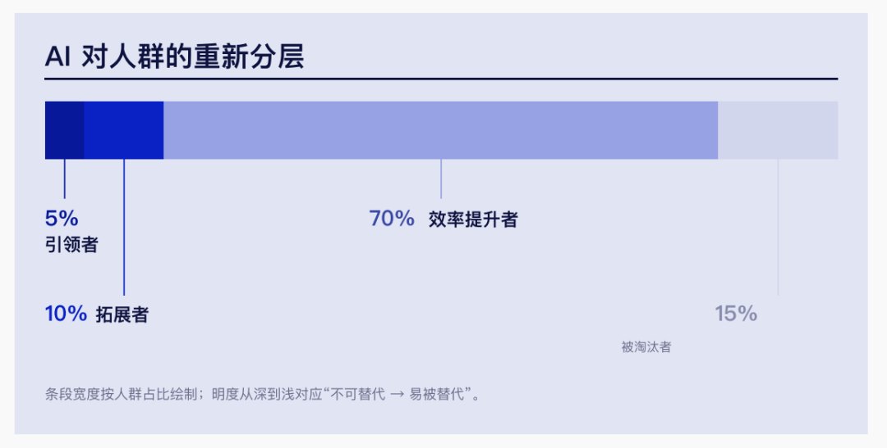

  * 最顶层约5%的人，能将AI杠杆与不可替代的人类能力结合起来；
  * 约10%的拓展者突破了原有边界；
  * 约70%的效率提升者用AI更快完成工作，获得线性提升；
  * 而约15%的被淘汰者，其工作恰好是AI最容易替代的。

王佳梁对此的总结是AI替代的是你被雇佣的理由。当AI可以获取几乎所有知识、执行几乎所有标准化任务时，一个人被组织需要的理由，必须从我知道什么和我能做什么转移到我能判断什么和我能创造什么。超级个体花叔在谈到蒸馏同事现象时也补充了一个切面：大多数人并不值得被蒸馏，把经验Skill化的核心价值，是让输出符合你自己的品味。世界已经能生成很强的东西，但你要的是它别总生成不符合你的风格。这种洗牌对组织的冲击是深远的。传统的人才评估体系，基于学历、资历、职级和过往业绩，在AI 时代可能系统性失灵。一个有十年经验的工程师，在AI辅助编程上的适应速度可能不如一个善于学习的应届生；一个从未写过代码的产品经理，可能因为出色的逻辑能力和系统思维，成为团队中AI产出最高的人。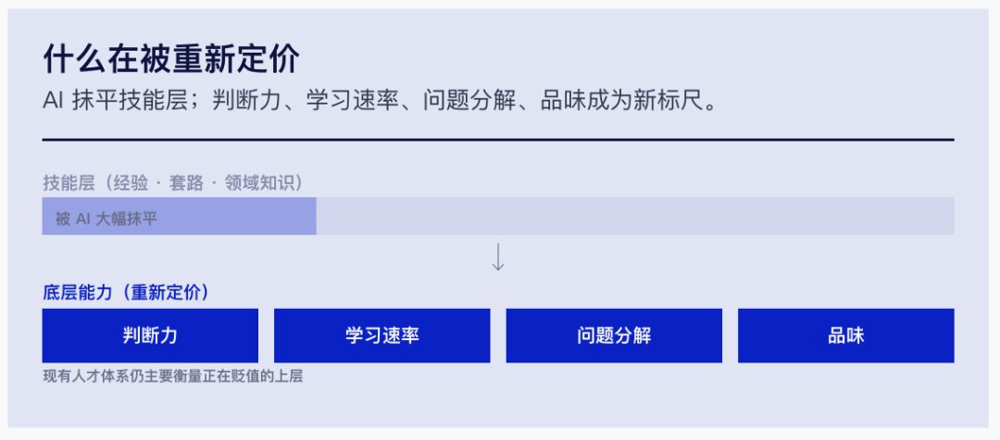把这些观察叠起来，我们越来越倾向于把 AI 看作一台分化加速器：它不普惠，它放大差距。过去两年最流行的说法是AI 赋能每个人，但我们在样本里反复看到的，是它把差距越拉越大。一个组织如果照人人都会被平等赋能去配置资源，很可能把投入摊得最平均，而回报恰恰集中在最不平均的地方。更值得留意的是被洗掉的究竟是什么。表面上洗的是技能，但 AI 几乎抹平了技能这一层，真正被重新定价的是它底下那层更难命名的东西：判断力、学习速率、问题分解、品味。难处在于，现有的人才体系衡量的几乎都是正在贬值的那一层。  
1.4 什么人不容易醒来？讨论了谁先醒来、能力如何洗牌之后，有必要反过来看一个问题：什么样的人不容易成为超级个体？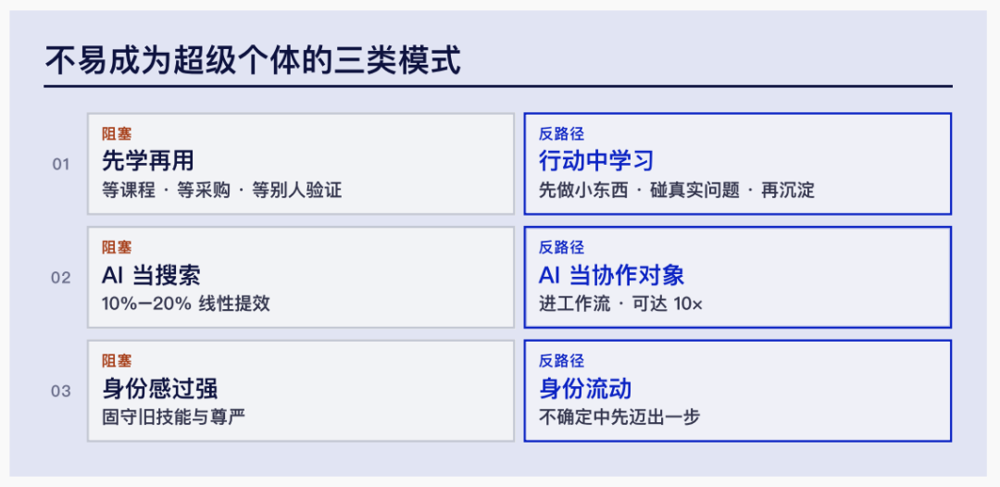第一种是学习姿态错位的人。我们在调研中反复看到，有一些聪明、靠谱、在过去体系中表现优秀的人，面对AI时却迟迟不动。他们有一个共同的行为模式：先学再用。先系统学完课程，先等公司统一采购工具，先看别人用的效果，然后再开始自己的实践。这套姿态在过去二十年非常有效。知识结构相对稳定的年代，先学框架再做项目是高胜率策略。但AI时代有一个根本性的不同：工具变化得比课程快，产品形态变化得比分类体系快，真实问题变化得比组织流程快。等你系统学完，窗口可能已经过去了。第二种是把AI当效率工具没有把AI当作协作对象的人。他们会用AI，甚至用得不少，但始终在用搜索引擎升级版的方式使用它：问一个问题，拿一个答案，然后回到自己原来的工作方式里。他们没有真正把AI放进工作流的核心位置，没有让AI参与决策过程、审查自己的判断、挑战自己的假设。AI对他们而言是一个更快的工具，没有意识到AI能改变工作方式。这种用法能获得10%-20%的效率提升，但永远触不到十倍放大的门槛，十倍放大的重点是重新定义什么事值得做、怎么做，目标并非做同样的事更快。第三种是身份感过强的人。当一个资深工程师的自我认知建立在我写的代码质量高之上，AI coding对他就不只是一个工具问题，而是一个身份威胁。当一个设计师认为审美是我的不可替代性，他就很难接受AI生成的方案可能在某些维度上已经够用甚至更好。身份感越强，转型成本越高，因为要放下的不只是旧技能，还有旧技能附带的尊严感和确定性。超级个体的成长路径恰恰与这三种模式相反：行动中学习，先学完再行动是旧路径；把AI当共同思考的对象，把AI当取用答案的机器不对；愿意让自己的专业身份变得流动，死守一个越来越窄的定义会限制发展。先做一个小东西，让它碰到真实问题，从失败中获取反馈，再回头命名、归类、沉淀方法论。超级个体往往是组织中最愿意在不确定中先迈出一步的人。  

**  
**

**  
**

**第二章：从超级个体到超级团队**

2.1 超级个体为什么会聚合？

如果AI能让一个人完成过去一个团队的工作，那一个合理的推论似乎是：组织会瓦解，每个人都变成独立的超级个体，团队将变得不再必要。传统团队的价值来自技能分工：一个人不会设计，找个设计师；一个人不会写代码，找个工程师。但 AI 正在消解这种分工的必要性：一个有判断力的人加 AI 智能体，可以同时完成设计、代码、运营、数据分析。如果只看技能分工，超级个体已经够了。我们观察到的恰恰相反。超级个体没有走向孤立，他们在以新的方式、新的理由聚合在一起。我们对此的判断是，超级个体需要团队，能力是必要条件但不是充分条件。AI已经极大扩展了个体能力，但一个人承载不了所有的风险、注意力、信任和长期承诺，也接不住需要多种判断并行的更大价值场景。前三件事超出能力维度，第四件事（价值场景）仍涉及能力的组合与规模，但它需要的是复数的人同时在场，单点能力再强也撑不开这个空间。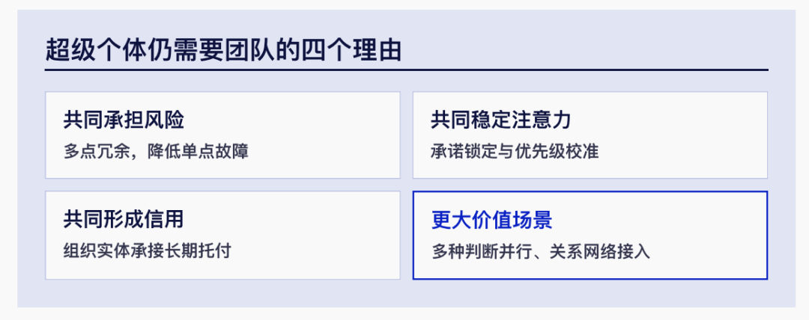团队还有另一层价值：它跟做事无关，跟持续做成事有关。如果这一层不被论清楚，超级团队就会被读成一群会用 AI 的高效员工，这种解读会让所有人停留在加 AI的层面，错过 AI 原生组织真正的拐点。第一重需要：共同承担风险风险承担是一种系统属性。完成任务只需要能力，承担风险需要稳定性。AI 能让一个人在能力维度上无限延伸，但承担风险的能力来自系统冗余：多点决策、多点抗压、多点试错。纳西姆·塔勒布在《反脆弱》11中提出过一个深刻的洞察：集中决策系统，一个人做所有判断，通过消除小波动来追求表面稳定，实际上在积累隐藏的系统性风险；分散决策系统允许小失败发生，反而建立了对不确定性的持续适应能力。这是数学结构问题，单点故障的概率，始终高于多点冗余。在现实层面，WinSavvy 对多项研究的汇总18显示：与单创始人相比，有联合创始人的公司 5 年存活概率高约 45%、获 VC 投资概率约 1.8 倍、到达 PMF 约快 25%；十亿美元级公司中约 80% 有 2 名或以上联合创始人；融资超过 1000 万美元的公司里，仅约 9% 由单创始人领导。First Round Capital 对其约 300 家种子被投、近 600 位创始人的十年复盘《The 10 Year Project》19则显示：多创始人团队相对单创始人在初始投资至退出或公允价值之间的价值表现高约 163%。这些数据意味着风险分担是一种结构性需要，它不会因为AI让人更强而消失，反而在AI放大个体能力的同时，放大了个体承载的风险。超级个体借助 AI 变得更强，但也承担了更大的不确定性，窗口更短、迭代更快、赌注更重。一个人在长时间尺度上连续做出正确判断的概率，必然衰减。  
第二重需要：共同稳定注意力赫伯特·西蒙的有界理性理论告诉我们，人的注意力是最稀缺的资源，人类决策受信息可获取性、认知处理能力、时间约束三重不可超越的限制。能力更强意味着天花板更高，不意味着天花板消失。对于超级个体而言，这个问题反而加剧了，当AI将能力边界无限延伸后，面前的选择和机会也无限膨胀。一个善于使用AI的人可以做产品、做设计、做运营、做内容、做开发，但这不意味着他应该同时做所有这些事情。Sophie Leroy 在 2009 年提出注意力残留概念12：任务切换时，前一个任务未完成的部分会持续影响后续任务的表现。加州大学欧文分校 Gloria Mark 等对工作场所中断的追踪则显示：被中断的任务若在同日恢复，平均约需 23 分 15 秒才能回到等效专注状态23。Leroy12与 Mark23 等研究反复确认同一件事：注意力切换是有结构性损耗的，而且这种损耗不会因为切换者更聪明而消失。当一个超级个体在多个项目和角色之间频繁切换时，他在每个任务上的投入质量都会下降。AI 进一步加剧了这种紧张，AI 的高吞吐让决策点的密度暴涨，每小时要做的判断从 5 个变成 50 个，每一个都要付出注意力切换成本。为什么注意力问题不能靠个人自律或AI辅助来解决，而需要团队？原因有三层。第一层是承诺锁定：当你知道有人在依赖你的特定产出时，退出当前任务的心理成本上升，承诺本身成为对抗分散的结构性力量。独自工作时切换方向是零成本决策，有队友时切换方向意味着辜负一个人的等待。第二层是优先级校准：超级个体面临的问题往往不是做不做，而是先做哪个。AI可以帮你列优先级，但它缺乏一个关键输入，从不同角度看这件事到底重不重要。队友提供的是另一个判断视角，帮你在50个都能做的事里锚定最该做的3个。第三层是注意力的社会性维护：深度工作研究反复表明，人在有限的社会结构中（固定的协作对象、稳定的节奏）更容易进入并维持专注状态。团队提供的是一个固定的注意力场，而非一个人对抗无限可能性的孤军。第三重需要：共同形成信用关键人物风险（Key Person Risk）是投资界和企业治理中的经典议题。在 closely held 企业估值实践中，对单一关键人物的过度依赖常通过 key person discount 体现；实务与文献常见讨论区间约 10%–25%，亦有 5%–40% 的宽口径表述，须结合客户集中度、管理层深度等事实逐项论证24。Schilke 与 Lumineau 在组织间信任研究25中指出，B2B 合作中的信任评估常落在供应商这一组织实体，而不仅是单个对接人上。当一家公司决定把 100 万预算交给你的时候，他们评估的不仅是你的能力强不强，还有这个系统是否可靠。而一个人本身就是结构性地不可靠的：你生病怎么办、你突然变忙怎么办、你换方向怎么办。鲍里斯·格罗伊斯伯格2008年在哈佛商业评论上发表的明星可迁移性研究26揭示了一个重要发现：当明星员工跳槽到新公司时，其绩效往往会显著下降；但如果他们带着原有团队成员一起跳槽，绩效则不会下降。这个研究指向一个反直觉的结论：超级个体的绩效本质上依赖于工具栈、数据、伙伴、组织信用和反馈结构，而不仅仅是个人能力。这个发现对超级个体的聚合具有直接的解释力，个体的超级能力有相当一部分是由其所在的协作网络所支撑的。一个超级个体独自面对客户、投资人或合作伙伴时，对方看到的是单点风险；但当超级个体形成团队时，对方看到的是分散的风险和可持续的承诺。AI可以帮你产出内容和交付物，但替不了这个系统值得长期托付在客户心中的留存。信用是时间乘以关系的函数，需要复数的人在多个时刻持续积累。  
第四重需要：进入更大的价值场景一人公司有其结构性天花板。大多数一人公司的收入集中在知识付费、咨询、自媒体等个人品牌变现的领域，难以进入需要稳定工程化产品、更大规模交付、持续产品迭代、需要客户信任体系、合规与责任的更大价值场景。南方财经网 2026 年对大湾区 OPC（One-Person Company）社区的追踪报道\[26\]，与多地 OPC 政策试点中的案例观察一致，印证了这一结构性约束。真正在 AI 时代跑出惊人增长的，多是 20 人以内、且不止一人的 AI Native 团队。Cursor 在约 20 人时 12 个月做到 1 亿美元 ARR；Lovable 在 15 人时 2 个月做到约 1000 万美元 ARR；Bolt.new 约 15 人在发布两月内做到约 2000 万美元 ARR；Base44 约 8 人在 6 个月内以约 8000 万美元现金对价出售。Midjourney 约 11 人即做到约 5000 万美元年收入；Gamma 约 30 人实现 5000 万美元 ARR。早期共同点是一小群超级个体 + AI 工作流 + 共享上下文，团队协作优于单打独斗。组合创新文献指出，差异性往往是创新的原料。Hoever 等（2012）在实验中发现，当团队成员主动进行视角转换时，视角多样性更高的团队创造力显著优于同质团队27。超级团队的价值在于把同一领域里有不同路径的人聚在一起。一个擅长产品思维的超级个体和一个擅长技术架构的超级个体聚合，产出的可能性空间是两人能力的笛卡尔积：每一种组合都可能打开一个新的方向。在AI 时代，最高效的价值创造单元是一小群超级个体的聚合体。他们比一人公司能进入更大的价值场景，又比传统大组织有着高出数量级的人均产出。AI能放大单点能力，但价值场景的扩大需要多点同时在场：多种判断并行、多种关系网络接入、多种品味碰撞，这是复数的人才能撑开的空间。四重结构合起来看，团队的存在是为了承担风险、稳住注意力、积累信用、容纳价值场景。 AI 能让一个超级个体的能力实现跃迁，但跃迁之后，这个人必须面对四件事：一个人承载不了所有风险，稳不住所有注意力，积累不出长期信用，也接不住更大的价值场景。高营收的 OPC 在从 1 到 10 的过程中几乎全部引入了团队，或者加入了超级团队，这本身就是对聚合的最好注解。2.2 协作的本质变了：从按岗位切割到按优势放大理解了超级个体为什么仍然需要团队之后，还需要回答一个问题：聚合之后的协作，和传统团队的协作有什么本质区别？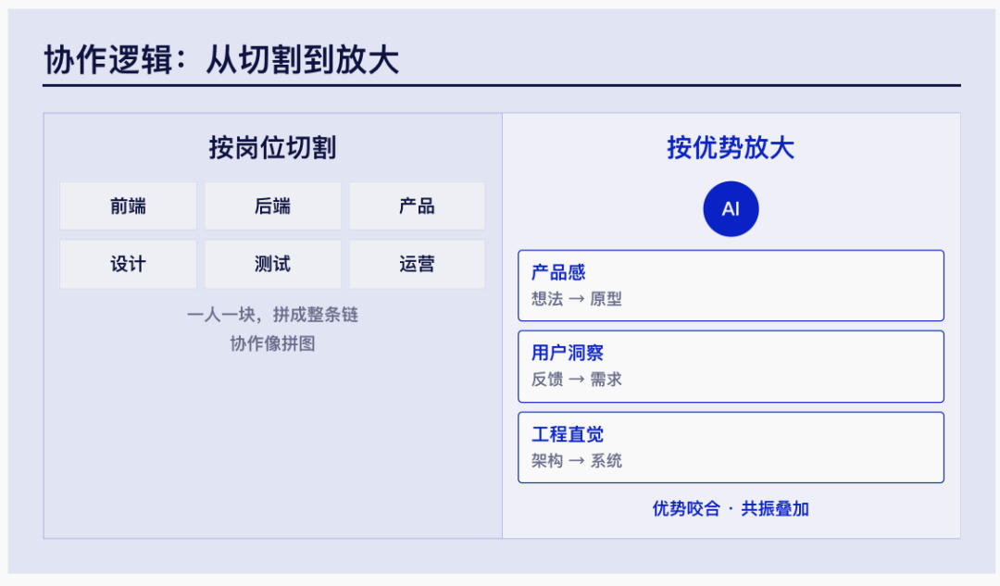过去的团队协作，本质是分工协作：因为一个人做不了全链条，所以必须拆成前端、后端、产品、设计、测试、运营。它是基于能力边界的切割。AI之后，一个人确实可以跨越很多原来的能力边界，但这不意味着协作消失了。AI会放大每个人最强的那一部分：产品感强的人用AI可以快速把想法变成原型，工程直觉强的人用AI可以搭出更稳定的系统，用户洞察强的人用AI可以更快分析反馈、重构需求。所以超级团队的协作逻辑已变为你在这里最强，所以由你来定义这部分的最高标准。团队的核心已变为优势结构：每个人都被AI放大成一个更强的自己，然后这些被放大的优势彼此咬合。传统团队像拼图，每人补一块缺口；超级团队更像共振，每个人带着被AI放大的优势场，彼此叠加。这种叠加在理论上应该自然发生。保罗·罗默（Paul Romer）的内生增长理论14指出，思想具有非竞争性，共享不会贬值。当两个超级个体分享各自的方法论和AI使用技巧时，双方的能力都增加了，不存在零和博弈：我们不妨称之为披头士效应，列侬和麦卡特尼各自都是出色的音乐家，但最高成就出现在合作时期。但现实中，放大常常没有发生。我们在很多超级个体社区里看到同一个现象：社群繁荣、情感共振强烈，但生产力始终没有出来。情感共鸣和思想共享能让人聚在一起，却不能替代结构：风险谁来分担、注意力怎么锚定、信用如何积累、大场景靠什么承接。超级团队是结构产物，而非聚会的产物。这就把问题推到了一个更根本的层面：需要什么样的结构？放眼望去，现成的两个选项，都遇到了问题：第一种路径：个体单干。这是走不通的，因为四重需要补不齐，从1到10没有路径。第二种路径：回到传统科层。这也是走不通的，因为科层消耗独特性，超级个体进入科层会衰减。超级团队要走的是第三条路。它把组织问题转化为一个创造力生态学问题：核心问题变成怎么让这群人的创造力在结构支撑下自然生长。既保留超级个体的独特性和自主性，又用结构解决单干补不齐的四重需要。这种结构如何从现实中生长出来、最终长成什么形态。  
2.3 四种涌现路径在我们的调研中，超级个体聚合为超级团队的过程呈现出若干可辨识的路径模式。我们将其归纳为四种主要路径，每一种都有其独特的逻辑和条件。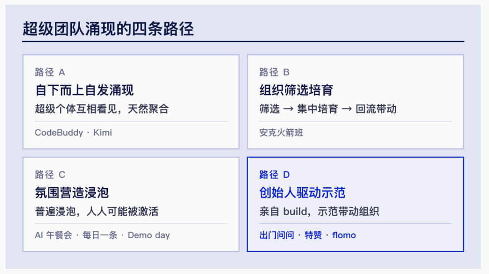路径A：自下而上的自发涌现这是最自然的路径，没有来自顶层的刻意设计，超级个体在实践中彼此发现、互相吸引、自发聚合。CodeBuddy团队是这种路径的典型代表。在这个腾讯内部孵化的AI 编程工具团队中，涌现的过程可以被清晰地追踪：最初，几个对AI 编程深度着迷的个体各自在不同方向上证明了AI放大的可能性，有人用AI一晚写一万行代码，有人用AI从工程师转型产品经理，有人发明了全新的人机协作开发模式。这些个体的能力溢出互相可见后，产生了天然的吸引力。随后，团队负责人Bati构建了一个透明的领域层/上下文层结构，每个人清楚地知道自己的领域、其他人的领域，以及共享的上下文。在这个结构中，超级个体在共享上下文中自主找到最有价值的工作并完成它，无需被分配任务。团队由此从一群各自厉害的个体，演化为一个协同产出远超个体之和的超级团队。Kimi（月之暗面）的案例从另一个角度印证了自发涌现的逻辑。Kimi团队内部有一句话：架构扁平化是一个结果。也就是说，Kimi并没有刻意设计扁平架构，它之所以扁平，是因为极高的初始人才密度加上AI 工具使个体独立交付成为可能。当每个人都能独立完成高质量的产出时，层级的存在就失去了信息传递和质量监控的必要性。Kimi采用的BAPO理念（Business→Architecture→Process→Organization），先定业务目标和系统架构，流程和组织结构适应前两者，是为自下而上的涌现创造了最大的空间。路径B：组织筛选培育型并非所有组织都有条件等待自发涌现。在规模较大、惯性较强的组织中，自上而下的催化干预可能是必要的，但最有效的干预是设计筛选和培育机制，让超级个体更容易出现。安克创新的火箭班模式是这种路径的典型案例之一。火箭班的运作逻辑分为四个阶段：筛选→培育→放回原团队→带动全员能力提升。首先，从全公司范围内筛选出对AI有强烈兴趣和快速学习能力的人。然后，这些人将完全脱产用1-2个月的时间完成高强度的AI能力培育，是在真实业务场景中用AI解决真实问题，设置严格的通过考核。这些被AI赋能的个体回到团队后，他们的新工作方式会自然地感染和带动周围的人，成为组织中超级个体涌现的种子。安克的这种模式之所以有效，是因为它理解了涌现的本质：你不能直接设计出一个超级团队，但你可以大幅提高超级个体出现的概率，然后让涌现自然发生。CEO阳萌将此列为一把手工程，保证了筛选培育机制有足够的组织资源和高层支持。特赞创始人范凌则是对组织开了两刀。第一刀是把全公司切成pod，3到10人的跨职能小队，内部闭环交付，不再依赖跨部门拉通。第二刀是在pod之外建community：横向社区帮所有人补齐销售、产品、代码等跨界能力，并专设Leadership Community。两刀之后，范凌观察到了自发涌现：pod leader开始自发减少横向调配和资源争夺，转而每个人依靠AI把自己负责的事情往深了做。当AI给了每个人拥有一支虚拟团队的可能性时，深耕比横向调配的回报更高，人们自然会做出理性选择。组织形态的变化是个体理性选择的涌现结果。美图的AI创新工作室也提供了这种路径的另一个变体。吴欣鸿把2000多人的公司切成一个个不超过10人的创新小组，每组给1000万预算和分红激励，半年验证：做成了分红甚至独立融资，做不成就裁撤。他的逻辑是：未来竞争最激烈的不一定是跟大厂，反倒是跟新锐创业团队，所以得提前以他们的效率为标准去对齐。这些小组内部取消了所有常规会议，没有固定产品经理，大家都是产品经理、都是运营，决策流程极短。这本质上是在大公司内部模拟超级团队的运作条件：人少、授权大、容错高、结果说话。路径C：氛围营造型如果说路径B是精准筛选+集中培育，路径C则是普遍浸泡+自然生长，创造一种人人都可能被激活的氛围。腾讯研究院的实践体现了这种路径的特点。两个看似简单的机制，AI午餐会和每日一条AI使用心得分享，持续运作后产生了超出预期的效果。AI午餐会本质是展示和交流：每次有人展示自己用AI做了什么有意思的事情。这种同事示范的力量远超专家培训，当你看到和你做类似工作的同事用AI做出了令人惊喜的东西时，心理距离会瞬间缩短，我也可以试试的念头自然产生。每日一条分享则构建了持续的信息环境，每天都有新的AI使用案例和技巧出现在团队的信息流中，这种持续的低强度刺激，比一次性的培训课程更有效地改变人的行为。这两个机制持续运作几个月后，研究院的内部AI使用调研的数据显示：86%的成员每天使用AI，人均同时使用3到5个产品，AI Coding产品Codebuddy成为部门工作和协作的平台，27%每天使用AI超过3小时，带来研究工作的整体提效。这些数字远超行业智库和很多互联网公司的整体水平，是氛围营造路径效果的直接量化证据。更值得记录的是一个自发涌现的案例。2026年春节，研究院AI原生小组接到了持续跟进AI热点的值班任务，他们让一个skill加入到了值班的队伍。团队共享了一个AI skill，每天大家调用这个skill追踪最新的AI进展，再根据调用结果去迭代改进这个skill。春节结束后，这个skill没有消失：它成为研究院每天追踪AI进展的常驻沉淀工具。值班的人力消耗变成了skill的演化时间。这是自发涌现到机制沉淀到持续运作的最直接的标本，也标志着经验传递的最小单位从说一段话升级为扔一个可执行的skill。ColaOS创始人橘子的做法则代表了氛围营造的另一种形态，是集中爆发的信心质变。橘子给团队两周完全自由的探索时间，没有任何预设目标，没有PRD，就是让每个人用AI玩。两周后的demo day，大家展示各自的探索成果。橘子和管理层都以身示范，橘子对外发布了多款产品，CTO一个人在一个晚上做出了产品的0.1版本。从demo day到三周后推出内测产品，速度之快印证了一个模式：氛围一旦点燃，超级团队的形成可以非常迅速。橘子对这个过程的总结是：很多同事不适应，工作十几年，从来没有这样没有终点、要自己探索方向的状态。但正是这种开放式的探索氛围，让20个人做出了20个不同的demo，让个体被激活的密度达到了临界点。路径D：创始人驱动型这是一条独特的路径，创始人首先自己成为超级个体，亲自用AI做出产品级的成果，然后通过这个示范效应和/或技术平台来规模化地催生更多的超级个体。第一章 1.2 已经讲过这些创始人个人觉醒的烈度，这里要看的是另一面：他们如何把个人觉醒放大成一套让别人也能觉醒的组织机制。出门问问李志飞的路径清晰地展示了技术平台化的模式。如前所述，他在亲历超级个体极限的同时，也看到了它在组织中可能带来的灾难。超级个体能力被AI放大之后，并不自动形成超级组织，若缺少新的协作结构，反而可能产生“幽灵效率”。他的解决方案是设计AI原生协作平台-CodeBanana，一个让所有团队成员都能借助AI进行高效工作的协作系统，同时实现筛选和氛围营造两个功能：愿意使用平台的人自然被筛选出来（路径B的效果），平台上其他人的成果则持续营造着人人可以的氛围（路径C的效果）。特赞范凌则展示了亲自build如何被放大成组织文化。前面他三人小团队用AI做出的产品跑赢了公司七人团队；更关键的是他把这件事做成了机制：午饭、咖啡时间把demo秀给同事看，同事开始模仿，然后互相秀。当Build in Public变成了一种骄傲的文化氛围，远胜于要用AI的口头号召，AI原生的工作方式就从创始人的个人选择长成了组织的文化基因。少楠在flomo的实践为这条路径提供了另一个切面。少楠亲自用Claude Code快速创造和验证了新产品功能，认知地图和AI记忆。过去逻辑推演觉得对的东西，一旦用AI快速做出demo在真实数据上跑，很多假设立刻被推翻。你证伪自己想法的效率变高了，这是一种全新的产品创造方式。当创始人亲自用这种方式做出了令人惊喜的功能，整个团队对用AI能做什么的想象力边界就被打开了。四条路径的共性和交叉回顾这四条路径，一个共同的模式浮现出来：所有成功的超级团队，底层动力都是个体能力的涌现；但涌现的速度和密度，取决于组织是否主动创造了条件。 路径A是纯涌现，路径B和路径D则是自上而下创造条件、自下而上长出结果。安克的火箭班是CEO拍板的一把手工程，特赞的Pod切分是创始人主导的组织手术，这些干预不是涌现本身，而是涌现的催化剂。这些干预的共同逻辑是：你不能设计一棵树长成什么样子，但你可以选择土壤、控制光照、保证水源。区别只在于：有的组织等种子自己落地，有的组织主动播种。另一个共性是可见性的关键作用。在所有四条路径中，超级个体的成果必须被看见，CodeBuddy的透明结构让每个人的产出可见，安克的火箭班成员回到团队后他们的新能力可见，腾讯研究院的午餐会让每一个人使用AI探索的成果可见，ColaOS的demo day让个人探索的创意可见。看见是传染的前提。如果超级个体的工作方式和成果被封闭在个人的屏幕后面，涌现就不会发生。正是可见性把个体的觉醒转化为团队的觉醒，把点状的突破转化为面状的变革。这四条路径之间不互斥。事实上，最成功的组织往往同时运用了多条路径，安克创新既有火箭班（路径B）也在营造全员氛围（路径C）；特赞的创始人亲自下场既是路径D的示范，也催化了路径A的自发涌现。理解这些路径的价值不在于选择哪一条，而在于理解自己的组织处于哪个阶段、哪些条件已经具备、哪些条件需要创造，然后让涌现自然发生。在 AI 时代，仍然把组织变革等同于设计一张更好的架构图的管理者，大概率会慢一步。  

**  
**

**  
**

**第三章：超级团队的形态**

在前两章中，我们描述了超级个体的诞生和他们从个体走向团队的涌现路径。现在是时候近距离观察这些团队本身了。超级团队是一种已经在发生的现实。从大厂内部到硅谷前沿，从300人的AI 公司到4人的开源团队，一系列组织正在以截然不同的方式回答同一个问题：当AI将个体能力放大十倍之后，团队应该长成什么样子？我们曾经在调研里用画组织架构图的方式去描述这些团队，不太成功。超级团队按协作拓扑组织，而非汇报关系。试图用画组织架构图的方式去描述它，从一开始就错了。我们最后用了两个判定轴来分类。第一根轴：中心节点是否存在。 传统组织几乎默认有中心节点：管理者、创始人、技术负责人。中心节点意味着方向判断权的集中：团队往哪走、资源怎么分、优先级如何排，最终收敛到一个人或极少数人的判断上。好处是方向一致、决策快，代价是团队上限被锁在中心节点的认知带宽上，且存在结构性的单点故障风险。但超级团队的一部分案例打破了这个默认：当团队中多个成员都具备独立闭环能力时，中心节点可以不存在，团队以对等网络的方式运转。第二根轴：AI是否承担协调中介。 这是AI时代独有的维度。传统组织的协调只有两种介质：人（经理传递信息、分配任务、维持对齐）或流程（制度、审批、周报）。AI作为第三种协调介质正在出现：它接管了节点之间的信息路由、任务编排、上下文同步。这根轴形成一个光谱：一端是AI作为个体的效率工具、协调仍靠人；另一端是AI作为组织的协调中枢、人围绕Agent工作。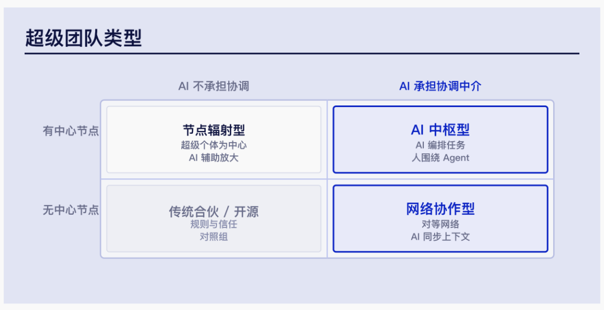左下象限（无中心节点 + AI不承担协调）并非空白地带，传统律所合伙制、开源社区（Linux kernel、Rust）、学术实验室联盟都落在这里。它们靠制度契约或社区规范维持对等协作，无需AI参与协调。我们不把它列为超级团队的主要形态，原因在于：这个象限的协调介质是规则和人际信任，协调成本随规模线性上升，缺乏AI带来的协调成本压缩效应。它是超级团队的前身和对照组，而非AI时代的新物种。三种主要形态由此浮现：节点辐射型、网络协作型、AI中枢型。它们可以并存于同一组织，也可随业务发展和技术成熟而自然过渡。3.1 三种超级团队形态节点辐射型：以超级个体为中心，AI是辅助节点辐射型的典型特征是：组织里有一到几个具备超级个体特征的核心节点，他们的判断力和执行力远超组织平均水平，组织资源围绕他们辐射展开。AI是这些核心节点的工具栈，让他们的辐射半径放大数倍，但AI本身不参与协调。辨识标准：去掉核心节点后，团队是否立即丧失方向感和执行力。如果答案是肯定的，说明组织围绕中心节点运转。强项：方向一致性强、决策速度快、启动门槛低。适合早期创业、组织转型初期、或团队内能力差距悬殊的场景。当方向不清、组织尚未形成新工作习惯时，核心节点的判断力就是团队最大的资产。边界：上限是中心节点的能力天花板。核心节点的认知带宽、精力极限和判断盲区，就是整个团队的天花板。如果团队要突破这个上限，必须转向网络协作型或引入更多核心节点。单点故障风险也是这种形态的结构性弱点：核心节点一旦缺位，团队可能迅速失速。代表案例：安克创新的6人小组：原来10人的团队调整为6人，大New人（懂业务+会用AI+能构建AI智能体）负责方向和判断，小New人（用好AI平台工具，效率提升3到5倍）负责执行和交付，整个单元围绕大New人运转。特赞的Pod：是节点辐射型和网络协作型的交叉，3到10人的闭环小组形成对等网络，但pod leader目前还承担着核心节点的作用，单元的扩充速度和上限，比较依赖pod leader的能力素质。网络协作型：无中心的对等网络，AI承担协调但不指挥网络协作型的核心特征是：没有唯一中心，多个超级个体各自发挥所长，彼此通过共同命题而非层级关系连接。AI在这里已经不止是各自的效率工具，它承担起了节点之间的协调中介：信息路由、上下文同步、任务衔接，很大程度上由AI和透明系统接管，不再依赖一个中心人物去调度。它和AI中枢型的区别只在一处：这里的AI是连接所有对等节点的协调介质，没有谁（包括AI）坐在指挥位上主动编排；AI中枢型则把AI升格成了那个主动编排的中心节点。辨识标准：每个核心成员是否都具备完整闭环能力（而非单一技能），且彼此之间没有固定的汇报关系。如果任何一个节点离开，团队会受损但不会瘫痪，这是网络协作型的韧性标志。强项：适应性强、韧性高、决策的多维度性更好。多个独立视角并行思考同一问题，减少了单点盲区。这种形态天然适合需要创新、探索、快速迭代的场景。边界：最硬的门槛是人才密度。每个节点都得是能独立闭环的超级个体，招聘标准因此极为严苛；达不到这个密度，对等网络就会退化成一堆各干各的人。第二重边界来自"没有中心"本身：AI能接管信息同步和上下文对齐，却替不了价值判断和拍板，一旦方向出现分歧或需要艰难取舍，对等网络的收敛速度会明显慢于有中心节点的团队。规模也有天花板，超过邓巴数量级，纯靠对等信任和透明度维持同步会越来越吃力。代表案例：CodeBuddy：三层架构（专业层IC、领域层、产品层），大仓monorepo，全员可读可写文档，20多个领域Owner大部分是普通IC，没有部门墙，几乎没有过程会议，每天发版，50人到160人始终保持小Feature Team。Anthropic：全公司只有一个技术职称MTS（Member of Technical Staff），不分研究员和工程师，身份等级被抹平，没有谁是固定的中心。协调几乎不靠管理动作：Slack广播、Claude Code的工作过程天然可追溯、Prototype First跳过PRD，透明成了AI工作流的副产品，节点之间靠这套透明基础设施自动对齐，把中层传递省掉了。Kimi：没有部门、没有职级、没有Title、没有OKR、没有KPI、没有打卡，300人，五位联创每人直接对接40到50人，需要谁配合直接找他不经过领导。AI中枢型：AI是协调中介，人围绕Agent工作AI中枢型的根本特征是：AI是组织的协调中心。任务分配、信息同步、决策路由、甚至跨项目协作，都通过AI来完成。人和Agent共同组成工作网络，Agent处在网络的中枢位置。辨识标准：AI是否主动编排任务、路由信息、管理工作流。如果团队的任务分配和信息同步主要由AI来做，且人之间的协调成本被AI系统性地吸收，是AI中枢型。更前沿的标志是Agent-to-Agent协作的出现，不同项目的Agent可以直接交互，无需人工中转。强项：协调成本被AI吸收后，团队可以在极少人力下运转极高产出。非技术人员也能通过Agent独立完成原本需要专业支持的工作，组织内的能力民主化程度最高。这种形态对规模的适应性也更强：AI的协调能力不像人的管理幅度那样有硬性上限。边界：这是当前最前沿也最不成熟的形态。高度模糊的人际冲突AI无法处理，需要情感共鸣和信任建立的场景仍需人际直接互动，涉及创新方向判断的决策仍然依赖人类的直觉和审美。技术基础设施的门槛也更高：需要成熟的Agent平台和上下文工程能力作为支撑。代表案例：出门问问：CodeBanana平台让每个项目的Team Agent成为项目的核心身份，人围绕Agent工作而非相反；A2A功能（Agent-to-Agent）让不同项目的Agent直接协作，无需人工中转。Block：四层架构（能力层、世界模型层、智能层、界面层）中，世界模型基于全公司的代码提交、讨论记录、设计文档实时维护运营全景图，系统性地替代了传统中层管理者"收集信息、理解业务、分配任务、维持对齐"的职能，客户问题的处理周期从两周压缩到当日。Multica：4人加几十个Agent，做的是 Agent 的编排与协作层产品，日常工作模式是创建要做的事情，分配给对应的 Agent 或者 Agent Team，人只需要最终去做一个 review ，Agent的闲置率成为组织和个体的评估的标准。3.2 并存、过渡与张力三种形态可以在同一个组织中并存。一个大型组织内部，不同业务线、不同发展阶段的团队，完全可能同时呈现三种形态：转型期的新业务可能是节点辐射型（创始人带队冲锋），成熟的技术团队可能是网络协作型（多个技术负责人平等协作），而流程标准化程度高的运营团队可能最先进入AI中枢型。演化方向也非单行道。一个团队可能从节点辐射型起步，随着更多核心成员成长为超级个体，逐渐过渡到网络协作型；当AI从连接对等节点的协调介质，进一步升格为主动编排任务、路由决策的中枢时，又可能向AI中枢型演进。反过来，当AI中枢出现能力边界时，团队可能在局部回退到人主导的协作模式。三种形态比的是同样人数下能接住多大的协调复杂度，虽然三种模式下，AI 是目前唯一一种协调能力不受人类管理幅度硬约束的介质，但我们不认为它会很快普及，它高度依赖 Agent 平台与上下文工程的成熟，而今天多数团队连第一阶的信息透明都还没真正做到。把不同组织的实践放在一起看，几个结构性张力值得注意：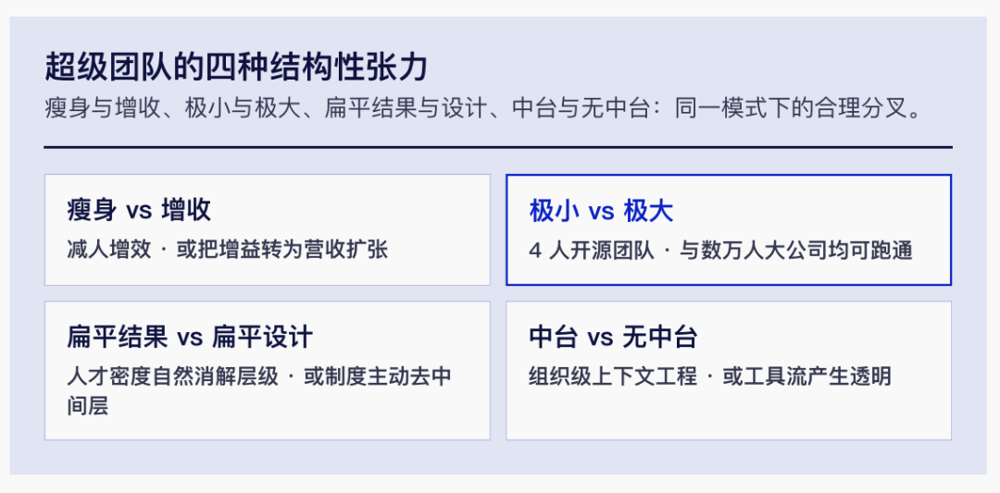瘦身 vs 不瘦身：有的组织选择"减人增效"，大幅缩减团队规模，用AI吸收被释放的工作量；有的组织选择"增收增效"，人数不变甚至增加，但把效率增益转化为营收增长。两种路径都成立，区别取决于组织文化、业务模型和所处发展阶段。极小 vs 极大：4人的开源团队和数万人的跨国公司都跑得通超级团队模式。这说明"超级团队"不必小，但必须有清晰的人与Agent之间的角色边界。扁平结果 vs 扁平设计：有些组织的扁平是业务要求的结果：因为人才密度高、个体闭环能力强，层级自然消解；有些组织的扁平是系统设计出来的：通过制度和平台主动去掉中间层。两种都有效，但混在一起讲就容易产生误导：扁平本身只是手段，目的是与业务匹配。上下文中台 vs 不上中台：一些组织在做"组织级上下文工程"，建中台来统一管理知识、规范和上下文；另一些组织反向操作，不上新中台，让工具和工作流本身产生透明性。这是两种不同的技术哲学，对组织来说都是合理选择。  

**  
**

**  
**

**第四章：超级团队的运作机制**

形态是静态的切片，运作机制才是让超级团队真正运转起来的动力系统。我们调研的所有标杆样本，没有一家在用传统意义上的 KPI、中层管理、审批流。这并非巧合。传统机制为标准化协作设计，超级团队的协作目标则不同。我们想提一个判断：这些团队真正退场的，与其说是 KPI 或审批本身，更是用管理替代信任这套逻辑：当信息足够透明、个体足够强，管理动作就从控制收缩为校准，剩下的交给人和 Agent 自己跑。但运作机制不会消失，它只是换了形式。规模决定了机制的重量：5到50人是自治的甜蜜点，信任基于直接接触，沟通走非正式渠道，决策快速达成共识；50到300人需要引入AI协调机制；300人以上必须建立系统化的信息基础设施。Kimi有意将规模控制在500人以内，Block面对6000人的规模选择了世界模型这一重型基础设施。本报告关于5-50人甜蜜点、15-20人协调上限的判断，来自我们对十余个标杆团队的田野观察：在这些样本中，超级团队的核心协作单元几乎全部落在这个区间，超出后要么主动分裂（CodeBuddy的Feature Team），要么引入系统级协调基础设施（Block的世界模型）。本章从决策、协调、技术地基、激励和与大组织的关系五个维度，拆解超级团队的内部运作逻辑。4.1 决策机制：无最优解，只有条件适配我们调研的案例展示了四种截然不同的决策模式。如果按决策权集中在谁手里这个维度排列，它们形成一个从集中到分散的光谱：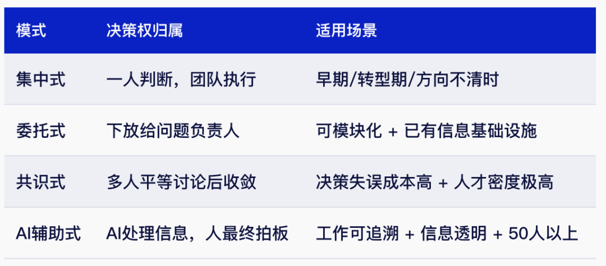集中式（创始人拍板）：在方向不清、团队尚未形成AI原生工作习惯时，可能是最高效的决策模式。方向一致性最强、执行损耗最小，但天然存在CEO认知和带宽的天花板。Rokid创始人祝铭明的做法是这种模式的一个有趣演化：他把CEO角色压缩为只做两件事：Gate Keeper（以挑剔用户的角度把关产品质量）和Trouble Maker（当团队在舒适区待太久时抛出挑战目标）。决策权仍然集中，但集中在方向判断和质量底线上。日常执行交给"事情带着人跑"的任务驱动机制。委托式（DRI制）：从人的等级制转向问题的所有权制。每个DRI（直接负责人）在90天周期内拥有特定跨职能问题的完全所有权和资源调度权：在这个窗口内他就是这个问题的CEO。Block的实践显示，配合世界模型提供全局信息支撑后，客户问题的处理从两周压缩到当日。这种模式要求组织已经具备成熟的信息基础设施，否则DRI无法获得做出高质量决策所需的上下文。共识式（蜂群决策）：多个独立视角并行思考同一个问题，通过综合论证达成共识。核心优势是减少单点盲区，代价是速度：充分讨论意味着更长的决策周期。Kimi五位联创每人直接对接40到50人，把决策链压到极致。这种模式对人才密度要求极高，每个参与决策的人都必须有独立判断能力。AI辅助式（AI参与决策流程）：AI在决策中承担不同深度的角色。较浅的一端是CodeBuddy的做法：AI分析代码提交历史，自动推荐任务分配给最合适的人，决策的信息基础更扎实。较深的一端是李志飞的做法：每一次管理沟通都先经过AI结构化和去噪，"人类的消息不会直接到达另一个人类"，AI成为决策的预处理器。两者的共同点是：人仍然做最终判断，但AI系统性地提升了判断所依据的信息质量。 4.2 协调方式：从信息透明到AI主动编排AI协调有三阶演进：信息透明化 → 信息路由替代中层 → 主动任务编排。大部分团队仍在第一阶段，少数团队进入了第二、三阶段的探索。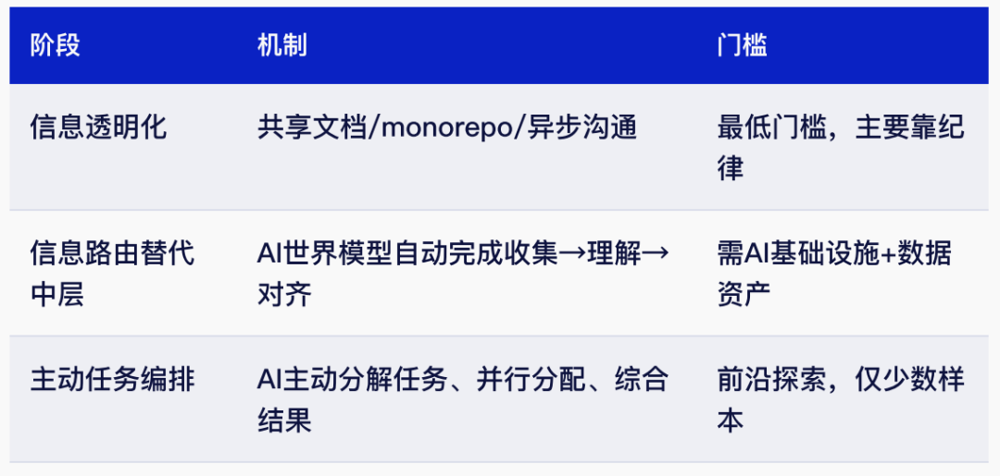第一阶段的纪律性最容易被低估。CodeBuddy的全员可读可写文档听起来简单，实际上需要团队明确接受我的工作上下文是公共资产：这件事在传统组织里几乎不可能跑通，因为它和我的能力=我的不可替代性的旧逻辑冲突。这一步迈不过去，后面两阶都无从谈起。第二阶段需要硬投入。Block的世界模型层需要把整个组织的所有数据（客户、产品、决策、风险）建模成可被AI理解的图谱，这是几年级别的工程。回报是决策周期从2周压缩到一天内。第三阶段目前是前沿探索。ColaOS的Agent组织、Multica的Orchestrator/Worker/Validator三类Agent、Manus的多Agent工作流，代表了AI主动编排的方向。核心挑战不在技术：Multi-Agent协调已经可以做到，难的是组织对AI作为协调主体的接受度。Anthropic恰恰提供了一个反向参照：它并没有走到AI主动编排这一步，靠把透明做到副产品级（Slack广播、Claude Code工作过程天然可追溯、Prototype First跳过PRD），就让强协调在没有中枢的情况下自然发生了。这指向一个判断：当AI成为每个人的工作基础设施时，透明是AI工作流的副产品，不必先建一套透明系统再用AI。这个认知顺序，对那些还想着先搭中台再上AI的组织尤其有参考价值。人际信任的不可替代边界：AI协调三阶演进不意味着人际信任会被消解。模糊的人际冲突、情感共鸣、信任建立、创新方向判断：这些事AI不会做得比人更好。Kimi的直接沟通文化的说明是：300人以内的高密度组织，人际直接沟通可能比AI中转更高效。AI中枢化适合规模和复杂度突破邓巴数的场景，对小团队未必适用。4.3 技术地基：把AI长成组织的一部分超级团队的决策、协调、激励机制要跑通，必须有一套AI嵌入所有工作流的基础设施作为底座。我们调研的案例在技术选型上差异巨大，但抽象来看，技术地基需要解决三个层次的问题：每一层解决不了，上面的机制就跑不起来：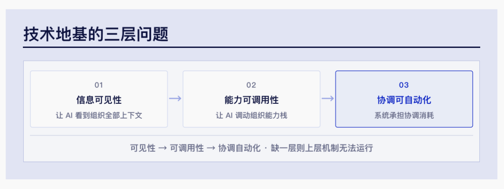最基础的是信息可见性：让AI看到组织的全部上下文。如果AI只能看到一个人屏幕上的内容，它就只能做个人助手；如果AI能看到整个代码库、所有文档、全部业务数据，它才有可能参与组织级的协调。CodeBuddy用monorepo加全员可读可写文档解决这个问题：看似朴素，但这恰恰是AI参与协调的前置条件。Anthropic的解法更自然：Claude Code加上Claude.md本身就是工作基础设施，工作过程自动生成组织的上下文，工具和产物是同一件事。第二层要解决的是能力可调用性：让AI能调动组织的能力栈。光看到信息不够，AI还需要能动手：调用公司的各种能力模块来完成任务。Block的技术地基是开源AI编程工具Goose加上60多个内部MCP服务器，效果是任何一个工程师都能在自己的工作流里调用整个公司的能力栈，能力不再被锁在某个团队的API后面。安克创新则自研了企业通用AI操作系统APPS，把感知-决策-控制-反馈作为统一模式映射到所有业务场景。最激进的是第三层：协调可自动化，把协调这件事从人的日常消耗中抽离出来，交给系统承担。出门问问的CodeBanana、ColaOS的Agent架构、Multica的三类Agent角色（Orchestrator、Worker、Validator），以及Manus的多agent工作流，都在朝这个方向走。当AI开始编排任务、路由信息、同步上下文时，组织的协调成本会被系统性地压低。三层之下，还有一个容易被忽略的底座："驾驭工程"（Harness Engineering）。"Prompt Engineering解决"怎么问"，Context Engineering解决"AI看到什么"，Harness Engineering解决"AI在什么环境里工作"：知识资产、上下文供给、Skill维护、规则维护，这些是让AI能稳定工作的环境工程。"模型能力的上限由用模型的人和团队决定。这也是为什么超级团队比超级个体更强：单点的驾驭能力上限有限，复数的人在不同维度同时驾驭，能力上限是几何级的。4.4 激励机制：KPI失效后什么有效传统KPI在AI时代失效了。当团队中存在10到100倍的效率差时，传统绩效体系找不到锚点。我们在调研中发现，各案例给出的激励解法差异很大，但如果按激励什么来归类，可以分为四个维度：每一个都不可或缺，缺了任何一个，超级个体就会流失或降低投入。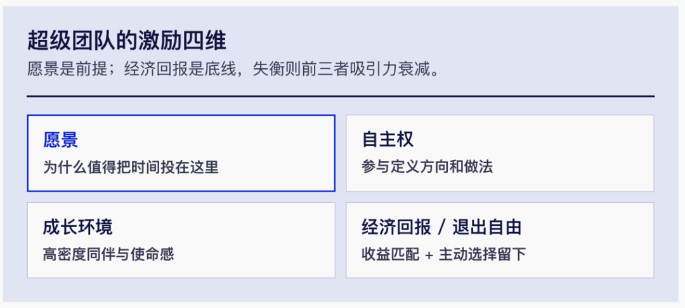前提：愿景：为什么选择把时间投在这里在讨论具体的激励维度之前，有一个前提必须先说清楚：超级个体不缺能力，AI又进一步放大了能力，能不能做不再是问题。真正稀缺的是为什么做。愿景提供的是方向感和意义感：它回答的是我为什么选择把时间投在这里，而非选择独自创业。一句空洞的使命宣言解决不了这个问题。我们在调研中看到的有效愿景，有几个共同特征：它足够大（Kimi的我们在做AGI）、足够真（Anthropic的你在做的事可能改变世界是团队每天能感受到的实际进展）、足够个人化（郝景芳的志同道合：每个人留下来是因为认同这件事本身）。愿景的激励作用在超级团队中比传统组织更加关键。传统组织中，即使愿景模糊，人们仍然会因为薪酬、职级、惯性而留下来。但超级个体有极强的自闭环能力和市场议价权，留住他们的唯一理由是这里正在做的事情值得我参与。如果团队无法提供一个让超级个体觉得这件事比我自己单干更有意义的愿景，再好的自主权和薪酬设计都无法持续。维度一：自主权：让我决定做什么、怎么做这是我们在调研中听到的最高频答案。当AI把执行层的活接走之后，吸引超级个体留下来的是你能参与定义方向。CodeBuddy的做法是让团队自己决定怎么做，自己挑硬骨头啃。subo的感受很直接：战术执行不成为问题的时候，战略就很重要。Block用DRI制把自主权制度化：90天内你就是这个问题的CEO，拥有跨职能问题的完全所有权和资源调度权。这是权力激励，金钱激励次之。维度二：成长环境：高密度同伴与使命感超级个体被和谁一起做、做的事有多难驱动。Kimi用使命感加邓巴数内的人才密度维系组织：300人都觉得自己是AGI攻关者，没有OKR、没有KPI、没有打卡，维系组织的是使命本身和身边人的质量。Anthropic用统一职称MTS（Member of Technical Staff）消除身份等级，看重实际成就，学历资历次之，激励来自你在做的事情可能改变世界。维度三：经济回报：产出如何被公平定价这是最难的一个维度，也是目前所有案例都没有完全解决的问题。传统薪酬体系围绕岗位和层级设计，产出维度的考量相对薄弱，这本身就是一个结构性困境：一个一线工程师可能贡献了关键创意并亲手推出了产品，但在现有体系中，最大的激励往往给到了管理干部，因为薪酬绑定的是职级薪酬绑定职级，真实贡献被忽略。当执行能力被AI大幅拉平之后，判断力和创造力的价值急剧上升，但现有薪酬框架无法体现这种价值迁移。一旦超级个体感觉到自己的10倍产出只换来1.2倍的回报，他要么离开去创业，要么降低投入回归正常产出水平。无论哪种结果，组织都是输家。这是可预期的后果。安克的探索是建立可观测体系：追踪Token 消耗，完成任务使用工具等，通过可观测模型评估每个员工的 AI 意愿、AI 能力和 AI 价值产出，并给每个员工配备了 AI 观察员，按照个人和部门进行排名。AI咨询公司Tenex则完全按产出付费。Pure Global是所有人都在一线面向客户和销售，从销售中获得分成。这些模式能否移植到大组织仍是未知的。大组织面临三个额外约束：内部公平性（同一职级薪酬差异太大会撕裂团队）、衡量标准（代码类工作可以量化，但并非所有工作都如此）、管理者角色（如果一线产出者收入超过管理者，管理者的定位怎么重新锚定）。维度四：退出自由：不靠锁定留人，靠值得留人这是最反直觉的一个激励维度。Albert Hirschman在《退出、呼吁与忠诚》16中提出过一个洞察：当一个人知道自己随时可以自由离开时，他留下来的每一天都是主动选择，投入度远高于被迫绑定。郝景芳把童行书院拆成9家独立小公司，维系大家的就是四个字：志同道合，没有任何强约束强绑定。Netflix的股权设计也体现了这个逻辑：所有期权立即归属，无锁定期，员工随时可以带走自己赚得的一切离开。前首席人才官Patty McCord的原话是：如果你不想再和我们合作，我们不想把你当人质。退出自由本身就是激励的一部分：当一个人知道自己随时可以走，他留下来的每一天都是主动选择，主动选择留下，而非被动绑定。激励的整体逻辑四个维度合在一起看，一个清晰的共性浮现出来：自主权、成长环境和退出自由才是超级个体的核心三要素：但经济回报是底线，一旦失衡，前三者的吸引力会迅速衰减。我们在多个访谈里听到了自费打工有点累的反馈。用AI提效后能力边界扩张，优秀的人自发承担了更多，但回报结构和价值感锚点没跟上。自主权和成长环境仍然吸引人，但当经济回报长期不匹配时，倦怠是必然结果。ColaOS创始人橘子从另一个角度重新定义了激励：超级组织的标志是能把效率转化为营收增长。把效率提升作为核心指标的组织走向裁员，把营收增长作为核心指标的组织走向扩张。对超级个体而言，最好的激励是：你的高效产出打开了新的业务空间，而你能分享这个增长。谁先解决经济回报与产出匹配的问题，谁就能留住超级个体；谁解决不了，超级个体就会用脚投票。4.5 与大组织的关系超级团队和大组织的关系有三种模式，关键变量是文化纯粹性能否守住。在展开三种模式之前，有必要先解释一个结构性问题：为什么大组织天然倾向于压制超级个体？这是组织结构的数学性质使然。Conway在1968年提出的判断15至今仍被反复验证：一个系统的设计，会不可避免地映射出设计它的组织沟通结构。岗位怎么切，产品就怎么切；权限怎么分，系统边界就怎么长。大组织为了规模化协作，必须把人切成角色、把工作切成模块、把决策切成层级：这些切分每一刀都在增加跨边界行动的成本。回到引言提出的那个公式：组织竞争力 = 人才密度 × AI杠杆 / 组织摩擦。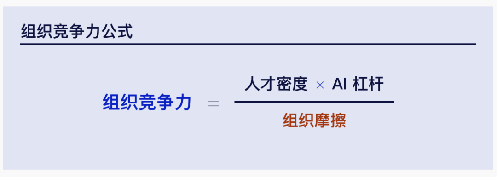超级个体之所以效率惊人，根本原因是一个人的自闭环链路上几乎没有摩擦：没有等待别人排期、没有跨部门对齐会、没有审批流程、没有信息在层级间的衰减。而一旦进入多人协作，每增加一个节点、一层审批、一次跨部门沟通，摩擦就会上升。当组织摩擦足够大时，再高的人才密度和AI杠杆也会被分母吃掉。这就是为什么很多大组织看起来采用了AI但效果有限：它们提升了分子（给员工配了AI工具），却没有降低分母（组织摩擦依然照旧）。超级团队的本质优势，正是在保持协作价值的同时把摩擦降到极低。理解了这个结构性张力，再来看三种模式：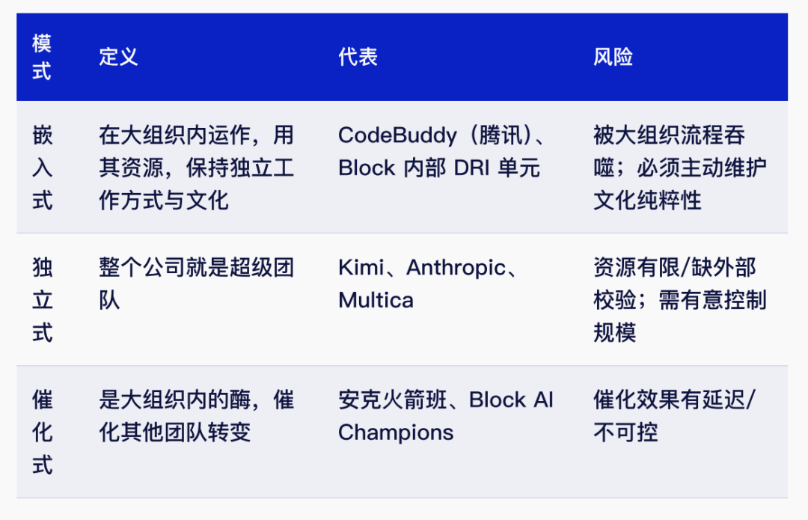嵌入式（CodeBuddy）：利用大组织资源但保持独立文化，关键是文化隔离。优势是资源充沛、风险兜底；风险是大组织的流程和文化惯性可能逐渐侵蚀超级团队的独特性。独立式（Kimi、Anthropic）：通过有意控制规模保持超级团队特征。优势是文化纯粹、决策快速；风险是资源有限、缺乏外部校验。催化式（安克创新）：火箭班模式，超级团队是大组织内的酶，催化其他团队的转变。最大价值在于它是唯一一种能够让大组织整体受益的模式。嵌入式最难走通的部分是文化保护。超级团队的文化不会自然维持，当团队中出现与协作基础冲突的行为模式时：比如地盘意识、信息封锁：管理者必须果断做出调整，即便这在大组织温和的文化语境中显得激进。不主动维护文化纯粹性，超级团队的协作基础就会被旧逻辑反向侵蚀。独立式最难走通的部分是规模克制。Kimi 主动选择不超过 500 人，这在融资压力下需要持续的纪律。一个超级团队一旦决定我们要规模化，往往就在结构上自我消解了。催化式最难走通的部分是催化效果的延迟性。安克火箭班学员回到原团队后，他们的新能力是否真的能带动团队？这件事需要 6-12 个月才能看出来，期间组织必须保持耐心。

**  
**

**  
**

**第五章：如果你在这些团队里**

前面四章讲的是框架和机制。这一章我们换一种方式：让你走进这些团队，从一个超级个体的视角，感受每天的工作是什么样的。同样的超级团队四个字，在不同组织中的日常体验截然不同。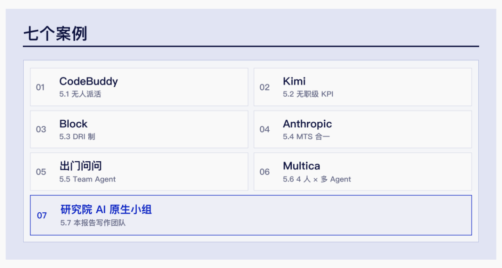5.1 在CodeBuddy：没有人给你派活假设你是CodeBuddy的一名工程师。早上打开电脑，没有人给你分配今天的任务。你打开monorepo：整个团队的代码库，所有人可读可写。AI已经根据你过去的代码提交历史，推荐了几个和你专业领域匹配的待解问题。你挑了一个，不需要跟任何人申请，直接开始做。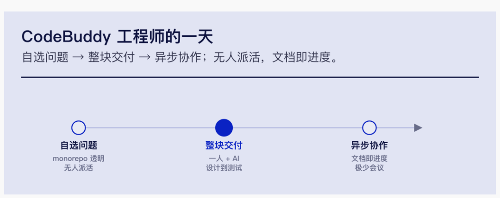你拿到的是一整块功能。从设计到实现到测试，你和AI协作完成，不需要把半成品传给下一个人。subo说过：AI时代任务越拆越大：整块交给一个人加AI，比切碎分给五个人再拼装要快得多。你几乎不开会。进展和决策都写在透明文档里，谁需要谁自己去看。每天发版，节奏远快于两周一个Sprint。如果你想帮隔壁同事解决一个问题，直接动手就行：谁都可以帮谁做，帮你做了我也不会危险。这个团队从50人扩到了160人，但保持着小Feature Team的模式。每个人都是原子级的存在，可以灵活组合，不被绑定在某个固定小组里。  
5.2 在Kimi：没有部门、没有职级、没有KPI假设你是月之暗面的一名工程师。你没有Title，没有职级，没有OKR，不需要打卡。公司300人，你认识其中大部分。你需要谁配合，直接去找他，不需要经过任何领导。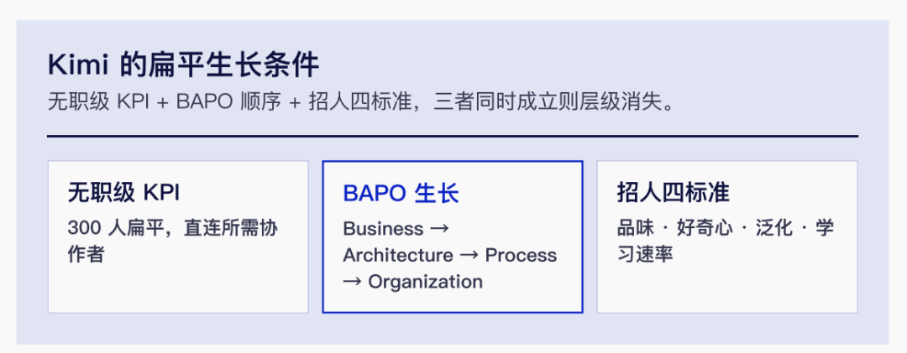五位联合创始人每人直接对接40到50个人，包括你。你有问题可以直接找联创聊。没有中间层翻译你的想法，也没有人替你过滤信息。你被招进来的标准是四样东西：品味（Taste）、好奇心、泛化能力和学习速率。创始人杨植麟喜欢基础模型型人才：像大语言模型一样什么都能学、什么都能做的人，而非KPI体系里过度拟合的专家。这里的组织形态是自然生长出来的。它之所以扁平，是因为人才密度足够高、每个人都能独立交付完整价值、业务和架构先行而组织后行（BAPO）。三个条件同时成立，层级就自然消失了。但你偶尔也会有一种失重感：没有KPI意味着没有人告诉你做到这里就够了。方向感完全靠自己对使命的理解来锚定。5.3 在Block：你是一个问题的CEO假设你刚被任命为Block的一名DRI（Directly Responsible Individual）。接下来90天，你拥有一个特定跨职能问题的完全所有权。你可以从任何团队拉人：工程师、设计师、数据科学家：不需要他们原来的领导批准。在这90天里，这个问题就是你的公司，你就是它的CEO。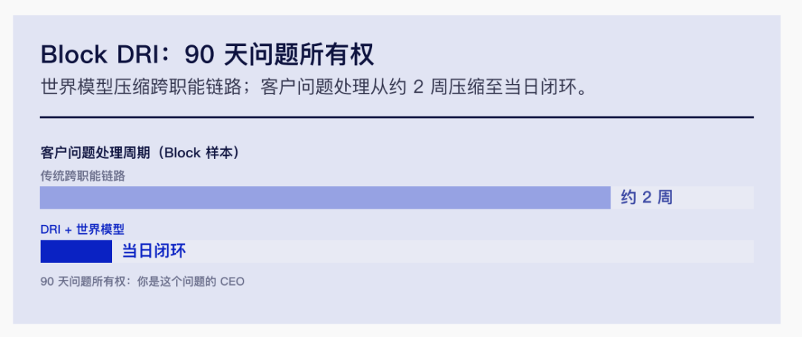你的信息来源是世界模型：一个基于全公司代码提交、讨论记录、设计文档实时维护的运营全景图。过去一个客户问题从发现到解决需要两周（经历工单→支持经理→产品经理→跨团队会议→IC执行→逐级回报），现在你直接看到问题、直接处理，当日完成。你来开会带着你用AI搭建的可交互原型。会上直接在原型上改。决策从听完再拍板变成了看到就能动。这家公司刚刚从10000人裁到6000人，因为Dorsey判断：AI能做的事不需要人做，人应该做AI做不了的事。而且这一刀是在业绩强劲时砍下的，上季度毛利润增长超过预期，市场用24%的盘后涨幅认可了这个判断。  
5.4 在Anthropic：研究员和工程师是同一个人假设你是Anthropic的一名MTS（Member of Technical Staff）。这是公司里唯一的技术职称：不分研究员和工程师，所有人都叫MTS。你上午可能在设计一个对齐实验，下午就自己写代码实现它。没有人会拒绝你做这件事。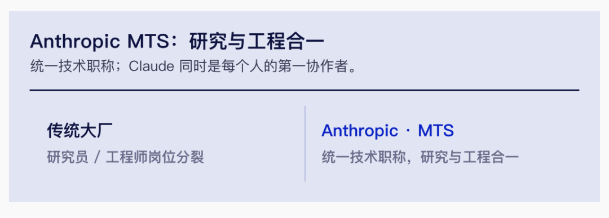你被招进来看的是实际成就，看重能力，不看重学历。公司不强制要求大学学位或机器学习经验：独立研究成果、有见地的博客文章、开源领域的重大贡献。面试官在意的是你能不能独立思考和独立产出，不看简历上写了什么。每两周有一次DVQ（Dario Vision Quest）全体会议。CEO Dario Amodei准备3到4页文档，讲一个小时，内容从产品战略到地缘政治什么都聊，用的全是大白话，不讲任何公司化的套话。他40%的工作时间花在文化建设上：在一家正在争夺AI竞赛头部位置的公司里，这个比例本身就是一种选择。你工作中80%到90%的问题会先问Claude。因为它确实比问同事更快更全。Claude在这里同时是每个人的第一协作者。  
5.5 在出门问问：你围绕Agent工作，Agent不围绕你工作假设你是出门问问的一名员工。你的工作围绕你所在项目的Team Agent展开。每个项目有一个Agent作为核心身份：它知道项目的全部上下文、进展、待办和风险。你每天的工作从和这个Agent对话开始。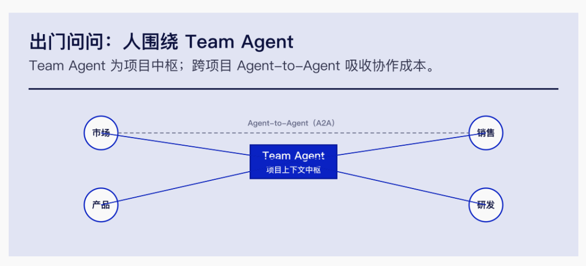如果你是市场部的人，你不需要等IT帮你建数据看板，你自己通过Agent就能建。如果你是销售，你不需要提需求等CRM系统排期，你自己就能搭。过去需要提需求→排期→等开发→验收的事情，现在你直接做了。更前沿的是：不同项目的Agent之间可以直接对话（A2A）。你的市场Agent需要一个技术数据，不用你去约研发的人开会，市场Agent直接调用研发Agent就拿到了。跨部门协作的成本被Agent吸收了。这家公司从300人压缩到了150人，效率反而提升了4到5倍。标书从两周变成5分钟，60页PPT从六个人干两周变成两天完成。CEO李志飞坦言：我给员工的沟通基本都是通过AI加工过的，人类的消息不会直接到达另一个人类。  
5.6 在Multica：4个人，几十个Agent，霸榜GitHub假设你是Multica团队的一员。团队一共4个人，你们连续霸榜GitHub Trending，一周涨12000个Star。平台上每10秒触发一个Agent任务。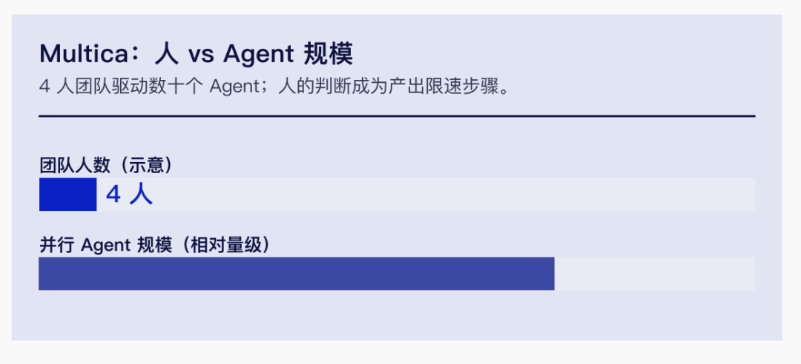你没有固定岗位。一件事从PRD到研发到测试验收，整条链路由你一个人加Agent完成。没有人给你做信息传递：创始人张佳圆的逻辑是：既然中间那个人只是在传话，为什么不拿掉，让你直接和Agent沟通？你一周只有两个固定会议：周一的Weekly Planning（Agent提前准备好会议文档和上周数据分析）和每天晚上6点的demo站会（Agent把今天的代码提交整理好，demo完没问题直接部署上线）。其余时间，你和你的Agent群组在干活。张佳圆说了一句让你很有共鸣的话：整个组织的产出效率瓶颈，现在已经是人了，AI或Agent暂未成为瓶颈。你同意：你每天做的判断才是真正的限速步骤，AI的执行速度早已足够快。5.7 在腾讯研究院AI原生小组：写这份报告的团队本身最后一个案例是我们自己。如果前六个是我们走进别人的团队，这一个是把自己摊开来看。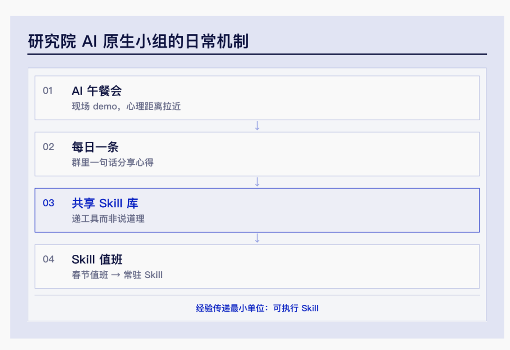假设你刚加入这个小组。没有人给你一份AI培训课程，也没有人让你先学完再动手。你会发现每天中午有一个AI午餐会：同事现场演示他昨天用AI做了什么好玩的事。你看到和你做类似工作的人用AI做出了让你惊讶的东西，心理距离一下就近了。你的微信群里每天都有人发一条AI使用心得：门槛极低，就是今天发现了一个好用的招。没人要求你写长文，一句话就行。你很快也开始发。然后你会接触到共享Skill库。一个同事把他调试好的AI Skill直接扔给你用，直接递给你一个能跑的工具。你拿来用，觉得哪里不对，自己改两下，改完再扔回去。经验传递在这里靠递工具。这个小组的起源是从推不动开始的。2025年上半年大部分研究员还在观望。转折发生在AI coding成熟之后：CodeBuddy和Claude Code从写代码工具变成了日常工作台，所有工作开始围绕把Agent作为同事展开。这个转折是自下而上加顶部认同加外部条件就绪三件事碰到了一起。单独任何一条都不够。2026年春节，小组没让人值班，让一个Skill值班。春节后这个Skill没有消失，还被持续迭代，成了日常基础设施。经验传递的最小单位从说一段话升级为递一个可执行的Skill：这可能是AI原生团队协作的最小原子。  

**  
**

**  
**

**结语：最小启动动作**

这份报告走了一条不常见的路：从田野观察出发。我们记录的是组织正在怎么长。如果一定要给这份报告一个收束的判断：AI时代的组织变革，需要的是更好的园丁。园丁不设计果实长成什么形状，园丁提供土壤、光照和水源。对组织而言，土壤是完整的问题和充足的工具，光照是成果被看见的机制，水源是持续的容错空间。超级个体和超级团队是在对的环境里自己长出来的。管理者要做的，是提供这个环境，然后克制住自己想去修剪的手。回到前面提出的公式：组织竞争力 = 人才密度 × AI杠杆 / 组织摩擦：园丁要做的事情对应公式的三项：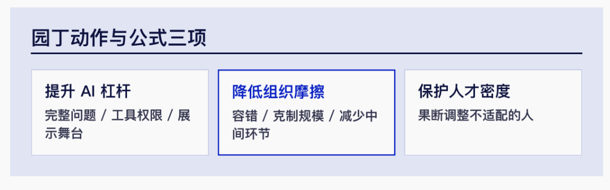提升AI杠杆：给完整问题、给工具权限、给展示舞台。 超级个体需要的是从问题定义到用户反馈的完整链路：只有拿到完整问题，AI杠杆才能作用于整条链路。工具权限必须到位：报销AI工具额度、开放数据权限、允许不经排期先做demo，这些是自闭环成立的基础设施。成果必须被看见：AI午餐会、demo day、每日一条心得分享，让一个人的突破变成团队的信号。降低组织摩擦：容错、克制规模、减少中间环节。 允许做了第二天撤掉：超级个体的成长路径是行动中学习，组织如果要求每次行动都经过完整论证才能开始，就等于在自闭环中间强插了一道审批。克制扩张冲动：超级团队的协调极限在15到20人，过了这条线组织摩擦会非线性上升，正确的做法是分裂繁殖，而非线性扩张。能砍掉的会议砍掉，能异步的沟通异步，每减少一个中间环节，AI的速度才能真正变成成果的速度。保护人才密度：果断调整不适配的人。 地盘意识、等待安排、拒绝信息透明：这三件事在传统组织里只是风格不同，在超级团队里是对协作基础的直接腐蚀。管理者在发现苗头时必须快速行动，不能等问题积累到不可收拾。人才密度更多时候靠不让错误的人稀释掉。管理者的最小启动动作如果一位管理者读完这份报告只能做一件事，我们的建议是：先找到组织中已经在自发使用AI的人，让他们的成果被看见。他们已经存在了。几乎每个组织中都有一小群人在工作之余自己摸索AI工具，做出了超出岗位预期的产出，但这些成果往往被封闭在个人屏幕后面：因为没有展示的场合，因为这不是正式项目，因为现有汇报结构不包含这类信息。管理者要做的第一步创造一个让这些人浮出水面的最小机制：一次demo展示、一个内部分享群、一句你用AI做的那个东西能不能给大家看看。第二步是围绕他们试点。不必全面铺开，选一个边界清晰的真实业务问题，把它完整地交给一个已经展现出自闭环能力的人或小组，给他们工具权限和三个月时间，看结果。试点的目的是让组织亲眼看到一个人/一个小组用AI做出了什么，这个亲眼看到的过程本身就是涌现的起点。最后提醒一点：管理者本人也需要亲自下场使用AI。不一定要写代码，但至少要体验过用AI完成一个完整任务的全过程：从提问到获得产出到判断质量到迭代修正。不亲自体验，就只能隔着汇报材料理解AI，而隔着材料理解AI和亲自用过AI，是两种完全不同的认知状态。最后，我们诚实地列出五个这份报告没有解决的问题：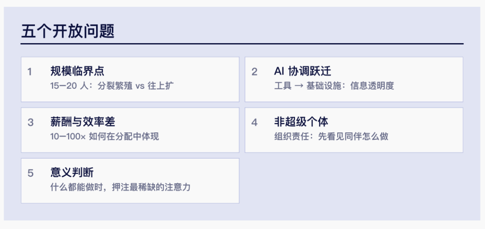1、超级团队规模逼近15-20人临界点时，应该往上扩还是分裂繁殖？ 两种选择各有代价，目前没有统一答案。我们目前的倾向是分裂繁殖：复制一块好土壤，通常比把一块土壤摊大更容易保住密度。2、AI协调从工具跃迁到基础设施的临界条件是什么？ 取决于规模和复杂度，但阈值在哪里尚不清楚。我们的倾向是，真正的触发点与其说是人数，更是信息透明度：当工作过程已经默认沉淀成 AI 可读的上下文，切换大概就到时候了。3、10-100倍效率差如何在薪酬体系中体现？ 目前没有公司给出可复制的答案。我们的倾向是，短期内无解的部分只能靠把营收做大再分配绕过去；按存量切，怎么切都容易撕裂。4、AI 时代并非所有人都能成为超级个体，组织中的其他人怎么办？ 这是这份报告刻意没有展开、但绕不开的问题。我们的倾向是，组织对这部分人负有真实责任，而可行的第一步往往是让他们先看见同伴怎么做：多数人卡在没见过，学不会的其实是少数。5、当AI让生产成本趋近于零、什么都能做的时候，做什么的判断从何而来？ 超级个体解决了能力问题，但没有解决意义问题。我们的倾向是，这恰恰是这个时代最不会被自动化的能力，值得一个人把最稀缺的注意力押在这里；意义没有标准答案，但回避它的人，会先被虚无追上。这份报告写的是我们看到的样本，而非我们规定的标准。2026年5月15日发布的《AI原生工作报告》回答的是AI原生工作怎么做，这份报告回答的是AI原生组织怎么长出来。两份报告共同构成了腾讯研究院AI原生小组在2026年上半年关于AI与组织关系的研究产出。超级个体是自下而上涌现的，超级团队也是。它们在对的人、对的工具、对的环境碰到一起时，自己生长出来。组织能做的最重要的事，是为这个生长过程持续提供养分和空间。我们要做的，是当一个好园丁。  
编委会与致谢顾问司晓，腾讯研究院院长、腾讯公司副总裁主笔袁晓辉，腾讯研究院副院长、资深专家（xiaohuiyuan@tencent.com）余一，腾讯研究院高级研究员（ameliayu@tencent.com）共创者李瑞龙、曹士圯、王鹏、王强、刘莫闲、吴朋阳、白惠天、王焕超特别致谢本报告缘起于《AI 时代的企业创新与转型》项目研究。在腾讯集团高级管理顾问杨国安教授的指导下，我们深度观察了美图、Rokid、Manus 等多家企业的 AI 转型进展；并基于腾讯研究院 AI 原生小组历时一年的变革实践与观察，对超级个体与超级团队的诸多问题进行了研究。此后，我们又先后深度调研了腾讯 CodeBuddy 团队、月之暗面、出门问问、特赞、安克创新、童行书院、超脑 AI 孵化器、flomo、Multica、ColaOS 、Pine、Cresta、Ventus AI、Superlinear、歸藏、花叔等企业、团队和超级个体，还通过AI调研员对数十位一线创始人与实践者进行了一手调研，同时参考了 Anthropic、Block、麦肯锡等机构的公开实践与研究。在此，谨向杨国安教授，以及所有支持和参与本次研究的企业、团队与朋友们，致以诚挚的感谢。

关注腾讯研究院公众号，在后台回复关键词“超级个体2026”，获取精致排版的PDF报告。

******参考资料：******

  

\[1\] Stanford HAI, Artificial Intelligence Index Report 2025, April 2025. https://hai.stanford.edu/ai-index/2025-ai-index-report\[2\] McKinsey & Company, The State of AI: Global Survey 2025, 2025. https://www.mckinsey.com/capabilities/quantumblack/our-insights/the-state-of-ai\[3\] Jack Dorsey & Roelof Botha, From Hierarchy to Intelligence, Block, 2026. https://block.xyz/inside/from-hierarchy-to-intelligence\[4\] Peter Drucker, The Effective Executive, Harper & Row, 1966.\[5\] Richard Florida, The Rise of the Creative Class: And How It's Transforming Work, Leisure, Community, and Everyday Life, Basic Books, 2002.\[6\] Paul Jarvis, Company of One: Why Staying Small Is the Next Big Thing for Business, Houghton Mifflin Harcourt, 2019.\[7\] Anthropic, Estimating AI Productivity Gains, November 2025. https://www.anthropic.com/research/estimating-productivity-gains\[8\] Harvard Data Science Review, The Agent-Centric Enterprise: Why 2–10x Productivity Gains Demand Radical Workflow Redesign, January 2026. https://hdsr.mitpress.mit.edu/pub/0mrfxamu\[9\] Carta, Solo Founders Report 2025, 2025. https://carta.com/data/solo-founders-2025/\[10\] McKinsey Global Institute, Agents, Robots, and Us: Skill Partnerships in the Age of AI, November 2025. https://www.mckinsey.com/mgi/our-research/agents-robots-and-us-skill-partnerships-in-the-age-of-ai\[11\] Nassim Nicholas Taleb, Antifragile: Things That Gain from Disorder, Random House, 2012.\[12\] Sophie Leroy, Why Is It So Hard to Do My Work? The Challenge of Attention Residue When Switching Between Work Tasks, Organizational Behavior and Human Decision Processes, Vol. 109, Issue 2, 2009. https://psycnet.apa.org/record/2009-10822-007\[13\] Boris Groysberg, Ashish Nanda, Nitin Nohria, Can They Take It with Them? The Portability of Star Knowledge Workers' Performance, Management Science, 2008. https://www.hbs.edu/faculty/Pages/item.aspx?num=30726\[14\] Paul Romer, Endogenous Technological Change, Journal of Political Economy, Vol. 98, No. 5, 1990.\[15\] Melvin E. Conway, How Do Committees Invent?, Datamation, April 1968. https://www.melconway.com/Home/pdf/committees.pdf\[16\] Albert O. Hirschman, Exit, Voice, and Loyalty: Responses to Decline in Firms, Organizations, and States, Harvard University Press, 1970.\[17\] Reed Hastings & Erin Meyer, No Rules Rules: Netflix and the Culture of Reinvention, Penguin Press, 2020. https://ravio.com/blog/compensation-strategy-examples-netflix\[18\] WinSavvy, Solo Founders vs Cofounders: Who Fails More? \[Stats Inside\], 2024-2025. https://www.winsavvy.com/solo-founders-vs-cofounders-who-fails-more-stats-inside/\[19\] Josh Kopelman, First Round Capital, The 10 Year Project, 2015. http://10years.firstround.com/\[20\] GitHub, GitHub Copilot is generally available to all developers, June 2022. https://github.blog/news-insights/product-news/github-copilot-is-generally-available-to-all-developers/\[21\] GitHub, The economic impact of the AI-powered developer lifecycle and lessons from GitHub Copilot, 2023.\[22\] 腾讯，《2025 腾讯研发大数据报告》，2025-10-24 发布. https://cloud.tencent.com/developer/news/3143570\[23\] Gloria Mark, Gudith & Klocke, CHI 2004/2005. https://news.gallup.com/businessjournal/23146/too-many-interruptions-work.aspx\[24\] William Buck, Assessing the impact of key person risk on business valuation; IRS Revenue Ruling 59-60.\[25\] Oliver Schilke & Fabrice Lumineau, How Organizational is Interorganizational Trust? Academy of Management Review, forthcoming \(SSRN 2023\). https://ssrn.com/abstract=4520242\[26\] 南方财经网，大湾区『一人公司』批量生长，记者探营 OPC 社区，2026-04-28. https://www.sfccn.com/2026/4-29/2OMDE0ODFfMTk5NDg2OQ.html\[27\] Inga J. Hoever, Daan van Knippenberg, Wendy P. van Ginkel & Harry G. Barkema, Fostering Team Creativity: Perspective Taking as Key to Unlocking Diversity's Potential, Journal of Applied Psychology, 97\(5\), 2012, 982–996. https://doi.org/10.1037/a0029159  
**推荐阅读**  

**腾讯研究院：**[ 《AI破晓：生成式AI时代文化产业的重塑、跃迁与守望｜4万字报告》](https://mp.weixin.qq.com/s?__biz=MjM5OTE0ODA2MQ==&mid=2650997232&idx=1&sn=61988cfc49acb760a8a57b7023d775c3&scene=21#wechat_redirect)

腾讯研究院：[《一个理想的组织，是AI Agent在组织人｜AI跃迁者调研》](https://mp.weixin.qq.com/s?__biz=MjM5OTE0ODA2MQ==&mid=2650997292&idx=1&sn=9e2296467b9339571d0ca1aa49635620&scene=21#wechat_redirect)

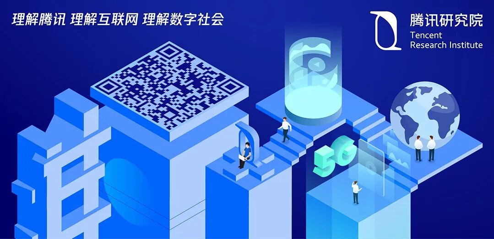

**👇 点个 “在看”****分享洞见g**