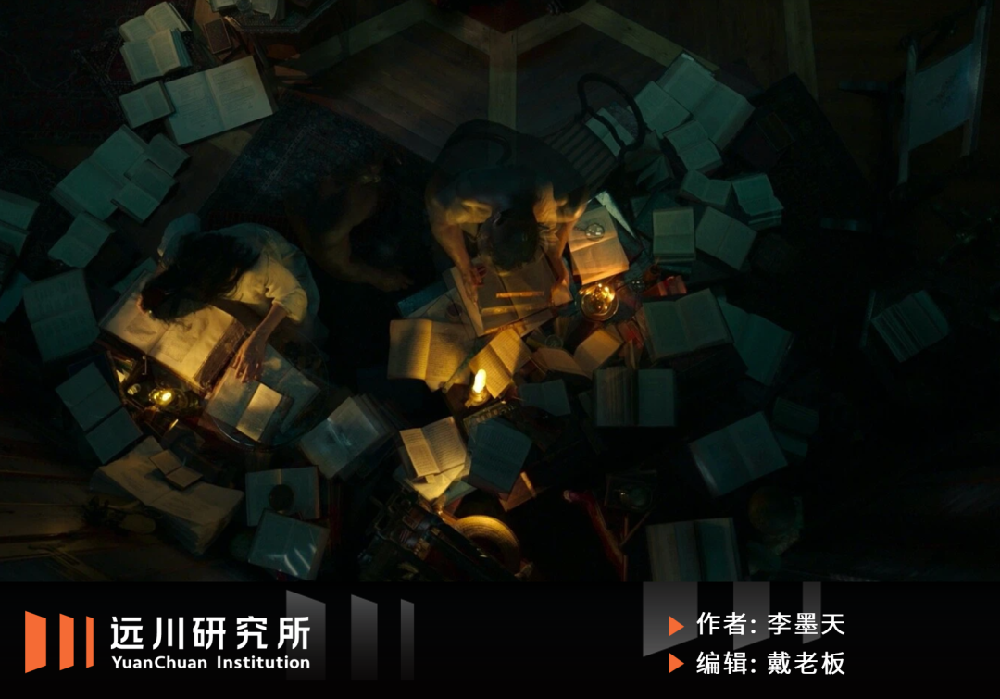
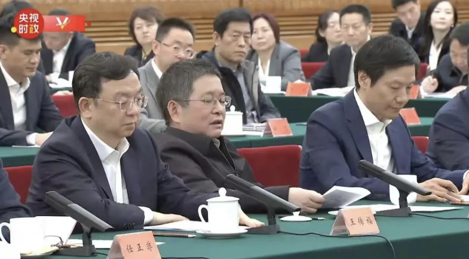
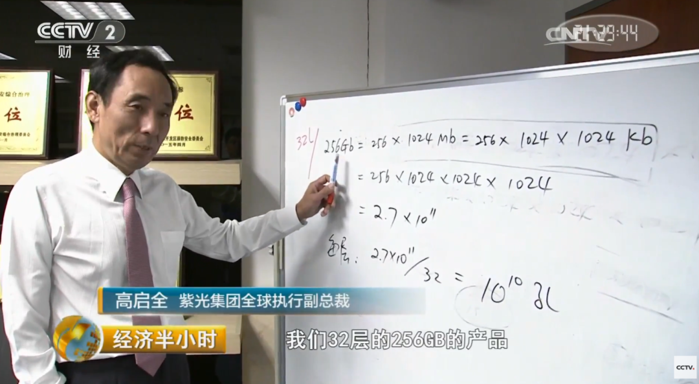
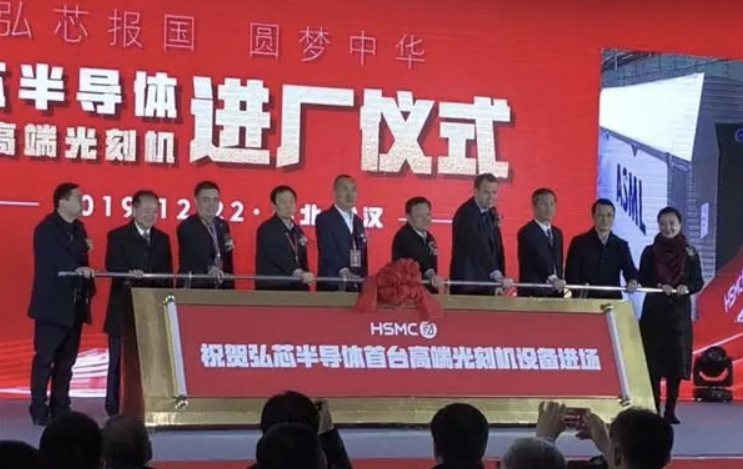
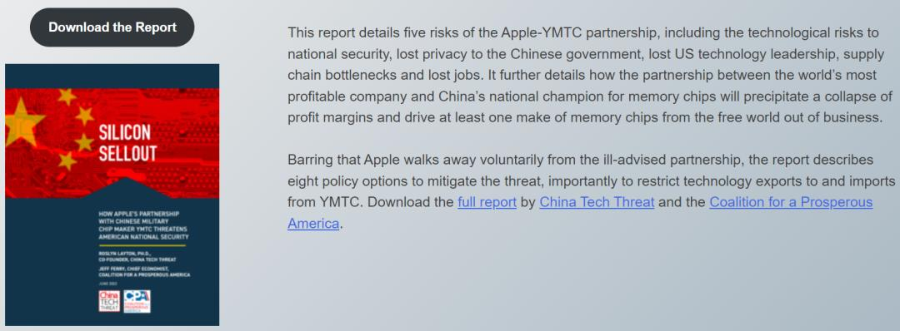
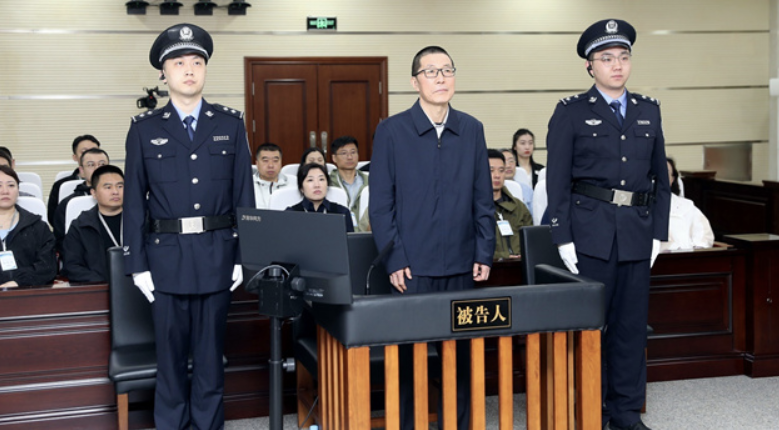

  

  

  

2018年10月22日，荷兰光刻机公司ASML总部迎来一位中国客人：**Innotron** 的CEO**朱一明** 。

  

听到Innotron这个名字，ASML高管大概率是懵逼的。Innotron成立于2016年的合肥，没有量产芯片，没有客户，也没有收入，但开口就要买一台ASML定价1.2亿美元的EUV光刻机。

  

朱一明倒是在业内小有名气，生于1972年，先后在清华大学拿到应用物理学士和硕士，后赴美国深造，2005年回国创立兆易创新。

  

兆易创新的拳头产品是**NOR Flash** ，属于存储芯片边缘品类，用于中低端电子产品，大厂食之无味弃之也不太可惜，美光和SK海力士都干过，都因为利润太少收摊不干。

  

2016年兆易上市，朱一明功成名就，但仅限于A股半导体板块。兆易当时的体量，营收只有美光和SK海力士的1%，全球范围内属于查无此人。

  

朱老板壮志未酬，兆易上市短短两年后，他便退出兆易日常管理，南下合肥，加入这家地方政府发起、自己不占多数股权的创业公司。

  

对中国半导体而言，2018年也是个特殊的年份。中兴遭遇制裁，芯片短板集中暴露，产业界风声鹤唳。国家大基金刚进入投放阶段，各地的项目也刚起步，一时黑云压城。

  

Innotron采购光刻机的意向，ASML显然不会答应。

  

一来中美贸易战刚开打，EUV光刻机的光源来自美国公司Cymer，也在管制范围。二来Innotron志向远大，上来就想做DRAM芯片，听上去不太现实。

  

DRAM（内存）和NAND（闪存）是存储芯片最大的两块市场，中国大陆这两种芯片的消费量占全球19.2%和20.6%\[4\]，但对应的国产化率几乎是0。

  

Innotron没有任何产业基础，中国在这个领域也没有成功先例，集成电路没有偏方治大病的故事，量产DRAM的难度可想而知。

  

其实，在当时造DRAM芯片，用不到EUV光刻，朱一明显然是嗅到了风向变化，想提前囤货。ASML也清楚这些小心思，直接了当给了拒绝。

  

吃了闭门羹后，朱一明回国，埋头专注一个课题——如何在设备和专利的困境里造出DRAM芯片。

  

而Innotron这个明显是起给洋人看的名字，也逐渐被淡化和弃用，英文名直接换成了拼音：ChangXin，而中文名则统一到了两个字：长鑫。

  

在朱一明荷兰之行同期，合肥西北角兴业大道388号的工地上，长鑫第一座12寸晶圆厂刚刚完工。十年后，这里会成为中国存储产业的中心。

  

一个百亿公司的老板，上市后没有去专心享受鲜花和财富，反而在46岁的时候辞职，再攀高峰，朱老板的二次创业理应备受关注，被媒体广为传颂。

  

但并没有。2018年，中国芯片领域最大的明星，是一个叫赵伟国的男人。

  

  

  

##### 01.紫光

  

  

  

有的清华天才擅长“崩老头”，有的清华天才擅长“摘桃子”——赵伟国属于后者。

  

1985年，赵伟国考入清华大学电子工程系。清华是中国半导体的人才摇篮，给行业输送了大批顶尖的工程师、企业家和投资家，数量远超其他高校，并通过紧密的校友关系，铸造了中国芯片的半壁江山。

  

过去，黄埔军校是一半同学在打另一半同学，中国政法是一半同学在抓另一半同学，上海财大是一半同学在查另一半同学的账，而到了清华电子系，则是一半同学在投资or并购另一半同学的公司。

  

比如1995年，清华电子系77级的**陈大同** 在美国参与创办豪威科技，2000年豪威上市后，他又回国跟79级的**武平** 创办了**展讯；** 后来陈大同转向投资，2015年组织了一个财团把豪威买了下来，然后卖给了85级师弟**虞仁荣的韦尔股份** 。

  

2025年民营企业家座谈会，虞仁荣姿态松弛

  

朱一明也有类似经历。2004年他在硅谷创业，早期投资人是一水儿的清华校友，包括85级自动化的李军、83级经济系的薛军、80级工物系的罗茁以及81级电子系的邓峰，一帮师兄弟们给他凑了92万美金，最终才有了兆易，以及后来长鑫的续章。

  

但赵伟国的路径有些不一样，他的发家之路自带一股强烈的投机色彩。

  

从清华电子系毕业后，赵伟国留在了清华校办企业系统里工作，辗转在紫光、同方等多家公司任职。2005年他下海创办**健坤投资** ，主投能源和地产。

  

2008年金融危机期间，紫光集团经营困难，赵伟国以校友和前员工的身份入主紫光。2013年，赵伟国上任紫光董事长，把目光投向半导体。

  

此后五年，赵伟国借用政策和资金的杠杆，给中国芯片业展示了一波凶悍的“摘桃子”绝技。

  

2013年，紫光并购**展讯** ，2014年，在发改委没给“小路条”的情况下，又从浦东科投手中抢来了锐迪科，并将两家公司合并为**紫光展锐** ，顺利拉来了Intel的15亿美金的入股，赚到了第一桶金。

  

这让上海市领导一度震惊。在过去二十年里，上海为保留芯片火种，穷尽了几乎一切给本市芯片企业输血的方法，甚至专门拨款建设顶级中小学，以解决海归工程师的子女上学问题。

  

但仅不到一年，展讯和锐迪科这两家上海公司，便被一家北京公司“摘了桃子”。之后国家大基金在北京成立，沪上芯片企业似乎尽在砧板之上，这间接促发了上海集成电路产业基金的设立。

  

而对赵伟国来说，展锐只是开胃菜。同年，紫光又拿下了做企业路由的**华三** 。这是当年华为与3com联合成立的公司，2006年被3com全资控股，2009年又卖给了惠普，最后紫光出手，收购后变成新华三。

  

赵伟国的胆子越买越大，到后期，他更是给自己套了一层“侠之大者，为国买芯”的外壳。

  

2015年，紫光宣布37.75亿美元入股西部数据，接着对DRAM三巨头里实力偏弱的美光下手，发起230亿美元邀约收购，一下子震惊业界。当然，这些野心毫无悬念地被美国政府给挡了回来。

  

赵伟国随后南下，与台湾省三大封测厂**力成、矽品、南茂** 达成174亿股权交易，提出收购台积电25%的股份，顺便表示价格合适联发科也可以买，把台湾当局吓得够呛，这些交易最后也统统被拦下。

  

行事激进，手法粗野，但赵伟国打响了名声，也把紫光集团的总资产，从他入主时的13亿（2009年），拉到了2015年底的1000亿——很多人鄙视赵伟国，但又有更多的人想成为赵伟国。

  

2017年，赵伟国出席展讯全球合作伙伴大会，恰逢美国发起301调查，赵伟国说美日韩注定会对半导体严防死守，但“阻击越多，我们爆发力越强\[3\]。”

  

此时，距离紫光债务违约还有3年，距离赵伟国被带走调查刚好5年。

  

  

  

##### 02.躁动

  

  

  

在赵伟国疯狂“扫货”的时候，朱一明正因为掏不出长鑫的启动款而陷入煎熬。

  

根据协定，合肥和兆易是长鑫的发起方，两者需要为长鑫一期工程共同出资180亿元，比例是4:1，兆易创新应该承担36亿的出资款。但一直到2018年年底，朱一明却始终掏不出这36个亿。

  

一直到2019年的4月份，长鑫一期的DDR4产品都已经临近投片了，兆易创新才宣布向长鑫投入3个亿，而且还是以可转债的方式，甚至这3个亿也是分批到账，直到2020年才全部打完款。

  

事后看，当时的36个亿，在长鑫上市后的股权浮盈将会超过1000亿。后来有多个理由，比如兆易坚持轻资产模式、遵守监管要求、不想上市公司财报被折旧拖累等等，但其实最大的因素无外乎就是——

  

没钱。

  

从2005年到2016年，兆易历年的净利润总和，加起来也只有6个亿左右；上市后募资5.8个亿，但用途被严格限制；通过定增等方式再融资，需要面临漫长的审批周期，和股民直逼灵魂的拷问。

  

当然，朱老板如果真豁出去，不可能搞不来这“区区”36个亿。他有上市公司的平台，也有最强的清华朋友圈，他的“没钱”，主要还是因为遵守杠杆纪律和风险计算，以及——太要脸了。

  

相比之下，作为芯片领域最强的搞钱男孩，赵伟国的顾及就少了很多。

  

26亿美金买展锐、25亿美金买华三、22亿欧元买Linxens、38亿美元入股西部数据、174亿人民币入股台湾三厂、230亿美元邀约收购美光……赵伟国的口袋似乎深不见底。

  

在紫光的幕后，赵伟国罗织了一个无比复杂的财务迷宫，其用于收购的钱，大都来自于商业银行、政策性银行的信贷资金、债券、以及股权质押的民间借款。这是一条被唐万新们走过的老路。

  

银行的钱，赵伟国是万万不敢赖的。他最终期望的买单者，是A股的股民。

  

在2015年，紫光集团旗下的两家上市公司——紫光股份和同方国芯，先后抛出了天量定增计划，前者打算募集225亿，后者更是狮子大开口，计划募800亿，直接把A股老乡们吓傻了。

  

对此赵伟国也毫不掩饰，他曾经对媒体说过：“A股的高溢价，是可利用的优势”、“对投资人来讲，一定要给它一个变现的路径，那就是A股市场。”

  

在赵伟国的计划里，同方国芯的800亿定增大部分将会投入到3D NAND领域，跟朱一明主攻的DRAM一墙之隔。这也意味着，两个风格迥异的人，注定会在某一天狭路相逢。

  

赵伟国肯定不如朱一明懂存储，但他挖到了一个非常懂的——台湾人高启全。

  

2017年，高启全接受央视采访

  

高启全出身台北矿业望族，在台积电当过6寸厂厂长，参与创办了南亚科技和华亚科技，分别靠日企尔必达和德企奇梦达的授权造DRAM芯片。

  

金融危机期间，三星拿着反周期大刀四处乱砍，奇梦达被打到破产，华亚被美光接盘。南亚虽然有好爸爸台塑输血，但台塑经历金融危机洗礼，觉得DRAM是个无底洞，不愿继续追加投资。

  

一个金融危机，让高启全的职业生涯从宝岛DRAM领军者变成了美光台湾分厂厂长，没有介怀肯定是假的。2015年，赵伟国在台湾认识了高启全，给他画了一个干翻三星的大饼。

  

年底，高启全转战紫光，比梁孟松加入中芯还早了接近2年。

  

尽管拉来高启全助阵，但赵伟国也不打算像朱一明那样，吃“从零开始、重起炉灶”的苦，他选中了在存储芯片领域有所积累的**武汉新芯** 。

  

武汉新芯2006年成立，是美国Spansion的代工厂，产品类似兆易。2013年杨士宁担任CEO之后，组建团队启动了3D NAND闪存方面的预研。国家力量进入存储产业后，武汉新芯被纳入政策视野。

  

2016年，紫光、大基金、武汉三方出资成立**长江存储** ，基于武汉新芯的积累开始攻坚存储。其中紫光一家就出资197亿，是长江存储的主导者，赵伟国把这个重任交给了高启全。

  

2018年，长存订购的半导体设备从芝加哥运抵武汉天河机场

  

紧接着，紫光又从浪潮手里买下奇梦达在西安的DRAM研发中心，更名紫光国芯；之后，赵伟国在南京江北新区高调宣布了进军DRAM的计划，“承诺”投资金额高达300亿美金。

  

2019年6月，紫光集团宣布成立DRAM事业群，请来了工信部前电子司司长刁石京担任董事长，安排高启全担任CEO，然后宣布在重庆落地12英寸DRAM存储芯片工厂，计划年底开建。

  

搞钱强悍如赵伟国，面对存储这种吞金巨兽行业，也得掂量一下自己口袋里的钢蹦能烧多久。三星和SK海力士的历史证明，1000亿级别人民币只是存储的入场券，要想打持久战，还得烧更多。

  

倒回到那个躁动的2018年，赵伟国和朱一明都需要一个关键人物的“支持”，这个人的名字叫——路军。

  

  

  

##### 03.狂热

  

  

  

赵伟国的标签是飞扬跋扈，大基金掌门人路军的对外形象，则一向是文质彬彬。

  

路军出身于1968年，一直在国家开发银行工作。2014年9月，国家集成电路产业投资基金一期成立，他从国开金融副总裁的位子上，调任大基金管理公司华芯投资的总裁一职。

  

长期浸淫在开行系统，路军做事八面玲珑，对外的形象温文尔雅，对每一个人都笑容可掬，但内部有人评价他颇具大哥气质，愿意给小弟分蛋糕——这成为他日后翻车的主要原因。

  

在烧钱比烧纸还快的存储行业，能否得到大基金的支持，是一个生死问题。

  

大基金对朱一明并不陌生。2017年8月，大基金一期通过“买老股”的方式，受让了兆易创新两个机构股东共计11%的股份，成为了兆易的第二大股东，后来逢高减持，净赚了大概30多个亿。

  

尽管赚了大钱，但在朱一明操盘长鑫的过程中，大基金的支持却稍微有些“迟到”。

  

国家大基金一期的投资周期是2014-2019年，跟长鑫最缺钱的阶段重合，但一期没有投资长鑫，而是一直等到2020年，长鑫的良率已经曙光在前的时候，大基金二期才出手，投资47.6亿。

  

相比之下，路军对赵卫国的支持更“及时”和更“给力”。大基金一期投资紫光展锐45亿，投资长江存储136亿；大基金二期投资紫光展锐22.5亿，投资长江存储129亿，共计332.5亿。

  

在抢蛋糕的房间里，拥有不同技能树的人，拿到的分量会有巨大差距。

  

中国是个大国，政策所撬动的利益无比巨大。芯片投资大、产值高，既是卡脖子的门类，又是正能量的方向，2015年政策落地，各方能人八仙过海，半导体项目遍地开花，亩产十万芯。

  

紫光在巅峰时期，与超过13个地方政府签署投资协议，总投资额超过千亿美元。而各个地方的“小赵伟国”们也自然不甘示弱，趁着风口上马了不少项目，其中很多还远不如赵伟国。

  

成都引进的格芯项目，投资近百亿美元。结果不到一年，格芯全球裁员，成都项目实质性停摆。烂尾整整五年，才被上海华虹接盘。

  

武汉弘芯更富荒诞色彩，先是请来原台积电CTO蒋尚义主持工作，后高调引进“中国大陆首台EUV光刻机”。同样一年不到即烂尾。蒋尚义为数不多的露面，是离职前出席了“新冠疫情期间弘芯坚守岗位员工表彰大会”\[13\]。

  

弘芯烂尾后，这台“EUV光刻机”被抵押给了银行，具体型号是NXT1980Di，确实是当时中国大陆最先进的光刻机，但它既不是EUV光刻机，在DUV光刻机里，也不是最新的型号。

  

2019年，武汉弘芯光刻机进场仪式

  

成都和武汉既有产业基础，也有财政实力，尚且如此。其他如南京德科码、淮安德淮、济南泉芯等一地鸡毛，不一而足。拔地而起的百亿项目，要么半途而废，要么沦为低附加值的过剩产能。

  

爆完了该暴的雷，呼风唤雨的舵手们迎来清算时刻。

  

  

  

##### 04.歧路

  

  

  

2020年，赵伟国和朱一明迎来了命运的分野。

  

这一年5月，长鑫首款19nm工艺的DDR4内存条上市销售，给了观望的各路势力一针强心剂，国开行牵头送来160亿的贷款额度，大基金完成尽调，长鑫A轮募集156.5亿，朱一明最难的时候已经过去。

  

之后，长鑫的良率不断爬坡，产能迅速铺开，北京一期从厂房建设到试生产只花了18个月。这期间，美的、阿里、腾讯等民间资本也纷纷入局，长鑫成为众人眼中的“存储之光”。

  

赵伟国则陷入困境。由于清华推动校企改革，对紫光的“背书”大幅降低，到2019年上半年，紫光已经无法靠发新债来融资；2020年11月，紫光债券首次出现违约，崩塌的第一块多米诺骨牌倒下了。

  

紫光到底欠了多少债？根据紫光披露的2020年债券半年报显示：到2020年6月末，紫光集团总负债达到2029亿元，其中有息债务1567亿，一年内到期需要偿还的短债数额高达814个亿。

  

在赵伟国构筑的债务迷宫中，长江存储是最大的资金黑洞，但也是最优质的资产。

  

2017年底，长存自主研发第一款3D NAND，应用了日后名震全球的Xtacking架构。2022年，研究机构TechInsights意外发现，长存的堆叠技术已经走在了三星、美光和SK海力士前面，并进入苹果产业链，引发轰动。

  

长存的芯片量产多年，高启全不止一次表示长存的技术“绝对干净”。美国各路机构也进行过详细分析，始终安静如鸡，没挖出任何专利瑕疵。最后只能派议员出马，骂苹果不爱国。

  

美国“民间组织”报告，《芯片卖国：苹果与长江存储的合作将如何威胁国家安全》

  

2020年紫光债务违约后，高启全结束与紫光五年合约，回到台湾投身材料领域，此时一期项目刚刚跑通量产，二期项目刚搞完三通一平，即便有大基金的帮衬，每年也需要百亿级的投入。

  

这让长存成了一个烫手山芋，尤其对那些想“瓜分”赵伟国资产的人来说。

  

关键时刻，还是湖北省扛住压力，从紫光的资产包中剥离出了长存，接下了继续投资的重任。而剩余的紫光展锐、新华三、紫光国微等资产，组合成一个500～600亿的资产包，等待接盘。

  

最终，拿下紫光庞大资产包的，是北京智路资本和建广资本组成的联合体，两家资本背后是同一个老板，名叫李滨，跟赵伟国同样毕业于清华大学，也同样是一个顶级资本操盘手。

  

李滨的成名作，是在2017年初用181亿并购安世半导体，然后两年之后，便转手338亿卖给了张学政的闻泰科技，赚了大概157亿的差价。安世半导体后来被荷兰政府强行接管，引发外交风波。

  

智路建广组成的财团，在紫光清算的竞标中，打败了广东、无锡、上海、北京等一众国资，打败了央企中国电子，也打败了阿里巴巴和浙江组成的联合体，最后以549亿接走了赵伟国的剩余家当。

  

2025年，赵伟国被判死缓

  

历史上，赵伟国们有起有落，而取代赵伟国的，一定会是一个比赵伟国更赵伟国的人。

**  
**

**  
**

**  
**

##### 05.尾声

  

  

  

长鑫的奇迹崛起，为中国半导体产业的追赶，划上了一个几乎完美的逗号。

  

到2025年底，长鑫三座量产工厂产能接近30万片/月。作为对比，三星约65万片/月，海力士约58万片/月，美光约36万片/月。长鑫产能已经接近美光，是全球第四大DRAM厂商。

  

它的成功，是合肥风投治市的魄力、朱一明躬身入局的坚定、奇梦达的技术宝藏、内存超级周期的迷人、AI浪潮的神助攻等多个因素的叠加，都已被论述很多，本文不必再重复一遍。

  

我们想说的是：长鑫的成功，并不是一个必然。

  

在举国追赶的宏大叙事中，产业政策纵横捭阖，地方政府敢投敢赌，民间资本闪转腾挪，“牛人”和“能人”辈出不穷，但每一个成功的朱一明，都需要熬过周期和困境，熬过明枪和暗箭，在分配蛋糕的房间里，拼命挤到前排的位置。

  

相比十年前，国内半导体产业链取得了公认的、长足的进步，蛀虫和坎坷没有阻挡中国芯片的前进脚步。其原因也很简单：在中国，真心想把事情做成的人，远多于只会投机的人。

  

朱一明们还会持续涌现，赵伟国们也没有完全退场，他们在历史的正文和脚注里，都会拥有自己的位置。

  

所有伟大的事业都是一种后见之明，即便正确的道路，也总是布满泥泞和荆棘。

  

  

全文完，感谢您的耐心阅读。

  

**参考资料**

\[1\]  Chinese companies rush to make own chips as trade war bites，Nikkei Asian Review

\[2\] 陈大同：芯片往事，陈大同

\[3\] 赵伟国：企业有国界，警惕伪合资，澎湃新闻

\[4\] China Consumes US$10.2 Billion and US$6.3 Billion Worth of DRAM and NAND Flash Chips in 2014，TrendForce

\[5\] 紫光集团：“芯云一体”布局成 型，全面打造中国三星，东兴证券

\[6\] 中资凯桥资本宣布5.5亿英镑收购英国半导体公司，财新

\[7\] Imagination还是一家“中国”公司吗，集微网

\[8\] 内存芯片低调破冰 追赶国外路有多长，财新

\[9\] China’s Chip Industry Braces for Further Sanctions With Concerns and Defiance，The Wall Street Journal

\[10\] 自主可控逻辑继续强化，聚焦低国产化率、先进制程突破，浙商证券

\[11\] 重整紫光，财新

\[12\] Memory Price Surge Triggers Shifts in Smartphone BOM Structure，Counterpoint Research

\[13\] 武汉弘芯烂尾始末，财新

  

**作者：李墨天**

**编辑：戴老板**

**责任编辑：戴老板**

**  
**

