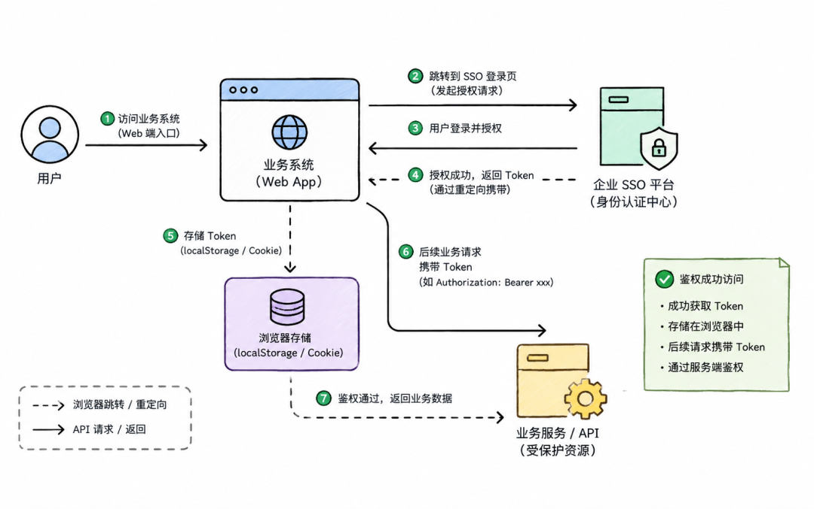
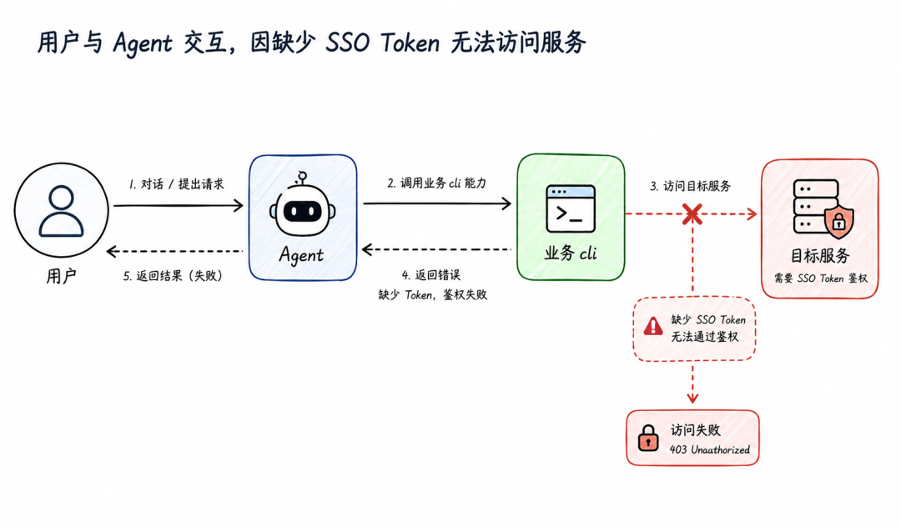
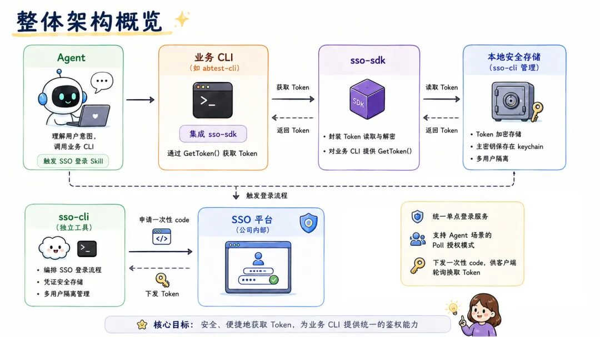
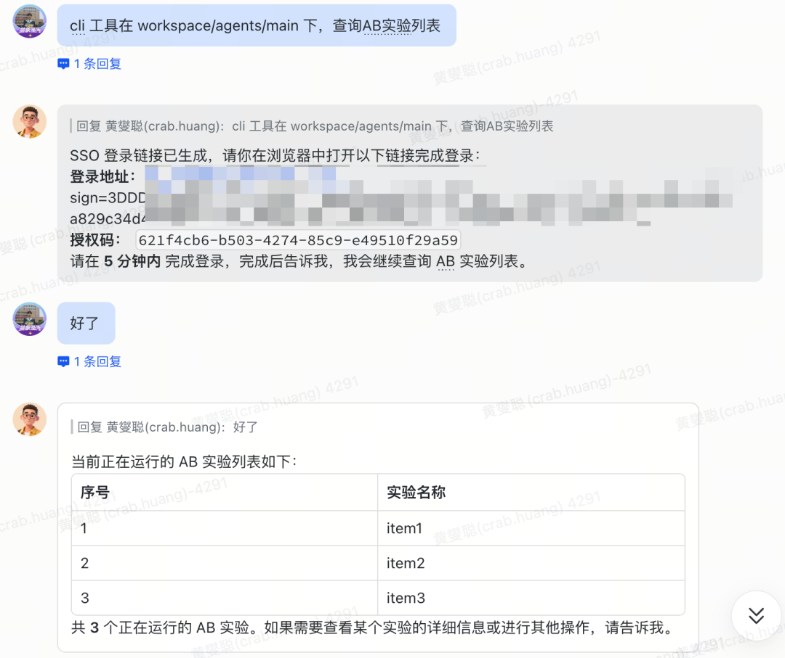
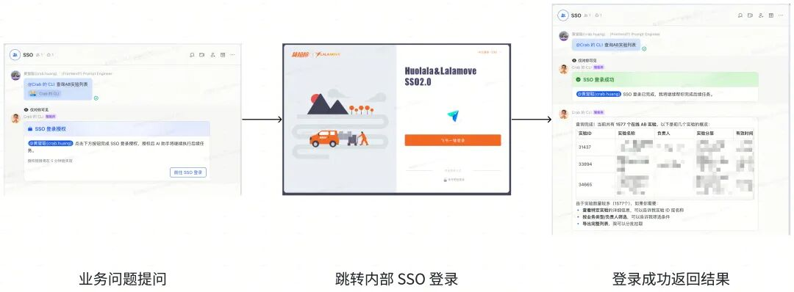
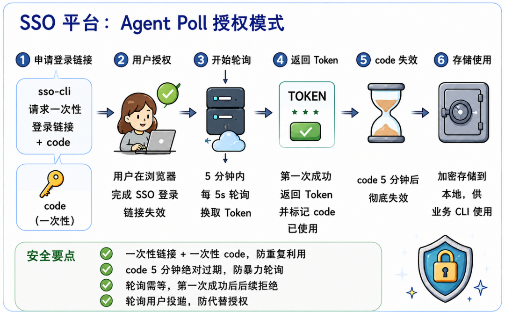
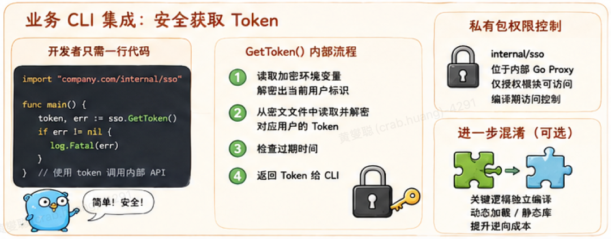

## 摘要

在智能体（Agent）通过 Skill 调用企业内部业务系统时，最大的阻碍往往不是接口能力，而是"鉴权"。

本文介绍一套面向 Agent 场景的 CLI/SSO 鉴权方案，围绕 `sso-cli`、业务 CLI 以及一个私有的 `sso-sdk` 包，构建起一套 token 不落盘、不对外暴露、多用户隔离、登录过程无感的安全鉴权体系。

文章会从安全痛点出发，逐层拆解 keychain 主密钥、密文文件、飞书 Hook 登录、Agent 轮询授权、临时环境变量等关键设计，并讨论各环节面临的卡点与解决策略。

* * *

## 1\. 背景：为什么 Agent CLI 需要一套新的鉴权方案

2026年3月底，飞书开源了飞书CLI，一个多月时间狂揽 1w+ star，将 **Agent CLI** 这个概念带到了面前。

跟传统 CLI 面向人类不同，**Agent CLI** 是专门给 AI 使用的命令行工具：它输出**结构化数据** ，拥有**明确统一的退出码** 和**错误语义** ，让大模型能像调用函数一样可靠地把它当成工具。飞书 CLI 把文档、审批、日历等业务能力封装成一个个可组合的命令，第一次系统性地展示了企业系统如何以「Agent 友好」的方式开放。在这个背景之下，企业内部也开始思考，并尝试将业务系统能力封装，通过 **Agent CLI** 的方式提供给到一众 Agent 框架。

然而，当真正动手把这些业务 CLI 接入 Openclaw、Claude Code 等 Agent 框架时，一个绕不开的障碍立刻出现了：**鉴权** 。在这些框架下，用户通过自然语言驱动 Skill 调用企业内部的业务 CLI，而这些 CLI 最终依赖公司统一的 SSO 单点登录来访问 HTTP API。

在以往的 Web 时代，SSO 鉴权流程天然依赖"人在浏览器前"：业务系统跳转至 SSO 平台，用户手动完成认证授权，后续请求携带 Token 进行鉴权。但 Agent 无法完成这一交互式登录，导致大量业务能力无法对智能体开放。

**Before** （接入前）：  
  

**Now** （接入后）：  
  

Agent CLI接入后，SSO鉴权面临**三层递进式挑战** ：

  1. 1\. **登录缺失** – 无浏览器交互能力，只能靠预置 Token，导致 Agent 无独立身份且 Token 大面积暴露；

> 早期实践中常采用"预先人工登录"：开发者手动完成 SSO 登录，将长期 Token 写入环境变量、配置文件甚至硬编码，供 Agent 直接读取。

  2. 2\. **隔离缺失** – 共享沙箱内用户身份互相覆盖，审计与权限控制失效；

> 想象一种情况：一个团队共享的智能体沙箱中，产品同事 A 刚完成登录，沙箱中存入了 A 的 Token。紧接着研发同事 B 在同一沙箱发起调用——如果没有用户隔离，B 的请求将沿用 A 的身份。审计日志显示为 A 的操作，而 B 可能**越权访问了本无权限的数据** 。

  3. 3\. **存储缺失** – 即便完成登录与隔离，明文 Token 仍使凭据极易被窃取，整体安全链路崩塌。

这些痛点指向同一个结论：**必须为 Agent 设计一套原生的、脱离浏览器依赖的、多人隔离且防泄露的 SSO 鉴权体系** ——既要解决"Agent 如何登录"，也要回答"Token 放在哪里才安全"以及"如何确保每一次调用都对应到真实的用户"。

针对这些痛点，我们设计了一套纵深防御的鉴权体系，核心原则只有几条，但它们贯穿了整个实现：

  * • **通过 Prompt 约束 Skill 行为** ：在 Skill 的安全准则中明确要求大模型不得在对话、日志、输出中暴露 Token 等敏感信息。
  * • **Token 在任何常规载体中都不可见** ：不管是通过环境变量、文件系统、进程参数还是网络旁路，都拿不到明文 Token。
  * • **必须有 SSO 交互才能获得访问权** ：Agent 不具备直接获取 Token 的能力，必须触发用户交互，获取 Token 的能力内化在二进制业务 CLI 内部。
  * • **操作与用户身份强绑定** ：每次业务调用都携带当前真实用户的 SSO 凭证，做到可追溯。

下面我们分层阐述这套体系的具体架构。

* * *

## 2\. 整体架构概览

整个鉴权体系由四个关键部分构成：

  * • **sso-cli** ：一个独立的命令行工具，负责 SSO 登录流程的编排、凭证的安全存储、多用户隔离。它本身不提供 Token 直接读取的接口给外部。
  * • **业务 CLI** ：各个业务团队开发的命令行工具（比如 `abtest-cli`、`trade-cli`），它们是 Agent 实际调用的工具。这些 CLI 不直接处理 Token，而是依赖一个内部包来获取。
  * • **sso-sdk** ：一个内部私有的 SDK，只有被授权的模块才能引用。它封装了从本地安全存储中读取、解密 Token 的逻辑，对业务 CLI 暴露一个获取 Token 的渠道。当前提供了 GO 语言的 SDK。
  * • **SSO 平台** ：公司内部的统一单点登录服务。在本次方案迭代中，SSO 平台新增了**针对 Agent 场景的 poll 授权模式** ，支持下发一次性 code 并由客户端轮询换取 token，这是整套方案能够运转的基础通用能力。

**  
**

**整体架构图** ：  

运行时，一次典型的调用流为：

  1. 1\. Agent 根据用户意图，调用某个业务 CLI。
  2. 2\. 业务 CLI 通过 `sso-sdk` 包获取当前用户的 SSO Token。
  3. 3\. 若 Token **不存在或已过期** ，CLI 报错，Agent 感知到后触发 SSO 登录 Skill。
  4. 4\. `sso-cli` 启动登录流程，向 SSO 平台申请一次性 code，通过飞书卡片让用户授权，随后按间隔时间轮询 SSO 平台换取 Token。
  5. 5\. SSO 平台校验 code 并返回 token，`sso-cli` 加密写入本地。
  6. 6\. 用户授权完成后，Agent 再次调用业务 CLI，此时 Token 已就绪，正常返回结果。

这套流程里最精妙的部分在于 `sso-cli` 的存储和交互设计，我们逐步拆解。

* * *

## 3\. sso-cli：安全存储与无感登录的核心

`sso-cli` 的职责是：**在极不安全假设（沙箱环境可能被任何人读取）下，安全地存储用户的 SSO Token，并支持多用户隔离** 。它的设计思想是"本地不留存可用明文，即使拿到密文和源码也难以解密"。

### 3.1 主密钥与 Keychain

`sso-cli` 首次运行时需要生成一个高熵的**主密钥（Master Key）** ，该密钥可以由密钥框架生成，常见的方式可以存储到各个操作系统的原生密钥链中：

  * • macOS：Keychain / File System / etc...
  * • Linux：Secret Service / gnome-keyring / etc..
  * • Windows：Windows Credential Manager / DPAPI 加密 + HKCU 注册表存储 / etc...

这样做的好处是，主密钥不落在任何普通文件中，其读取受操作系统用户权限保护。`sso-cli` 仅在需要加解密时从 keychain 取出主密钥，用完即从内存中擦除。

在 Agent 的沙箱环境中，我们假定攻击者虽然能读到文件系统，但通常无法直接访问运行中进程的系统密钥链（除非已经提权）。这就提供了第一道强有力的防护。

### 3.2 加密文件存储

当用户通过 SSO 登录拿到 Token 后，`sso-cli` 不会直接存明文。它会将 `user -> token` 的映射结构序列化，加密后存入本地文件。

没有主密钥，即使拿到密文文件也无法解密；而主密钥被锁在 keychain 中。这样即使沙箱文件被全量窃取，攻击者也无法离线还原用户的 Token。

**文件内通过 key 粒度隔离多用户** ，而非每个用户一个文件。这样做简化了并发控制，也减少了密文数量。

### 3.3 多用户隔离与临时环境变量

在与 Agent 对话时，每一轮对话对应一个"当前用户"。我们通过一组**加密的临时环境变量** 来标识这个用户，而不是明文的用户名。

具体做法是：由 Agent 框架在启动子进程时，注入一组环境变量，对用户标识进行对称加密后得到 salt。只有持有相同派生密钥的组件（即 `sso-sdk` 包）才能解密还原出真实的用户标识。

这组环境变量**仅在对话生命周期内有效，对话结束后立即销毁** ，并且：

  * • 不会写入 shell history，也不会出现在 `/proc` 的全局视图中（因为是进程私有的环境块）。
  * • 即使攻击者通过某种手段读取到了环境变量值，看到的也是密文，无法直接知晓当前用户是谁，更无法篡改为其他用户。

当多个用户在同一个沙箱中并发操作时，加密文件的读写通过**文件锁** 保护。

  * • 读操作可以并发，因为解密过程是幂等的。
  * • 写操作（登录写入新 Token）会加排他锁，**避免竞态破坏数据完整性** 。

这种设计既解决了"多人共用同一凭证"的问题，又保证了并发安全性，且大大增加了攻击者通过环境变量窃取用户身份的难度。

### 3.4 飞书 Hook 登录：无感授权

在实现了基础功能后，初版的 `sso-cli` 登录流程非常生硬：

  1. 1\. Agent 提示用户去浏览器完成登录。
  2. 2\. 用户完成登录后，必须回到对话说"我登录好了"。
  3. 3\. Agent 触发 `sso-cli` 开始轮询。
  4. 4\. 轮询到 Token 后，Agent 继续执行。

这不仅打断用户体验，而且依赖用户的主动告知，常因为忘记触发轮询而超时。

**Before** （旧版登录流程）：  
  

**  
**

**Now** （Hook 模式）：  

我们利用飞书机器人能力做了一个 **Hook 模式** ，让整个流程自动化、无感：

  1. 1\. 当 `sso-cli` 被 Agent 调用执行登录时，它会拦截自身的 JSON 输出，生成一张**飞书卡片消息** ，通过飞书 Bot 发送给当前用户。卡片中包含 SSO 登录链接，并且设置为**仅本人可见** 。
  2. 2\. 用户点击卡片，在浏览器完成 SSO 授权。
  3. 3\. 与此同时，`sso-cli` 在后台以 **一定时间间隔** 轮询 SSO 平台，用一次性 `code` 换取 Token。
  4. 4\. 一旦轮询到 Token，`sso-cli` 会立即：
     * • 加密存入本地文件；
     * • 通知飞书 Bot **删除那条仅自己可见的卡片消息** ，不在聊天记录中留痕；
     * • 返回成功给 Agent。
  5. 5\. Agent 检测到登录成功，无缝继续执行业务 CLI。

整个流程中，用户唯一需要做的就是点一下飞书卡片，剩下的轮询、存储、清理全部自动完成。这极大地提升了在 Agent 对话中的鉴权体验。

> **降级方案** ：如果飞书卡片信息能力不可用，`sso-cli` 会降级为发送**普通文本消息** ，将登录链接直接展示给用户。此时消息可能持久化在聊天中，但 Token 本身并不在此出现，只是授权链接，风险可控。

* * *

## 4\. SSO 平台的迭代：从人工授权到 Agent 通用 poll 能力

传统 SSO 平台**仅支持实时 Web 回调授权** ，无法适配 Agent 的异步场景。本次方案对 SSO 平台进行了关键迭代，引入了 Agent Poll 授权模式，使其成为一种通用的平台能力。

**Agent Poll 授权模式流程** ：  
  

升级后的授权流程如下：

  1. 1\. Agent 需要访问资源时，首先通过 `sso-cli` 向 SSO 平台请求生成一个**一次性登录链接** ，平台同时返回一个与该链接绑定的短期 `code`。
  2. 2\. Agent 将这个链接通过飞书卡片（或其他渠道）呈现给拥有权限的用户。
  3. 3\. 用户在浏览器打开链接，完成 SSO 登录后，该链接立即失效。
  4. 4\. `sso-cli` 在一段时间内，间隔轮询 SSO 平台的 token 接口，使用相同的 `code` 换取 Token。
  5. 5\. SSO 平台在第一次成功换取 Token 后，将 `code` 标记为已用；同时 `code` 自身也有一段绝对过期时间。
  6. 6\. Token 拿到后，同样走主密钥 + 加密文件存储到本地，后续的业务 CLI 即可正常使用。

安全设计要点：

  * • **一次性链接 + 一次性 code** ：防止链接被重复利用；即使链接泄露，一旦被正确用户使用即作废，攻击者无法再用。
  * • **code 定时失效** ：防止撞库和暴力轮询。
  * • **轮询幂等** ：每次轮询都试图用 code 换 token，第一次成功后，后续请求会因 code 失效而拒绝，不会产生副作用。
  * • **轮询用户校验** ：防止用户代替授权，当发现授权用户与发起用户不一致时，`sso-cli` 将拒绝并终止流程。

这一迭代使得 SSO 平台不仅服务于传统的 Web 应用，也正式具备了支撑 Agent 时代各类自动化场景的能力，成为企业内部鉴权基础设施的重要升级。

* * *

## 5\. 业务 CLI 集成：安全获取 Token 的最后一公里

业务 CLI 的开发者不需要关心主密钥、加密文件、多用户环境变量这些复杂细节。他们只需要在自己的代码中引入公司私有的 `sso-sdk` 包，然后调用对外暴露的方法即可。

**业务 CLI 集成示意图** ：  
  

### 5.1 私有包的权限控制

`sso-sdk` 包托管在内部的 Go Module Proxy 上，仓库权限仅对授权业务模块开放。这样：

  * • 只有经过安全审查和批准的业务 CLI 才能引用该包，从根本上防止 Token 获取逻辑被滥用。
  * • 即便有开发者在内部尝试直接 import，Go 的私有代理会拒绝下载，编译失败。

这是一种**编译期访问控制** ，相比运行时控制更加绝对和前置。

### 5.2 获取逻辑与存储的分离

我们会继续将 `sso-cli` 单独保持为**登录与存储** 的守护工具，而 `sso-sdk` 包只封装**读取和解密** 。分离的目的是：

  * • 登录过程涉及用户交互、轮询、临时状态管理，逻辑较重且容易出错，放在单独二进制里更清晰。
  * • 读取 Token 的逻辑必须高度精简、可靠，内嵌到业务 CLI 中，不依赖外部进程通信，减少失败点。

内部执行的步骤是：

  1. 1\. 读取加密的临时环境变量，结合 salt 解密出当前用户标识；
  2. 2\. 从本地密文文件中加载并解密对应的 Token；
  3. 3\. 检查过期时间，若过期则返回错误；
  4. 4\. 返回 Token 给业务 CLI。

整个过程不经过任何网络或 IPC，安全且快速。

### 5.3 进一步混淆：保护关键逻辑

虽然 `sso-sdk` 已经通过私有仓库控制了使用权限，但仍然有被逆向分析的风险——拿到业务 CLI 二进制的人可能会提取出 Token 读取逻辑，进而想办法在特定环境下恢复明文。

我们的对抗思路是：**将 Token 的获取和加解密逻辑编译为独立二进制对象，再通过某种方式在运行时加载** 。

  * • 比如将这部分关键代码编译成共享库（`.so`/`.dylib`），由主业务 CLI 动态加载调用。
  * • 或者使用 Go 的 `plugin` 包，甚至将逻辑以 CGO + 静态库的形式内嵌并剥离符号。

这样做可以显著提升逆向成本，普通 `strings` 和静态分析基本失效。不过，我们也清醒地认识到这会带来调试、更新和排障的额外开销，因此这还在权衡阶段，目前主要以私有包 + 仓库权限保证安全边界。

* * *

## 6\. 总结与展望

我们通过一套"**sso-cli 安全存储 + 飞书无感登录 + 内部私有包控制 + 多用户加密隔离 + SSO 平台 poll 模式** "的组合方案，解决了智能体业务 Skill 调用企业内部 SSO 鉴权接口的难题。这套方案的核心收益是：

  * • **Token 对常规途径完全隐藏** ：不在环境变量、命令行、日志、明文文件中出现。
  * • **每个操作都绑定真实用户** ，满足审计和最小权限要求。
  * • **用户体验流畅** ，一次点击即可完成授权，无多余交互。
  * • **开发接入简单** ，业务 CLI 只需引入内部公共库，由框架保障安全。
  * • **纵深防御** ，从 Prompt 约束、操作系统密钥链、文件加密、私有仓库权限、加密临时变量，到 SSO 平台一次性 code，层层加码。

这套体系已在内部多个 Agent Skill 中落地运行，有效平衡了安全、易用性和开发效率。

**未来展望：从"用户授权"走向"人-智能体-能力"三维管控**

当前的鉴权体系核心是 **"用户是谁"** ——Agent 只是用户意图的执行者，所有权限判断最终都落在"人"身上。这种模式在智能体能力尚浅、任务边界清晰时运转良好，但我们预判，随着 Agent 自主决策能力和可调用工具集的膨胀，这套以人为单一主体的授权模型将逐渐显露局限。

一个可预见的演进方向是：**将"用户身份""智能体身份""功能权限"三者解耦，构建三维管控体系** 。

这意味着，未来的 SSO 平台可能需要从一个"身份认证与授权服务"逐步演进为 **"智能体访问策略引擎"** 。它不仅要回答"这个 token 是谁的"，还要回答"这个调用链路是谁发起、经由哪个智能体、意图是什么、当前风险等级如何"，并基于此做出动态的、上下文感知的鉴权决策。

在这个新范式下，我们今天建立的这套安全信道、加密存储和无感登录机制并**不会被废弃** ，反而会成为**更上层建筑的可信底座** 。届时，token 将不再仅携带用户标识，而是同时编码智能体身份、任务范围和约束条件；而我们今天在环境变量加密、主密钥保护和一次性授权码上的实践，也恰好为那个更复杂但更安全的未来，打下了坚实的地基。

**注** ：本文章包含 AI 生成图片内容。

> **产研团队** ：大数据技术与产品部、货运研发部、信息安全技术部、信息平台部
> 
> **笔者介绍** ：黄燮聪｜高级 Agent 工程师。负责大数据前端 A/B 实验平台、智能招聘体系等项目，目前专注于 AI & Agent 应用赋能。