[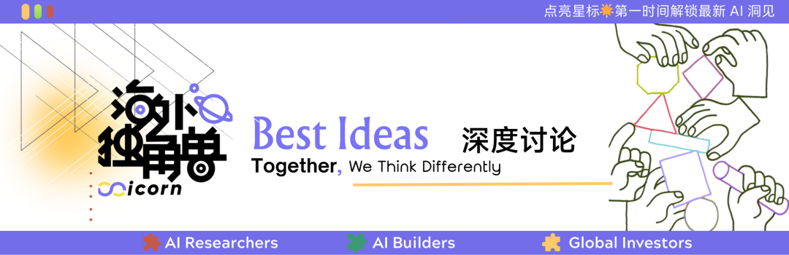](https://mp.weixin.qq.com/mp/appmsgalbum?__biz=Mzg2OTY0MDk0NQ==&action=getalbum&album_id=4157672299245862924&scene=21#wechat_redirect)

作者：Daniel、Cage  

过去一年，Agent 的产品形态和使用方式发生了很大变化。Claude Code、Codex、Openclaw 等 Long-horizon Agent 开始快速扩散。需求快速增长的同时，Agent Infra 的竞争格局也在发生变化，公司需要思考自己与模型能力之间的关系。去年一些受到关注的方向比如 Memory/RAG 等，已经被模型和 Harness 内化。

⁠

我们回顾了互联网和云计算时代基础设施的演进，发现 Agent 和传统应用之间最大的区别在于其不确定性。基础设施的角色，也正在从承载应用的 Cloud Hosting，演变为管理 Agent 工作过程的 Agent Runtime。

⁠

基于这一变化，Agent Infra 最终回答两个问题：如何让 Agent 更可控，以及如何让 Agent 接入更多能力。

⁠

可控性方面，模型能力越向前发展，对可控性的需求就越强。提高可控性的基础设施包括 Runtime、Identity 和 Eval：Runtime 管理 Agent 的执行环境，Identity 管理身份与权限，Eval 判断 Agent 是不是在高效地完成任务。

⁠

拓展能力边界则包括 Search、Payment 和 Context。Search 为 Agent 提供外部世界的实时信息，Context 帮助它理解企业内部的数据与工作流，Payment 则将 Agent 与交易系统连通，使其同时成为生产者和消费者。这一类领域有更多模型公司和大型平台切入，例如 Claude Tag 这样的数字员工产品，和不断出现的 Agent 支付/身份协议。

⁠

从近期关注的优先级看，我们更看好 Runtime。随着 Agent 从 Coding 走向更多场景，市场需要一层通用基础设施来管理执行、状态、失败恢复与成本。Runtime 的需求最明确，商业化场景也最清晰，后续随着多模型与 agent 生态的渗透有望带来更多需求。其次是 Identity 和 Search，两者都已经看到需求快速增长。Eval 的需求同样在上升，但目前还偏服务化，能否形成独立产品品类尚不确定；Payment 则受制于协议和交易生态，整体仍处于早期阶段。

⁠| /| ⁠  
---|---|---  
  
01.

## 核心判断更新

⁠

2025 年 5 月，我们发布了第一版 [Agent Infra 图谱](https://mp.weixin.qq.com/s?__biz=Mzg2OTY0MDk0NQ==&mid=2247513438&idx=1&sn=90573400ced99cdec0c2bb04d671f855&scene=21#wechat_redirect)。当时的判断是，Agent 的爆发会带动一批 Agent-native Infra，核心机会分布在 Environment、Context、Tools 和 Security 四个环节。

  

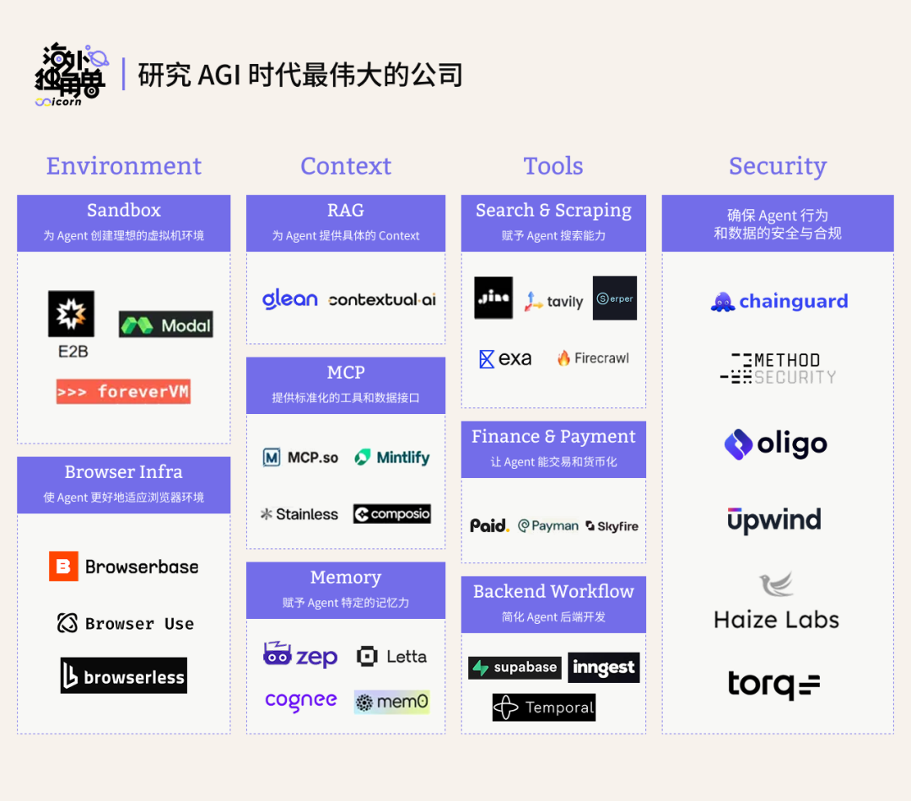

去年发布的 Agent infra 图谱

这一年来，Agent 的发展与市场变化很快，其中最有代表性的就是 Claude Code/ Codex 这样 long horizon agent 产品的加速扩散。大量用户第一次直观感受到：当 Agent 获得文件系统、浏览器、代码执行和账号权限后，它面对的已经是一套完整的计算环境，而非一个简单的模型接口。

⁠

这也彻底改变了 Agent Infra 的竞争格局。过去一年，模型公司和云厂商迅速向周边基础设施层扩张。去年图谱中的许多需求依然存在，但作为单独创业赛道的空间已经明显收窄。

⁠

其中变化最明显的是 Context，其中的 RAG / Memory / MCP 已经内化成为模型应用的默认工程能力。Memory 的需求是很确定的，但随着模型长上下文、自动 Compaction 和文件系统组合起来后，已经覆盖了大部分 Agent 的记忆需求。MCP 和之后出现的 skill 没有带来独立的产品化机会，而是进一步打开生态。因为工具接入的门槛快速下降，价值开始向连接背后的 agent workload 迁移。

⁠

还有一个例子是 Browser Infra。Agentic Web Access 一直存在两条主要路径：Search 和基于 headless browser 的 Browser Use。对大多数读取型任务来说，Search 不需要为每项任务维持独立的浏览器会话，可以并行查询并复用索引、缓存和排序系统，因此延迟更低、边际成本也更低；同时，查询目标和结果又能持续反哺检索与排序模型，形成跨客户和场景复用的数据飞轮。因此，Search 更容易沉淀为知识型 Agent 的高频上游能力。

⁠

Agent 正在快速进步，为他们设计的 Infra 显然不是一张稳定不变的技术栈，而是在模型能力和用户需求之间保持着一个微妙的平衡。每当模型厂商把需要外挂的重要部分变成原生能力，原本围绕这些功能成立的 Infra 公司就会被压缩。

⁠

## Agent 带来的底层气候变化

⁠

在重新构建 Agent Infra 的图谱之前，我们先思考一下 Agent 和传统互联网软件有什么本质上的区别。如果用一句话概括：

⁠

Agent 在给软件世界增加不确定性。

⁠

传统互联网和云计算解决的核心问题，是如何让应用稳定服务海量用户。为此，基础设施通过容器、微服务和 Kubernetes 横向扩展：流量增加，就启动更多副本；流量下降，就自动缩容。其基本假设是：应用数量有限，用户增长主要带来流量增长。

⁠

Agent 改变了这一假设。它不是简单地接收请求并返回结果，而是能够理解目标、拆解任务、调用工具，并长期保持状态的软件劳动者。过去是“一个应用服务很多用户”，未来则可能是“一个用户驱动多个 Agent，每个 Agent 再拆出多个子任务”。在 Agent 时代，基础设施面对的不再只是流量调度问题，而是海量异构的数字劳动者的调度与治理问题。

⁠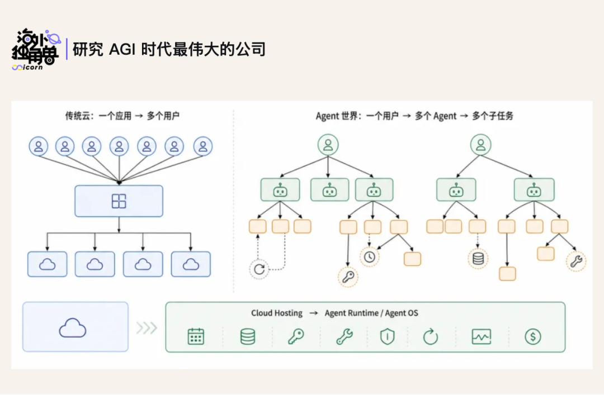 ⁠

因此在 Agent 时代，基础设施层的角色开始从传统的cloud hosting，演变为Agent runtime。它不再只是承载应用运行，而是要像操作系统一样，为大量 long horizon agents 提供调度、状态管理、权限控制，并且把 LLM 的智能分发到用户的工作环境中。

⁠

具体来说：

⁠

•Agent 为 infra 管理提出了更 Long horizon stateful 的需求。传统云原生应用通常将状态存储在外部，计算实例可以随时创建或替换。但 Agent 任务可能持续数小时，而且每一步都依赖之前的执行结果，因此 agent infra 应该是更 stateful 的，且需要 snapshot 机制的。

⁠

•Agent 的资源消耗更难预测。传统应用的资源需求主要由请求量和并发数决定。一次 Agent 请求却可能触发数十次模型调用，并执行多个外部操作。这使成本和延迟变得不稳定，也对计费、限流及性能优化提出了更高要求。

⁠

•Agent 的安全权限会随着任务动态变化。传统应用只能执行开发者预设的操作，Agent 则会根据目标自行决定下一步。它还可能代表用户访问邮件、日历或数据库等系统。因此，基础设施必须严格验证身份，限制操作范围，记录关键行为，并在高风险操作前要求人工确认。

⁠

•Agent 更难观测和评估。传统监控主要关注延迟和错误率，但 Agent 的问题可能来自错误的工具选择，也可能来自对上下文的误解。基础设施需要记录完整的执行过程，让开发者能够回放任务，定位问题并持续改进。因此 agent eval 成了一个比 LLM eval 难上一个数量级的任务。

⁠

## 图谱更新

⁠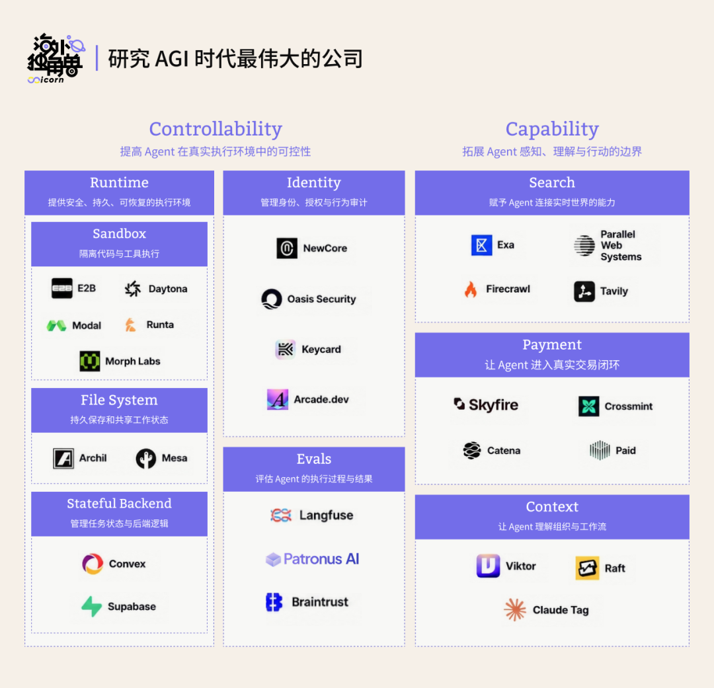 ⁠

我们的核心判断是：Agent Infra 的机会将沿着两条主线展开——一是提高 Agent 的可控性，二是拓展 Agent 的能力边界。现阶段，我们更看好可控性基础设施，因为随着模型能力提升，Agent 的行动范围正在比其可靠性更处在一个持续变化的过程中。

⁠

Agent Infra 的第一类核心需求：在不确定性不断增加的执行环境中，提高 Agent 的可控性。如果把 Agent 看作新时代的劳动者，它首先需要：

⁠

•一个完备的工作环境（Runtime）

⁠

•一个正确的身份（identity）

⁠

•一个可靠的考核（eval）

⁠

模型越强，Agent 能够执行的任务越长，调用的工具越多，接触的数据和系统越敏感，获得的权限也越大。一旦 Agent 从生成内容走向修改代码、操作数据库、发送邮件或执行交易，错误的影响就不再局限于一次不准确的回答，而可能转化为真实的业务损失。

⁠

因此，Agent 的可控性需求不会因为模型变得更聪明而自然消失。相反，它与模型能力构成互补关系：模型能力越强、行动能力越大，Agent 对运行环境、身份授权和结果评估的需求也越强。这是我们优先看好这一层的核心原因。

⁠

具体来看，三个方向的需求确定性和商业化节奏有所不同。Runtime 当前需求最明确、商业化路径也最清晰。Identity 的初创，最后的结局可能都是被大厂收购整合。Evals 是必要能力，但能否形成独立产品仍不确定。

⁠

在可控性之外，Agent Infra 的第二条主线是拓展 Agent 的能力边界，使其从封闭环境中的推理系统，逐步成为能够感知、理解并作用于现实世界的执行主体，其中包括但不仅限于：

⁠

•Agent 连接实时世界（Search）

⁠

•Agent 加入真实交易（Payment）

⁠

•让 Agent 理解人、组织与工作流（Context）

⁠

其中，Search 已经出现较强的短期需求，Payment 更偏长期趋势，而 Context 有机会成为企业 AI 中价值最高、粘性最强的一层，但留给独立公司的机会可能相对有限。

⁠

据此，我们更新了 Agent Infra 的投资主题图谱：短期优先关注需求明确的 Runtime 和 Search；中长期关注可能形成信任控制层的 Identity，以及深入企业核心工作流的 Context；持续跟踪 Evals 能否形成独立的预算和数据壁垒，以及 Payment 何时具备规模化交易所需要的身份、信任与责任基础。

⁠ ⁠

02.

## 投资主题 1：让 Agent 更加可控

⁠

## Runtime

⁠

Runtime 是承载 Agent 持续行动的完整运行基础设施，需要处理 Agent 在哪里安全执行、工作状态如何跨越计算实例保存以及一个长期任务如何可靠地推进。模型负责决定下一步做什么，Runtime 负责把行动真正执行出来，并保证任务中断后仍能继续。

⁠

在 Runtime 之中，可以分为三个类型：Sandbox 提供安全隔离的计算环境；File System 持久保存代码、资料和中间产物，即使 Sandbox 被销毁，文件仍然存在；Stateful Backend 以新一代数据库为代表，后端不仅知道当前保存了什么数据，也知道一个任务正在经历什么过程。

⁠

### Sandbox

⁠

传统软件里的 sandbox，主要解决的是安全隔离问题：让一段不可信代码在受控环境里运行，避免影响主机系统。但 Agent 时代的 sandbox 面临的问题更复杂。Agent 不是只执行一段代码，而是在一个动态任务中持续工作。它会进行各种操作，也可能走错方向、回滚、重试，甚至让多个子 Agent 并行探索不同路径。

⁠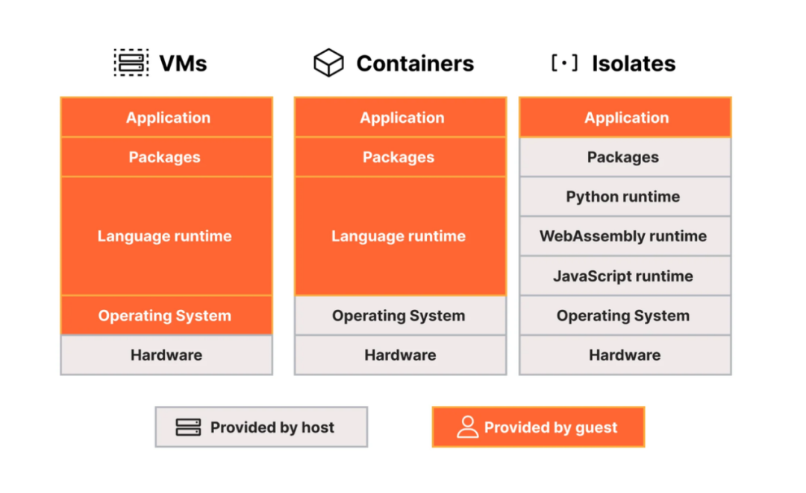 ⁠

在我们使用常用的 Coding Agent，比如 Codex、Claude Code，也会接触到他们自带的本地 Sandbox，但其与面向生产环境的云端 Sandbox 是两个的层级：前者侧重限制单机文件系统和网络权限，后者则需要进一步解决环境生命周期、规模化运行等问题。

⁠

因此模型公司和 infra 公司是错位竞争的状态，Codex / Claude Agent SDK 都开放集成第三方托管服务。（Anthropic 的 Managed Agents 有直接提供自有云端 Sandbox，但同样支持将执行环境部署在客户基础设施中）

⁠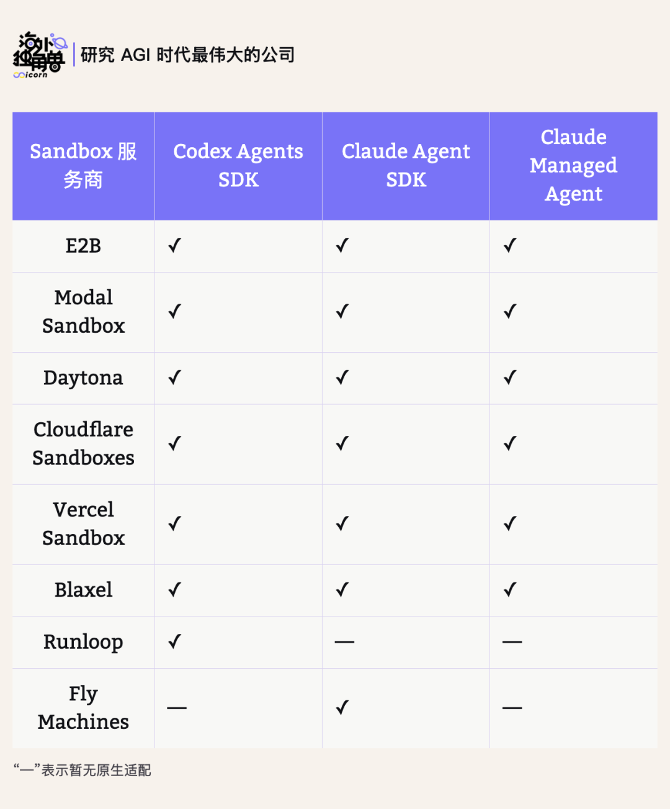  

创业公司的机会，在于围绕 agent-native workload 建立的差异化，包括但不仅限于：1\. 完整应用运行环境；2. 快速启动和大规模调度； 3. 状态保存； 4. 分叉和回滚的能力。

⁠

目前 sandbox 领域领先的公司，其实是在前 agent 时代就开始布局的公司，以 Modal、Daytona 和 e2b 为代表。但这个领域的需求都很新，因此也完全有新公司异军突起的机会。

⁠ ⁠

Modal 

  

Modal 是一家 AI 云基础设施公司，他们的业务是从 Serverless GPU serving 开始的，25 年开始转向 Sandbox，截至今年上半年 sandbox 收入已经占 ARR 三分之一。Sandbox 的增长延续了他们从创立之初自建底层 infra 产生的复利：采用 gVisor 隔离并通过自研文件系统和 Snapshot 保存代码、依赖与运行状态，使 Sandbox 具备了快速扩容能和快速恢复能力。

⁠

Modal 为 Sandbox 重写了底层调度系统，将中央数据库和全局协调移出 Sandbox 创建的关键路径，使调度服务器可以水平扩展，并直接请求计算节点创建容器。在一次压力测试中，Modal 同时运行了 100 万个 Sandbox，并在一分钟内完成全部创建请求；单个环境的中位可交互时间低于 0.5 秒。Modal 的强大 infra 能力，让它未来有希望成为 Agent 的大规模执行层。

⁠

公司由前 Spotify 机器学习负责人、Better.com 前 CTO Erik Bernhardsson，以及前 Scale AI 工程师 Akshat Bubna 创办。2026 年 5 月，Modal 完成 3.55 亿美元 C 轮融资，投后估值 46.5 亿美元；同期披露年化收入超过 3 亿美元。

⁠

关于其底层架构、Sandbox 竞争力和商业模式的更多描述，可见海外独角兽此前研究[《Modal 的 infra 复利：从 GPU Cloud 到 Agent Sandbox](https://mp.weixin.qq.com/s?__biz=Mzg2OTY0MDk0NQ==&mid=2247524501&idx=1&sn=36300b8f6cb9a001496ed6ddc707a850&scene=21#wechat_redirect)》。

⁠

E2B

  

E2B Sandbox 基于 Firecracker microVM，隔离强度高于普通共享容器；开发者可以预制 Template、安装依赖，并选择 E2B 托管或自托管。E2B 的 SDK、核心基础设施和自托管方案采用 Apache 2.0 开源，开发者可以审查代码、修改实现，也可以通过 Terraform 部署到自己的 AWS/GCP。截至目前，其主仓库约有 1.24 万个 Star。

⁠

E2B 由两位捷克创业者 Vasek Mlejnsky 和 Tomas Valenta 创办。团队最初在 2023 年开发 AI 编程 Agent，随后发现安全运行 Agent 代码本身是更大的基础设施机会，于是转型做 Sandbox。2025 年 7 月公司完成 Insight Partners 领投的 2,100 万美元 A 轮，累计融资 3,200 万美元。

⁠

除了目前领先的玩家以外，我们认为这个领域很可能不止局限于 sandbox 本身的优化，还有一些在拓展到更广 runtime 能力的玩家值得关注：

  

Runta：Agent Execution Layer

  

相比于把自己定义为 Sandbox 公司，Runta 这家公司希望能做成面向长程 Agent 的 execution layer。其核心判断是：Agent 会在运行过程中动态决定读取文件、调用工具和使用凭证，传统放在 API Gateway 或 WAF 的入口控制已经不够，治理必须下沉到 OS 和网络层。

⁠

Runta 因此同时提供状态化 runtime、网络访问策略、凭证注入和执行记录。相比主要强调隔离与冷启动的 Sandbox，它更关注 Agent 运行数小时甚至数天后的暂停、恢复、分叉和跨环境迁移。

⁠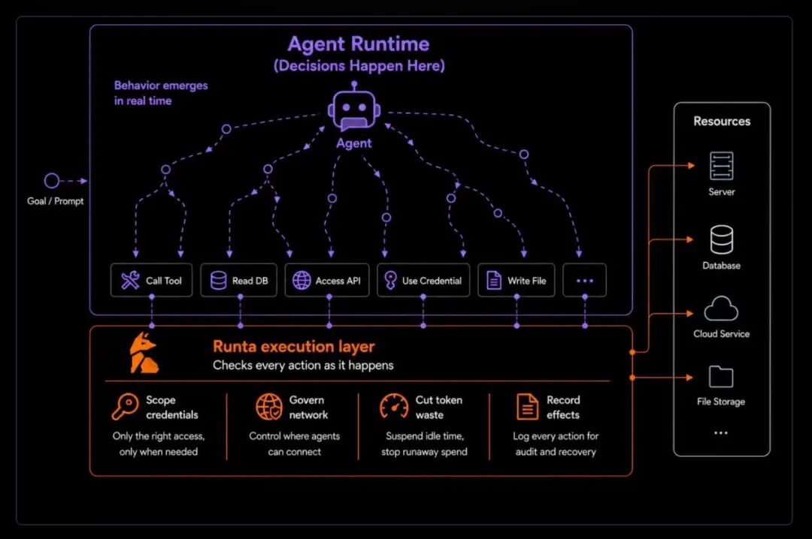 ⁠

Runta 把产品概括为 Consume、Reach 和 Record 三部分：

⁠

•Consume 管 Token 与计算成本：Agent 不仅消耗 CPU 和内存，还会把日志、JSON、搜索结果和 Git diff 等大段工具输出塞进模型上下文，产生大量 Token 成本。Consume 模块可以在这些内容进入模型之前压缩重复和低价值信息，降低模型和计算费用；

⁠

•Reach 管 Agent 能访问的文件、网络目的地和凭证，真实 API Key 不直接交给 Agent，而是在请求离开运行环境时按策略注入；

⁠

•Record 则从执行层记录真正发生的文件修改、网络请求、凭证使用和系统行为。这些记录可以用于调试、安全审计和故障恢复。长期来看，Runta 希望通过同一层基础设施完成 Agent 的执行、治理与记录。

⁠

在未来，Runta 有成为企业 Agent 控制入口的潜力，通过增加权限与合规功能完善企业服务，不仅可以管理自家云上的 Agent，还可以统一接入运行在云端以及第三方 Sandbox 中的 Agent。

⁠

创始人 Guanlan Dai 早期参与 Cloudflare Edge 团队，后在 Kong 负责 Gateway、Kong Cloud 和 Kubernetes Ingress Controller 等产品。公司于 2026 年 7 月完成 $20M 种子轮融资，由 a16z 的 Martin Casado 领投，Jeff Dean、李飞飞、Databricks CEO Ali Ghodsi、Ram Shriram 和 Hugging Face CEO Thomas Wolf 参投。

⁠

Morph Labs：更注重状态管理与 branching

  

核心技术 Infinibranch，可以理解为“Git for compute”。传统计算环境大体是线性的：启动机器、执行任务、失败后重建；Morph 则把系统抽象成 image → snapshot → instance → branch，能够保存运行环境，并从同一个状态快速分叉出许多平行实例，保留应用、进程和内存状态。这样 Agent 可以同时尝试十种修复方案、浏览器操作或数学证明，验证后只保留最优路径。

⁠

Morph 的真正差异是把快照、分支、回滚和大规模复制变成一等能力；它更强调有状态的完整运行环境。一个例子是 Math Inc。 的 Gauss：其 Lean 数学证明项目使用 Morph Infinibranch 运行数千个并发 Agent、消耗数 TB 集群内存，三周生成约 2.5 万行 Lean 代码。

⁠

Morph Labs 由 Jesse Han 于 2023 年创立。Han 曾任 OpenAI 研究科学家，研究方向横跨机器学习、自动推理和形式化证明，并曾用 Lean 完成连续统假设独立性的形式化证明，这解释了公司为什么尤其重视“并行搜索＋机器可验证结果”。据报道，公司已完成 575 万美元融资，由 Khosla Ventures 领投，Replit CEO Amjad Masad、Christian Szegedy 等参与；Szegedy 后来加入担任首席科学家，他此前在 Google 工作约十二年，也是 xAI 联合创始人。

### File system

⁠

Sandbox 解决的是 Agent 在哪里安全执行，提供的是 compute。File System 提供的是 storage 和 state：Agent 完成工作所需的数据从哪里来、执行状态如何持久保存、不同 Agent 之间如何共享结果。

⁠

过去的云计算主要服务 stateless application：计算实例可以随时销毁，重要数据放在数据库或 S3 中。但 Agent 天生是 stateful workload，会持续读取文件、修改代码，并在多轮执行之间积累上下文。计算可以是临时的，状态却必须比任何一台 Sandbox 活得更久。这使 File System 从操作系统中的基础组件，逐渐成为 Agent Infra 中一层独立的数据基础设施。

⁠

这一层目前有两条代表性路线：Archil 以 S3 为底座，在企业已有的对象存储之上做 AI native 改造，主打让 Agent 直接用上企业数据；Mesa 自研了一套带版本控制的文件系统，主打多 Agent 之间的协作与状态版本化。

⁠

Archil：以 S3 为底座的对象存储改造

  

今天，大量企业数据存放在 S3 等对象存储中。S3 成本低、容量几乎无限，但程序真正执行时，仍然更习惯通过 POSIX 接口像访问本地磁盘一样读取和修改文件。传统方案需要先把数据从 S3 下载到 EBS 或 Sandbox，本地处理完成后再同步回去。数据量从 GB 上升到 TB 后，下载、缓存和同步会成为任务启动速度与基础设施成本的主要瓶颈。

⁠

Archil 在计算环境与 S3 之间增加了一层兼容 POSIX 的共享文件系统。应用不需要改写原有代码，就可以通过普通目录访问对象存储中的数据。多个 Agent 或计算实例可以放到同一个 workspace，文件系统则负责弹性扩容、缓存、一致性和数据同步。

⁠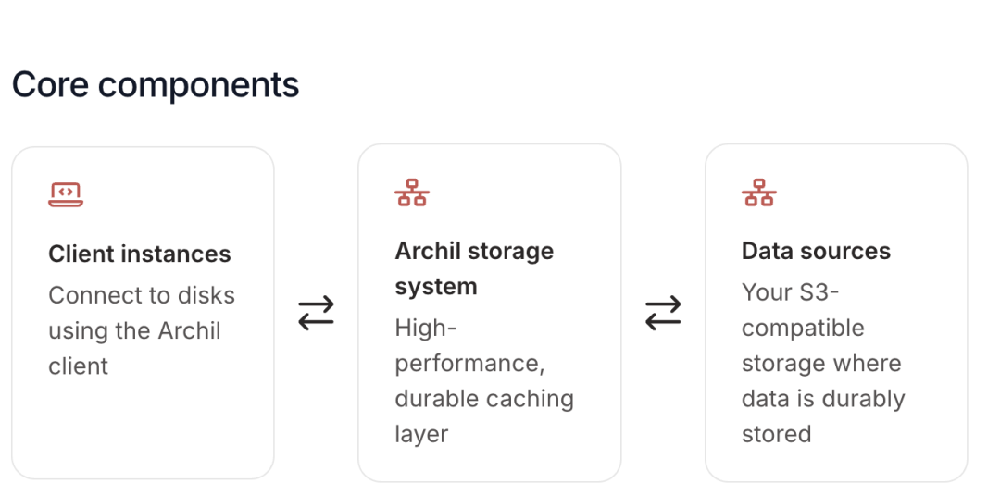

企业数据继续留在对象存储里，Archil 在上面加一层文件系统，把访问方式和状态管理改造成适合 Agent 的样子

⁠

针对 Agent workload，Archil 还加入了 checkpoint、branch 和 rollback。Agent 可以在执行前保存状态，从同一个 checkpoint 分叉出多个实验路径，失败后回滚，而不必复制完整数据。平台也支持直接在文件系统旁运行 Python、Node 和 Shell，让计算靠近数据，而不是反复搬运数据。

⁠

Archil 的商业模式接近 AWS EFS、EBS 与 Serverless Compute 的结合：按照存储、数据访问和计算使用量收费。它出售的是一个同时承载企业数据、Agent context、工作文件和执行结果的持久 workspace。

⁠

公司是 YC Fall 2024 项目。创始人 Hunter 此前工作于 AWS 和 Netflix，曾参与 AWS Elastic File System，并负责 Netflix 云存储团队。截至 2026 年 4 月，Archil 累计融资 1,800 万美元，其中最新一轮为 Standard Capital 领投的 1,100 万美元 A 轮，其他投资者包括 YC、Felicis、General Catalyst 和 Peak XV。

⁠

Archil 押注的核心趋势是：随着 Agent 从一次性问答走向 long-horizon execution，文件、上下文和执行结果将成为需要长期保存的生产数据。Sandbox 可以被快速创建和销毁，但 Agent 的工作状态独立于任何一台 Sandbox 持续存在。

  

Mesa：打造 Agent 时代的 GitHub

  

Mesa 位于 Sandbox 与持久化存储之间，可以通过 FUSE 挂载或 SDK 接入 E2B、Daytona、Modal 等运行环境，让 Agent 像操作本地磁盘一样读写文件，同时在计算环境销毁后保留完整状态。它是一个不会随 Sandbox 消失、而且可以随时复制分叉、比较和恢复的工作目录。

⁠

它最核心的能力是把“文件系统”和“版本控制”合在一起：每次修改都可以形成 checkpoint，Agent 可以从同一份工作区创建多个 branch，并行尝试不同方案，再比较 diff、合并结果或回滚到此前状态。它兼容 POSIX 和 Git，但并不只管理代码，也能保存 PDF、图片、模型文件和大型数据集；文件按需加载，不需要每次完整 clone。

⁠

Mesa 由 Oliver Gilan 和 Benjamin Warren 创办。Gilan 此前联合创办云成本优化公司 Antimetal，并在 Census 和微软工作；Warren 曾就职于 Census、微软及 YC。Mesa 最早从 AI code review 切入，随后将产品扩展成完整的 Agent 文件系统，长期愿景是成为“GitHub for Agents”。投资者包括 Innovation Endeavors、Essence VC、South Park Commons、Hugging Face 联合创始人 Thomas Wolf 和前 Facebook 设计负责人 Soleio。

⁠

### Stateful Backend

⁠

过去的后端进化方向，是尽量让计算实例保持无状态。一次请求到达后，应用服务器读取外部数据、完成计算并返回结果，随后便可以被销毁或替换；真正需要长期保存的内容，则分别进入数据库、Redis、消息队列、对象存储和实时通信系统。这套架构让服务能够弹性扩容和故障迁移，成为过去二十年云计算的默认答案。这种分工适合业务流程相对确定的互联网应用。用户点击后，系统要执行哪些步骤和调用哪些服务通常已经由开发者提前定义。

⁠

Agent 的 workload 变得不确定：一次任务可能的工作流和中间结果都无法在任务开始前完全预知。它还可能运行数小时甚至数天，在外部 API 超时、Sandbox 重启或用户迟迟没有回复后继续执行。

⁠

传统数据库不会自动管理这些状态如何迁移。开发者通常还要组合消息队列推进异步任务、工作流系统处理重试与等待、WebSocket 将变化同步给前端。Stateful Backend 试图把数据库保存事实、工作流推进过程和实时系统呈现变化的能力统一到一种编程模型中，让后端不仅知道保存了什么，也知道任务正在经历什么。

  

Convex：一个更 Agent-native 的 Supabase

⁠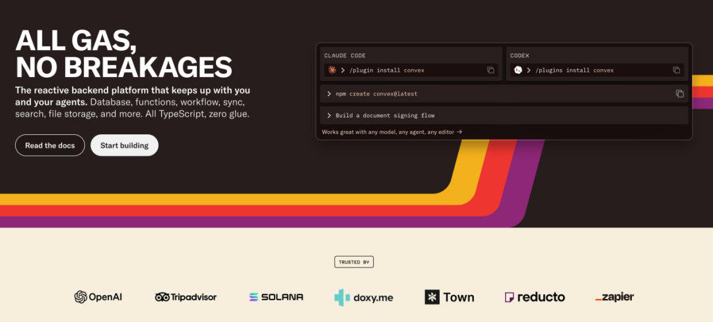 ⁠

Convex 可以理解为一个 TypeScript 原生的实时后端平台。它将数据存储与后端逻辑放在同一套开发模型中。开发者用 TypeScript 编写查询和业务逻辑，Convex 自动追踪数据依赖；数据库发生变化后，相关查询会重新执行并把一致的结果推送到客户端。

⁠

Convex 的核心，是把查询变成持续的订阅。底层数据发生变化时，查询结果会重新计算并同步到客户端。因此，Agent 的整个执行过程都可以被保存为实时状态。前端只需呈现这些状态，不必反复调用接口来判断后台进度。

⁠

Supabase 则以 PostgreSQL 为核心，并在此基础上提供认证、文件存储和后端计算等能力。它的优势是开放且通用，也能兼容 SQL、BI 工具和成熟的 PostgreSQL 生态。但数据库更擅长记录结果，至于 Agent 如何推进任务，处理异常，又如何恢复执行，通常还需要应用代码或工作流系统来定义。Supabase 更像一套以数据库为中心的基础设施。

⁠

Stateful Backend 并不是为了取代 PostgreSQL。传统数据库在复杂查询和生态集成上仍有明显优势。未来可能出现混合架构：PostgreSQL 保存最终业务数据，Stateful Backend 承载 Agent 的执行状态和实时交互。

⁠

公司由前 Dropbox 基础设施负责人 Jamie Turner 和 James Cowling 创办，两人曾参与 Dropbox 的超大规模存储和数据库系统。Convex 在 2021 年获得 350 万美元种子轮、2022 年获得 a16z 领投的 2,600 万美元 A 轮，2025 年又获得 a16z 领投、Spark Capital 联合领投的 2,400 万美元融资。

⁠

## Identity

⁠

传统 IAM 主要管理两类身份：人类员工和行为稳定的应用账号。Agent 介于两者之间：它既可能代表用户行动，也可能独立运行。这种兼具人类代理性与机器执行力的特征，使 Agent 身份管理需要覆盖从创建、授权到消亡的完整运行过程。

⁠

以一个例子帮助更好地理解：工程师 Alice 在 Slack 中要求运维 Agent 检查支付服务故障，并在确认发布有误后回滚版本。

⁠

任务开始时，身份系统先验证 Alice，再为 Agent 创建临时身份。同时记录它的发起人、负责人、有效期和应用范围。Agent 只能获得短期令牌，并据此读取必要的代码和日志。它无法接触 Alice 的密码，也不能访问支付服务之外的数据。

⁠

当 Agent 准备执行生产回滚时，PAM 会检查任务背景和目标资源。如果操作风险较高，系统还会要求人工确认。审批通过后，Agent 获得一项仅十分钟有效的回滚权限。该权限只适用于指定服务，任务之外不保留任何生产访问能力。这就是 Just-in-Time 权限和 Zero Standing Privilege。

⁠

执行过程中，系统会记录从 Alice 发起任务到 Agent 修改资源的完整责任链。如果 Agent 访问无关系统，网关会立即阻止操作，并撤销令牌。任务结束后，临时权限和 Agent 身份也会自动失效。

⁠

可以看出，Agent 时代的身份管理不再只是确认“你是谁”。它还要持续判断 Agent 代表谁，为什么行动，可以访问什么，以及权限应在何时失效。

⁠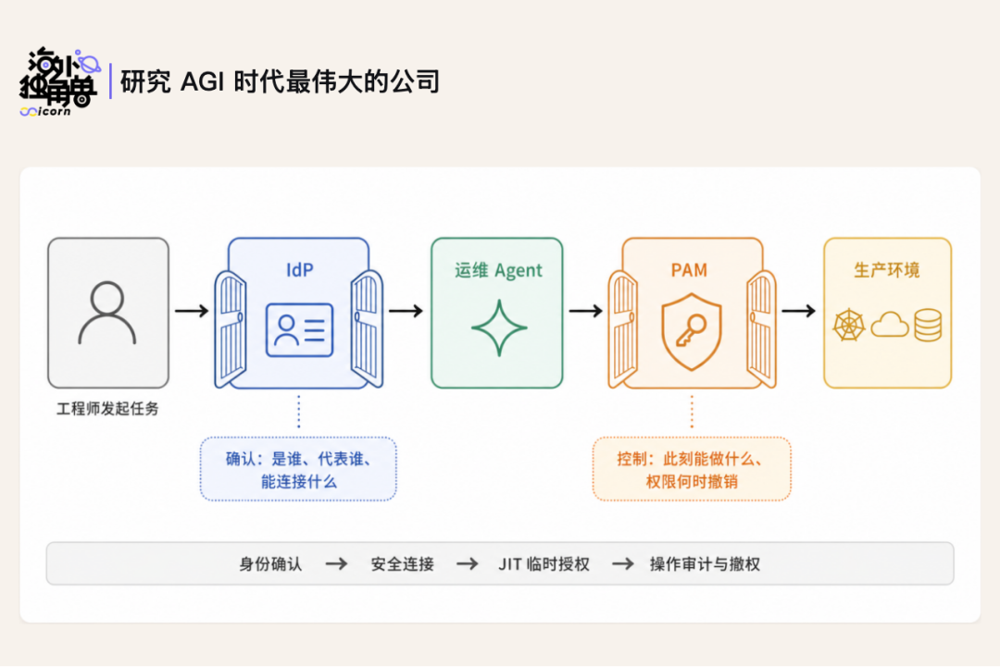 ⁠

也正因为 Agent Identity 需要贯穿创建、连接、授权、执行和撤销，它会成为 Agent 基础设施中比较有利于 incumbent 的一层。这不是一块从零开始的新市场。每一次授权判断都依赖企业已经积累多年的身份目录与权限数据，而这些资产主要掌握在 Okta、Palo Alto Networks 等平台手中。

⁠

Okta 正在从员工 IdP 扩展为 Agent IdP。其核心是确认 Agent 的身份，明确它代表谁，并限制其应用访问范围。2026 年 4 月正式 GA 的 Okta for AI Agents 进一步加入身份安全态势管理和 Cross App Access。开发者侧的 Auth0 则通过短期令牌和细粒度授权，让 Agent 能够代表用户调用外部 API，而不必保存长期凭证。

⁠

Palo Alto Networks 则通过 CyberArk 进入 Agent 特权控制。PANW 以 250 亿美元收购 CyberArk，并于 2026 年 2 月完成交易。CyberArk 将 Agent 视为高权限机器身份，并通过 AI Agent Gateway 按任务发放即时权限。Agent 平时不持有生产权限，异常会话也可以被及时隔离。结合 PANW 原有的网络和云安全能力，这套体系可以形成从异常识别到权限撤销的完整闭环。

⁠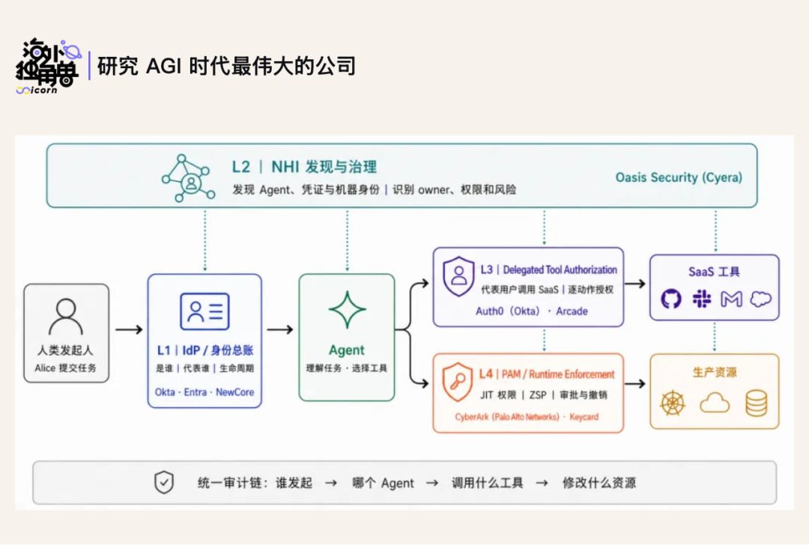

Agent Identity 的核心控制栈

⁠

由此可以看到，Agent Identity 的核心控制栈仍由 IdP 和 PAM 构成。大厂掌握主要执行层，并通过收购继续扩展能力。除 NewCore 外，多数创业公司并不直接替代现有身份系统，而是在其上构建更适合 Agent 的能力。例如建立身份图谱，或将静态身份管理延伸为动态授权。例如 Oasis Security 当前的核心差异化是用 NHI 原生的数据模型补上了传统身份安全产品缺失的“上下文”。扫描云环境，把机器身份与权限、资源、负责人和访问行为关联起来，再通过预置的 policy engine 识别凭证权限过度、离职、资源暴露等问题。

⁠

产品机会还包括建立面向 Agent 的运行时授权层。以 Keycard 为例，它连接企业现有的 IdP，将用户、设备、Agent 和当前任务组合成完整的身份上下文，并在凭证签发时执行策略判断。通过验证后，系统生成短时、最小权限的任务级凭证；任务结束后。创业公司的机会在于将这种逐次授权、凭证签发和委托链审计预先产品化，以更轻量的方式补足传统 IdP 与 PAM 在 Agent 场景中的能力缺口。

⁠

从商业化路径看，Identity 创业公司更现实的策略是先以轻量扫描和风险可视化进入客户，再逐步承担授权决策与修复编排，最终成为现有身份基础设施之上的 Agent 控制平面。由于 IdP、PAM 和数据安全厂商掌握执行入口、客户关系及销售渠道，当新能力逐渐标准化后，平台收购仍可能是多数创业公司的重要退出路径。例如在文章写作过程中，Oasis Security 被数据安全平台 Cyera 以 10 亿美元的估值收购。从产品销售路径看，客户也更倾向于向已有供应商统一采购，而不是额外引入多个单点工具。

⁠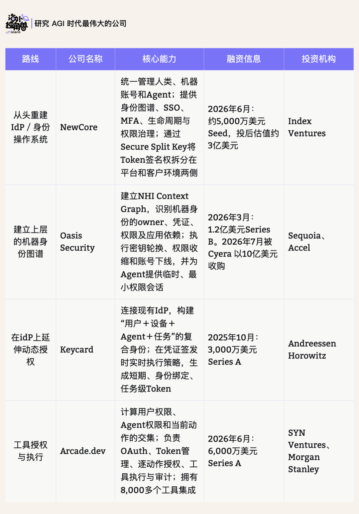 ⁠

## Eval

⁠

传统云软件的行为相对确定，通常可以通过日志、指标和调用链判断。因此，上线后的质量管理主要以 Observability 为中心，功能正确性则由上线前的单元测试和集成测试保证。而 Agent 有可能在没有任何系统报错的情况下交付了错误的结果。

⁠

传统 Observability 能够记录 agent 做了什么，却无法独立判断它做得好不好。在 Agent 系统中，Observability 仍是必要的数据底座，而 Evals 成为判断任务质量、发现行为退化和控制版本发布的核心层。我们之前在 LLM eval 领域关注过 Braintrust，但到了 Agent Eval 领域发现他们做得也不够深，需要更深度地理解 agent trace。

⁠

Agent 一次任务可能包含数百次模型调用和子 Agent 协作，每一步都会产生输入输出、状态、成本和延迟；任务完成后还会继续追加用户反馈、标注和评分。Agent Trace 以高吞吐追加写入、时间范围过滤和跨大量记录聚合为主，这类分析负载天然适合 ClickHouse 等实时列式 OLAP 引擎。Langfuse 从 Postgres 迁移到 ClickHouse 后，查询从分钟级降到几乎实时就是一个很好的例子。

⁠

Eval 目前仍带有较强的服务属性，能够提供相关服务的公司很多，产品也较难标准化。因此，它未必会直接形成边界清晰的独立赛道，更可能被推理平台、数据公司和 Agent 产品吸收。

⁠

Patronus AI 的转型也代表着这一层的新方向，演化为 Agent 的训练环境和反馈基础设施。Patronus AI 早期主要基于固定数据集检测幻觉、安全和事实错误，产品形态仍接近传统模型测试；2026 年推出 Digital World Models 后，公司开始模拟浏览器、代码库和企业软件等数字工作环境，让 Agent 在其中执行长周期任务，并自动生成任务、环境变化和 reward signal。

⁠

Langfuse（ClickHouse）：占据 Agent 的生产数据观测入口

  
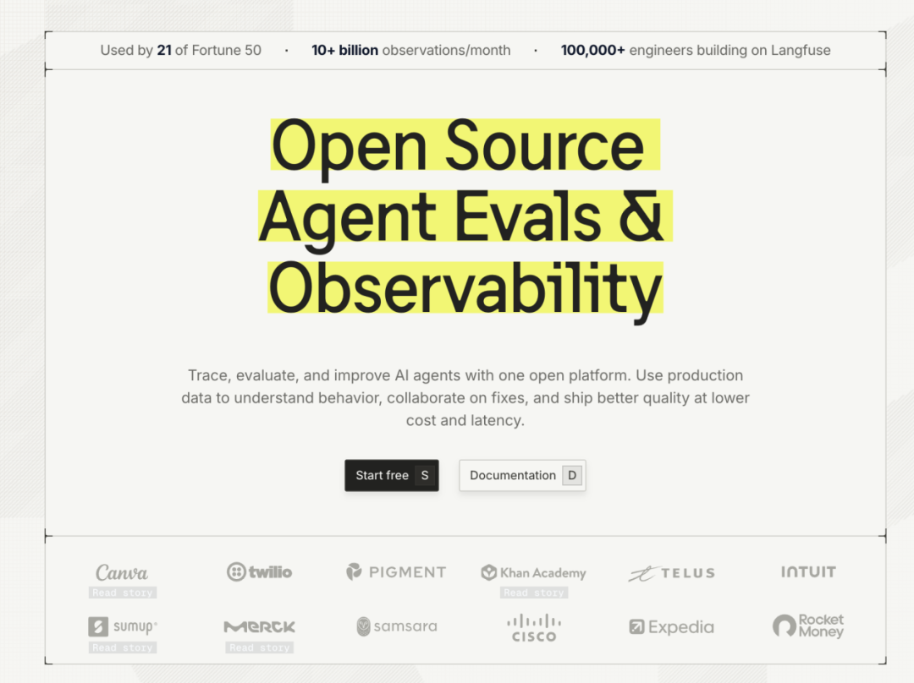 ⁠

Langfuse 的优势是核心开源、可私有化部署，LLM 可观测和评测功能较完整，并支持 SDK、OpenTelemetry、API 与 CLI。它还提供 Agent Graph，可以用节点图直观还原复杂 Agent 的实际执行过程。

⁠

其核心价值还在于将可观测性、评估、Prompt 管理和成本监控连接在同一套数据中。开发者可以从生产 Trace 中筛选典型案例，沉淀为测试数据集，比较不同模型与 Prompt 的表现，再通过版本和部署标签管理上线。Langfuse Cloud 免费套餐适合个人项目、PoC 和早期团队；自托管版本则不按使用量收费。

⁠

为支持大规模 Agent 工作负载，Langfuse v3 将 Trace、Observation 和 Score 等分析数据迁移至 ClickHouse，而用户、项目、Prompt 和数据集等事务数据仍保留在 PostgreSQL。这一架构更适合高频数据写入与聚合查询，可支撑数亿级记录。

⁠

Langfuse 由 Marc Klingen、Max Deichmann 和 Clemens Rawert 创立，于 2023 年正式发布并完成 400 万美元种子轮融资。2026 年 1 月，Langfuse 被 ClickHouse 收购，团队整体加入 ClickHouse，但产品继续保持 MIT 开源、自托管和独立云服务。

⁠

Patronus AI：从静态评测到 Simulation 的转向

  

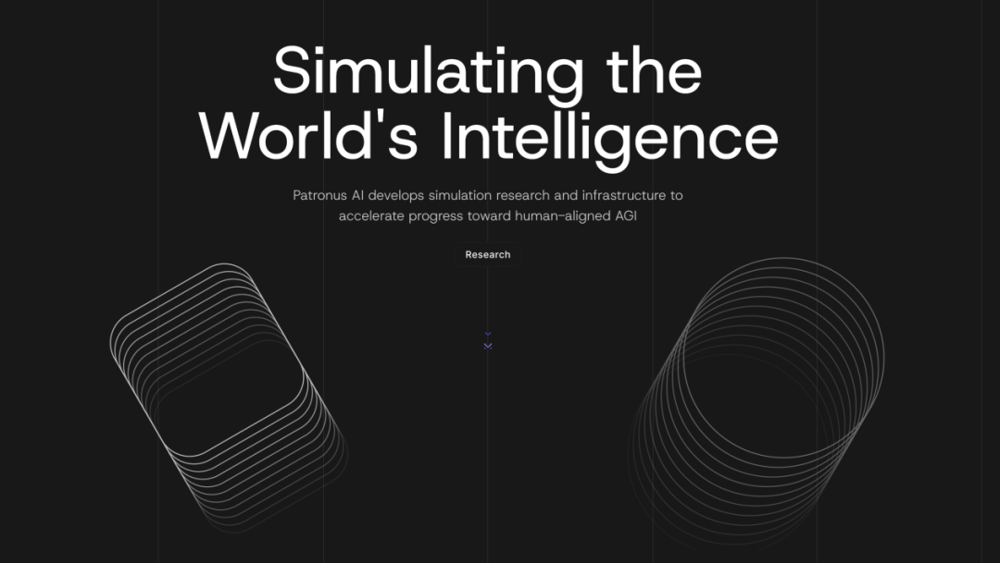 ⁠

Patronus AI 是一家 AI Evaluation 与 Agent Simulation 公司，最初帮助企业检测模型幻觉、安全风险和错误输出，现在正向 Agent 训练与模拟基础设施扩张。它服务 AI 工程师和模型研究团队，既提供实验、trace、数据集和自动评分平台，也开发专门的评估模型与行业 benchmark。

⁠

其代表产品包括用于幻觉检测的 Lynx、通用小型评估模型 Glider，以及 Agent 评估助手 Percival。Percival 可以分析完整的 Agent trace，识别推理、规划、工具使用和执行过程中的二十多类问题。相比调用通用大模型进行打分，Patronus 更强调自研 evaluator、专业测试集和可解释的错误分析。

⁠

随着静态 benchmark、简单 SFT 数据和训练 mix 在过去两年逐渐商品化，公司在 2025 年下半年开始转向 RL environments。2026 年，Patronus 进一步推出 Digital World Models，通过模拟浏览器、企业软件、代码库和金融工作流，为长周期 Agent 动态生成任务、环境和奖励信号。

⁠

背后代表着的趋势是，静态 benchmark 容易被开源复制，通用 LLM judge 会随着基础模型提升而贬值，而真正高质量的评测标准往往需要针对客户模型和业务重新设计，面向前沿实验室的复杂 environment 又高度依赖研究服务。所以 Patronus 不再逐个手工交付固定任务和环境，而是训练能够模拟软件、工具和数字工作流的模型，动态生成轨迹和训练数据。

⁠

公司由 Anand Kannappan 和 Rebecca Qian 创立，两人曾分别在 Meta Reality Labs 和 Meta AI/FAIR 从事实验系统、NLP 与模型对齐研究。Patronus 在 2023 年完成 300 万美元种子轮，2024 年完成 1,700 万美元 A 轮，2026 年 6 月又完成 Greenfield Partners 领投的 5,000 万美元 B 轮，累计融资约 7,000 万美元。

⁠ ⁠

03.

## 投资主题 2：拓展 Agent 能力边界

⁠

## Search

⁠

根据 Cloudflare 2026 年 6 月发布的报告，自动化流量已经占 HTTP 请求的 57.5%，自动化搜索的需求在历史上第一次超过人类。

⁠

联网检索是几乎所有知识型 agent 的第一个外部依赖，毕竟模型权重里的知识有截止日期，而 agent 处理的都需要最新的信息。过去三十年的搜索基础设施是为人建的，Google 返回蓝链接加摘要，这些排序是为了点击率和广告设计，但 Agent 不需要这些。

⁠

具体而言，传统搜索引擎的优化重心是 position：它关注网页在搜索结果中的相对位置，以及如何通过排序帮助用户完成浏览、点击和选择。其核心产品在很大程度上是对有限的搜索页面位置和用户注意力进行分配。

⁠

Agent 不受视觉位置和点击习惯驱动，而是直接消费搜索系统返回的信息。因此，Agent-native 搜索的优化重心从结果页位置转向了面向任务的 retrieval：在有限的时间、成本和上下文窗口内，找回真正相关且可被机器直接使用的信息。

⁠

在这一范式下，评判搜索引擎的主要标准是它能否让下游 Agent 以尽可能少的 Token 获得足够准确且可验证的材料，并最终提升任务完成的质量。

⁠

模型公司 API 虽然也有内置搜索，但短期内无法对 Agent Search 公司造成替代，优势来自于：

⁠

•调用单价极高：内置搜索通常作为基础模型服务的增值部分，其调用价格远高于专业 API。

⁠

•Token 膨胀与重复计费：内置搜索返回的内容会被转化为大量 Token。

⁠

•无法审计与复用：由于结果被加密或隐藏在黑盒中，开发者无法对搜索质量进行记录、缓存或审计。

⁠

•阻碍编排效率：使用独立 API 时，开发者可以在模型生成响应之前就向用户展示搜索进度，或者对搜索结果进行预处理。 而内置方案剥夺了这种精细化控制权，使得开发者难以优化用户体验或提升端到端延迟性能。

⁠

从技术栈看，Agent Search 可以进一步拆成“网页采集与清洗—索引与召回—任务推理与结构化交付”三步，形成两类主要路线：一类以 Exa 和 Parallel Web Systems 为代表，自建 Web-scale Index，并分别向神经检索和任务推理延伸；另一类以 Firecrawl 为代表，聚焦 JavaScript 页面渲染、内容解析和格式标准化，为搜索系统及 Agent 提供底层数据获取能力。

⁠

需求在今年迅速爆发，根据 Tavily 披露，其调用量从今年 4 月 的月均 1.5 亿次增长到了最新的 3 亿次以上，在 3 个月时间翻倍。

⁠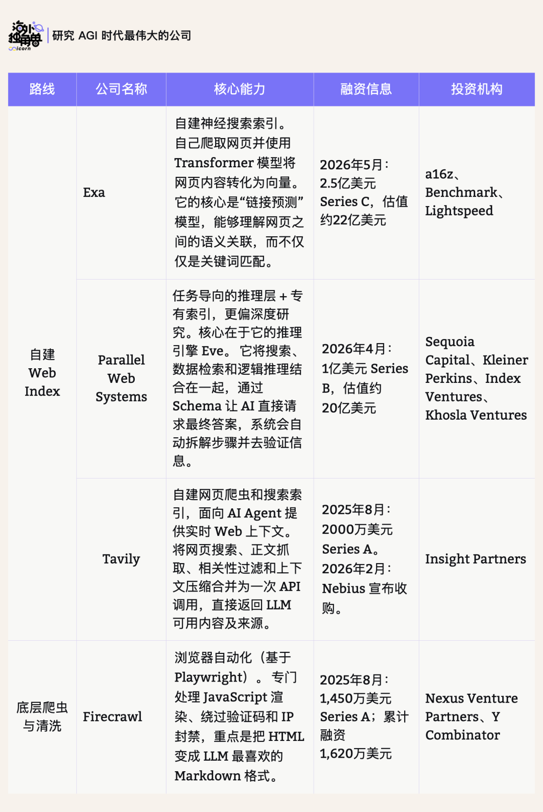 ⁠

## Payment

⁠

Agent Payment 的本质是把模糊的人类意图转化为可验证的支付指令。分为三层结构：Agent 在上游负责理解目标、搜索和决策；确定性的授权系统负责检查额度、商户、时间和用途；传统卡网络或稳定币系统完成最终结算。Agent 提出买什么，但无法直接控制不可逆的资金转移。

⁠

在 Agentic Commerce 中，购买行为又分为两类：

⁠

第一类是 Macro Payment，即 Agent 代表个人或企业完成机票、酒店、SaaS、办公用品等传统采购。这类交易是旧需求，Agent 只是代替人类执行，主要新增了委身份识别和责任认定问题。

⁠

第二类是 Micro Payment，即 Agent 为完成任务而自主购买 API、数据、算力甚至是其他 Agent 的服务。这些交易具有高频、即时交付等特点。一项研究任务可能需要 Agent 临时调用十几个数据源，每次只支付几美分；一个代码 Agent 也可能按分钟购买算力或测试环境，任务完成后立即退出。传统银行卡的固定费用和订阅流程难以适配这种交易形态，因此产生了 x402、MPP 等机器原生支付协议。

⁠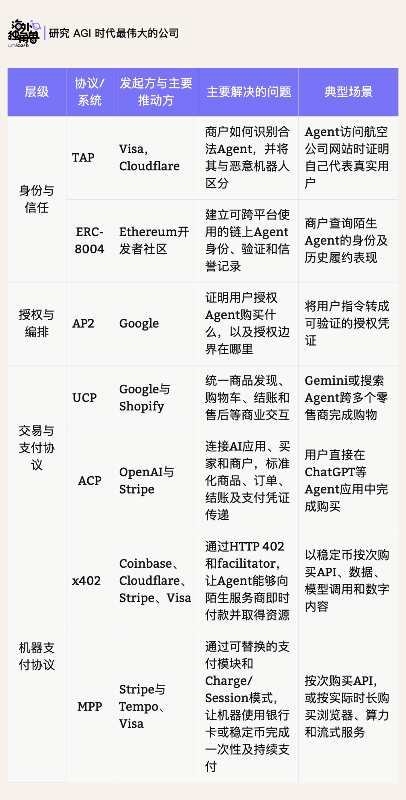

Agent Identity 的核心控制栈

用一个具体的例子解释上述协议的关系：

⁠

有一天你让 Agent “在 1 万元预算内预订下周去东京的直飞机票和 2 晚可取消酒店”，那么 AP2 会先把预算、时间、地点和退款条件转化为可验证的授权指令，TAP 向航空公司和酒店证明这是代表用户行事的合法 Agent。

⁠

Agent 在搜索过程中，可以通过 x402 用稳定币按次购买航班准点率、酒店库存等数据分析挑选最佳购买时间，也可以通过 MPP 按使用时长购买机票实时价格监控服务。

⁠

选定商品后，ACP 负责组织购物车和结账流程，确定性授权系统再次核对金额、商户和商品是否符合用户要求，最后使用受限的代币化银行卡凭证支付机票和酒店。

⁠

这样，一次差旅任务同时使用稳定币处理低额、即时交付的机器服务，用银行卡处理可能涉及退款和拒付的大额消费，而 AP2、TAP 和 ACP 分别负责授权、身份验证和交易编排。

⁠

商业模式：给 Agent 收过路费

  
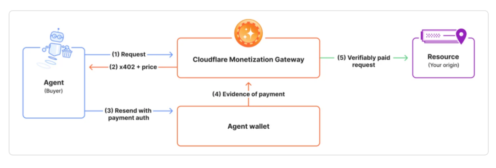 ⁠

2026 年 7 月，Cloudflare 宣布 Monetization Gateway：客户将可以直接在 Cloudflare 控制台或 API 中，为网页、数据集、REST API、文件和 MCP 工具配置收费规则。初期用稳定币通过 x402 结算，产品目前仍处于等待名单/早期接入阶段，商业模式仍在进一步摸索中。

⁠

从投资角度看，结算协议本身大概率由 Stripe、Visa、Mastercard、Coinbase 等巨头掌控；留给创业者的位置在协议之上：包括 Agent 身份与信誉、责任认定和争议处理。

⁠

这一层最终可能形成“Agent 版的 Plaid + Experian”：不仅连接账户和支付方式，还回答这个 Agent 是谁、被允许做什么，以及历史上是否可信。因为传统风控依赖设备指纹、鼠标轨迹和浏览行为，这些信号在 Agent 交易中会消失，因此市场需要新的 KYA、授权凭证、行为信誉和全链路审计。

⁠

这个赛道的创业公司形成了四条主要路线：Skyfire 从 Agent 身份、支付凭证和服务结算切入，试图建立 KYA 系统；Crossmint 以钱包、银行卡和稳定币支付编排为核心，连接链上资产与传统卡网络；Catena 更进一步，为企业 Agent 提供原生金融账户、额度和合规政策，希望成为 Agent 的银行；Paid 则从计量与商业化切入，希望做以结果为主导的计费方式。

⁠

不过，这一赛道能否诞生独立巨头，仍要等 Agent 交易形成规模并进入企业采购和金融服务等高价值场景后才能判断；届时，持续处于交易闭环、能够沉淀身份与积累行为数据的公司，才能建立真正的数据壁垒。

⁠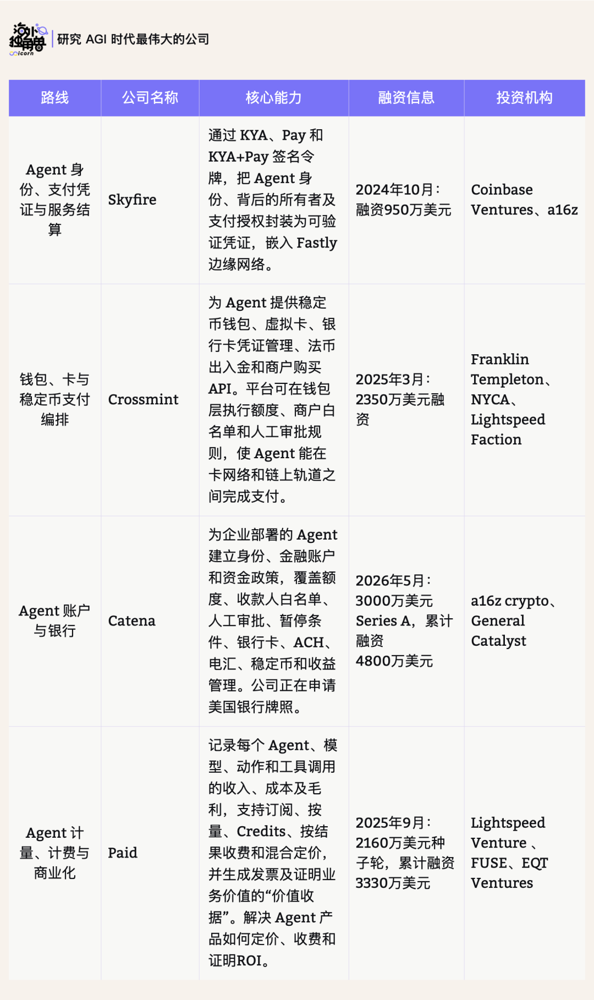 ⁠

## Context

⁠

从实践上来看，Context 会形成正反馈飞轮：用户在一个产品里使用越多，Context 越完整，Agent 越好用；用户越不愿意迁移，并继续产生更多 Context。这也是为什么“拥有用户上下文”的产品，会在 Agent 时代获得更强的主动权。过去互联网公司争夺的是入口、流量和生态，未来 Agent 产品争夺的会是用户和企业的上下文。

⁠

长期来看，Context 本身会成为 Agent Infra 里极其重要的一层。因为 Agent 是否真正理解用户、企业和当前任务，是他们在企业落地的关键。

⁠

Context 层代表的更像是未来 Enterprise AI 的演进方向，而不一定是一个能够独立采购、独立收费的基础设施品类。企业会为更准确的决策、更可靠的自动化和更低的人力成本付费，Context 必须进入真实工作流，并通过任务结果完成价值兑现。只有与任务、反馈和结果绑定的 Context，才能真正形成复利。

⁠

Agentic workspace 和数字员工是我们看好的 context 层方向。今天多数 Agent 产品仍是“单人单 Agent”模式：Codex、Claude Code、Cursor、Manus 各自拥有独立的上下文和执行环境，但彼此无法协作，最终人类反而成了调度器和瓶颈。

⁠

当一个人需要同时管理 10 个、100 个 Agent 时，核心问题将变成“Agent 能不能像组织一样协作”。

⁠

在这一层中，虽然还没体现出爆发性的商业公司，但却能看到未来 Agent 真正作为硅基员工与人类一起合作的设想。

⁠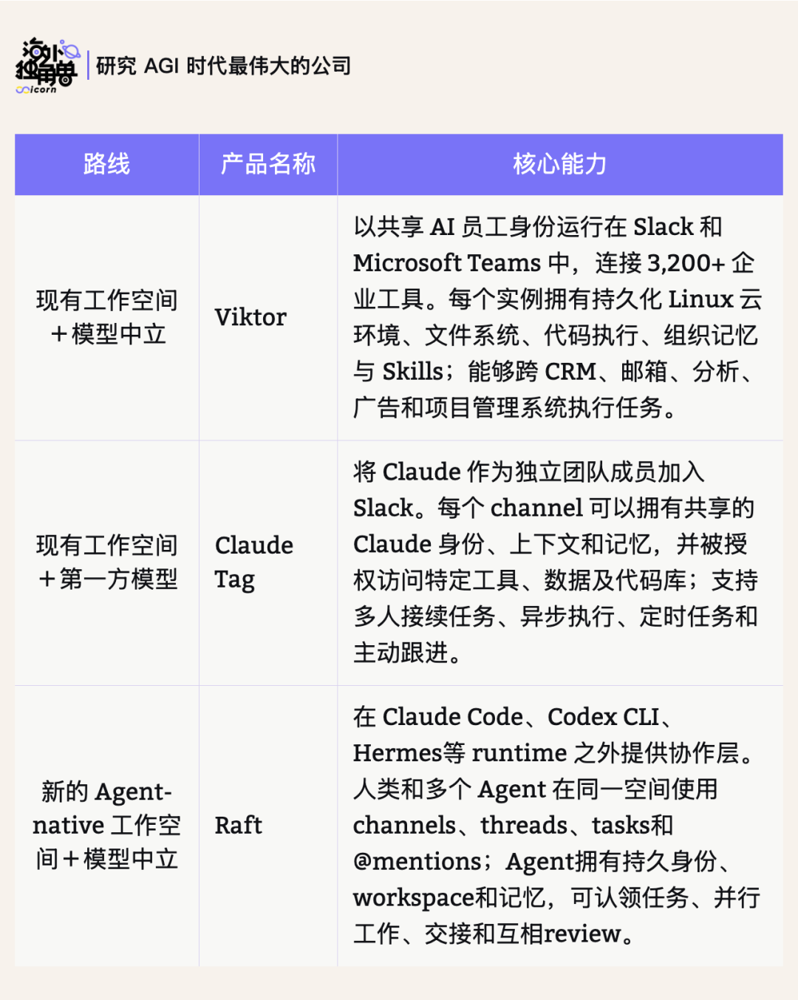 ⁠

也正因为这一层的关键位置，Anthropic 正在通过 Claude Tag 来渗透到企业更多现实工作的环境中。考虑到他们的竞争优势，我们不确定这一层是否能长出独立的大公司，但这个方向的发展一定对 agent 在知识工作者中的加速渗透有很大的帮助。

⁠

当下这个时间点，Agent 正在渗透率大幅加速的边缘，Agent Infra 自然也成了潜在 upside 很高的重要方向。期待这个领域的演进能让我们每次更新 mapping，都见证更多重要趋势和公司的出现。

  

  

排版：陈宇聪

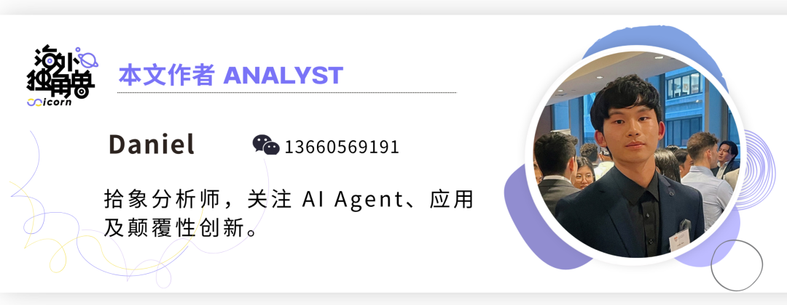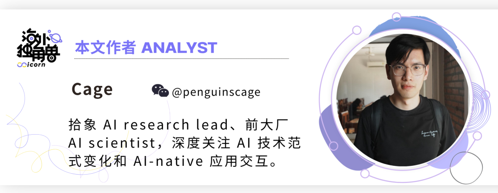

  

延伸阅读

当 Agent 成为 coworker：如何为新物种设计身份系统？

  

真实工作流，正在成为下一代训练数据

  

当开源模型逼近闭源，谁会成为 AI 世界的路由器？

  

深度讨论 Fable 5：模型收入分化，RSI，Tokenmaxxing 减速｜Best Ideas

  

Modal 的 Infra 复利，从 GPU Cloud 到 Agent Sandbox

