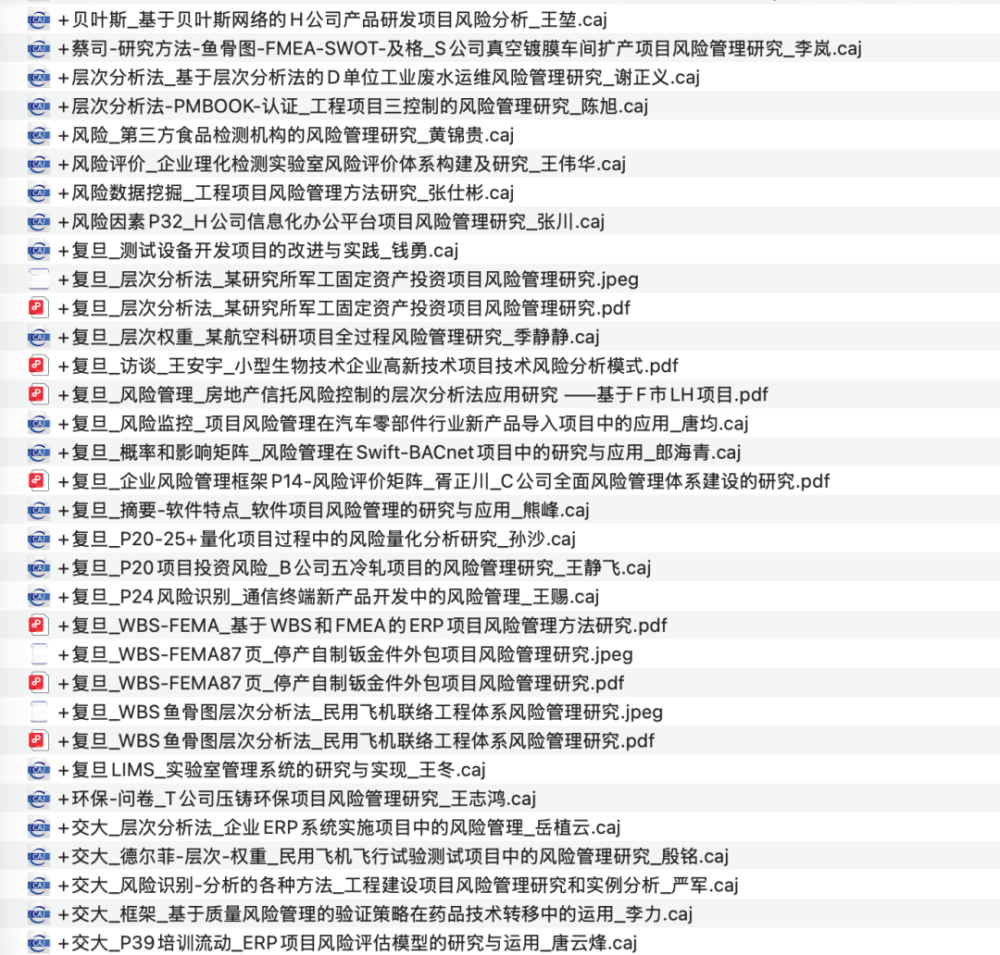
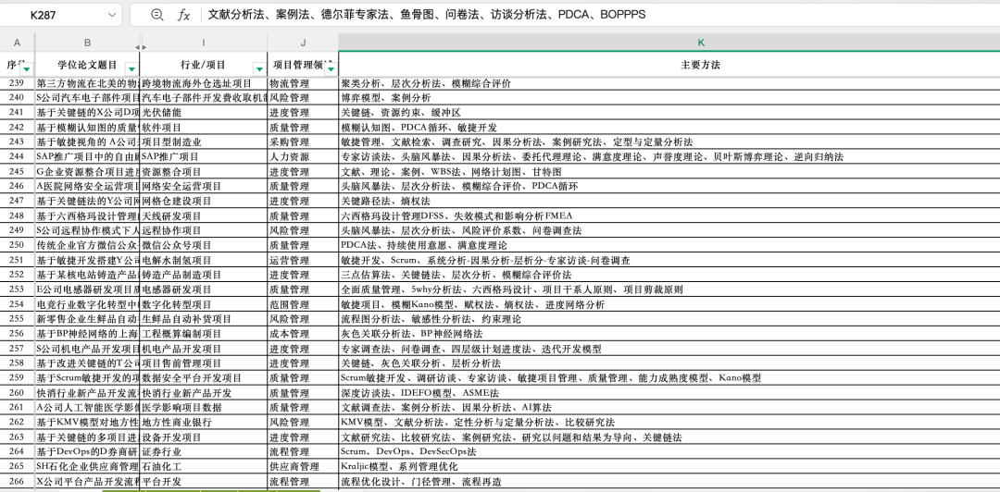
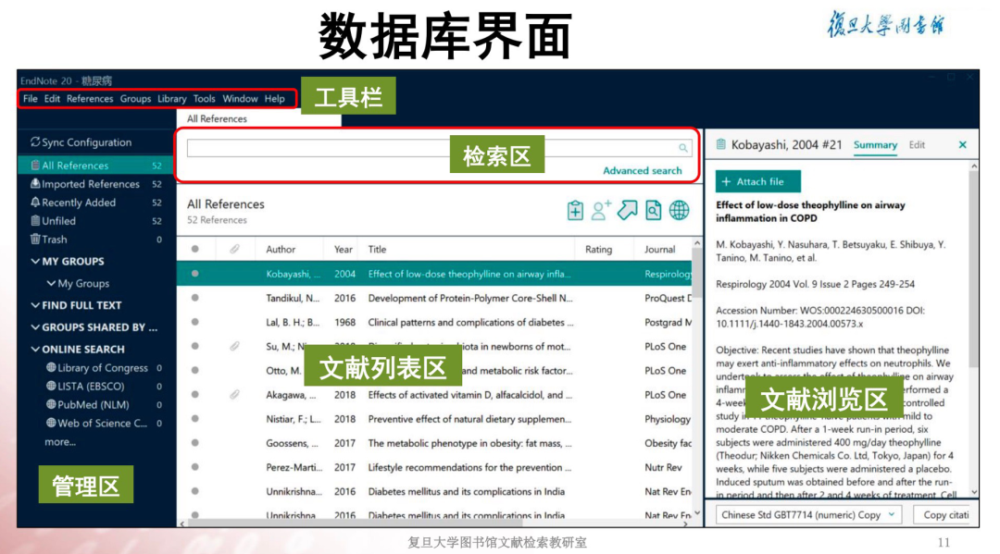
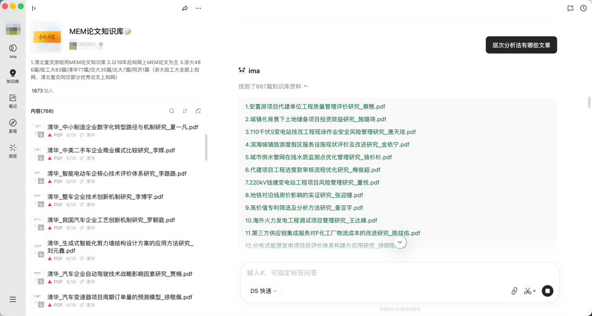
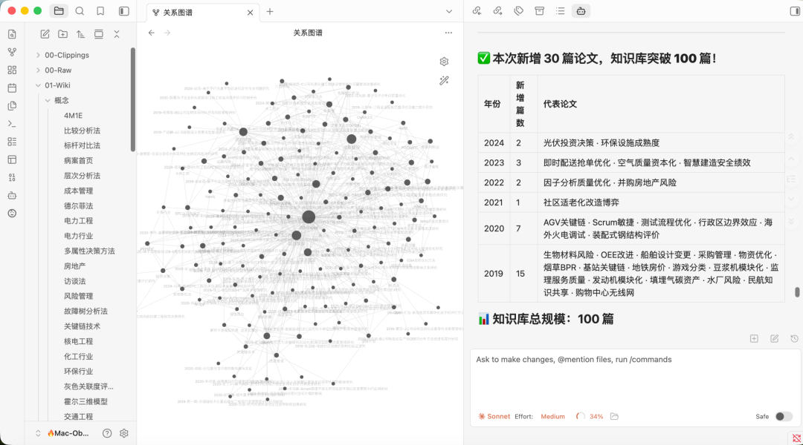
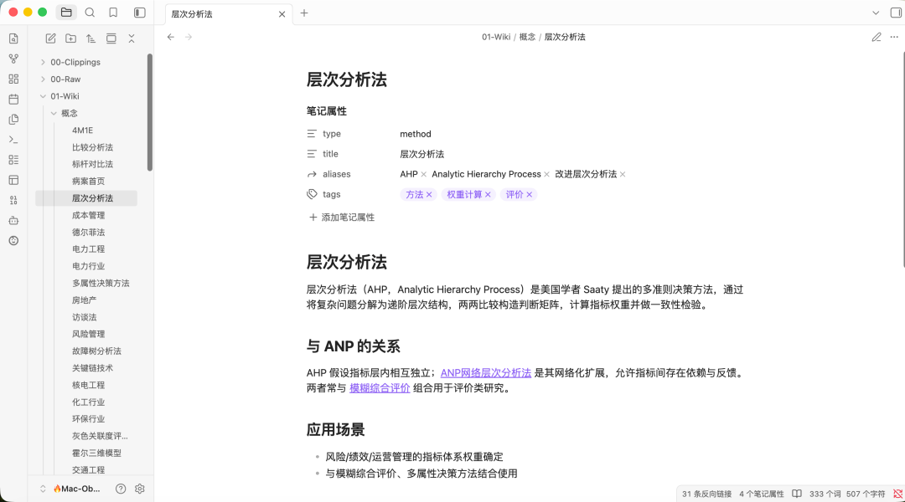
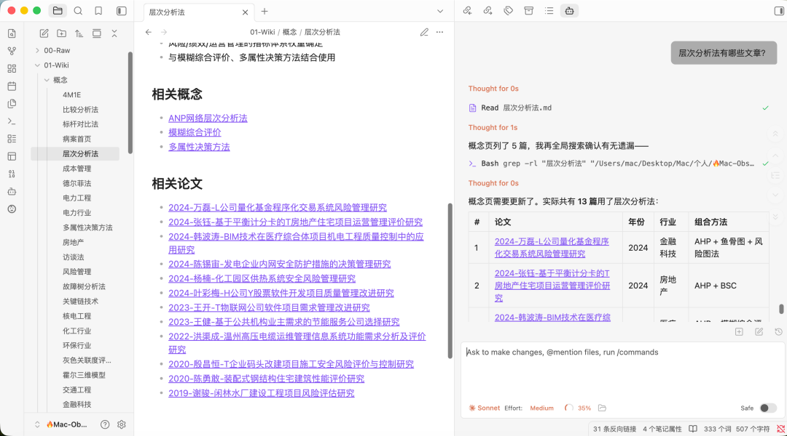
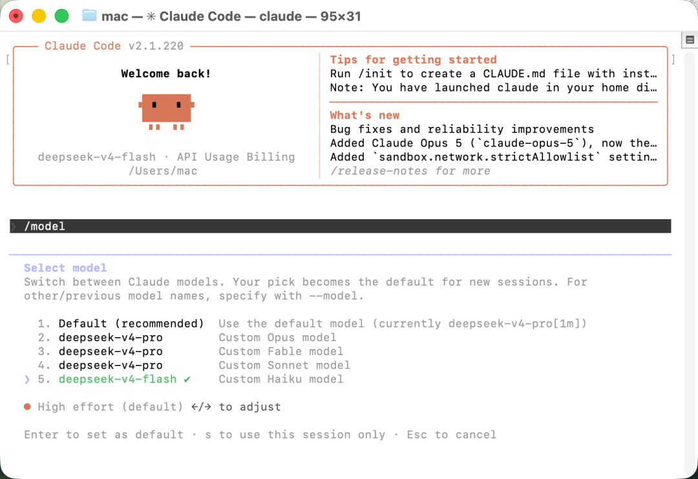
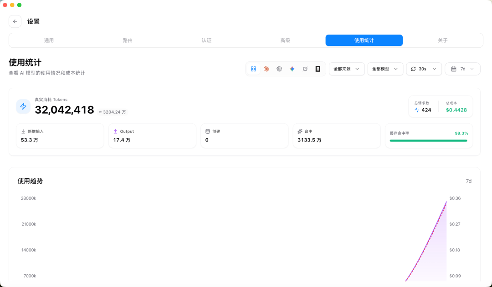
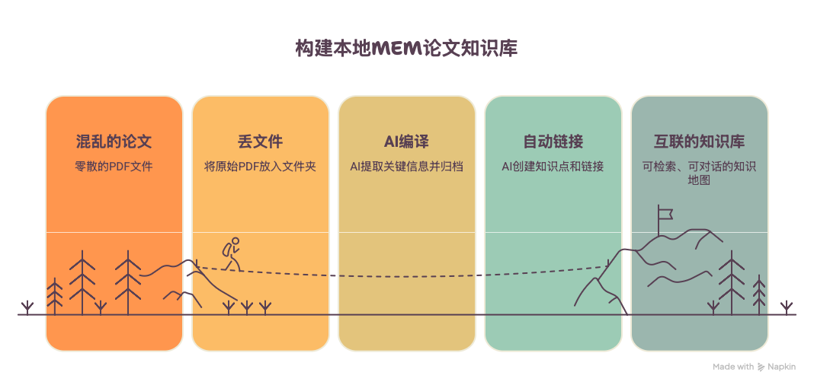

最近看论文，我彻底解决了文献混乱的难题：**在本地用 AI搭建一套MEM论文知识库**。几百篇读过的论文不再是零散PDF，直接打造出属于自己、随取随用的学术第二大脑。先来看效果：

相信写论文的同学都懂这种崩溃：

开题阶段突击研读文献、疯狂整理资料，开题结束暂时搁置写作。隔几个月开始写论文的时候，这文章好陌生啊，是我写的吗？之前啃过的内容基本全忘，看过的论文又要重读一遍。

日常总会反复遇到几个灵魂拷问：  
论文明明看了不少，动笔写作的时候怎么都想不起来？需要的论据资料死活找不到？  
看过的文献该如何高效管理？怎样才能快速检索到曾经读过的内容？参考文献怎么这么难找？

我之前写论文也深陷这个困境，反复翻找旧文件、重复查看文献，消耗大量时间。为了解决这个痛点，前后尝试多种方案，踩了不少坑。

1️⃣最开始思路很简单：大道至简，看完论文，直接把核心要点标注在文件名上，依靠命名留存信息。  

2️⃣后面发现这种方式过于粗糙，开始手动整理，一篇篇拆解论文，按照行业、研究方向、使用的研究方法分类归档。花了很多时间整理，这也是目前整理各大高校所有MEM论文知识库的基础。  

3️⃣也曾跟风尝试学校图书馆能下载的EndNote、NoteExpress、Zotero这类主流文献管理工具。客观来说，学习成本偏高，日常写论文很难静下心摸索，上手繁琐，最终全部闲置放弃。  

4️⃣之后还试过云端RAG方案，把论文批量上传ima。虽然目前我的知识库已经有近2000人使用。但实际使用体验并不理想：相同问题多次检索，返回的参考文献不稳定，答案前后不一；所有资料保存在云端，存在泄密隐患；断网之后完全无法使用，局限性较大。  

举个很真实的例子，大家就能体会这种痛点。  
你花一下午精读一篇**装配式建筑供应链风险管理** 论文，当时思路清晰，收获满满。  
时隔两三个月，撰写新项目风险评估相关内容时，突然想起有一篇适配度很高的文献，对应的方法刚好能用。  
可你记不清论文标题、作者，只模糊留有印象，翻遍所有文件夹，怎么都找不到。

更让人崩溃的是，当阅读论文达到二三十篇之后，会发现高频方法来来去去就那些：AHP层次分析法、模糊综合评价、熵权法、TOPSIS、鱼骨图、WBS、头脑风暴...相同的研究方法，分别应用在核电、水利、软件开发、医疗等不同领域，不同场景的研究结论完全可以互相参考、彼此印证。  
但传统文件存储模式下，**知识点之间隐形的关联无法被看见** ，所有知识相互割裂，大量阅读积累白白浪费。

于是我参考Andrej Karpathy的个人知识库理念，在Obsidian搭建了一套**本地 MEM论文AI知识库**。借助ClaudeCode整理数百篇MEM学位论文，搭建起一张互联互通的知识网络。

**【一】整套搭建流程超级简单，就三步**

**第一步：丢文件，无需手动整理**  
所有论文原始PDF，直接放入00-Raw文件夹。不用改名、不用手动标注、不用提前分类，原始文件原样保存。

**第二步： AI全自动编译整理**  
只需要告知AI“编译新论文”，它会自动读取PDF，提取标题、院校、年份、关键词、行业、研究方向、核心方法等关键信息。  
按照预设模板（这里是唯一你需要自己跟AI沟通下你的知识库的规则的文件），自动生成结构规整的论文归档笔记，存入01-Wiki目录。

**第三步：自动搭建链接，串联全部知识**  
AI不只是单纯归档论文，还会自动提取文中的研究方法、所属行业、专业概念，单独生成对应的知识点页面。  
依靠双向链接，把所有相关论文、知识点全部关联在一起。

这样改造之后：**每一篇论文不再是孤立的 PDF，而是能够相互联动的知识节点。**

**【二】整套知识库三层结构，清晰好用**

全程采用「raw→wiki→schema」三层架构管理，逻辑一目了然：

层级| 文件夹| 作用  
---|---|---  
原始层| 00-Raw/| 存放原始论文文件，不修改、不整理，仅作为原始备份  
知识层| 01-Wiki/| AI整理完成的论文笔记、知识点页面、索引目录，日常查阅主要依靠这一层  
规则层| 02-Schema/| 统一字段规范、文档模板、处理流程，保证所有资料格式标准统一  
  
每一篇AI生成的论文页面内容十分实用：  
基础信息、一句话摘要、研究背景、核心方法、主要结论、论文亮点、可借鉴思路，附带相关知识点、关联论文的跳转链接。

知识点也做好分类：概念、方法、行业、研究方向，一个知识点单独一页，整洁清晰。

**【三】最核心的优势：知识会产生复利**

这套知识库最大的价值，不在于存储论文的数量，而是**越积累越****好用** 。

分享一个实际案例：  
我先后整理多篇不同行业的风险管理相关论文：  
水利工程EPC风险管理，采用ANP-模糊综合评价；  
化工园区安全风险管理，采用FTA+AHP+TOPSIS；  
量化交易系统风险管理，采用鱼骨图+AHP。

放在以前，三份文件分散在文件夹里，很难察觉内在联系。  
但在知识库中，点开「风险管理」概念页，**全部相关论文自动汇总展示** 。  
再打开「层次分析法」页面，可以直观看到：这套方法在十几个行业、数十篇论文里，分别如何应用、优化、落地。

这就是知识复利：**每新增一篇论文，价值不只是简单 +1，而是和存量所有知识产生全新关联。**

**【四】本地私有部署，安全省心**

整套系统运行在本地电脑，全部资料以Markdown的格式保存在个人硬盘。  
无需上传论文至云端，不用担心未公开学位论文、企业内部资料泄露，断网环境下依旧可以正常检索查阅。

日常在用Obsidian的同学，可以直接把这套体系融入现有笔记；没有接触过也没关系，软件免费，逻辑简单，入门门槛低。

**【五】当前进度：百篇论文沉淀，知识图谱成型**

目前已经整理完成**100 篇2015–2024年MEM论文**。  
覆盖建筑、制造、IT、能源、环保、交通、航空等十几个行业，囊括MEM主流研究方向：风险管理、质量管理、进度管理、流程改善、投资决策等等。

所有文献、概念、研究方法、行业场景，通过知识图谱相互关联。  

它并不是普通的论文资源库，更像一张**可检索、可对话的****知识****地图** ：

•想查询「层次分析法在工程管理中的应用」，打开方法页面，直接查看多行业实践案例；

•寻找「制造业流程改善」相关素材，索引页一键筛选全部匹配论文；

•想要了解某位导师的研究方向，关键词搜索即可快速定位；

•Obsidian接入ClaudeCode之后，侧边栏可以直接提问，梳理写作思路。

•Claude Code接入了Deepseek，无需翻墙🪜科学上网。整体使用下来的逻辑有点类似Workbuddy，不一样的是所有整理的Markdown格式的文件都在Obsidian里面，有更好的模型也可以随时更换。

•费用也还可以，Claude Code通过CC Switch接入的DeepseekV4Pro模型，整理了100篇MEM论文，花费了5块不到的Token，这里还是得感谢梁文锋把价格打下来了。

**【六】后续计划**

接下来我会把存量论文全部完成编译，进一步完善知识库体系。后续筛选选题、梳理研究方法、查找案例、撰写文献综述，效率会大幅提升。

如果你正在撰写MEM论文，长期被杂乱的文献困扰，或是希望真正把读过的文献内化为自己的知识，这套本地AI知识库方案值得试一试。

图片来源：Napkin根据文本内容绘制

（声明：本文图片及数据来源于公开数据库整理。本人只负责数据的搜集和整理并做脱敏工作，不能保证数据的准确性和精度以及时效性。本数据仅用作为学习用途。如数据有侵权请告知本人，本人尽早删除该数据。）