随着大语言模型（LLM）驱动的智能体（Agent）从实验走向生产，一个被严重低估的安全断层正在快速扩大：智能体的「身份」问题。根据 Palo Alto Networks《2026 Identity Security Landscape》报告，机器身份与人类身份的比例已达到 109:1——其中约 72.5%（79 个）为 AI 智能体身份。与此同时，对 5,200+ 开源 MCP Server 实现的分析显示，53% 仍依赖静态 API Key 进行认证，仅 8.5% 采用 OAuth。GitGuardian 的数据更为触目：2025 年新增 2,865 万个硬编码密钥泄露到公开 GitHub 仓库，其中 AI 服务类密钥泄露同比增长 81.5%。本报告聚焦于 SPIFFE（Secure Production Identity Framework For Everyone）这一 CNCF 毕业标准，系统性地回答以下核心问题：为什么传统身份管理对智能体失效？SPIFFE 如何解决智能体的身份证明问题？如何结合 OAuth 2.0 委派链和运行时策略引擎构建完整的身份体系？如何在不同行业场景中落地？以及——最关键的——SPIFFE 与现有安全产品/合规框架如何协同形成完整防护？报告的核心论点可以概括为三层：

  * L1 工作负载身份（SPIFFE 解决“谁在工作”）： 通过运行时证明（Attestation）替代预置凭据，每个智能体获得不可伪造的 URI 标识符（SPIFFE ID）和短期密码学凭证（SVID），TTL 以分钟到小时计，自动轮换。
  * L2 用户委派链（OAuth 解决“为谁工作”）： 通过 RFC 8693 Token Exchange 将委托人（sub）和执行者（act）编码进 Access Token，配合 Transaction Token 在多跳调用中逐级收窄权限。
  * L3 运行时行为授权（PDP/PEP 解决“现在该不该做”）： 每次 MCP/A2A 调用经过策略执行点（PEP）向策略决策点（PDP）发起实时查询，决策独立于智能体代码，即使被劫持也无法自行放行。

在落地层面，报告提出了 L0→L4 五级成熟度模型和 18 个月四阶段路线图，并针对运营商、能源、科教文卫、企业等典型行业场景给出了差异化的拓扑选择、ID 设计方案和合规对标。特别地，SPIFFE 身份底座可与现有 AI 安全防护体系（内容围栏/流量网关/态势感知等）及合规框架（TC260 / 等保 2.0 / 行业监管）形成互补：SPIFFE 回答「是谁」，现有安全体系回答「做什么」和「安不安全」。两者叠加才是完整的智能体安全体系。

# 二、问题背景：为什么智能体需要 SPIFFE

## 2.1 机器身份爆炸：数字背后的结构性断层

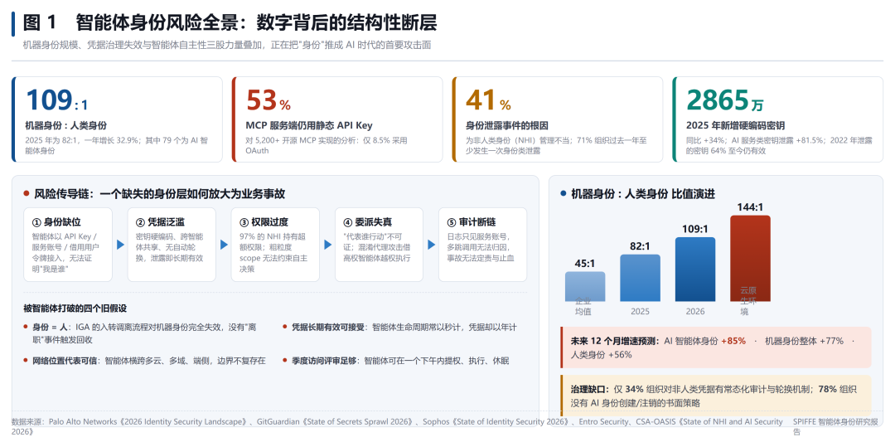图 1 智能体身份风险全景：数字背后的结构性断层图 1 展示了当前智能体身份领域的四个关键数据维度。这些数字揭示的不是渐进式的增长，而是结构性的范式转移：\*\*（1）机器身份数量级碾压人类身份。\*\* 2026 年的比值已达 109:1（2025 年为 82:1），在云原生环境中更是高达 144:1。这意味着每 1 个员工对应超过 100 个机器身份——而其中近 3/4 是 AI 智能体身份。更严峻的是增速：AI 智能体身份预计未来 12 个月增长 85%，远超机器身份整体增速（77%）和人类身份增速（56%）。\*\*（2）协议层身份机制严重滞后。\*\* Model Context Protocol（MCP）已成为 Agent 连接工具的事实标准（Anthropic/OpenAI/Google/Microsoft 全线支持），但 53% 的开源 MCP Server 仍以静态 API Key 作为唯一认证手段。API Key 是典型的 bearer artifact——不提供密码学绑定、不传达身份信息、通常长期有效且难以轮换。IETF draft-klrc-aiagent-auth-00 明确将其标记为「反模式（antipattern）」。\*\*（3）凭据治理全面失效。\*\* 41% 的身份相关泄露事件根因是非人类身份管理不当；97% 的 NHI 持有超额权限；71% 从未在推荐时间窗口内轮换；仅 34% 的组织对非人类凭据有常态化审计机制；78% 的组织没有 AI 身份创建/注销的书面策略。更令人担忧的是，2022 年泄露的凭证中 64% 至今仍有效——一个三年前泄露的密钥可能仍在被滥用。\*\*（4）风险传导链已形成闭环。\*\* 如图 1 左侧所示，五个环节构成了一条清晰的风险放大链：身份缺位 → 凭据泛滥 → 权限过度 → 委派失真 → 审计断链。每一个环节都在为下一个环节提供攻击面，最终导致业务事故时无法定责、无法止血、无法追溯。

## 2.2 四个被打破的旧假设

传统的企业身份治理架构建立在四个隐含假设之上，而智能体的出现逐一击碎了这些假设：旧假设| 为什么在智能体时代失效| 后果  
---|---|---  
身份 = 人| IGA 的入转调离流程完全围绕人类设计。智能体没有“入职”，也没有“离职”事件触发凭证回收。| 停用的智能体进程残留、端口开放、API Key 未撤销，形成暗资产  
凭据长期有效可接受| 人类密码通常 90 天轮换一次。但智能体生命周期常以秒计（一次性任务 Agent），凭据却以年计。| 泄露影响面极大；一个被入侵的 Agent 可在其整个凭证有效期内持续作恶  
网络位置代表可信| 传统安全依赖网络边界（内网=可信）。智能体横跨多云、多域、端侧、边缘，边界不复存在。| 基于 IP/子网的访问控制完全失效；需要转向基于密码学身份的零信任模型  
季度访问评审足够| 人类权限变更频率低，季度评审勉强可行。智能体可在数小时内完成提权→执行→休眠全流程。| 审计永远落后于实际状态；异常行为在下次评审前早已造成损害  
  
  

## 2.3 智能体身份必须同时回答三个问题

midships.io 的研究（《Why Workload Identity Alone Is Not Enough for AI Agents》）精辟地指出：对于 agentic AI 系统，身份必须同时回答两个问题——「什么工作负载在发出请求？」和「哪个用户授权了该操作？」——而我们在此基础上补充第三个问题：「这个操作现在应该被执行吗？」这三个问题分别对应三个技术层次：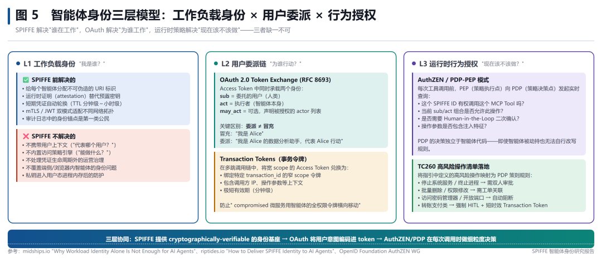图 5 智能体身份三层模型：工作负载身份 × 用户委派 × 行为授权如图 5 所示，SPIFFE 完美覆盖 L1（工作负载身份），但在 L2（用户委派）和 L3（行为授权）层面需要 OAuth 2.0 和 PDP/PEP 架构的补充。这正是本报告后续章节要展开的核心框架。

# 三、SPIFFE/SPIRE 技术深度解析

## 3.1 SPIFFE 核心概念：从“持有密钥”到“自证身份”

SPIFFE（Secure Production Identity Framework For Everyone）是 CNCF（云原生计算基金会）毕业项目，定义了一套通用的、平台无关的工作负载身份标准。其核心理念可以用一句话概括：\*\*工作负载不需要持有任何密钥或令牌就能证明自己的身份——它的运行环境本身就是凭证。\*\*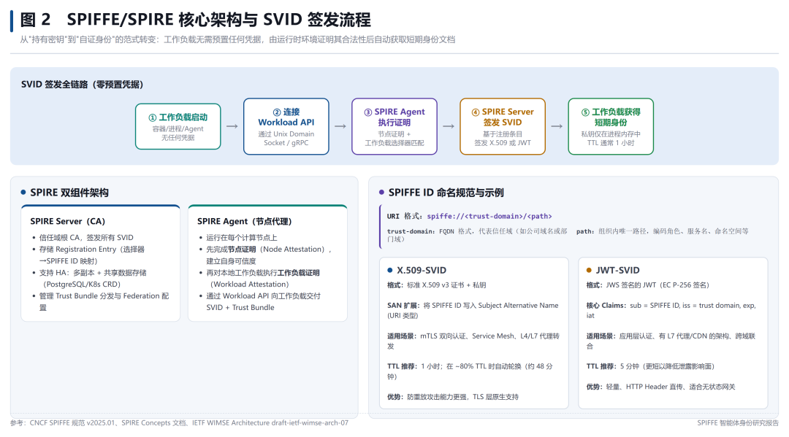图 2 SPIFFE/SPIRE 核心架构与 SVID 签发流程如图 2 所示，SPIFFE 的核心组件包括：

  * SPIFFE ID： 统一资源标识符（URI），格式为 spiffe:///。trust-domain 通常为组织的 FQDN（如 spiffe://nsfocus.com），path 编码角色、服务名、命名空间等层级信息（如 /agents/data-analyst）。这是所有身份操作的枢纽。
  * SVID（SPIFFE Verifiable Identity Document）： 密码学身份文档，有两种格式——X.509-SVID（标准 X.509 v3 证书 + 私钥，SAN 扩展中写入 SPIFFE ID，适用于 mTLS）和 JWT-SVID（JWS 签名的 JWT，sub claim 为 SPIFFE ID，适用于应用层认证和跨域联合）。
  * Trust Domain（信任域）： 对应信任根，同一信任域内的工作负载由同一 CA 签发的 SVID 可互验。不同环境（生产/测试）、不同地域、不同部门应划分不同信任域。
  * Trust Bundle（信任束）： 包含信任域根公钥材料的集合，工作负载用它来验证对端 SVID 的签名。
  * Workload API（工作负载 API）： SPIRE Agent 通过 Unix Domain Socket 或 gRPC 向工作负载交付 SVID 和 Trust Bundle 的标准化接口。工作负载无需预置任何凭据即可调用。

## 3.2 SPIRE 运行时：双组件架构与签发流程

SPIRE（SPIFFE Runtime Environment）是 SPIFFE 的参考实现，采用双组件架构：

  * SPIRE Server： 信任域的中央权威，充当 CA 角色。负责存储 Registration Entry（选择器→SPIFFE ID 映射规则）、签发 SVID、管理 Trust Bundle 分发和 Federation 配置。生产环境应配置 HA（多副本 + 共享 PostgreSQL/K8s CRD 数据存储）。
  * SPIRE Agent： 部署在每个计算节点上的代理程序。先通过节点证明（Node Attestation）向 Server 证明自身合法性（如 K8s PSAT、AWS IID、TPM 等），再对本节点上的工作负载执行工作负载证明（Workload Attestation，如匹配 Pod 的 namespace/service account/label），最后通过 Workload API 向匹配的工作负载交付 SVID。

图 2 上半部分展示了完整的 SVID 签发流程：工作负载启动 → 连接 Workload API → SPIRE Agent 执行双重证明 → Server 签发短期 SVID → 私钥仅在进程内存中。整个过程无需任何预置凭据。

## 3.3 三种生产部署拓扑

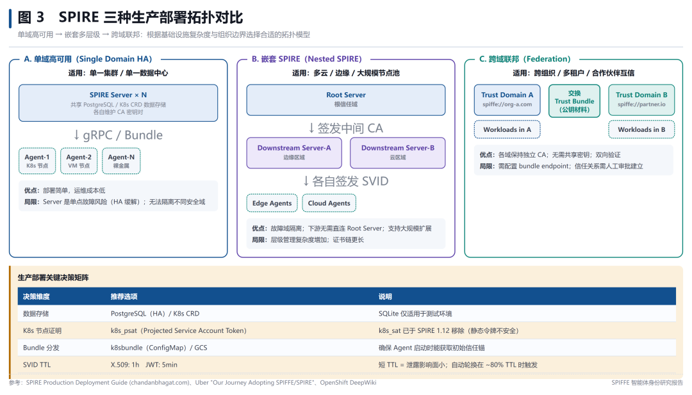图 3 SPIRE 三种生产部署拓扑对比如图 3 所示，三种拓扑各有适用场景：拓扑| 适用场景| 优点| 局限  
---|---|---|---  
A. 单域高可用| 单一集群/数据中心| 部署简单，运维成本低| Server 是单点故障风险（HA 缓解）；无法隔离不同安全域  
B. 嵌套 SPIRE \(Nested\)| 多云/边缘/大规模节点池| 故障域隔离；下游无需直连 Root Server；支持大规模扩展| 层级管理复杂度增加；证书链更长  
C. 跨域联邦 \(Federation\)| 跨组织/多租户/合作伙伴互信| 各域保持独立 CA；无需共享密钥；双向验证| 需配置 bundle endpoint；信任关系需人工审批建立  
  
  

\*\*生产部署的关键决策建议：\*\* 数据存储首选 PostgreSQL（HA 场景）或 K8s CRD（Kubernetes 原生场景），避免 SQLite 用于生产；K8s 环境下节点证明务必使用 k8s\_psat（Projected Service Account Token），k8s\_sat 已于 SPIRE 1.12 因静态令牌安全问题被移除；X.509-SVID TTL 推荐 1 小时，JWT-SVID 推荐 5 分钟，均在 ~80% TTL 时自动轮换。

# 四、AIMS 八层智能体身份模型

2026 年 3 月，来自 Defakto Security、AWS、Zscaler 和 Ping Identity 的四位工程师在 IETF 发布了 draft-klrc-aiagent-auth-00，题为《AI Agent Authentication and Authorization》。这份 26 页的草案没有发明任何新协议，而是将 SPIFFE、WIMSE 和 OAuth 2.0 组合为一个名为 \*\*AIMS（Agent Identity Management System，智能体身份管理系统）\*\* 的八层分层框架。这是目前业界首个系统性解决智能体身份问题的标准级参考架构。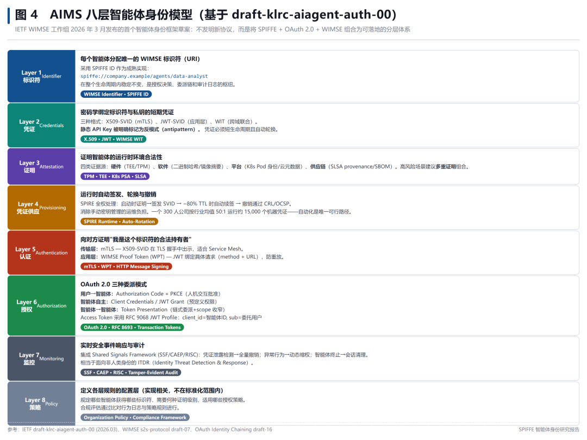图 4 AIMS 八层智能体身份模型（基于 draft-klrc-aiagent-auth-00）各层的核心内容如下（自底向上）：层级| 名称| 核心功能| 涉及标准/技术| 关键要求  
---|---|---|---|---  
Layer 1| 标识符 \(Identifier\)| 每个智能体分配唯一的 WIMSE URI 标识| WIMSE Identifier · SPIFFE ID| 生命周期内稳定不变；全局唯一  
Layer 2| 凭证 \(Credentials\)| 密码学绑定标识符与私钥的短期凭证| X.509-SVID · JWT-SVID · WIT| 短生命周期；自动轮换；禁用静态 API Key  
Layer 3| 证明 \(Attestation\)| 证明智能体运行时环境的合法性| TPM · TEE · K8s PSA · SLSA| 高风险场景建议多重证明组合  
Layer 4<o:page>| 凭证供应 \(Provisioning\)| 运行时自动签发、轮换与撤销| SPIRE Runtime · Auto-Rotation| 消除手动密钥管理；CRL/OCSP 撤销  
Layer 5| 认证 \(Authentication\)| 向对方证明身份合法持有| mTLS · WPT · HTTP Signing| 传输层或应用层；防重放  
Layer 6| 授权 \(Authorization\)| OAuth 2.0 三种委派模式| RFC 8693 · RFC 9068 · Transaction Tokens| sub/act 双身份；scope 收窄；HITL  
Layer 7| 监控 \(Monitoring\)| 实时安全事件响应与审计| SSF · CAEP · RISC · ITDR| 凭证泄露自动撤销；异常动态缩权  
Layer 8| 策略 \(Policy\)| 定义各层规则的配置层| Organization Policy · Compliance| 实现相关，不在标准化范围内  
  
  

\*\*AIMS 与当前实践的对比：\*\* 下表展示了 AIMS 框架与最常见的三种智能体认证方式（静态 API Key、MCP OAuth 2.1、完整 AIMS 实现）在各维度的差异：维度| 静态 API Key| MCP OAuth 2.1| AIMS 完整实现  
---|---|---|---  
身份绑定| 无（仅账户级别）| Client ID 仅| SPIFFE URI + 多重证明  
凭证轮换| 手动/从不| Token 刷新| SPIRE 自动（~80% TTL）  
运行时证明| 无| 无| 硬件+软件+平台+供应链  
Agent-to-Agent 认证| N/A| 未明确定义| WPT + OAuth 委派链  
监控与响应| 仅日志| Token 事件| SSF/CAEP 实时信号  
跨域支持| N/A| 单 AS| Identity Chaining  
  
  

# 五、工程构建方法论

## 5.1 多智能体委派链中的身份流转

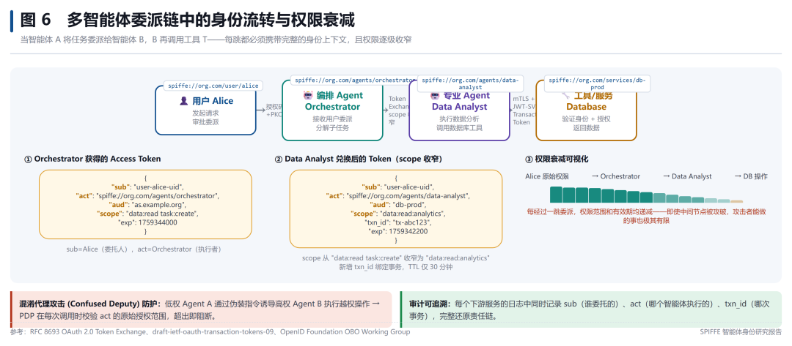图 6 多智能体委派链中的身份流转与权限衰减当编排 Agent 将任务分解并委派给专业 Agent，后者再调用数据库工具时——每一跳都必须携带完整的身份上下文，且权限逐级收窄。图 6 展示了这个过程：

  * 用户 Alice → 编排 Agent： Alice 通过 OIDC/SSO 登录后，AS 签发 Access Token，其中 sub=alice（委托人），act=orchestrator（执行者），scope=data:read task:create。
  * 编排 Agent → 分析 Agent： 通过 OAuth Token Exchange（RFC 8693）兑换窄 scope Token：sub 不变（仍是 alice），act 变为 data-analyst，scope 收窄为 data:read:analytics，新增 txn\_id 绑定事务，TTL 缩短至 30 分钟。
  * 分析 Agent → DB 服务： mTLS 出示 X.509-SVID（证明自己是 spiffe://.../data-analyst）+ Transaction Token（证明有权执行此事务）。DB 服务独立验证两者后返回数据。

\*\*Transaction Token（事务令牌）\*\* 是 AIMS 框架中最具创新性的安全模式之一（基于 draft-ietf-oauth-transaction-tokens-09）。它解决了多微服务调用链中的横向移动风险：即使某个下游微服务被攻破，攻击者获得的也只是一个绑定特定 transaction\_id、包含调用方 IP 和操作参数的极短有效期令牌，无法用于访问其他资源。

## 5.2 MCP / A2A 协议的身份缺口与 SPIFFE 补位

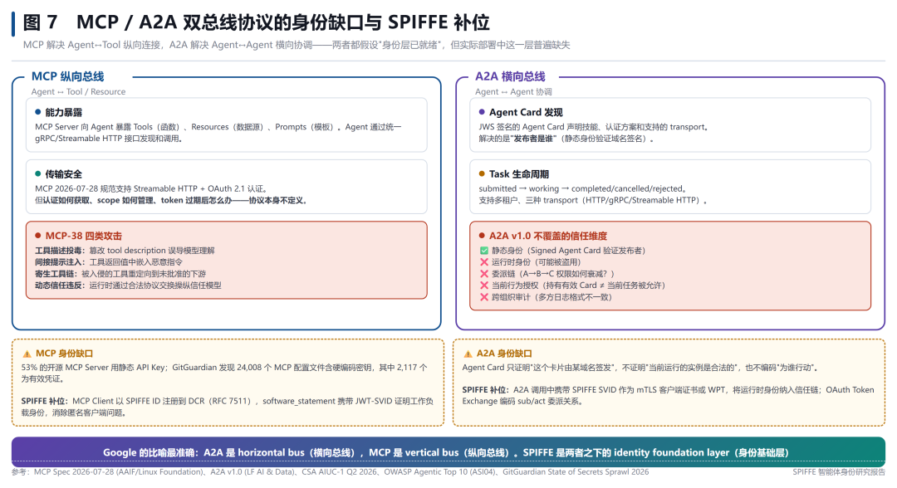图 7 MCP / A2A 双总线协议的身份缺口与 SPIFFE 补位2026 年的智能体协议生态呈现清晰的分工：MCP（Model Context Protocol，AAIF/Linux Foundation 管理）负责 Agent↔Tool 的纵向连接，A2A（Agent-to-Agent Protocol，LF AI & Data 管理）负责 Agent↔Agent 的横向协调。Google 的比喻最为准确：\*\*A2A 是 horizontal bus（横向总线），MCP 是 vertical bus（纵向总线）。\*\* 但两者都假设「身份层已就绪」——而这个假设在生产环境中普遍不成立。\*\*MCP 的身份缺口：\*\* 协议本身支持 Streamable HTTP + OAuth 2.1 认证，但不定义 token 如何获取、scope 如何管理、过期后怎么办。53% 的开源实现直接绕过认证。GitGuardian 发现 24,008 个 MCP 配置文件含硬编码密钥，其中 2,117 个为有效凭证。SPIFFE 的补位方案：MCP Client 以 SPIFFE ID 注册到 DCR（RFC 7511 Dynamic Client Registration），software\_statement 字段携带 JWT-SVID 证明工作负载身份，消除匿名客户端问题。\*\*A2A 的身份缺口：\*\* JWS 签名的 Agent Card 只证明「这个卡片由某域名签发」（发布者身份），不证明「当前运行的实例是合法的」（运行时身份），也不编码「为谁行动」（委派关系）。学术界的批评很直接：A2A 的 centralized identity model 在跨域场景下存在单点故障，且缺乏长期防篡改验证机制。SPIFFE 的补位方案：A2A 调用中携带 SPIFFE SVID 作为 mTLS 客户端证书或 WPT，将运行时身份纳入信任链；OAuth Token Exchange 编码 sub/act 委派关系。

## 5.3 端到端参考架构

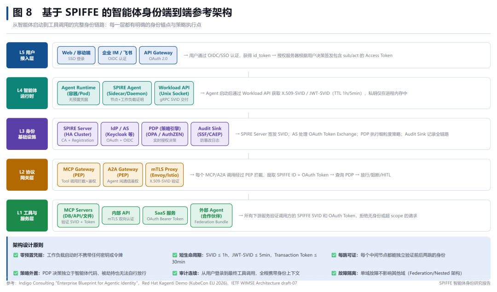图 8 基于 SPIFFE 的智能体身份端到端参考架构图 8 展示了一个五层端到端架构，从用户接入到工具与服务，每一层都有明确的身份锚点与策略执行点：层级| 组件| 身份机制  
---|---|---  
L5 用户接入层| Web/移动端/IM/API Gateway| OIDC/SSO → OAuth 2.0 Authorization Code + PKCE  
L4 智能体运行时| Agent Runtime + SPIRE Agent + Workload API| 零预置凭据 → 节点证明 + 工作负载证明 → SVID 自动签发  
L3 身份基础设施| SPIRE Server\(HA\) + IdP/AS + PDP\(OPA/AuthZEN\) + Audit Sink| CA 签发 + OAuth Token Exchange + 实时授权决策 + SSF/CAEP 日志  
L2 协议网关层| MCP Gateway\(PEP\) + A2A Gateway\(PEP\) + mTLS Proxy| 每次调用拦截 → 提取 SPIFFE ID + OAuth Token → 查询 PDP → 放行/阻断/HITL  
L1 工具与服务层| MCP Servers / 内部 API / SaaS / 外部 Agent\(Federation\)| 验证 SVID + Token；拒绝无身份或超 scope 请求  
  
  

## 5.4 一次完整工具调用的身份流转时序

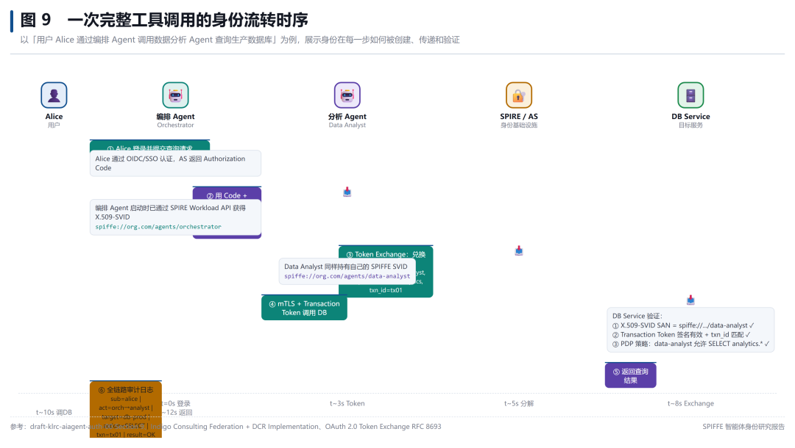图 9 一次完整工具调用的身份流转时序图 9 以「用户 Alice 通过编排 Agent 调用数据分析 Agent 查询生产数据库」为例，展示了身份在每一步如何被创建、传递和验证。整个流程约 12 秒完成，全程携带可追溯的身份上下文。关键设计要点：

  * 零预置凭据： Agent 启动时不携带任何密钥或令牌，通过 Workload API 动态获取 SVID。
  * 短生命周期： X.509-SVID ≤ 1h，JWT-SVID ≤ 5min，Transaction Token ≤ 30min。
  * 每跳可证： 每个中间节点都能独立验证前后两跳的身份。
  * 策略外置： PDP 决策独立于智能体代码，被劫持也无法自行放行。
  * 审计连续： 从用户登录到最终工具调用，日志中全程记录 sub/act/txn\_id/target/action/result。

# 六、行业适配与落地路径

## 6.1 成熟度模型：L0 → L4

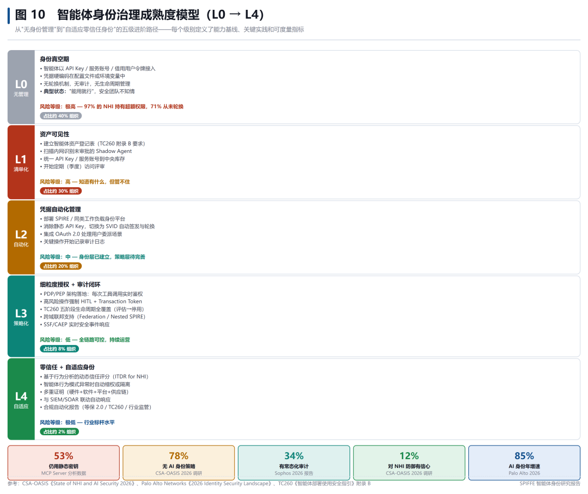图 10 智能体身份治理成熟度模型（L0 → L4）级别| 名称| 特征| 占比| 风险等级  
---|---|---|---|---  
L0| 无管理| API Key/服务账号/借用用户令牌；无轮换/无审计/无生命周期| 40%| 极高  
L1| 清单化| 资产登记表；Shadow Agent 扫描；统一库存；季度访问评审|   
30%| 高  
L2| 自动化| SPIRE 部署；消除静态 Key；OAuth 对接；关键操作审计| 20%| 中  
L3| 策略化| PDP/PEP 落地；HITL + Transaction Token；TC260 全覆盖；SSF 联动|   
8%| 低  
L4| 自适应| 动态信任评分\(ITDR\)；多重证明；SOAR 联动；合规自动化| ~2%| 极低  
  
  

## 6.2 18 个月四阶段落地路线图

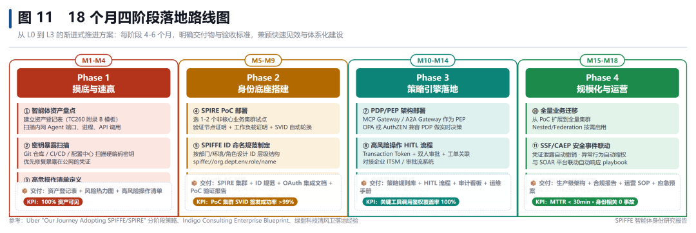图 11 18 个月四阶段落地路线图阶段| 时间| 核心任务| 交付物| KPI  
---|---|---|---|---  
Phase 1: 摸底与速赢| M1-M4| 资产盘点 · 密钥扫描 · 高危操作清单| 资产登记表 + 风险热力图 + 高风险操作清单| 100% 资产可见  
Phase 2: 身份底座搭建| M5-M9| SPIRE PoC · ID 命名规范 · OAuth AS 对接| SPIRE 集群 + 规范 + 集成文档 + 验证报告| PoC SVID 签发成功率 >99%  
Phase 3: 策略引擎落地| M10-M14| PDP/PEP 部署 · HITL 流程 · 全链路审计集成| 策略规则库 + HITL 流程 + 审计看板 + 运维手册| 关键工具调用鉴权覆盖率 100%  
Phase 4: 规模化与运营| M15-M18| 全量迁移 · SSF/CAEP 联动 · 合规认证| 生产架构 + 合规报告 + SOP + 应急预案| MTTR < 30min · 身份相关 0 事故  
  
## 6.3 重点行业适配矩阵

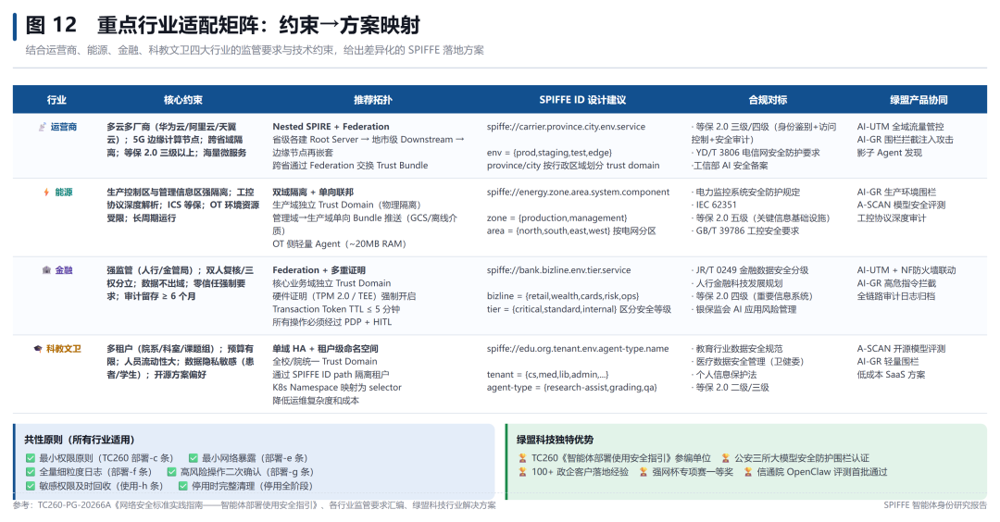图 12 重点行业适配矩阵：约束→方案映射图 12 的表格针对运营商、能源、科教文卫、企业等典型行业场景，给出了差异化的落地方案。以下是各行业的核心考量：

  * 运营商： 多云多厂商（华为云/阿里云/天翼云）+ 5G 边缘计算 + 跨省域隔离 + 等保 2.0 三级以上。推荐 Nested SPIRE + Federation 组合拓扑，按行政区域划分 trust domain。流量网关/WAF 可实现全域流量管控和影子 Agent 发现。
  * 能源： 生产控制区与管理信息区强隔离（物理隔离）+ 工控协议深度解析 + OT 资源受限。推荐双域隔离 + 单向联邦（Bundle 通过 GCS 或离线介质推送），OT 侧部署轻量 Agent（~20MB RAM）。内容安全围栏适合生产环境指令管控，AI 安全评测覆盖模型安全检测。
  * 科教文卫 / 企业： 多租户（院系/科室/课题组/部门）+ 预算有限 + 人员流动性大 + 数据隐私敏感。推荐单域 HA + 租户级命名空间（K8s Namespace 映射为 selector），降低运维复杂度。开源评测工具 + 轻量围栏可提供低成本方案。

# 七、SPIFFE 与现有安全防护体系的协同

在深入分析 SPIFFE 的能力边界后，一个关键结论浮出水面：\*\*SPIFFE 不是防护的全集，而是身份的基石。\*\* 它出色地解决了「谁在工作」的问题，但不回答「工作是否安全可信」。这正是现有 AI 安全产品（内容围栏 / 流量网关 / 态势感知等）和合规框架（TC260 / 等保 2.0）的价值所在。两者叠加，才能构成完整的智能体安全体系。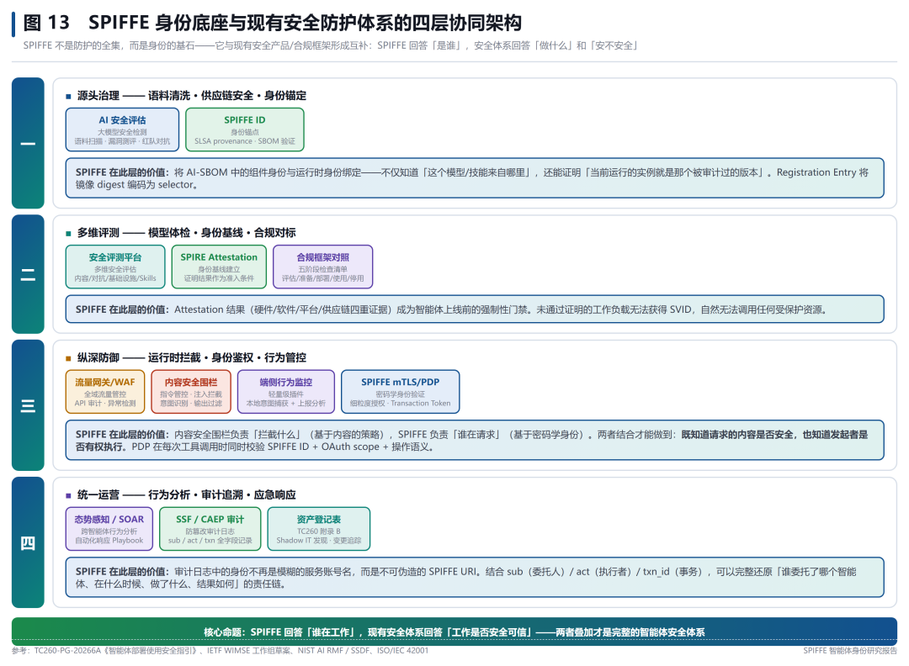图 13 SPIFFE 身份底座与现有安全防护体系四层协同架构以下「四道防线」纵深防御架构展示了 SPIFFE 与各类安全能力的互补关系：防线| 名称| 安全能力（示例）| SPIFFE 补位  
---|---|---|---  
第一道| 源头治理| AI 安全评估（语料检测·漏洞扫描·红队测评）| SPIFFE ID 作为身份锚点，将 AI-SBOM 组件身份与运行时身份绑定；Registration Entry 将镜像 digest 编码为 selector  
第二道| 多维评测| 安全评测平台 + 合规框架对照（TC260 五阶段检查清单）| SPIRE Attestation 结果（四重证据）成为上线前强制性门禁；未通过证明的工作负载无法获得 SVID  
第三道| 纵深防御| 流量网关/WAF + 内容安全围栏 + 端侧行为监控插件| 围栏基于「内容是否安全」做策略，SPIFFE 基于「谁在请求」做鉴权；PDP 同时校验 SPIFFE ID + OAuth scope + 操作语义<o:page>  
第四道| 统一运营| 态势感知/SOAR（跨智能体行为分析+自动化响应）+ 防篡改审计日志| 审计日志中的身份是不可伪造的 SPIFFE URI；sub/act/txn 全字段记录，完整还原责任链  
  
  

\*\*落地建议：\*\* 组织在引入 SPIFFE 时，无需替换现有安全投资。SPIFFE 作为身份层横向贯穿所有防线——从源头的组件身份绑定，到运行时的密码学鉴权，再到审计的不可伪造追溯。每道防线中，「内容策略」与「身份策略」独立决策但联合执行：PDP 在每次工具调用时同时校验「谁在请求」（SPIFFE ID + OAuth scope）和「请求是否合规」（操作语义 + 内容特征），任一维度不通过即阻断。

# 八、风险、局限与未来展望

## 8.1 SPIRE 自身的工程债与已知局限

尽管 SPIFFE/SPIRE 是目前最成熟的解决方案，但它并非银弹。riptides.io 的分析（《How to Deliver SPIFFE Identity to AI Agents》）指出了 SPIRE 作为「参考实现」而非「安全平台」的几个关键局限：局限类别| 具体描述| 缓解措施  
---|---|---  
无内置策略引擎| SPIRE 只告诉你是谁，不告诉你能做什么。授权需外接 OPA/Istio/AuthZEN| 部署 PDP/PEP 架构（见第五章）  
无持续再证明| SVID 签发后不再重新评估。若工作负载在运行中被篡改，不会自动撤销| 缩短 SVID TTL（≤1h）；配合 RATS 持续证明框架  
私钥进入用户态| SVID 私钥通过 gRPC 交付给工作负载进程内存，可被同进程内的漏洞利用读取| TEE/SGX 隔离；或使用 sidecar 模式将私钥限制在独立进程中  
证书生命周期运营负担| 轮换逻辑需工作负载或 sidecar 处理；若续签失败会导致身份丢失| 使用支持 streaming WatchX509SVIDs 的 SDK（spiffe-go/java-spiffe）  
端侧/浏览器 Agent 支持弱| SPIRE Agent 主要面向服务器端工作负载；浏览器内或移动端的 Agent 身份尚无成熟方案| 考虑 WebAuthn/FIDO2 结合 DCP（Device Credential Protocol）  
  
  

## 8.2 标准演进路线图

智能体身份相关的标准正在加速演进。以下是关键标准的当前状态与预期时间线：标准/草案| 状态| 管理机构| 核心内容| 预期进展  
---|---|---|---|---  
SPIFFE v2025.01| 已发布（稳定版）| CNCF / SPIFFE Community| SPIFFE ID / X.509-SVID / JWT-SVID / Workload API 规范| 持续维护  
WIMSE Architecture| draft-ietf-wimse-arch-07| IETF WIMSE WG| 工作负载身份多系统环境架构总纲| 2026-2027 望推进至 RFC  
WIMSE Identifier| draft-ietf-wimse-identifier-02| IETF WIMSE WG| 工作负荷标识符 URI 格式规范| 与架构 draft 并行  
WIMSE s2s Protocol| draft-ietf-wimse-s2s-protocol-07| IETF WIMSE WG| 工作负载间认证协议（mTLS + 应用层双模式）| 2026 H2 望更新  
AIMS \(aiagent-auth\)| draft-klrc-aiagent-auth-00| IETF \(个人提交\)| 八层智能体身份框架（SPIFFE+OAuth+WIMSE 组合）<o:page>| 有望被 WIMSE WG 吸纳  
OAuth Transaction Tokens| draft-ietf-oauth-transaction-tokens-09| IETF OAuth WG| 多跳调用中的事务级窄 scope 令牌| 2026 望有重要更新  
MCP Spec| v2026-07-28 \(RC\)| AAIF / Linux Foundation| 去会话化核心 + hardened auth + tasks + apps| 2026-07-28 正式发布  
A2A v1.0| 正式发布| LF AI & Data| Signed Agent Cards + task lifecycle + multi-tenancy| 持续迭代中  
TC260 Agent Guide| v1.0-202607 \(实践指南\)| 全国信安标委 \(TC260\)| 智能体五阶段生命周期安全基线（评估/准备/部署/使用/停用）| 2026-07 发布，将持续迭代  
  
  

## 8.3 三个立即可行的建议

  * 如果你正在构建/部署智能体（今天就能做）： 停止使用静态 API Key。在 1-2 个非核心集群上部署 SPIRE PoC，让 Agent 通过 Workload API 获取 SVID。对用户委派场景，使用 OAuth 2.0 Client Credentials Grant（自主 Agent）或 Authorization Code + PKCE（用户委派）。
  * 如果你在评估 IAM 平台（采购决策）： 检查候选平台是否支持 SPIFFE/WIMSE 标识符、能否向工作负载签发短期凭证、是否有 PDP/PEP 架构支持细粒度授权。Ping Identity（AIMS 联合作者）和部分云厂商 IAM 产品已在跟进。
  * 如果你在准备合规审计（等保/TC260/行业监管）： 将 TC260《智能体部署使用安全指引》的五阶段检查清单作为 baseline，叠加 SPIFFE 身份要求作为增强项。特别是部署阶段的“最小权限”、“最小目录”、“最小暴露”、“细粒度日志”、“高风险操作清单”五项要求，均可通过 SPIFFE + PDP 架构实现可度量、可审计的落地。

# 附录 A：术语表

术语| 英文全称| 简释  
---|---|---  
SPIFFE| Secure Production Identity Framework For Everyone| CNCF 毕业项目，定义工作负载身份的通用标准  
SPIRE| SPIFFE Runtime Environment| SPIFFE 的参考实现，包含 Server 和 Agent 两组件  
SVID| SPIFFE Verifiable Identity Document| SPIFFE 身份文档，分 X.509-SVID 和 JWT-SVID 两种格式  
Trust Domain| 信任域| 信任根边界，通常对应 FQDN，如 nsfocus.com  
Workload API| 工作负载 API| SPIRE Agent 向工作负载交付 SVID 的标准化接口  
Attestation| 证明| 通过运行时属性验证工作负载合法性的过程  
WIMSE| Workload Identity in Multi-System Environments| IETF 工作组，制定跨系统工作负载身份标准  
AIMS| Agent Identity Management System| 智能体身份管理系统，八层分层框架（draft-klrc-aiagent-auth）  
NHI| Non-Human Identity| 非人类身份：API Key、Service Account、Certificate、Agent Identity 等  
MCP| Model Context Protocol| Agent ↔ Tool 纵向连接协议（AAIF/Linux Foundation）  
A2A| Agent-to-Agent Protocol| Agent ↔ Agent 横向协调协议（LF AI & Data）  
DCR| Dynamic Client Registration \(RFC 7511\)| OAuth 客户端运行时动态注册机制  
Transaction Token| 事务令牌| 绑定特定事务的窄 scope 短期令牌（draft-ietf-oauth-transaction-tokens）  
HITL| Human-in-the-Loop| 人工审批环节，用于高风险操作的二次确认  
PDP/PEP| Policy Decision Point / Policy Enforcement Point| 策略决策点 / 策略执行点，AuthZEN 架构核心组件  
SSF/CAEP/RISC| Shared Signals Framework / Continuous Access Evaluation / Revocation| OpenID 基金会的实时安全事件共享框架  
TC260| 全国网络安全标准化技术委员会| 中国网络安全国家标准技术委员会  
  
  

# 附录 B：主要参考文献

\[1\] SPIFFE Community. "The SPIFFE Identity and Verifiable Identity Document." GitHub, Jan 2025.https://github.com/spiffe/spiffe/blob/main/standards/SPIFFE-ID.md\[2\] SPIFFE Community. "The X.509 SPIFFE Verifiable Identity Document." GitHub, Jan 2025.\[3\] J. Salowey, Y. Rosomakho, H. Tschofenig et al. "Workload Identity in a Multi System Environment \(WIMSE\) Architecture." IETF Internet-Draft draft-ietf-wimse-arch-07, Mar 2026.\[4\] Y. Rosomakho, J. A. Salowey. "Workload Identifier." IETF Internet-Draft draft-ietf-wimse-identifier-02, Jul 2026.\[5\] B. Campbell, J. Salowey, A. Schwenkschuster, Y. Sheffer. "WIMSE Workload-to-Workload Authentication." IETF Internet-Draft draft-ietf-wimse-s2s-protocol-07, Mar 2026.\[6\] P. Kasselman, J.-F. Lombardo, Y. Rosomakho, B. Campbell. "AI Agent Authentication and Authorization." IETF Internet-Draft draft-klrc-aiagent-auth-00, Mar 2026.\[7\] The OAuth Working Group. "RFC 8693: OAuth 2.0 Token Exchange." IETF, Jan 2020.\[8\] The OAuth Working Group. "draft-ietf-oauth-transaction-tokens-09: Transaction Tokens." IETF Internet-Draft, Jul 2026.\[9\] 全国网络安全标准化技术委员会秘书处. 「网络安全标准实践指南——智能体部署使用安全指引\(v1.0-202607\)." TC260-PG-20266A, Jul 2026.\[10\] 国家互联网信息办公室. 「人工智能安全治理框架 2.0." Sep 2025.\[11\] Uber Technologies. "Our Journey Adopting SPIFFE/SPIRE at Scale." Uber Engineering Blog, 2024-2025.\[12\] Chandan Bhagat. "SPIRE in Production: Attestation, Federation and Multi-Cluster Trust." 2025-2026.\[13\] Indigo Consulting. "The Enterprise Blueprint for Agentic Identity: Workload Attestation and Lifecycle Governance." 2026.\[14\] midships.io. "Why Workload Identity Alone Is Not Enough for AI Agents." 2026.\[15\] riptides.io. "SPIFFE Is What AI Agents Need for Identity, The Question Is How to Deliver It." 2026.\[16\] travis.media. "What is SPIFFE? A Simple Guide to the Identity Standard Behind AI Agents." 2026.\[17\] agentmelt.com. "AI Agent Identity & Access Management in 2026." Q2 2026 Research Note.\[18\] Cloud Security Alliance. "AIUC-1 Q2 Refresh: MCP Security and Agent Identity Controls." Apr 2026.\[19\] Axis Intelligence Research. "Machine Identity Statistics 2026." 2026.\[20\] GitGuardian. "State of Secrets Sprawl 2026." 2026.\[21\] Palo Alto Networks. "2026 Identity Security Landscape Report." 2026.\[22\] Sophos. "State of Identity Security 2026." May 2026.\[23\] Entro Security. "H1 2025 NHI & Secrets Risk Report." 2025.\[24\] TC260 网络安全标准化技术委员会. 「网络安全标准实践指南——智能体部署使用安全指引（TC260-PG-20266A）." 2026.\[25\] NIST. "AI Risk Management Framework \(AI RMF\) / Secure Software Development Framework \(SSDF\)." 2024-2026.