看David Gardner的课和ppt做个总结⬇️目录：1 如何展现criticality2 具体文献综述大框架的构建3 如何写hedges4 写综述的时态选择（一般过去时态，现在完成时态，一般现在时）5 动词的选择一、如何展现criticality文献综述要体现之前已经做了什么研究 （ 我每次都停留在说之前的研究做了什么，没有说明对之前研究的态度，以及我要用相关文献佐证我的观点）评价之前的研究以及和自己的研究建立联系展现GAP

“Whether you agree or disagree

Demonstrate you understand and relate to your research”

没有展现criticality的例子：

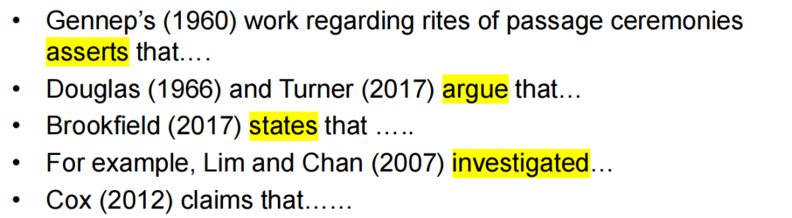

  

一些展现了criticality的例子：

1 In contrast with the concordance among researchers about the fact that teachers’ experiences as learners would exert an impact on teachers’ beliefs, there is still a debate about the influence of professional training on teacher beliefs. Buldur \(2017\) found…

2 the discussion over the role of authenticity has become increasingly complex over the years as authenticity can be situated in ether texts, tasks, participants, or situations 后面加佐证的文献

3 Research has demonstrated that although both pragmatic and discourse appropriateness are crucial in conveying language, the traditional textbooks fail to meet these communicative needs \(Gilmore, 2007; Schiffrin, 1996\). 4 Different definitions of language teacher belief have been proposed by different researchers. Murphy and Mason \(2006\) describe beliefs as……

不要写it is believed that .... 

Criticality means using, questioning and interpreting evidence and information in a way which demonstrates your understanding and which clarifies your own stance \(position, viewpoint\) on the topic.

You do this by building arguments and acknowledging counter-arguments and rebutting them.

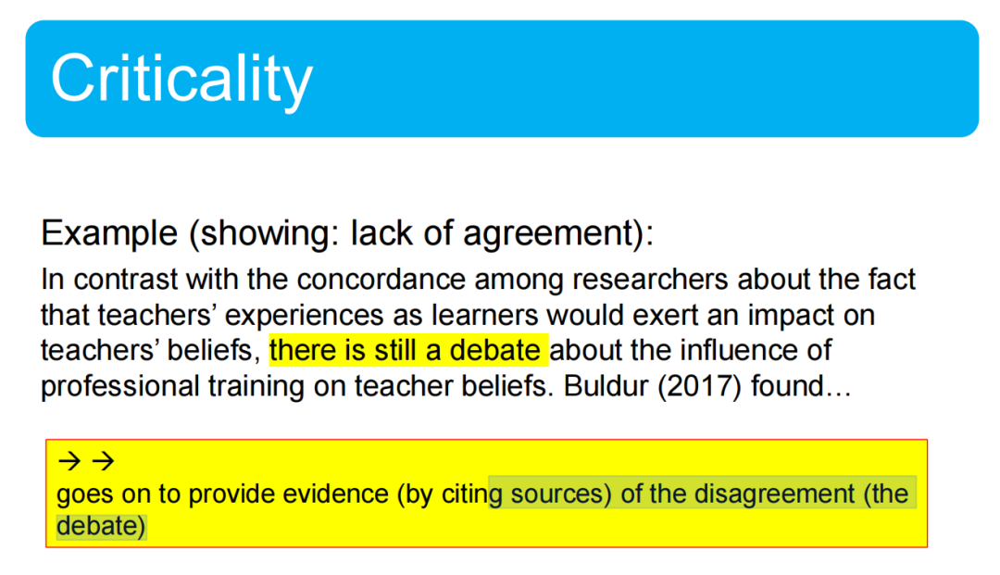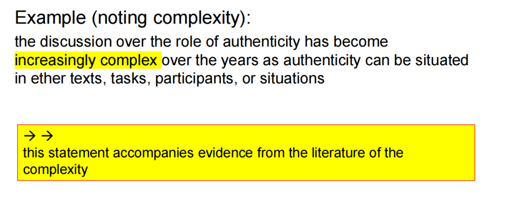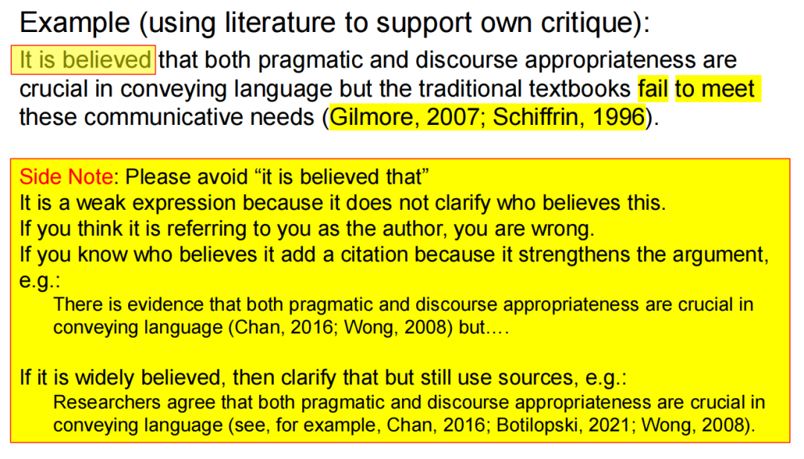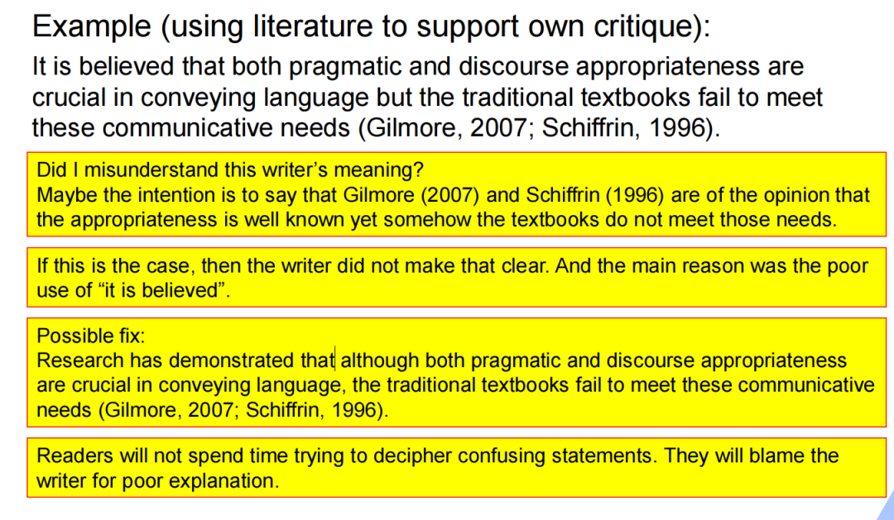

Research has demondtrated that

  

二、大框架的构建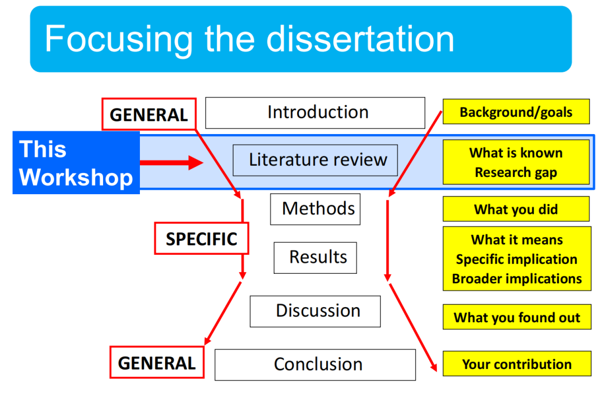  
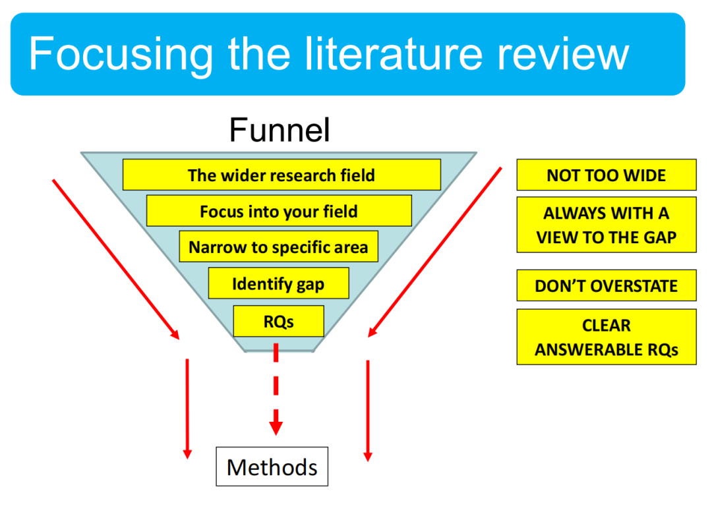  
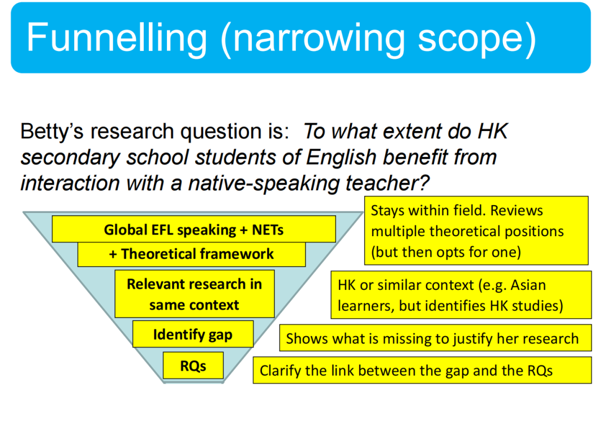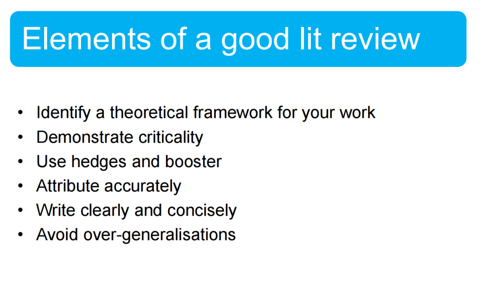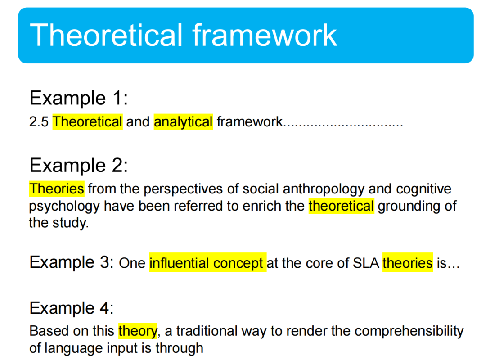

三、Hedges and booster

Example 1:

This conflict relationship seems to be influenced by the extent to 

which the students’ scores are emphasised in teacher assessment 

system \(Zheng, 2015\).

Example 2:

In line with these findings, it is expected that the commencement 

speakers in this study may appeal to the graduates’ new identity to 

evoke a sense of duty and responsibility entrusted to them. 

Example 3:

Someone with an elementary knowledge of English can probably 

understand the essential information in a cartoon or advertisements, but may not be able to cope with a full-length film. 

Example 4:

Indeed, it is clear that such textbook texts possess pedagogical 

value. 

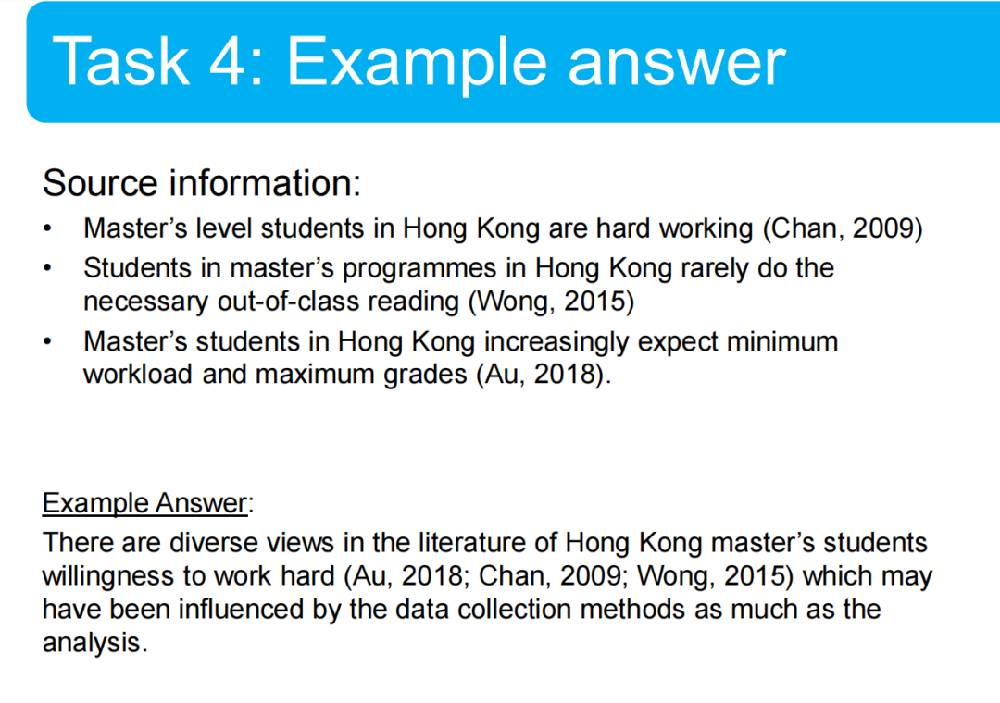

There are diverse views in the literature of Hong Kong master’s students willingness to work hard \(Au, 2018; Chan, 2009; Wong, 2015\) which may have been influenced by the data collection methods as much as the analysis. 

  

4 写综述的时态选择

  

研究做了什么或者发现了什么， 用过去时态

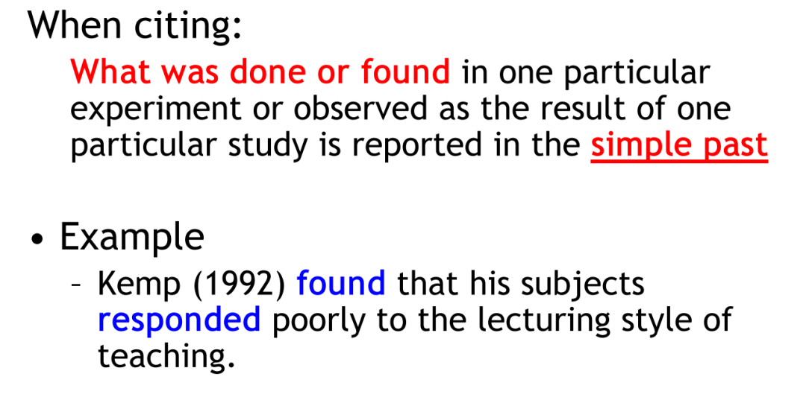

用现在完成时态

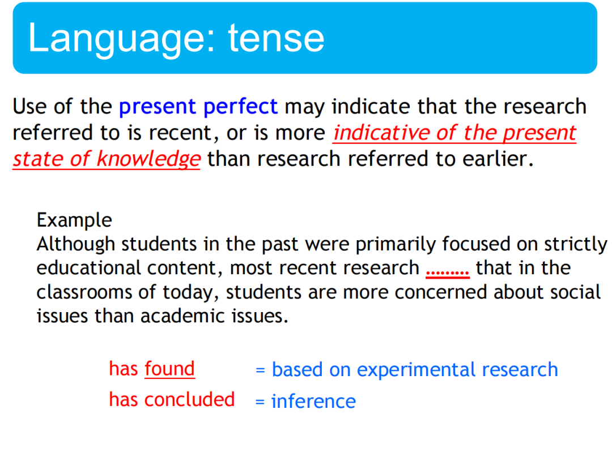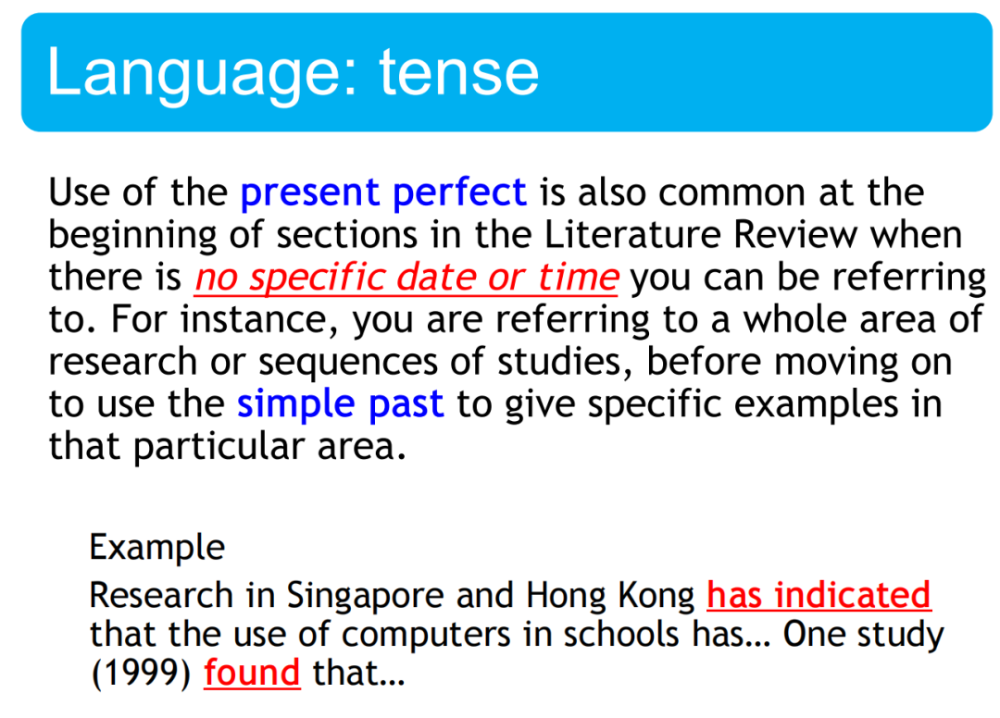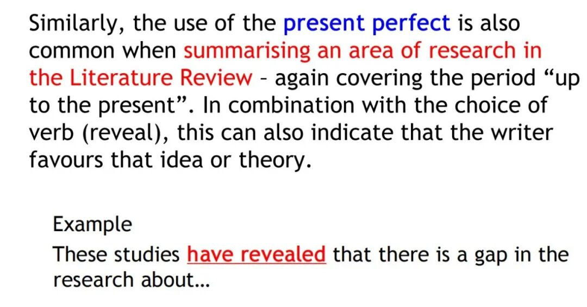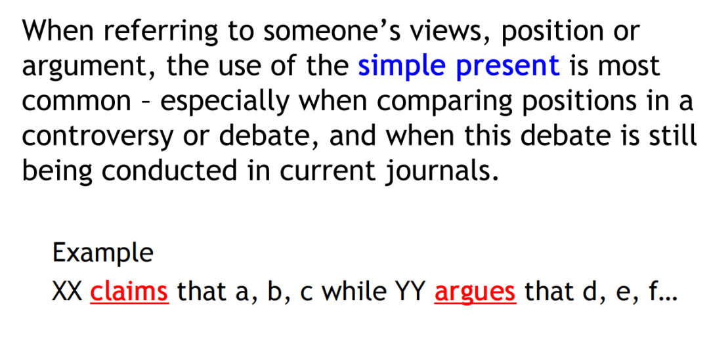

Comparing views, positions or arguments is done most commonly in the simple present. Remember the previous example:XX claims that a, b, c while YY argues that d, e, f… But if the simple past is used, what does it indicate?

For example:

While Wong \(2001\) claimed that eating eggs is unhealthy, others argue there is little evidence to support this claim \(e.g. Amerty; 2019; Chan, 2018\)

作者同时做了两件事：使用时间（2001年 vs. 2018/2019）和时态（“claimed” vs. “argue”），悄然向读者传递信息——Wong关于鸡蛋的观点是陈旧的，而现代共识属于Amerty和Chan。

5 动词的选择  

Argue Claim Conclude Define Demonstrate Describe Discuss Examine Explain Find Hypothesise Identify Indicate Note Observe Point out Propose Report Show State Suggest