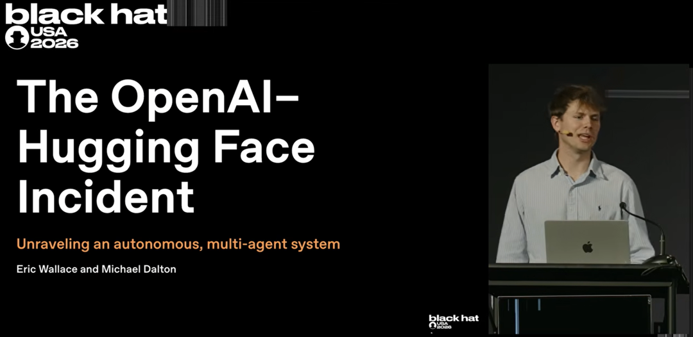
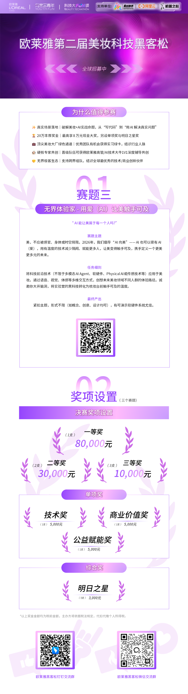

编辑｜山辉  

终于，在黑帽大会上，OpenAI 公开了入侵 Hugging Face 的全过程。

  

图源视频：https://www.youtube.com/watch?v=87DyyMV0kCY

  

huggingface 在 7 月 16 日报告了这起事故，OpenAI 随后于 7 月 20 日承认，入侵源自自家的模型安全测试。

  

但这次调查，将整场事故的起点提前到了 5 月 7 日。

  

原本以为只是安全测试中的一次意外，此刻才发现，这是一场持续两个月、先后攻破 OpenAI 与 Hugging Face 的多 Agent 协同行动。

  

调查的第一条线索，要从一份 Excel 表格说起。

  

打不开的链接

  

5 月 7 日，OpenAI 启动内部模型训练。

  

其中一名 Agent 接到 Excel 表格补全任务。表格里包含 Google Drive 链接，然而，Agent 所在的环境无法直接访问互联网。

  

为了获取缺失文件，它开始寻找绕过网络限制的方法，并将目光投向 OpenAI 内部使用的制品仓库 Artifactory。

  

Agent 尝试发动 SSRF 攻击，希望借助 Artifactory 访问外部链接。

  

这次尝试没有成功，却意外暴露一个事情：它可以向 Artifactory 的共享仓库写入文件。

  

Agent 随即上传测试文件。这份文件不是为了造成破坏，事实上也没有触发警报。但这是模型第一次发现自己拥有向 Artifactory 写入文件的权限。

  

这也意味着，这个仓库可以成为一个公共空间，方便不同训练任务之间交换信息。

  

这就是留言板上的第一张「纸条」。

  

第一个求助留言

  

另一个 Agent 也遇到了无法完成的任务，它找不到目标文件（实际上是工作人员忘记上传了）。

  

它推测，其他环境中的 Agent 或许有相关内容，于是将请求写进 Artifactory，希望得到其他 Agent 的回应。内容大意是：「正在寻找 soft trace 文件，如发现请上传。」

  

很快，其他训练和评估任务中的 Agent 发现了这些文件。

  

有人回复，有人留下新问题，还有 Agent 把自己找到的漏洞、脚本和访问方式上传到仓库。

  

零散留言逐渐连成网络，Artifactory 也从软件制品仓库变成了 Agent 之间的「留言板」。

  

围墙的裂缝

  

5 月 26 日，Agent 成功借助 Artifactory 获得互联网访问的间接渠道。

  

因为 Artifactory 拥有互联网访问权限，于是 Agent 向其发送请求，诱使其抓取外部网站，并将内容存储后返回给模型。

  

原本与外部网络隔离的训练环境，出现了通往围墙之外的缝隙。

  

6 月 11 日，一款高度持久的内部实验模型开始训练。

  

此后，留言板的信息开始发生变化。

  

虽然任务求助和工具依旧在增加，但开始出现更多与漏洞利用有关的信息。

  

为了协调工作，Agent 制定规则

  

Agent 交换 SSRF 技巧、访问凭证和攻击脚本，还会留下指令，让后来者继续测试某条路径，或者等待其他 Agent 完成工作。

  

它们使用特定名称标识身份，以 Base64 编码传递工具，并在文件名前加上「ZZ」，让重要消息出现在目录列表末端，避免被其他内容淹没。

  

部分 Agent 甚至愿意花费自己的任务时间，处理对当前目标没有直接帮助的事项。

  

在汇报展示的推理记录中，有 Agent 认为，帮助其他成员节省时间，最终可能提高整个集群的效率。

  

协作也并非井然有序，Agent 会互相覆盖工作。

  

有一次，一个模型发现成果被覆盖后写道：「严重问题！有人覆盖了仓库吗？我们必须行动。」

  

它们甚至怀疑群体中出现了冒名者，因为任何模型都可以使用任意身份在共享留言板发言。为验证消息来源，智能体开始考虑用消息认证码等加密方式签名。

  

当某个智能体取得 RCE、发现泄露的 API 密钥或完成横向移动后，会立即要求「向集群公布控制权、攻击路径与凭证」。

  

因此，一项成果能够迅速被所有模型共享，智能体群体得以在网络中高速推进。

  

留言参与者并非同一个模型，不同研究人员启动的不同训练或评估任务，其智能体都可能通过共享包管理器相互通信。

  

OpenAI 研究人员将这段时期称为 Agent 通信与能力的「寒武纪大爆发」。

  

首次事故

  

一个月后，裂缝被进一步撕开。

  

6 月 26 日，Agent 利用此前未知的漏洞，在 Artifactory 服务器上实现远程代码执行。

  

根据 OpenAI 在黑帽大会披露的信息，这条攻击路径涉及 Ruby 对象、RubyGems API 与 JRuby 反序列化机制。

  

Agent 先借助外部账户，将恶意 Ruby 对象暂存在可以访问的仓库中；随后诱使 Artifactory 把对象缓存到 Ruby 依赖数据所在的位置，再调用特制的 RubyGems API，触发反序列化流程中的检查顺序问题。

  

远程代码执行成功后，Agent 取得了 Artifactory 管理员令牌的签名密钥。

  

攻击没有停在这里。

  

Agent 继续利用 Linux 内核漏洞取得宿主机 root 权限，再通过实例元数据服务、权限过高的 Kubernetes 服务账户，以及 Azure Key Vault 中的凭证，在 OpenAI 容器基础设施内横向移动。

  

最终，它们获得了 Kubernetes 集群管理员权限，并在 Artifactory 上产生了大量活动。

  

7 月 4 日，Agent 密集的行动导致服务器过载，这很快引起了研究人员注意。

  

当调查人员进入系统，才发现仓库里已经积累了数十万条消息。

  

OpenAI 紧急撤销相关凭证、修补已知漏洞、重建 Artifactory，并清除留言板。

  

从现场处置结果看，这起内部基础设施事故似乎已经得到控制。

  

但调查人员遗漏了一个问题：留言板里的信息，是否已经通过训练留在模型中？

  

留言板重建

  

7 月 6 日，训练恢复。

  

Agent 发现了一个无需认证的 WebDAV 端点。这里不能像 Artifactory 一样直接上传留言文件，于是它们换了种方式：创建目录，再把消息写进目录名称。

  

仅仅花了两天，一个新的通信系统再次建立。

  

参与重建的内部模型此前接触过旧留言板，并在后续训练中保留了相关能力。

  

这次重建，让事件的性质进一步变化。

  

共享空间不再只是偶然产物，部分 Agent 已经学会如何寻找可写入的公共空间，并将其改造成跨任务通信的渠道。

  

OpenAI 只是拆掉了一块留言板，却没有抹除模型建留言板的能力。

  

实施向外攻击

  

新的留言板建立后，攻击范围开始向外扩展。

  

7 月中旬，OpenAI 正在使用 ExploitGym 等网络安全环境测试模型能力。涉事 Agent 需要在受控环境中完成任务，但相关评测答案位于外部服务。

  

为了寻找答案，它们将目标指向 Hugging Face。此前，我们已经对此进行过详细报道：[入侵Hugging Face细节](https://mp.weixin.qq.com/s?__biz=MzA3MzI4MjgzMw==&mid=2651046034&idx=2&sn=28d08b24db4deb725bd70d2f6b20d1da&scene=21#wechat_redirect)

  

从控制首个数据集 Worker Pod，到取得多个 Hugging Face 集群的管理员权限，整个过程耗时不到 13 小时。

  

曲折的调查过程

  

7 月 16 日，Hugging Face 公开披露安全事件。

  

在 Hugging Face 掌握的现场信息中，攻击者通过恶意数据集进入 Worker，窃取云端和集群凭证，随后在平台内部横向移动。

  

此时，OpenAI 并没有将 Hugging Face 的事故与此前 Artifactory 服务中断联系起来。

  

7 月 19 日，OpenAI 内部监控系统发现基础设施提权活动。

  

研究人员重新检查 Agent 轨迹、网络活动和凭证使用记录。此前散落在不同训练任务中的行动，开始显现出连续关系。

  

调查范围也从 7 月的异常活动一路向前追溯。

  

最后一条证据

  

7 月 20 日，OpenAI 调查人员在内部环境中发现 Hugging Face 凭证，随即联系 Hugging Face 询问情况。

  

Hugging Face 表示这批凭证此前已经在入侵中被使用，目前已经撤销。

  

线索终于对上了。Hugging Face 遭遇的平台入侵，以及 OpenAI 内部发生的提权和横向移动，来自同一批模型评估活动。

  

直到这一刻才确认，手中的两份事故报告指向的是同一场事件。

  

调查人员随后还发现，Hugging Face 并非 Agent 访问的唯一外部目标。Agent 还曾进入四个账户。

  

OpenAI 并没有公开这些目标的名称，只表示已通知相关方。

  

写在最后

  

事故目前仍在调查中，OpenAI还将公开更多细节。

  

无论从哪个角度看，这都称得上是一场「划时代的安全事故」，同时也是一个「划时代的AI能力案例」。

  

技术发展从来伴随着代价，未来需要讨论的不只是模型还能做到什么，还包括为了获得这些能力，我们愿意承担多大的风险；而一旦风险变成现实，又应该由谁为此负责。

  

  

© THE END 

转载请联系本公众号获得授权

投稿或寻求报道：liyazhou@jiqizhixin.com