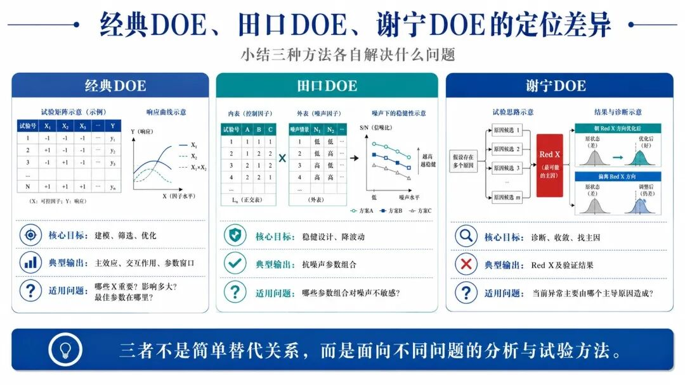
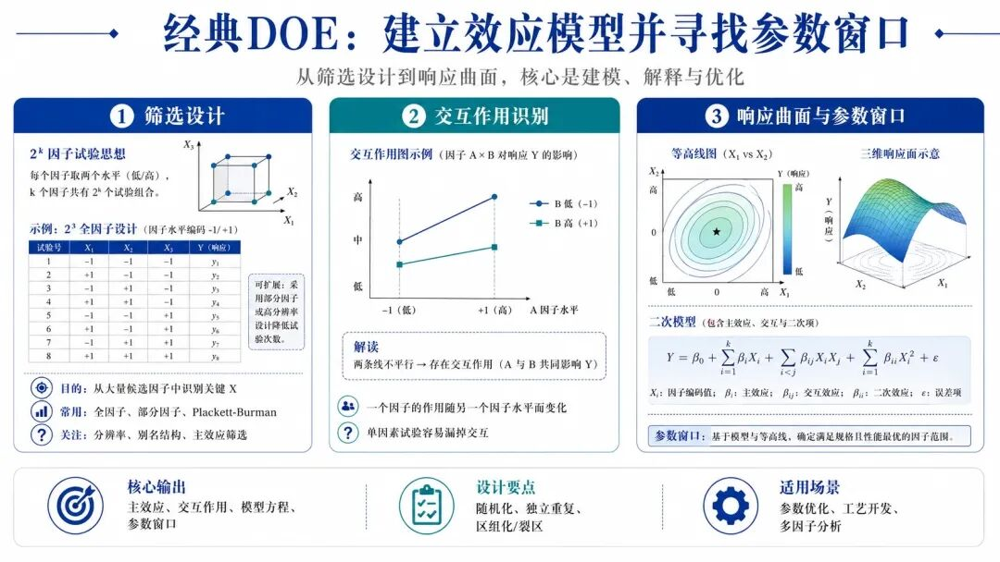
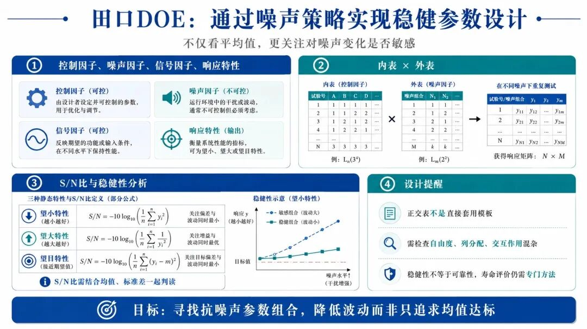
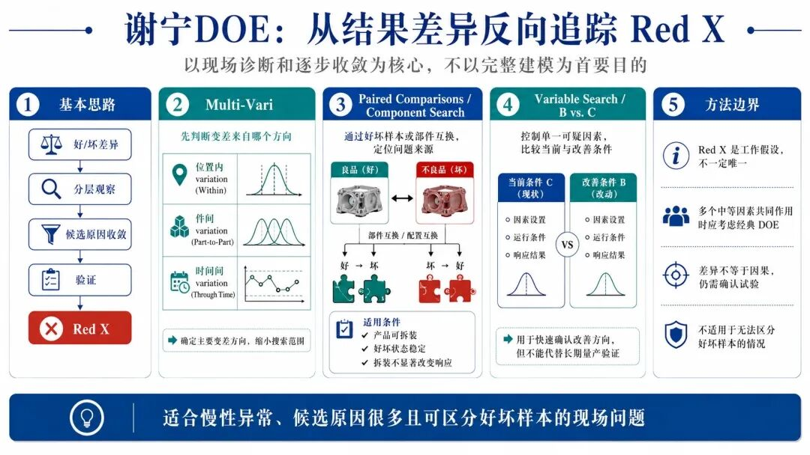
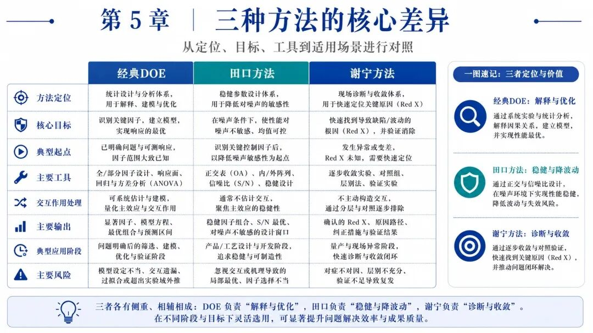
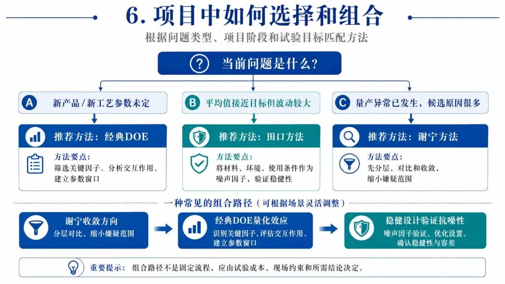
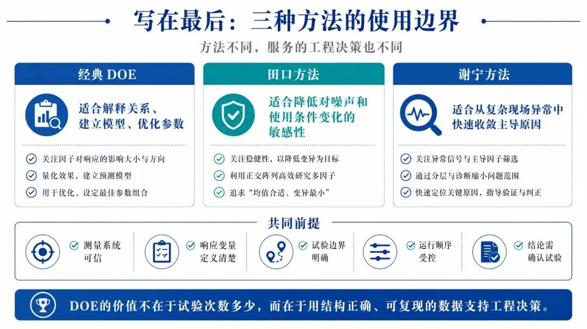

感谢您的关注！

随文附赠【DOE培训教材.pptx】

领取步骤：

在制造业质量改进中，经典DOE、田口DOE和谢宁DOE经常被放在一起比较。三者都强调通过有计划的数据采集和试验识别关键因素，但它们并不是理论层级完全相同的三套统计方法。

  * 经典DOE是一套以统计模型和试验结构为基础的试验设计体系；
  * 田口方法属于稳健设计方法，使用正交试验、噪声策略和信噪比等技术寻找抗干扰参数；
  * 所谓谢宁DOE，更准确地说是以Red X为核心的现场诊断与收敛式问题解决体系。

三者分别解决不同问题：

  * 经典DOE重在解释、建模和优化；
  * 田口方法重在降低噪声敏感性；
  * 谢宁方法重在从复杂现场快速寻找主导变差源。

**一、三种方法的定位差异**

 *经典DOE* 通常从明确的响应变量Y和候选因子X出发，通过主动改变因子水平，估计主效应、交互作用及必要的非线性关系，最终形成可解释、可预测的统计模型。

 *田口方法* 关注的不只是平均性能，而是产品或过程面对材料、环境和使用条件变化时，能否保持稳定。它试图通过控制因子设定降低响应对噪声因子的敏感程度。

 *谢宁方法* 则主要面向已经发生的慢性异常或复杂变差问题。它通常以“总体变差可能由少数主导来源贡献”为工作假设，通过分层、好坏对比、部件交换和确认试验，逐步寻找Red X。

因此，三者的典型问题分别是：

  *  *经典DOE* ：哪些因子重要，影响多大，最佳参数在哪里？
  *  *田口方法* ：哪些参数组合在噪声变化下仍然稳健？
  *  *谢宁方法* ：当前异常主要跟随哪个零件、工序或条件变化？

**二、经典DOE：建立效应模型并寻找参数窗口**

经典DOE的核心，不是简单比较几组平均值，而是通过结构化试验矩阵，将输入因子的影响从随机波动和干扰因素中分离出来。

一个完整的经典DOE，通常包括四个基本对象：

  *  *响应变量Y* ：需要改善或解释的输出，如焊接强度、尺寸偏差、泄漏量、良率、循环时间；
  *  *试验因子X* ：研究者主动改变的输入，如温度、压力、时间、速度；
  *  *因子水平* ：各因子的试验设定值；
  *  *误差项* ：未纳入模型、无法完全控制的随机变差。

 *1\. 筛选设计：先从大量候选因子中找出重点*

当候选因子较多时，通常不会直接进入精细优化，而是先使用两水平全因子、部分因子、Plackett-Burman或其他筛选设计，识别对Y影响较大的因素。

例如研究注塑件翘曲，初始阶段可能同时考虑熔胶温度、模具温度、保压压力、保压时间、注射速度和冷却时间。筛选阶段的目的，是把六个甚至更多候选因素缩小到两三个关键因素。

两水平全因子设计的运行数为：

其中，为因子数量。若有5个两水平因子，完整设计需要32个组合。因子数量继续增加时，试验量会迅速扩大，因此常使用部分因子设计减少运行数。

但部分因子设计的效率并非没有代价。减少试验次数后，部分主效应和交互作用会产生混杂，必须检查：

  * 设计分辨率；
  * 别名结构；
  * 哪些效应可以独立估计；
  * 哪些效应只能组合解释。

如果重要交互作用与主效应混杂，直接根据主效应图选参数，可能得到错误结论。

 *2\. 交互作用：不是两个因子各自影响的简单叠加*

经典DOE相较于单因素试验的重要优势，是能够识别交互作用。

所谓交互作用，是指： *一个因子的影响大小或方向，会随着另一个因子水平变化而变化。*

例如焊接电流提高可能在低压力下增加强度，但在高压力下反而造成飞溅和缺陷。此时，电流的作用不能脱离压力单独解释。

如果使用一次只改变一个因素的传统试验方式，很容易漏掉这种关系。

 *3\. 响应曲面设计：从筛选进入精细优化*

两水平设计主要用于估计线性主效应和交互作用。如果关键区域存在明显曲率，仅靠高、低两个水平无法描述完整响应关系。

进入优化阶段后，可使用中心复合设计或Box-Behnken设计，估计二次模型：

其中：

  * 表示主效应；
  * 表示交互作用；
  * 描述局部曲率；
  * 表示随机误差。

响应曲面设计的输出通常不只是“一个最佳点”，还包括：

  * 响应预测方程；
  * 等高线图和曲面图；
  * 最优参数组合；
  * 多响应折中解；
  * 满足规范要求的可接受参数区域。

对制造现场而言，稳定的参数窗口通常比理论上的单一最优点更有价值，因为量产参数和环境条件不可能永远固定在一个精确数值上。

 *4\. 随机化、重复与区组化*

经典DOE还需要根据试验条件安排三项基本设计原则。

 *随机化* 用于降低时间趋势、设备升温、刀具磨损等未知干扰与试验因子形成系统性关联的风险。

 *独立重复* 是重新执行完整试验组合，用于估计试验误差和提高效应判断精度。它不同于对同一个样件重复测量，后者主要反映测量重复性，不能替代真正的试验重复。

 *区组化* 用于隔离已知但不是研究重点的变差。例如试验必须分两天完成，可以把日期作为区组；不同材料批次或设备也可以作为区组条件。

如果因换模、升温、材料配制等原因无法完全随机运行，应按照实际随机化结构采用裂区设计，而不能在执行受限随机化后，仍使用完全随机设计的分析方法。

经典DOE的优势，是能够建立具有工程解释力的模型；其前提是测量系统可信、因子范围合理、试验执行与设计矩阵一致。

**三、田口DOE：通过噪声策略实现稳健参数设计**

田口方法关注的问题，不只是“平均结果能否达到目标”，而是 *当材料、环境、制造和使用条件发生变化时，产品性能是否仍然稳定。*

假设某参数组合能够使产品平均尺寸达到目标值，但材料批次变化后尺寸波动明显扩大，那么该组合只是平均值合适，并不具备足够稳健性。

 *1\. 四类因素的区分*

田口参数设计通常需要区分以下对象：

  *  *控制因子* ：设计或制造阶段能够设定的参数，如结构尺寸、材料等级、温度和压力；
  *  *噪声因子* ：难以经济控制、但会引起响应波动的条件，如环境温度、原料批次、磨损和用户操作差异；
  *  *信号因子* ：在动态系统中用于驱动期望输出变化的输入，例如油门开度、控制电压；
  *  *响应特性* ：需要达到目标并降低波动的质量输出。

控制因子不是简单用来调平均值，还可能改变产品对噪声的敏感程度。田口方法真正寻找的是 *能够使噪声变化对响应影响尽量小的控制因子组合。*

 *2\. 内表和外表的典型结构*

在经典的交叉内外表设计中：

  * 内表安排控制因子；
  * 外表安排噪声因子组合；
  * 每个内表组合都在多个外表条件下运行。

例如研究塑料件尺寸稳定性，控制因子可以是注塑温度、保压压力和冷却时间；噪声因子可以是原料批次和环境温度。

内表中的每个参数组合，都在不同材料和温度条件下试验，观察其平均值和波动。这种结构能够直接评价控制因子—噪声因子的敏感关系。

但内表与外表并非唯一形式。根据试验资源和建模目的，也可以采用组合阵列，或者在同一设计矩阵中安排控制因子和噪声因子，直接估计控制因子与噪声因子的交互作用。

 *3\. 信噪比的作用与边界*

田口方法常用信噪比评价稳健性，常见静态特性包括：

  *  *望小特性* ：越小越好，如缺陷率、磨损量、噪声值；
  *  *望大特性* ：越大越好，如强度、效率、寿命；
  *  *望目特性* ：接近目标值最好，如尺寸、扭矩和输出电压。

以望小特性为例，常见S/N比形式为：

其基本方向是S/N越大，代表响应整体越小且波动相对受控。

但S/N比是一个变换后的综合指标，不能代替均值和标准差分析。某个参数组合S/N较高，可能是均值改善，也可能是波动降低，甚至两者同时变化。

因此，实际分析至少应联合检查：

  * S/N比；
  * 响应均值；
  * 标准差或极差；
  * 分布和异常值；
  * 是否满足技术目标。

对望目特性，通常还要区分影响均值位置的调整因子和影响离散程度的控制因子，先降低波动，再将均值调回目标。

 *4\. 正交表不是拿来直接套用的模板*

L8、L9、L16、L18等正交表只能提供试验组合框架，不能自动保证设计正确。

正式设计前必须确认：

  * 因子和水平数量；
  * 总自由度是否足够；
  * 是否需要估计交互作用；
  * 各因素如何分配到列；
  * 列与列之间的混杂关系；
  * 是否需要重复或噪声组合。

田口正交表试验次数少，是因为它限制了可估计模型。若把多个重要交互作用都忽略，只根据主效应图选择最佳水平，最终参数组合可能无法复制。

 *5\. 稳健性不等同于可靠性*

田口方法可以研究温度、磨损、材料老化等噪声因素，也可用于改善与寿命有关的设计参数，但稳健性与可靠性并不是同一概念。

稳健性关注性能对噪声变化是否敏感；可靠性关注产品在规定时间和条件下完成规定功能的能力。

因此，正式可靠性评价还需要结合：

  * 寿命试验；
  * 失效机理分析；
  * 删失数据处理；
  * 加速试验；
  * 寿命分布模型。

田口DOE适合设计阶段降波动，但不能仅凭S/N比提高，就直接证明长期可靠性已经改善。

**四、谢宁DOE：从结果差异反向追踪Red X**

“谢宁DOE”是制造现场的常用称呼，更准确地说，它是一套以Red X为核心的技术问题解决体系。

其基本工作假设是： *总体变差可能由少数主导变差源贡献。*

谢宁方法不是先列出几十个因素做大型试验，而是从实际产品和过程差异出发，通过有方向的观察、对比、交换和验证，逐步把调查范围收缩到主导原因。

 *1\. Multi-Vari：先判断变差来自哪个方向*

Multi-Vari通过有结构的采样，将变差按空间、件间和时间等维度展开。

典型关注包括：

  * 同一件产品内部不同位置的差异；
  * 同一时段不同产品之间的差异；
  * 不同时间段之间的变化。

设备、模穴、班次、人员和材料批次等条件，可以进一步作为分层变量纳入，例如：

  * 同一注塑件不同位置尺寸差异最大，说明问题可能与模具结构或流动状态有关；
  * 如果件间差异更明显，则应重点调查材料、设备循环或装夹差异；
  * 如果随时间逐渐漂移，则可能涉及温度、刀具磨损或设备状态变化。

Multi-Vari的价值不是直接给出根因，而是确定下一步调查应该沿哪个变差方向展开。

 *2\. Paired Comparisons：从最好与最差之间寻找稳定差异*

成对比较选择具有代表性的最好产品与最差产品，对尺寸、材料、零件状态、生产条件等进行系统比较。

关键不是只找“一处不一样”，而是寻找：

  * 在多组好坏样本中重复出现的差异；
  * 差异是否与响应方向一致；
  * 差异是否具有合理物理机理；
  * 差异是否能通过后续试验验证。

相关性差异只能生成候选原因，不能直接作为因果结论。

 *3\. Component Search：通过部件交换判断问题是否转移*

Component Search适用于由多个可拆装部件组成的产品。其基本逻辑是： *在好产品和坏产品之间交换部件，观察问题是否随部件转移。*

如果坏产品更换某个好部件后恢复正常，而好产品换入该坏部件后出现异常，则该部件具有较强嫌疑。

但该方法有严格前提：

  * 产品能够拆装；
  * 拆装过程不会明显改变响应；
  * 好坏状态稳定；
  * 测量系统能够可靠区分好坏；
  * 被交换部件之间具有可比性。

如果拆装本身会改变密封、应力或配合状态，就可能把装配影响误判成部件影响。

 *4\. Variable Search：逐步筛选候选变量*

Variable Search用于从一组候选变量中逐步识别高影响因素。

其基本思路是先比较候选因素处于最好条件和最差条件时的响应差异，再通过逐步改变和确认，判断哪些变量真正支配结果。

这种方法能够减少一次性大型试验的规模，但同样需要注意：

  * 因素之间是否存在交互；
  * 最好与最差水平是否具有工程合理性；
  * 运行顺序是否引入时间混杂；
  * 响应差异是否可以重复。

 *5\. B vs. C：确认改善条件是否优于当前条件*

B vs. C用于比较改善条件B与当前条件C，判断新方案是否稳定优于现状。

它关注的不是均值略有差异，而是结果排序是否持续支持B优于C。为了降低时间趋势、材料批次等影响，试验顺序和样本配对需要合理安排。

B vs. C适合快速验证改善方向，但不能单独替代：

  * 长周期过程能力评价；
  * 不同班次和批次验证；
  * 稳健性评价；
  * 量产导入确认。

 *6\. Red X不是必然唯一原因*

谢宁方法以主导变差源为工作假设，但不能预设所有问题都存在唯一Red X。

实际问题也可能表现为：

  * 多个中等效应共同作用；
  * 因子之间存在复杂交互；
  * 不同失效模式混合在同一个Y中；
  * 主导原因随产品族或时间变化；
  * 测量误差掩盖真实差异。

当逐步对比无法稳定收敛，或者多个因素同时影响结果时，应考虑转向经典筛选DOE、方差分量分析或其他多变量方法。

谢宁方法的优势在于快速缩小范围，而不是替代完整的统计建模。

**五、三种方法的核心差异**

比较维度| 经典DOE| 田口方法| 谢宁方法  
---|---|---|---  
方法定位| 统计试验设计体系| 稳健参数设计方法| 现场诊断与问题收敛体系  
核心目标| 筛选、建模、预测和优化| 降低噪声敏感性| 寻找主导变差源  
典型起点| 明确Y与候选X| 控制因子与噪声因子| 好坏差异与实际变差  
主要工具| 因子设计、RSM、区组、裂区| 正交表、内外表、S/N比| Multi-Vari、部件搜索、B vs. C  
交互作用| 可按设计系统估计| 必须提前规划列位与混杂| 主要通过逐步验证识别  
主要输出| 效应、模型、最优参数窗口| 抗噪声参数组合| Red X及其作用路径  
典型阶段| 开发、筛选和优化| 设计稳健化| 量产异常攻关  
主要风险| 混杂、模型失配、执行偏差| 机械套表、误用S/N比| 过度假设单一主导原因  

**六、项目中如何选择和组合**

新产品或新工艺参数尚未确定，需要识别关键因素、分析交互作用并建立参数窗口时，经典DOE通常更合适。

平均性能已经接近目标，但材料批次、环境温度或使用负载变化会造成较大波动时，应重点采用稳健设计思想，把噪声因素显式纳入试验。

量产现场已经出现慢性异常，候选原因很多，却能明显区分好产品与坏产品时，可以先用谢宁方法进行分层、对比和收敛。

三种方法也可以组合，但不存在固定顺序。

一种常见路径是： *谢宁方法缩小嫌疑范围 → 经典DOE量化主效应和交互作用 → 稳健设计验证噪声条件下的稳定性。*

也可能直接使用经典筛选DOE定位关键因素，或者在经典设计中同时加入噪声因子，不再单独安排田口内外表。方法组合应由项目目标、试验成本、现场约束和所需结论决定。

**七、写在最后**

经典DOE、田口方法和谢宁方法的差异，不在于使用哪张试验表，而在于它们支持的工程决策不同。

  * 需要解释关系、建立模型和优化参数，优先考虑经典DOE；
  * 需要降低对材料、环境和使用条件的敏感性，采用稳健设计； \* 需要从复杂量产异常中快速收敛主导原因，可使用谢宁Red X方法。

无论选择哪一种方法，都不能跳过测量系统确认、响应变量定义、试验边界设定、运行顺序控制和确认试验。

经典DOE不能弥补错误的因子选择；田口方法不能依靠一张正交表自动得到稳健设计；谢宁方法也不能把好坏差异直接当成因果结论。

DOE真正的价值，是用结构正确、能够复现的数据，降低工程决策中的不确定性。

**推荐阅读** ：

1.[品质人常用的9个统计概念和公式：均值、方差、标准差、T检验、卡方、置信区间......终于搞清楚了！](https://mp.weixin.qq.com/s?__biz=Mzg5MTEzMDQ0NQ==&mid=2247571253&idx=1&sn=6376d034bb5740bed0efd8f37bc546e4&scene=21#wechat_redirect)

2.[质检员常用的14种计量器具：游标卡尺、外径千分尺、高度尺、深度尺、内径百分表、塞尺...一次讲清！](https://mp.weixin.qq.com/s?__biz=Mzg5MTEzMDQ0NQ==&mid=2247571241&idx=1&sn=56519bdd8be5b972c4010c6d215eb13d&scene=21#wechat_redirect)

3.[钻、扩、铰、镗、拉、磨、锪孔有什么区别？7种常见孔加工方法一次讲清](https://mp.weixin.qq.com/s?__biz=Mzg5MTEzMDQ0NQ==&mid=2247571230&idx=1&sn=885881d2014180786464099e3bed0b01&scene=21#wechat_redirect)

4.[DPU、DPO、DPMO有什么区别？一篇彻底讲清！](https://mp.weixin.qq.com/s?__biz=Mzg5MTEzMDQ0NQ==&mid=2247571217&idx=1&sn=59399b55587bd5aaeb0e7fa974626dce&scene=21#wechat_redirect)

5.[尺寸公差、形状公差、位置公差、表面粗糙度之间关系，一篇讲清！](https://mp.weixin.qq.com/s?__biz=Mzg5MTEzMDQ0NQ==&mid=2247571207&idx=1&sn=366ea46211052434fb35b83a5d2b39f3&scene=21#wechat_redirect)

6.[故障、停机、MTBF、MTTR、成本、OEE：设备工程师必须掌握的8个核心指标](https://mp.weixin.qq.com/s?__biz=Mzg5MTEzMDQ0NQ==&mid=2247571166&idx=1&sn=6df03fc42e0914a6cde92eb4018644d8&scene=21#wechat_redirect)