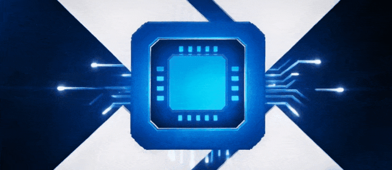
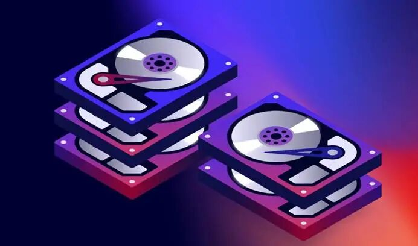
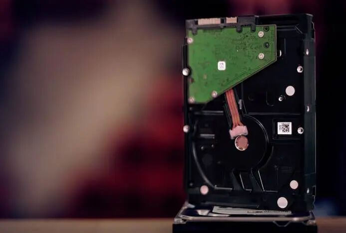
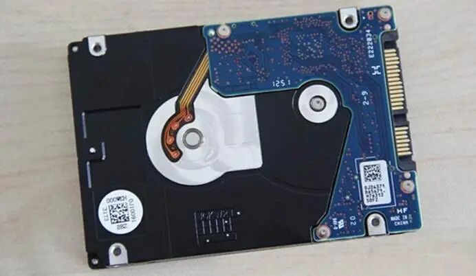
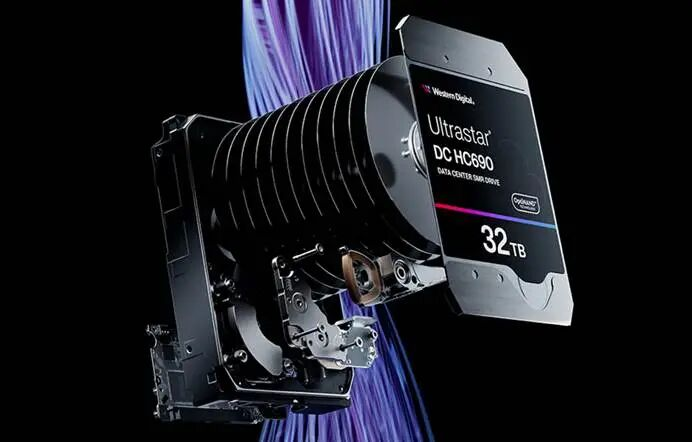

关注机械硬盘品质的朋友，或许听说过BackBlaze的定期质量报告。

但它的参考性存在一些缺陷，因此英国埃塞克斯大学的经济学家Christoph Siemroth、韩国成均馆大学的朴汝明，在此基础上联合进行了深入研究，并在IEEE上发表了一篇经过同行评审的研究论文。

Backblaze自己的报告每季度更新一次，直接对比当期正在使用中的硬盘。

论文作者认为，这种统计方式存在缺陷，尤其是**不同品牌硬盘的大规模装机时间窗口不一样，会出现老硬盘与新硬盘放在一起对比的问题。**

比如HGST（昱科）硬盘集中在2014年大规模上新Backblaze数据中心，希捷在2015‑2020年一直都是首选，东芝2023年新增最多，西部数据2024年又拿下第一。

因此，Backblaze报告的原始年化故障率（AFR），本质上是把已经老化的希捷、HGST硬盘，和更新的东芝、西数硬盘混在一起比较。

另外，对比样本中还有多达146943块硬盘没有发生故障就退出了统计，占样本总量的多达31%，它们大多是数据中心扩容升级时被替换下架的。

西姆罗、朴汝明的研究重新分析了Backblaze已公开的长达12年的硬盘运行数据，统计周期从2013年到2025年第二季度。

**硬盘覆盖数量达 443156块，累计运行时间超过166万硬盘年**，而且硬盘的服役年限、容量、物理规格、工作温度等都做了重新匹配校准。

最终，他们没有公布具体的故障率，而是给出了一个相对参考值。

**以希捷为 100%作为基准参考，HGST只有希捷的约41%表现最好，西部数据约52%也很不错，东芝就最差了达到了107%。**

这和Backblaze的报告结论基本一致，HGST一直是表现最好的品牌，部分产品可以做到几乎0故障。

只是可惜，HGST品牌早已香消玉殒，不复存在了。

HGST可以说是机械硬盘行业的一个标杆，也起到了承前启后的重要作用，在历史上书写了浓墨重彩的一笔。

1956年，IBM发明了第一块机械硬盘，但是到21世纪初，IBM硬盘持续亏损，而日立渴望做大存储业务，于是双方一拍即合。

2002年12月，日立出资20.5亿美元收购IBM全球硬盘事业部，次年1月将其与自家硬盘业务合并成立HGST（Hitachi Global Storage Technologies），也就是日立环球存储科技。

**HGST 完整继承了IBM硬盘的全部产品线，包括桌面级Deskstar、笔记本级Travelstar、企业级Ultrastar，同时继承了IBM在磁头、盘片等方面的所有核心专利技术。**

这就为HGST硬盘的高品质打下了坚实基础，尤其是Ultrastar系列可谓有口皆碑，颇受企业、数据中心、高端玩家的青睐。

HGST 2011年研发出了专利级的**HelioSeal 氦气密封技术**，2013年推出首款量产级充氦硬盘Ultrastar He6 6TB，随后成为整个行业的通用技术标准。

它在硬盘内部使用低密度的氦气替代空气，从而大幅降低碟片阻力、震动与发热，可以在同等体积内封装更多碟片，显著提升容量，同时降低功耗、提升寿命。

2015年，HGST又研发了**SMR 叠瓦式存储技术**，首款量产产品Ultrastar Archive Ha10容量达到10TB。

该技术虽然存在一定的天然缺陷，颇受争议，很多用户唯恐避之不及，但是在冷存储、归档等场景，它确实可以实现超高存储密度。

2011年3月，西部数据耗资约43亿美元收购了HGST，次年取了新的中文名“昱科环球存储”，2015年反垄断监管解除后开始与西数硬盘业务全面整合，HGST逐步淡出。

**2018 年，西部数据正式在全球范围内停用HGST品牌**，所有产品切换为WD标识，比如企业盘叫做WD Ultrastar，消费级硬盘整合进入WD蓝盘、黑盘、红盘系列。

**事实上，西数当前的企业级硬盘在技术上几乎完全继承自 HGST，这也是其企业盘口碑显著优于消费级硬盘的核心原因。**

HGST已经走了，但精神永在！