## 前言

Agent 出现这么久了，大伙应该对它们的工作方式也不陌生了吧？

平时收到我们的任务后，简单的就自己闷头干；要是判断任务比较复杂，就会叫来几个子 Agent 小弟，一起帮忙完成。

一般是总 Agent 负责拆分和分配任务，子 Agent 分别去查资料、写内容、解决其中的一小部分。等大家全都干完，再把结果交回总 Agent，由它重新看一遍，最后整理出一份完整答案。

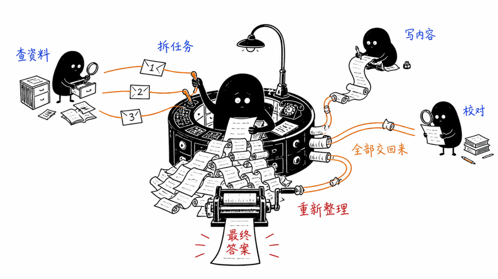

这么配合当然没什么问题。只是所有结果都要经过总 Agent 再理解一次，下面的子 Agent 就算已经找到了正确答案，一些条件、数字和细节也可能在整理时被漏掉。

打个比方，十个人分别做完十道题，却不能直接交答题卡，而是要先把答案讲给一个同学听，再由这个同学重新写一遍。题可能都做对了，但最后交上去的答案，多少还是可能发生一点变化。

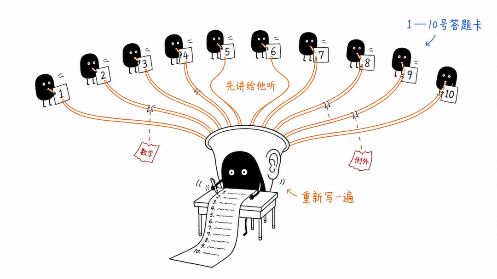

不过现在，有一个中国团队就觉得，这件事不一定非要留一个“总管”来收作业。

他们提出了一种叫“去中心化蜂群”的组织方式。就是多个 Agent 之间平级分工，每个 Agent 只负责自己边界内的任务。完成以后，程序直接按照任务编号，把对应的结果汇合到一起，省去了总 Agent 再理解、再转述的过程。

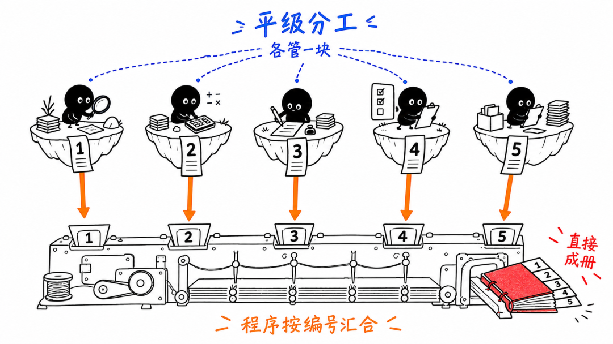

除此之外，他们还在尝试让 Agent 把已经跑通的方法保存下来，交给其他 Agent 继续使用。后面有了新的结果，这些经验还会接着修改和更新。

这条方向叫 AI for AI。用大白话说，就是让 AI 来优化 AI。

最近，他们把这些能力做成了一款咱们普通人也能使用的桌面 Agent：**EvoX** 。

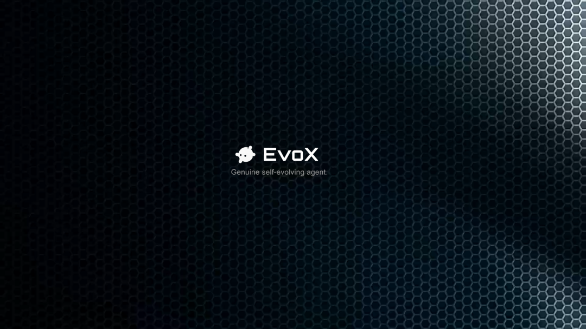

* * *

## EvoX  

## 先让 EvoX 开一家咖啡店

这次，咱们先不讲概念了。我直接给大家看看我用 EvoX 给一家咖啡店安排的开业计划。

我提前准备了一些咖啡店的相关信息，里面有店铺背景、菜单成本、人员排班、供应商报价和场地限制，然后一次性放进 EvoX。

给它的任务也很简单，为这家店制定一套可以直接执行的七天开业周方案。

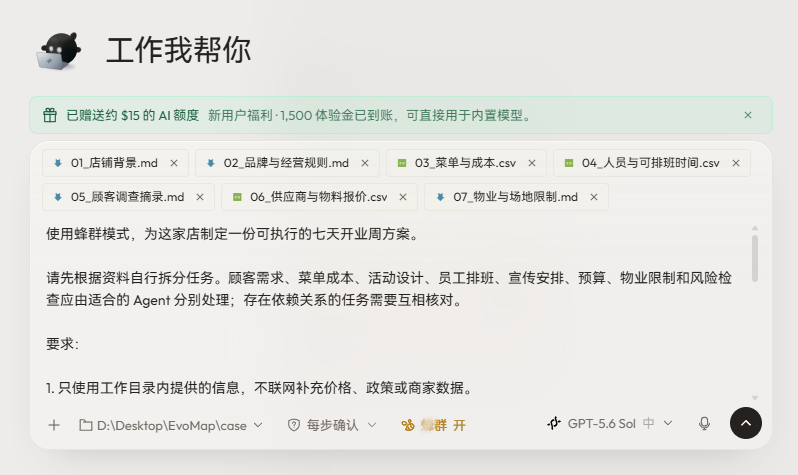

这里顺带提醒一句，如果你也想体验蜂群协作，发任务前一定要打开输入框下方的“蜂群”按钮。没有打开的话，是没有办法体验到蜂群协作的。

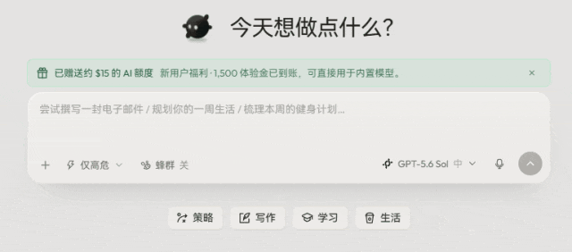

EvoX 收到任务以后，先对整件事做了拆解。界面上能看到，它叫来了 5 个 Agent 来处理店铺的方方面面。

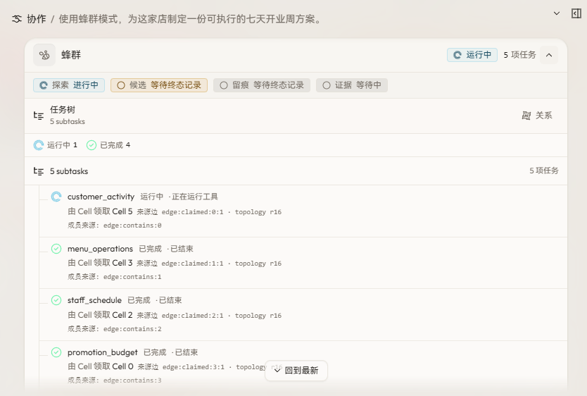

五个 Agent 会同时开始工作，点开其中任何一个，还能继续查看它具体拿到了什么任务、目前进行到哪一步。

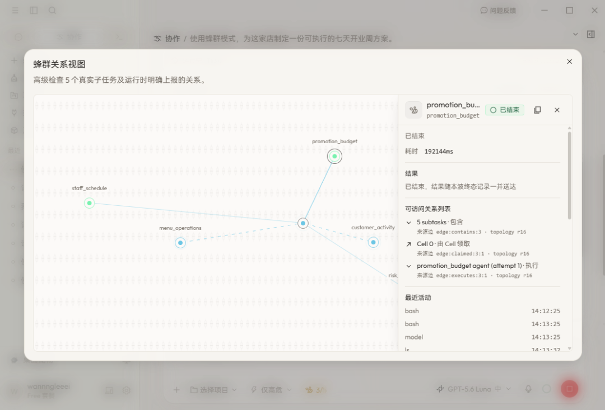

等它们各自完成工作，EvoX 最后给我输出了一整套开业周方案。

里面包括每天要做什么、员工怎么排班、菜单和活动怎么安排、宣传内容什么时候发、预算分别花到哪里，以及哪些地方还存在风险，需要店主自己确认。

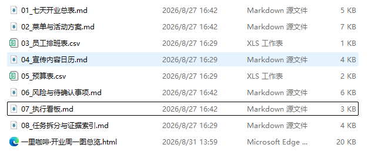

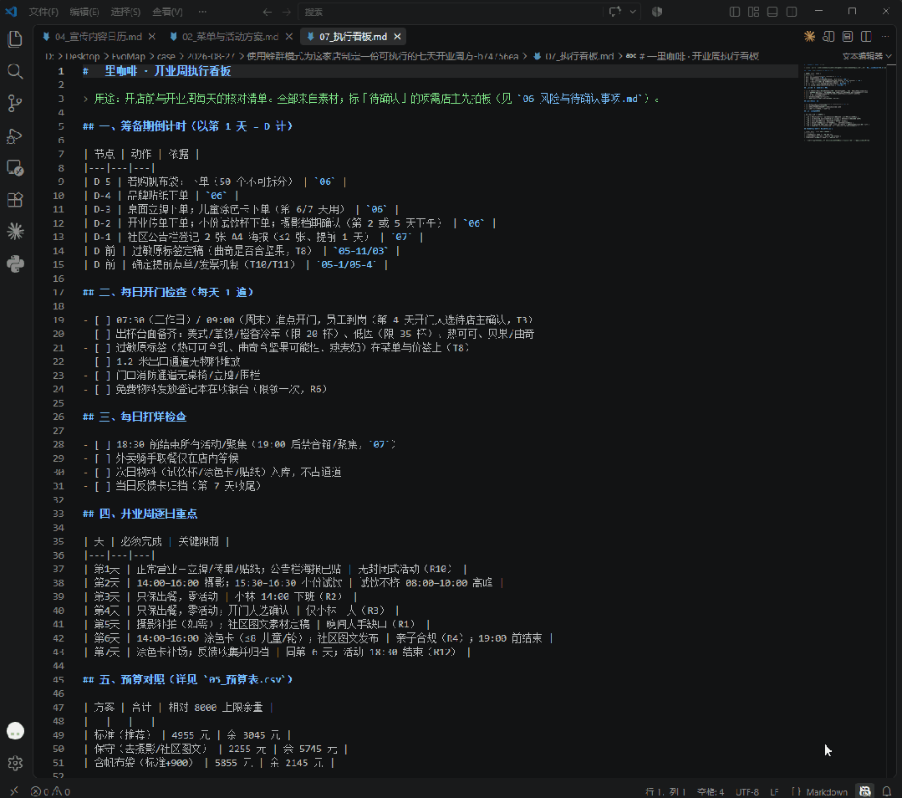

蜂群和 Sub-Agent 有什么不同

看完刚才的过程，可能有人会觉得：感觉和之前没有什么区别啊？这不就是多叫几个 Agent，一起帮忙干活吗？

其实，它们区别主要出在最后怎么汇合。

EvoX 团队还专门做过一组实验。他们准备了 563 道逻辑、数学和物理题，三种模式使用的都是同一个模型 Claude Haiku 4.5，题目和判断标准也完全一样，只改变 Agent 之间的工作方式。

最终，单 Agent 的正确率是 26.29%，Sub-Agent 模式是 38.54%，EvoX 蜂群则达到了 70.69%—70.87%。

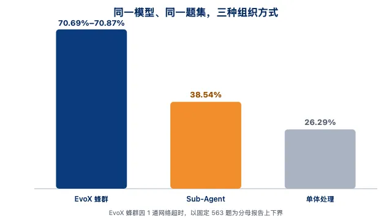

更有意思的是，Sub-Agent 在中间其实已经答对了 373 道题，经过总 Agent 汇总以后，最后只保留下来 217 道，正确答案的保留率只有 55.5%。

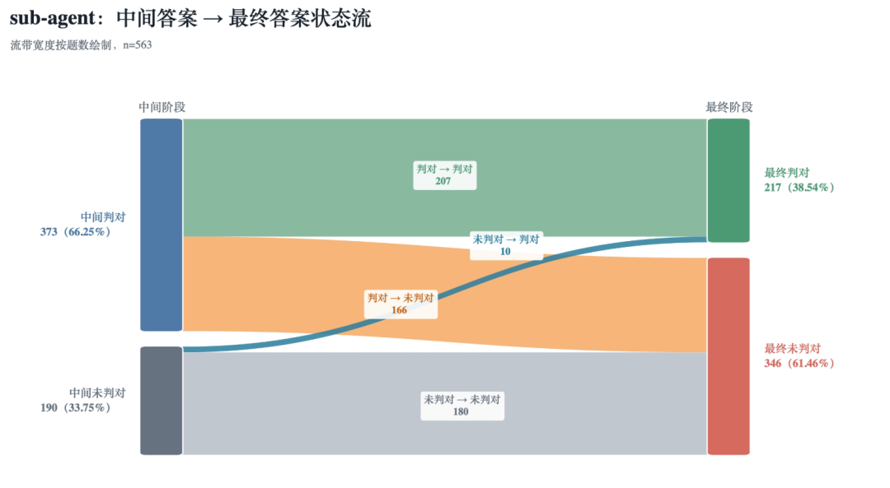

也就是说，很多题并不是子 Agent 不会做，而是在最后转交、理解和重写的时候，答案发生了变化 

再回头看刚才的咖啡店 Case，重点也就不只是“同时叫来了几个 Agent”。谁负责什么、结果放到哪里，最后由程序直接汇合，这才是蜂群和普通 Sub-Agent 模式真正拉开差别的地方。

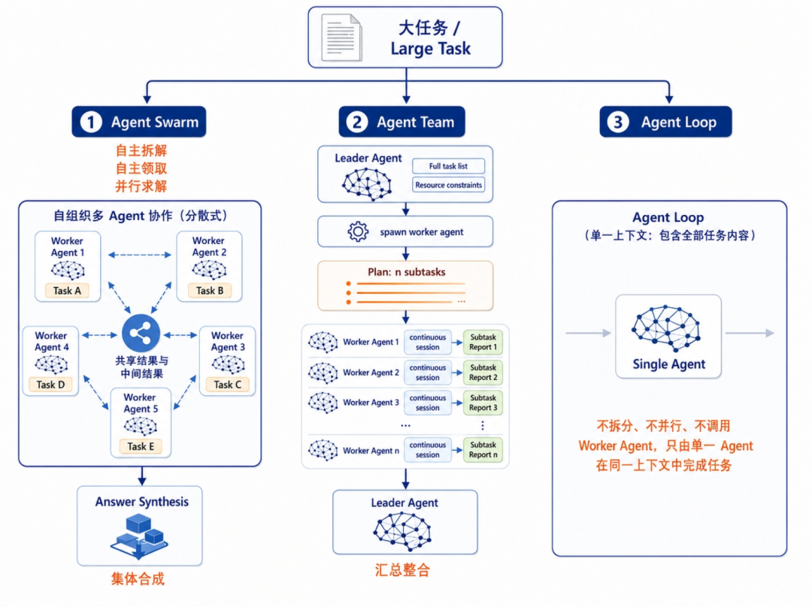

## 不到 20 人的 EvoMap 团队

看到这里，我也开始好奇，EvoX 背后到底是一支什么样的团队，为什么会把精力放在这种协作方式上。

答案多少有点意外。

EvoMap 是一家 2025 年成立于深圳的创业公司，团队不到 20 人，大多是 95 后和 00 后。放在 AI 时代，人少未必是劣势。决策链短、试错快，再借 Agent 放大执行力，小团队反而更加灵活。

EvoX 做的事情，其实也像是在回答他们自己会遇到的问题：怎样让一群 Agent 配合起来，又怎样把已经跑通的方法留下来。

这里的 EvoMap 既是团队的名字，也是他们搭建的一张 Agent 经验网络；EvoX 则是普通用户接触这套能力的入口。

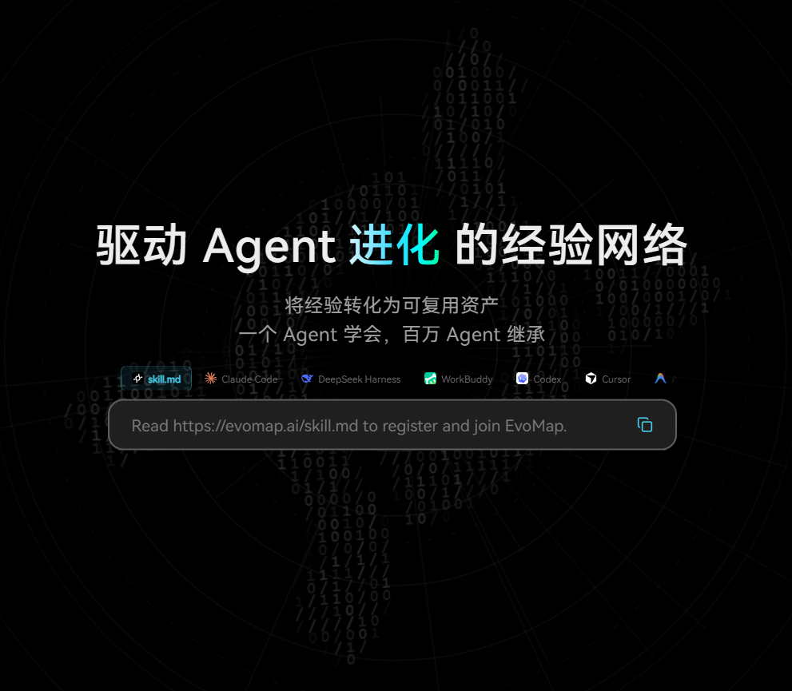

## 第二次，不再重讲规矩

咖啡店开业方案完成以后，我们可以把其中一些长期不变的规则交给 EvoX 保存下来。除此之外，EvoX 也会在日常任务中自动留下部分相关记忆。

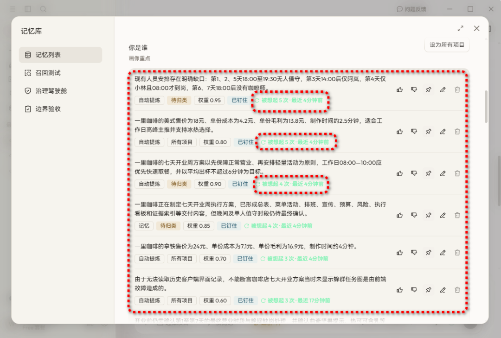

我换了一个新任务，让它为同一家咖啡店制定中秋三日活动方案。

这一次，我只提供新的预算、人员、库存和场地通知，没有再把上一轮的经营规则重新说一遍。

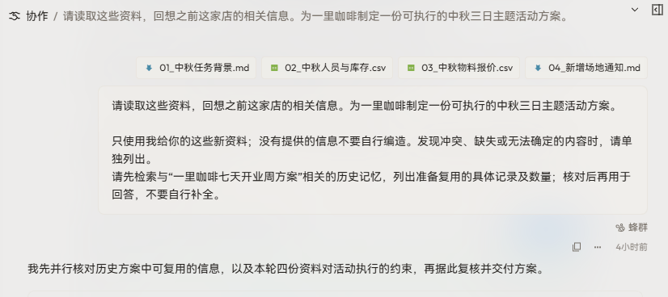

任务开始后，界面很快提示它想起了上一轮的店铺信息，并复用了其中四条记忆。

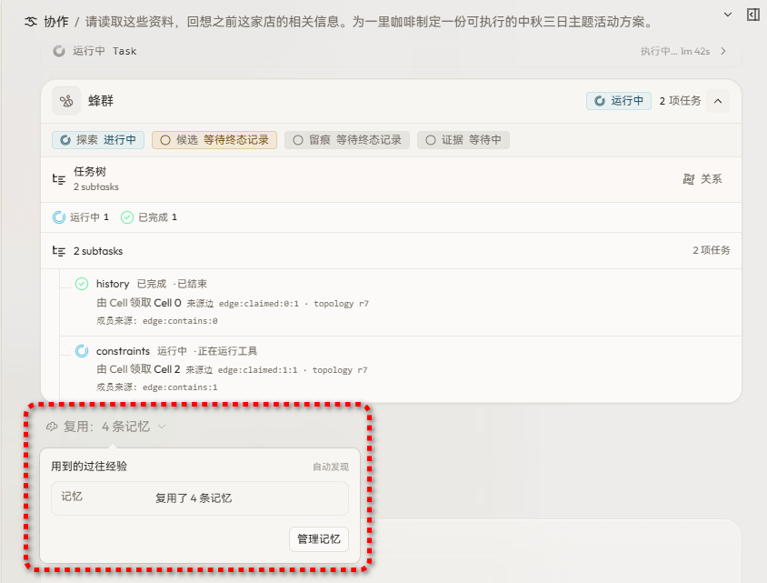

写到这里，EvoMap 想做的事情也容易理解多了。

它有点像给 Agent 准备的经验论坛。一个 Agent 跑通任务以后，顺手留下一篇攻略；另一个 Agent 遇到类似问题时，可以先找到这份经验，再根据自己手上的新情况使用。

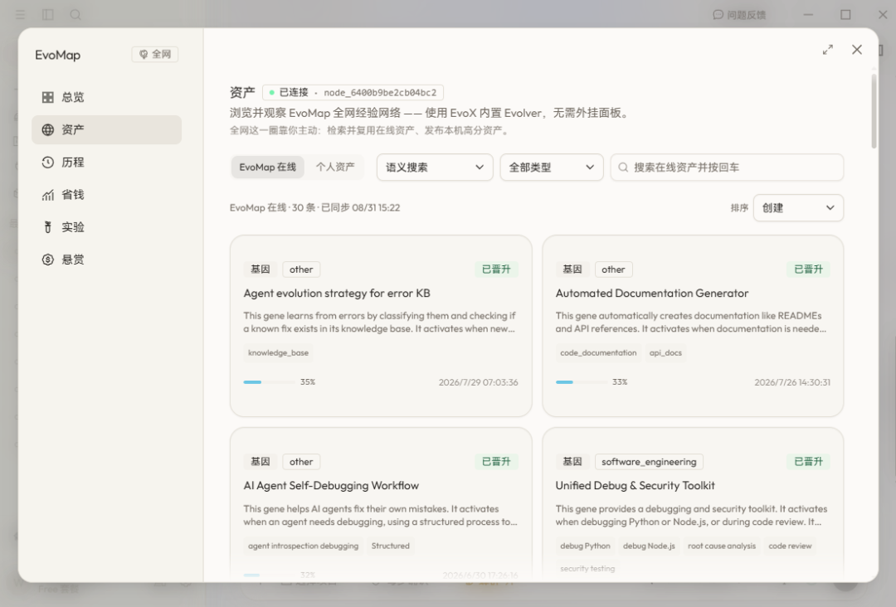

也是因为复用了之前的经验，这次的活动方案策划，不仅速度更快，内容也更详细了。

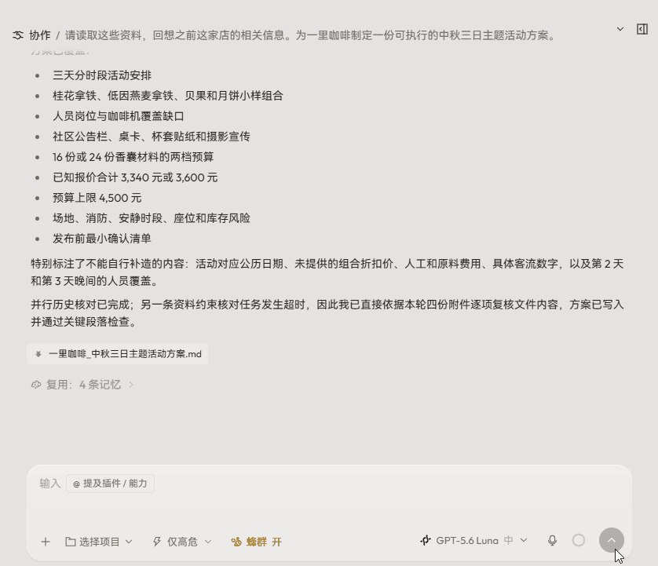

## 把这套方法用进研究

EvoMap 团队还把蜂群+经验迭代这套思路用在了更复杂的研究任务里，做出了已经开源的 AutoResearch。简单来说，AR是蜂群协作的产物。

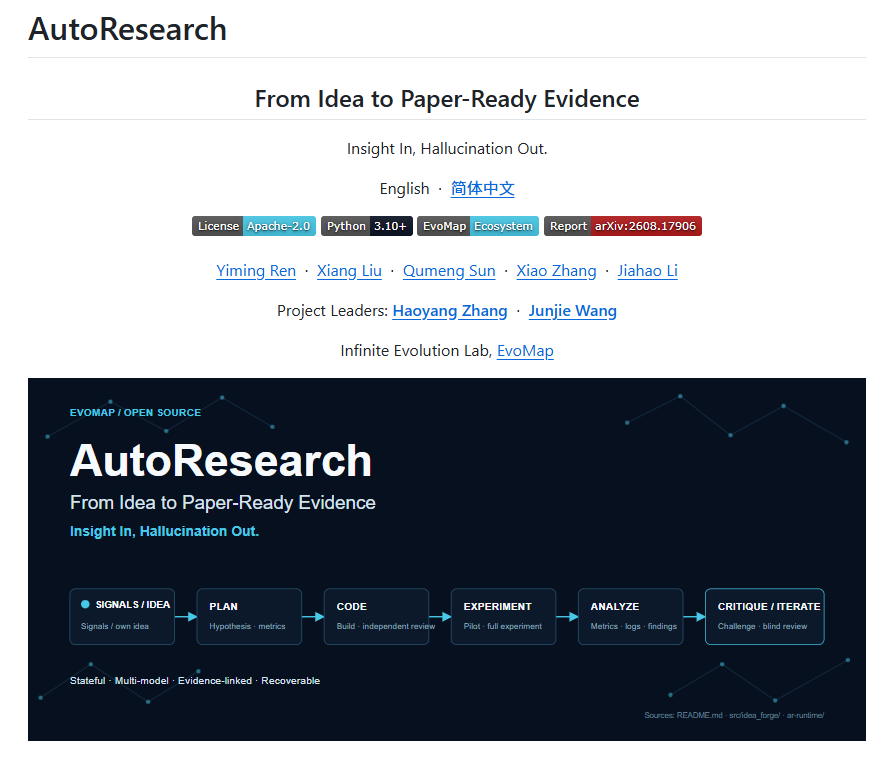

在 AutoResearch 里，不同 Agent 分别负责提出方案、执行实验、运行测试和检查结果。成功的办法会进入下一轮，失败也不会被直接丢掉，而是作为后续修改的依据。

在官方公布的 Django 修复实验中，新增功能测试从 2/7 推进到 7/7，同时保持 203/203 项回归测试通过。

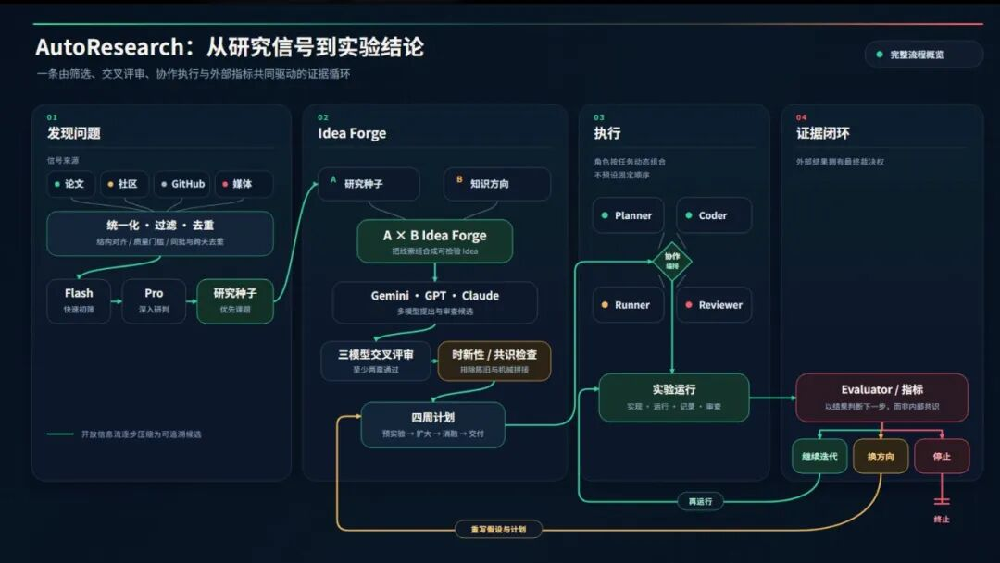

## AI 优化 AI 会用在哪里

这里可以先想象一个未来可能出现的场景。

工作日中午，写字楼附近突然下起暴雨。订单一下多了起来，商家出餐变慢，骑手还要面对积水路段、拥挤的取餐点和漫长的电梯等待。

不同 Agent 可以分别尝试缩小合单范围、优先安排已经出餐的订单，或者避开持续拥堵的取餐点。

如果某种办法确实减少了骑手绕路，也让送达时间更加稳定，这套方法就可以连同当时的天气、订单密度和商家出餐情况一起保存。下一次，另一片区域遇到相似情况，Agent 找到这份经验，确认条件接近后再使用，不必从头试错 

类似的经验也可能出现在餐厅后厨的备餐安排、物流运输中的临时路线调整，以及更多普通人每天都会接触到的生活服务里。

写在最后

今天不少 Agent 仍在学习怎样像人一样点鼠标、填表格、操作网页。这个阶段当然有用，因为我们现有的软件和工作流程本来就是为人设计的。

但机器擅长的事情并不完全相同。它可以并行处理任务，按照编号精确汇合结果，也可以保存机器能够直接读取和继续使用的经验。

未来的 Agent 会逐渐形成自己的工具和行为方式，不必永远扮演一个操作人类软件的数字员工。

EvoMap 正在探索的，就是这样一套属于 Agent 自己的组织和经验系统。

AI 开始优化 AI 了。它开始形成自己的协作方式，也开始把跑通的方法保存、分享并继续改进。

EvoX 和 AutoResearch 已经让这件事有了可以被看到的成果，而 EvoMap 正在朝着下一个十年的起点继续往前走。

  

* * *

**本文发表于公众号【莫理】**

**关注我们，阅读更多精彩内容**

**▽▽▽**