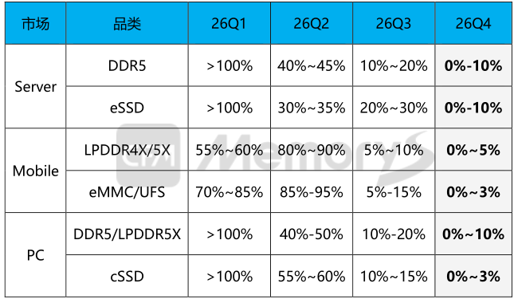
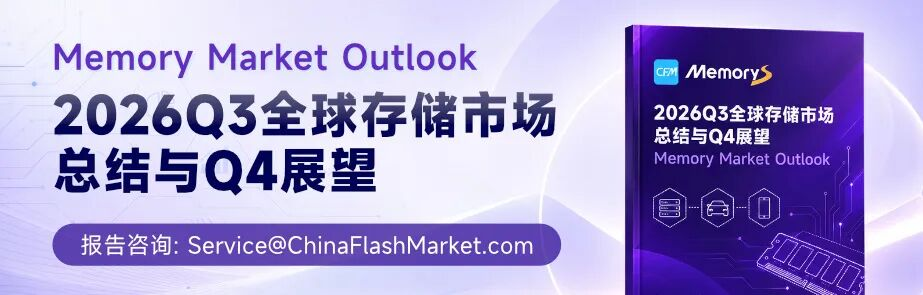

****

CFM闪存市场近日发布2026年第四季度存储市场展望报告。报告指出， 预计2026四季度，服务器DDR5、eSSD价格环比涨幅将分别落在0%~10%、0%~10%区间；Mobile LPDDR4X/5X、eMMC/UFS价格涨幅分别约0%~5%、0%~3%；PC DDR5/LPDDR5X涨幅预计约0%~10%，cSSD涨幅约0%~3%。

CFM闪存市场2026年价格环比幅度预测：

来源：CFM闪存市场。

注：最终实际情况可能存在调整，因各供应商拟定基准价不同，最终幅度会有差异。

  

  

  
  
  
  
  

Mobile市场

  

因早前原厂与手机客户签订长期协议并达成相关价格策略，加上mobile市场需求较为低迷，Q4 mobile NAND、DRAM价格涨幅有限。但可以预见的是，明年英伟达Vera CPU、AMD Verano CPU对服务器LPDDR5X需求增速最高可能翻倍，除服务器SOCAMM2以外，互联网自研算力卡、AI PC、汽车、运动相机、无人机等市场LPDDR5X应用需求激增，将进一步挤占mobile LPDDR5X产能供应，不排除明年服务器客户采购LPDDR5X整体需求将超过Mobile LPDDR的情况出现，原厂将调动更多的LPDDR5X产能向服务器市场倾斜，相应的Mobile LPDDR5X供应比例或将进一步收缩。因此，即使手机市场受整机售价上涨抑制出货量，需求难有好转的情况下，随着原厂LPDDR5X供应灵活调配至服务器市场，Mobile LPDDR5X总体维持低供应。而当前mobile LPDDR5X与服务器LPDDR5X两者价差较大，原厂基于财务的考虑，将推动Mobile LPDDR5X价格锚定服务器市场，进一步缩小Mobile与服务器LPDDR5X的价差，预计明年Q1价格将大幅上涨超20%以上。

  

  
  
  
  
  

  

服务器市场

  

全球超大型云服务商受AI推理规模化商用的商业红利支撑持续上修资本开支，AI基建和配套服务器硬件加大资金投入部署，北美服务器存储需求持续强劲，近期多家CSP新增大规模QLC eSSD需求，服务器64GB DDR5作为刚需相对96GB/128GB成本明显更优，北美服务器客户采购积极性偏高。国内市场服务器64GB DDR5同样因需求火热导致供应趋紧。但整体来看，随着二季度原厂纷纷面向国内服务器市场增加DRAM、NAND供应配额，国内服务器客户供应满足度持续提高，上半年均已积累一定规模的库存，大容量DDR5和低容量eSSD需求阶段性饱和，个别互联网厂商已对相关产品进行较大幅度砍单。Q3国内开始减缓提货节奏，预计四季度供需双方博弈将更加激烈。因此，四季度原厂涨价动力更多来自于北美市场，国内客户提货态度的转变或将加大原厂价格谈判难度，预计四季度服务器DRAM/NAND价格涨幅环比小幅增长。

  

  
  
  
  
  

PC市场

  

经过多轮提涨后，各原厂DRAM/NAND定价均出现较大差距；海外原厂价格显然更加激进。DRAM方面，基于上半年原厂PC DRAM合约价连续两季大涨已积攒了近两倍的涨幅，Q3价格继续上涨15%，至此PC DRAM ASP已高达$1.725/Gb，甚至个别海外原厂样品较激进的价格逼近2美金，存储占PC整机物料成本进一步提高。尽管供应仍较为有限，但PC厂商上半年并未因存储价格过高而减缓备货和砍单，然而，Q2 PC出货量多数开始转弱叠加因产品售价上涨带来的反噬作用，下半年出货比上半年将更加艰难，Q4 PC DRAM价格将上涨0%-10%。PC同样面临明年服务器LPDDR5X产能进一步挤占的供应困境，预计Q1 PC LPDDR5X价格将大幅上涨，从而逐渐缩小与服务器LPDDR5X价差。

  

相对于PC LPDDR5X/DDR5，国内cSSD供应商包含原厂、下游存储厂商在内选择众多，而需求端除头部PC OEM以外，其他中小客户基本处于零需求状态，更严峻的是，PC厂商经历多个季度的备货也导致库存水位正不断抬高，原厂cSSD合约价与现货价已倒挂，进一步影响PC OEM备货意愿，预计Q4 PC cSSD价格涨幅约0%-3%。

  

**最新推荐阅读：**

  * **[新厂首条量产线提速，存储巨头产能释放或提前；南亚科技被控DRAM专利侵权](https://mp.weixin.qq.com/s?__biz=MjM5OTk5Mzc1Mw==&mid=2652903498&idx=1&sn=06192b916659d5baea7e098f1bba6905&scene=21#wechat_redirect)**

  * **[高通首次拆分旗舰芯片：存储规格拉开差距；三星LPDDR6完成高通平台验证；长江存储3D NAND专利战在德获胜](https://mp.weixin.qq.com/s?__biz=MjM5OTk5Mzc1Mw==&mid=2652903493&idx=1&sn=5de5be1f989b442df0168095e839ad8d&scene=21#wechat_redirect)**

  * **[假期临近存储现货整体横盘整理，个别让价换量成效有限难掩低迷市况](https://mp.weixin.qq.com/s?__biz=MjM5OTk5Mzc1Mw==&mid=2652903489&idx=1&sn=cb0d738c61b63274344f0f961961c34d&scene=21#wechat_redirect)**

  * **[传某NAND厂商拟在美建厂；美光坦言供需平衡节点难料；英伟达：预计2027年芯片销量翻倍](https://mp.weixin.qq.com/s?__biz=MjM5OTk5Mzc1Mw==&mid=2652903474&idx=1&sn=54c362fd867d959bf5c2f127017afee2&scene=21#wechat_redirect)**