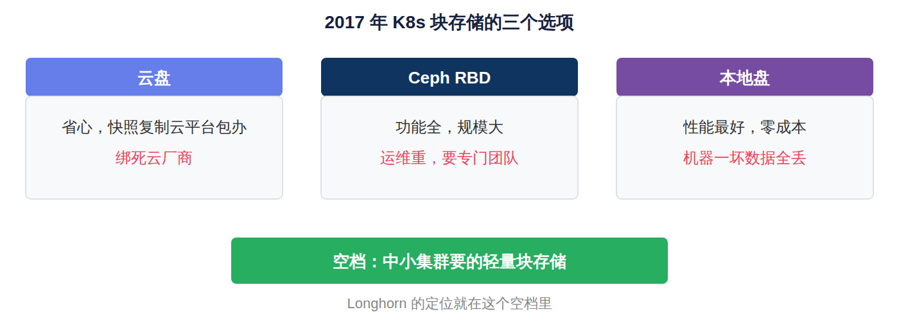
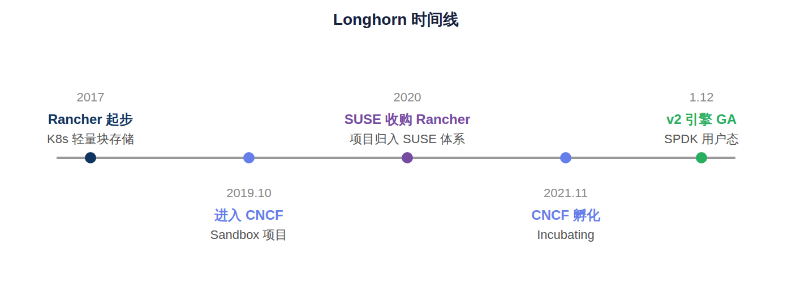
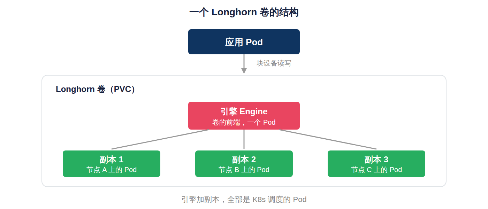
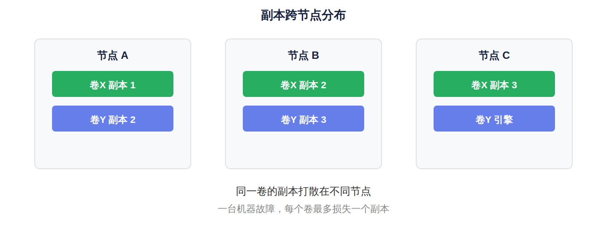
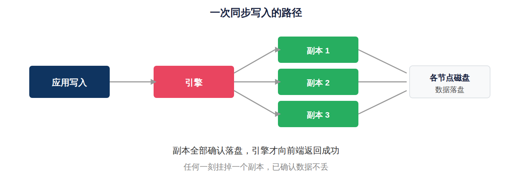
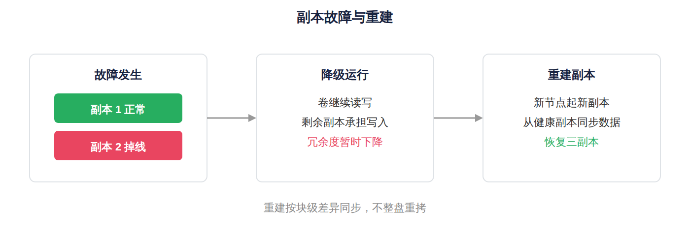
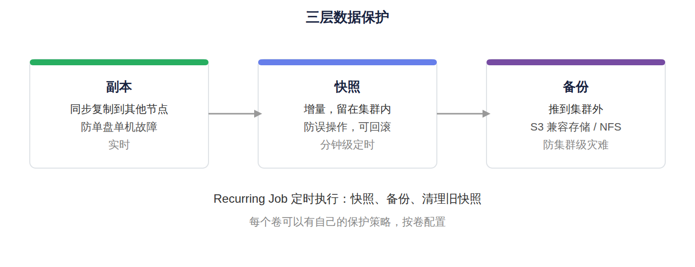
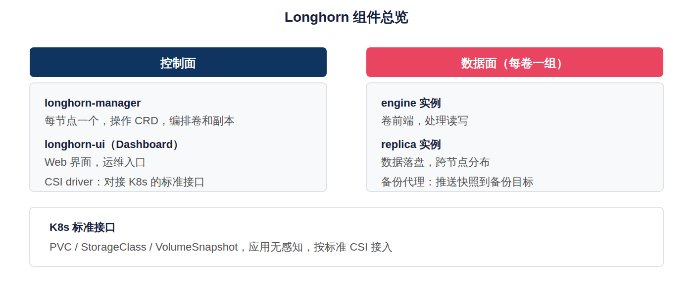
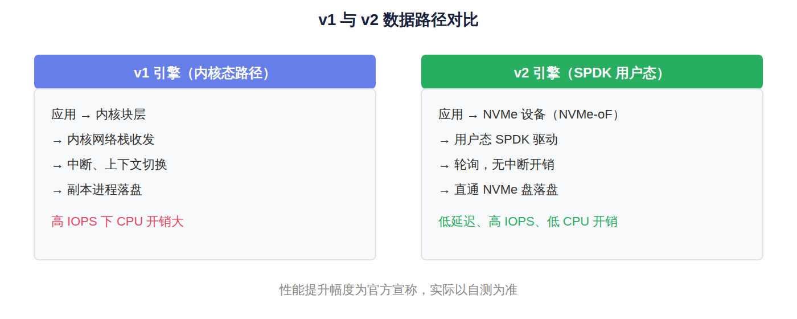
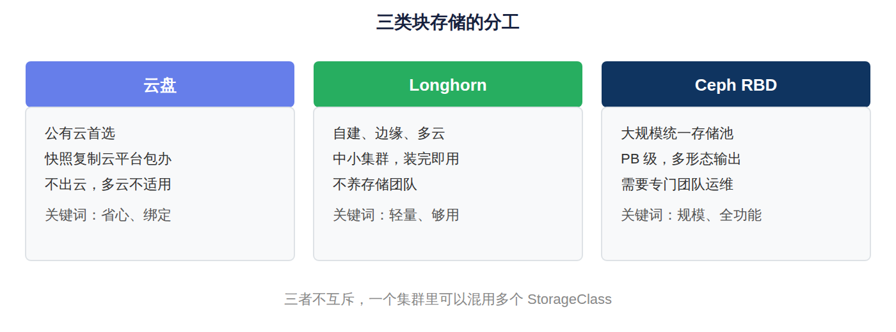

开源存储列传 · 第 18 篇

Longhorn，K8s的轻量块存储

Rancher 给 Kubernetes 做的块存储：装完即用，每卷一个引擎，快照备份齐全，轻量背后的取舍

1在 K8s 上跑数据库，第一道坎就是数据放哪。云盘绑死云厂商，Ceph 要专门团队伺候，本地盘机器一坏数据就没了。2017 年 Rancher Labs 起步的 Longhorn，就是冲这个空档来的。

2它的承诺很朴素：装完即用。全部组件都是 K8s 里的 Pod，没有外部依赖，自带 Dashboard，快照、备份、定时任务一样不缺，K8s 管理员顺手就能运维。

3这篇把这份"轻"拆开看：每卷一个引擎加多副本的模型省掉了什么，又付出了什么；同步复制和快照备份怎么工作；v2 引擎换了 SPDK 用户态之后，性能短板补到什么程度。

Longhorn 现在是 CNCF 孵化项目。本篇讲架构、能力和运维体验，局限和选型放在最后一节。文中数字以成文时的官方资料为准。读之前可以先想一个问题：你的集群到底需要多重的存储？带着这个问题往下读，会更有感觉。

## 一、Rancher 为什么要做存储

2017 年前后，Kubernetes 刚打赢容器编排之战。Rancher Labs 当时在做 K8s 管理平台，客户开始试探着把有状态应用往 K8s 上搬。搬是搬上去了，一碰存储就出问题：K8s 自带的存储支持不够用，块存储要么没有复制，要么得靠外部系统。

当时的选项数下来就这么几个。云盘方便，但绑云厂商，自建机房和多云环境用不了；Ceph RBD 功能全，可它是一套完整的存储集群，要专门的存储团队运维，十几个节点的小集群上它属于杀鸡用牛刀；本地盘性能最好，可机器一坏数据全丢，跟没有保护一样。

图：三个现成选项都不合适，空档留给了轻量选手

Rancher 的判断是：中小规模 K8s 集群需要一块轻量的块存储，用 K8s 原生的方式装进去，由 K8s 管理员顺手运维，不养专门的存储团队。于是 2017 年前后启动了 Longhorn 项目。名字取自德州长角牛，跟 Rancher（牧场）是一套命名风格。

Longhorn 从第一行代码起就是纯云原生实现：没有独立安装包，所有组件以 Pod 形式跑在 K8s 里，由 K8s 负责调度和拉起。这是它"轻"的根源，也是后面所有架构特点的起点。

这个定位在当时其实是有点反着来的。主流存储项目的思路是做一个功能全、规模大的系统，再想办法塞进 K8s。Longhorn 反过来，先假设用户只有十几个节点、没有专职存储工程师，再问"这种用户需要什么样的块存储"。答案是功能不求全，但每一项都要能自己跑起来：复制、快照、备份、监控、升级，全都要内置，不依赖外部组件。这个出发点决定了它后面所有的取舍。

图：从 Rancher 内部项目到 CNCF 孵化

治理上，2019 年 10 月 Longhorn 捐给 CNCF 进入沙盒；2020 年 SUSE 完成对 Rancher Labs 的收购，Longhorn 跟着进了 SUSE 体系；2021 年 11 月升级为 CNCF 孵化项目。代码开源，背后是 SUSE 和社区维护者。SUSE 的超融合平台 Harvester 拿 Longhorn 当存储底座，算是自家场景里的大规模使用证明。

补一个背景事件。同一时期，K8s 的存储接口正在从树内实现切换到 CSI（Container Storage Interface），2018 年前后 CSI 成为对接存储的标准方式。这对 Longhorn 是利好：存储系统只要实现 CSI 标准，就能无缝接入 K8s，不用改 K8s 代码，也不用维护插件分支。Longhorn 正是照这条路走的，所以它对发行版不挑，RKE、EKS、GKE、k3s 都能装。

## 二、每个卷都是一个小型分布式系统

Longhorn 的核心设计一句话就能说完：**每个卷是一个独立的小型分布式系统** 。一个卷由一个引擎和若干副本组成，副本数默认三个。

引擎是卷的前端，对外暴露块设备，接收应用的读写请求；副本是后端，真正落数据的地方。引擎和每个副本各自是一个独立的 Pod，跑在 K8s 里。也就是说，你申请一个三副本的卷，Longhorn 就在集群里起四个 Pod：一个引擎，三个副本。

图：一个三副本卷，等于一个引擎 Pod 加三个副本 Pod

副本的分布由调度保证：Longhorn 默认把同一个卷的副本打散到不同节点，一台机器坏了，最多丢一个副本，其余副本的数据还在。你也可以设置软亲和、硬亲和规则，比如要求副本不落在同一机架、只用某些节点的盘。

图：多个卷的副本交错分布在各节点上

引擎本身是无状态的，数据都在副本里。引擎 Pod 挂了，K8s 很快拉一个新的起来，重新接上副本，卷继续提供服务，中断时间在 Pod 重建的量级。这等于把高可用交给了 K8s 的自愈能力，Longhorn 自己不用再搞一套独立的 HA 机制，这是轻量的另一个来源。

这个模型的代价也摆在明面上：N 个卷就有 N 个引擎和 3N 个副本，全是 Pod。卷数多的时候，Pod 数量、etcd 里的对象数、控制面的负载都线性上涨。小集群无所谓，大集群就是压力。这一条记着，讲局限的时候还要用。

对比一下 Ceph 的做法就更清楚了。Ceph 是把数据切成小块，打散到一个全局的资源池里，靠 PG 和 CRUSH 来管理放置，一个集群可以支撑海量的卷。代价是这套机制本身复杂，运维门槛高。Longhorn 选了另一个极端：不做全局池，每个卷自己管好自己，逻辑简单、上手快，但也因此放弃了超大规模的扩展能力。这不是谁对谁错，是针对不同规模的取舍。小集群上硬套 Ceph 那套全局池，纯属给自己找麻烦；大集群上用 Longhorn 的每卷独立模型，控制面又会吃不消。

副本往哪些节点放，Longhorn 给了节点标签和磁盘标签两组手段：给一组节点打上特定标签，再在存储类里指定，不同业务就各归各位。比如 SSD 节点给数据库卷用，HDD 节点给日志卷用。每个节点还能设置预留空间，划出一块磁盘容量不让 Longhorn 用，给操作系统留余地。这些都是小功能，但在硬件参差不齐的环境里，真正干活时靠的就是这些细节。

## 三、同步复制怎么保证不丢数据

Longhorn 默认同步复制：一笔写请求，要等副本确认落盘之后才算成功。这样任何时刻挂掉一个副本，已经确认的数据都不会丢。对数据库这类应用，这是最基本的要求。

写入路径上，引擎和副本组成复制链：写请求沿链逐级传递，每一级落盘后确认再逐级返回，最后引擎向前端返回成功。链上任何一个副本慢了，整条链就慢，所以副本的网络质量和磁盘性能直接决定卷的写延迟。

图：同步复制，全部副本确认后返回

某个副本掉线或者磁盘变慢，引擎会把它从链里摘除，剩余副本继续提供服务，卷的状态标记为降级。之后 Longhorn 会在其他节点上重建一个新副本，从健康副本把数据同步过去，恢复到设定的副本数。

图：降级、重建、恢复的完整闭环

重建是按块级差异做增量同步，不是整盘重拷，几百 GB 的卷恢复时间在分钟到小时量级，取决于网络和盘速。这里有个运维要点：副本数设为 3 的时候，集群至少要 3 个可用节点，否则两个副本落在同一台机器上，机器一坏丢两个副本，冗余就名存实亡了。节点少的小集群，这点要心里有数。

有人会问，为什么不干脆用异步复制换性能。Longhorn 的定位是给数据库和有状态应用提供存储，这类负载最怕的是丢数据。异步复制在主副本切换的瞬间可能丢掉尚未同步完成的写，对数据库来说这个风险不好评估。所以 Longhorn 宁可让写延迟高一点，也要保证已确认的写不丢。这个选择跟它的目标场景是一致的。真要追极致性能，那本来也不是它的赛道。

## 四、快照、备份和 Dashboard

复制只防硬件故障，防不了误操作。删库、写坏数据这类事故，得靠快照和备份。Longhorn 这两样都内置。

快照是卷级的，增量实现：每次快照只记录相对上次变化的块，多个快照叠加不会占满卷的容量。基于快照可以克隆新卷，也可以回滚。快照本身还存在集群的存储里，集群整体出问题（比如机房断电、etcd 损坏）的时候，快照也跟着没了。

所以 Longhorn 把备份做成独立动作：把快照推到集群之外的备份目标。常用的两种，S3 兼容对象存储和 NFS。备份是全量加增量的组合，恢复的时候可以整卷恢复，也可以恢复成新卷。这层做完，数据保护才算闭环：副本防硬件故障，快照防误操作，备份防集群级灾难。

图：副本、快照、备份，各防一层故障

定时任务叫 Recurring Job，可以按卷配置：多久做一次快照、多久备份一次、旧快照保留几份。相当于给每个卷自带了一份备份计划，不用外挂工具。

Dashboard 值得单独说一句。Longhorn 自带 Web 界面，节点、卷、副本的健康状态一目了然，快照、备份、扩容、升级都能在界面上点出来，出了问题有事件日志可查。这事听着没什么技术含量，可把运维界面做成一等公民的存储项目真不多，Longhorn 的口碑有一大半是这里挣来的。

图：控制面集中编排，数据面每卷一组

对 K8s 的接入走标准 CSI：StorageClass 声明、PVC 申请、卷快照、在线扩容，都是标准接口，应用侧不需要任何改造。安装一条 helm 命令，卸载也是一条，这在存储项目里属于体验最好的那一档。

这里多说一句运维体验为什么重要。很多存储项目技术上不差，输就输在运维门槛上：配置文件一堆，升级要停机，出了问题日志难读，得靠熟悉内部实现的人才能排障。这类项目用起来就是请了个祖宗。Longhorn 从第一天就把 Dashboard、事件、日志、告警当成产品的一部分来做，普通 K8s 管理员看一眼界面就知道集群什么状态、哪个卷有问题、下一步该干什么。这种"把运维当产品做"的态度，是它在中小规模场景里口碑好的直接原因。

## 五、v2 引擎，走向用户态

v1 引擎的数据路径走 Linux 内核：网络收发、中断处理、内存拷贝，每一步都有开销。中低负载下这些开销不显眼，一旦 IOPS 上到几万，CPU 占用和延迟就开始难看。这不是 Longhorn 一家的问题，是内核路径的共性天花板，业界的解法也都一样：把数据面搬到用户态，用轮询代替中断。

图：从内核路径到 SPDK 用户态路径

Longhorn 的 v2 数据引擎就是这条路：基于 SPDK。SPDK 是 Intel 主导的开源用户态存储框架，把 NVMe 驱动放到用户态，轮询收包，绕开内核中断和上下文切换。v2 引擎对外以 NVMe 设备的形态呈现，走 NVMe-oF 传输，数据面全程在用户态。

进度上，v2 在 1.11 及之前的版本里是实验特性，在 1.12.0 达到 GA。官方宣称在同样硬件上，v2 相比 v1 明显降低 IO 延迟、提升 IOPS，CPU 开销也更低。注意这是官方宣称，具体提升幅度跟盘、网卡、网络配置强相关，上生产前要在自己的环境里实测。

代价也说清楚：SPDK 要独占 NVMe 盘，盘交给 SPDK 之后操作系统就不直接管了；节点上还要预留大页内存。运维习惯跟 v1 不一样，v1 卷也不能原地切成 v2，需要规划迁移。总的来说，方向是对的，块存储想吃上 NVMe 的性能红利，用户态是绕不过去的一步；但 v2 的成熟度和周边工具还在打磨，生产使用建议跟紧版本说明。

值得留意的是，v1 和 v2 在 Longhorn 里是并存的，按存储类来区分，不是二选一。同一个集群里可以一部分卷走 v1、一部分走 v2，按业务对性能的要求分配。这就给了一个平滑的过渡路径：先让对性能不敏感的卷留在 v1，把数据库这类吃 IO 的迁到 v2 上，观察一段时间再决定要不要全切。这种"新旧引擎并存"的设计，对要保生产的团队很友好，不至于被逼着一刀切。

最后把性能预期说实在一点。Longhorn 的设计目标是够用的可靠块存储，不是跑分选手。v1 引擎在普通 SATA SSD 和万兆网络上，支撑中小数据库和一般有状态应用没问题；但要跟本地 NVMe 裸盘、或者专门优化过的存储系统比延迟和 IOPS，那是拿轻量选手去拼重量级，不合适。v2 引擎把上限抬高了一截，让 Longhorn 在性能上不至于掉队，但它的定位仍然是"轻量为先、性能跟上"，不是"性能为先"。选型时把这个预期摆正，就不会失望。

## 六、能力边界与分工

先说适合的场景。**中小规模 K8s 集群** 是 Longhorn 的主场：节点数几个到几十个，卷的数量在百级上下，业务是 Web 服务、中小数据库、监控和中间件。helm 装完就能投产，运维成本跟普通 K8s 应用差不多，不需要专职存储工程师。

**边缘场景** 也合适。边缘节点资源紧张，更没有存储团队，Longhorn 的轻量正好对路。SUSE 的 Harvester 超融合平台拿它当存储底座，虚拟化场景也算经过了检验。

再说边界，三条。第一是规模：每卷一个引擎的模型下，控制面负载和 Pod 数量随卷数线性增长，卷数上千的大集群里这个模型就是负担。官方定位和社区实践都以中小规模为主，超大集群不是它的设计目标。第二是极限性能：v2 之后改善明显，但要跟专用全闪存储阵列比极致性能，还是两回事。第三是引擎单点：引擎挂了 K8s 会很快重建，但重建窗口内这个卷的 IO 是停顿的，敏感业务要评估这个窗口，必要时用应用层主备来遮。

图：按环境和规模选块存储

跟其他块存储的分工，一张表说清楚。

维度| 云盘| Longhorn| Ceph RBD  
---|---|---|---  
部署形态| 云平台内置| K8s 内的一组 Pod| 独立存储集群  
运维成本| 低，云平台负责| 低，K8s 管理员兼任| 高，建议专职团队  
适用规模| 随云| 中小集群| 大规模，可到 PB 级  
数据保护| 云平台快照与复制| 多副本同步复制，快照，备份到 S3/NFS| 多副本或纠删码  
可移植性| 绑定云厂商| 跨平台，随处可装| 跨平台，但部署重  
  
常见组合是：公有云上用云盘；自建机房里小集群用 Longhorn，有统一大池需求再上 Ceph。同一集群里不同 StorageClass 并存，业务按需选，不冲突。

还有一个常被问到的问题：Longhorn 和上一篇《Rook，Kubernetes上的存储Operator》里的 Rook 是什么关系。简单说不是一个层面的东西。Rook 是 Operator，负责把 Ceph 这类存储系统在 K8s 里部署和运维起来，它自己不存数据；Longhorn 是一个完整的存储系统，自己存数据，只是部署方式也用了 K8s 原生手段。两者不竞争，甚至可以并存：一个集群里用 Rook 管 Ceph 出大池，同时装 Longhorn 给轻量业务用，各管各的。

给一个直接的建议。如果你的场景是自建或边缘的中小 K8s 集群，想给数据库和有状态应用一块不用操心的块存储，又不想为存储单独养人，Longhorn 值得放进候选清单，装一套测试环境跑一周故障演练就有答案了。如果你的集群规模已经很大，或者对极限性能有硬性要求，或者需要文件、对象多形态统一输出，那就应该去看 Ceph 这一档，或者直接用云盘。

还有一个容易被忽视的点：Longhorn 的轻量不等于不用规划。副本数、节点标签、备份目标、预留空间，这几项在投产前定好，后面就省事；等数据进去了再回头改，代价会大得多。轻量的项目往往在这里翻车，不是因为东西不好，而是因为"轻量"让人放松了该有的规划。

Longhorn 的故事说到底，是一个"把复杂做简单"的故事。分布式块存储这件事，Ceph 那一派的答案是造一个大而全的系统；Longhorn 的答案是把每个卷做成自治的小系统，让 K8s 去编排。两条路都成立，面向的是不同的用户。认清自己的规模和运维能力，答案自然就出来了。

## 七、社区与工程成熟度

看一个存储项目能不能上生产，除了架构还要看工程成熟度。Longhorn 这几年的版本节奏比较稳，每个版本有明确的 changelog，破坏性变更会提前标注，升级路径也写得清楚。它的 issue 响应和发布节奏在 CNCF 存储项目里属于活跃的一档，这背后是 SUSE 的持续投入和社区贡献者的共同维护。

文档质量也值得一提。Longhorn 的官方文档覆盖了从安装、概念、运维到故障排查的完整路径，常见问题和最佳实践都有成文的说明，不靠口口相传。对一个目标是"让没有存储团队的用户也能用"的项目来说，文档就是它的第一道支持，这块做得到位。当然，商业级支持还是走 SUSE 的服务渠道，开源版和商业支持的关系，跟这个系列里其他厂商赞助的项目是同一个模式。

## 八、收尾

一句话总结 Longhorn：它把分布式块存储做成了一个 K8s 应用。每卷一个引擎加多副本，同步复制，快照备份齐全，Dashboard 顺手，装完即用。

它的轻来自两个决定：不做中心化的存储集群，把控制逻辑分摊到每个卷；不另建高可用机制，把自愈交给 K8s。代价也在这里：规模上不去，引擎重建窗口内 IO 会停顿，极限性能靠 v2 追赶但仍有天花板。想清楚这三条，用不用它就不纠结了。

下一篇写同时期起步、路线曲折得多的 OpenEBS。它把存储引擎本身容器化，前前后后做了四个引擎，经历收购、归档和回归。它留下的经验，比技术本身更值得看。

· · ·

本文为"开源存储列传"系列第 18 篇。文中数字以成文时官方资料为准。上一篇：《Rook，Kubernetes上的存储Operator》；下一篇：《OpenEBS，容器化存储的多引擎实验》。
