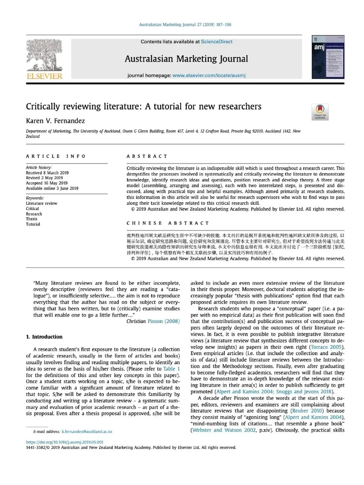
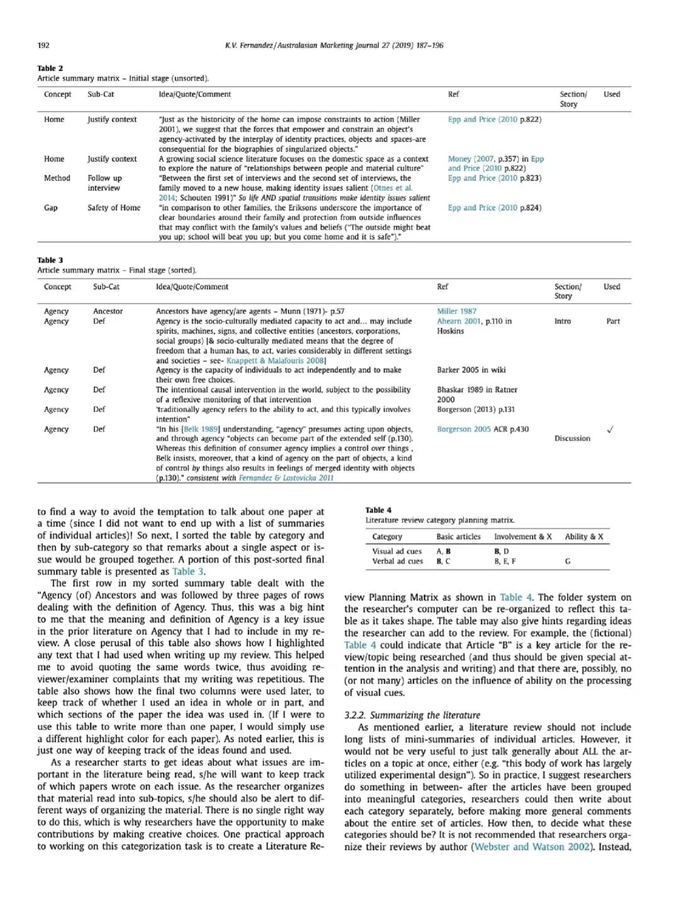
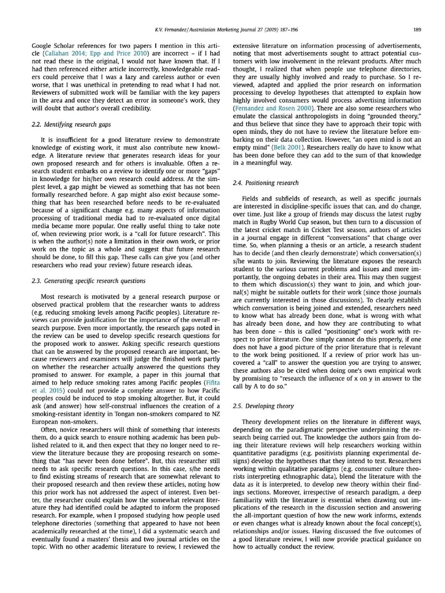

结合博士圈公认的经典论文《Critically reviewing literature: A tutorial for new researchers》，总结出**告别低分流水账、写出批判性高质量文献综述的核心方法** ，彻底纠正新手写作误区。

  

**核心总误区** ：绝大多数人的文献综述，只是单纯堆砌文献、罗列观点（A说、B认为、C发现），沦为毫无价值的文献流水账。**真正的文献综述，核心是批判性分析，而非内容总结。**

  

  

**一、核心认知：Review ≠ Summary**

  

普通综述：机械复述前人研究内容，单纯整合已有文献。

**高分综述：聚焦批判与深挖，核心回答4个关键问题：**

  * 现有研究有哪些共识观点？

  * 各类研究结果、观点存在哪些矛盾？

  * 产生研究差异的底层原因是什么？

  * 各类观点的可信度、局限性如何？

**一句话核心** ：综述不是告诉读者“已有什么研究”，而是点明**现有研究缺什么、漏什么。**

  

  

**二、写作逻辑：先搭框架，再填文献**

  

摒弃“逐篇介绍文献”的零散写法。**文献只是素材砖块，个人逻辑框架才是核心房屋。**

正确做法：先搭建研究主题的分层逻辑框架（分维度、分主题、分视角），再将对应文献归类填充到框架内，让所有文献为自己的逻辑服务。

  

  

**三、读文万能三问（最实用核心技巧）**

  

每研读一篇文献，必须闭环回答三个问题，快速积累综述写作素材与创新点：

  1. 该文献解决了什么具体研究问题？

  2. 该研究存在哪些不足、漏洞与局限？

  3. 该研究为后续研究留下了哪些拓展空间？

  

  

**四、创新关键：重冲突，轻共识**

  

新手误区：一味堆砌学界统一共识的观点，内容毫无新意。

**核心逻辑** ：科研的进步源于争议与探索。相比同质化的共识，**研究中的矛盾、争议、分歧点** ，才是最有价值的创新突破口，也是论文的核心亮点。

  

  

**五、文献取舍：拒绝贪多，聚焦精准**

  

**黄金原则** ：永远不要试图读完所有文献。

文献综述的竞争力，从来不是数量，而是**判断力与精准度** 。只需筛选领域内经典、核心、权威、贴合自身研究主题的关键文献，深耕精读即可。

  

  

**六、终极目标：落地自身研究价值**

  

文献综述的最终目的，不是佐证前人研究的优秀，而是**论证自己研究的必要性与创新性。**

所有文献梳理、批判分析，最终都要落脚到一个核心问题：**基于现有研究的不足，我的研究为什么值得做、有什么价值？**

  

  

**总结**

  

高水平文献综述的本质：**借前人研究，建自己逻辑，找研究缺口，立自身课题** 。读文献是过程，批判性思考、挖掘创新问题，才是科研的真正开端。

  

