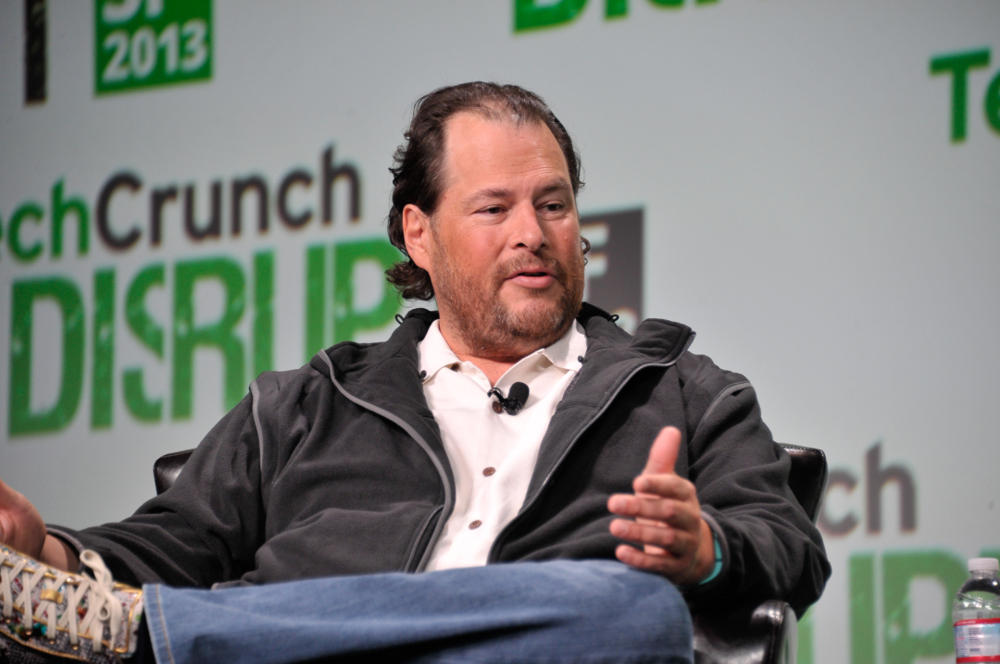
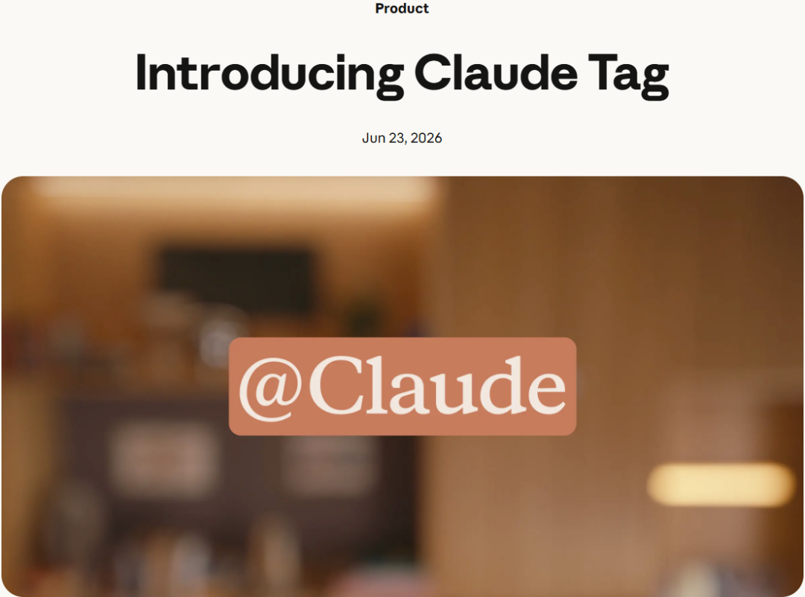
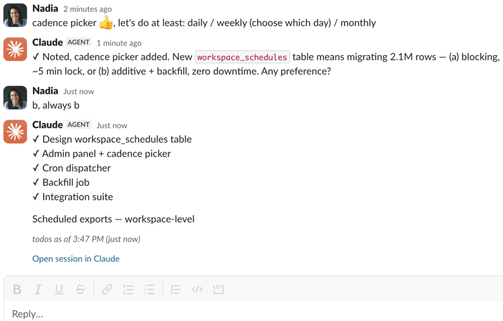
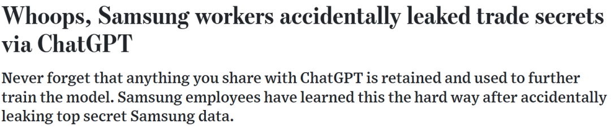
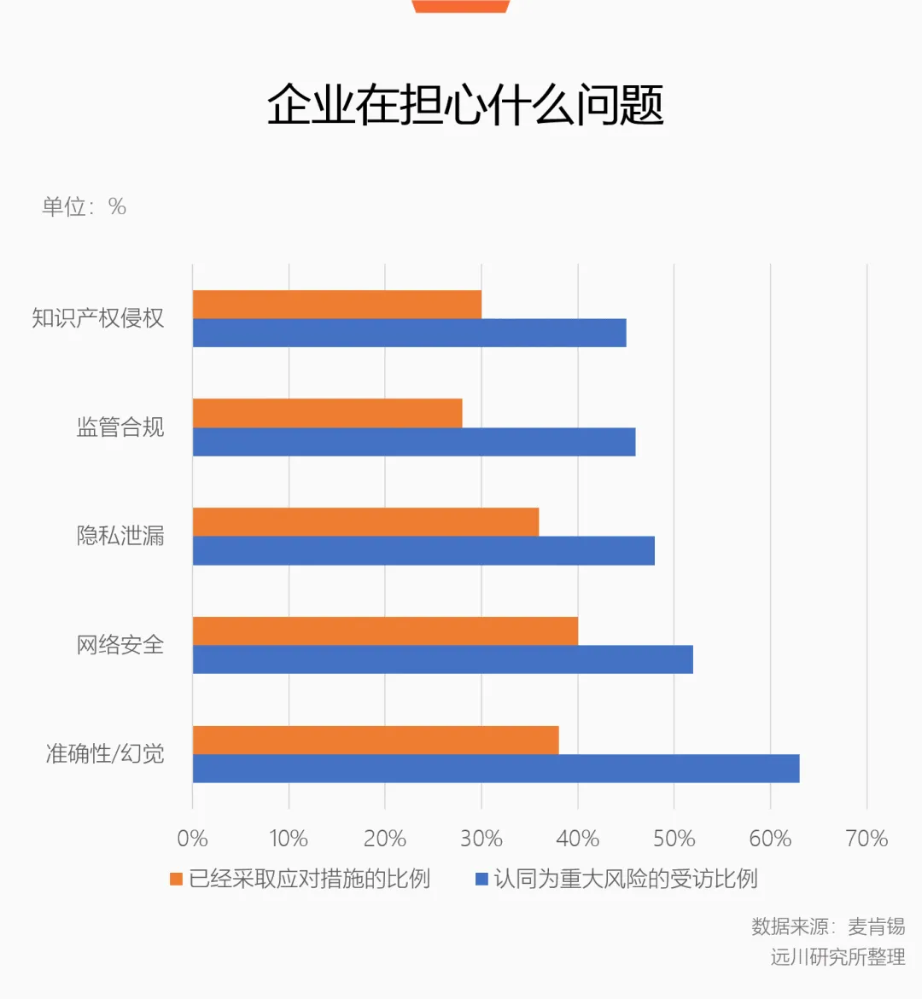
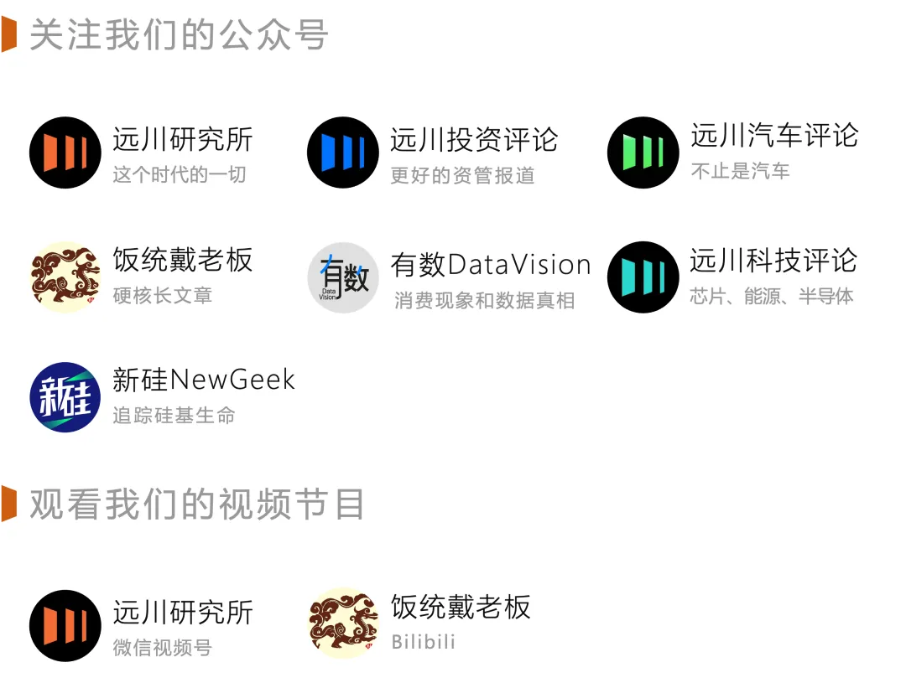

  
  

编程之后，人工智能下一个万亿美元的市场在哪里？产业界已经形成了共识：**企业级Agent** 。

  

二季度的财报会上，亚马逊CEO Andy Jassy提了一个“需求杠铃”理论：

  

杠铃一端是Anthropic和OpenAI正在疯狂消耗算力，另一端是企业的业务自动化、反欺诈、智能客服打骚扰电话这些推理场景。位于中间的“企业工作流程”，Agent渗透率偏低，算力需求尚未释放。

  

前沿的大模型公司全世界也就十几家，各行各业的企业成百上千万，企业的生产场景比纯粹的编程规模大得多。因此Andy Jassy判断，亚马逊的云服务会成为万亿美元收入的业务。

  

作为出租算力的云服务商，亚马逊的言论自然有屁股决定脑袋的因素，但Andy Jassy的杠铃理论，也反映了当下Agent落地企业的现实：

  

一方面，AI对生产力的极大解放是公认的事实。

  

Anthropic本月在威胁报告中表示，一名胡塞武装分子用开源自动驾驶软件手搓制导导弹算法，并让Claude分析发射失败原因，喜提封号。用Agent美美写周报的牛马就别自诩超级个体了，这才叫超级个体。

  

另一方面，企业对AI的认知和落地之间，似乎存在断层。

  

按照麦肯锡去年的报告，在有意愿推动规模化落地的企业中，应用也局限在1-2个职能领域。今年Agent的火越烧越旺，但德勤对3235个企业的调研中发现，只有21%的组织拥有成熟的Agrnt系统，且“大多仍是单点的、孤立的”。

  

问题肯定不是出在态度上。Sam Altman表演了这么多次眩晕瘫坐，再保守的企业应该也跟着入戏了。除了少数秉持“不能让员工自己花钱买吗？”的老板，大部分企业家对AI可谓既有意愿，也有预算。

  

但目前来看，Agent定位更接近员工使用的“个人工具”，离真正的企业“生产负载”尚且遥远。员工付费上班和公司财务亲自开发票，是规模完全不同的市场。

  

默默藏起天道酬勤牌匾，天天把转型挂在嘴边的老板们，你们到底在等什么？

  

  

  

##### 01.模型很聪明，同事很陌生

  

  

  

2024年底，微软CEO纳德拉接受访谈发表了一番暴论：SaaS服务的概念可能会在Agent时代崩溃，它们本质上就是带有业务逻辑的CRUD数据库。经过媒体添油加醋，被解读为SaaS药丸。

  

纳德拉话音未落，一个名叫Marc Benioff的人坐不住了。Marc Benioff是谁？顶级SaaS公司Salesforce的创始人，1999年创立Salesforce时喊的口号正是“软件已死”，结果被纳德拉洗稿用来判自己死刑，自然孰不可忍。

  

Marc Benioff，Salesforce的创始人

  

两人的唇枪舌剑，已经点出了企业级Agent落地的最大难题之一：**上下文** 。

  

上下文是什么？即工作中具体的“语境”。

  

假设一个员工入职企业五年，他就积攒了公司整整五年的上下文，包括但不限于之前做过的所有项目，积累的经验和Knowhow，部门内部的黑话，哪个领导喜欢爹味教育，哪个领导喜欢对员工随地大小声等等。

  

我们在组织里交流和协同，隐含的前提就是对上下文的理解，Agent第一天来公司打工，部门的人都没认全，必须依赖人类输入足够多的上下文，变成公司里的老油条，才能准确的执行任务。

  

事实也是如此，会议纪要、文档搜索、日报周报等场景为什么是当前 Agent 的主战场？因为它们的上下文最薄，薄到只需要文档和对话。既不用碰核心系统、也不需要打通口径、更用不着跨部门权限。

  

因此，企业级Agent好不好用，关键落在了对上下文的理解。

  

于是到了今年，两人双双改口。纳德拉释放复活术，表示SaaS不会死，但商业模式需要重构。Marc Benioff亲自宣布开放API接口，面向Agent友好。毕竟上下文都在SaaS软件里，两者唇亡齿寒。

  

今年的SaaS Mag峰会上，Snowflake CEO Sridhar Ramaswamy就对“SaaS已死”的叙事表示看不下去：

  

“模型不带来任何竞争优势，因为竞争对手能买到同样的；你的专有数据才创造真正的优势。”

  

越来越多的人已经意识到，SaaS软件在Agent时代扮演的角色，比想象中重要得多。

  

  

  

##### 02.谁批准它进群的

  

  

  

今年6月，到处散播AI恐慌的Anthropic忙里偷闲，发布了一个名为**Claude Tag** 的产品。

  

简单来说，Claude Tag可以接入企业的Slack频道，员工只需要在文档和聊天中@Claude，就能狠狠奴役AI替自己干活。就算员工没有指派任务，Claude Tag也是个眼里有活的赛级牛马，会自己根据会议和聊天记录找活干。

  

Anthropic发布Claude Tag

  

之后，美国市场涌现出非常多AI Coworker概念的产品，特点是把Agent集成进企业协作场景，可以像普通员工一样和人类一起干活，加班到忘我。

  

按照Anthropic的说法，公司产品团队65%的代码由Claude Tag完成，工作也逐渐从Claude Code向Claude Tag迁移。

  

Claude Tag的发布很低调，但在业内引发的反响不小。AlexNet三人组之一的Andrej Karpathy第一时间献上彩虹屁，表示Claude Tag让AI产品交互进入了第三个阶段：**AI Co-worker** 。

  

Claude在公司群里找活干

  

Claude Tag的开创性在于，把**个人-Agent** 的1V1交互变成了**组织-Agent** ，Agent调用的上下文规模从“个人”变成了“组织”，人和Agent可以像同事一样协作。

  

飞书之前发布的@Agent 进群、Agent之间互相协作等功能，也是类似范式在产品上的落地：把AI嵌入真实工作场景，Agent从纯粹的助理变成同事，打通所有上下文，降低沟通产生的摩擦成本。

  

这种**“Agent+容器”** 的架构，成为当下企业级Agent的主流范式。办公软件和SaaS工具扮演的就是“容器”的角色，解决了两个问题：

  

**一是可靠性。** 企业对可靠性的要求与个人不可同日而语。最典型的是数据安全。2023年4月ChatGPT问世不久，三星电子的AI潮人就整了三次大活，都是工作中非常典型的场景：

  

员工A把有问题的原始代码复制到ChatGPT，请AI把把关。员工B把提高生产良率的源代码输入到ChatGPT，要求AI帮忙优化。员工C把会议录音转换成速记稿，要求ChatGPT制作会议纪要。

  

三星内部泄密事件惨遭媒体嘲笑

  

数据是所有制造业企业严防死守的机密，你愿意开展一场壮士断腕的变革，公司风控和法务部门未必敢拿饭碗陪你玩命。SaaS软件的可靠性都经历了十多年的考验，天然适合当上下文的容器。

  

**  
**

**二是Agent的原生支持能力。**

**  
**

人用的东西和机器用的东西是两个物种，SaaS软件的按钮、菜单、视图在过去十几年里完美匹配了人的交互习惯，但Agent需要结构化、可调用验证的接口。因此，企业级产品既要符合人的直觉，也要符合AI调用的习惯。

  

两者结合，等于把产品架构重写，需要大量适配工作。

  

国内的SaaS产品里，飞书一直是对Agent适配最激进、也最友好的平台，年初龙虾热席卷中国，飞书短时间内开源迭代了上百项对Agent开放的新功能，让Agent能熟练操作。

  

直到今天，飞书CLI在Github平台上的Star数量依然是企业微信的约5.6倍、钉钉的约5.9倍。

  

国内社交媒体上，有一堆Agent接入飞书的教程，原因就是沉淀在飞书里沉淀的上下文和完善的交互。给Agent一堆打卡数据，蒸不出什么好东西；没有完善的交互，Agent的使用门槛降不下来。

  

换句话说，AI办公大战，打的是一个Agent-模型-协作工具怎么做好配合的仗。

  

  

  

##### 03.文件传输助手不叫数字化

  

  

  

Claude Tag打开了企业级Agent的想象空间，顺便给被判死刑的SaaS公司翻了案，但中国的SaaS公司暂时还笑不出来。

  

过去十几年里，SaaS这个产业在中国一直躺在重症监护室，是个人都能指出国内SaaS软件面前的三座大山：企业认为软件没用；定制化需求多且杂；企业付费意愿不足，公司无法积累利润投入研发。

  

目前，大部分企业的内部沟通和文档传递靠的还是微信，虽然会遇到国庆假期一过，所有文件全部失效又不好意思再要一次问题，但不可否认，这是中国公司用脚投票投出来的结果。

  

SaaS产业繁荣与否，直接挂钩产业界的数字化水平。

  

过去几年，智能化的妖风吹遍产业界，各路英雄好汉打着转型的旗号大干一场，发现自己在智能化的前置工作——数字化上的欠账实在太多。

  

数据是一切智能的基石，数据存在服务器里还是A4纸上，直接决定了企业的数字化水平，把组织和业务流程搬到线上的数字化建设，在产业界满打满算也没几年。

  

到了Agent时代，这个问题的重要性越来越明显。

  

德勤在报告中明确指出，组织的上下文沉淀在ERP系统里、业务逻辑在ABAP代码和员工的日常沟通里，Agent理解一家企业的知识，本身就是一个大工程。

  

由此又衍生出一个新问题：**能被Agent调用的数据才有价值。**

**  
**

Agent能多大程度提高企业运转效率，取决于Agent对企业生产流程的参与度，能调度多少数据构成的组织上下文。

  

这个问题不解决，Agent就进不去核心生产场景，相当于招了顶级研究员，但不给人配门禁卡，连个工位也没有。

  

如果一家企业只积累了大量打卡数据，Agent就只能帮人事部门狠抓考勤。如果企业的知识库里全是领导讲话，肯定能蒸馏出一个DeepLeaderV4，能不能转化成利润就未必了。

  

AI时代的企业办公赛道，似乎又回到了那个中国SaaS公司思考了几十年的问题：**企业到底需要什么样的工具？**

**  
**

**  
**

**  
**

##### 04.你什么家底

  

  

  

想把Agent用好，首先需要一个“Agent友好”的工作环境。很多企业已经发现，Agent能否提效，和组织的工作习惯密切相关。

  

没有文档文化，蒸馏无从谈起。

  

国内几家互联网大厂，基本都有从模型-Agent-协作工具的完整生态。考虑到大厂对“入口”的谜之眷恋，Claude Tag+Slack这种形式注定不是主流，Agent-模型-协作工具一家通吃，才是大厂们的目标。

  

这个时候，各家大厂扮演容器的协作工具有没有让企业形成足够的数字化水平，就至关重要。

  

理想状态下，组织里的每个员工都应该有意识的归集上下文，但这种反人性的手段既不现实，也不可能实现。因此，企业内部大量的隐性知识，呈现碎片化的分布。

  

文档文化这件事，很难靠员工自发，更多以来工具倒逼。**办公软件所定义的工作方式，会极大影响企业的工作习惯，继而影响当下的“Agent友好度”。**

**  
**

所以，AI办公大战的各路参战方看似在同一条起跑线，其实攒下的家底完全不同。经历了当年的远程办公大战，产业界基本形成了一种共识：**飞书****积累了最适合Agent落地的工作习惯。**

**  
**

2019年飞书向外界推出，数字化和智能化是企业转型的热门词汇，也影响了飞书的设计理念。飞书的产品逻辑是All in one，即所有功能集成进一个产品，文档，表格，日历，日程完全打通。

  

从当下的视角看，这是一种非常超前的Agent友好设计。如果聊天一个软件、文档一个软件、会议一个软件，Agent还要逐个建立连接。

  

同时，飞书推崇的云文档、多维表格、智能纪要等功能，也把“积累上下文”这个动作融入了员工的日常工作，上下文能自动积累。

  

办公软件有多少日活并不重要，毕竟打仗不是六十万对八十万比谁人多；它主要用来打卡还是用来写文档，这才是关键。而且日活是可以买的，文档是演不出来的。

  

举例来说，飞书狂推的多维表格，底层其实是基于公司业务的关系型数据库，自动归集了碎片化的数据，表和表之间相互关联，天然适配Agent的调用。

  

字节今年8月迅速整合产品，打通飞书和豆包工作，就是把豆包工作的Agent能力接入飞书AI Native的工作习惯，组合成一套企业级Agent体系。

  

对当下的中国企业来说，当年SaaS公司面对的认知不足、要求太多、不想花钱三座大山基本都被AI FOMO铲平，只是这一次，千万不要再输在没有文档文化上了。

  

  

  

##### 05.说话的方式简单点

  

  

  

办公协同作为企业最基础的需求，一直是企业组织的核心应用，但每一次技术变革中，协同方式都会被重新创造。

  

微软的Office诞生时，其进步性在于把A4纸上的文档原封不动的呈现在屏幕上，把表格里大量枯燥繁琐的运算交由计算机运行，提高了商业世界的信息化密度。

  

移动互联网时代，员工用手机看文档，用IM工具沟通，在线协作成为可能，Google Docs取而代之。Saleforce用277亿美元天价收购的Slack，原因是美国年轻人在走向工作岗位之前，Facebook和WhatsApp已经嵌入他们的生活方式。

  

办公协作软件的进化史，就是一部沟通渠道不断打通、摩擦成本不断降低的历史。

  

人工智能打开了Agentic AI的想象空间，但它的底色依然是沟通渠道越来越顺畅，摩擦成本越来越低，信息传递效率越来越高，个体的创造力被进一步激发。

  

时至今日，上汽集团、星巴克、古茗等企业，正在基于AI新标准转向飞书，沃尔玛、正大天晴、海信等各行业头部企业，开始选择飞书作为核心协同平台。

  

AI时代，离AI最近的一批中国公司，正在用脚投票。

  

  

全文完，感谢您的耐心阅读。

  

  

参考资料

\[1\] The State of AI 2025，麦肯锡

\[2\] Scaling Agentic AI to realize business value，德勤

\[3\] 胡塞武装被曝用Claude Code替代工程师开发导弹，Anthropic：已封相关账户，华尔街见闻

\[4\] SaaS Applications “Will Collapse” In The AI Agent Era: Microsoft CEO Satya Nadella，S&P Global

  

作者：李墨天

编辑：戴老板

责任编辑：李墨天

  

