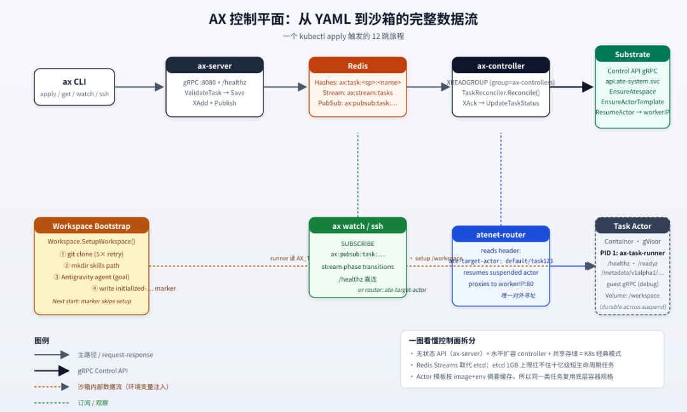
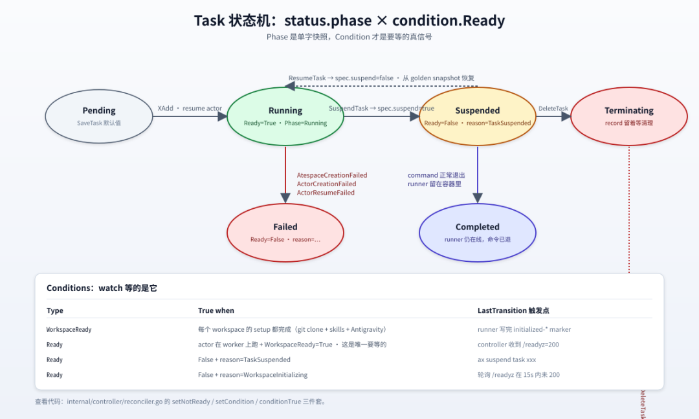
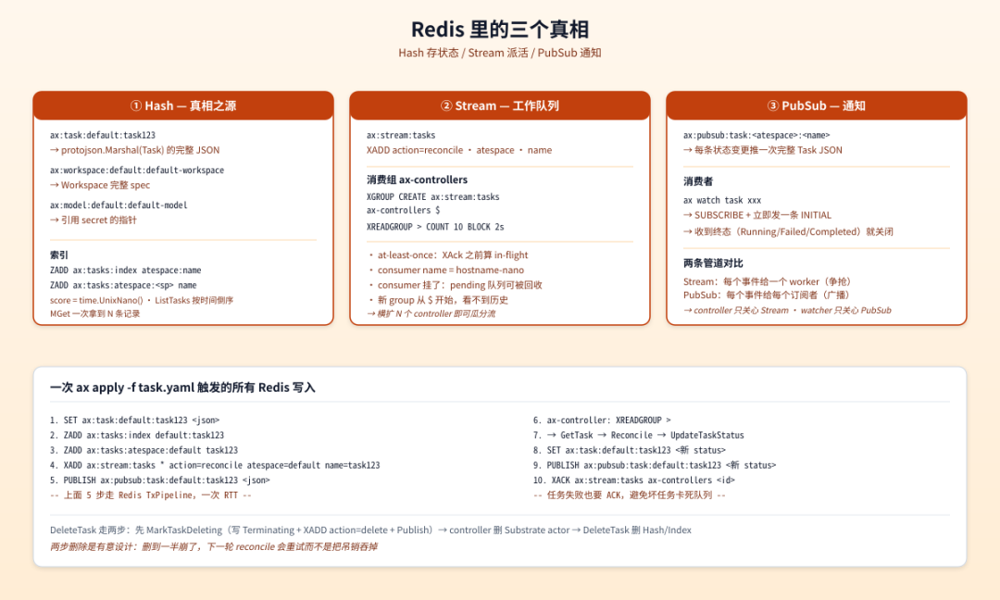
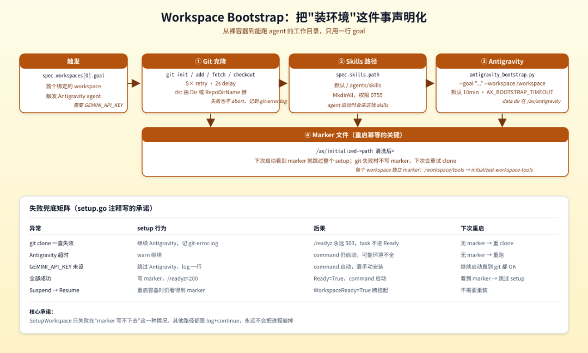
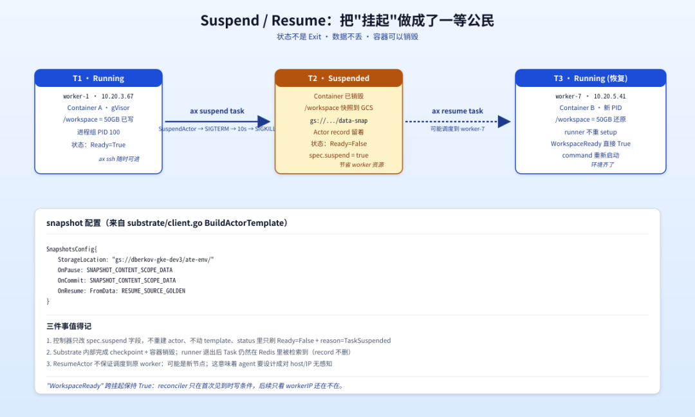
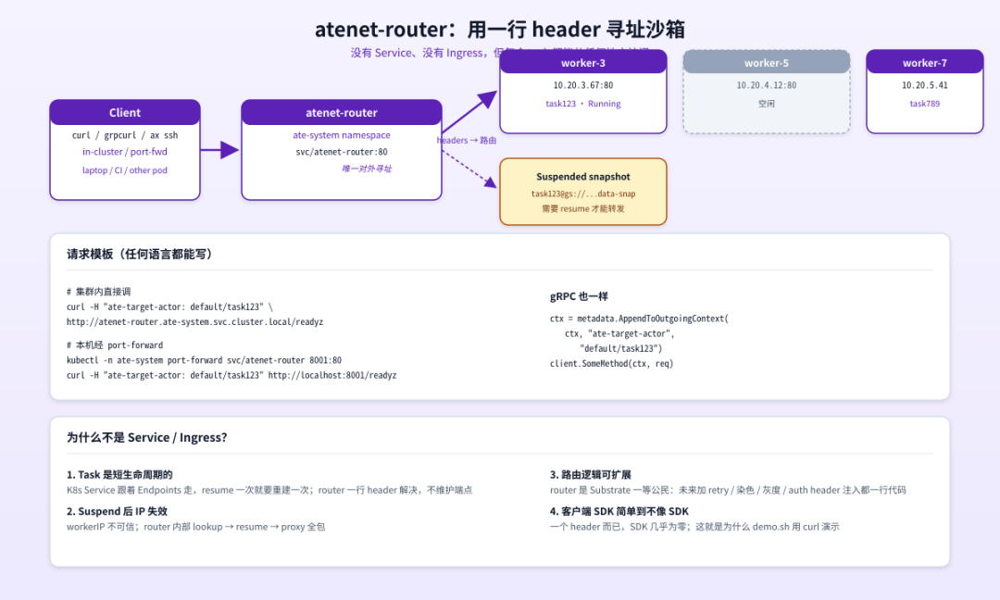
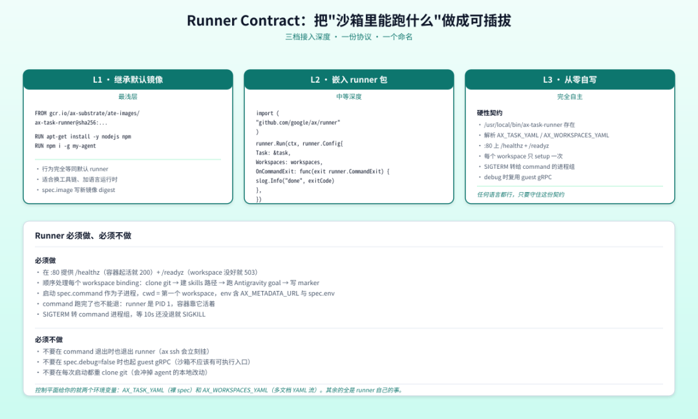

# 深入解析 google/ax：当 Agent 变成 Kubernetes 的一等公民

如果你用过 Kubernetes，那你大概会被 `google/ax` 的 README 钩住——它开篇就写：

>  *"AX is a high-throughput, declarative orchestrator to run* *billions* *of autonomous agent workloads in a cluster. If you have used Kubernetes,` ax` will feel similar."*

「和 K8s 用起来差不多」「十亿级 agent 任务」——这是 Google 在 2026 年交出的、关于"agent 怎么跑在集群上"的答案。我把它从 README 到 `internal/controller/reconciler.go` 啃了一遍，发现它的内核远不止一句"sandbox it and wire it up"，而是一套围绕三类新对象（Task / Workspace / Model）+ 三种存储介质（Hash / Stream / PubSub）+ 一个外置沙箱层（Agent Substrate）+ 三个外围动词（`apply`、`watch`、`ssh`）搭出来的完整编排栈。

这篇文章想带着你，从一个 `ax apply -f task.yaml` 开始，沿着控制平面的代码走一圈，把这个仓库的几个关键设计讲清楚。

## 一、先问一个更基本的问题：为什么 K8s 不够

AX 的设计文档 `DESIGN.md` 开头就把矛盾摆出来了：

>  *Storing millions of short-lived tasks as Kubernetes CRDs pushes etcd past its comfort zone \(single-digit GB storage limits, write-rate bottlenecks, control plane degradation\). AX keeps its state in Redis and uses Redis Streams as the work queue between the API server and a horizontally scaled pool of controllers.*

这是全文最重要的一行——它解释了**为什么 AX 是一个新东西，而不是 K8s 上的 operator** 。

K8s 的核心约束在 etcd：单 GB 量级的存储上限、有限的写吞吐、以及"控制平面退化"的危险曲线。当你的 workload 是几百个长跑的 Deployment 时这没问题；但当 workload 是**几十万到几百万** 个"几分钟就结束、还要立刻 Suspend/Resume"的 agent 沙箱时，etcd 很快就成了瓶颈。

所以 AX 走的是 K8s 的另一面：

  * **API 还是熟悉的` ax apply / get / describe / watch / delete`**（CLI 名字故意撞 kubectl，README 第二段第一句就是 "deliberately `kubectl`-shaped"）；

  * **存储换成 Redis** （Hash 存状态、Stream 派活、PubSub 通知——下文图 3 会拆）；

  * **沙箱外置成 Agent Substrate** （AX 自己不实现 sandbox，而是把这一层下放给 substrate；这是它和 Temporal / Flyte / Argo Workflows 最大的不同）。  

理解了"为什么"，后面"怎么做的"就顺了。

## 二、三类对象 + 三个动词：最小可学的声明模型

AX 的全部资源类型就三种——`Task`、`Workspace`、`Model`。`docs/concepts.md` 把它们各自的角色讲得很直白：

你想做什么| AX 给你的原语  
---|---  
把不信任的 agent 代码塞进有 CPU/内存上限的沙箱跑| **`Task`**  
预先把 git 仓库、MCP server、skills 包接好，让 agent 启动就"温热"| **`Workspace`**  
决定 LLM 用谁、温度怎么调、密钥从哪个 Kubernetes Secret 来| **`Model`**  
把闲置的 agent 暂停，下次接着干| `ax suspend` / `ax resume`  
进正在跑的 sandbox 看 agent 在干嘛| `ax ssh`  
  
一句话总结：**Task = 隔离的执行单元，Workspace = 预热的环境，Model = 集中的 LLM 配置** 。

这个拆分的好处是"分层很纯"：换 LLM 不动任务、加 skills 不动沙箱、挂起恢复不影响环境配置。下面这个完整 manifest 是 `examples/task.yaml` 给的模板：

  *   *   *   *   *   *   *   *   *   *   *   *   *   *   *   *   *   *   *   *   *   *   *   *   *   *   *   *   *   *   *   *   * 

    
    
    apiVersion: ax.io/v1alpha1kind: Taskmetadata:  name: task123  atespace: defaultspec:  env: [{ name: ENVIRONMENT, value: "test" }]  image: "gcr.io/.../ax-task-runner@sha256:..."  resources: { requests: {cpu: 500m, memory: 1Gi}, limits: {cpu: 2, memory: 4Gi} }  workspaces:    - name: default-workspace      path: "/workspace"  debug: true---apiVersion: ax.io/v1alpha1kind: Workspacemetadata: { name: default-workspace, atespace: default }spec:  git: [{ name: origin, repo: "https://github.com/chalk/chalk.git", branch: "main" }]  mcp:    registries: [{ provider: google, query: "mcp.tags:build" }]    servers: [{ name: git-tools, endpoint: "http://git-mcp.default.svc.cluster.local:8080" }]  skills:    registries: [{ provider: google, query: "skills.tags:nodejs" }]    path: "/.agents/skills"---apiVersion: ax.io/v1alpha1kind: Modelmetadata: { name: default-model, atespace: default }spec:  provider: google  model: gemini-3.8-flash  secretKey: { name: gemini-api-secret, key: GEMINI_API_KEY }

  

看完这份 YAML 你已经会用 AX 一半了。三个 kind 之间的关系是：Task 通过 `spec.workspaces[]` 引用一个或多个 Workspace，第一个 workspace 同时是 command 的工作目录；Task 在 spec 上不直接引 Model——模型被 controller 用来"做事"（比如让 Antigravity 去 bootstrap 一个 workspace）。

`docs/manifests.md` 里有一个细节很值得记：**workspace 可以挂多个** ：

  *   *   *   *   *   * 

    
    
    spec:  workspaces:    - name: my-service          # /workspace/my-service，command 的 cwd      goal: "Install deps and run tests"    - name: team-tools      path: "/workspace/tools"  # 显式 mount path

  

每一个 entry 在自己独立的路径下 setup、独立绑定，独立 ready。`status.conditions[WorkspaceReady]` 在**所有** workspace 都好了之后才会变 True。这就是"挂多个 workspace" 不是 join，是 fan-out。

## 三、Task 状态机：phase 是一句话，condition 才是要等的

AX 的 lifecycle 设计是这篇文章我最想聊的一块，因为它写得很"细想才觉得对"。

每个 Task 有 `status.phase` 和 `status.conditions[]` 两层信息。`docs/concepts.md` 给了一张对照表：

Condition| True when  
---|---  
`WorkspaceReady`| 每个 workspace 都 setup 完了。**之后一直 True**  
` Ready`| actor 在跑 **且**` WorkspaceReady=True`。这是你要等的唯一一个  
  
phase 是单字快照——`Running` / `Suspended` / `Failed` / `Terminating`——用来在 `ax get tasks` 列表里一眼看懂。condition 才是 `ax watch` 流式跟踪的真信号。

为什么会这样分两层？看 `internal/controller/reconciler.go` 的核心循环就明白——phase 是状态机的"现在几点"，condition 是"为什么是这个点"。`Ready=True` 要等 workspace setup 完，要等 actor resume 成功，要等 `/readyz` 探针返回 200。这些步骤任何一步失败都会让 `Ready=False` 但带不同的 `reason`：`AtespaceCreationFailed`、`ActorCreationFailed`、`ActorResumeFailed`、`WorkspaceInitializing`。

更精巧的是 `WorkspaceReady` 的"一次性"：setup 一次成功后，**就** 一直 True，跨 suspend/resume 也保持。`reconciler.go` 里 `conditionTrue(task, condWorkspaceReady)` 检查这一条，命中就直接跳过 polling。下次任务从 Suspended 拉起来时，runner 看到 `/ax/initialized-*` marker，立刻返回 200。这就是"省 10 分钟 bootstrap 时间"的关键。

`suspend`/`resume`/`delete` 的转移关系我也画在了图里。值得特别说的一点是 `delete`：

>  *Deletion is two-phase: mark the task Terminating and let the controller tear down the actor before the record is removed. Clients poll GetTask for NotFound.* （`internal/server/server.go` 注释）

也就是 `ax delete` 是非阻塞的：它只把 phase 改成 Terminating、推一个 `action=delete` 事件、然后立即返回。真正删 Substrate actor 是 controller 下一轮 reconcile 的事。所以你的 client 代码正确的等待方式是循环 `ax get task xxx`，看到 NotFound 就算删完了。

## 四、Redis 里的三个真相：Hash / Stream / PubSub

我前面说 AX 用 Redis 不只是"换个 KV"——它是把 Redis 的三种数据结构各自用到了极致。

### Hash——状态之源

每次 `SaveTask` 都往 `ax:task:<atespace>:<name>` 这个 key 写完整的 `protojson.Marshal(Task)`，同时写两个 ZSET 索引：`ax:tasks:index`（全局，按 atespace:name）和 `ax:tasks:atespace:<sp>`（按 atespace）。score 都是 `time.Now().UnixNano()`，所以 `ZREVRANGE` 就是"按时间倒序"，天然就是 `ax get tasks` 的列表语义。

`ListTasks` 实现有个细节值得注意（`internal/store/redis/store.go`）：

  *   *   *   *   * 

    
    
    names, _ := s.client.ZRevRange(ctx, s.taskAtespaceIndexKey(atespace), start, stop).Result()for _, n := range names {    members = append(members, fmt.Sprintf("%s:%s", atespace, n))}// ... 然后拿 member 去 MGet 一次拿全部

  

也就是先从索引拿到 name 列表，再 MGet 一次拿到 N 条完整 Task。这种"两步走"避免了 SCAN 的 O\(N\) 复杂度，是 Redis 里 list-then-batch 的标准做法。

### Stream——工作队列

任务事件走 `ax:stream:tasks` 这条 stream，消费组叫 `ax-controllers`。看一下 `Subscribe` 的实现：

  * 

    
    
    err := s.client.XGroupCreateMkStream(ctx, s.opts.StreamName, group, "$").Err()

`$` 是关键——新 group 从 stream 的尾部开始，看不到任何历史事件。这避免了"上线一个 controller 就把 100 万历史任务全 reconcile 一遍"的灾难。consumer name 用 `hostname-<unixnano 末四位>` 生成，保证唯一但不暴露具体时间。

worker 端 \(`internal/controller/worker.go`\) 的 `Run` 循环非常 K8s-ish：

  *   *   *   *   *   *   *   * 

    
    
    for {    ev, err := sub.Next(ctx)         // XREADGROUP > BLOCK 2s    if err != nil { /* 重试 */ }    if err := w.processEvent(ctx, ev); err != nil {        slog.Error(...)              // 错误也要 Ack    }    if err := sub.Ack(ctx, ev); err != nil { ... }}

  

注释里那句"every event is acknowledged after processing, even when reconciliation fails"是金句：一个坏任务绝不能把队列卡死。这就是为什么 `Reconcile` 失败时只 `slog.Error`，然后照样 XAck。

`processEvent` 的两个分支也值得拆：`action=delete` 走两阶段删除（删 Substrate actor → `DeleteTask` 删 Hash）；其他都走 `Reconcile`。`reconcile` 之前会先去 store 里**按声明顺序** 把绑定的 workspace 全部 fetch 一遍，没找到的跳过，让 runner 用空目录兜底——这样 workspace 还没创建时 task 也能先起来。

### PubSub——通知

`WatchTask` 走另一条管道：`SUBSCRIBE ax:pubsub:task:<atespace>:<name>`。每次 `SaveTask` 或 `UpdateTaskStatus` 都会往这个 channel 推一份完整 JSON。`server.go` 的 `WatchTask` 实现是 server-streaming gRPC：

  *   *   *   *   *   *   *   *   *   *   *   * 

    
    
    if initial, err := s.store.GetTask(...); err == nil {    stream.Send(&WatchTaskResponse{Task: initial, Action: "INITIAL"})}for {    select {    case <-ctx.Done(): return ctx.Err()    case task, ok := <-ch:        if task.Status.Phase == "Running" || "Failed" || "Completed" {            return nil        }    }}

  

注意最后那个"收到终态就关流"的细节：`ax watch` 的体验就是"创建 → Running/失败/完成 → 自动退出"，不会一直挂着等下一次变更。这种"事件源 + 终态断流"的设计，省掉了 client 端一堆状态机代码。

Stream 派活、PubSub 广播——两种管道各司其职，控制平面非常 K8s。

## 五、Workspace Bootstrap：把"装环境"这件事声明化

Workspace 是 AX 最不像 K8s 的部分。它要解决的问题是：**agent 启动时的"前置工作"是声明性的** 。

什么叫声明性？看一下 `internal/workspace/setup.go` 的核心函数 `SetupWorkspace`，它在 runner 的 PID 1 阶段被调用：

  *   *   *   *   *   *   *   *   * 

    
    
    func SetupWorkspace(ctx context.Context, ws *v1alpha1.Workspace, targetPath, goal string) (*SetupResult, error) {    markerPath := filepath.Join(AXDir, MarkerName(targetPath))    if _, err := os.Stat(markerPath); err == nil {        return res, nil          // 已经初始化过，跳过整个 setup    }    // ... 1. git clone; 2. mkdir skills path; 3. 跑 Antigravity agent    if !gitOK { return res, nil } // git 失败不写 marker，下次重试    writeMarker(markerPath, ws)}

  

读这段代码你会发现几个聪明的地方：

**第一，marker 文件是"幂等性的核心"。** 它放在 `/ax/initialized-<path>`——注意路径是被清洗过的（`strings.Trim(filepath.Clean(path), "/")` 加 `/` 替换成 `-`），所以 `/workspace/tools` 和 `/workspace/` 永远不会冲突。这个 marker 让 suspend/resume 不需要重装环境——这点至关重要：

>  *Resume restarts the container, and re-cloning into a restored workspace would destroy the agent's state.* （`docs/runner.md`）

**第二，Antigravity bootstrap 是可选的。** 你可以不给 goal，runner 就跳过；可以没装 `antigravity_bootstrap.py`，runner 也跳过；可以没 `GEMINI_API_KEY`，runner 还跳过。每一种跳过都有明确的 log，但都不会让 setup 失败。这是 setup.go 注释里反复强调的设计哲学：

>  *Workspace setup failures are logged but do not abort the run; the task simply never reports ready.*

也就是说：宁可让 task 永远进不了 Ready，也不让 setup 的失败把进程崩掉。这就是"声明环境"的代价控制——你只能通过 `Ready=False + reason=WorkspaceInitializing` 看出来，但绝不会看到 `runner crashed`。

**第三，git 失败的处理是"记日志 + 不写 marker"。** 这样下次启动会自动重试 clone，但已经在的 Antigravity 工作、skills 目录不会被冲掉。`retry(ctx, 5, 2*time.Second, ...)` 给 git 一个合理的"网络抖动容忍"窗口——5 次重试，每次间隔 2s，总共 10s，足够跨过大部分偶发的网络故障。

## 六、Runner：沙箱里那个不能停的 PID 1

每个 Task container 的 PID 1 是 `ax-task-runner`。`docs/runner.md` 把它的契约写得非常严格，我把它翻译成"必须做 / 必须不做"两条清单：

**必须做** \- `:80` 上提供 `/healthz`（容器起活就 200）+ `/readyz`（workspace 没好就 503） - 顺序处理每个 workspace binding：clone git → 建 skills 路径 → 跑 Antigravity goal → 写 marker - 启动 `spec.command` 作为子进程，cwd = 第一个 workspace，env 含 `AX_METADATA_URL` 与 `spec.env` \- **command 跑完了也不能退** ：runner 是 PID 1，容器靠它活着 - SIGTERM 转 command 进程组，等 10s 还没退就 SIGKILL

**必须不做** \- 不要在 command 退出时也退出 runner（`ax ssh` 会立刻挂） - 不要在 `spec.debug=false` 时也起 guest gRPC（沙箱不应该有可执行入口） - 不要在每次启动都重 clone git（会冲掉 agent 的本地改动）

`runner.Run()` 的实现在 `runner/runner.go`，核心 70 行不到：

  *   *   *   *   *   *   *   *   *   *   *   *   *   *   * 

    
    
    metaServer := metadata.NewServer(port, cfg.Task, workspaces, ...)if err := metaServer.Start(); err != nil { return err }defer metaServer.Stop(...)ready := truefor _, m := range mounts {    if _, err := workspace.SetupWorkspace(ctx, m.ws, m.path, m.ref.GetGoal()); err != nil {        slog.Error("workspace maiden run setup failed", ...)        ready = false    }}if ready { metaServer.SetWorkspaceReady(true) }cmd := exec.Command(cmdArgs[0], cmdArgs[1:]...)cmd.Dir = wsPathcmd.SysProcAttr = &syscall.SysProcAttr{Setpgid: true}cmd.Start()

  

注意三件事：

  1. `Setpgid: true` 让 command 拥有自己的进程组——这是后面 SIGTERM/SIGKILL 能"一锅端"的前提。
  2. Setup 失败是 log+continue不是 return error。runner 一定会进入"等 command 起来"的阶段，但 `/readyz` 会一直 503。
  3. defer Stop 在最外层——只有当 runner 整个退出时才会关掉 metadata server。command 退出了 runner 还在跑，metadata server 还在跑，`ax ssh` 就能继续用。  

`stopCommand` 的两阶段信号：

  *   *   *   *   *   *   * 

    
    
    _ = syscall.Kill(-pid, syscall.SIGTERM)  // 负号 = 进程组select {case err := <-exited: return errcase <-timer.C:                           // 10s grace    _ = syscall.Kill(-pid, syscall.SIGKILL)    return <-exited}

  

这是 K8s 里 pod terminationGracePeriodSeconds 的同款思路：先礼貌请退，再强制杀掉。

## 七、Suspend/Resume：把"挂起"做成了一等公民

如果让我举一个"AX 是 agent workload 的 K8s"的最好例子，我会举 suspend/resume。

普通的 web 服务挂了，K8s 不会保留什么；agent 任务挂了，结果丢了一半，这是不能接受的。AX 的 suspend/resume 设计是把 Substrate 的 snapshot 能力用满：

`snapshots_config` 在 `substrate/client.go BuildActorTemplate` 里写得很清楚：

  *   *   *   *   *   * 

    
    
    SnapshotsConfig: &ateapipb.SnapshotsConfig{    StorageLocation: "gs://dberkov-gke-dev3/ate-env/",    OnPause:         SNAPSHOT_CONTENT_SCOPE_DATA,    OnCommit:        SNAPSHOT_CONTENT_SCOPE_DATA,    OnResume:        &OnResumeConfig{FromData: RESUME_SOURCE_GOLDEN},},

`SCOPE_DATA` 的意思是只快照 data volume（也就是 `/workspace`），不动容器文件系统本身——这是 K8s 里 PV 快照的同款思路。`OnResume: FromData: RESUME_SOURCE_GOLDEN` 告诉 Substrate："resume 时从 golden snapshot 重建容器 + 从 data snapshot 还原 /workspace"。

reconciler 端的代码（`internal/controller/reconciler.go`）逻辑非常干净：

  *   *   *   *   *   *   *   *   * 

    
    
    if task.Spec.Suspend {    r.client.SuspendActor(ctx, atespace, actorName)  // → Substrate 内部做 checkpoint    task.Status.WorkerIp = ""                         // IP 不可信了    task.Status.Phase = "Suspended"    r.setCondition(task, condReady, "False", "TaskSuspended", ...)    return nil}// 否则 resume_, workerIP, err := r.client.ResumeActor(ctx, atespace, actorName)

  

注意 `task.Status.WorkerIp = ""` 这一行——这是关键。resume 之后 workerIP 可能是新的（也可能 IP 不变），但 AX 不假设它不变。这背后的设计哲学值得记一下：

>  *Substrate does not promise to schedule the resumed actor on the same worker.* ——所以 agent 框架不能依赖 host/IP 寻址，要走 atenet-router（下节）。

还有一个细节：`reconciler` 在 suspend 路径里**只** set 了 Ready condition，没动 WorkspaceReady——因为 WorkspaceReady 跨挂起保持 True。这就是 marker 文件的承诺兑现了：resume 之后 setup 不用重跑。

## 八、atenet-router：用一行 header 寻址沙箱

AX 没有给每个 Task 分配 K8s Service / Ingress——README 直接说"tasks do not get a Kubernetes Service or Ingress of their own"。所有访问都走 Substrate 的 **atenet-router** ：

它读一个 header：`ate-target-actor: <atespace>/<task>`。就这一个 header 就够了：

  * 路由器内部 lookup 到这个 actor 当前在哪个 worker

  * 如果 actor 是 suspended，先 resume 它

  * 然后 proxy 到 `workerIP:80`  

`docs/networking.md` 给的 in-cluster 调用模板：

  *   * 

    
    
    curl -H "ate-target-actor: default/task123" \  http://atenet-router.ate-system.svc.cluster.local/metadata/v1alpha1/ax/task

  

从本机访问要 port-forward：

  *   * 

    
    
    kubectl -n ate-system port-forward svc/atenet-router 8001:80curl -H "ate-target-actor: default/task123" http://localhost:8001/readyz

`internal/guest/client.go` 里 gRPC 客户端的写法也很简洁：

  *   *   *   *   * 

    
    
    grpc.WithChainUnaryInterceptor(func(ctx context.Context, method string, req, reply any,    cc *grpc.ClientConn, invoker grpc.UnaryInvoker, opts ...grpc.CallOption) error {    ctx = metadata.AppendToOutgoingContext(ctx, "ate-target-actor", targetActor)    return invoker(ctx, method, req, reply, cc, opts...)})

`ax ssh` 内部就是通过这个机制连到 actor 的 guest gRPC service，调 ProcessService.StartProcess + StreamProcessOutput 来跑你输入的命令。`spec.debug: true` 是 guest service 启用的开关——这一点 AX 做得非常克制：guest service 等同于"任意进程执行 + 文件读写"，必须 opt-in。

## 九、Runner Contract：沙箱可插拔的三个深度

`docs/runner.md` 给了一个特别清晰的"三档接入"模型：

**L1：继承默认镜像。** 适合换工具链、加语言运行时——只要 `FROM gcr.io/ax-substrate/ate-images/ax-task-runner@sha256:...` 再加你自己的 RUN 步骤。`/usr/local/bin/ax-task-runner` 还是原来的二进制，行为完全等同默认 runner。

**L2：嵌入 runner 包。** 适合想"用默认 lifecycle 但加一点自己的钩子"。直接 `import "github.com/google/ax/runner"` 然后：

  *   *   *   *   *   *   * 

    
    
    runner.Run(ctx, runner.Config{    Task:       &task,    Workspaces: workspaces,    OnCommandExit: func(exit runner.CommandExit) {        // 上传产物、调 webhook、发 metrics……    },})

`OnCommandExit` 是关键 hook——它让你在 command 退出后做事而不打断 runner 的"继续活着"语义。

**L3：从零自写。** 适合 agent 框架已经自己 supervise 进程的。最浅的契约就两条：

  1. /usr/local/bin/ax-task-runner 存在
  2. :80上提供 `/healthz` \+ `/readyz`  

剩下的（workspace 怎么 setup、命令怎么起、debug 时要不要起 guest gRPC）——全是你的事。任何语言都行。

控制平面给你的就两个环境变量：`AX_TASK_YAML`（裸 spec）和 `AX_WORKSPACES_YAML`（多文档 YAML 流）。设计文档里这句 "your image must contain an executable at `/usr/local/bin/ax-task-runner`, even if it is a symlink or a shell wrapper around something else" 透露了一个很优雅的妥协——你甚至可以写一个 shell wrapper 转发到另一个二进制上，runner 的协议层根本不在乎。

## 十、Model：让"用谁家模型"成为集中配置

最后说说 Model——它最容易被低估。`docs/concepts.md` 把它讲得很短，但浓缩：

>  *Declaring it as a resource is what makes it manageable across the cluster. The configuration lives in one place instead of in every agent's environment, so rotating a key, pinning a new model version, or tightening a parameter is one` ax apply` rather than a hunt through task definitions.*

集中化的好处是显然的——但更重要的是 AX 自己内部也在用 Model。看 `internal/workspace/planner.go`：

  *   *   *   *   *   *   *   *   *   *   *   * 

    
    
    func (p *Planner) PlanEnvironment(ctx context.Context, ws *v1alpha1.Workspace, goal string) (*EnvironmentPlan, error) {    prompt := fmt.Sprintf(        "Synthesize an environment bootstrap and toolchain plan for workspace %q with goal %q. ...",        wsName, goal, len(gitRepos), mcpConfig != nil,    )    resp, err := p.client.Generate(ctx, &model.GenerateRequest{        Model:             model.DefaultModel, // gemini-3.8-flash        Prompt:            prompt,        SystemInstruction: "You are the AX system workspace environment planner.",    })    ...}

  

也就是说"控制平面自己"也用 `default-model` 来做事——比如给 Antigravity bootstrap 准备 prompt。这种"控制面把自己当成一个普通消费者"的设计，让"换模型"的命令真的能改整个集群的行为，而不是只改用户的 task。

`internal/model/client.go` 的 `generateGoogle` 函数是直白的 HTTP 调用 Gemini API，但它的 fallback 设计很有意思：

  *   *   * 

    
    
    if c.cfg.DisableRemote || c.cfg.APIKey == "" {    return c.fallbackResponse(req), nil}

  

如果 API key 没设、或者显式 `disableRemote: true`，就返回一个合成的"成功响应"（标注了 synthesized）。这让 control plane 在没有外部网络/没有 secret 的开发环境也能跑——controller 不需要"硬失败"，它可以"软退化"。生产环境再开 secret。这是 K8s 里 "leader-elect 但单节点也能起" 的同款思路。

## 十一、写在最后：AX 给我们的几个思维钩子

读完整套源码之后，我想留几个让我印象最深的"思维钩子"——它们都是 Google 工程师在 AX 里做出的、我觉得有借鉴价值的设计决定：

**1\. "声明式"不等于"高级配置"。** AX 的 manifest 只有十几行核心字段，没有 workflow DSL、没有 DAG 表达、没有 trigger。任务能挂多个 workspace 但在 spec 里只是 list。`docs/concepts.md` 那句  *AX does not try to model that shape. It gives you one primitive that is cheap to create, isolate, suspend, and throw away* 是核心——agent 内部怎么编排是 agent 自己的事，AX 只管"怎么把一个 agent 跑在一个隔离的、可挂起的、有工作目录的进程里"。这种克制比堆功能难得多。

**2\. "setup 失败不能 crash" 是一个值得反复抄的设计原则。**` internal/workspace/setup.go` 把"绝不 crash"做成了事实标准：git 失败 log+continue，Antigravity 超时 log+continue，没有 API key log+continue；唯一真的"return error"的是 marker 文件写不下去。这种"明示一切失败路径"的小决定，比"happy path 跑得漂亮"重要十倍。

**3\. "失败也要 XAck"是分布式工作队列的第一原则。**` internal/controller/worker.go` 注释里那句  *every event is acknowledged after processing, even when reconciliation fails, so a bad task cannot wedge the queue* ——这是从 Kafka consumer commit 抄过来的金句。一个坏任务把整个控制器集群拖死，是新手最常踩的坑；AX 在第一版就把这个写死在了主循环里。

**4\. 用 marker 文件做幂等性，比想象中通用。**` /ax/initialized-<path>` 这种基于路径的 marker，把"suspend/resume 不重装环境"这件看着复杂的事，做成了一个 30 行的文件读写。它甚至还兼容 git 失败时不写 marker 的"重试语义"。比起 K8s 里复杂的 initContainer 状态机，简单到不真实。

**5\. "把命令的退出和 runner 的退出解耦"是 agent 沙箱的灵魂。** 普通进程的容器，进程退了就完了；agent 进程的容器，agent 退了还要留着让 `ax ssh` 进去看现场、看 artifact、看 metadata。runner 是 PID 1 永远不死，command 是它 supervise 的子进程——这种"分层寿命"的设计就是 AX 的全部魔法。

如果你是第一次看到 AX，我的建议是按这个顺序读源码：

  1. DESIGN.md（15 分钟理解全貌）
  2. examples/task.yaml \+ `docs/concepts.md`（30 分钟理解声明模型）
  3. internal/controller/reconciler.go（45 分钟理解 reconcile 循环）
  4. internal/workspace/setup.go（30 分钟理解 marker 的妙处）
  5. internal/store/redis/store.go（45 分钟理解三种数据结构各司其职）
  6. runner/runner.go \+ `docs/runner.md`（30 分钟理解 PID 1 的契约）  

整套下来大概三个半小时，你就能在脑子里把 `ax apply -f task.yaml` 之后发生的每一跳都画出来。然后你再看 `docs/roadmap.md`，会突然发现里面每一条（迁移到新 Actor API、setup actor 拆分、自动 idle suspend、SPIFFE 身份……）都是这套架构的"自然下一步"——而不是新加的功能。

agent 时代的工作负载，需要的不只是"装在 Docker 里跑起来"，而是"和 K8s 一样有 lifecycle、有声明、有可观测"。google/ax 是这个方向上的一份非常认真的答卷。

  

* * *

  

请关注「Next Now 」，留下您的一键三连，本人将不定期提供科技趣事和经验分享。

👉👉

「关注」  

「点赞」 

「投币？？」 

🚀🚀