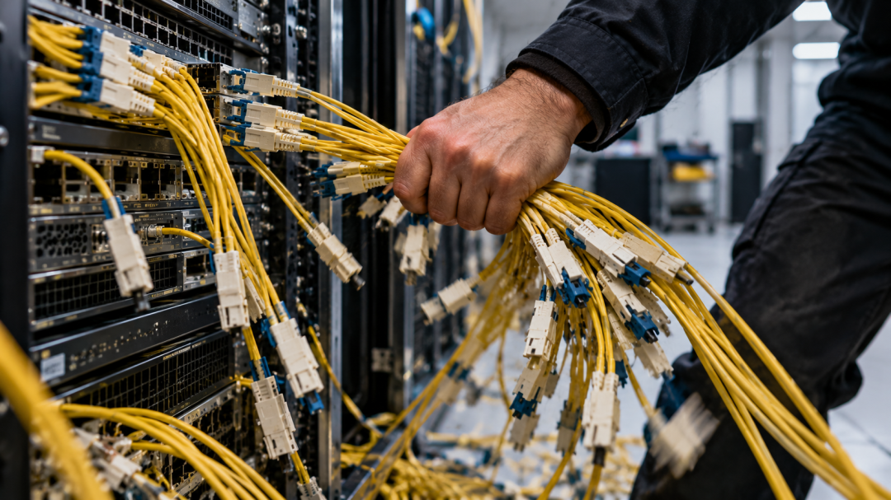

2026 年 9 月 5 日，谷歌云披露了一起由维护操作失误引发的服务故障。

一名工程师在数据中心路由器扩容期间，拔掉了相关设备的全部光纤连接，导致部分云资源与外部网络失联。

故障发生于 9 月 1 日 07:41 至 11:52，持续 4 小时 11 分钟。影响范围限于美国艾奥瓦州 us-central1-b 可用区的部分资源，同一区域内的其他可用区未受影响。

**一次维护，断开全部冗余链路**

事发时，工程师正在按计划为数据中心路由器扩容。这些设备承载着 us-central1-b 可用区的部分计算资源。

谷歌的数据中心网络采用多台路由设备，设备和光纤路径在物理位置上彼此分离，设备供电也有不同来源。按照设计，单台设备或单条光纤链路故障不会影响客户流量，多数情况下，即使同时发生两处或三处故障，网络仍可正常服务。

但此次维护中出现了流程错误。

工程师在 13 分钟内，依次拔掉了相关路由设备的全部光纤连接，冗余链路也未能幸免。

谷歌表示，相关警告未能在连接全部断开前传达到工程师。

**虚拟机失联，多类云服务受影响**

故障期间，用户无法从外部访问受影响的虚拟机，这些虚拟机也无法连接所在可用区之外的资源。

影响还波及容器、应用托管、数据库、网络和数据分析等服务。Google Kubernetes Engine 的部分集群和节点无法访问；Cloud Run 和 App Engine 出现延迟升高、排队请求中止；Cloud SQL 等数据库服务的部分实例连接中断。BigQuery、虚拟私有云（VPC）等产品也出现丢包、连接中断或 API 请求超时。

**重新接回光纤，部分应用恢复较晚**

谷歌的自动网络监控和主动探测系统在故障发生后立即发现异常，网络工程与事故响应团队随后介入，将流量从受影响的基础设施上转移。

支持自动切换的业务流量被转至同一区域内的正常资源。

与此同时，现场技术人员找到被断开的光纤并重新接回。待链路恢复、网络流量正常后，工程团队再将流量切回，恢复相关资源的服务。

当天 09:19，谷歌通报底层网络已经恢复，但部分应用仍受影响。Cloud Run 和 App Engine 的部分业务直到 11:52 才恢复正常。

云头条声明：如以上内容有误或侵犯到你公司、机构、单位或个人权益，请联系我们说明理由，我们会配合，无条件删除处理。

