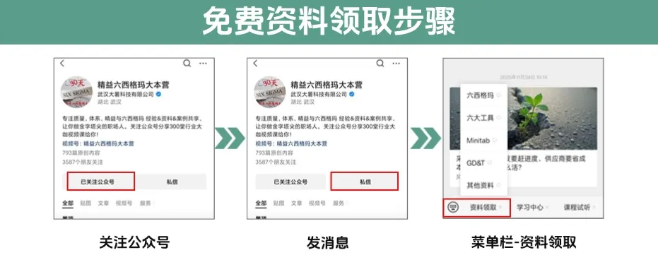
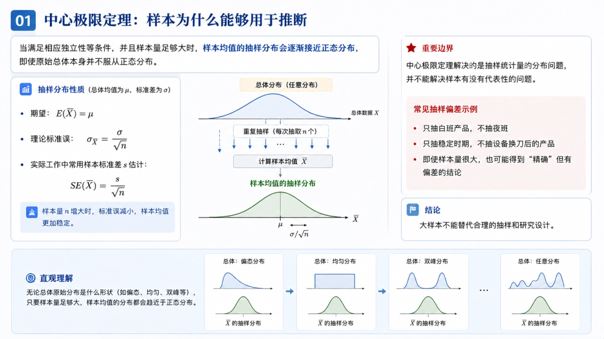
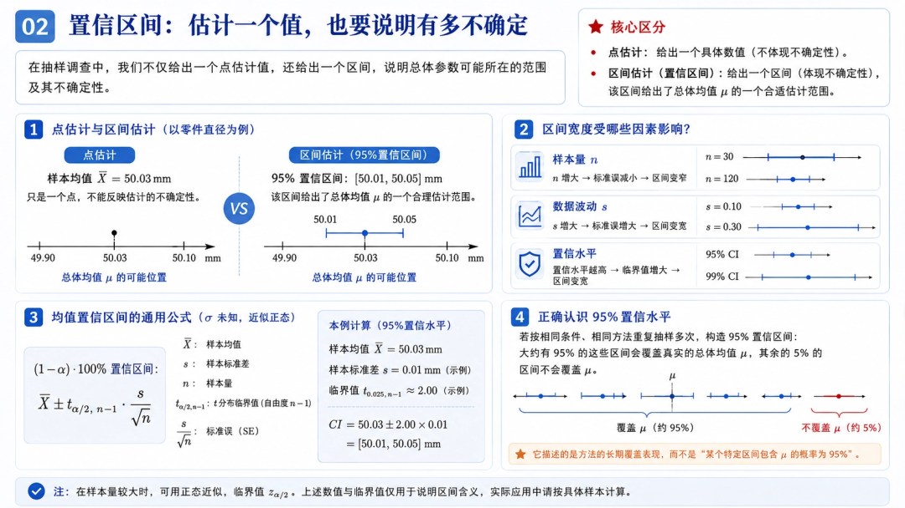
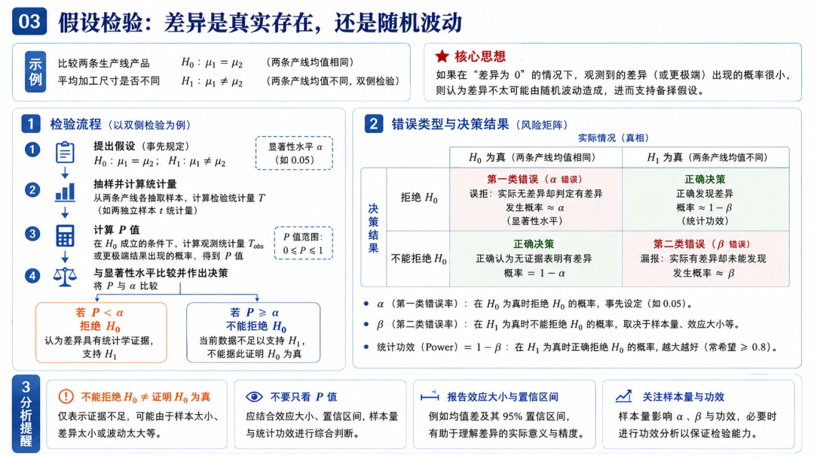
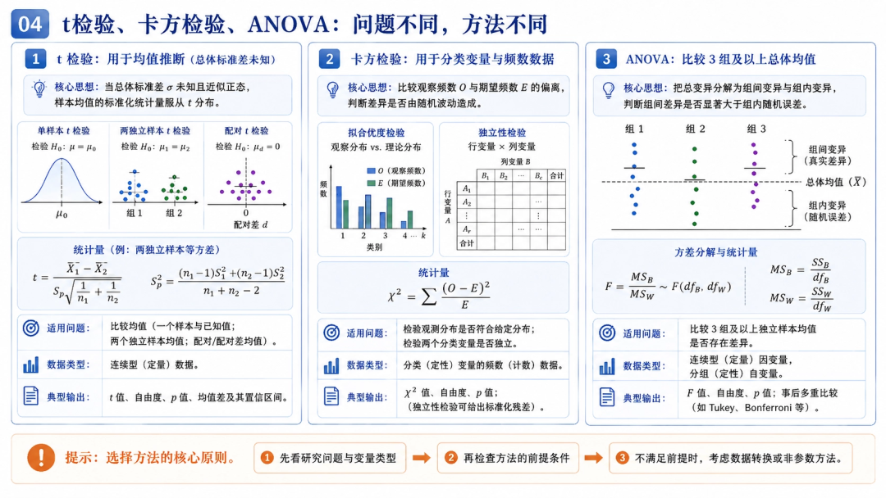
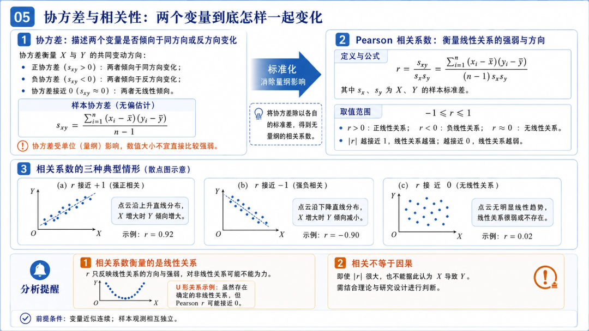
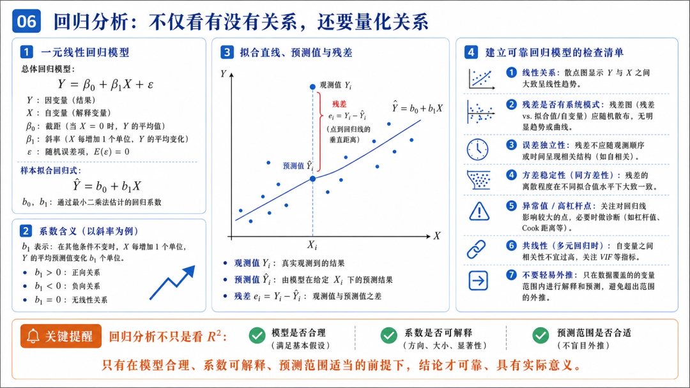
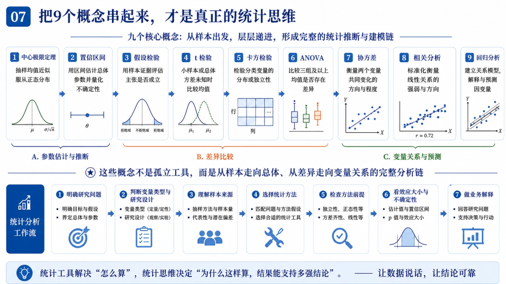

感谢您的关注！

很多人学习数据分析，最先接触的是均值、标准差、极差、直方图。这些工具首先解决的是一个基本问题：手里的这批数据是什么样？

但真正进入质量分析、六西格玛、研发试验、经营决策以后，只描述现有数据远远不够。我们更关心的是 *能不能根据有限样本，对背后的总体作出合理判断？*

比如：

  * 抽检50件产品，能不能估计整批产品的平均尺寸？
  * A、B两条产线均值不同，到底是随机波动还是工艺真的存在差异？
  * 调整参数以后良率提高3%，这种改善是不是偶然？
  * 多个工艺参数同时变化时，究竟哪些变量真正影响结果？

这些问题背后，涉及9个非常重要的统计概念： *中心极限定理、置信区间、假设检验、t检验、卡方检验、方差分析、协方差、相关分析和回归分析。*

它们不是9个孤立工具，而是一条从样本走向总体、再从差异走向变量关系的完整分析链。

如果你正在学六西格玛，这9个统计概念一定绕不开。像**中心极限定理、假设检验、t检验、ANOVA、相关与回归** ，都是绿带、黑带和实际项目分析里的高频内容。我整理了一套**六西格玛学习资料包** ，包含公式汇总、思维导图、重点笔记、考试大纲和真题复盘，适合边学边查、系统复习。

⬇领取步骤⬇

**一、中心极限定理：样本为什么能够用于推断**

统计推断首先要解决一个根本问题：我们只抽了一部分数据，为什么敢对总体作判断？

中心极限定理（Central Limit Theorem，CLT）是理解这一问题的重要理论基础。

它的核心思想可以概括为：当满足相应独立性等条件，并且样本量足够大时，样本均值的抽样分布会逐渐接近正态分布，即使原始总体本身并不服从正态分布。

这里最容易理解错的是：趋近正态的是“样本均值的分布”，不是原始数据本身。

假设总体均值为，总体标准差为。每次随机抽取个观测值并计算样本均值，不断重复这个过程，就会形成样本均值的抽样分布。

其期望为：

理论标准误为：

实际工作中，总体标准差通常未知，因此常使用样本标准差估计：

这解释了为什么样本量增加以后，样本均值通常会更加稳定：因为标准误随着增大而下降。

但这里还有一个非常重要的边界： *中心极限定理解决的是抽样统计量的分布问题，并不能解决样本有没有代表性的问题。*

例如只抽白班产品、不抽夜班，或者只抽稳定时期、不抽设备换刀后的产品，即使样本量达到几千件，也可能得到一个非常“精确”却带有系统偏差的结论。

因此，大样本不能替代合理的抽样和研究设计。

**二、置信区间：估计一个值，也要说明有多不确定**

假设随机抽取100件产品，样本平均尺寸为：50.03 mm，能不能直接说总体平均尺寸就是50.03 mm？

不能。

50.03只是一个点估计。

重新抽一批样本，结果可能变成50.01 mm，也可能变成50.05 mm。因此统计分析通常还需要给出一个范围，例如：总体均值95%置信区间：\[50.01，50.05\] mm。

置信区间（Confidence Interval）的核心作用，就是表达 *总体参数估计存在多大的不确定性。*

这里要避免一个非常常见的说法：总体真实均值有95%的概率落在这个区间里。

按照经典频率学派解释，总体参数是固定的。当前区间计算出来以后，要么包含真实参数，要么不包含。

所谓95%置信水平，指的是：如果长期重复采用同样的抽样方法和区间构造方法，大约95%的这类区间会覆盖真实总体参数。

置信区间宽度通常受几个因素影响：

  * 样本量；
  * 数据波动；
  * 置信水平；
  * 所使用的统计分布。

一般来说，样本量越大，区间越窄；数据波动越大，区间越宽；置信水平从95%提高到99%，区间也会变宽。

所以看到一个平均值以后，专业的数据分析还要继续追问：这个值估得有多准？

**三、假设检验：差异是真实存在，还是随机波动**

如果说置信区间主要回答总体参数可能在哪里，那么假设检验（Hypothesis Testing）解决的是： *观察到的差异，是否已经大到不能简单用随机波动解释。*

假设比较两台设备的平均加工尺寸，可以提出：

是原假设，通常代表“没有差异”。

备择假设可以设为：

然后根据样本计算检验统计量和P值。

  * 如果，通常在设定显著性水平下 *拒绝 。*
  * 如果，正确表述应该是： *不能拒绝 ，*而不是接受。

因为没有发现显著差异，不等于已经证明两个总体完全一样。

假设检验还存在两类错误：

  * 第一类错误：原假设本来为真，却错误地拒绝了它。
  * 第二类错误：原假设实际上为假，却没有成功拒绝。

统计功效为：，样本量过小、数据波动过大或者真实差异本来就很小时，都可能导致功效不足。

因此，专业分析不能只盯着： *P＜0.05还是P＞0.05* ，还应该同时关注效应大小、置信区间、样本量和统计功效。

**四、t检验、卡方检验、ANOVA：问题不同，方法不同**

假设检验是一套基本思想，真正执行时还要根据变量类型和研究问题选择具体方法。

#### 1\. t检验：均值有没有差异

t检验主要用于总体均值相关的推断。

常见的有三类：

  *  *单样本t检验* ：判断一个总体均值是否等于某个目标值。
  *  *两独立样本t检验* ：比较两个独立总体的均值。
  *  *配对t检验* ：分析同一对象改善前后，或者成对数据的平均差值是否显著。

为什么叫“t检验”，而不是直接使用标准正态分布？

因为在实际问题中， *总体标准差 往往未知，只能利用样本标准差进行估计*。这种额外的不确定性，使检验统计量在相应条件下服从t分布。

t分布和标准正态分布形状相似，但尾部更厚；自由度增加以后，t分布会逐渐接近标准正态分布。

对于两个独立样本，也不应机械默认总体方差相等。能够合理假定等方差时，可以采用合并方差形式；不能合理假定方差相等时，常使用Welch t检验。

对于配对t检验，真正需要分析的是每一对数据的“差值”是否满足相应统计条件。

#### 2\. 卡方检验：观察频数和期望频数差多少

卡方检验（Chi-Square Test）主要处理分类变量和频数数据。

常见用途包括：

  *  *拟合优度检验* ：观察到的分类频数是否符合某个理论分布。
  *  *独立性检验* ：两个分类变量之间是否存在统计关联。

例如研究：供应商A/B/C和不良类型之间有没有关系。

卡方检验真正比较的是：观察频数和原假设成立时应该出现的期望频数。

其基本统计量可以写成：

  * 如果观察频数和期望频数非常接近，通常较小；
  * 如果偏离越来越明显，就会增大，说明数据越来越不符合原假设所描述的情况。

但卡方检验并不是只要有分类数据就能直接使用。还需要关注各单元格的 *期望频数是否足够* 。当样本较少、数据非常稀疏或者期望频数过低时，卡方近似可能不可靠，此时应根据具体情况考虑Fisher精确检验等方法。

#### 3\. ANOVA：多个均值为什么要比较方差

如果要同时比较3组、4组甚至更多组总体均值，反复进行两两t检验会增加整体第一类错误率。

这时通常考虑使用 *方差分析（ANOVA）* 。

很多初学者会困惑：明明是比较均值，为什么叫方差分析？

因为ANOVA不是直接只看几个均值差多少，而是把数据中的变异拆分成 *组间变异* 和 *组内变异* 。

核心F统计量可以理解为：

也就是： *组与组之间的差异，相对于每组内部随机波动到底有多大。*

如果几个组的均值差得很多，而每个组内部数据又很稳定，那么F通常会比较大；反过来，如果几个组均值虽然不完全一样，但组内本身波动就很大，那么这种差异可能并没有足够统计证据。

因此ANOVA本质上是在问 *组间差异是否已经明显超过背景随机波动。*

如果ANOVA显著，只能说明 *至少有一个总体均值与其他组不同* ，并不能直接告诉我们到底是哪两组不同，通常还需要适当的事后多重比较。

经典单因素ANOVA还需要关注：

  * 观测独立性；
  * 残差或各组分布条件；
  * 方差齐性。

如果方差明显不齐，可以根据实际条件考虑Welch ANOVA等方法；重复测量、配对或区组设计，也应采用与研究设计匹配的模型。

**五、协方差与相关性：两个变量到底怎样一起变化**

当分析问题从“不同组是否存在差异”，进一步转向 *两个变量有没有关系* 的时候，就会遇到协方差和相关分析。

#### 1\. 协方差：先看变化方向是否一致

协方差（Covariance）描述两个变量是否倾向于一起变化。

总体协方差可以写成：

样本协方差通常写成：

这个公式看起来复杂，其实直觉非常简单。

假设某个观测值中：，说明X高于自己的平均水平。

如果此时：，Y也高于自己的平均水平，那么两者乘积为正。

如果大量观测值都表现为 *X高的时候Y也高，X低的时候Y也低* ，协方差就倾向于为正。反过来，如果经常出现 *X高的时候Y低，X低的时候Y高* ，协方差通常为负。

因此：

  * 正协方差：倾向同方向变化；
  * 负协方差：倾向反方向变化；
  * 接近0：没有表现出明显的线性共同变化趋势。

但协方差有一个明显问题： *它受到变量量纲影响。*

温度用℃还是℉，长度用mm还是m，都会改变协方差数值，因此很难直接用它比较不同变量对之间关系的强弱。

#### 2\. 相关系数：把协方差标准化

相关系数可以理解为 *经过标准化的协方差。*

总体Pearson相关系数为：

样本中常使用：

其取值范围为：

  * 接近1，表示较强正线性关系；
  * 接近－1，表示较强负线性关系；
  * 接近0，表示缺乏明显的 *线性关系* 。

“线性”两个字非常重要。如果X和Y之间存在明显的U形关系，Pearson相关系数仍然可能接近0。

另外，不能机械规定就一定叫强相关。相关系数多大才具有实际意义，需要结合研究领域、数据波动和业务场景判断。

更重要的是， *相关不等于因果* 。温度和不良率高度相关，并不能仅凭一个相关系数证明温度导致不良。背后还可能存在材料批次、设备磨损、班次、生产速度等混杂因素。

**六、回归分析：不仅看有没有关系，还要量化关系**

相关分析告诉我们两个变量是否存在明显的线性关联。

但很多业务问题还会进一步追问：

  * X每变化一个单位，Y平均变化多少？
  * 能不能用X预测Y？

这就进入回归分析（Regression Analysis）。

最简单的一元线性回归总体模型可以表示为：

其中：

  * 是总体截距；
  * 是总体回归系数；
  * 是随机误差。

假设根据样本拟合得到：

在模型适用范围内，可以理解为： *X每增加1个单位，Y的平均预测值增加约0.002个单位。*

这里使用的是：，而不是Y，因为回归方程描述的是模型给出的条件均值预测，实际观测值仍然包含随机波动。

当自变量增加以后，可以建立多元回归。例如同时研究温度、压力、保压时间、模具温度对产品尺寸的影响。

但回归分析绝不是把所有变量放进去，然后看谁P＜0.05。

一个可靠的线性回归模型至少需要关注：

  * 线性关系是否合理；
  * 残差是否存在系统模式；
  * 误差独立性；
  * 方差是否大致稳定；
  * 是否存在异常值；
  * 是否存在高杠杆点和强影响点；
  * 多重共线性是否严重；
  * 模型的解释与预测能力。

还要特别警惕 *外推（Extrapolation）* 。如果模型只使用180～220℃的数据建立，就不能轻易假设同样的线性关系在300℃仍然成立。

因此真正专业的回归分析，重点不是R²到底有多高。而是模型是否合理、系数有没有可靠解释、预测范围是否合适，以及结论有没有超出数据真正能够支持的边界。

**七、把9个概念串起来，才是真正的统计思维**

如果把这些知识孤立学习，很容易变成背公式、背检验名称、看到P＜0.05就结束分析。

但9个概念之间其实存在非常清晰的逻辑链。

  *  *中心极限定理* 帮助理解抽样统计量为什么能够形成稳定的概率分布；
  *  *置信区间* 描述参数估计的不确定性；
  *  *假设检验* 判断观察到的差异是否具有足够统计证据；
  *  *t检验* 主要处理均值类推断；
  *  *卡方检验* 主要处理分类频数；
  *  *ANOVA* 处理多个总体均值之间的比较；
  *  *协方差* 描述两个变量共同变化的方向；
  *  *相关系数* 进一步把这种共同变化标准化，衡量线性关系的方向和强弱；
  *  *回归分析* 则把变量关系进一步量化，用于解释与预测。

所以真正的数据分析不应该是看到两组数据就跑t检验；看到三组数据就直接做ANOVA；看到两个连续变量就算相关系数。

更合理的顺序应该是：明确研究问题 → 判断变量类型和研究设计 → 理解样本来源 → 选择统计方法 → 检查方法前提 → 分析效应和不确定性 → 最后做业务解释。

统计工具解决的是怎么算，真正决定分析质量的是 *为什么这样算，以及这个结果到底能够支持多强的结论* 。

所以学习这些统计概念，真正需要建立的不是一张公式表，而是一套完整的分析思维：从有限样本出发，在承认随机性和不确定性的前提下，对总体、差异和变量关系作出有条件、有证据、有边界的判断。

**推荐阅读** ：

1.[三坐标建立坐标系到底在做什么？3-2-1法、6自由度一次讲清](https://mp.weixin.qq.com/s?__biz=Mzg5MTEzMDQ0NQ==&mid=2247571598&idx=1&sn=5d472d9d9cb1d87978fc68461010c263&scene=21#wechat_redirect)

2.[注塑件尺寸为什么不稳定？材料、设备、模具、工艺四大原因分析](https://mp.weixin.qq.com/s?__biz=Mzg5MTEzMDQ0NQ==&mid=2247571576&idx=1&sn=c8f49698d734d519459d59bffc839bf1&scene=21#wechat_redirect)

3.[总体分布、样本分布、抽样分布有什么区别？统计推断的底层逻辑一次讲清](https://mp.weixin.qq.com/s?__biz=Mzg5MTEzMDQ0NQ==&mid=2247571557&idx=1&sn=f01d0b8c914c567eeb838f3320d9752d&scene=21#wechat_redirect)

4.[注塑老师傅不轻易说的调机逻辑：20个核心参数一次讲透！](https://mp.weixin.qq.com/s?__biz=Mzg5MTEzMDQ0NQ==&mid=2247571535&idx=1&sn=316b5f334879c42ab757d24dab885267&scene=21#wechat_redirect)

5.[设计验证到底验证什么？功能、性能、可靠性、环境试验一次讲清](https://mp.weixin.qq.com/s?__biz=Mzg5MTEzMDQ0NQ==&mid=2247571524&idx=1&sn=49cd34b26635784759c27a4a0327836a&scene=21#wechat_redirect)

6.[注塑成型五大参数：温度、压力、速度、时间、位置，一次讲透！](https://mp.weixin.qq.com/s?__biz=Mzg5MTEzMDQ0NQ==&mid=2247571512&idx=1&sn=80b08df101e16a38d3a245c073d62bcd&scene=21#wechat_redirect)