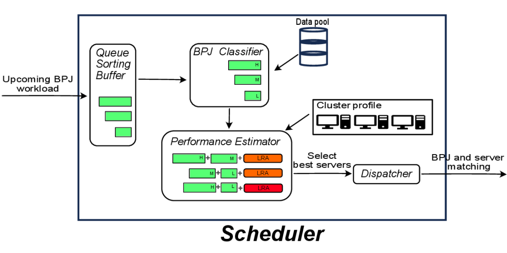
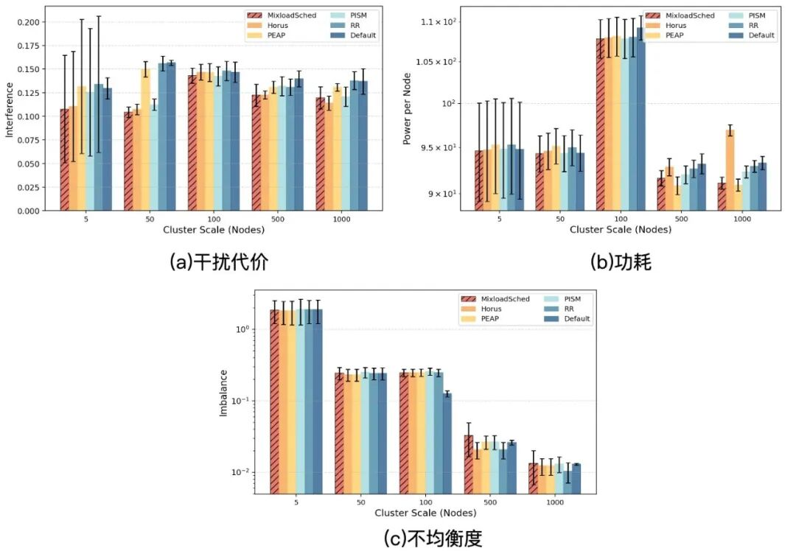
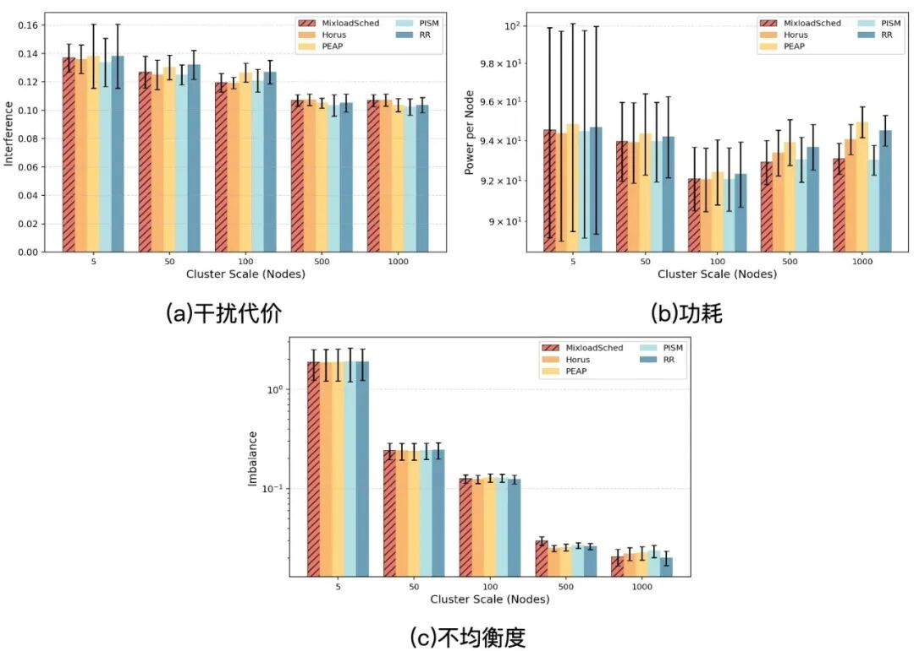
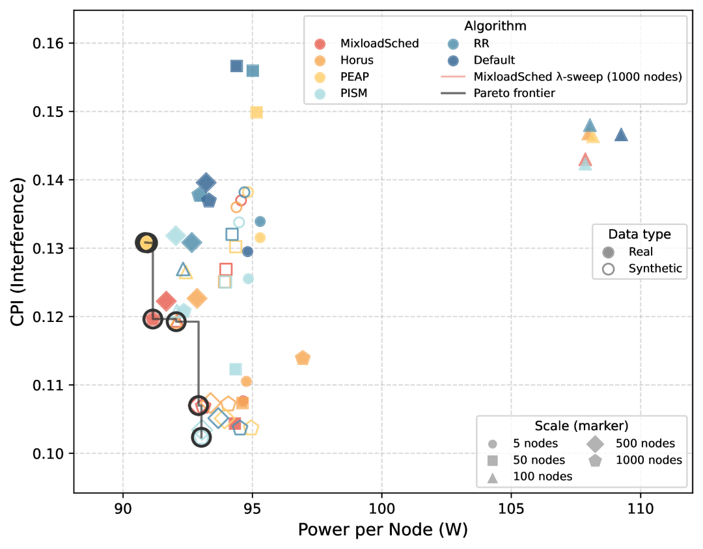
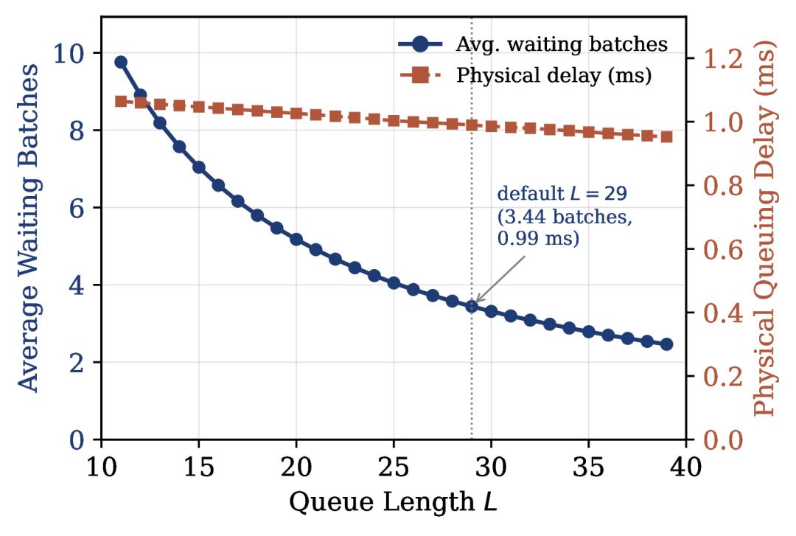
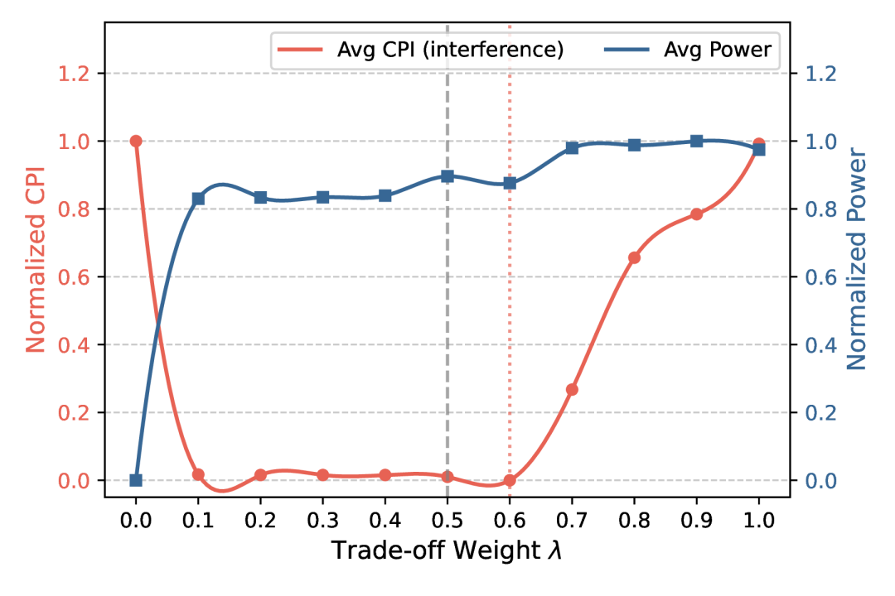

# FGCS | MixloadSched：面向云数据中心混合负载的干扰感知与能效优化调度方法

**作者** ：利建卓，林伟伟，吴海杰，陈加禾，都端阳，李克勤  
**机构** ：1.华南理工大学计算机科学与工程学院，2.鹏城实验室，3.华南理工大学数学学院，4.华南师范大学，5.纽约州立大学新帕尔茨分校  
**论文期刊** ：Future Generation Computer Systems **\(CCF C类，JCR Q1期刊\)**  
**关键词** ：容器调度，混合负载共置，能源效率，性能干扰  
**论文链接** ：https://www.sciencedirect.com/science/article/abs/pii/S0167739X26003110

### 摘要

随着云计算规模持续扩大，混合负载共置（Mixed Workload Colocation）策略的广泛采用显著提升了资源利用率，但也引入了严重的性能干扰，而此类场景下的能耗管理却常被忽视。针对这些挑战，本文提出 **MixloadSched** ，一种面向混合负载的干扰感知与能效优化调度方法。该方法采用**延迟重排序策略** ，对到达的批处理任务进行缓冲与重排，扩展调度器的时间窗口与全局决策视野；在此基础上设计**优先级驱动的任务配对机制** ，并利用**随机森林模型** 对干扰成本与服务器能效进行联合评估，构建统一的优化目标指导任务放置。与以往孤立处理干扰或能耗、或以无界延迟为代价换取决策视野的学习型策略不同，MixloadSched 将上述机制协同设计为单一非迭代流水线，同时满足干扰抑制、能效优化与有界单任务延迟。在真实阿里巴巴 Trace 上，MixloadSched 相较最强的干扰感知基线（Horus 与 PISM）平均降低 LRA CPI 约 **3.3%** 、集群功耗约 **1%** ，同时将单任务调度开销控制在 **15 μs** 以内；在多数评估配置下保持 Pareto 非支配，为云原生环境提供了轻量、高性能的资源调度方案。

### 引言

随着大语言模型（LLM）与人工智能（AI）应用的快速普及，云计算基础设施在计算与能效两方面正面临前所未有的挑战。根据国际能源署（IEA）统计，全球数据中心的年耗电量已超过部分国家的总用电量；在许多超大规模数据中心中，电力支出已占运营成本的 56% 以上，接近甚至超过硬件制造成本。在此背景下，即使小幅降低能耗也能带来可观的经济回报与显著的碳减排效果，高能效的资源管理已成为云系统的核心研究方向，而**作业调度** 正是连接上层应用与底层基础设施的关键纽带。

与此同时，为提升资源利用率、摊薄单位算力成本，数据中心普遍采用**混合负载共置** 策略，将不同优先级的应用——如批处理作业（BPJ）与长期运行的延迟敏感应用（LRA）——部署在同一物理节点上。微服务架构的兴起进一步加速了这一趋势。然而，共置在提升资源效率的同时也带来了复杂的性能干扰：部分任务引发的 CPU 或内存带宽竞争会严重劣化同节点延迟敏感微服务的性能，进而导致资源过度配置，带来额外能耗成本。两类负载特征差异显著：

  * • **BPJ** ：可迁移性高、资源消耗稳定、执行时长短、延迟敏感度低；
  * • **LRA** ：可迁移性低、资源消耗波动大、执行时长长、延迟敏感度高。

如何在兼顾共置干扰的前提下协同优化高性能与低能耗，仍是云原生环境面临的关键挑战。

### 存在的问题

从干扰、能耗与调度延迟三个约束整体来看，现有方法最多同时满足其中两个：

  * • **干扰感知调度器** （如 Horus、PISM）抑制了资源竞争，却忽视服务器能效；
  * • **能效感知整合方法** （如 PEAP）提升了能源效率，却忽略共置干扰；
  * • **强化学习调度器** 虽能兼顾两个目标，但决策延迟高且无界、状态空间变化导致再训练成本高、黑箱特性导致可解释性差，无法满足生产级调度器单任务 **15 μs** 以内的延迟预算。

**如何在抑制干扰与优化能效的同时，将调度延迟控制在生产级预算之内？**

###  MixloadSched 的设计

MixloadSched 的整体框架如图1所示，包含五个模块：**Buffer（缓冲区）、Classifier（分类器）、Estimator（评估器）、Dispatcher（调度器）、Data Pool（数据池）** 。Buffer 接收时序到达的 BPJ 任务请求并执行优先级重排；Classifier 基于任务画像输出可反映资源使用特征的类别标签；Estimator 计算 LRA 任务的性能指标与集群能效指标；Dispatcher 执行任务放置；Data Pool 收集历史数据（BPJ 运行信息、历史放置及对应 LRA 性能）用于模型训练。

  
**图1** MixloadSched 总览

**任务分类（Classifier）**  
基于对阿里巴巴 Trace 中 BPJ 任务的聚类分析与常见资源消耗模式，从 **CPU、内存（MEM）、执行时长（Duration）** 三个维度刻画任务，每个维度划分三级，共 27（3×3×3）类。分类器在任务部署前仅凭准入信息即可预测类别：特征向量为 8 维，其中 5 维来自任务名解析出的 DAG 依赖结构（上游依赖数、是否含依赖、最大/最小依赖索引、不同依赖数），3 维为请求资源与规模（实例数、请求 CPU 配额、请求内存配额）。

27 类问题被分解为三个独立的 3 分类子问题，各训练一个 LightGBM 梯度提升分类器；标签按训练集分位数切分（CPU/MEM 取 33/67 分位，时长取 40/80 分位以隔离干扰占主导的长任务）。在约 860 万任务的数据集上，先在 100 万均匀采样子集上完成 108 组配置的网格搜索（3 折交叉验证、宏平均 F1），再用最优配置在全量训练集上重训。

**干扰-能效联合评估（Estimator）**  
真实系统中不同任务类型间的资源竞争呈显著非线性与耦合效应，线性叠加模型难以刻画。Estimator 采用**随机森林（RF）回归** 直接从各类型 BPJ 任务的共置计数向量预测 LRA 的 CPI 干扰等级：

RF 采用 30 棵树、最大深度 8、叶节点最小样本数 30，部署时经 Treelite 编译为原生代码以最小化推理延迟。

在能效侧，服务器能效定义为性能与功耗之比，并据此定位能效甜点（Energy-Efficiency Sweet Spot, ESS）利用率：

进而定义归一化能效指标：

，引导调度器选择运行在最优能效点附近的服务器。

**延迟重排缓冲（Buffer）**  
为避免先来先服务（FCFS）缺乏全局视野导致的局部最优，Buffer 对到达任务进行缓冲重排：当队列长度达到 ，或队首任务等待超过  时触发重排——对队列中每个任务先经 Classifier 预测类别，再按综合资源需求强度  降序排列，使资源密集型任务优先放置，降低后续小任务因资源碎片无法调度的风险。 设为一个调度周期，保证任务不会被跨周期滞留，超时路径仅在到达稀疏时作为兜底触发。

**优先级匹配调度（Dispatcher）**  
对重排后队列中的每个任务，先遍历所有服务器完成 CPU 与内存的可行性筛查得到候选集，再对每个候选服务器  计算综合代价：

其中  为 RF 预测的放置后干扰代价， 为放置后 CPU 利用率相对 ESS 点的能效指标，（默认 0.5）为权衡权重。最终选择代价最小的服务器放置任务。算法整体时间复杂度为 ，随任务数与集群规模线性增长，适配大规模实时生产环境。

**实验评估**  
实验基于 Python 仿真框架开展。负载来自阿里巴巴 Trace 的 `batch_task`（BPJ）与 `container_usage`（LRA），跨度 8 天、时间片为 1 小时；服务器功耗曲线来自 SPEC 基准。实验环境为 Ubuntu 20.04，配备 Intel Xeon Silver 4316 CPU、NVIDIA GeForce RTX 4090 GPU 与 64GB 内存。

  * • **集群规模** ：5、50、100、500、1000 台服务器。真实 Trace 通过随机下采样服务器并保留时间对齐的真实 BPJ 到达获得；合成负载到达服从泊松过程，资源画像服从 Trace 的经验分布；
  * • **对比基线** ：Default（阿里巴巴原生调度）、RR（轮询）、PISM（干扰感知、无延迟调度）、Horus（基于利用率的干扰感知 SOTA）、PEAP（峰值能效感知放置）；
  * • **评估指标** ：CPI（干扰代价，越低越好）、平均功耗、资源不均衡度（利用率方差）、BPJ 缓冲排队延迟；
  * • **重复设置** ：每组配置以独立随机种子重复 5 次，报告均值与标准差。

**主要结果**  
图2与图3分别展示了真实 Trace 与合成数据下不同集群规模的三项指标。

**图2** 真实 Trace 下不同集群规模的评估指标

**图3** 合成数据下不同集群规模的评估指标

在真实 Trace 上，MixloadSched 在每个集群规模的 CPI 均为最低或次低：相对最强干扰感知基线（Horus 与 PISM）平均降低约 **3.3%** ，相对全部五个基线（含轮询与生产 Default）平均降低达 **10.1%** ；最小规模下各方法差距不大，因为低竞争下贪心放置已足够。合成 Trace 上排序互有胜负，MixloadSched 与最强基线的差距保持在 **1.2%** 以内。功耗方面，MixloadSched 相对最强基线平均降低约 **1%** ，与专攻能耗的 PEAP 相当——表明联合代价中的能耗项无需专门的整合步骤即可回收大部分可用节能空间。

图4绘制了全部（方法、数据集、规模）配置下 CPI 与平均功耗的 Pareto 前沿：**MixloadSched 是唯一在两个数据集上都出现在全局前沿的方法** （SYNTH 500 台、REAL 1000 台）；PISM 取得最低 CPI（SYNTH 1000 台，0.1023）但牺牲功耗，PEAP 取得最低功耗（REAL 500 台，90.86 W）但牺牲干扰。

**图4** 全部配置下的 CPI–功耗权衡与 Pareto 前沿

统计显著性方面（每配置 5 次重复、共 10 个条件，Wilcoxon 符号秩检验 + Bonferroni 校正）：相对轮询 RR 的功耗降低 0.75% 通过校准（）；相对最强基线 Horus 与 PISM 的 CPI 与功耗差异未达显著（）；Friedman 检验未能区分领先组（MixloadSched、Horus、PISM，，）。MixloadSched 在 **10 个条件中的 7 个** 保持 Pareto 非支配，在两个优化目标（干扰与能耗）上与 PISM 同处领先组。

**重排序机制的消融**  
对比完整优先级缓冲（Priority）、无缓冲即时调度（No-queue）与随机重排（Random）三种变体：Random 在所有条件下均为最差（功耗高约 4–5%，CPI 最高相差 18%），说明批内派发顺序显著影响放置质量；相对 No-queue，优先级重排在真实 Trace 上明显降低 CPI（5 台降低 14.2%，50/500 台分别降低 7.1%/7.3%），在合成负载与功耗上两者相当。重排序机制的贡献主要在于避免糟糕的派发顺序并改善真实 Trace 的干扰，而非降低功耗。

**队列长度 L 与排队延迟**  
并非自由调节的超参数，而是由负载到达率这一可测量属性确定：论文对 Trace 离线统计一次每个有效时间戳的平均到达数，并令  与之匹配，使缓冲区期望每有效时间戳填满一次——五个规模的平均到达率分别为 3.57、16.18、28.94、115.32、215.62，对应的  为 4、16、29、115、216。

图5展示了 100 台集群上平均等待批数与物理排队延迟随  的变化： 从 11 增至 39 时，平均等待批数从 9.76 降至 2.46，但每批处理时间相应增加，两者近乎抵消，物理排队延迟在全区间基本持平于约 1 ms——**扩大重排视野不以增加排队延迟为代价** 。

**图5** 平均等待批数与物理排队延迟随队列长度 L 的变化（100 台集群）

将排队延迟与 BPJ 执行时间对比（表1）：BPJ 执行时长呈重尾分布，中位数约 12 s、均值约 50 s；平均排队延迟从 5 台的 0.01 ms 到 1000 台的 14.38 ms，在所有规模上均低于中位执行时间的 **0.12%** ；最忙时间片也能在 95 ms 内完全排空，远小于 1 小时的时间片，任务始终在本时间片内派发。重排序缓冲工作在调度决策的时间尺度（每任务 μs 级），而 BPJ 执行在秒到小时尺度，因此重排序只改变批内派发顺序，不会实质影响任何任务相对其自身运行时的完成时间。

**表1** 不同集群规模下的 BPJ 缓冲排队延迟

集群规模| 5| 50| 100| 500| 1000  
---|---|---|---|---|---  
队列长度 | 4| 16| 29| 115| 216  
单任务开销  \(μs\)| 4.99| 7.70| 9.91| 12.74| 14.19  
平均等待批数| 0.67| 2.95| 3.44| 4.44| 4.69  
每批处理时间 \(ms\)| 0.02| 0.12| 0.29| 1.47| 3.07  
平均排队延迟 \(ms\)| 0.01| 0.36| 0.99| 6.50| 14.38  
最忙时间片派发耗时 \(ms\)| 0.14| 2.46| 6.61| 42.49| 95.02  
排队延迟/中位执行时间 \(%\)| 0.0001| 0.003| 0.008| 0.05| 0.12  
  
**干扰预测模型的选择**  
干扰预测器位于调度关键路径上（每个任务对每个候选服务器查询一次），其精度与推理延迟同时影响调度质量与开销。论文对比了线性回归、MLP（64-32 双隐层）、XGBoost 与随机森林四种模型（样本按时间序 70/10/20 划分，指标为 5 个随机种子平均）：

**表2** 候选干扰预测模型对比

模型| RMSE| MAE| ρ| Top-10%| 训练 \(s\)| P50 \(μs\)| P99 \(μs\)  
---|---|---|---|---|---|---|---  
线性回归| 0.2331| 0.1682| 0.345| 25.9%| 0.11| 51.1| 56.8  
MLP \(64-32\)| 0.2312| 0.1680| 0.355| 27.5%| 27.6| 75.1| 81.3  
XGBoost| 0.2311| 0.1673| 0.354| 27.6%| 1.94| 17.1| 22.5  
**RF**|  0.2314| 0.1680| 0.350| 27.6%| 15.7| **16.9**|  22.5  
  
四种模型精度非常接近（RMSE 0.2311–0.2331，差异不足 1%，与跨种子标准差相当，表明任务受噪声而非模型能力限制）。关键差异在推理延迟：经 Treelite 编译为原生代码后，RF 单查询中位延迟仅 **16.9 μs** （编译前约 2000 μs，降低两个数量级以上），低于 MLP（75.1 μs）与线性回归（51.1 μs），且尾部延迟紧凑。XGBoost 与 RF 精度、编译后延迟几乎相同；论文选择 RF 是因其超参数足迹更小、部署更简单，且 bagging 的方差缩减特性契合 CPI 预测的低信噪比场景。由于 Estimator 暴露固定的接口，梯度提升可在不改变调度框架的前提下直接替换。

**权衡权重 λ 的敏感性**  
论文在 5–1000 台、真实 Trace 上扫描  并记录 CPI、平均功耗与资源不均衡度，构造归一化联合目标 ，结果如图6所示。

**图6** 权衡权重 λ 的敏感性（1000 台集群：CPI 在 λ≈0.6 附近最低，功耗随 λ 单调上升）

三个观察：其一，λ 是有效的 Pareto 控制旋钮——平均功耗随 λ 单调上升（纯能效极端 λ=0 时最低）；而 CPI 呈 U 型，1000 台时最低点位于 λ≈0.6，纯干扰极端 λ=1.0 反而比最低点高 3.6%，因为能效项也在间接抑制重任务共置带来的实际干扰，两个目标互补而非纯对抗。其二，联合目标在 λ=0.5 附近呈**宽平坦盆地** ：在 50–1000 台的非退化规模上，λ=0.5 距各规模最优仅 0.03%，而 λ=0 差 0.3–1.5%、λ=1 在较大规模最多差 1.8%——默认值并非刀尖选择，运营商可根据 QoS 或能耗偏好沿盆地调节。其三，5 台为退化特例（放置近乎固定、指标对 λ 几乎不响应）；50/100 台下 CPI 对 λ≥0.1 平坦，源于 CPI 被离散化为等级指标，而连续的功耗指标仍随 λ 变化。

**调度开销**  
算法开销由分类推理、代价评估、队列重排与服务器匹配构成。得益于模型推理的高效性，开销随规模增长缓慢（表3），1000 台集群下单任务调度开销仅 14.19 μs，始终低于 **15 μs** 的生产级延迟预算。配合重排率随规模饱和于约每有效时间戳 1.7 次的特性，端到端调度开销在所有规模下均保持在可接受范围内。

**表3** 不同集群规模下的算法开销

集群规模| 5| 50| 100| 500| 1000  
---|---|---|---|---|---  
时间开销 \(μs\)| 4.99| 7.70| 9.91| 12.74| 14.19  
  
### 总结

本文提出了面向混合负载共置的调度方法 **MixloadSched** ，通过**延迟重排序策略** 扩展调度器的全局决策视野，结合基于**随机森林与 ESS 能效指标的干扰-能效联合评估模型** ，在单一轻量非迭代框架内协同优化 LRA 性能与集群能效。实验结果表明，MixloadSched 有效降低了干扰成本与能耗，同时保持极低的调度延迟：相较最强干扰感知基线平均降低 CPI 约 3.3%、功耗约 1%，单任务调度开销低于 15 μs，在调度效率、服务质量和能效之间取得了有效均衡，为大规模云原生环境提供了轻量高效的资源调度解决方案。未来工作将扩展至 GPU/FPGA 等异构基础设施的干扰建模，并借助超低调度延迟探索其在资源受限边缘计算场景的适用性与能效表现。

  

**先进计算体系结构团队（ACAT）**  
**Advanced Computing Architecture Team**

📌 **团队概况** ：先进计算体系结构团队（Advanced Computing Architecture Team, ACAT）前身为2005年成立的“华南理工大学计算机系统结构”研究所，团队长期致力于云计算、绿色计算、大数据、人工智能等方向的下一代计算支撑技术，提供面向复杂应用需求的高效、智能和可持续的创新计算解决方案。

🔬**研究方向** ： 云计算与算力优化.数据中心能效优化.AI与大模型应用技术.时序预测建模与应用.物联网与边缘智能. 

🧩 **实验室开源主页：** https://github.com/ACAT-SCUT

（长按识别图中二维码进入实验室主页）

  

撰稿人：利建卓  
时间：2026 年 10 月 7 日

* * *