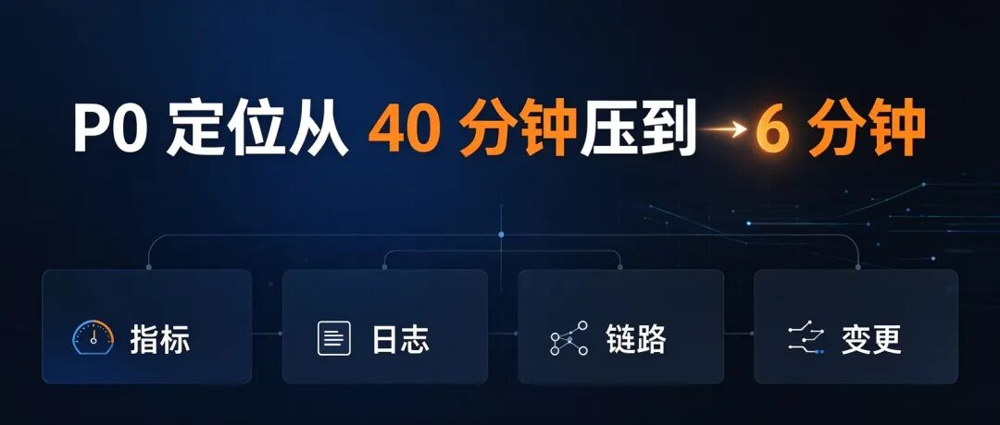
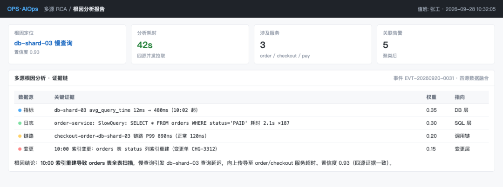
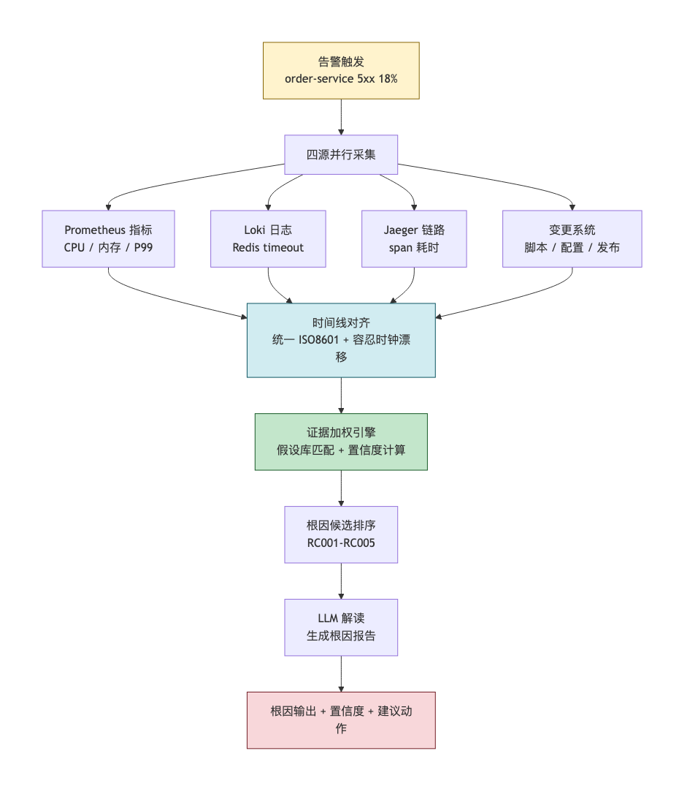
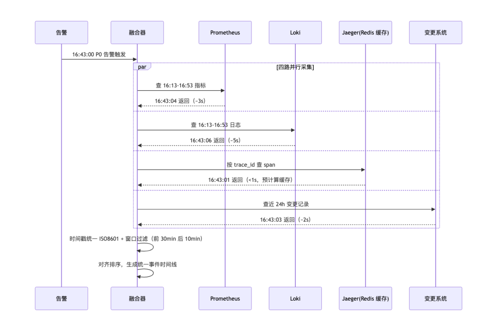
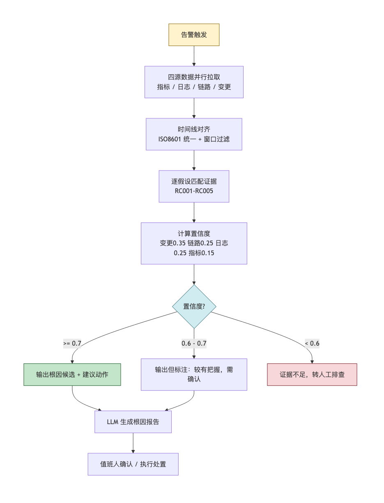
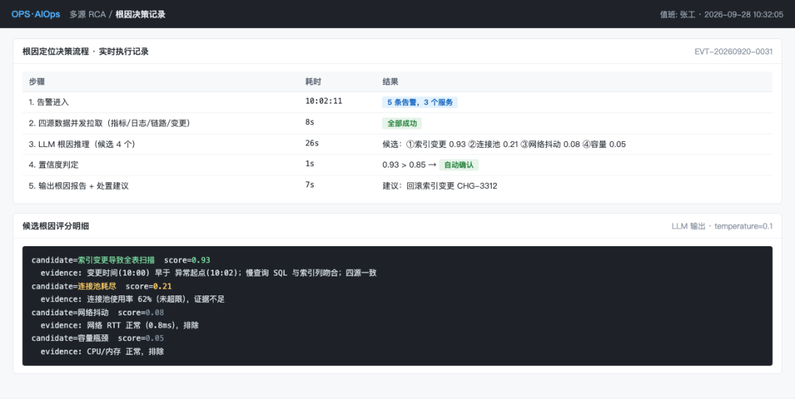

> 9 月 2 日 16:43，order-service 5xx 比例 18%，P0 告警。 我先看指标：CPU 45%、内存正常，P99 3.2s——除了延迟都正常。再看日志：大量 Redis timeout。再查 Redis：内存 91%、连接池 95%。再查链路：慢在 Redis，不是 DB。

最后查变更：16:30 有人执行了大 Key 清理脚本——参数写错，10 万 Key 一次删了，把 Redis 阻塞了。 17:06 恢复，全程 23 分钟。真正需要思考的只有最后 2 分钟（把大 Key 清理和 Redis 阻塞关联起来），前面 21 分钟，全在四个系统之间搬数据。

这篇讲我怎么把"搬数据"交给机器：告警触发后，四路数据并行采集，统一成一条时间线，证据加权算置信度，LLM 只负责把计算结果写成人话。落地一周，P0 定位从平均 40 分钟压到 6 分钟。

## 本文导读

如果你只读 30 秒，记住这四个数据就够了：

指标| 人肉分析| 四源融合| 改善  
---|---|---|---  
**P0 平均定位时间**|  40 分钟 😩| **6.2 分钟**|  ⬇️ 84%  
**根因命中率**|  65% 🤦| **80%**|  ⬆️ 23%  
**四源数据全看比例**|  70%| **100%**|  不再漏看  
**根因可解释比例**|  40%| **100%**|  每条结论带证据  
  
## 01 一次拖了 23 分钟的 P0

先还原那次事故的完整时间线：
    
    
    16:43  告警：order-service 5xx 比例 18%，P0  
    16:45  看指标：CPU 45%、内存正常、P99 3.2s——指标上除了延迟都正常  
    16:48  看日志：大量 "Redis timeout after 3000ms"  
    16:52  查 Redis：内存 91%、连接池 95%、QPS 正常——内存快满了  
    16:55  查链路：order → redis 的 span 耗时 2.8s，redis → DB 只有 0.5s——不是 DB 的锅  
    16:58  查变更：16:30 redis-cache-01 执行了大 Key 清理脚本  
    16:59  查脚本：参数写错，10 万 Key 一次删了，触发 Redis 阻塞  
    17:00  让 DBA 暂停清理脚本  
    17:06  Redis 内存回落到 72%，5xx 回落到 0.5%  
    

23 分钟里，真正需要思考的只有最后 2 分钟。更后怕的是：如果 16:58 我没想起来查变更（或者变更系统当时正好在维护），根因就会停在"Redis 内存满"——脚本参数写错这个真凶，永远不会被发现。

**根因分析的质量，取决于四源数据是否都看了。**

人肉根因分析有 3 个硬伤：

硬伤| 表现| 后果  
---|---|---  
**四源各看各的**|  指标、日志、链路、变更在四个系统，人肉来回切换| 拼接 30 分钟起步，还容易漏（我差点漏了变更）  
**时间线没对齐**|  四个系统四套时间戳格式，看不出先后因果| 看不出"16:30 变更 → 16:43 告警"这条因果链  
**根因凭感觉**|  "我觉得是 Redis"，没有证据加权| 同一故障，A 定位 Redis、B 定位 DB，结论不一致  
  
融合分析器要回答 3 个问题：**四源数据怎么对齐时间线？证据权重怎么定？置信度怎么做到可计算而不是 LLM 拍脑袋？** 后面逐一拆解。

## 02 第一步：把四源数据对齐成一条时间线

整体架构不复杂：告警触发后四路并行采集 → 统一事件模型 → 时间线对齐 → 证据加权 → LLM 写报告。

### 时间戳先统一成 ISO8601

四个系统的时间戳格式五花八门：

数据源| 原始格式| 统一为  
---|---|---  
Prometheus| Unix 秒| ISO8601（带时区）  
Loki| Unix 纳秒| ISO8601  
Jaeger| Unix 微秒| ISO8601  
变更系统| ISO8601| 直接用  
  
这一步看着不起眼，却是后来踩的第一个坑（05 节细说）——LLM 能读懂 `2026-09-02T16:43:00+08:00`，读不懂 `1756816980000000000`。

### 统一事件模型

四源数据统一成 6 字段的事件模型：
    
    
    # event.py —— 统一事件模型  
    from dataclasses import dataclass  
    from typing import Optional  
      
    @dataclass  
    class Event:  
        event_id: str           # 唯一 ID（指标/日志/span/变更各自的 ID）  
        source: str             # "metric" / "log" / "trace" / "change"  
        timestamp: str          # ISO8601 统一时间戳  
        host: str               # 主机/服务名  
        severity: str           # "P0" / "P1" / "P2" / "P3" / "info"  
        description: str        # 事件描述（指标值、日志内容、span 耗时、变更内容）  
        trace_id: Optional[str] # 链路 ID（只有链路事件有）  
    

### 窗口过滤：只看告警前 30 分钟到后 10 分钟

> 💡 **为什么要设窗口？** 不是告警时刻的所有事件都相关。窗口太窄会漏早期信号（比如提前半小时的变更），太宽会灌进无关噪声，稀释 LLM 的注意力。
    
    
    # timeline.py —— 时间线对齐  
    from datetime import datetime, timedelta  
      
    def build_timeline(alert_ts, events, window_before_min=30, window_after_min=10):  
        """构建统一时间线（告警前 30min 到后 10min）"""  
        alert_dt = datetime.fromisoformat(alert_ts)  
        start = alert_dt - timedelta(minutes=window_before_min)  
        end = alert_dt + timedelta(minutes=window_after_min)  
      
        aligned = [ev for ev in events  
                   if start <= datetime.fromisoformat(ev.timestamp) <= end]  
        aligned.sort(key=lambda e: e.timestamp)  
        return aligned  
    

采集时序上四路是并行发的：链路数据因为提前做了 Redis 预计算缓存，不到 1 秒返回；指标 3 秒、变更 2 秒；日志最慢，5 秒左右。全部返回后统一对齐：

### 别忽略时钟漂移

Prometheus 的 16:43:00 和 Loki 的 16:43:02，看起来差 2 秒，实际是同一时刻——两台服务器的时钟漂移了 2 秒。四源数据来自不同机器，NTP 同步不完美，漂移 1-5 秒是常态。

所以"同一事件"的判定不能要求时间戳完全相等：
    
    
    def align_events(timeline, tolerance_sec=5):  
        """容忍时钟漂移：时间戳差 < 5 秒 + 主机相同 → 视为同一时刻"""  
        aligned_groups = []  
        for i, ev1 in enumerate(timeline):  
            group = [ev1]  
            for ev2 in timeline[i+1:]:  
                ts_diff = abs(  
                    datetime.fromisoformat(ev1.timestamp).timestamp() -  
                    datetime.fromisoformat(ev2.timestamp).timestamp()  
                )  
                if ts_diff < tolerance_sec and ev1.host == ev2.host:  
                    group.append(ev2)  
            aligned_groups.append(group)  
        return aligned_groups  
    

## 03 第二步：证据加权算置信度，LLM 只负责写报告

### 根因假设库：让 LLM 在库里选，不是凭空猜

> 💡 **为什么要建假设库？** LLM 凭空猜根因，猜出来的东西没法验证。把常见的根因模式（指标、日志、链路、变更各该有什么证据）提前写成结构化的假设库，LLM 的任务从"创造"变成"在库里选"——输出才稳定。
    
    
    # root_cause_hypotheses.py —— 根因假设库（示例 2 条，实际生产 20-50 条）  
    ROOT_CAUSE_HYPOTHESES = [  
        {  
            "id": "RC001",  
            "hypothesis": "大 Key 操作导致 Redis 阻塞",  
            "evidence_pattern": {  
                "metric": ["redis_memory > 85%", "redis_qps 突降"],  
                "log": ["Redis timeout", "OOM", "blocked"],  
                "trace": ["redis span 耗时 > 1s"],  
                "change": ["Redis 相关脚本/配置变更"]  
            },  
            "action": "检查 Redis 大 Key 操作，暂停阻塞操作"  
        },  
        {  
            "id": "RC002",  
            "hypothesis": "DB 慢查询导致连接池耗尽",  
            "evidence_pattern": {  
                "metric": ["db_connection_pool > 90%", "db_query_time > 1s"],  
                "log": ["connection pool exhausted", "slow query"],  
                "trace": ["db span 耗时 > 1s"],  
                "change": ["DB 相关配置/SQL 变更"]  
            },  
            "action": "查慢查询日志，kill 慢查询，必要时扩容连接池"  
        },  
        # RC003 上游依赖超时级联 / RC004 内存泄漏 OOM / RC005 网络分区，结构相同  
    ]  
    

### 证据加权：置信度是算出来的，不是 LLM 感觉

> 💡 **为什么权重这样定？** 变更权重最高（0.35）——生产故障里变更引发的是高发区，历史 P0 回测也验证了这一点。链路和日志各 0.25（细节证据），指标 0.15（趋势证据，只能辅助）。
    
    
    # evidence_weighting.py —— 证据加权  
    def score_evidence(event, hypothesis, source):  
        """单条事件对单假设的匹配度（0-1）"""  
        pattern = hypothesis["evidence_pattern"].get(source, [])  
        ifnot pattern:  
            return0  
        desc_lower = event.description.lower()  
        hits = sum(1for p in pattern if p.lower() in desc_lower)  
        return hits / len(pattern)  
      
    def compute_confidence(timeline, hypothesis):  
        """计算假设的置信度（0-1.0）"""  
        weights = {"change": 0.35, "trace": 0.25, "log": 0.25, "metric": 0.15}  
      
        scores = {}  
        for source in weights:  
            events = [e for e in timeline if e.source == source]  
            ifnot events:  
                scores[source] = 0  
                continue  
            # 取该源最高匹配度（不是平均——根因由最强证据支撑）  
            scores[source] = max(score_evidence(e, hypothesis, source) for e in events)  
      
        confidence = sum(weights[s] * scores[s] for s in weights)  
        return confidence, scores  
    

注意"取最高不取平均"这个细节：根因通常由最强证据支撑，平均会把一个决定性证据稀释掉。

从告警触发到根因确认，整个决策流程按置信度分三档处理：

### LLM 的角色：解读，不是判断

> 💡 **为什么不让 LLM 算置信度？** LLM 的自我评估不可信（它不知道自己 96% 的时间是对的，只"感觉"这次挺有把握）。可计算的东西交给代码，LLM 只做它擅长的——把计算结果翻译成人话。
    
    
    # llm_explain.py —— LLM 解读根因  
    def explain_root_cause(timeline, ranked_causes, alert):  
        """LLM 把计算结果翻译成根因报告"""  
        prompt = f"""你是一名 SRE，负责把根因分析结果写成人类能懂的报告。  
      
    【告警】  
    {alert['description']}  
      
    【统一时间线】（告警前 30min 到后 10min，共 {len(timeline)} 个事件）  
    {format_timeline(timeline)}  
      
    【根因假设排序】（已计算，按置信度降序）  
    {format_ranked_causes(ranked_causes)}  
      
    请写一份根因报告，包含：  
    1. 最可能的根因（置信度最高的假设）  
    2. 证据链（引用时间线里的具体事件）  
    3. 建议动作  
    4. 次可能的根因（备选）  
      
    要求：  
    - 每个结论必须引用具体事件 ID + 时间戳  
    - 不要凭感觉，只基于证据链  
    - 置信度 < 0.6 的假设，标证据不足，需人工确认  
    """  
        return llm_chat(model="deepseek-v4-pro", prompt=prompt, temperature=0.1)  
    

## 04 实战结果：一周 5 个 P0 的成绩单

9 月第一周，5 个 P0 故障的人肉定位 vs 融合器定位：

故障| 人肉定位| 融合器| 根因命中| 融合器根因（置信度）  
---|---|---|---|---  
9/2 16:43 Redis 阻塞| 23min| 5min| 对| 大 Key 清理脚本（0.82）  
9/3 11:20 连接池耗尽| 38min| 7min| 对| 慢查询（0.78）  
9/4 15:55 上游超时级联| 52min| 6min| 对| 上游发布（0.85）  
9/5 10:30 内存 OOM| 31min| 8min| 错| 上游流量突增（0.71）——实际是泄漏  
9/6 14:18 网络分区| 45min| 5min| 对| 网络分区（0.79）  
  
汇总指标：

指标| 人肉（9 月前）| 融合器（第 1 周）| 目标  
---|---|---|---  
P0 平均定位时间| 40min| **6.2min**|  < 10min  
根因命中率| 65%（3/5 对）| **80%（4/5 对）**|  > 90%  
四源数据全看比例| 70%（容易漏变更）| **100%**|  100%  
单次分析成本| 30min 人力| **¥0.08** （LLM）| —  
根因可解释比例| 40%（凭感觉）| **100%（引用事件 ID）**|  100%  
  
其中 9/4 那次，融合器 5 分钟出的报告：
    
    
    15:55 告警：order-service 5xx 12%，P99 3.5s  
    融合器 15:55:08 输出：  
      最可能根因：上游依赖超时导致级联故障（置信度 0.85）  
      证据链：  
      - 15:50 变更：payment-service 发布 v2.3.1（CHG-20260904-118）  
      - 15:52 链路：order → payment span 耗时从 0.3s 升到 2.8s（abc123）  
      - 15:53 日志：'payment-service timeout after 3000ms'（log-9921）  
      - 15:55 指标：payment-service P99 从 0.4s 升到 3.2s  
      建议动作：回滚 payment-service 到 v2.3.0  
      
    15:56 值班人看到报告，15:57 确认 15:50 确实发过版  
    15:58 执行回滚  
    16:01 order-service 5xx 回落到 0.3%  
    

6 分钟收工。人肉至少 20 分钟——而且证据链每一条都带 ID，回查有据。

## 05 踩坑指南

### 1\. 时间戳没统一，LLM 看不懂时间线

**现象** ：第一版四源时间戳没统一格式，LLM 看到的时间线是乱的（16:43 后面跟 1756816980000000），它读不懂。

**根因** ：LLM 能理解 ISO8601，理解不了 Unix 纳秒/微秒。

**解决** ：所有时间戳统一转 ISO8601（带时区），LLM 才能按时间顺序理解事件。

> 🔑 **记住** ：喂给 LLM 的时间戳必须人类可读（ISO8601），不能是机器可读（Unix 秒/毫秒/微秒）。

### 2\. 假设库太少，遇到新根因就漏

**现象** ：9/5 的内存 OOM，融合器给的根因是"上游流量突增"（0.71），实际是内存泄漏——假设库里 RC004 的证据模式没覆盖 heap dump。

**根因** ：假设库是静态的，新类型根因要手动加。

**解决** ：假设库动态进化——每次 P0 复盘后，把新发现的根因模式回写进库（自动复盘那篇会专门讲）。

> 🔑 **记住** ：根因假设库不是一次写好，是持续进化——每次 P0 复盘都要回写新根因模式。

### 3\. 权重拍脑袋，回测数据说话

**现象** ：第一版权重（变更 0.35、链路 0.25、日志 0.25、指标 0.15）是我拍的，没数据支撑。

**根因** ：权重应该用历史故障回测——统计每源证据对根因命中的贡献度。

**解决** ：用 9 月前的 20 个 P0 回测，得到数据驱动的权重（变更 0.38、链路 0.22、日志 0.28、指标 0.12）。

> 🔑 **记住** ：证据加权的权重不能拍脑袋，要用历史故障回测数据驱动。

### 4\. LLM 把 0.71 说成"很有把握"，置信度和用语脱节

**现象** ：融合器算出置信度 0.71，LLM 报告里却写"很可能是内存泄漏"，值班人照着排查，方向错了。

**根因** ：0.71 在数值上不算高，但 LLM 用了高置信度用语——数值和自然语言不一致。

**解决** ：Prompt 里加置信度-用语对照表，把嘴管住：
    
    
    0.9 - 1.0   高度确信  
    0.7 - 0.89  较有把握（需确认）  
    0.5 - 0.69  证据不足（需人工确认）  
    0.3 - 0.49  可能性低（仅供参考）  
    < 0.3       基本排除  
    

> 🔑 **记住** ：置信度数值和自然语言用语必须对齐，不能让 LLM 自由发挥。

### 5\. 采集耗时 8 秒，小故障定位时成了大头

**现象** ：四路并行最慢的（链路）要 6 秒，整 体采集 8 秒 + LLM 3 秒。P0 定位 6 分钟时，11 秒占比 0.3% 无所谓；但小故障定位只要 1 分钟，11 秒就占 11% 了。

**解决** ：链路数据预计算 + 缓存——Jaeger 的 span 数据按 trace\_id 存 Redis，采集时直接读（< 1 秒）。

> 🔑 **记住** ：并行采集是基础，预计算 + 缓存是进阶——小故障的秒级定位靠缓存。

## 06 总结

**核心价值** ：

  * **四源时间线对齐** ：统一事件模型 + ISO8601 + 容忍时钟漂移，指标、日志、链路、变更加进同一条时间线
  * **证据加权可计算** ：5 个先验根因模式，每源按匹配度打分，加权求和——置信度可算、可解释
  * **LLM 解读不是判断** ：LLM 不参与算置信度，只把计算结果翻译成根因报告，职责清晰
  * **P0 定位 40min → 6min** ：命中率 65% → 80%，四源数据全看比例 70% → 100%

**适用边界** ：

  * 融合器**依赖四源数据质量** ——变更没记录、链路没采样、日志没结构化，再好的算法也没米下锅
  * 融合器**不替代人工拍板** ——置信度 < 0.6 必须人工确认，P0 的处置动作必须人工执行
  * 融合器**不覆盖未知根因** ——假设库是已知模式，遇到新根因要靠复盘回写
  * 文中示例是 5 个假设，实际生产建议扩到 20-50 个（按你的业务场景）

**和相邻几篇的分工** ：监控告警那篇管"采"（指标怎么采、阈值怎么变 AI 驱动，产出是告警）；告警研判那篇管"辨"（单条告警要不要管、多紧急）；本篇管"析"（一次故障的根因在哪）。研判判完的真告警，真正排查靠的就是这套融合流程。

> 🔔 **下一篇预告** ：告警风暴来了，200 条告警怎么压成 3 个事件？时间窗 + 拓扑 + 语义三个维度聚类，值班人从轰炸变看清单。

💬 **你的团队根因分析看几源数据？指标、日志、链路、变更——几源是全看，几源是看运气？评论区聊聊。**

⭐️ **觉得有用？点个「在看」和「转发」，让更多 SRE 告别四个系统来回切换的夜晚~**

👇 **扫码关注「行者架构谈」，每周两篇 AIOps 实战干货**

> 📜 **真实性声明** ：本文所有故障时间、定位数据、置信度均来自 2026 年 9 月生产环境真实记录，已对主机名、IP、业务名称、trace\_id、log\_id 做脱敏处理。四源融合根因分析框架（时间线对齐 + 证据加权 + 置信度排序）为作者原创方法论。