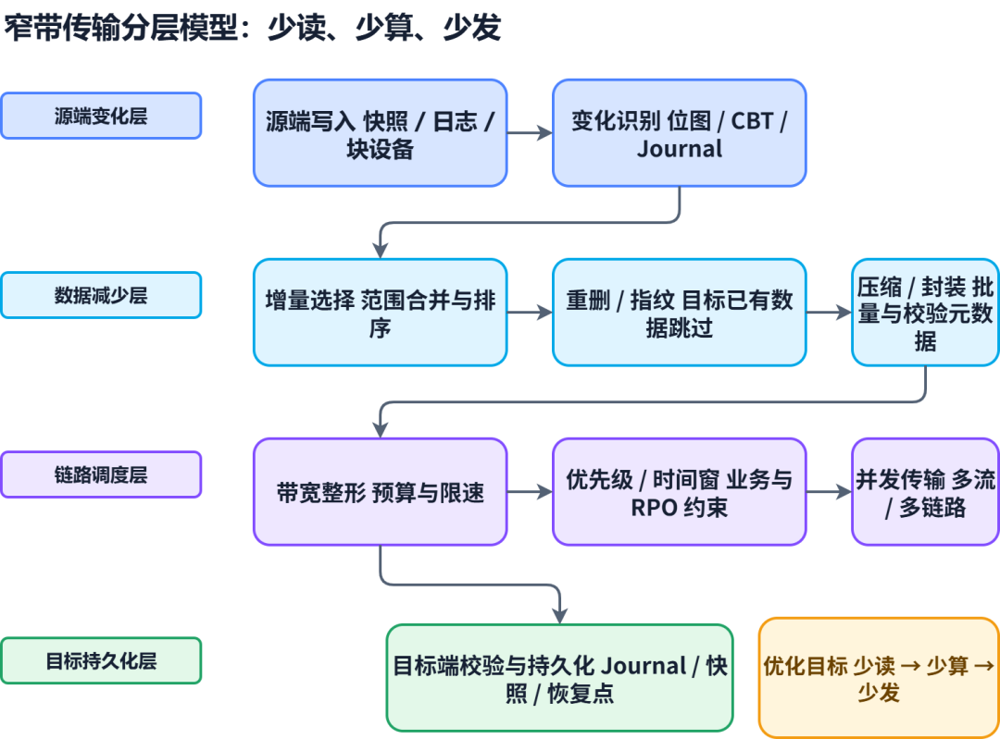
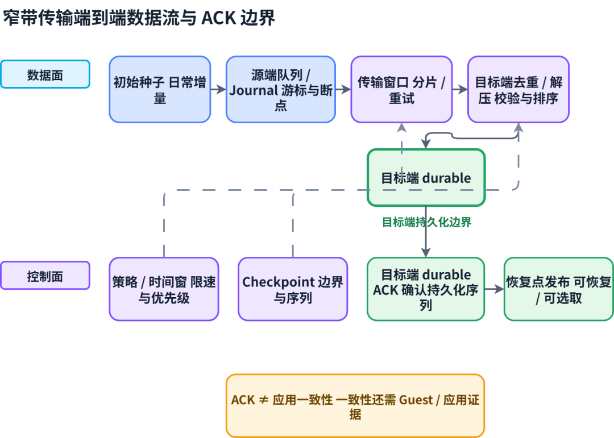
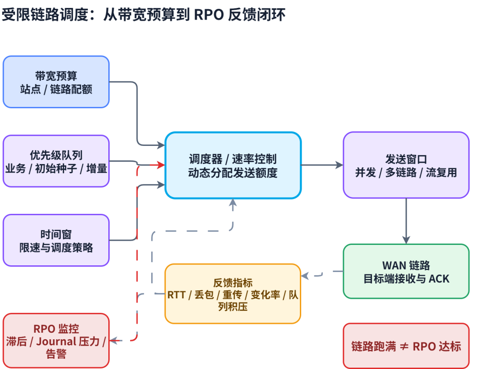
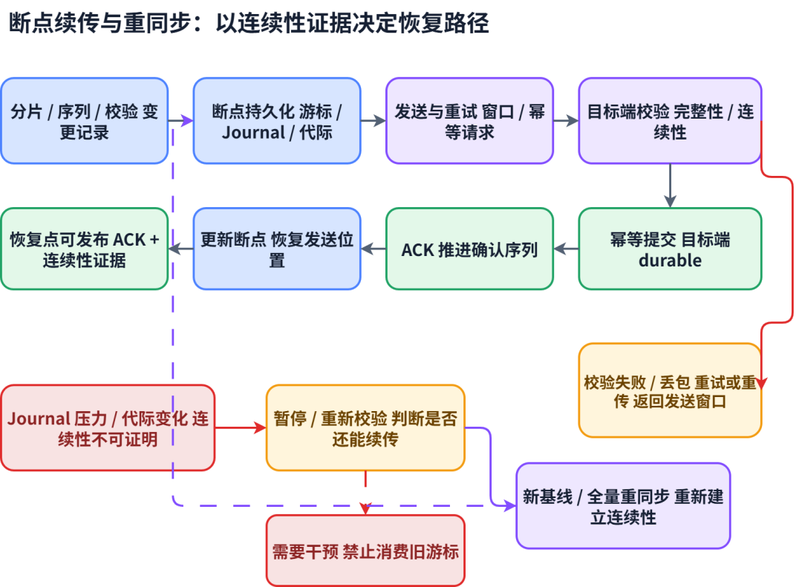

# 异地容灾窄带传输核心技术调研

> 覆盖对象：VMware Live Recovery/vSphere Replication、Zerto/HPE、Veeam、Commvault、深信服、H3C、华为、SmartX、ZStack 及相关通用传输架构。  
> 有意识的范围扩展：增加 Rubrik、Cohesity、Nutanix，分别用于补充安全恢复/勒索场景、多站点数据保护平台和超融合原生复制维度。  
> 资料口径：优先采用厂商官方文档、技术白皮书和官方技术博客；行业材料仅用于补充背景，不作为关键结论依据。厂商未公开的压缩、重删、调度和队列算法，本文不作未经验证的推断。  
> 术语说明：本文所称“窄带”不是某个固定速率，而是指跨站点复制链路的可用带宽、时延、丢包或计费约束明显小于业务产生的待传输数据量，导致初始种子、日常增量或断链追赶受到限制的场景。

## 文档范围与阅读说明

本文聚焦异地容灾中的窄带传输核心技术，覆盖虚拟化原生复制、备份软件/数据保护平台、阵列与分布式存储复制、超融合/云平台保护，以及可叠加在复制链路上的网络优化组件。重点回答四个问题：数据如何识别变化，如何减少线上字节，如何在有限链路上调度，如何在中断或积压后保持可恢复性。

资料以厂商官方产品文档、技术白皮书、官方知识库和产品页为主；前版调研稿中的行业归纳和厂商补充内容已合并，但对当前公开资料无法充分核验的算法、参数和版本行为，统一标记为“需 PoC/交付文档确认”。文中“支持”表示公开资料存在相应能力描述，不表示所有版本、许可证、工作负载和部署拓扑都能达到相同结果。

阅读时应将“存储容量缩减”“复制候选数据缩减”和“WAN 线上字节缩减”分开理解；也应把初始种子、断链追赶、稳态增量和故障切换/回迁分别验收。

## 摘要

异地容灾中的窄带传输，不是简单地把数据“压小后发过去”。真正决定方案能否稳定满足 RPO 的，是一条从变更识别到目标端持久化的完整数据路径：

  * 只读取发生变化的数据，而不是周期性重传完整磁盘或完整备份文件。
  * 在传输前过滤零块、未分配块、交换分区和已存在于目标端的数据。
  * 结合固定块、可变块、全局缓存、目标端指纹库或存储快照链减少重复传输。
  * 通过压缩、并发流、链路复用、优先级和时间窗把有效吞吐与业务高峰隔离开。
  * 在链路中断、丢包、重传和目标端落后时，能够断点续传、重建增量链并保持恢复点可解释。
  * 只有目标端确认数据和恢复边界已经持久化，才能把某个时间点标记为可恢复点。

从公开资料看，厂商方案大致分为四类：

  * VMware/Broadcom、Zerto/HPE 代表的虚拟化原生复制；

  * Veeam、Commvault、Rubrik、Cohesity 代表的备份软件或数据保护平台；

  * 华为、新华三代表的阵列/分布式存储原生复制；

  * Nutanix、深信服、SmartX 代表的超融合或云平台原生保护；

上述厂商都使用“增量、压缩、重删、限速”等术语，但实现层次和一致性边界不同，不能只按宣传的“带宽节省比例”比较。

本文的核心结论是：窄带场景必须把“初始种子”和“稳态增量”分开设计，把“链路可承载速率”和“恢复点年龄”分开监控，并把 requested RPO 与 achievable RPO 明确区分。若平均产生的有效变更长期高于链路可传输能力，任何压缩或限速策略都只能延缓落后，不能从根本上消除落后。

## 结论速查

评审问题| 快速判断| 进一步阅读  
---|---|---  
首轮数据量很大| 先建立可靠 Seed，再让专线承载增量；不要用稳态吞吐推导首轮完成时间| 1.2 传输阶段、5.1 初始种子  
需要低 RPO 或时间轴回退| 先看 Journal/Checkpoint 或数据库日志语义，再比较压缩比| 3.2 Zerto/HPE、6.1 选型路线  
异构虚拟化、物理机和云混合| 优先比较变化识别、线上数据缩减、应用一致性和回迁能力| 3.3–3.4 软件路径、6.2 PoC  
备份副本、长期保留、专线较窄| 重点验证缓存/DDB 冷启动、实际线量和长断链恢复| 3.3–3.6 数据保护平台  
安全恢复、勒索或历史点完整性优先| 复制带宽之外，还要验证不可变、隔离恢复、旧点跳过和整组恢复证据| 5.11 业务可用性、6.2 PoC  
Nutanix 原生平台| 优先核对 Async/NearSync/Metro 的版本、距离和复制线量；不要与 ZStack 的 CDP 口径混用| 3.7 Nutanix  
ZStack 原生平台| 公开资料对线上压缩、限速和重同步披露有限，必须以实际 `wire_total_bytes` 和接管 PoC 为准| 3.12 ZStack  
高 RTT、丢包或首轮极窄| 同时测量并发、窗口、重传、CPU 和 backlog，不能只看 Mbps| 2.5 并发、5.9 高 RTT  
  
## 1\. 窄带传输的分层模型

### 1.1 从业务写入到目标端落盘

一次跨站点复制通常经过以下路径：

  *   *   *   *   *   *   *   *   * 

    
    
     生产写入  -> 变化识别（CBT / bitmap / journal / snapshot diff）  -> 无效块过滤（zero / unallocated；swap / excluded files 视产品能力可选）  -> 重复检测（目标端指纹、全局缓存、历史恢复点）  -> 压缩与加密  -> 分块、排队、并发流与带宽整形  -> WAN 传输、校验与重传  -> 目标端重组、写入快照或副本  -> durable ACK、恢复点发布

在同一个复制周期内，设原始变化量为 Δraw，过滤掉的无效数据比例为 z，重删命中比例为 d，压缩后的剩余比例为 c，协议和元数据开销为 m，重传字节为 retransmitted\_bytes，可用传输时间为 T\_window\_seconds，则工程估算可以写成：

  *   *   * 

    
    
    wire_payload_bytes ≈ Δraw × (1 - z) × (1 - d) × c  wire_total_bytes ≈ wire_payload_bytes + m + retransmitted_bytesrequired_bandwidth ≈ wire_total_bytes × 8 / T_window_seconds

图 1：从源端变化识别、数据缩减和链路调度，到目标端校验与持久化的分层关系。

这里的 z、d、c 都不是固定常数：数据库日志、加密文件、压缩文件和随机写负载可能几乎无法再压缩或重删；不同站点的历史数据、快照链和重删字典也会影响 d。该公式只是工程估算的简化线性模型，z、d、c 还受处理顺序和数据分布影响，并非相互独立；例如重删先消除重复结构后，剩余数据的可压缩性可能发生变化，不能把单项测试比率直接相乘作为精确预测。wire\_total\_bytes 应明确包含或排除协议开销和重传，所有变量必须按同一复制周期统计。因此，采购和 PoC 不应直接把“逻辑写入量”当作“链路流量”，也不应把单次测试的压缩比当作长期承诺。

### 1.2 四类传输阶段

阶段| 主要数据| 窄带风险| 关键技术  
---|---|---|---  
初始种子（Seed）| 完整 VM、卷或备份基线| 需要数天甚至数周，且期间增量继续产生| 物理搬运、局域网预复制、目标端已有数据复用、限速并发  
追赶/重同步（Catch-up/Resync）| 断链期间和未完成周期的变化| 追赶流量与生产新增变化叠加，可能越追越慢| bitmap/journal、优先级、跳过已无效恢复点、断点续传  
稳态增量（Steady State）| 每个 RPO 周期内的变化块| 链路抖动导致恢复点年龄不断增长| 变更追踪、重删压缩、窗口调度、背压  
故障切换与回迁（Failover/Failback）| 反向变化、差异合并和新基线| 回迁方向不一定与生产方向对称，容易重新触发全量| 反向复制、差异回传、冻结边界、双向状态机  
  
初始种子和稳态增量必须分开验收。一个方案可以在日常增量阶段表现良好，但由于没有种子导入机制而无法上线；也可以很快完成初始同步，却在高峰期长期积压增量，最终无法满足实际 RPO。

### 1.3 传输质量的四个层级

窄带传输不仅要看“发了多少字节”，还要看这些字节是否形成了可信的恢复点：

层级| 关注点| 典型证据  
---|---|---  
数据量效率| 过滤、重删和压缩是否减少了线上的字节数| 原始变化量、候选块量、重删命中量、压缩后字节数  
链路效率| 并发、窗口、重传和限速是否使链路可控| 线速、有效吞吐、丢包率、重传率、连接数  
副本完整性| 目标端是否收到并正确写入全部依赖块| chunk hash/CRC、重传记录、目标端写入确认  
恢复语义| 该副本能否按业务时间点恢复| checkpoint、组 barrier、恢复点年龄、实际一致性等级  
  
“带宽利用率低”不一定是问题，也可能意味着大量数据被目标端重删命中；“链路跑满”也不一定是好事，可能代表重删失效、压缩关闭或重传过多。运维指标必须同时展示逻辑吞吐和线上吞吐。

### 1.4 窄带场景的核心指标

建议至少采集以下指标，并按站点、保护组、VM/卷、复制方向和时间窗拆分：

  * 原始变化速率：`raw_changed_bytes/sec`。
  * 候选传输量：过滤无效块之后准备参与重删的字节数。
  * 重删命中率：目标端已存在或全局缓存命中的字节占比。
  * 压缩后字节数与压缩比：区分逻辑压缩比和线上实际压缩比。
  * 线上总流量：`wire_total_bytes/sec`；另行记录协议开销和 `retransmitted_bytes`，避免重复计算。
  * 复制积压：积压字节数、最老未保护变化的年龄、最新目标恢复点年龄。
  * RPO 达标率：实际恢复点年龄超过目标 RPO 的时间比例。
  * 重同步次数：全量重同步、部分重同步和断点续传次数。
  * 链路质量：RTT、丢包、抖动、连接重置和窗口利用率。
  * 资源代价：源端/目标端 CPU、内存、缓存、临时空间和元数据数据库延迟。

## 2\. 窄带传输的核心技术机制

### 2.0 四类通用技术

不同厂商的产品名称不同，但窄带传输能力大体可以归纳为四类：

技术类别| 典型机制| 主要目标| 关键验收点  
---|---|---|---  
数据缩减| 变化块、零块过滤、重删、指纹、压缩| 减少进入传输队列和 WAN 的数据量| `raw_changed_bytes`、候选量、重删命中量、压缩后字节数、`wire_payload_bytes`  
传输优化| 多线程/多流、TCP 窗口、链路复用、代理与缓存| 提高高 RTT 或受限链路的有效吞吐| 有效吞吐、RTT、丢包、重传、CPU、并发公平性  
调度与整形| 站点/集群限速、保护组优先级、时间窗、QoS| 将链路预算分配给更重要或更新鲜的保护任务| 最低保障带宽、队列等待、优先级反转、峰值行为  
韧性与恢复| Seed/Pre-seed、Bitmap/Delta Sync、断点续传、重同步| 避免断链后重复全量并维持恢复点边界| 断链恢复时间、重同步数据量、恢复点完整性、回迁语义  

图 2：数据面负责传输和目标端持久化，控制面负责策略、检查点、durable ACK 与恢复点发布。

这四类能力不是互相替代关系：压缩无法替代变化追踪，限速无法解决长期有效变更量超过链路能力，断点续传也不能掩盖目标端副本未持久化的问题。

### 2.1 变更追踪：少读、少算、少发

变更追踪决定复制层首先要处理多少数据。常见机制包括：

机制| 工作方式| 优势| 窄带风险  
---|---|---|---  
CBT/RCT/bitmap| 记录自上次检查点后被写入的块| 适合 VM 周期性增量，开销较低| 快照链、迁移或平台异常后可能失效，需要重建或全量校准  
Snapshot diff| 比较相邻快照或卷版本的块映射| 与存储快照天然结合| 快照链过长、合并和读放大可能拖慢追赶  
I/O journal| 按写入顺序记录变化，保存一段时间| 可提供连续时间轴和更细恢复点| Journal 容量、写入速率和保留时间决定抗断链能力  
存储元数据/有效块识别| 跳过精简卷中从未分配的块| 初始同步和稀疏卷效果明显| 依赖存储格式和平台集成，异构环境难以复用  
  
VMware vSphere Replication 官方资料说明，系统会跟踪源虚拟磁盘变化，并在网络恢复后继续复制；同时支持按 VM 启用网络压缩。Veeam 在复制路径中还会过滤重复块、零块、交换文件块和排除的 Guest 文件。SmartX 公开资料则披露了目标端按数据块计算指纹、跳过未变化块，以及根据 ZBS 卷元数据跳过未分配块的机制。新华三 UIS 云备份资料也公开说明其通过卷复制识别有效块和无效块。

这类能力的工程判断标准不是“支持增量”四个字，而是需要确认：变化标记的粒度、标记失效时的回退方式、重同步是否需要全量扫描、目标端是否能复用已有数据，以及快照合并对生产 I/O 的影响。

### 2.2 重删与指纹：让目标端已有数据不再上 WAN

窄带场景下，重删通常比单纯压缩更重要，因为它可以直接消除已经存在于目标端的字节。常见路径有：

  * 同一 VM/卷内重删：识别同一对象内重复块，适合虚拟机模板、重复文件和克隆数据。
  * 历史恢复点重删：将当前增量与目标端已经存在的恢复点比较，避免重复发送历史数据。
  * 全局缓存/全局重删：跨 VM、跨任务或跨工作负载复用指纹和数据块，适合多业务共享的备份池。
  * 目标端指纹确认：源端只发送指纹或候选块，目标端确认缺失块后再请求数据，适合目标端掌握完整数据索引的架构。

固定块实现简单、索引稳定，但插入或删除会造成后续块边界整体偏移；可变块或内容定义分块对数据移动更友好，但计算和索引成本更高。目标端重删依赖指纹数据库、缓存和历史链的健康状态，不能只测“重复数据很多”的理想样本。

Veeam WAN Accelerator 采用源、目标两端组件，结合网络压缩、多流上传、全局数据重删和可变块重删。低带宽模式会使用目标端全局缓存；高带宽模式采用更快的压缩和摘要处理方式，不使用全局缓存，并要求两端模式匹配。Veeam 官方资料还明确指出，WAN 目标通常使用更小的数据块以获得更高的重删率。

Commvault DASH Copy 通过目标端 Deduplication Database（DDB）做签名查询，只发送目标端没有的块，并可通过增加目标 DDB 的预读/签名查询并发来提高链路利用率。其官方 FAQ 同时说明，重删后线上的数据量会低于非重删任务，因此不能仅凭网卡利用率判断 DASH Copy 是否“跑满”。

Cohesity 公开白皮书将全局重删与跨站点复制结合，并披露了多站点复制、并行数据传输和元数据感知同步等方向。具体算法、参数和版本支持仍需以当前版本文档和 PoC 为准。

### 2.3 压缩：减少字节，但会消耗 CPU

压缩通常位于分块之后、加密之前或由产品内部自动决定。评估时要区分三种能力：

  1. 存储压缩：减少目标端容量，不一定减少线上字节。
  2. 传输压缩：直接减少 WAN 上的字节，但增加源端和目标端 CPU。
  3. 重删后压缩：先消除重复块，再压缩剩余块，通常比单独压缩更适合窄带。

压缩对文本、空块和重复结构明显有效，对已压缩文件、加密文件和高熵数据库页效果有限。压缩级别越高不一定越好：当链路足够快而 CPU 紧张时，轻量压缩可能让端到端复制时间更短；当链路极窄而 CPU 有余量时，提高压缩比才可能更有价值。

VMware 官方资料支持按 VM 启用网络压缩，并在容量规划资料中提示启用压缩会增加主机 CPU 资源消耗。华为 HyperReplication 文档明确说明，链路压缩可以节省复制链路带宽，但会占用两端设备更多 CPU，建议在业务负载较轻、带宽不足时启用。深信服公开超融合资料披露了增量传输和多层数据压缩能力，但没有公开足够的算法细节，不应据此推导固定压缩比。

另一个常见陷阱是加密顺序：如果数据在重删/压缩前已经被随机化加密，重复检测和压缩比通常会显著下降。安全设计应采用传输通道加密、受控的端到端加密和目标端加密的组合，并明确每一层的顺序、密钥位置和性能代价。

### 2.4 带宽整形、优先级与时间窗

带宽整形至少存在四个控制层级：

层级| 控制对象| 典型优点| 典型缺点  
---|---|---|---  
网络交换机/虚拟交换机| 端口组、队列、平均/峰值速率、突发量| 对所有流量统一生效，适合平台原生复制| 不知道哪个保护组更重要，容易误伤业务流量  
站点/集群| 一个站点到所有目标的总复制量| 便于保护专线和多个目标| 集群内部任务之间的公平性依赖产品实现  
保护组/任务| 按 VM、VPG、SLA 或作业分配| 可以优先保障核心业务| 配置数量多，容易出现策略冲突  
时间窗| 工作时间低限速、夜间提高速率| 贴合业务高峰和维护窗口| 可能造成夜间拥塞或任务堆积  
  
VMware 当前公开 KB 说明，vSphere Replication Appliance 本身不提供直接带宽限速，需要在复制端口组上通过 vSphere Traffic Shaping 配置平均带宽、峰值带宽和突发大小；也可以结合 vSphere Distributed Switch 的 Network I/O Control 做资源隔离。Zerto 支持站点级带宽限制，并按 VPG 优先级自动分配；还支持按时间段改变限速策略。Rubrik 采用集群级限速并支持定时覆盖，带宽由集群节点动态分配，但其官方文档提醒限速会作用于复制端口上的全部相关流量。新华三 ONEStor 异步复制公开了低、中、高、最快等速率档位，深信服公开资料披露了可配置的带宽使用方案。

窄带调度应当把“保护优先级”和“恢复点新鲜度”放在同一个策略里：核心业务优先获得最低保障带宽；普通业务允许延迟；归档或低优先级副本在专线不足时暂停。限速不是越细越好，过多的独立队列会造成调度开销和小流量碎片化。

图 3：带宽预算、优先级、时间窗和并发发送由反馈指标共同约束，链路利用率不直接等于 RPO 达标。

### 2.5 并发、流复用与多链路

高 RTT 链路如果只有单个串行流，TCP 窗口和往返确认可能成为瓶颈，因此多数产品会提供多流上传、并发数据搬运或多条复制链路。并发的收益来自隐藏 RTT、提高链路填充率和利用多核 CPU，但并发过高会造成：

  * 源端随机读、指纹计算和压缩争用，反而降低有效吞吐。
  * 目标端 DDB、快照写入或元数据锁争用。
  * 多个保护组互相抢占带宽，核心业务的 RPO 反而不稳定。
  * 链路丢包时同时触发大量重传，形成拥塞崩溃。

Veeam WAN Accelerator 公开提供多流上传和上传流数量配置；Cohesity 白皮书披露了并行数据传输；华为存储规划资料要求按复制链路和业务峰值进行容量规划，并支持多链路组网。厂商没有公开统一的“最佳并发数”，实际值应由 RTT、BDP、CPU、磁盘、保护组数量和丢包率共同决定。

### 2.6 断点续传、重试与重同步

窄带链路不稳定时，可靠性主要取决于是否能继续未完成的传输，而不是每次断链后重新开始：

  * Veeam 官方文档说明，WAN 连接短暂中断时可以从断点继续传输；连接长时间中断后，会启动新的数据传输周期，并通过工作快照和合并控制快照链长度。
  * VMware vSphere Replication 官方 FAQ 说明，网络恢复后会继续复制网络中断期间被追踪的变化。
  * Rubrik 官方文档说明，复制任务会在网络问题后重试；当有限带宽无法完成所有复制任务时，可能跳过较旧快照，以确保较新的数据先复制到目标端。
  * H3C ONEStor 允许在业务压力较大或链路带宽不足时分裂复制关系，暂停同步；但分裂期间主从数据会不一致，恢复同步前必须明确积压和完整性边界。
  * SmartX 的公开案例说明，在 100Mbps 专线场景下，先把灾备集群放到生产机房完成初始复制，再搬迁到灾备机房并进行增量复制，是解决种子阶段窄带问题的工程手段。

重试策略应保存 transport\_epoch、chunk 序号、源端快照/日志位置和目标端 durable ACK。仅靠“从某个时间戳继续”无法处理快照合并、反向复制和部分写入场景。

图 4：只有在断点连续性可证明时才继续消费旧游标；Journal 压力、代际变化或连续性不可证明时，应暂停校验并建立新基线或全量重同步。

### 2.7 校验、重传与传输安全

窄带链路上的数据完整性至少要覆盖：

  1. 源端分块校验，保证读取的数据与源快照一致。
  2. 线上传输校验，发现 bit flip、丢包重组或中间设备异常。
  3. 目标端写入前校验，避免损坏数据进入缓存、重删库或恢复点。
  4. 恢复时校验，确认快照链、元数据和应用日志可以共同使用。

Veeam 官方资料明确披露了源、目标 WAN Accelerator 之间的 CRC 校验：目标端重新计算校验和，发现不一致时请求源端重发数据块。Rubrik 公开文档说明其复制数据在传输中使用 TLS；VMware vSphere Replication 则支持启用复制流量加密，但官方 FAQ 也指出未启用时复制数据并非默认加密。新华三 UIS CDP 产品页公开列出压缩、加密和在线重复数据删除能力。

压缩、重删和加密的组合必须同时验证安全和数据效率。启用加密后需要重新测量 wire\_total\_bytes，并确认目标端能够在密钥服务不可用时安全地恢复或明确失败，而不是将不可解密的数据误标为可用恢复点。

### 2.8 恢复点与一致性边界

窄带传输不能替代应用一致性。应用一致性、写入顺序和跨 VM 一致性仍然需要 VSS Writer、数据库原生协议、Guest agent、保护组或存储一致性组参与。传输层要做的是：

  * 为同一一致性组维护同一个 barrier 或 checkpoint。
  * 不把尚未完整发送的组边界发布为可选恢复点。
  * 在目标端确认所有依赖 chunk 和元数据持久化后，再推进恢复点索引。
  * 当链路断开或发生降级时，保存“最新已完整恢复点”，而不是仅保存“最新已开始传输点”。

因此，窄带方案应同时暴露 requested\_level 和 actual\_level，以及 requested\_rpo 和 actual\_rpo。如果链路不足导致恢复点变旧或应用一致性降级，必须显式告警并保留原因。

## 3\. 国内外代表厂商方案分析

### 3.1 VMware / Broadcom：虚拟化原生复制与网络层整形

机制概览

  * vSphere Replication 基于虚拟机和虚拟磁盘变化块进行异步复制，按 VM 配置 RPO。
  * 网络压缩可以按 VM 启用，复制流量可通过独立 VMkernel、vNIC、VLAN 或复制端口组隔离。
  * Broadcom 公开资料支持将已有副本磁盘作为 replication seed，避免重新传输完整磁盘；在特定重新保护路径中，持久化状态文件也可帮助避免完整初始同步。
  * vSphere Replication Appliance 本身不负责限速，当前官方建议在 vSS/vDS 上配置 Traffic Shaping，或使用 vDS Network I/O Control。
  * 源端变化在网络中断期间继续被追踪，链路恢复后再复制。

窄带优势

  * 直接利用 VMware 平台已有的变化追踪和 Guest 集成，适合 VMware 同构环境。
  * 网络层整形与复制层解耦，运维可以通过 vSphere 统一隔离复制流量。
  * 对小规模、变化率稳定的 VM 集合，部署复杂度低。

窄带限制

  * 带宽整形不是复制产品内的保护组级策略，核心 VM 与普通 VM 的公平性需要依靠虚拟交换机或外部网络设计。
  * 压缩会消耗源端 CPU，且网络中断后的追赶流量可能与新产生的增量叠加。
  * 种子校验本身可能需要对源、目标磁盘进行长时间扫描；超大 VM 的 seed 不是零成本操作，不能把“已有种子”直接等同于“立即完成同步”。
  * 多 VM 的业务一致性需要结合阵列一致性组、应用机制或上层编排确认，不能把每台 VM 的 RPO 直接理解为整套业务的统一时间点。

适用判断

适合 VMware 原生、站点网络可控、变化率可预测的环境。若链路极窄、需要按业务优先级调度或要保护异构平台，应评估 Veeam、Zerto 或阵列/HCI 方案补足传输控制能力。

### 3.2 Zerto / HPE：CDP Journal、VPG 与优先级传输

机制概览

  * 以连续数据保护为基础，将变化写入远端 Journal，并通过 VPG 把关联 VM 放入同一保护边界。
  * Checkpoint 和 Journal 提供时间轴式恢复选择，适合在链路抖动或安全事件中回退到更早时间点。
  * Zerto 公开文档提供站点级带宽限制、基于 VPG 优先级的自动分配和时间段限速。
  * Zerto 较早的公开最佳实践资料还披露了与窄带强相关的 bitmap sync、delta sync 和 pre-seeding 路径：当 VRA 内存缓冲跟不上、链路离线或链路饱和时，可先以 bitmap 记录变化；链路恢复后再读取变化块、压缩并复制。delta sync 则比较源、目标磁盘差异，只传输压缩后的差异数据，可用于预置种子、主机重启后的恢复和反向复制。
  * HPE 当前产品资料仍将其定位为面向 VMware、Hyper-V、云平台的连续复制、编排和恢复方案。

窄带优势

  * 连续复制和 Journal 可以把断链期间的变化保留在可追赶的数据结构中，不必完全依赖固定周期快照。
  * VPG 优先级比单纯的端口限速更贴近业务，适合核心数据库、应用和中间件分层保护。
  * 目标端保留时间轴，有利于在带宽受限时选择最近的完整 checkpoint 或攻击前恢复点。

窄带限制

  * Journal 空间和复制链路必须按变化率、保留窗口、RTT 和恢复目标规划；链路长期不足时，Journal 只能吸收有限时间的落后。
  * 官方公开资料重点披露持续复制、Journal 和带宽控制，压缩、重删和具体拥塞算法的细节并不充分，不能把 Zerto 的带宽配置等同于“自动降低数据量”。
  * 上述 bitmap/delta sync 资料版本较早，当前版本的 UI、参数和触发条件需要重新核对。Oracle 的 Zerto 部署指南直接描述 VRA 会根据 CPU 使用率自动调整压缩级别，并在需要时禁用压缩；WhatMatrix 的 Zerto IT Resilience Platform 7.5 对比条目提供了版本相关的第三方佐证。两者都不能替代 Zerto 当前版本的一手文档，VPG 级具体策略、自动关闭条件以及 swap disk exclusion 仍应作为 PoC/交付文档核验项。
  * 应用一致性仍需 Guest、VSS、数据库代理或应用脚本配合；写入顺序保真不等于数据库事务已经提交。

适用判断

适合对 RPO 和时间点恢复敏感的关键虚拟化业务。窄带项目必须重点验证 Journal 追赶、VPG 优先级、公平调度、链路恢复后的 backlog 清理速度和最老未保护变化年龄。

### 3.3 Veeam：WAN Accelerator、全局重删与断点续传

机制概览

  * 通过源、目标 WAN Accelerator 建立专用传输层。
  * WAN 加速组合使用网络压缩、多流上传、全局数据重删和可变块重删。
  * 低带宽模式使用目标端全局缓存；高带宽模式使用更快压缩、摘要处理和不同的重删路径，不使用全局缓存。
  * 复制路径会过滤重复块、零块、交换文件块和排除的 Guest 文件，并支持网络限速。
  * 传输阶段支持 CRC 数据块校验；短暂 WAN 中断可以从断点恢复，长时间中断则进入新的传输周期并管理工作快照。

窄带优势

  * 在专用备份/复制软件中，对窄带链路的“减少线量”能力披露最完整，既有压缩也有目标端缓存和可变块重删。
  * 适合跨 VMware、Hyper-V、物理机、云和多种备份目标的混合环境。
  * 断点续传和目标端 CRC 校验可以减少反复重传和损坏数据进入恢复点的风险。

窄带限制

  * WAN Accelerator 需要额外组件、缓存和摘要空间，低带宽模式的缓存预热、失效和重建会影响初期效果。
  * 高带宽模式与低带宽模式的重删路径不同，切换模式时需要重新规划摘要/缓存空间，不能只修改一个限速参数。
  * 传统快照型复制的 RPO 仍受作业调度、变化率和代理处理能力影响；秒级能力要单独核对 CDP 支持矩阵，不能由普通复制自然推导。

适用判断

适合通用异构保护、专线较窄且希望通过重删和压缩减少线上数据的场景。PoC 应同时测试首个全量、缓存预热后的增量、数据随机化后的压缩比、WAN 中断恢复和缓存失效回退。

### 3.4 Commvault：DASH Copy 与目标端 DDB

机制概览

  * DASH Copy/辅助复制面向备份副本在站点、介质代理或云之间的传输。
  * 源端为数据块生成签名，目标端 DDB 判断数据块是否已存在，只传输缺失块。
  * 官方文档提供目标 DDB 签名查询、预读链接和 DataMover 参数调优方向。
  * 网络带宽可以通过客户端和 MediaAgent 的发送/接收限速控制。

窄带优势

  * 目标端掌握全局 DDB 时，重复数据可以在传输前被消除，特别适合备份副本和长期数据保护。
  * 应用代理、IntelliSnap、数据库保护与 DASH Copy 可以组合，使应用一致性和数据缩减处于同一保护策略中。
  * 适合大型异构企业和多种存储/云目标。

窄带限制

  * DDB 是关键基础设施，签名查询、重建、封存和分区故障都会影响传输效率；DDB 不可用时可能出现降级或等待。
  * 不同目标介质之间如果需要重新水合、再次重删，可能增加 CPU、内存、磁盘和网络消耗。
  * DASH Copy 更偏向备份副本复制，不应直接当作低延迟 CDP 使用；实际 RPO 取决于备份/辅助复制调度。

适用判断

适合有较大备份池、多个异地副本和长保留需求的企业。验收时应区分 DDB 命中流量和真正发送流量，并测试 DDB 重建、目标切换和长时间链路中断。

### 3.5 Rubrik：SLA 驱动复制、集群级限速与最新点优先

机制概览

  * 以 SLA Domain 管理快照、保留和复制目标，支持 VM、数据库和云工作负载的复制策略。
  * 复制数据在传输中使用 TLS，网络问题触发任务重试。
  * 公开文档提供集群级复制限速、时间段覆盖和按节点动态分配的机制。
  * 当有限带宽无法完成所有复制任务时，系统可能跳过较旧快照，以优先复制较新的数据。

窄带优势

  * 策略模型简单，能够把带宽窗口、保护等级和复制目标放在同一个 SLA 体系中。
  * 最新点优先适合“当前数据新鲜度”优先于“每个历史快照都必须复制”的场景。
  * 集群级限速和复制流量图有利于运维观察实际带宽使用。

窄带限制

  * 跳过旧快照可能改善最新恢复点，但会改变目标端保留形态；若业务需要完整的时间轴，必须确认跳过策略和审计结果。
  * 限速按集群或端口生效时，不能只看单个作业的吞吐，需要确认同一端口上的其他复制流量是否也受影响。
  * 公开资料对复制路径中的重删、压缩和低层 chunk 算法披露有限，应把实际数据缩减比作为 PoC 指标。

适用判断

适合策略驱动的数据保护、勒索恢复和多工作负载复制。窄带项目应重点验证“最新点优先”与历史恢复点完整性之间的取舍。

### 3.6 Cohesity：全局重删、多站点复制与并行传输

机制概览

  * Cohesity 数据保护平台支持一对一、一对多、多对一和多对多的跨站点复制拓扑。
  * 官方白皮书将全局数据重删与复制结合，用于减少跨站点存储和网络需求。
  * 公开资料还披露了并行数据传输、元数据感知同步等数据迁移方向。

窄带优势

  * 数据保护集群天然拥有跨工作负载的索引和重删上下文，适合多个生产站点汇聚到一个灾备站点。
  * 一对多和多对一拓扑便于集中式灾备资源池建设。
  * 与快照、备份、恢复和安全恢复结合时，能够把窄带复制纳入统一策略。

窄带限制

  * 不同版本、存储目标和复制模式对重删、压缩、并行传输的支持细节可能不同，不能只依据早期白皮书推导当前版本行为。
  * 多站点共享目标端资源时，重删索引、元数据和网络调度会产生集中式瓶颈。
  * 复杂拓扑需要单独验证站点优先级、带宽配额和断链后的恢复顺序。

适用判断

适合有集中式备份池、多个异地目标和长期数据保护需求的企业。PoC 应覆盖多源汇聚、缓存冷启动、目标端重删索引压力和单站点故障恢复。

### 3.7 Nutanix：快照、子块压缩与原生多级复制

机制概览

  * Nutanix 原生 DR 基于快照复制，支持异步、NearSync 和同步/Metro 等不同 RPO 路径。
  * 官方技术资料披露，复制过程中可以进行子块级压缩，以提高效率并降低 WAN 带宽消耗。
  * 保护策略可以将相关 VM 作为组进行复制和恢复；公开资料覆盖 AHV、vSphere、Hyper-V 等平台的部分保护/恢复场景，但不应据此推导所有跨 Hypervisor 复制组合均受支持。
  * AOS 的数据压缩、重删和校验能力与复制路径的具体组合需要按版本和许可证确认。

窄带优势

  * 快照和保护策略在平台内集成，适合 Nutanix 原生环境的统一管理。
  * 子块压缩和数据缩减能减少重复快照复制的线上数据。
  * Async/ NearSync/ Metro 提供按业务分级的复制路径，便于把窄带链路留给非零 RPO 业务。

窄带限制

  * 同步和 Metro 不适合高 RTT、窄带异地链路；在远距离场景通常应选择异步或 NearSync，并接受 RPO 边界。
  * 公开资料对限速、重传队列和长期 backlog 的实现细节不足，项目必须按 AOS/Prism 版本核对。
  * 跨平台复制和应用一致性不应仅凭平台快照能力推断，需要确认 Guest、数据库和保护组支持。

适用判断

适合 Nutanix 原生资源池，希望通过平台内策略完成异地容灾的场景。对极窄链路和异构平台，建议结合专用备份或 CDP 产品评估。

### 3.8 华为：HyperReplication/A、链路压缩与阵列级带宽规划

机制概览

  * OceanStor HyperReplication 提供同步和异步远程复制；官方文档明确将异步复制定位于长距离或带宽较低的灾备场景。
  * 异步复制按周期批量同步变化数据，前台写入延迟不直接等待远端确认，但未同步数据在站点故障时可能丢失。
  * 支持链路压缩，官方文档明确说明压缩可以节省复制链路带宽，但会消耗两端设备 CPU。
  * 规划文档给出异步复制带宽估算原则：带宽至少覆盖峰值时段复制周期内的变化数据量除以复制周期，并要求按 RTT、丢包和链路冗余规划。
  * CLI/管理接口公开了同步速率和压缩开关等参数，部分型号支持复制链路并行组网。
  * 前版调研稿还补充了 eReplication/VRG 主机层容灾和 OceanStor Pacific 自适应重删/压缩的产品线信息；本次已核对的公开资料主要确认 HyperReplication/A 与链路压缩，前述能力的具体压缩/加密参数以及存储侧缩减与复制线量的直接耦合仍需按版本、许可证和交付文档确认。

窄带优势

  * 复制在存储控制器/阵列层完成，对 Guest 和上层虚拟化平台侵入小。
  * 异步模式适合长距离和链路受限场景，链路压缩可在设备侧统一执行。
  * 一致性组、保护组和阵列级顺序更适合大型数据库、裸金属或共享存储业务。

窄带限制

  * 异步模式仍有数据丢失窗口；压缩不能替代变更追踪和足够的复制带宽。
  * 复制两端型号、版本、许可、网络协议和存储兼容性约束较强，跨厂商复制通常不成立。
  * 同步复制对 RTT、距离、带宽和丢包要求高，不应误用于真正的窄带异地场景。

适用判断

适合华为存储和虚拟化生态内的两地三中心、数据库和阵列级灾备。验收重点是峰值变化率、压缩启用后的 CPU、复制积压、故障分裂和回迁方向。

### 3.9 深信服：异构容灾、增量传输与多层压缩

机制概览

  * 深信服公开超融合方案资料强调平台无关的灾备能力，可覆盖物理服务器、VMware、华为、新华三、Hyper-V 和公有云主机等来源。
  * 公开资料披露支持增量传输、多层数据压缩、可配置的带宽使用方案，以及灾备集群到主站点的差异回迁。
  * 前版调研稿另将深信服 WAN WOC 作为可独立评估的链路优化组件，关注流量整形、压缩、缓存、TCP 代理和重传；本文不把 WOC 自动视为超融合复制引擎的一部分，是否能直接作用于具体复制流量需要现场验证。
  * 其方案通常把灾备资源池、虚拟机恢复和复制编排放在同一交付体系中。

窄带优势

  * 异构迁移和灾备资源池适合 VMware 替代、信创改造和多平台集中保护。
  * 增量传输、分层压缩和带宽策略可以降低窄带下的初始压力和日常流量。
  * 支持差异回迁，减少故障演练或切换后把整机重新传回的成本。

窄带限制

  * 公开资料对块大小、指纹库、断点语义和重传协议披露有限，不能仅按“多层压缩”估算实际带宽节省。
  * 复杂数据库和多 VM 强一致边界需要结合应用代理、数据库原生复制或第三方 CDP 验证。
  * 异构平台支持矩阵、版本和许可证对实际可用能力影响较大。

适用判断

适合国内中型政企、信创替代和异构资源池。PoC 应重点测量初始同步、压缩 CPU、断链续传、回迁差异量和多 VM 恢复点一致性。

### 3.10 新华三：ONEStor 异步复制与 UIS CDP

机制概览

  * H3C ONEStor 提供块存储异步远程复制，支持复制链路、复制速率、定时策略和恢复策略管理。
  * 当业务压力较大或链路带宽不足时，可以分裂复制关系暂停同步；分裂后主从数据可能不一致，需要重新同步并确认副本完整性。
  * H3C UIS CDP 公开产品资料列出对 UIS CAS、VMware、Hyper-V 和国产虚拟化平台的无代理备份，支持数据库原生 API、压缩、加密、在线重复数据删除和并发任务。
  * UIS Backup 公开说明其基于卷复制识别有效/无效块。
  * 前版调研稿还提及 CDP Agent 的磁盘级变更块采集、多级快照链和实时同步；当前公开资料对这些实现细节展开有限，保留为版本与交付文档核对项，不把它们外推为所有 UIS CDP 版本的统一行为。

窄带优势

  * 存储复制和 CDP/备份能力可以覆盖从阵列级到 VM 级的不同业务。
  * 复制速率档位和定时策略便于把窄带链路与生产高峰隔离。
  * 在线重删、压缩、加密和应用原生备份为通用异构环境提供组合能力。

窄带限制

  * “分裂以避让带宽”本质上是暂停保护，不能被当作传输优化；必须监控分裂持续时间和最新可用恢复点。
  * 公开资料对自动追赶、失败重传和指纹索引细节披露有限。
  * 具体容灾模式与 H3C 存储、UIS、CDP 版本及许可证绑定，需要以交付文档和 PoC 为准。

适用判断

适合已有 H3C 服务器、网络、存储和 UIS 云平台的政企客户。验收时要分别验证 ONEStor 异步复制和 UIS CDP/备份路径的线上流量，避免把两者混为一种传输语义。

### 3.11 SmartX：VM 级增量复制、目标指纹与种子搬迁

机制概览

  * SmartX 原生容灾支持同步双活、异步容灾、CDP 与备份恢复等不同路径，产品边界随版本和联合方案变化。
  * 公开资料披露，源、目标集群完成过一次复制后，后续任务以增量方式传输；目标端对数据块计算指纹并与历史复制链比较，指纹相同则跳过传输。
  * 对精简置备卷，复制服务会根据 ZBS 元数据跳过未实际分配的数据块。
  * 公开案例给出了 100Mbps 专线的工程做法：在生产侧完成初始复制，再迁移灾备集群，之后只传输增量数据。
  * 产品公开资料还支持按 VM 配置复制周期、RPO 和复制窗口。
  * 前版调研稿提到自定义复制窗口、速率和负载均衡；其中具体限速粒度、跨 VM 公平性和长期积压调度，当前公开资料没有充分展开，应在 PoC 中补齐。

窄带优势

  * VM 级复制比整 LUN 复制更容易按业务颗粒度分配窄带链路。
  * 目标端指纹和未分配块跳过机制对重复数据、精简卷和长期增量有帮助。
  * 初始种子本地完成再搬迁的方式，对只有百兆级专线的项目具有工程可操作性。

窄带限制

  * 公开资料没有充分披露压缩算法、重传窗口、并发流和长期 backlog 调度，需要通过 PoC 补齐。
  * 原生复制与第三方 CDP、备份软件的恢复点语义不同，不能只按“支持容灾”比较。
  * 对数据库级应用一致性和跨 VM 强一致业务，仍需结合数据库原生复制或应用感知机制。

适用判断

适合 VMware 替代、国产化基础设施和轻量灾备资源池。对跨城市低带宽场景，应优先验证种子搬迁、增量指纹命中率、RPO 窗口和恢复演练。

### 3.12 ZStack：CDP/块数据复制与公开传输细节边界

机制概览

  * ZStack 官方灾备资料将快照、块数据复制、CDP、备份、容灾和双活列为不同保护路径，覆盖物理机、虚拟机、公有云和私有云等场景。
  * 官方产品页公开宣称支持秒级同步备份、智能重删和复制，并将其定位为降低网络压力的能力；这属于产品能力口径，不等于所有链路和工作负载都能达到相同 RPO。
  * ZStack Cloud 灾备服务文档同时包含定时增量备份、定时全量备份等路径，因此需要区分 CDP/块复制数据面与备份服务的数据面，不能把管理面异步或定时备份直接等同于窄带实时传输。

窄带优势

  * CDP、块数据复制和智能重删为异构云平台提供了从秒级保护到备份恢复的组合路径。
  * 平台化管理有利于把复制对象、恢复资源和业务编排纳入同一套策略。
  * 对已具备 ZStack Cloud 资源池的客户，可减少额外管理面的整合工作。

窄带限制

  * 当前公开资料对变化块粒度、线上压缩、带宽限速、并发流、断点续传、失败重传和重同步算法披露有限。
  * 前版调研稿提及“秒级 CDP、分钟级接管”等信息，但在未明确版本、工作负载、链路和验收口径前，本文不将其写成可承诺的 RPO 结论。
  * 需要特别核对智能重删发生在存储容量层、复制候选层还是 WAN 传输层；三者的节省效果不能混用。

适用判断

适合已有 ZStack Cloud、需要云平台内 CDP/异地灾备或异构资源保护的场景。PoC 应重点测量实际 wire\_total\_bytes、变化识别粒度、重删/压缩阶段、限速与优先级、短长断链恢复、重同步数据量和整组接管时间。

## 4\. 能力横向对比

> 说明：下表是技术调研口径的定性比较，不是采购评分。产品能力会随版本、许可证、部署模式、目标存储和工作负载变化；“公开资料未充分披露”不等于产品没有该能力，而是不能据此形成可审计的技术结论。证据强度标记为：实＝当前官方资料直接覆盖关键机制；部分＝官方资料覆盖部分能力，但版本或底层细节有限；待核实＝公开资料不足，需通过 PoC/交付文档确认。

厂商 / 产品| 证据强度| 证据来源| 主要传输底座| 变化识别与数据缩减| 带宽控制| 断链/积压语义| 窄带适配判断  
---|---|---|---|---|---|---|---  
VMware vSphere Replication| 实| VM-1、VM-2、VM-6| VM/虚拟磁盘异步复制| 变化块、按 VM 网络压缩| 复制端口组 Traffic Shaping / vDS NIOC| 变化继续追踪，恢复后继续复制| 适合同构 VMware；业务优先级需外部网络或编排补充  
Zerto / HPE| 部分| ZR-1、ZR-4、ZR-6、ZR-7| CDP Journal、VPG、Checkpoint| 连续变化复制；公开资料未充分披露重删细节| 站点级、VPG 优先级、时间窗| Journal 吸收有限时间的断链变化| 适合低 RPO；需严测 Journal 容量和追赶速度  
Veeam| 实| VE-1、VE-2、VE-3、VE-5| 备份/复制 Data Movers + WAN Accelerator| 过滤零块/重复块、可变块、全局缓存、压缩| 网络限速、上传流和 WAN 模式| CRC、短断点续传、长断链新周期和工作快照| 窄带数据缩减与恢复工程较完整  
Commvault| 实| CV-1、CV-2| MediaAgent、DASH Copy、DDB| 目标 DDB 签名、缺失块传输、重删| MediaAgent/客户端发送接收限速| 依赖 DDB、辅助复制和重试链| 适合备份副本和长期保留；DDB 是关键依赖  
Rubrik| 部分| RB-1、RB-2、RB-3| SLA Domain、快照/备份复制| 公开资料对复制缩减算法披露有限| 集群级、节点动态分配、时间窗| 重试；带宽不足时可能优先最新快照| 适合策略驱动和安全恢复；需确认历史点完整性  
Cohesity| 部分| CO-1、CO-2| 数据保护集群复制| 全局重删、压缩、并行/元数据感知同步| 版本和拓扑相关| 多站点复制，具体重试需按版本确认| 适合集中式多站点备份池  
Nutanix| 部分| NX-1、NX-2、NX-4| 快照复制、Async/NearSync/Metro| 子块压缩、平台数据缩减、快照复用| 公开资料需按版本确认| 由保护策略和复制模式决定| 适合 Nutanix 原生环境；远距离不宜选同步  
华为 HyperReplication| 实| HW-1、HW-3、HW-4| 阵列级同步/异步复制| 变化数据、链路压缩、复制组| 复制速率、链路压缩、阵列链路规划| 异步周期、分裂和重新同步| 适合华为存储生态和数据库/裸金属  
深信服超融合/灾备| 部分| SF-1、SF-2| 异构灾备资源池、增量复制| 增量传输、多层压缩| 可配置带宽方案| 支持差异回迁；细节需 PoC| 适合 VMware 替代与信创异构场景  
H3C ONEStor/UIS| 部分| H3C-1、H3C-2、H3C-3| 存储异步复制、CDP、备份| 有效块识别、重删、压缩、加密| 速率档位、定时策略、分裂暂停| 分裂后需重新同步并确认完整性| 适合 H3C 生态；需区分存储复制与 CDP  
SmartX SMTX| 部分| SX-1、SX-2、SX-3| VM 级快照/异步复制、灾备资源池| 目标指纹、增量复制、未分配块跳过| 复制周期、窗口；其他细节需 PoC| 支持种子搬迁后的增量追赶| 适合轻量资源池和 VMware 替代  
ZStack Cloud| 待核实| ZS-1、ZS-2、ZS-3| CDP、块数据复制、备份与灾备服务| 官方宣称智能重删；变化粒度与线上压缩需核验| 公开资料未充分披露，需验证限速、优先级与公平性| 断链、重传、重同步和接管边界需 PoC| 适合 ZStack 原生云平台；不应仅凭秒级宣传判断窄带 RPO  
  
### 4.1 资料版本与证据口径

厂商 / 产品| 评估版本或范围| 资料日期/版本状态| 证据类型| 当前有效性  
---|---|---|---|---  
VMware vSphere Replication| VMware Live Recovery/Live Site Recovery 8.x、9.x| Broadcom KB；版本混合| 官方 KB、FAQ、规划文档| 机制可参考；具体行为按当前 Live Recovery 版本核对  
Zerto / HPE| ZVR 7.5、8.0；Oracle 生态部署资料| 2017–2021 及页面资料| 官方/生态方文档、第三方对比| bitmap/delta/压缩可作线索；当前参数和 UI 需核对  
Veeam| Backup & Replication 13| 当前 v13 用户指南| 官方产品文档| WAN Accelerator 机制可作为当前版本基线，仍需按许可证和作业类型验证  
Commvault| v11、2023e、2024 资料| 版本混合| 官方产品文档、架构指南| DASH/DDB 机制可参考；参数按当前版本复核  
Rubrik| CDM 8.0、9.1、SaaS 资料| 版本混合| 官方文档| 限速/重试可参考；复制缩减和最新点策略需按版本复核  
Cohesity| 当前产品页与数据保护白皮书| 版本未统一| 官方产品页、白皮书| 拓扑和数据保护方向可参考；底层传输细节需 PoC  
Nutanix| NCI/DR 产品页、AOS/Prism 资料| 版本混合| 官方产品页、技术资料| Async/NearSync/Metro 方向可参考；跨平台和线上缩减需按版本确认  
华为 HyperReplication| OceanStor HyperReplication/A| 型号、版本按页面/设备| 官方规划文档、CLI/产品文档| 阵列复制和链路压缩可参考；型号许可需确认  
深信服| 超融合灾备、SD-WAN/WOC 资料| 版本/日期未统一| 官方方案资料、产品手册| 方案能力可参考；WOC 是否作用于复制流需现场验证  
H3C ONEStor/UIS| ONEStor 资料、UIS 7.0| 2024 文档、UIS 7.0| 官方产品页、交付文档入口| 存储复制/CDP 需分路径验证  
SmartX SMTX| 容灾产品页与 2024–2025 案例| 版本/案例口径混合| 官方产品页、案例/实践文章| 种子和增量路径可参考；指纹、并发和 backlog 需 PoC  
ZStack Cloud| Cloud 4.4.0、4.8.10 及当前产品页| 版本混合| 官方产品页、产品手册| CDP/备份路径可参考；线上压缩、限速和重同步待核实  
  
## 5\. 典型问题与工程陷阱

### 5.1 把初始种子当成普通增量任务

初始种子通常是最大的带宽峰值。即使压缩和重删有效，完整 VM/卷也可能在专线窗口内无法完成。应在方案设计阶段明确：

  * 是否允许备站集群临时放到生产侧完成首轮复制。
  * 是否允许通过备份介质、移动存储或离线导入建立基线。
  * 首轮复制期间新产生的增量由哪里保存，搬迁后如何接续。
  * 基线搬迁后的第一轮增量是否需要全量校验。

没有种子策略的“窄带容灾”往往只能停留在演示环境。

### 5.2 把压缩比当成固定承诺

压缩比随数据类型、块大小、压缩级别和 CPU 负载变化。数据库页、日志、已压缩归档和加密文件的压缩比可能远低于测试数据。验收应同时记录：原始变化量、重删后候选量、压缩后量、线上量和 CPU 使用率。

### 5.3 重删字典冷启动、失效和重建

全局缓存、DDB 和目标端指纹是窄带传输的关键状态。冷启动时的第一轮复制通常不能达到稳态重删效果；缓存被清理、索引重建、目标端切换或保护链重建后，也可能短期出现流量放大。必须有：

  * 字典/缓存空间容量规划。
  * 指纹库备份和重建时间评估。
  * 缓存命中率和字典失效告警。
  * 发生重建时的 RPO 保护策略，而不是静默回退。

### 5.4 加密顺序导致重删和压缩失效

如果在重删和压缩前对每个块使用随机化加密，目标端很难识别重复数据。应明确使用传输通道加密、端到端数据加密和目标端加密的边界，并在开启安全能力后重新测量线上流量和 CPU。

### 5.5 “链路跑满”不等于“RPO 达标”

如果复制任务已经把链路跑满，但新产生的变化量仍高于有效发送能力，积压会持续增长。此时需要监控“最新目标恢复点年龄”和“最老未保护变化年龄”，而不是只看 Mbps。实际策略包括：

  * 降低低优先级业务的保护频率。
  * 把核心业务放入独立保护组并配置最低带宽。
  * 在恢复点已经无业务价值时跳过旧快照，但必须记录这一决策。
  * 扩容链路、引入新的复制目标或改用数据库日志复制。

### 5.6 断点续传与重复传输没有证据链

每个 chunk 都应绑定源快照/日志位置、传输 epoch、序号、内容校验和、目标端 ACK 与最终应用结果。否则重试时可能重复写入、漏写依赖块或错误地把“发送完成”当成“恢复点持久化”。

### 5.7 以分裂/暂停解决带宽问题，却没有恢复门禁

暂停同步可以保护生产性能，但它也会扩大数据丢失窗口。分裂期间应明确：

  * 当前主从差异量和最老未保护变化时间。
  * 是否仍允许把目标端标记为可切换。
  * 重新同步是增量、快照回滚还是全量。
  * 重新同步完成前是否阻止故障切换和日志截断。

### 5.8 只测试平均带宽，不测试高峰变化率

带宽规划至少要包含工作日高峰、月末批处理、数据库批量导入、日志切换、勒索加密式高变更和快照合并等场景。建议用峰值变化率而不是日均变化率计算最低链路，并用真实工作负载验证压缩和重删效果。

### 5.9 高 RTT 和丢包下并发不是越高越好

增加并发流可以隐藏 RTT，但在丢包链路上会放大重传和缓存压力。PoC 应至少包含：低丢包高 RTT、突发丢包、短时断链、长时断链和目标端限速五类场景，并分别记录有效吞吐、重传、CPU 和 backlog。

### 5.10 回迁方向经常被忽略

故障切换后生产写入发生在灾备站点，回迁要求把灾备期间的变化反向同步回原生产站点。原方向的缓存、指纹、压缩策略和带宽预算不一定适用于反向路径。回迁前必须重新建立基线、确认冲突处理、验证反向差异量，并保留可回滚点。

### 5.11 复制数据完整不等于业务可用

恢复验证不能停留在目标端副本存在或 VM 能启动。应在隔离网络中验证数据库恢复、应用健康检查、DNS/证书/密钥、队列积压、关键交易和应用一致性检查，并记录恢复点的实际一致性等级。

## 6\. 选型与 PoC 建议

### 6.1 按场景选择技术路线

场景| 优先技术路线| 主要理由  
---|---|---  
VMware 同构、变化率稳定、链路可控| vSphere Replication + vSphere Traffic Shaping/NIOC| 平台原生，组件少，网络隔离清晰  
低 RPO、需要时间轴回退| Zerto/HPE CDP、数据库原生复制或存储同步复制| Journal/Checkpoint 或数据库日志更适合低 RPO  
异构虚拟化、物理机和云混合| Veeam、Commvault、深信服或 H3C UIS CDP| 适配面和应用代理比单一平台原生复制更重要  
备份副本、长期保留、专线较窄| Veeam WAN Accelerator、Commvault DASH Copy、Cohesity| 全局重删、缓存和压缩直接减少线上数据  
安全事件和勒索恢复| Rubrik、Cohesity、Commvault Cleanroom、Veeam 验证能力| 需要不可变、隔离恢复和恢复点验证，不只是复制快  
华为存储/数据库/裸金属生态| HyperReplication/A + 一致性组 + 应用原生保护| 阵列级复制侵入小，适合长距离异步复制  
H3C、SmartX、深信服超融合资源池| 平台原生异步复制 + 第三方备份/CDP 补充| 平台集成和成本较好，但复杂应用需补足  
ZStack Cloud 云平台、需要 CDP 或异构灾备| ZStack CDP/块复制 + 备份服务或外部保护平台| 先确认数据面、线量缩减和实际接管 RPO，再决定是否采用平台原生路径  
极窄链路且首轮数据量大| 物理/局域网种子 + 窄带增量 + 追赶调度| 先解决基线，再让专线只承载变化数据  
  
### 6.2 PoC 最小测试矩阵

任何声称适合窄带的方案，都应至少完成以下测试：

1. 初始全量：记录逻辑容量、实际读取量、线上字节、完成时间和源/目标 CPU。

2. 稳态增量：分别使用数据库、日志、随机写、顺序写、已压缩文件和加密文件。

3. 重删冷启动：清空或更换目标缓存后重新测试首轮和稳态命中率。

4. 断链恢复：测试短断链、长断链、反复断链和目标端短暂不可写。

5. 峰值变化：在业务高峰或批量导入期间观察 backlog 和实际 RPO。

6. 并发公平：同时运行多个保护组，验证核心业务是否获得最低带宽和正确优先级。

7. 降级路径：关闭 VSS/Guest agent、让 DDB/指纹库不可用、制造压缩 CPU 过载，确认系统是失败、告警还是可审计降级。

8. 完整性校验：注入丢包或损坏，确认检测、重传、目标端拒绝和恢复验证链路。

9. 故障切换与回迁：记录正向和反向差异量、基线重建、冲突处理和回迁窗口。

10. 整组恢复：验证数据库、应用、中间件、队列、DNS、证书和关键交易，而不是只验证单 VM 启动。

## 7\. 结论

窄带传输的核心不是单一的压缩算法，而是“变化减少 \+ 数据缩减 \+ 传输调度 \+ 断点恢复 \+ 完整性确认 \+ 恢复语义”组成的系统能力。代表厂商的主要差异可以概括为：

  * VMware/Broadcom 把变化追踪和复制放在虚拟化平台内，把带宽整形交给 vSphere 网络层。
  * Zerto/HPE 以 CDP Journal 和 VPG 优先级构建低 RPO 的连续复制时间轴。
  * Veeam 把 WAN Accelerator、全局缓存、可变块重删、CRC 和断点续传组合成专门的窄带数据路径。
  * Commvault、Cohesity、Rubrik 更强调备份副本、策略、全局索引、多站点和安全恢复，具体的数据缩减和“最新点优先”语义各不相同。
  * Nutanix、华为、新华三、深信服和 SmartX 更依赖平台/阵列/超融合内部的快照、复制、有效块识别和保护策略，集成度较高，但跨平台和底层算法边界更依赖版本与交付文档。
  * ZStack 把 CDP、块数据复制、智能重删和云平台资源恢复结合起来，但窄带传输层的公开细节相对有限，必须以实际线上字节、断链恢复和整组接管 PoC 作为结论依据。

最终选型应以实际 wire\_total\_bytes、backlog\_age 和整组恢复演练为依据，而不是以单次压缩比或产品宣传的链路速率为依据。对真正窄带的环境，最重要的工程顺序通常是：先建立可靠基线，再保证增量链不丢；先明确可达到的 RPO，再配置请求的 RPO；先保证恢复点完整，再讨论是否追求更高的带宽利用率。

## 参考资料

### VMware / Broadcom

  * \[VM-1\] Limiting Bandwidth for vSphere Replication Traffic
  * \[VM-2\] VLSR - Calculating Bandwidth Requirements for vSphere Replication
  * \[VM-3\] Isolating the Network Traffic of vSphere Replication
  * \[VM-4\] vSphere Replication FAQ
  * \[VM-5\] Network congestion during vSphere Replication delta sync
  * \[VM-6\] Using Existing Disks as vSphere Replication Seeds
  * \[VM-7\] vSphere Replication Filter and Full-Sync Checksum Optimization
  * \[VM-8\] Changing the Target Datastore with Replication Seeding

### Zerto / HPE

  * \[ZR-1\] Defining Performance and Throttling
  * \[ZR-2\] Zerto Platform Architecture Guide
  * \[ZR-3\] HPE Zerto Software
  * \[ZR-4\] Zerto Virtual Replication Journal: Overview, Sizing and Best Practices
  * \[ZR-5\] Zerto Protecting Oracle Databases Best Practices
  * \[ZR-6\] Oracle Zerto Deployment Guide
  * \[ZR-7\] WhatMatrix Zerto IT Resilience Platform 7.5 对比条目

### Veeam

  * \[VE-1\] WAN Acceleration
  * \[VE-2\] How WAN Acceleration Works
  * \[VE-3\] Global Data Deduplication
  * \[VE-4\] Data Block Verification
  * \[VE-5\] Data Transport on WAN Disconnect
  * \[VE-6\] Replication for Microsoft Hyper-V
  * \[VE-7\] WAN Accelerator Sizing

### Commvault、Rubrik、Cohesity

  * \[CV-1\] Improving Bandwidth Utilization with DASH Copy or Backups with Deduplication
  * \[CV-2\] Commvault Deduplication FAQ
  * \[CV-3\] Public Cloud Architecture Guide for Microsoft Azure
  * \[RB-1\] Rubrik Network Throttling
  * \[RB-2\] Rubrik Replication
  * \[RB-3\] Rubrik Network Utilization Graph for Replication
  * \[CO-1\] Cohesity Data Replication
  * \[CO-2\] Cohesity Data Protection White Paper

### Nutanix

  * \[NX-1\] Nutanix Disaster Recovery
  * \[NX-2\] Designing for Data Protection and Disaster Recovery in a Nutanix Private Cloud
  * \[NX-3\] Acropolis Advanced Administration Guide
  * \[NX-4\] Nutanix Disaster Recovery Solution Brief

### 华为

  * \[HW-1\] HyperReplication Planning
  * \[HW-2\] Creating a Synchronous Remote Replication CG
  * \[HW-3\] Creating a Remote Replication Pair
  * \[HW-4\] Remote Replication CLI Parameters

### 深信服、新华三、SmartX

  * \[SF-1\] 深信服超融合异构平台灾备方案资料
  * \[SF-2\] 深信服 SD-WAN 产品使用手册
  * \[H3C-1\] H3C UIS 7.0 超融合软件
  * \[H3C-2\] H3C ONEStor 异步远程复制
  * \[H3C-3\] H3C ONEStor 分布式存储软件
  * \[SX-1\] SmartX 容灾备份
  * \[SX-2\] SmartX 财务公司同城容灾案例：基于快照的复制数据量优化
  * \[SX-3\] SmartX 100M 专线灾备建设案例
  * \[SX-4\] SmartX 原生容灾能力与实践

### ZStack

  * \[ZS-1\] ZStack Disaster Recovery Solution
  * \[ZS-2\] ZStack Cloud 灾备服务（Plus）CLI 命令使用手册
  * \[ZS-3\] ZStack Cloud 备份任务使用教程