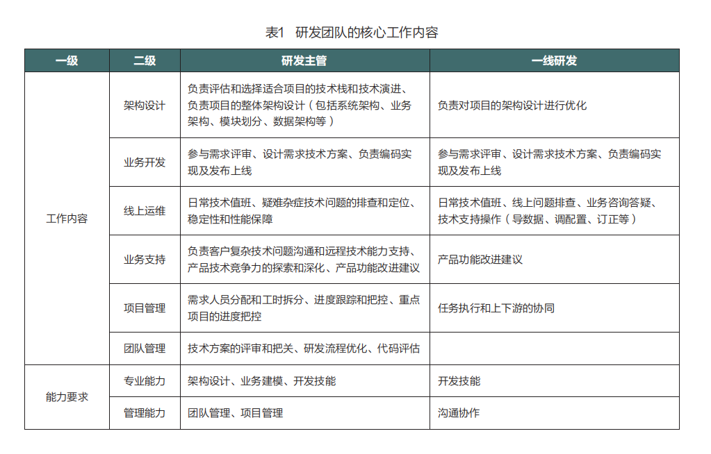
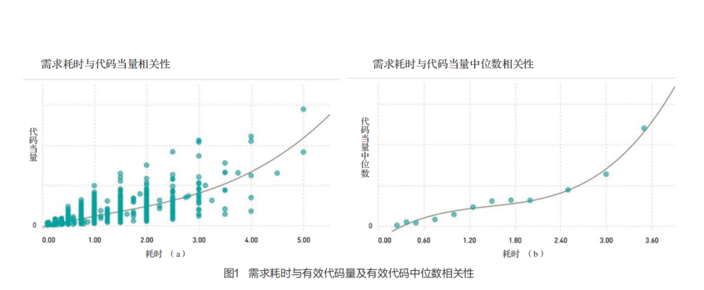
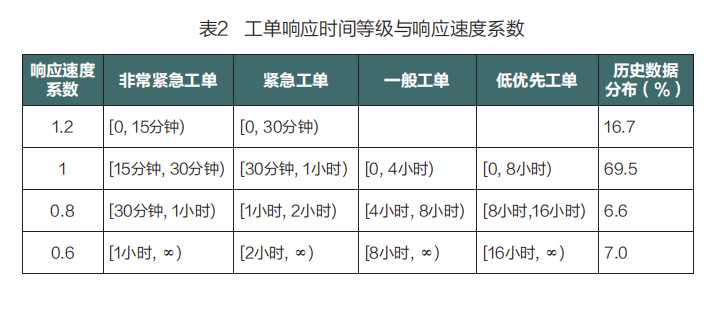
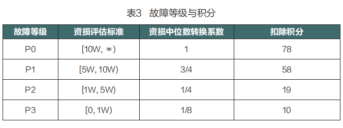
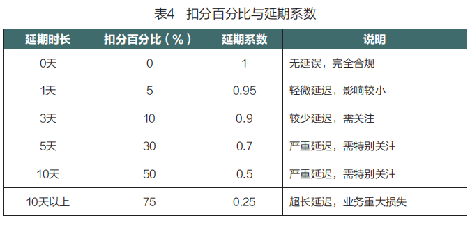
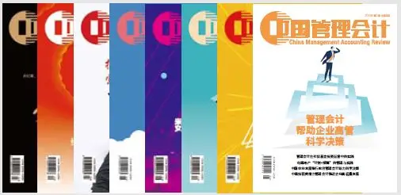

**本文载于《中国管理会计》2025年****第1期**  
**文**

  

**阮良** 网易集团

  

【摘要】随着高科技企业竞争的加剧，研发人员的绩效管理成为提升企业核心竞争力的关键。传统的主观评价方式存在一定的局限性，而基于量化指标的客观绩效评价能够更有效地反映研发人员的贡献。本文以网易公司为案例，探讨了其如何通过创新的积分制绩效管理体系提升研发团队的整体效能。通过对研发人员的工作量、需求优先级、复杂度、代码质量等多个维度进行量化评价，网易公司成功地建立了一个公平、透明且科学的绩效评价体系，并结合激励机制激发研发人员的积极性。实践表明，该体系显著提高了团队的需求产出量、交付速度及产品质量，并且通过数据驱动的方式促进了研发人员的持续成长。本文的研究为其他高科技企业在研发人员绩效管理与激励机制设计提供了有益的参考和借鉴。【关键词】高科技企业 研发人员 客观业绩评价 工作价值 积分制 激励机制**一、引言******高科技企业的发展高度依赖于人力资本，其核心竞争力体现在研发人员的专业技能、创新能力和团队协作中。与传统制造业不同，高科技企业的产出更多依赖于知识与创新，而非机械化生产与工人工作时长（ Teece, 1998）。人力资本作为企业发展的关键资源，尤其是在以技术和创新为导向的高科技企业中，其重要性不言而喻（黄钰昌和陆怡, 2020）。在高科技企业中，研发工作的复杂性和创新性决定了绩效考核体系需要能够准确捕捉员工的多重贡献。与传统的主观评价体系不同，客观的业绩评价可以通过量化指标来提高评价的精确性和公平性，从而实现资源的有效配置。近年来，越来越多的企业尝试通过引入量化指标来改善主观考核体系，确保评价的灵敏度（sensitivity）和精确度（precision），以更好地反映员工的实际能力与贡献（Banker and Datar,1989）。灵敏度衡量的是员工努力和企业经营业绩关系的紧密与直接程度。在分权制组织中，合适的高灵敏度指标有助于员工选择正确的行动方案，能够激励员工采取价值创造的行动（Bouwens, 2024）。指标的精确度表示指标中噪声大小的程度，噪声大的指标会导致业绩评价无法准确反映员工的表现，其工作成果可能会被扭曲。当考核指标的灵敏度越高时，绩效评价指标越好，被评估对象对企业的实际贡献就越大。当考核指标的精确度高时，被评估对象的努力程度往往也会更高。因此一个指标的灵敏度和精确度越高，其在激励机制设计中的权重也应更高（Banker and Datar, 1989）。在理想情况下，企业希望使用既精确又灵敏的绩效指标，但是在实际执行中，绩效考核指标的设计往往和这一目标有所偏离。以传统度量代码量最简单的指标——代码行数为例，其中蕴含的假设是代码均有效且体现了员工的努力程度。但是代码行数容易受到代码风格、换行习惯、注释、格式化操作等的干扰，简单的复制粘贴、移动代码块等操作会产生大量的行数增删变化，稳定性和对抗性较弱。因此网易以此为基础创新了“有效代码量”指标，比“代码行数”指标具有更高的灵敏度和精确度。高科技企业在设计绩效评价体系时，面临的一个主要挑战是如何将员工的软实力进行量化。例如，沟通能力、团队协作、创新能力等“软指标”在传统的评价体系中往往缺乏客观标准，导致评价结果易受主管主观判断的影响（Ittner, Larcker and Meyer, 2003）。因此，如何设计出一套既能反映员工实际贡献，又能避免评价偏差的考核体系，对于提升企业整体效能具有重要意义。本文以网易公司为案例，探讨了如何通过建立客观的业绩评价体系来改进研发人员的绩效管理与激励机制。通过引入积分制，网易公司对研发人员的工作贡献进行了更为精准的量化和评价。希望本文的研究可以为其他高科技企业在绩效评价与激励设计上提供借鉴，帮助其在激烈的市场竞争中提高研发团队的整体效能。**二、案例背景：网易公司的挑战******网易公司自 1997年成立以来，已成为中国领先的互联网企业之一，业务涵盖互动游戏、音乐、在线教育、传媒、企业服务等多个领域。伴随着中国互联网行业的快速发展，网易在保持创新的同时，也逐步转向精细化管理以应对当前经济环境的挑战。尤其是在企业服务板块中，研发人员的比例和研发费率始终处于较高水平。然而，网易公司在研发人员的绩效评价与激励设计中也面临着诸多挑战。（1）业务关联度不足：传统的绩效评价方式未能充分与业务目标对接，难以满足企业运营效率提升的需求。（2）主观评价占主导：过多依赖研发主管的主观判断，导致评价标准缺乏一致性，影响了评价的公平性。（3）评价颗粒度较粗：评价指标聚焦于大模块任务，缺少对日常工作的细化考量，难以全面反映员工的实际贡献。（4）激励与评价的时效性较低：绩效评价周期较长且滞后，员工的努力和贡献无法得到及时反馈，削弱了激励效果。为了有效解决上述问题，网易公司探索并实施了一套创新的积分制绩效管理体系。该体系旨在通过对研发人员工作价值的客观量化评价，提升评价的公平性和科学性，并通过与激励机制的紧密结合，最大限度地激发员工的积极性和创造力。以下部分将详细介绍该管理体系的设计和实施过程。**三、网易研发人员积分制的设计********（一）研发人员工作价值分析******自 2023年起，在探索研发人员绩效管理机制的过程中，网易公司以企业服务业务（网易易盾）的研发团队为试点，对研发人员的工作内容及其价值贡献进行了详细分析。这一过程的核心目标是确保绩效考核能够真实、全面地反映研发人员的实际贡献，从而为后续的量化评价提供科学依据。研发团队主要由一线研发工程师和研发主管组成，其核心工作内容如表１所示。

通过对研发人员时间分配的分析发现，一线研发人员约80%的时间集中于需求实现与工单处理上，而这些内容具有较强的客观量化潜力。相比之下，研发主管因其工作职责的多样性和复杂性，难以通过单一的量化模型全面衡量。因此，网易公司选择首先对一线研发人员（如后端开发、前端开发、QA等）实施积分制试点。在明确了主要工作内容后，网易公司将研发人员的工作价值分为两大类：● 正向价值：主要体现在产品和业务需求的完成，以及工单的及时处理。● 负向价值：包括工作中出现的Bug、线上故障、代码质量问题、需求延期等。为了实现对正负向价值的精确量化，网易公司通过一系列量化模型和工具，将研发人员的贡献转化为可计量的积分。接下来的内容将详细介绍这些模型的设计原理与实际应用。**（二）价值积分模型******1.需求积分模型 需求积分模型的核心目标是量化研发人员在产品与业务需求开发中的贡献，从而为业绩评价提供精确的数据支持。这一模型以管理会计的成本与收益分析为理论基础，将需求的各维度因素转化为可量化的价值指标，进而为研发人员的工作价值赋分。研发人员完成需求开发，就如制造工厂完成客户产品订单，将需求研发活动视为一种“成本驱动作业”，可以从工作量、紧急度、重要度、复杂度和质量要求五个维度构建需求价值评估体系。（1）工作量衡量——量化指标和相关性分析。工作量是需求积分的基础维度，其核心在于量化研发人员为完成需求所付出的实际劳动量。工作量约等于交付可运行功能代码的耗时，如果能够找到有效代码量和时间成本的关系，就能推导出有效代码量和积分的关系。为了消除代码行数等传统度量方式可能带来的偏差，网易采用了基于抽象语法树（AST）计算的“有效代码量”指标。该算法通过深度代码分析，识别重复代码、第三方库、自动生成代码等干扰因素后，计算出有效代码量。利用网易易盾业务历史开发数据，并对有效代码量和耗时进行相关性分析，得出有效代码量和时间有相关性，且中位数与耗时显著相关，符合代码多、耗时多的常规经验。相关性分析如图１所示。

通过回归分析，最终发现多项式回归方法拟合出来的曲线，与研发经验符合。至此，我们得到了一个多项式函数，通过该函数，输入有效代码量，即可得到耗时，即可得到积分值。通过归一化处理使分值在0~5分的区间。以上衡量方法，虽然无法做到每个需求耗时计算准确，但是拉长到一个月以上周期后，通过误差分析，发现与研发人员预估耗时方差很小。至此，我们找到了需求价值模型中工作量的量化方法。（2）紧急度和重要度衡量。紧急度与重要度被整合为需求的“优先级系数”。按照产品经理设定的优先级，需求被分为P0（最高）、P1、P2和P3四个等级，并赋予相应的权重系数（P0为1.2，非P0为1.0）。这一维度的引入体现了管理会计中的资源配置优化理论，通过权重差异引导研发资源向最高优先级任务倾斜。（3）复杂度衡量。复杂度反映需求实现的技术难度，由研发主管在需求评审阶段对任务复杂度进行标记。具体标准包括：● C2级0分：简单需求，技术方案明确，开发路径清晰。● C1级0.5分：非C0和C2类需求。● C0级1.5分：复杂需求，当需求评审或者技术评审中出现主管没有实现思路且需要安排可行性分析类需求或者主管认为方案难度较高且方案进行了反复讨论类需求的场景。通过这种细化的评分体系，模型体现了作业成本法中对不同复杂程度作业的区分，确保资源分配的合理性。（4）质量要求衡量。质量要求对应需求的服务等级，取项目管理系统上的应用等级即可。需求如果涉及多个应用，则挑选涉及应用的最高的服务等级。质量要求打分标准如下，无须人工打分，自动判断加分：● P2级0分：基本质量要求，满足基本功能需求即可；● P1级0分：有一定的质量要求，需要满足高可用性、可维护性和易用性等方面的需求；● P0级0.25分：较高的质量要求，需要满足所有方面的功能、性能、安全、可靠性和可扩展性等需求。该维度的设计融入了质量成本理论（cost of quality），通过引导研发人员关注高质量需求，降低潜在的故障与返工成本。（5）需求价值积分公式。基于以上维度的度量，网易公司设计了以下需求价值积分公式：单个有代码需求积分=优先级系数×（工作量积分+复杂度积分+质量要求积分）单个无代码需求积分=优先级系数× \[工作量积分（人天评估方式）+复杂度积分\]其中，无代码需求指诸如方案设计、机房迁移、故障演练等没有代码产出的需求，工作度量采用技术主管人天评估与事后校验的方式进行。2.工单积分模型工单积分模型旨在对研发人员在解决日常问题及客户服务中的表现进行量化，从而实现研发团队的公平激励，并推动整体服务质量的提升。该模型以管理会计的服务成本与激励相结合的理念为基础，通过积分体系激励研发人员主动参与工单处理，优化工单响应效率，并引导员工降低非生产性工作量。（1）模型设计与维度分析。● 基础积分：每个工单被赋予固定的基础积分，用以衡量工单处理的基本价值。根据历史数据，网易公司测算出平均每个工单的处理时长为1小时，基础积分设置为0.125分。通过将标准化作业赋予成本权重，实现工单处理的基础价值量化。● 响应速度系数：响应速度系数用于衡量研发人员对工单的响应效率，并以加权的方式鼓励更快的响应。根据服务级别协议（SLA），工单的响应时间被分为多个等级，数值如表2所示。

● 分配系数：工单处理可能涉及多人协作，为确保积分分配的公平性，模型引入了分配系数。具体而言，工单积分按照实际参与人数平均分配，分配系数为1/参与人数。这种设计避免了过多重复计算，同时鼓励团队内部的协作与分工优化。（2）工单积分公式。工单积分=Σ（基础积分×响应速度系数×分配系数）通过该积分模型，网易公司不仅实现了对研发人员工单处理工作的精准量化，还借助积分的激励效应引导研发人员优化工单响应流程。例如，为了减少工单处理时间，员工会主动推动技术培训、开发运维工具，以降低工单数量与复杂度。此外，低分值设定在一定程度上减少了研发人员对工单工作的依赖，从而将更多资源投入到高价值需求中，形成良性循环。工单积分模型充分体现了管理会计理论在研发管理中的应用，既平衡了效率与成本，又通过数据驱动的方式强化了研发团队的服务意识并提升了工作质量。3.Bug积分模型Bug积分模型通过固定积分制对研发人员在Bug修复工作中的贡献进行量化。测试环境中的Bug每个计为0.1分，不包含需求缺陷。这一设定基于Bug的重要性较低，修复工作量相对可控。线上环境中每个Bug计为0.6分，较测试环境Bug积分更高，这是因为线上环境的问题更紧急且对业务的影响更大。研发人员主动发现的线上Bug不计入积分，鼓励其自发提高质量意识。测试环境和线上环境Bug积分计算公式如下：测试环境Bug积分=Bug个数×0.1线上环境Bug积分=Bug个数×0.64.故障积分模型故障积分模型依据故障等级及其影响范围对研发人员的故障处理能力进行量化评价。故障积分基于公司故障处理与问责制度，参考历史数据确定积分权重。故障按照其资损价值和影响范围分为四个等级：P0级别故障为最严重的故障，影响和资损巨大；P1、P2、P3级别故障依次递减。扣除积分值由公司问责制度中相关等级影响的奖金扣除值和积分定价计算得出（见表3）。

5.代码质量系数代码质量系数旨在通过对代码的多维度分析，衡量代码腐化程度，防止系统维护成本上升。代码质量涵盖的范围比较广，实际应用中主要从函数重复率、函数复杂度、代码问题率（sonar）、函数注释率四个维度作为设计质量模型，将当前值与基线值进行比较，判断是否出现腐化，使用中通常以季度为周期计算统计。代码质量积分系数区间为 \[0.7-1\]，即最差情况下总积分减少30%，最佳情况下积分保持不变。每项代码质量指标的得分区间为 \[0, 1\]，4项按重要程度划分权重计算总分，比例为4∶4∶1∶1，即：代码质量分=函数重复率得分×0.4+函数复杂度得分×0.4+代码问题率得分×0.1+函数注释率×0.1最终代码质量系数公式为：代码质量系数=0.7+0.3×∑（指标项权重×指标项得分）6.需求延期系数需求延期交付会对业务运营造成负面影响，因此需要通过扣分机制进行有效管控，以惩罚延误并激励准时交付。公司根据网易易盾的历史延期数据与经验，设计了一套非线性扣分模型，其特点是延期越久，惩罚越重。单个需求延期扣分积分公式如下：需求延期扣分积分=需求积分×需求延期扣分百分比扣分百分比与延期系数对照如表4所示。

**（三）研发人员个人积分模型******研发人员的个人积分模型综合考虑了各类工作价值的表现，并通过权重与系数的调整确保评价的全面性与客观性。在一个考核周期内，研发人员的总积分涵盖需求积分、工单积分、 Bug积分、故障积分等多个维度，同时结合代码质量系数与需求延期系数对结果进行校正。最终设计积分公式如下：研发人员个人总积分=∑（有代码需求积分×需求延期系数）× 季度代码质量系数+∑（无代码需求积分×需求延期系数）+∑（工单积分）-∑（测试环境Bug积分）-∑（线上环境Bug积分）-∑（故障积分）该模型的特点是将正向贡献与负向贡献纳入统一的评价体系，通过量化和标准化规则，减少了主观判断的偏差，通过动态系数调整确保评价的精准性。**四、积分制下激励机制的设计******研发人员的工作业绩已经通过积分制较为客观地衡量和评价，因此可以围绕积分制设计相应的激励机制，以实现有效和及时的激励。激励机制的设计参考了销售体系的激励方式，除固定收入外，还设计了基于个人积分的浮动收入（奖金），使员工的收入与其工作绩效挂钩，激励其持续提升工作效率和质量。**（一）积分定价******积分定价的原则是确保员工的努力与其获得的收入成正比，同时兼顾企业的激励预算，主要基于以下几点： ● 预算分配：公司需要根据整体绩效激励预算，确定总预算中用于浮动收入的部分。● 正常绩效积分总量：预算周期（年度）内，假设所有研发人员每人做出公司预期的正常贡献，各种增减系数为1，整个研发团队的绩效积分之和为总量。● 积分单价计算：积分单价=浮动收入总预算 / 正常绩效积分总量。经过计算，正常单位积分与工作时间高度等价。于是可以设定1积分锚定等于1人天的奖金价值，积分价值公式如下：1积分价值=研发团队浮动收入总预算÷ \[12（月）×21.75（月工作日）×研发团队人数\]**（二）奖金方案******● 激励周期：年度奖金转变为季度奖金，积分按照当年固定价值结算，季度发放。若有超额利润或超额组织绩效奖金，可做年终奖的额外分配。 ● 奖金额度：季度奖金与积分直接挂钩，由积分定价和个人季度积分总数确定。产出越多、积分越多、奖金越多。参考销售激励制度，将积分奖金设计成阶梯模式，不同阶梯对应的积分奖金系数也不同，且积分等级越高，奖金系数乘积越高。● 及格线：根据团队过往绩效分布情况以及积分制运行情况设置最低及格线，积分未达及格线的奖金为0。及格线会根据数据修正，原则上确定及格线后1年内保持不变。个人休假情况除外。● 预算控制：积分奖金不受组织绩效影响，无论组织绩效如何，积分奖金如期发放。研发团队积分奖金总额可超过年度浮动奖金预算。**（三）额外激励******● 实时看板：提供研发人员积分看板，T+1结算积分后，研发人员可以登录积分查询系统查看自己的个人积分总量情况、排名情况、各维度积分以及每天积分情况，以及代码质量模型各维度数据情况。 ● 全员表彰：季度/年度对积分排名第一的研发人员进行公开表彰，并对其他表现突出（单项积分最多）的研发人员进行表彰，并进行经验分享。● 股权/期权激励：对半年度和年度积分排名第一的研发人员进行额外的股权/期权激励。**五、积分制的实践结果******从 2023年第三季度开始，网易易盾研发团队正式启动积分制管理制度及其相应的激励机制试点工作。经过两个季度的实践和调整后，积分制在研发团队中取得了显著成果。**（一）研发团队效能提升******衡量研发团队的效能，主要从 “需求产出量”“要求交付速度”“产品质量”“时间成本”四个维度来对比。首先是需求产出量，网易易盾工程团队2023年第四季度需求吞吐量创历史新高，增长26%，人均需求吞吐量创历史新高，增长23.7%。其次是需求交付速度，每个迭代的需求交付率接近100%，基本杜绝了需求延期交付问题，对研发上游团队和客户来说，交付体验变好，说到更能做到。需求平均开发时长创历史新低，降低了13.5%，需求交付更快。再次是产品质量，测试环境缺陷密度环比降低20%，线上环境缺陷密度环比降低17.3%，保持稳中向好趋势。最后是时间成本，2023年第四季度需求平均开发时长创历史新低，研发人员会自觉压缩预估时间，多排需求，时间降低13.2%，平均单个需求开发更快，单需求研发时间成本降低10%以上。更可喜的是彩蛋需求逐步增加，平均每迭代认领的彩蛋需求占比约为7.7%。这些彩蛋需求是需求池中未被排期的需求或者需要紧急插入当前版本迭代的需求，按照以前的做法，此类需求会走迭代需求置换，而积分制后是能接就接，减少了重新排期等沟通成本。从四个维度的数据指标结果上看，执行积分制带来了效能的显著提升，在保证质量的前提下，首半年团队效能提升在30%左右。进入2024年，经过数据统计，网易易盾研发团队效能比积分制管理之前提升最终达到了40%左右，并稳定维持至今。**（二）敬业度、满意度提升******积分制通过客观指标来量化研发人员的工作成果和贡献，减少了传统主观评价中可能存在的偏差和不公平现象。公平的绩效评价增强了员工对组织的信任，激励员工更加努力地工作。积分制明确了积分与奖金之间的关系，使员工清楚地知道付出与收益之间的对应关系，实时反馈机制让员工对未来的激励充满期望，从而提高了敬业度。 2023年底对员工的敬业度、满意度调查发现，网易易盾研发人员在敬业度和满意度上比2022年有较大提升。**（三）其他管理收获******积分制的实施，除研发团队效能提升和研发人员敬业度、满意度度提升之外，还带来了其他的收益： ● 产能有效管理：通过积分制，研发团队的产能得到了有效的衡量和管理。积分制使管理层能够清晰地了解每个研发人员的产出情况，从而根据业务需求量对研发团队的产能进行针对性的调整，实现扩容或缩容。这样，研发团队的利用率保持在一个很高的水平，避免了资源的闲置和浪费。● 研发团队结构：通过积分制的客观业绩评价，公司可以深入分析研发团队的结构合理性，及时发现和解决结构性问题。例如，通过绩效数据的积累，可以识别出某些团队中高职级成员配置可能过多的问题，从而采取措施进行优化配置，使团队的整体结构更加合理，资源的利用效率得到提升。● 人才自主涌现：积分制带来的公平、透明的绩效评价和有效的激励机制，激发了年轻研发人员的积极性和创造力，促使一批具有潜力的人才自主涌现。这些人才通常具备年轻、聪明、灵活的特点，擅长使用工具和方法提升自身效率。通过积分制，他们的努力得到了及时的认可和奖励，促进了他们的快速成长和发展。● 降低绩效管理难度：积分制大幅降低了技术主管在绩效管理方面的难度。由于积分制引入了客观、透明的评价标准，绩效管理过程变得更加简单和公平。技术主管无需在绩效考核时花费大量精力去解释主观评价的合理性，减少了管理上的摩擦和沟通成本，使整个绩效管理过程更加高效和公正。**六、总结与反思******网易公司实行的研发管理积分制通过量化研发人员的工作贡献，实现了对研发人员业绩的客观评价。通过引入工作量、紧急度、重要度、复杂度、质量要求等多个量化指标，公司建立了一个全面、客观、透明的评价体系。这种体系不仅提高了评价的准确性和公正性，也为管理层提供了更加科学、精细的决策依据。积分制通过明确的目标设定和反馈机制，激发了研发人员的内在动机和工作热情。研发人员可以通过积分直观地了解自己的工作表现和贡献，进而调整工作策略，提升工作效率和质量。同时，积分与奖金等激励措施的挂钩，进一步强化了这种正向反馈机制，促进了研发人员的持续成长和进步。 积分制在提升个人效率和团队效能的同时，还极大地降低了企业的机会成本。如案例实践成果，网易易盾实行积分制后需求彩蛋率提升，在保证正常需求100%交付的情况下能完成更多彩蛋需求，实现更多的经济价值或者更快地发现错误，这些都降低了企业的机会成本。另外，通过积分算法中的参数调整，企业能够引导研发人员朝向长期战略目标，不仅关注当下，还能着眼未来。积分制还有助于企业精准配置资源，优化研发团队结构，根据业务需求量对研发团队的产能进行针对性调整，避免资源的闲置和浪费。尽管如此，当前积分制也有其局限性。积分制的稳定运行依赖持续的、来源稳定且周期稳定的需求输入，这就要求研发的产品至少已经度过了市场验证阶段，进入持续上升或稳定运营的状态。所以目前网易的积分制管理并不适用于还处于创新创业、尚需要被市场价值验证的产品研发团队。而且积分制管理还没有覆盖到另两类研发人员：研究性研发人员（以算法工程师为主）和技术经理。前者工作产出的不确定性较大。研究性研发的目标往往是探索未知领域，尤其是在机器学习、人工智能等领域，算法的优化和创新涉及大量的实验性工作和持续的迭代，其成果的实现时间长、过程复杂且难以预测。而技术经理作为研发团队的领导者，其主要工作不仅是技术问题的解决，还包括团队管理、技术决策和跨部门协调，难以通过技术指标或代码量来衡量，其管理效能、决策能力及团队协作等“软指标”在现有积分制中往往得不到充分体现。未来，我们可以考虑对积分制进行进一步的延展和完善，如引入更多与创新性工作相关的量化指标，以量化其在前沿技术、创新算法、科研论文等方面的贡献。此类创新性评分不仅依赖于产出数量，还应结合技术难度、原创性等因素，形成更加精准且柔化的评价体系，以更全面地评价研发专家的工作贡献。公司还可以学习海尔集团“人单合一”的理念，把积分制进一步演化成“抢单积分制”，让研发人员能够跨小组、跨团队甚至跨业务抢单，完成更高效的资源配置。同时，探索将积分制应用于其他职能岗位，如销售、市场、人力资源等，以提升企业整体的管理水平和运营效率。通过不断优化和完善积分制，网易公司可以将其打造成为一种适用于高科技企业全员、高效、公正、透明的绩效管理体系。研发人员积分制不仅是一种工具性的管理手段，更是一种引领组织变革的哲学思维。通过创新性地结合量化评价与激励机制，网易公司探索出了一条适应高科技企业特质的高效管理路径。这一实践可为其他同类型企业在快速变化的市场环境中提升效率提供经验借鉴。积分制的成功推广将不仅限于个别企业或行业，还会为整个管理会计领域注入新思路与新动力，推动管理实践的持续创新与发展。参考文献\[1\] Bouwens J：《如何选择兼顾价值创造与激励的绩效指标》，载于《中国管理会计》2024年第1期。\[2\] 黄钰昌、陆怡：《人力资本为核心的企业绩效与激励设计的探讨》，载于《中国管理会计》 2020年第3期。\[3\] Banker R D, Datar S M. Sensitivity, Precision,and Linear Aggregation of Signals for Performance Evaluation\[J\]. Journal of Accounting Research, 1989,27\(1\):21-39.\[4\] Ittner C D, Larcker D F, Meyer M W. Subjectivity and the Weighting of Performance Measures: Evidence from a Balanced Scorecard\[J\]. The Accounting Review,\(2003\)78\(3\):725-758.\[5\] Teece D J. Capturing value from Knowledge Assets:The New Economy, Markets for Know-how, and Intangible Assets\[J\]. California Management Review, 1998,40\(3\):55-79.  

  

  

  
  

  

***cmar@esp.com.cn*****杂志投稿邮箱，期待您的参与！**  
**往期****精彩****回顾**[主题文章 | 全产业链企业财务数字化转型](http://mp.weixin.qq.com/s?__biz=MzI2OTc4MTAwMQ==&mid=2247488957&idx=1&sn=f53e3a7908c0274b06533306ef7e0cac&chksm=eada44dbddadcdcd26c74e1c7e7d87ee79d28b90a9da65351321ba11b33a893a4c490d4b9256&scene=21#wechat_redirect)  
  
  
[主编导读 | 管理会计与新质生产力：关系和作用](https://mp.weixin.qq.com/s?__biz=MzI2OTc4MTAwMQ==&mid=2247489314&idx=1&sn=e26852f664e3baf6795c36330b06be68&scene=21#wechat_redirect)[目录 | 《中国管理会计》2025年第1期](https://mp.weixin.qq.com/s?__biz=MzI2OTc4MTAwMQ==&mid=2247489303&idx=1&sn=3f871a3d8a1086791e2b1f09038f5718&scene=21#wechat_redirect)[对话 | 管理会计信息需求、层级架构及共享渠道](https://mp.weixin.qq.com/s?__biz=MzI2OTc4MTAwMQ==&mid=2247489279&idx=1&sn=190bd15377811e02e313896de619cab1&scene=21#wechat_redirect)[主题 | 管理会计报告助推公立医院高质量发展之探讨](https://mp.weixin.qq.com/s?__biz=MzI2OTc4MTAwMQ==&mid=2247489264&idx=1&sn=c2933996b69ee1ef32658715c129d7fb&scene=21#wechat_redirect)[主题 | 构建中国企业的赋能价值型财务分析体系--基于中国圣牧的实践](https://mp.weixin.qq.com/s?__biz=MzI2OTc4MTAwMQ==&mid=2247489250&idx=1&sn=1dba732f4552734ba74a96d44a08d1e0&scene=21#wechat_redirect)[主题 | 性化定制管理会计报告精准赋能企业决策--山西煤矿机械制造股份有限公司的实践](https://mp.weixin.qq.com/s?__biz=MzI2OTc4MTAwMQ==&mid=2247489229&idx=1&sn=ad325e37592c098d6d5c66ddd3ce0121&scene=21#wechat_redirect)  

  

 ***长按识别图中二维码*** 购买杂志

  

  

  

也可在天猫搜索**经济科学出版社旗舰店** ，进店购买。  

  

**订刊咨询电话：** 010-88191589 

**QQ 售后群：** 283247365（下载电子版订单） 

**订刊电子邮箱：** zhangliu@cfemg.cn

  

  
期待您的分享，点赞，在看！！！