# From SIMT to Systolic - A Foundation for GPU and TPU Architecture


A few weeks ago I left Meta's Triton compiler team for Google's PyTorch/TPU team. The move is what you'd expect: I spent years inside the GPU stack, wrote lowerings for Hopper and Blackwell, argued about warpgroup intrinsics, wrote thousands of benchmarks + dozens of tools, and now I'm staring at systolic arrays and asking why nobody calls them that in the docs.

This is the longest piece I've ever written. It's long on purpose. I wanted something that works for four different readers at once. If you've never thought hard about ML hardware, Part 1 is yours. If you know distributed training but not accelerator architecture, Part 2A and 2B carry you through both sides without assuming the other. If you're already fluent in CUDA and just want the TPU arc,  you will get a good refresh and then your TPU fix. If you write kernels or work on compilers, you'll get something out of the whole thing, and Article 2 is where the programming-model argument lives. I literally cant fit all the goodness in X's word limit on articles.

By the end of the series, I'll try to convince you that TPU is the better platform even for the thing GPUs were supposed to own outright, which is custom kernel authoring. That's a strong claim and I don't expect to win it on vibes. I will set up all your foundation below and by the end of our second article you will be convinced.

One last note before we start. I use both stacks. I still write Triton when the job calls for it or any other DSL. I still need GPUs to compare while building new ops in TPU. None of this is a religious war. It's a bet on which set of architectural choices compounds in my fact.

## Why accelerators exist at all

CPUs are shaped by a bet: most programs branch a lot, access memory unpredictably, and reward low latency on a single thread. So a modern CPU core spends most of its silicon on branch predictors, out-of-order schedulers, speculation machinery, and caches that work very hard to look fast to unpredictable code. The arithmetic units are tiny in comparison. A Xeon core can do impressive FLOPs, but the FLOPs aren't where the transistors went.

Then deep learning showed up. Modern ML workloads are shaped by a different bet. The dominant operations are contractions. Matmul inside fully-connected layers, matmul inside attention, batched matmul everywhere. These operations are predictable, loop-heavy, and spend almost nothing on branching. You know the loop bounds before you run. You know the memory access pattern before you run. You know the arithmetic intensity before you run.

If you stare at this long enough, you realize the shape of the ideal hardware is almost the opposite of a CPU. You want most of the silicon doing multiplies and accumulates. You don't need a branch predictor, because you don't have branches. You don't need speculation, because nothing is uncertain. You don't need giant caches (mostly), because the access pattern is a tiling of a dense array and you can stage it by hand.

Accelerators come from taking that observation seriously. NVIDIA took one path. Google took another. Both paths start from the same root fact: the workload is dominated by a handful of contractions, so the hardware should be dominated by matrix units. Everything else on the chip exists to keep those units fed.

On a GPU, we werent even originally fucking solving for any of this. Shaders and the rest happen to be a good staging ground for the future. For GPU the answer was to start from a parallel-threads substrate that was already good at graphics, add matrix engines called Tensor Cores inside each streaming multiprocessor, and let thousands of threads cover for the latency of getting data to those units. On a TPU, the answer was to throw out most of the scheduling machinery entirely, put a huge systolic array at the center of the chip, and have the compiler choreograph data movement around it so the array never starves.

Same observation, two philosophies. The rest of the article is about what happens when those philosophies compound across generations.

One axis underneath all of this is worth naming now. CPUs optimize for latency: make one thread fast. GPUs optimize for throughput through overcommit: make enough threads that you always have work to do. TPUs optimize for throughput through determinism: schedule every operation ahead of time and keep the pipe full by construction. Latency versus throughput, and inside throughput, overcommit versus determinism. Those are the three positions every accelerator architect is forced to pick from.

## The memory wall

Here's the fact that shapes every other choice in the article. Arithmetic is relatively cheap. Moving data is expensive. The gap is not small and it gets bigger every year.

A matrix multiply on a modern accelerator costs single-digit picojoules. A read from on-chip SRAM costs around an order of magnitude more than that. A read from HBM costs roughly 100× the energy of the multiply itself. A read from DRAM over the memory bus on a host CPU is another order of magnitude beyond HBM. And that's just energy. The time cost follows the same shape. The matmul is nanoseconds. The HBM access is hundreds of nanoseconds. The PCIe or NVLink trip is microseconds. The cross-datacenter hop is milliseconds.

Every architectural decision in this article is a response to that gap. You'll meet a bag of acronyms in in these articles and every one of them is a different way of saying "shorten the distance between where the data sits and where the math happens." Don't memorize the terms yet. Just know they're all answers to the same question.

You can frame the entire evolution of ML accelerators as a campaign to shorten the distance between data and math. The chip gets bigger. The memory gets closer. The network gets flatter. The compiler does more. And every generation, the ratio of FLOPs to bytes moved goes up, which means the software has to work harder to keep the machine fed.

The part that isn't obvious until you've seen it a few times: this isn't a problem you solve with more bandwidth. HBM has been getting faster every generation. It's still not fast enough. Ironwood's 7.37 TB/s of HBM3e per chip sounds absurd, until you notice the chip does over 4.6 PFLOPS of FP8, and then the ratio is still climbing. The bandwidth is not catching up. The ratio gets worse. You can't outrun the memory wall, you can only dance around it.

This is why tiling is the first thing anyone teaches when they teach kernel authoring. Tile your data. Move the tile once. Do as much math as you can on it before you move it again. Every optimization story on an accelerator eventually collapses into a data-staging story. The hardware makes the policy clear. The compilers, libraries, and handwritten kernels all end up encoding some version of the same rule: keep the data close to the arithmetic units for as long as possible, then spill it only when you absolutely have to.

Hold onto that rule. You'll see it show up  later. TMA is that rule. Producer-consumer warpgroups are that rule. `emit_pipeline` is that rule. The torus topology is that rule. Everything in this article is a variation on that theme, because the memory wall is the thing that won't leave.

## The arithmetic that matters

You can get very far with one idea from this section: arithmetic intensity is the number of floating-point operations you do for every byte you move. That's it. FLOPs per byte.

A matmul of two `[N, N]` matrices does on the order of `2N^3` FLOPs and moves roughly `3N^2` bytes (two inputs and one output, ignoring reuse). The arithmetic intensity scales with `N`. Bigger tiles, more math per byte moved, better. A pointwise add has arithmetic intensity of basically zero. You move two bytes, do one FLOP, write one byte. Bandwidth-bound no matter what.

The roofline model stitches this together. Plot arithmetic intensity on the x-axis and achieved FLOPs per second on the y-axis. You get two roofs. The flat roof is the peak compute of your chip. The sloped roof is the bandwidth ceiling: more intensity, more FLOPs per byte moved, closer to peak. Where the two roofs meet is the ridge point. Operations below the ridge are bandwidth-bound and you can't do anything about it except make the operation denser. Operations above the ridge are compute-bound and your problem is keeping the matrix units fed, not the bus.

There's a third regime nobody draws on the plot: issue-latency-bound. You have bandwidth, you have compute, but you can't launch instructions fast enough to use either. This is where GPU occupancy discipline comes from and where the TPU compiler's instruction-packing work pays off.

Concrete ridge points from HBM, because specifics make the model stick:

H100 SXM5: peak Tensor-Core BF16 of 1,979 TFLOPS over 3.35 TB/s of HBM3 gives a ridge point of roughly 591 FLOPs per byte.

TPU v5e: roughly 240 FLOPs per byte, derived the same way.

TPU v5p: roughly 166 FLOPs per byte. The pod scales bigger than v5e, but the ridge point is actually lower per chip because HBM bandwidth on v5p outpaces the BF16 peak.

TPU v6e (Trillium): roughly 560 FLOPs per byte. The big jump.

Two concrete numbers to carry forward. v5e needs a batch of around 240 tokens per replica in BF16 to sit above the ridge point from HBM. With int8 activations and bf16 weights that drops to roughly 120. On H100, you can get away with smaller effective batches because the ridge point interacts with deeper caches and more flexible scheduling. The TPU wants you to think about batch size. The GPU lets you get away with ignoring it longer, up to a point.

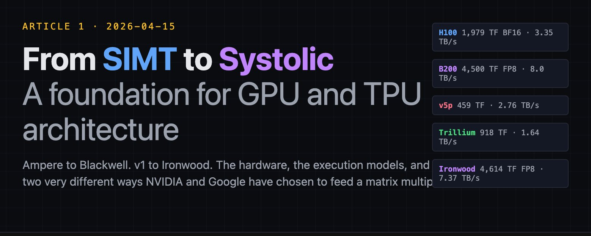

If you're going to remember one thing from this whole section, make it this: the ridge point tells you whether you're running a memory problem or a compute problem, and the answer changes what optimizations are allowed to help.

## Precision and dtypes

The other lever you have against the memory wall is precision. Every bit you don't move is a bit you don't pay for. So accelerators have been on a steady march downward in bit-width for almost a decade.

One mental model to carry before we walk through the names. The modern trick at the small end of the scale is microscaling: you store the numbers in a small format (four or eight bits), store a separate scaling factor per small group of values, and let the hardware multiply the scale back in during the math. The storage and bandwidth are dominated by the small format. The accuracy comes from the scales. Every sub-byte format you'll see below is a variation on that trick.

Training dtypes. FP32 is the old baseline. Dense, exact, expensive. TF32 is NVIDIA's invention: 19 bits of mantissa in an FP32 range, run through Tensor Cores, used as a drop-in replacement for FP32 on Ampere. BF16 is the dominant training dtype today. 8 exponent bits like FP32, 7 mantissa bits, so it keeps range and gives up precision. Every serious training stack from PaLM to Llama to current frontier models trains in BF16 with FP32 accumulation. FP16 predates BF16 and still exists, mostly for backwards-compat and inference. The exponent is too small for training without loss-scaling gymnastics, which is why BF16 displaced it on the training side.

Inference and small-footprint dtypes. Hopper introduced FP8 in two flavors: E4M3 for forward passes and inference, E5M2 for backward passes and gradient storage. The Transformer Engine on Hopper tracks activation statistics across steps and applies a scaling factor per tensor so FP8 doesn't numerically fall over. Blackwell extended this with NVFP4 (four bits, two-level scaling) and MXFP8 (microscaling in eight bits). INT8 is the long-running inference dtype on TPU; Trillium hits 1,836 TOPS of INT8 per chip (we'll meet Trillium in §2B.3). Ironwood moved native compute to FP8. The rest of the TPU lineage stayed conservative on precision until Ironwood because Google's bet was that careful compilation could extract most of the throughput from BF16 without needing sub-byte formats.

One historical note worth carrying. Every generation that jumped precision downward also jumped in customer adoption, because memory bandwidth is the constraint people actually hit and halving the bandwidth demand is more useful than doubling the peak FLOPs. The precision story and the memory-wall story are the same story.

## Three execution models

Accelerators have ended up implementing one of three execution models, and understanding all three is how you read the rest of this article without getting lost.

SIMD is the oldest. Single Instruction, Multiple Data. You have a lane count, you dispatch one instruction, every lane executes it on its own data. CPU SIMD (AVX, SSE, NEON) is this. Vector units on early GPUs were this. SIMD is lean because you share one instruction pointer across every lane, but it's rigid. If lanes need to do different things, you either mask them or you stall.

SIMT is NVIDIA's invention and the defining pattern of modern GPUs. Single Instruction, Multiple Threads. Picture a conductor leading a 32-person orchestra: one downbeat moves every musician at once, but each one reads their own part. That's SIMT. You write code that looks like it's running on a thread. The hardware groups threads into warps of 32 and runs the warp in lockstep under the hood, so it's effectively SIMD under the abstraction. But the programming model looks like threads: each one has its own program counter, its own registers, its own flow of control. When the threads in a warp need to do different things, you get warp divergence. The hardware serializes the branches, runs one path with the other lanes masked, then runs the other path. It works, but it costs throughput.

SIMT is why GPUs feel productive. You write kernels that look like parallel loops. The hardware handles the lockstep execution, the memory coalescing, the latency hiding through warp-level overcommit. You don't have to think about the physical lanes, most of the time. When you do, it's because you hit one of the sharp edges of the abstraction: warp divergence, uncoalesced memory accesses, register pressure, shared memory bank conflicts. These sharp edges are everything that makes GPU kernel optimization feel like a craft.

Systolic is the beautiful TPU answer. A systolic array is a two-dimensional grid of multiply-accumulate units wired together so that data flows through the grid like water through a mesh. Each cycle, every MAC unit takes a value from its neighbor, performs a multiply-add with a stationary weight (or streaming weight depending on the dataflow), and hands its result to the next neighbor. No instruction fetch per unit. No control logic per unit. Just a rhythm of data flowing through a grid of arithmetic.

The win is density. You can fit far more MAC units per square millimeter if each one doesn't need to fetch its own instruction or manage its own registers. A 256×256 systolic array has 65,536 MACs working in rhythm. The cost is rigidity: the array works at a fixed shape, and anything that isn't a matmul-shaped operation has to happen in the vector or scalar units beside the array. It's also why TPUs care so deeply about tile shapes. Pad too much and you waste the grid. Under-fill and you waste cycles.

You can see all three models in the same picture if you squint. SIMD is one lane of many, lockstep. SIMT is many lanes of many lanes, with a thread illusion on top. Systolic is a grid of fixed-function units, data flowing through in a choreographed pattern. SIMD wins for throughput on regular code. SIMT wins for productivity with still-good throughput on regular code. Systolic wins for density on matrix-shaped code. Every accelerator architecture is a mix.

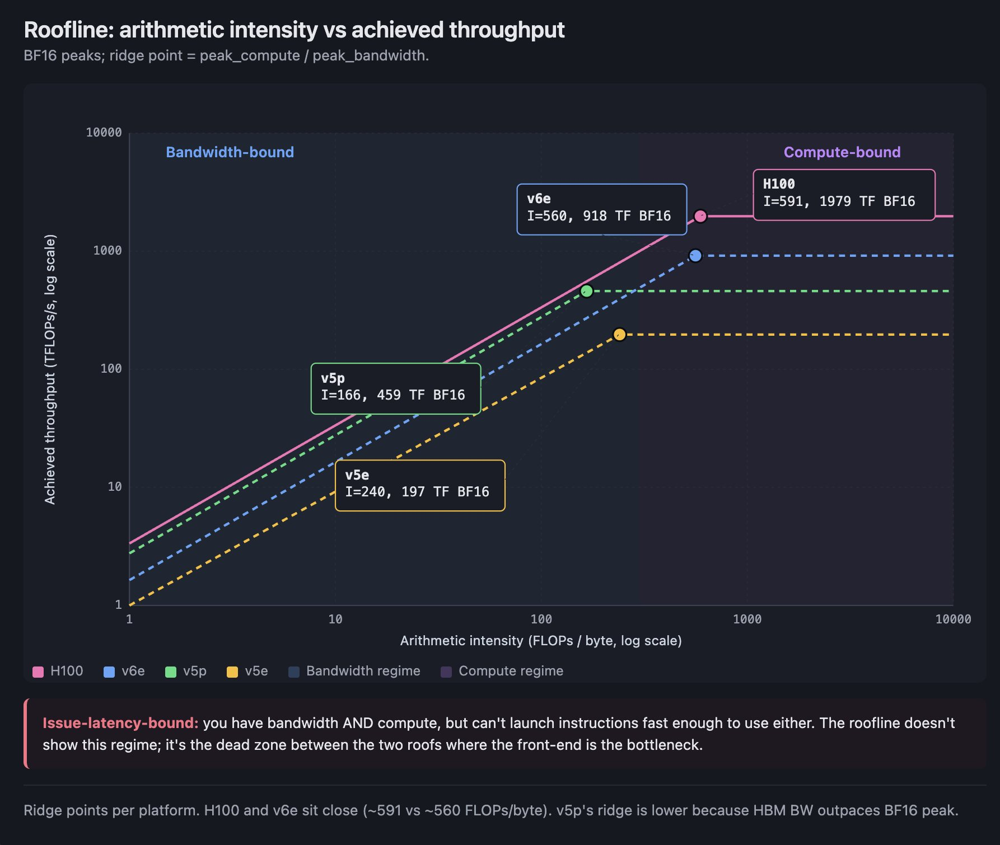

## The two philosophies

One way to read everything that comes next is through a split that shows up in every architectural choice NVIDIA and Google have made.

NVIDIA's philosophy, reading from the programmer inward: start with many parallel threads. Build a memory hierarchy around them. Add matrix engines inside each streaming multiprocessor so the threads can issue matrix instructions collectively. Add features over time to let threads cooperate more tightly (warpgroups, thread block clusters, distributed shared memory). The threads were there first. Everything else fits around them.

Google's philosophy, reading the other direction: start with a matrix dataflow. Put the MXU at the center of the chip. Add a vector unit to handle the things that don't fit in the MXU. Add a scalar unit for control. Add VMEM so the compiler can stage data in a shape the MXU can consume. Add ICI so chips can exchange tiles without going through HBM. The systolic array was there first. Everything else fits around it.

These aren't just organizational differences. They compound. Once NVIDIA made the commitment to SIMT, every subsequent design decision had to make threads more productive: shared memory, Tensor Cores, warp-level intrinsics, TMA, mbarrier, cluster APIs. Once Google committed to the systolic array, every decision had to feed it: deterministic VMEM staging, compiler-scheduled DMAs, torus fabrics, sparse-core offload for the operations the MXU can't absorb.

A GPU becomes easier to program as the abstractions mature. A TPU becomes more throughput-dense as the compiler matures. The floor of a GPU (what you get by writing obvious code) is high because the runtime is doing a lot for you. The ceiling of a TPU (what you get with compiler-aware code) is high because nothing is spent on runtime dynamism. Neither philosophy is strictly better. They produce different shapes of good.

When you read about TMA on Hopper, notice that it's the GPU side admitting that compiler-scheduled data movement is the thing to do, and trying to reach for it inside a SIMT abstraction. When you read about Ironwood's FP8 and its OCS fabric, notice that it's the TPU side arriving at the same scale as Blackwell from the opposite direction, by making the systolic core fast enough and the fabric large enough. Two philosophies, same destination, very different shapes.

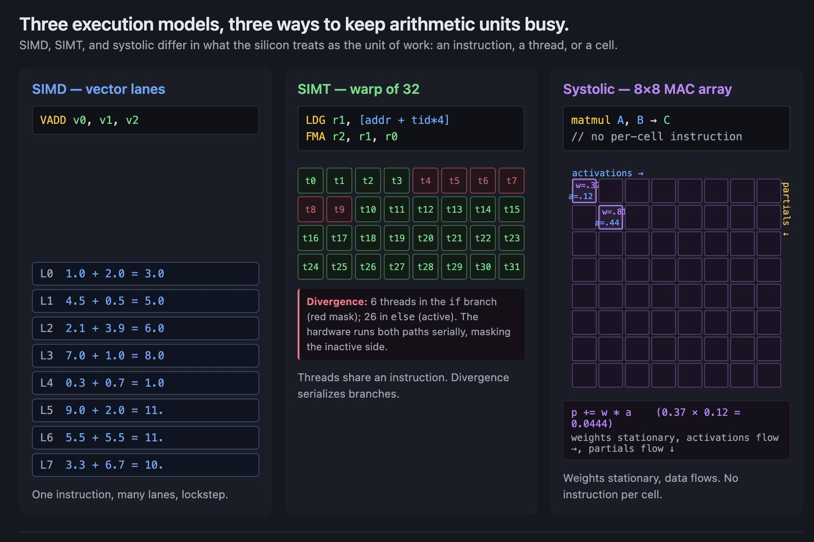

## A warning from here

The article is long on purpose. Read it in sessions if you have to. It was written to be read that way.

## Part 2A: The NVIDIA Arc

## GPU fundamentals primer

Before we do Ampere, Hopper, and Blackwell, you need to carry one diagram in your head. I'll describe it in words.

A modern NVIDIA GPU is a grid of **streaming multiprocessors** (SMs). H100 has 132 of them. B200 has more. Each SM is the unit of execution. When you launch a kernel, the GPU scheduler assigns thread blocks to SMs. Blocks run to completion on whichever SM got them. One SM can hold multiple blocks concurrently if registers and shared memory allow.

Inside a single SM, there are CUDA cores for scalar and vector FP arithmetic, a handful of special-function units for transcendentals, and **Tensor Cores**, which are the matrix engines. Tensor Cores are the only part of the SM that does dense matrix math at anything close to peak rates. If you aren't issuing Tensor Core instructions, you're running on the slow paths.

Threads are grouped into **warps** of 32. Warps are the unit of SIMT execution: 32 threads, one instruction, one program counter most of the time. Several warps form a **thread block**, which is the unit the programmer schedules. Thread blocks share a chunk of **shared memory** (SMEM) which is on-die SRAM physically located in the SM. Threads within a block can synchronize cheaply. Threads across blocks cannot.

Memory hierarchy, outside the SM: **L1 cache** sits in each SM, physically unified with SMEM on modern GPUs (you partition the budget between them). **L2 cache** is shared across all SMs on the chip. **HBM** is the off-chip main memory. Every level gets slower and larger as you go out. Registers are closest and smallest. HBM is farthest and largest. The game of kernel authoring is moving data up the hierarchy and doing as much math as possible before it spills back down.

Three vocabulary items in case you see them and wonder: **warp divergence** (threads in a warp taking different branches run sequentially, so throughput drops), **coalescing** (adjacent-address loads from one warp get batched into a single transaction), and **occupancy** (how many warps an SM keeps in flight to hide stalls). If you're not writing kernels you can safely skim past these. Tensor Cores care less about occupancy than CUDA cores do, because they have dedicated paths and their own scheduling.

That's enough to read the rest of Part 2A. Every generation we cover adds something to this picture. Ampere adds TF32 and async copies. Hopper adds warpgroups, TMA, and mbarrier. Blackwell adds TMEM and decouples the Tensor Cores from the warp scheduler. The underlying shape stays the same.

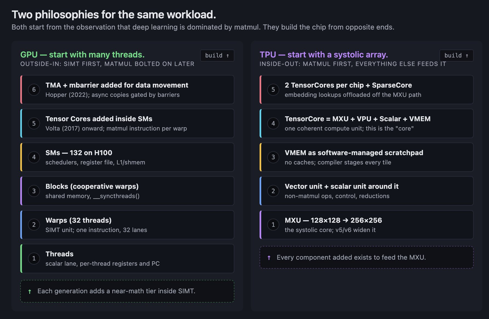

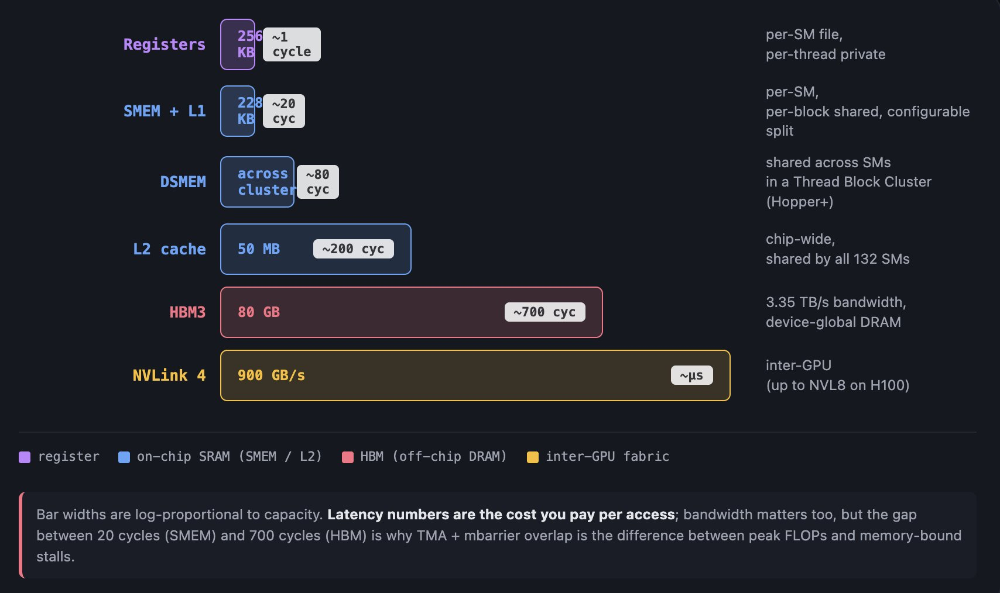

## Ampere / A100

A100 is the generation where NVIDIA stopped pretending this was a graphics chip. Every Ampere technical note reads like a data-center whitepaper, which is because that's what it was. This is also the chip that MOST gpu specific DSLs are based on. Understanding Ampere is still key to understanding almost every DSL.

The single most consequential addition for kernel authors was in my opinion `cp.async`, which moves data from global memory directly into shared memory without going through a register spill. The version on Ampere is semi-asynchronous, which means you issue the copy, go do other work, and eventually fence on completion. The modern TMA+mbarrier pattern on Hopper is the full async version of this idea. `cp.async` on Ampere was the first taste.

A100 had 80 GB of HBM2e at 2,039 GB/s, 312 dense BF16 TFLOPS from the Tensor Cores (624 with 2:4 sparsity), and MIG (Multi-Instance GPU) partitioning for cloud providers who wanted to carve the chip into smaller accelerators for multi-tenant workloads. MIG sounds dry but it's important context: by A100, NVIDIA was designing for rented slices of the chip, not just full-chip workloads.

For the roofline recomputation: A100's ridge point from HBM is 312 × 1000 / 2,039 ≈ 153 FLOPs per byte. That was above where BERT and ResNet-sized matmuls lived and below where dense transformer training sat. A100 didn't need to worry about the ridge point the way later generations would.

A100 is the generation that defines the *floor* of modern ML training. Everything after this assumes at least this hardware level. If you're reading a paper from 2021–2023 and it says "we trained on 8 GPUs," odds are you can mentally substitute "8 A100s" and be right.

## 2A.2 Hopper / H100

Hopper is the anchor generation of this article because Hopper is the generation where data movement stopped being a side effect and became the program.

Plain-English version before the acronyms show up. Before Hopper, a GPU thread was the thing that made copies happen: you wrote the loop, the thread executed each load. After Hopper, you hand the hardware a short description of the copy ("this tile from HBM, land it in shared memory, with this layout") and the hardware does the rest while your threads go do other work. The rest of this section is the machinery that makes that shift real, and the reason every optimized H100 kernel you'll ever read looks the way it does.

I want to build up to that claim. A100 already had `cp.async`, already had Tensor Cores, already had BF16. H100's new features aren't isolated bullet points. They're a coherent shift in what a kernel *is*.

Thread Block Clusters are a new level of the execution hierarchy. In the old picture, threads form warps, warps form blocks, blocks form a grid, and blocks can't talk to each other. On Hopper, adjacent blocks can be grouped into a cluster (typically 4 or 8 blocks), and the cluster is scheduled onto a contiguous group of SMs. The blocks inside a cluster can access each other's shared memory. That's called **Distributed Shared Memory** (DSMEM). Under the hood, it's SMEM with a physical interconnect between the SMs in the cluster. DSMEM is not as fast as local SMEM, but it's much faster than going out to L2 or HBM.

DSMEM matters because it lets you tile operations across multiple SMs without paying the round-trip cost of sharing through L2. Flash-attention-style kernels that used to fit one SM per head can now fit one cluster per head and keep the per-head data cooperative across SMs.

Tensor Memory Accelerator (TMA) is the feature that rearranged everything. TMA is a descriptor-driven async copy engine. You build a descriptor describing the source tensor (base pointer, shape, strides, swizzle pattern, out-of-bounds fill value), you build a descriptor describing the destination tensor in shared memory, you issue one instruction, and the DMA engine moves the tile. The compiler, not the threads, writes the loop. The warp that issued the TMA is free to do other work while the copy runs.

Three things are important about TMA that don't show up in the spec sheet. First, TMA handles bounds checking and padding in hardware. If your tile extends past the edge of the tensor, TMA fills with a specified value instead of trapping. That eliminates an entire class of tail-case branches from kernel code. Second, TMA can apply **swizzle** patterns during the copy, so the data lands in shared memory in a layout that avoids bank conflicts when the Tensor Cores read it. Third, TMA is the substrate for multicast on a cluster. A single TMA can land the same tile into SMEM across multiple SMs in a cluster simultaneously, which replaces what would have been N separate loads.

Warpgroup MMA (WGMMA) is the new Tensor Core instruction family. A warpgroup is four warps (128 threads). Unlike previous `mma` instructions that ran on a single warp, WGMMA is warpgroup-cooperative: the instruction is issued by all four warps together, and the hardware schedules a larger matrix op that amortizes the issue cost across more threads and more data. WGMMA can take its operands from shared memory directly (RS-stage) without first moving them to registers, which is a huge bandwidth win.

mbarrier is the synchronization primitive that holds this pipeline together. Classical shared-memory sync on GPUs was `__syncthreads()`, a cliff: every thread in a block waits until every other thread arrives. That's fine for simple patterns but horrible for overlap. mbarrier is a split-phase barrier: you can `arrive` on one warp and `wait` on another. That's what makes the producer-consumer pattern work. One warp issues a TMA load, arrives on an mbarrier, moves on. Another warp waits on the mbarrier, consumes the data with WGMMA, arrives on a different mbarrier signaling the tile is free, moves on. The warps never stall unless the pipeline is fundamentally stuck.

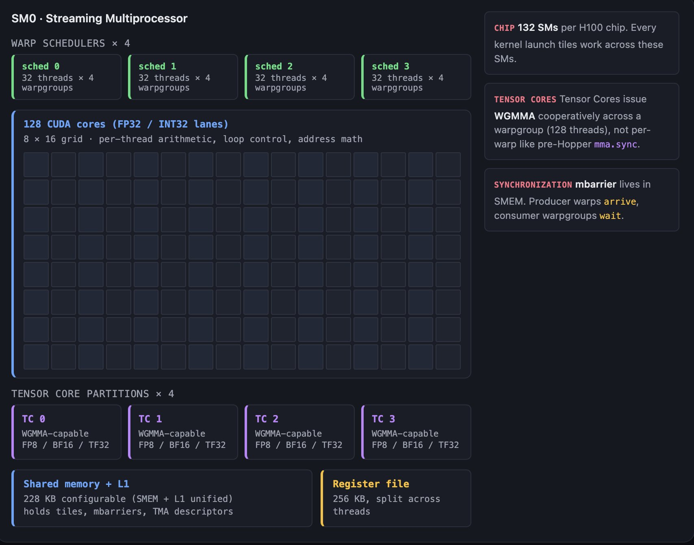

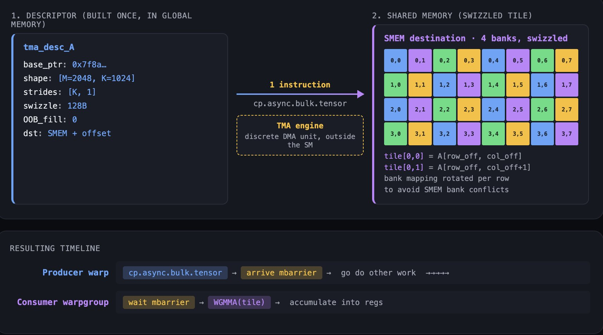

FP8 on Hopper is E4M3 and E5M2, with the Transformer Engine tracking per-tensor scales across steps via a delayed-scaling protocol. Delayed scaling means you track the amax from previous iterations and use it to scale the current iteration, so you don't pay the synchronization cost of computing a scale online. The accuracy drop from FP8 training, when done carefully, is close to zero on the relevant tasks. The bandwidth savings are meaningful.

On the memory hierarchy side: HBM3 at 3.35 TB/s, 50 MB of L2 (up from 40 MB on A100), DSMEM across clusters, and a larger configurable SMEM+L1 budget per SM. NVLink 4 at 900 GB/s per GPU, aggregated across the NVL8 and NVL64 server topologies. The numbers are important but what matters is that every level of the hierarchy got faster, and a new near-math level (DSMEM) got added.

Here's the claim, now that the features are on the table. Before Hopper, a kernel was "do arithmetic, then coordinate a bit of memory movement around it." After Hopper, a kernel is "schedule memory movement, and arithmetic happens inside the slots the movement leaves open." The main loop of a well-tuned H100 matmul is a producer warp issuing TMA loads into circular SMEM buffers, consumer warpgroups pulling from those buffers through WGMMA, and mbarrier chains gating the whole pipeline. You can write that loop by hand in CUDA. You can get an autogenerated version from CUTLASS. Or you can let Triton write it for you.

Here's what Triton does with it:

```python
import triton
import triton.language as tl


@triton.jit
def matmul_kernel(
    a_ptr, b_ptr, c_ptr,
    M, N, K,
    stride_am, stride_ak,
    stride_bk, stride_bn,
    stride_cm, stride_cn,
    BLOCK_M: tl.constexpr,
    BLOCK_N: tl.constexpr,
    BLOCK_K: tl.constexpr,
):
    pid_m = tl.program_id(0)
    pid_n = tl.program_id(1)

    offs_m = pid_m * BLOCK_M + tl.arange(0, BLOCK_M)
    offs_n = pid_n * BLOCK_N + tl.arange(0, BLOCK_N)
    offs_k = tl.arange(0, BLOCK_K)

    a_ptrs = a_ptr + offs_m[:, None] * stride_am + offs_k[None, :] * stride_ak
    b_ptrs = b_ptr + offs_k[:, None] * stride_bk + offs_n[None, :] * stride_bn

    acc = tl.zeros((BLOCK_M, BLOCK_N), dtype=tl.float32)
    for k in range(0, K, BLOCK_K):
        a = tl.load(a_ptrs)
        b = tl.load(b_ptrs)
        acc += tl.dot(a, b)
        a_ptrs += BLOCK_K * stride_ak
        b_ptrs += BLOCK_K * stride_bk

    c_ptrs = c_ptr + offs_m[:, None] * stride_cm + offs_n[None, :] * stride_cn
    tl.store(c_ptrs, acc.to(tl.float16))
```

That's the whole kernel. Thirty lines. It reads like a textbook tiled matmul. Now read what the Triton compiler actually emits on Hopper. If you're not a kernel author, skim the next paragraph: the point is only that the compiler is turning thirty innocuous-looking lines into the full Hopper pipeline we just built up.

The two `tl.load` calls on lines `a = tl.load(a_ptrs)` and `b = tl.load(b_ptrs)` become TMA descriptor constructions and `cp.async.bulk.tensor` instructions. The compiler picks a swizzle pattern that matches the WGMMA operand layout. The for-loop over `K` becomes a software-pipelined loop with multi-buffered SMEM staging, producer-consumer warpgroup split, and a chain of mbarrier arrives/waits gating each stage. The `tl.dot` becomes a WGMMA instruction issued cooperatively across the consumer warpgroups, reading from SMEM directly where possible. The final `tl.store` becomes a grid-striding TMA store.

None of that is visible in the kernel source. Triton's whole pitch is that the tile is the unit of abstraction, and the compiler figures out what to do with it on your target GPU. On an A100, the same kernel emits `cp.async` (not TMA), `mma.sync` (not WGMMA), and classical `__syncthreads()` patterns instead of mbarrier. Same source, different codegen. That's Triton doing its job.

This snippet is going to come back up in Article 2. The Pallas comparison is not about which kernel is shorter. It's about what happens at the compiler boundary and how each stack thinks about abstraction. For now, just notice how much Hopper-specific hardware is hidden by these thirty lines.

## Blackwell / B200 and GB200

If you're new to this, the shortest possible summary: Blackwell is Hopper's core ideas (async data movement, cooperative Tensor Cores, close-to-math memory) made bigger and pushed further. The two new beats are that the NVLink domain *is* the machine (72 GPUs in one fabric, not 8), and the warp scheduler stopped controlling the Tensor Cores (they got their own issue path).

I'll caveat up front: public microarch disclosures on Blackwell are less complete than Hopper's, so I'll distinguish what's solid from what's indicative.

Solid: B200 is a **dual-die** chip with a 10 TB/s die-to-die interconnect (NV-HBI) that presents as a single logical accelerator to the programmer. You don't manage the two dies directly; CUDA treats the pair as one device. Each die has its own SMs and its own HBM stacks.

Solid: HBM3e at 8 TB/s aggregate per GPU, 192 GB capacity (on the higher-SKU B200). That's more than 2× H100's bandwidth and more than 2× H100's capacity. The ratio of compute to bandwidth still tightens because compute moved up faster, but the raw memory budget gets a lot friendlier.

Solid: NVLink 5 at 1.8 TB/s per GPU, and **NVL72** as the standard domain. 72 GPUs in one all-to-all-connected NVLink fabric, with NVL144 as the bigger configuration. Pre-Blackwell, NVLink domains topped out at 8 GPUs in a server. Blackwell's NVL72 is an order of magnitude larger. It's a deliberate response to the scale of modern training runs, and we'll talk about it again in §2C when we compare it to the TPU fabric story.

Solid: **FP4 era** via NVFP4, the two-level scaling format that hits 9 PFLOPS dense (18 PFLOPS with sparsity) per GPU, and MXFP8 as the eight-bit microscaling alternative. Both are what the Transformer Engine targets on Blackwell. The peak FP8 number is 4.5 PFLOPS dense per GPU, close enough to Ironwood's FP8 to make the two chips roughly comparable per-chip on that metric.

Indicative, cross-referenced from Blackwell microbenchmarking papers and vendor tutorials rather than primary NVIDIA docs: Blackwell introduced **Tensor Memory (TMEM)**, reported at 256 KB per SM, which is a new near-math storage level specifically for Tensor Core operands. TMEM sits between SMEM and the Tensor Core registers. The point: at Blackwell's Tensor Core throughput, even SMEM is too far from the math, and operands need to live in a closer tier.

Indicative: **`tcgen05`** is the Blackwell Tensor Core instruction family, and the descriptions in public tutorials say `tcgen05` is **decoupled from the warp scheduler**. The Tensor Core has its own issue path and its own operand staging. This is the second half of the Hopper trend. Hopper decoupled memory movement from threads (TMA). Blackwell decouples arithmetic from threads (`tcgen05`). The warp is no longer in the loop for the dense linear algebra.

Indicative: **hardware decompression** engines for weight-compressed formats, so inference kernels can page encrypted or compressed weights from HBM and decompress on the fly without a software pass.

If you squint at the Blackwell picture, you see an architecture where the SM is increasingly a dispatcher and the real work happens in hardware blocks that don't live inside the SM the way Tensor Cores did on Hopper. The programming model accommodates this by letting the author describe cooperation with ever-less-visible machinery. It's still SIMT at the surface. It's almost not SIMT underneath.

## The GPU arc

Three generations in three sentences. **Ampere widened the highway.** More Tensor Core peak, more HBM bandwidth, async copies, sparsity. **Hopper made movement explicit.** TMA, mbarrier, warpgroups, distributed shared memory. The kernel became a pipeline instead of a loop. **Blackwell made the fabric the machine.** NVL72, decoupled Tensor Cores, TMEM, microscaling formats. The individual GPU matters less than it used to; the 72-GPU domain matters more than it used to.

The arc, stated as one trajectory: NVIDIA has been climbing the SIMT ladder for two generations trying to reach the place where the compiler, not the programmer, schedules data movement and math. TMA was the big step. `tcgen05` decoupling is the next one. It's the GPU stack walking itself toward the thing TPUs had by construction from the start.

That's a provocative framing and I mean it. Hold it until  for now until you continue to the next part. Then we'll see where the TPU side was standing the whole time.

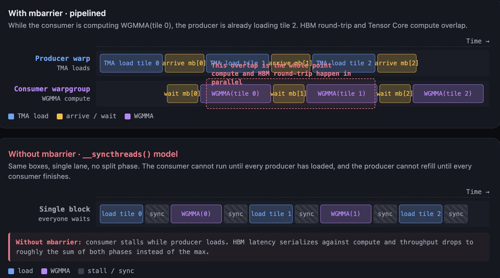

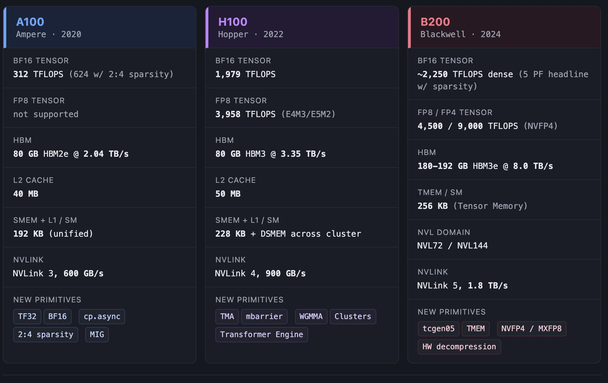

## The Google Arc

Note: This was all written before I started at google based on my notes on TPU while preparing. All  open source data all fresh from my notes then written in a format folks could actually understand, instead of just my rants.

## TPU fundamentals primer

A TPU chip is a small number of big blocks, not a grid of small blocks. Read that sentence again before we go into the generations. It's the single most important mental model shift.

A v5p chip has two **TensorCores**. An Ironwood chip has two as well. A Trillium chip has two on a dual-chiplet package. The count is small on purpose. Each TensorCore is a big machine built around one dominant unit, the **MXU**, surrounded by a vector unit, a scalar unit, and local memory.

The MXU is a **systolic array**. On v4 and v5e it's 128×128. On v5p it's still 128×128 per chip but the chip has more of them (two MXUs per TensorCore). On Trillium it jumped to 256×256. The MXU is what does dense matrix math. Its dataflow is a variant of weight-stationary, which means the weights sit in place and activations flow through. Once you've loaded weights, you stream activations across the grid and accumulated results pour out the other side. The throughput is absurd when the tile fits the grid. The cost is that everything has to be shaped for the MXU, or the MXU does nothing useful.

The **vector unit** (VPU) is what catches everything the MXU can't do. Elementwise operations, reductions, softmax interior, layer norm math, activation functions. It's a SIMD-style unit with its own register file and its own lane count. Every TPU kernel story eventually routes through the interaction between MXU and VPU: the MXU does the matmul, the VPU does the nonlinearity, and the compiler stitches the two together with explicit data movement.

The **scalar unit** handles control flow, address generation, and the handful of operations that can't be expressed in the vector or matrix units. It's small. The point of the TPU architecture is that most of the silicon goes to the MXU.

Memory on a TPU does not look like GPU memory. There is **no hardware-managed L1 or L2 cache**. Instead, each chip has **VMEM** (Vector Memory), a large software-managed SRAM scratchpad. On v5e, VMEM is 128 MiB per chip. On later generations it scales up. The compiler is responsible for staging data from HBM into VMEM, and from VMEM into the MXU and VPU register files. That's not a detail to hide later; it's the defining feature of the platform.

The sharpest consequence is arithmetic intensity for anything that misses VMEM. On v5e, the ridge point from HBM is roughly 240 FLOPs per byte, and the ridge point from VMEM is substantially lower, something like an order of magnitude lower. That means if you can keep a tile resident in VMEM and reuse it, you need much less arithmetic intensity to stay compute-bound. If you have to reload from HBM every operation, you need much more. Every optimization story on a TPU is, in one way or another, a story about keeping data resident in VMEM for as long as possible.

Batch size is where this bites first-time users. On v5e, you need a batch of roughly 240 tokens per replica in BF16 to get above the HBM ridge point. With int8 activations and bf16 weights, that drops to around 120. Below those thresholds, the MXU sits idle while HBM refills. GPUs degrade gracefully as batch size shrinks. TPUs fall off a cliff. The fix is not to tune the kernel harder. It's to redesign the parallelism strategy so the per-replica batch is big enough, or to use smaller precision.

ICI (Inter-Chip Interconnect) is the TPU's equivalent of NVLink, but flatter and denser. On v5p, ICI is 4.8 Tbps per chip and chips are wired in a 3D torus. A full pod is 8,960 chips. On Ironwood, ICI is 9.6 Tbps per chip and a pod is 9,216 chips. The important thing about ICI is that it's a torus, not a fat tree. Every chip has local neighbors. Collective operations that map well to a torus (all-reduce, ring-based all-gather) fly. Operations that need global any-to-any either use **Optical Circuit Switching** to reshape the torus on the fly, or they cost you.

SparseCore is a separate execution unit that sits alongside the TensorCores on v4 onward. It's designed for operations the MXU is terrible at: sparse embeddings, gather-scatter, hash-table-heavy workloads. v5p has four SparseCores per chip. Each SparseCore has its own vector and scalar subcores and shared vector SRAM. Recommender systems live on SparseCore. So do large-vocab embeddings in LMs.

That's enough. Every TPU generation below is a variation on this structure. Count MXUs. Count TensorCores. Measure VMEM. Measure HBM. Measure ICI. Pay attention to whether the MXU grew, shrank, or stayed put.

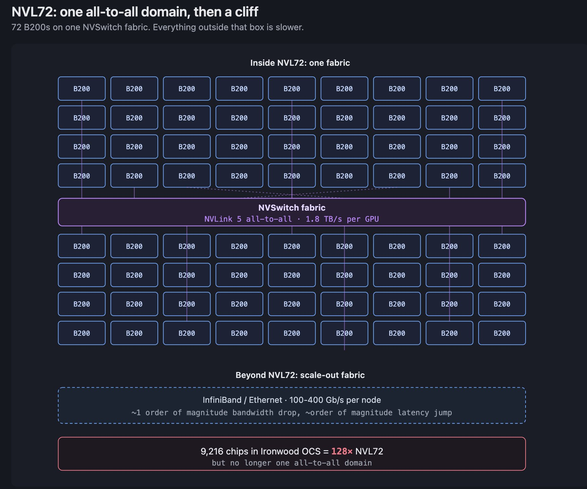

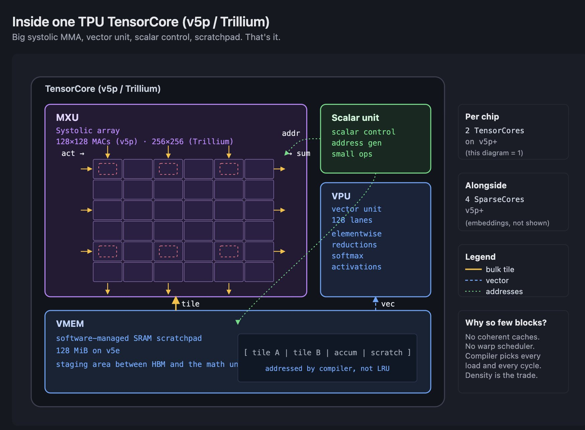

## TPU v1: the philosophy paper

I don't want to do a product tour for v1. It was an inference-only chip that shipped in 2015 and had a 256×256 MAC array, 24 MiB of on-chip memory called the Unified Buffer, and a deterministic execution model. The specs aren't the point.

The point is the paper the Google team wrote about it in 2017, titled "In-Datacenter Performance Analysis of a Tensor Processing Unit." It is, as far as I can tell, the single MOST consequential architecture paper of the last decade, and it's not because of the chip's performance. It's because the paper stated an aggressive position: caches are bad, out-of-order execution is bad, SMT is bad, speculation is bad, branch prediction is bad, hardware prefetching is bad, every form of latency-hiding dynamism is bad. All of it is silicon spent on making unpredictable code look fast. ML workloads aren't unpredictable. Every byte of silicon you spend on dynamism is a byte you didn't spend on arithmetic units.

That's the argument. It's still the lineage's north star and I couldnt agree more. If you want to know why TPUs look the way they do in 2026, start with the 2017 paper.

The deterministic execution part is the tail-latency argument. If every operation is scheduled ahead of time and the hardware has no dynamism, every run of the same program takes the same number of cycles. That's irrelevant for training (throughput matters, not tail latency) but it's extremely relevant for inference serving. A deterministic accelerator has no p99 latency spike from a scheduling hiccup.

v1 was an inference chip and its deterministic story was aimed at inference. v4 onward made the same argument work for training.

## v4 and v5p: the road to Ironwood

I'll merge v4 and v5p into one arc because they're the same story told twice, bigger the second time. I'll acknowledge v2 and v3 first so you don't wonder about them: v2 brought BF16 and the dual-TensorCore layout that every subsequent chip keeps. v3 scaled up the MXU array and added liquid cooling. Neither of those is the anchor. v4 is where things got interesting again.

v4 introduced two features that reshaped what a TPU pod could be. The first is **SparseCore**. About 5% of the v4 die area is given over to a separate engine that does gather-scatter and embedding operations at rates the MXU can't touch. On embedding-heavy workloads, SparseCore delivers 5–7× speedups over running the same work on the MXU. It's the first TPU feature that isn't a pure matmul accelerator.

The second, and the bigger one structurally, is Optical Circuit Switching (OCS). OCS lets Google reconfigure the interconnect topology of a pod at provisioning time. The physical fabric is a 3D torus made of optical switches, and the switches can be reprogrammed to connect different chips to different neighbors. That has two consequences. First, it makes pods *reconfigurable* for workload-specific topologies, so a job that benefits from a 2D slice can get one without wiring a separate fabric. Second, it makes the fabric *fault-tolerant*: if a chip fails, OCS routes around it and the pod keeps running with one fewer chip. For a fabric that's supposed to have 8,000+ chips synchronized, that resilience is not a nice-to-have. It's a requirement.

v4 also introduced twisted torus topologies, which are small topological tricks that reduce the worst-case latency for all-to-all collectives. Standard torus has a worst-case hop count proportional to the side length. Twisted torus halves it. It's the kind of detail that matters a lot for real-world MFU and not at all to anyone who hasn't run collectives at scale.

v5p is v4 scaled up. It's still 3D torus. It's still SparseCore-enabled. The pod grew from v4's 4,096 chips to 8,960. Each chip has 2 TensorCores, 4 SparseCores, 95 GB of HBM at 2.76 TB/s per chip, and 4.8 Tbps of ICI per chip. The MXU is still 128×128 per chip but there are more of them, so the peak BF16 per chip is 459 TFLOPS.

The SparseCore payoff worth citing: Google's own framing on v5p is that second-generation SparseCores speed up embedding-dense model training by around 1.9×. That's embedding-heavy workloads broadly, not MoE specifically. If you're training a recommender or an LM with a very large vocabulary, SparseCore is doing nontrivial work for you whether you asked for it or not.

v5p is the generation that made trillion-parameter training routine inside Google. If you've read about Gemini training at the petaflop scale, v5p is the hardware that did the work.

## Trillium / v6e: the economics generation

Trillium is where the TPU story became a customer-acquisition story. The thesis is that Trillium optimized for cost per token, not peak FLOPs, and it's paying off in adoption.

The spec sheet, on its own, is interesting but not dramatic. 918 TFLOPS of BF16 per chip, 1,836 TOPS of INT8, 32 GB of HBM at 1.64 TB/s per chip, 3.2 Tbps of ICI per chip, 256-chip 2D torus slices. The MXU expanded to 256×256, which quadruples the per-cycle MAC count per array.

The design decisions around those numbers are where the story lives.

First, the MXU jump to 256×256. That's a 4× increase in MAC count per cycle, which drives the per-chip peak up by roughly the same factor over v5e. The cost is a **padding tax**. If your matmul tiles don't divide evenly by 256 on both axes, you waste cycles. Kernel authors on Trillium think harder about tile shapes than they did on v5p. The compiler does a lot of the padding, but the tax is real.

Second, the HBM capacity reduction. Trillium has 32 GB per chip, where v5p had 95 GB. That's not a regression; it's a deliberate bet. Trillium's pod topology (256-chip 2D torus slices with strong ICI) is designed to absorb the tensor-parallel and model-parallel sharding that you'd otherwise pay for with local capacity. Instead of keeping big weight shards on each chip, you shard across more chips and use ICI to serve the shards. It's a fabric-first memory hierarchy, not a capacity-first one.

Third, the power story. Trillium's TDP is not a public number I'll quote, but the published **67% energy-efficiency gain over v5e** is clean Google data. Efficiency is the axis Trillium bet on, and it's the axis that matters most for inference deployments where every watt hits your per-token cost directly.

## Ironwood / v7: the anchor generation

Ironwood is the TPU side's answer to Blackwell. The headline is familiar. 4.614 PFLOPS of FP8 per chip, 192 GB of HBM3e at 7.37 TB/s per chip, 9.6 Tbps of ICI per chip (1.2 TB/s aggregate). Per-chip, Ironwood and B200 are in the same neighborhood on peak FP8. That's the boring part.

The interesting part is the fabric. Ironwood's pod is 9,216 chips in a 3D torus, wired through OCS. Pod-level peak is ~42.5 ExaFLOPS. Pod-level aggregate HBM is 1.77 PB. Every chip in the pod is part of one synchronized fabric with ICI latencies measured in hundreds of nanoseconds, not microseconds.

Compare to Blackwell. NVLink 5 at 1.8 TB/s per GPU. NVL72 at 72 GPUs, NVL144 at 144, both in all-to-all domains. Beyond NVL144, the scale has to go through InfiniBand or Ethernet, which drops you from 1.8 TB/s to a few hundred gigabits, and the latency goes up by more than an order of magnitude.

Ironwood's 9,216 is 64× the size of NVL144. That's not a small number. Every parallelism decision changes at 64× fabric scale. Tensor-parallel groups can be larger before ICI becomes the bottleneck. Sharding strategies that require all-to-all communication are practical at scales where they'd be fatal on a GPU cluster. Pipeline parallelism, which exists to paper over inter-node latency, becomes less necessary because the "inter-node" penalty is much smaller.

Beyond the pod, Google's Jupiter fabric is the data-center-scale network that connects pods. Jupiter carries roughly 13.1 Pb/s of bisection bandwidth across 100,000+ servers per fabric, and Google runs hundreds of such fabrics globally. It is not a single multi-data-center network, as some secondary sources occasionally imply. It's a per-fabric bisection number that applies inside one data-center deployment. But there are many deployments and the aggregate is enormous.

Ironwood also supports microscaling precision formats analogous to MXFP8, which closes the gap on Blackwell's lower-precision story. The bigger architectural shift is that Ironwood's TensorCore has more flexibility in how tiles are fed, how the MXU composes with the VPU, and how the compiler can schedule bundles to keep the pipeline full. I won't go into every micro-optimization. The headline is: FP8 is native, HBM3e matches or beats Blackwell's per-chip bandwidth, and the fabric is the dominant differentiator.

If you take one thing from here, make it the fabric comparison. 9,216 versus 144. 64× in a single synchronized domain. Every other spec converges between the two vendors. The fabric doesn't.

## The TPU arc

Five generations, five sentences. v1 proved the thesis that ML accelerators should strip dynamism and spend silicon on arithmetic units. v4 made it a supercomputer with SparseCore and OCS. v5p scaled to trillion-parameter training without anything in the architecture breaking. Trillium made it cheap by betting on economics over headline FLOPs. Ironwood made it frontier by catching up on FP8 and extending the fabric advantage to 64× the NVLink-domain scale.

Stated as one trajectory: the TPU lineage has been betting that compiler-scheduled determinism, systolic matrix density, and fabric-first scale compound more productively than SIMT flexibility, cache hierarchies, and per-node optimization. The bet is paying off at frontier scale. Article 2 will explain why the bet also pays off at kernel-author scale, which is where the conventional wisdom says GPUs should win.

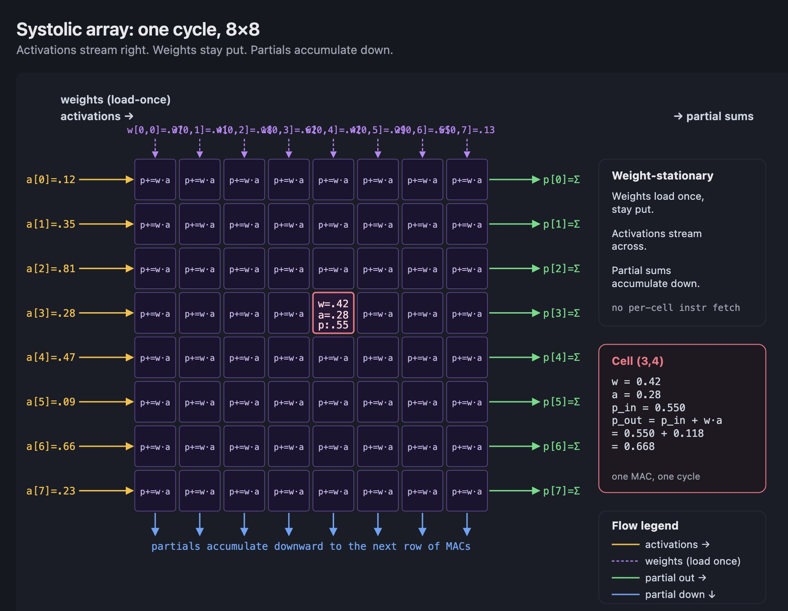

## Where the Arcs Collide

We've walked both sides. Now let me name the places where the two arcs look less like parallel stories and more like different answers to the same question.

Memory hierarchy divergence, by addition. GPU memory hierarchies have been *adding* near-math tiers every generation. SMEM on early Volta. L1-combined SMEM on Ampere. Distributed Shared Memory on Hopper. Tensor Memory on Blackwell. Every tier is closer to the math than the one before. TPUs have had VMEM from the start. The TPU didn't need to add a new near-math tier; it was designed around one. What GPU architects have been building is a version of VMEM, one level at a time, inside the SIMT model.

Movement divergence, by admission. TMA on Hopper is NVIDIA acknowledging that descriptor-driven async transfers are how data has to move at Tensor Core throughput. That was how data always moved on TPU, because the compiler, not the threads, did the scheduling. The Hopper descriptor model (source tensor shape, destination SMEM layout, swizzle, OOB fill, mbarrier gate) is a descendant of the kind of scheduling Mosaic has always produced for the MXU.

Execution-model divergence, by decoupling. Blackwell's `tcgen05` decouples Tensor Cores from the warp scheduler. The warp is no longer in the loop for the dense arithmetic. That's a structural shift toward treating the matrix engine as a cooperating block with its own issue path. On TPU, the MXU never had a warp scheduler in the first place. The compiler feeds the array a tile, the array rhythm does the math, the result lands where the compiler told it to land. NVIDIA is incrementally making Tensor Cores behave more like a systolic pipeline, inside a model that still presents threads to the programmer.

Scale divergence, by fabric. NVL72 at 72 GPUs, NVL144 at 144. Ironwood at 9,216 chips in a single OCS-switched torus. That's 64× in a synchronized domain. Every parallelism decision at frontier scale hinges on that ratio. It's the one axis where the two arcs haven't converged, and it's the axis where the design philosophies diverge most clearly. NVIDIA's fabric grew from 8 to 144 and has InfiniBand beyond that. Google's fabric grew from hundreds to thousands in one synchronized OCS torus, with Jupiter beyond that.

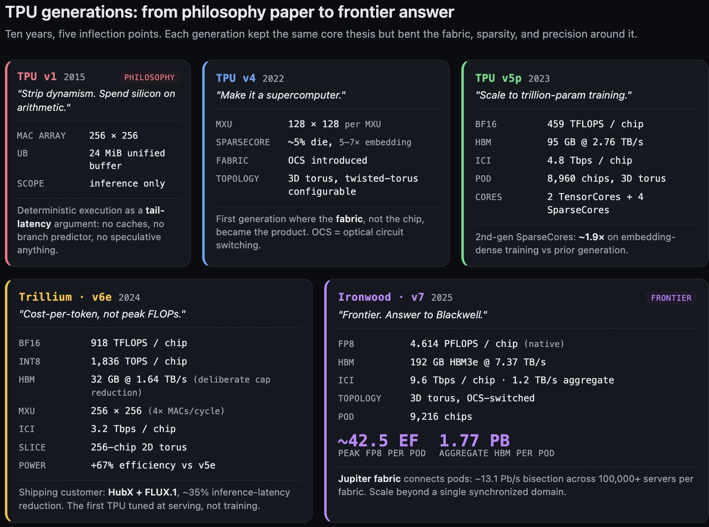

Precision convergence, by multiple paths. Both stacks are landing at FP8 as the canonical training precision, with microscaling formats (NVFP4, MXFP8) as the next step down. Blackwell got there by iterating on the Transformer Engine from Hopper. Ironwood got there by jumping directly to FP8 native as the generation that catches up. Different paths, same destination.

And now the frontier-scale punchline, which I've been setting up since the beginning.

PaLM 540B trained at 46.2% model FLOPs utilization on 6,144 TPU v4 chips. The PaLM paper describes it as "pipeline-free training." They ran pure data plus model (tensor) parallelism on the 3D torus. Two v4 pods, connected over DCN. No pipeline parallelism at all. The shape of the v4 fabric let them skip pipeline entirely.

Llama 3 405B trained at roughly 38–43% MFU on 16,384 H100s. The Llama 3 paper describes 4D parallelism: tensor (one matmul sharded across chips), pipeline (different layers on different chips, passing activations forward in stages), context (long sequences split across chips), and data (same model on different batches, with FSDP sharding the parameters). Four axes, because the NVLink domain couldn't hold a full tensor-parallel group by itself and the InfiniBand fabric outside NVLink couldn't absorb all-to-all at the scale they needed, and pipeline parallelism had to paper over both gaps.

Two MFUs, close in range. One took two axes of parallelism to hit. The other took four. The reason is the shape of the bandwidth hierarchy. PaLM's v4 fabric was flat enough that data and tensor parallelism alone absorbed the compute. Llama 3's H100 fabric had a cliff between NVLink and InfiniBand, and closing that cliff required pipeline and context parallelism as workarounds.

The shape of each cluster's bandwidth hierarchy dictates the parallelism strategy you're allowed to choose. That's the frontier-scale fact.

Hold that. Article 2 coming out TOMORROW  is about whether the same shape-constrains-strategy logic plays out at kernel scale, not just at cluster scale. My claim is yes. The programming models we'll meet in Article 2 aren't neutral choices on top of these architectures. They're the architectures speaking through the software.

## wrapping this monster up

That's the architectural foundation. Two philosophies, five-ish generations on each side, one memory wall shaping the whole picture, one fabric gap separating the two frontiers.

Carry three things forward.

the memory wall is the protagonist. Every acronym in this article is a different tool for keeping data near the math.

SIMT and systolic are not the same bet about how to feed a matrix multiply. NVIDIA bet on productive threads and has been adding compiler-scheduled machinery underneath them for two generations. Google bet on a compiler-scheduled systolic core and has been adding flexibility around it.

at frontier scale the fabric is now the differentiator. 9,216 versus 144 is a 64× gap in a synchronized domain, and that ratio reshapes the parallelism strategy you're allowed to use.

Article 2 picks up where this one ends. We'll do the NVIDIA stack (CUDA, CUTLASS, cuDNN, Triton, frameworks) and the Google stack (XLA, StableHLO, JAX, Pallas, Mosaic, PyTorch/XLA) in the same parallel-tour shape you just read. Then the partisan case: I'll argue that composition, compiler leverage, and profiler tooling stack up to an advantage even in the place GPU was supposed to own outright, which is custom kernel authoring. Then a Triton-to-Pallas migration playbook for engineers in my position.

The move from Meta to Google happened fast and the mental-model shift happened slower. Article 2 is partly a technical argument and partly a record of that shift. Both.

See you there.
