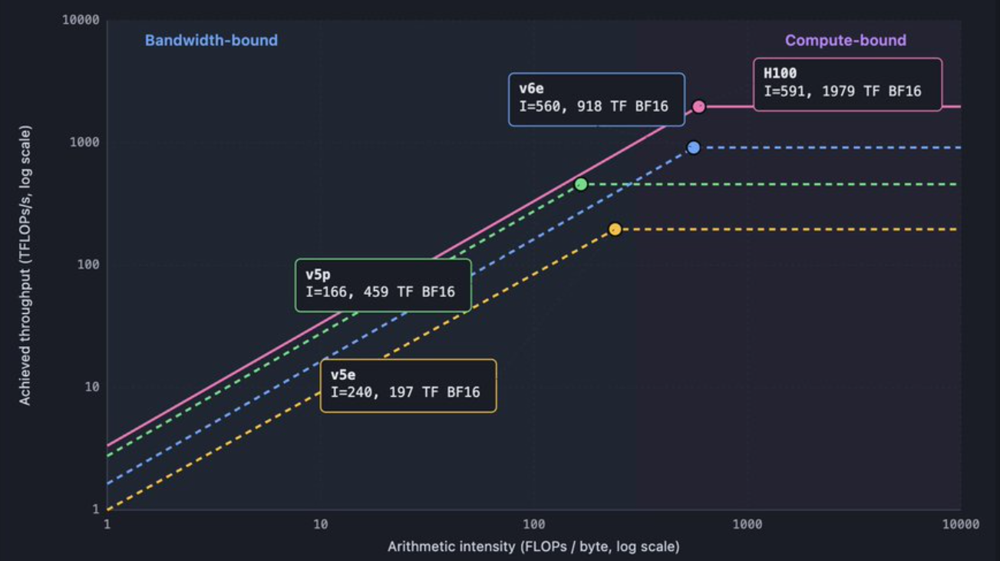
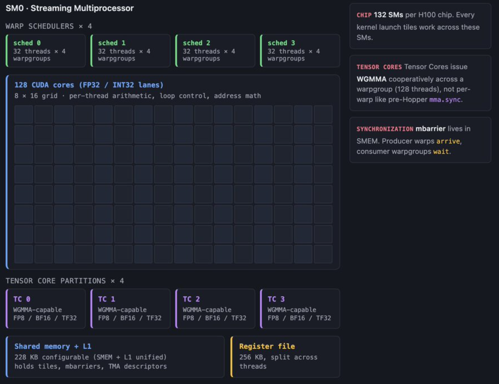
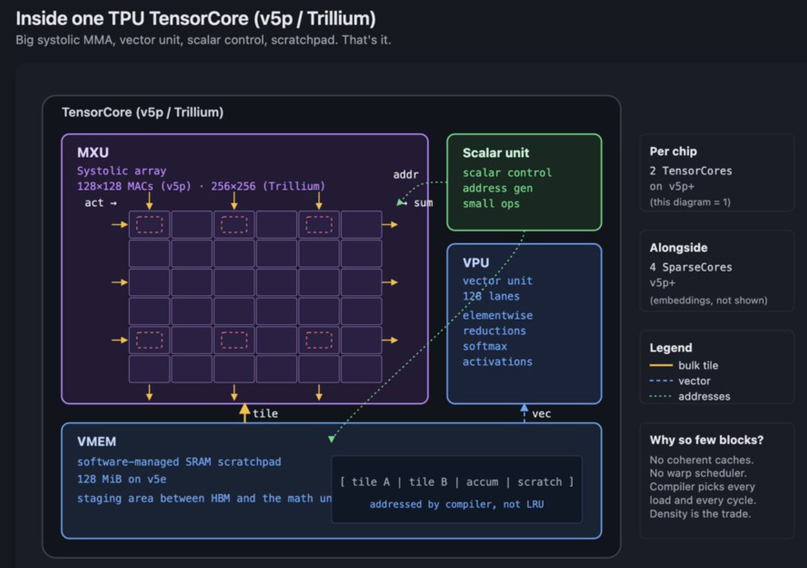
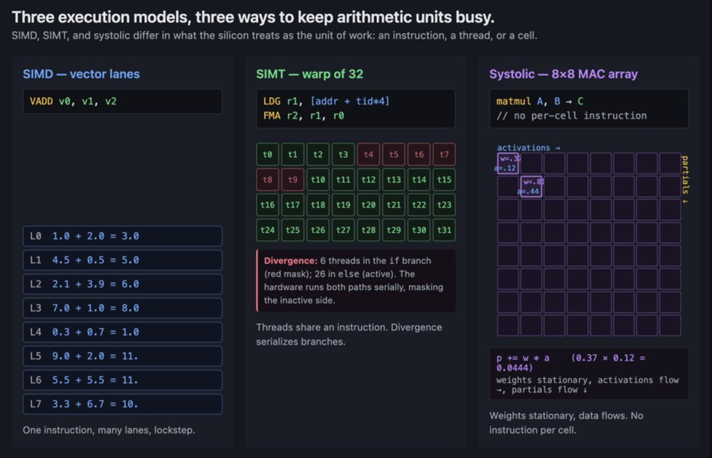
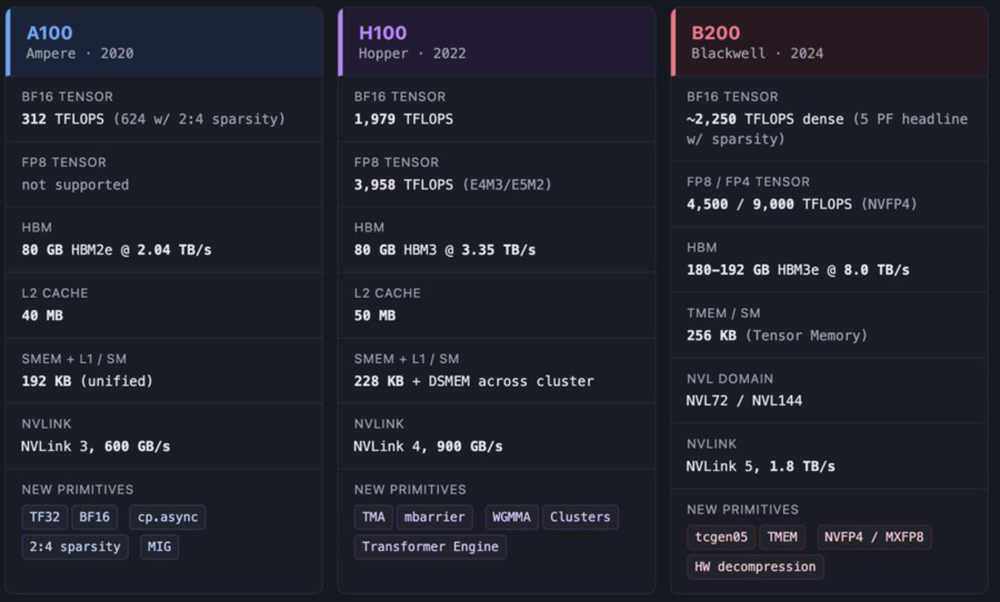
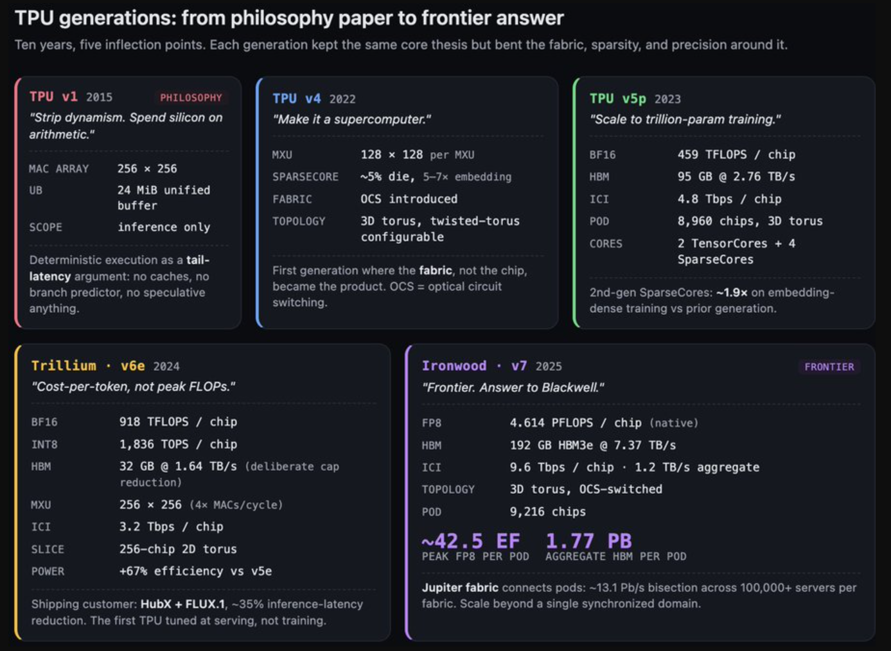
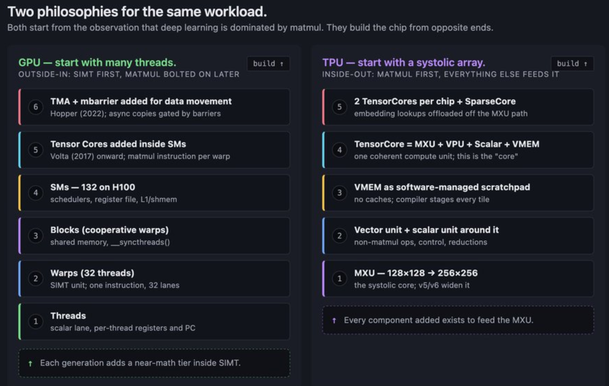

# GPU 和 TPU 设计理念简介

最近看到关于 GPU 和 TPU 介绍的两篇超长优质文章[1, 2]，非常建议阅读原文，本文只对其描述的设计理念做简单笔记。

## 内存墙(The memory wall)

算术运算成本相对较低，而数据传输成本却很高。两者之间的差距并不小，而且还在逐年扩大。这里的成本，不止是能耗的成本，还有时间的成本。

这不是增加带宽就能解决的问题。HBM(High Bandwidth Memory，高性能DRAM) 内存速度每一代都在提升，但仍然不够快。

在内核编写时，数据分块总是首要任务。将数据分块。每次移动一个数据块。在再次移动之前，尽可能多地对它进行运算。加速器上的所有优化最终都可归结为数据暂存问题。硬件本身就明确地阐述了这一策略。编译器、库和内核最终都遵循着相同的规则：尽可能长时间地将数据保持在运算单元附近。

算术运算强度(arithmetic intensity) 是指每次移动一个字节所执行的浮点运算次数。即每字节浮点运算次数（FLOPs per byte）。矩阵块越大，每次移动字节所需的运算量就越多，性能越好。

突破内存瓶颈的另一个关键因素是精度。每少用一位，就意味着少支付一个数位的消耗。因此，近十年来，加速器(accelerators) 的位宽一直在稳步下降。现代小尺度计算技巧是微缩放(microscaling)：将数值以小格式（4 位或 8 位）存储，为每组数值存储一个单独的缩放因子，然后让硬件在计算过程中将该缩放因子乘回去。存储和带宽主要取决于小格式，而精度则取决于缩放因子。

## 设计理念

现代 CPU 核心大部分用于分支预测、乱序调度、推测机制和缓存，竭力于不可预测代码的快速执行。其设计源于以下猜想：

- 频繁的、不可预测的分支和内存访问
- 对单线程的低延迟要求极高

CPU 优化的是延迟：让单个线程运行速度快。

GPU 通过超额分配来优化吞吐量：创建足够多的线程，确保始终有任务可做。现代 NVIDIA GPU 由流式多处理器 (SM) 组成。每个 SM 都是一个执行单元。启动内核时，GPU 调度器会将线程块分配给 SM。线程块会在分配给它的 SM 上运行直至完成。如果寄存器和共享内存允许，一个 SM 可以同时处理多个线程块。

TPU 通过确定性来优化吞吐量：提前调度所有操作，并通过构建方式保持管道满负荷运转。TPU 芯片是由少量的大模块组成，MXU 是一个脉动阵列(systolic array)。它没有硬件管理的 L1 或 L2 缓存。取而代之的是，每个芯片都拥有VMEM（矢量内存），这是一个大型的软件管理 SRAM 暂存区。

### 三种执行模式(Three execution models)

加速器有三种执行模式，分别对应上面三种不同的硬件：

- SIMD  （单指令多数据流）。它使用多个通道，每次发送一条指令，每个通道在其自身的数据上执行该指令。可以理解为向量计算。缺点是死板，不同的通道很难执行不同的操作。
- SIMT （单指令多线程）。表面上在编写拥有独立控制流的线程，但底层硬件将其分组为 32 个线程的 warp(线程束)，并在底层同步运行 warp，每个线程都有自己的程序计数器、寄存器和控制流。这种“伪独立”的抽象极大地提升了开发效率和并行吞吐量，但也埋下了性能陷阱——当同一个 Warp 内的线程遇到不同的逻辑分支（如 if-else）时，就会触发分支发散（Warp Divergence），迫使硬件将原本并行的控制流转化为串行执行。
- Systolic （脉动阵列）。由密集的乘加单元（MAC）构成二维网格，彻底剥离了单个计算单元的指令读取（Instruction Fetch）和控制逻辑，让数据和权重如流水般在相邻 MAC 间按固定时钟周期接力传递并完成累加。这种“去控制化”的设计使得芯片能在极小的面积内塞入成千上万个 MAC 单元（如 256×256 阵列），但也注定它只能死板地服务于标准形状的矩阵乘法（Matmul）—— 一旦遇到不规则的运算，就需要依赖旁侧的向量或标量单元，且必须在数据分块形状（Tile Shapes）上极尽考量，否则就会因为过度填充（Padding）或填充不足而白白浪费宝贵的网格算力与时钟周期。

### 两种哲学(The two philosophies)

NVIDIA 的 GPU 是一台 SIMT 机器，由数千个可编程线程组成，这些线程被分组为线程束 (warp)，其内存层次结构会奖励你保持数据在内存中的稳定，并惩罚你随意管理数据的行为。谷歌的 TPU 是一台脉动式机器，每个核心都围绕一个巨大的矩阵乘法单元构建，由一个名为 VMEM 的小型片上内存提供支持，并由编译器负责布局和调度。

NVIDIA 的理念是：从大量并行线程入手，围绕这些线程构建内存层次结构，在每个流式多处理器内部添加矩阵引擎，以便线程可以协同执行矩阵指令。随着时间的推移，逐步添加各种功能，使线程能够更紧密地协作（例如线程束、线程块集群、分布式共享内存）。线程是先行者，其他一切都围绕着它们展开。

谷歌的理念，反过来理解：从矩阵数据流入手。将 MXU 置于芯片中心。添加一个向量单元来处理 MXU 无法处理的数据。添加一个标量单元用于控制。添加 VMEM，以便编译器（特指像 XLA、Triton 这样针对特定 AI 加速器的编译器）能够以 MXU 可处理的形式暂存数据。添加 ICI，以便芯片无需经过 HBM 即可交换数据块。脉动阵列是先于其他组件存在的。其他一切都围绕它展开。

这些不仅仅是组织架构上的差异，它们还会相互叠加。NVIDIA 一旦决定采用 SIMT，后续的每一个设计决策都必须以提升线程效率为目标。随着抽象技术的成熟，GPU 的编程难度会降低。随着编译器的成熟，TPU 的吞吐量密度会提高。GPU 的下限（编写简单代码所能达到的性能）很高，因为运行时环境会为你完成很多工作。TPU 的上限（编写编译器感知代码所能达到的性能）很高，因为运行时环境的动态性无需额外开销。这两种理念本身并无优劣之分，它们各自追求的是不同的性能表现形式。

## 参考

- From SIMT to Systolic: A Foundation for GPU and TPU Architecture
- Part 2: From SIMT to Systolic A Kernel Author’s Field Report

