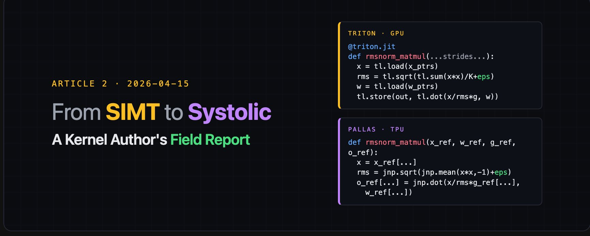
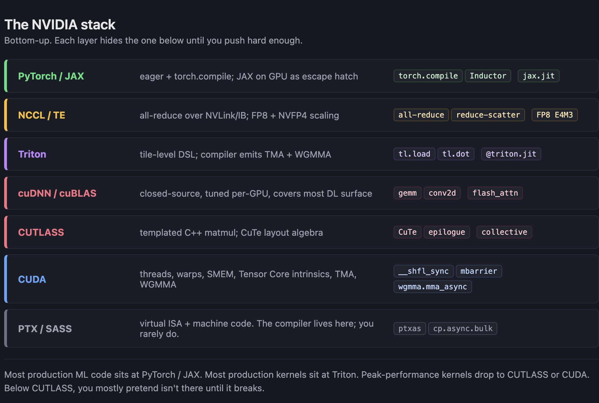
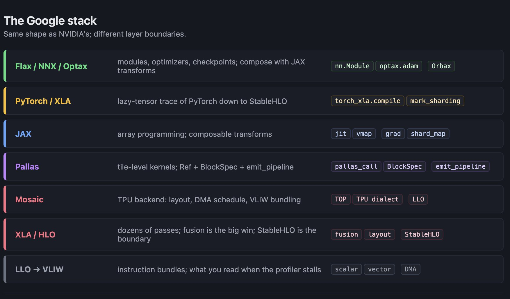
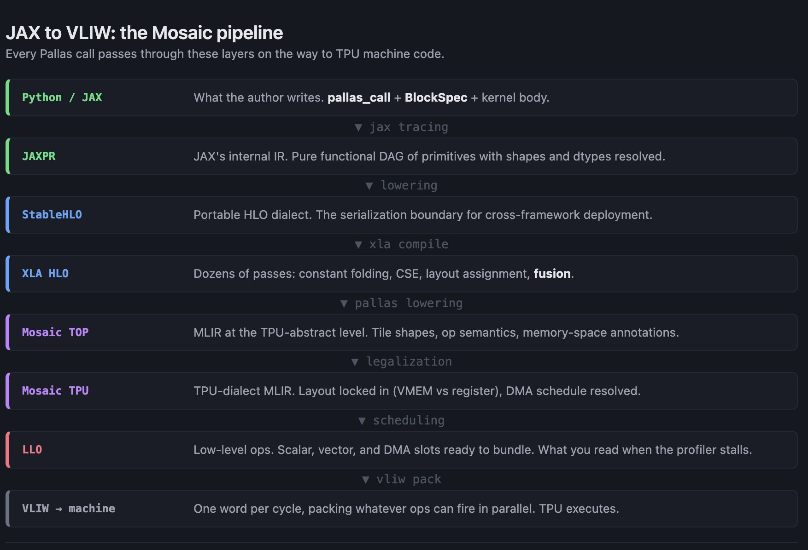
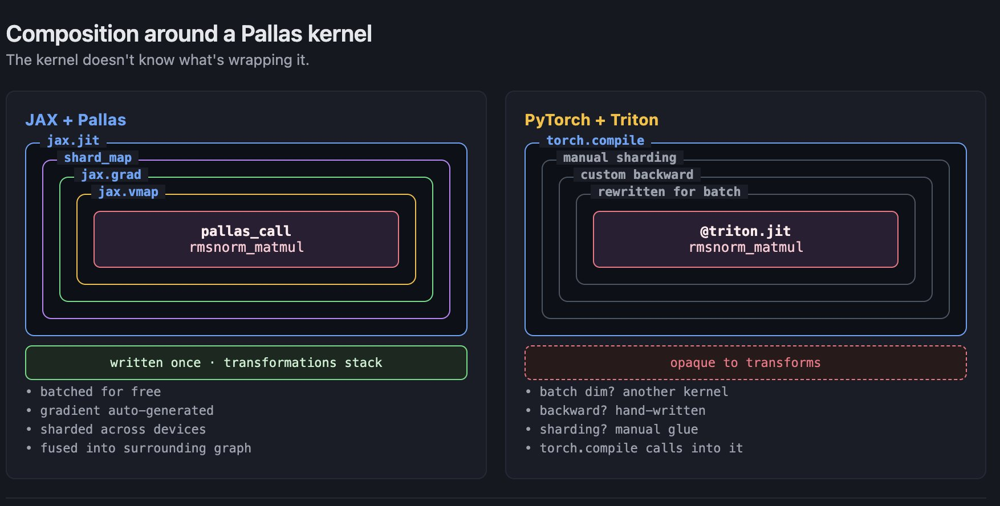
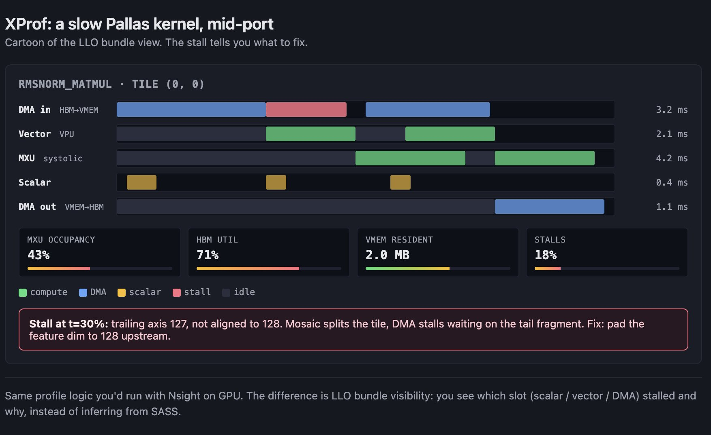

# The Two Stacks




Article 2 of 2. the first article, covered the hardware and execution models. This one covers the stacks you actually write against, the kernels you actually ship, and the case for why, having moved from one to the other, I'm not going back.

## How to read this part

If you skipped Article 1, go back or at least the short version is this. NVIDIA's GPU is a SIMT machine built out of thousands of programmable threads grouped into warps, with a memory hierarchy that rewards you for keeping data close and punishes you for being casual about it. Google's TPU is a systolic machine built around one enormous matrix-multiply unit per core, fed by a small on-chip memory called VMEM, with a compiler that owns layout and scheduling. Different architectures, different programming models, different stacks.

The next two sections walk those stacks in parallel. The NVIDIA stack first, then the Google stack. I've weighted the Google walkthrough a little heavier because fewer readers will have written against it, and because most of the pieces don't have the brand recognition that CUDA and PyTorch do. After that comes the section where I stop trying to be even-handed and point out the places where the two stacks aren't doing the same thing with different names, they're doing genuinely different things. That's where the rest of the article builds from.

## The NVIDIA stack

NVIDIA's stack is the one every ML engineer has touched at least through its top layer, and probably never touched through its bottom. The thing to internalize is that it's a stack: each layer hides the one below it, and each layer also leaks through when you push hard enough. Starting at the bottom.



PTX and SASS
PTX is NVIDIA's virtual Instruction Set Architecture (ISA), the thing `nvcc` and every higher-level compiler emits. SASS is the actual machine code that runs on the SM. Most ML engineers never look at either, and that's correct. You look at PTX when you're trying to understand why a Triton kernel compiled to something you didn't expect. You look at SASS when you're doing the kind of optimization work that only pays off at the absolute top of the stack, and you're already out of Triton, already out of CUTLASS, and out of options. For the rest of this article, treat PTX as "the layer the compiler talks to" and move on.

CUDA
One level up, CUDA is the programmer-facing API. Threads, warps, blocks, shared memory, Tensor Core intrinsics. This is where every GPU programming tutorial starts, and there's a reason for it: the abstractions map directly onto the hardware. When you write a CUDA kernel, you're writing thread code, you're choosing your block size, you're declaring your shared memory tiles, and you're responsible for syncing. On Hopper you also get to reach for TMA descriptors and WGMMA intrinsics and, if you're feeling brave, thread block cluster APIs that let you DSMEM between SMs inside a cluster. The floor of this layer is that you can in principle write anything the hardware can do. The ceiling is that you have to.

CUTLASS 
CUTLASS is NVIDIA's templated C++ matrix-multiply library. It's where the high-performance matmul kernels you actually ship with live, and it's the thing cuBLAS reaches into for the tuned paths. CUTLASS's killer feature, if you're the kind of person who writes matmul kernels for a living, is CuTe: a layout algebra that lets you compose tile shapes, data movements, and math instructions as first-class objects. You describe what you want, CuTe figures out the layout math. In exchange, you learn template metaprogramming at an uncomfortable depth. CUTLASS is the best-in-class answer for people who need more than cuBLAS and less than hand-written PTX. There aren't many of them.

cuDNN and cuBLAS.
The closed-source floor. These ship with CUDA, they're tuned to within an inch of their lives on every supported GPU, and they cover most of the linear-algebra surface that deep learning actually uses. When your PyTorch program calls `torch.matmul`, the path eventually lands in cuBLAS. When it calls a convolution, it lands in cuDNN. You can't read the source. You can't easily extend them. What you get in return is that on a supported shape, a supported dtype, and a supported GPU, they are very, very fast. Most of the reason NVIDIA wins on "peak perf out of the box" lives in these libraries, not in the hardware.

Triton 
Triton is the tile-level DSL that changed how GPU kernels get written. You write Python functions decorated with `@triton.jit`, you describe your computation in terms of tiles (blocks of the output), and the Triton compiler handles the loads, the shared memory staging, the Tensor Core dispatch, and on Hopper the TMA descriptor setup and WGMMA emission. You saw a Triton matmul in Article 1, and the point there was how little of Hopper showed up in the source. Triton abstracts away the stuff you'd otherwise have to write by hand.

Triton is also where the limits of the abstraction matter. Triton doesn't expose warp-level primitives directly: no `__shfl_sync`, no `__ballot_sync`, no manual control over warp-wide reductions. Triton doesn't let you hand-pick a shared-memory layout. Triton doesn't give you thread block cluster APIs or DSMEM operations. If you need any of those, you're back to CUDA. In practice this matters less than you'd think, because the Triton compiler's scheduler is good enough for the matmul-and-attention shapes that dominate modern models. It matters more than you'd like on exotic kernels, or on any kernel where the last 10% of perf comes from a trick the compiler doesn't know.

NCCL and TransformerEngine.
NCCL is the collective-communication library. All-reduce, all-gather, reduce-scatter, broadcast. On a single NVL72 rack it rides NVLink 5 and NVSwitch at 1.8 TB/s per GPU bidirectional; across racks it falls back to InfiniBand or Ethernet. Every distributed training run goes through NCCL somewhere in its stack, and most of the scaling pain at 10k+ GPUs is really NCCL pain dressed up as a training-loop problem. TransformerEngine is NVIDIA's FP8 / NVFP4 precision library, the thing that makes Hopper's and Blackwell's low-precision Tensor Cores actually usable from PyTorch without you implementing the scaling dance yourself.

Frameworks.
At the top of the stack, PyTorch is the default, with two modes that matter: eager, which dispatches each operation immediately and is what everyone writes research code in; and `torch.compile`, which captures a graph, runs Inductor over it, and generates fused Triton kernels for the hot paths. Inductor is the piece that turned "compile your PyTorch model" from a promise into a thing people actually do, and it's Triton under the hood most of the time. JAX also runs on GPUs and is what you use when you want functional transformations and XLA compilation on top of the NVIDIA hardware. It's the escape hatch for people who like the JAX programming model but don't want to leave CUDA.

That's the stack. Seven layers if you count them, and the thing that characterizes it is that most of the interesting choice points live at the middle layers, not the top or the bottom. Most production ML code lives at the PyTorch layer. Most production kernels live at the Triton layer. Most peak-performance work lives at the CUTLASS or CUDA layer. And everything below CUTLASS, you mostly pretend isn't there until it breaks.

## The Google stack

The Google stack has the same shape as NVIDIA's, but the boundaries sit in different places and the compiler does more of the work. I'll start at the top this time, with the language you write in, and walk down. The programming model asks you to think in tiles and pipelines rather than threads and warps, and I'll try to name the primitives so you can go look them up.



JAX.
JAX is the array-programming language you write in. The four functional transformations are the load-bearing features: `jax.jit` compiles a function; `jax.vmap` batches it; `jax.grad` differentiates it; and `jax.pmap` (or the newer `jax.shard_map`) distributes it across devices. All four compose. You can `grad(vmap(jit(...)))` and the result is still a JAX function, still jit-able, still vmap-able. That composition is the thing people mean when they say "JAX is functional." It isn't just that JAX programs are pure; it's that every transformation is itself a pure function from JAX programs to JAX programs, and they can be stacked.

One pragmatic flag worth knowing: `donate_argnums`. JAX is functional and doesn't mutate, which means that by default, `x = f(x)` allocates a new buffer for the output and lets the old `x` go to the GC. `donate_argnums=(0,)` tells the compiler "the caller is done with `x`, reuse its buffer for the output." On large models this is the difference between fitting in HBM and not.

Pallas
Pallas is the kernel-authoring layer. Same role as Triton in the NVIDIA stack. The primitives matter, so here they are.

`pl.pallas_call` is the entry point. You pass it a kernel function, an output shape, a grid, and block specs. It returns a JAX-callable function.

`Ref` is what your kernel function takes as arguments. A `Ref` is a handle to a buffer in some memory space (VMEM, registers, HBM) with layout metadata. You read from a `Ref` by indexing (`x_ref[...]`), you write by assigning (`o_ref[...] = ...`). A `Ref` isn't a tensor. It's a pointer-plus-layout that lives as long as the kernel body is running.

`pl.BlockSpec` tells Pallas how to tile inputs and outputs from HBM into VMEM-resident `Ref` objects. A block spec has two pieces: the block shape, and an index map from grid coordinates to block coordinates. If your grid is `(M // 128, N // 128)` and your input is `(M, K)`, the block spec `BlockSpec((128, K), lambda i, j: (i, 0))` says "give me a 128×K tile, indexed by the grid's first axis." Mosaic takes that spec and generates the HBM↔VMEM DMA schedule.

`pltpu.emit_pipeline` is the declarative pipeline primitive. You pass it an inner kernel, a grid, and block specs; it generates a double-buffered async-copy loop that keeps the MXU fed while the next tile loads. If you've written a GPU pipeline by hand with `cp.async` and `mbarrier.wait`, `emit_pipeline` is doing that work for you.

`pltpu.async_copy` and `pltpu.make_semaphore` are the primitives `emit_pipeline` is built on; you rarely reach for them directly, but they're the escape hatch when the declarative pipeline doesn't fit. `dimension_semantics=(PARALLEL, ARBITRARY, ...)` annotates each grid axis: PARALLEL axes can be parallelized across cores, ARBITRARY axes preserve order (useful when the kernel accumulates into a `Ref`). These show up often enough to name; the rest you can look up when you need them.

Here's what a Pallas matmul looks like. This is the shape-parallel of the Triton matmul from Article 1.

```python
import jax
import jax.numpy as jnp
from jax.experimental import pallas as pl


def matmul_kernel(x_ref, w_ref, o_ref):
    o_ref[...] = jnp.dot(x_ref[...], w_ref[...]).astype(o_ref.dtype)


def matmul(x, w, block_m=128, block_n=128):
    M, K = x.shape
    _, N = w.shape
    return pl.pallas_call(
        matmul_kernel,
        grid=(M // block_m, N // block_n),
        in_specs=[
            pl.BlockSpec((block_m, K), lambda i, j: (i, 0)),
            pl.BlockSpec((K, block_n), lambda i, j: (0, j)),
        ],
        out_specs=pl.BlockSpec((block_m, block_n), lambda i, j: (i, j)),
        out_shape=jax.ShapeDtypeStruct((M, N), jnp.float32),
    )(x, w)
```

The body is four lines. `matmul_kernel` loads the input tiles, does the dot, writes the output. The outer `matmul` function calls `pl.pallas_call` with the grid and block specs. That's the whole kernel. What's not here is what matters: no TMA descriptors, no mbarrier wait states, no WGMMA operand staging. Mosaic emits all of it. The author wrote the math.

`emit_pipeline` is the other primitive you'll reach for early. Here's a minimal demo that doubles a tensor via HBM↔VMEM-staged tiles.

```python
import jax
import jax.numpy as jnp
from jax.experimental import pallas as pl
from jax.experimental.pallas import tpu as pltpu


def inner_kernel(x_ref, o_ref):
    o_ref[...] = x_ref[...] * 2.0


def pipelined_kernel(x_hbm_ref, o_hbm_ref):
    pltpu.emit_pipeline(
        inner_kernel,
        grid=(x_hbm_ref.shape[0] // 128,),
        in_specs=[pl.BlockSpec((128, x_hbm_ref.shape[1]), lambda i: (i, 0))],
        out_specs=pl.BlockSpec((128, x_hbm_ref.shape[1]), lambda i: (i, 0)),
    )(x_hbm_ref, o_hbm_ref)


def run(x):
    return pl.pallas_call(
        pipelined_kernel,
        out_shape=jax.ShapeDtypeStruct(x.shape, x.dtype),
    )(x)
```

The inner kernel is still four lines. The outer `pipelined_kernel` wraps it with `emit_pipeline`, which is the thing that generates the double-buffered DMA schedule. Mosaic will unroll this into async copies, semaphore arrives and waits, and the loop structure that overlaps compute with the next tile's load. None of that is visible in the source.

So far we've been inside the kernel. The layer above it, where JAX hands off to the compiler, is where the composition story actually lives. It's worth climbing back up to see it.

XLA, HLO, and StableHLO
XLA is the compiler. HLO (High-Level Operations) is its IR. When you `jax.jit` a function, the function gets traced into JAXPR, lowered to StableHLO (a portable HLO dialect), and handed to XLA. XLA then runs dozens of optimization passes over the graph: constant folding, common subexpression elimination, layout assignment, and the one that matters most for performance, fusion. Fusion collapses chains of HLO ops into a handful of fused kernels, which on TPU means a single kernel that keeps intermediates in VMEM or registers rather than round-tripping through HBM. On GPU via XLA-GPU, fusion does the same thing with shared memory instead of VMEM. The principle is the same on both backends; the tradeoffs are different.

StableHLO is the portable IR that sits between JAX and XLA. It's what you serialize when you want to cross a framework or deployment boundary without recompiling.

Here's what's interesting about a Pallas call at this layer. If you `jax.jit` the matmul we wrote above and dump the StableHLO, you'll see something like this.

```python
module {
  func.func public @main(
      %x: tensor<256x512xf32>, %w: tensor<512x256xf32>
  ) -> tensor<256x256xf32> {
    %out = stablehlo.custom_call @tpu_custom_call(%x, %w) {
      api_version = 4 : i32,
      backend_config = {mosaic_params = "...serialized MLIR..."}
    } : (tensor<256x512xf32>, tensor<512x256xf32>) -> tensor<256x256xf32>
    return %out : tensor<256x256xf32>
  }
}
```

The whole Pallas kernel body, the block specs, the grid: all of it serializes into the `backend_config` payload. StableHLO sees a single custom_call with opaque Mosaic IR inside. XLA doesn't look at the payload; it hands the custom_call to Mosaic at codegen time.

That handoff is the quiet linchpin of the stack. Above the custom_call, the result is still a JAX function, and it composes with `jit`, `vmap`, `grad`, `shard_map` without any of them knowing a kernel is hiding inside. The transformations see a function. Mosaic sees a kernel. Neither layer has to know about the other. The composition story I'll argue for harder later starts right at this boundary.

Mosaic
Mosaic is the TPU backend compiler. It's what turns Pallas source into TPU machine code. The pipeline looks like this.



Python source gets traced into JAXPR. JAXPR lowers to StableHLO. StableHLO gets handed to XLA, which runs its optimization passes and emits XLA HLO. HLO for a Pallas call gets handed to Mosaic, which lowers it first to a TOP dialect of MLIR (the high-level TPU operations), then to a TPU dialect (closer to the machine), then to LLO (low-level operations, where VLIW bundling happens), and finally to TPU machine code. The layers that matter for an author:

StableHLO is the portability boundary.

XLA HLO is where fusion happens.

Mosaic TOP is where Pallas kernel bodies get translated into TPU-native ops.

Mosaic TPU is where layout decisions get locked in (VMEM vs register, tile shape, DMA scheduling).

LLO is where instructions get packed into VLIW bundles. If you ever need to read your compiled output to understand why a kernel is slow, LLO is what you'll be reading.

The compiler is doing a lot. The author-facing cost is that when it gets something wrong, debugging goes down through these layers. The benefit is that most of the time, it gets things right, and the author writes tile math and moves on.

Flax, NNX, Optax, Orbax
The ecosystem libraries. Flax is the neural-network module system (NNX is the newer variant). Optax is the optimizer library. Orbax is the checkpoint and snapshot library. These are above JAX the way PyTorch's `torch.nn` and `torch.optim` are above PyTorch tensors. Nothing surprising here if you've used the PyTorch versions; the main thing to know is that they compose with the JAX transformations, which means you can `jit` an Optax optimizer update, `vmap` a Flax module across a batch axis, and `shard_map` the whole thing across devices.

That's the stack. The shape is the same as NVIDIA's, and the layers serve roughly the same purposes. The differences show up in what the compiler does, what the author writes, and what composes with what. The next section names them.

## Where the stacks actually differ

Side-by-side layer names make the stacks look more similar than they are. The actual differences are four.

Composition

On the Google stack, the kernel-authoring layer (Pallas) is below the framework-transformation layer (JAX). A `pl.pallas_call` returns a JAX function, and JAX functions compose with `jit`, `vmap`, `grad`, and `shard_map` without the kernel knowing. You write a single matmul kernel; you get a batched matmul for free via `vmap`; you get its gradient (if you've defined a custom VJP, or if the kernel is composed entirely of JAX-visible ops) via `grad`; you get a sharded matmul via `shard_map`. The transformations see the kernel as a black box and wrap it.

On the NVIDIA stack, the kernel-authoring layer (Triton) is outside the framework-transformation layer (PyTorch autograd, `torch.compile`). A Triton kernel called from PyTorch is opaque to autograd: if you want the backward, you write it. It's opaque to `torch.compile`'s capture: the kernel is a black box the compiler calls. It doesn't vmap. It doesn't shard automatically. The framework knows a Triton kernel exists, but can't transform it.

This is the biggest structural difference between the two stacks, and it's the thing most people underestimate until they live on both sides.

Where complexity lives
 NVIDIA pushes complexity up to the author. Warp specialization, TMA choreography, mbarrier topology, shared memory bank conflicts, register pressure: all of these are things a performance-sensitive CUDA or Triton author has to think about. The compiler helps, but the compiler's contract is "I'll give you the primitives; you compose them." Google pushes complexity down into the compiler. Layout inference, DMA scheduling, VLIW bundling, register allocation, double-buffering: Mosaic owns all of it, and the author's contract is "describe the tile and the pipeline; I'll handle the rest." Neither choice is free. NVIDIA's choice means the author has more levers, which means they can hit corner cases the compiler can't, which means the ceiling is higher. Google's choice means the compiler has more information, which means it can make decisions the author couldn't (or wouldn't), which means the floor is higher. In practice, for the workloads that dominate modern ML, the floor matters more than the ceiling.

Determinism
A Pallas kernel, given the same inputs on the same hardware, produces the same output bit-for-bit. A Triton kernel, in general, does not. The reason is that TPUs are largely single-threaded per core and the systolic array is deterministic by construction; GPUs have thousands of threads, atomic accumulations in reductions, and nondeterministic scheduling of warp-level operations. You can write deterministic CUDA by avoiding atomics and using reduction trees instead of `atomicAdd`, but it's off by default and it costs performance. On TPU, determinism is on by default, and it costs nothing.

This doesn't matter for every workload. It matters a lot for regression testing, for debugging numerical issues in training, and for any situation where you need to reproduce a bad behavior to fix it. It also especially mattered to me when I was building tests on GPU and got annoyed every fucking time I ran into nondeterministic outputs... small changes create big ripples when a bit-flip in a reduction bubbles up to a loss curve

Escape hatches
Both stacks have them, and the difference is revealing. On the NVIDIA stack, when Triton doesn't give you what you need, you drop to CUDA, and when CUDA doesn't, you drop to PTX inline assembly. The escape hatches are rungs down the same stack. On the Google stack, when Pallas doesn't give you what you need, you have two options: you write a Mosaic custom call that injects MLIR into the pipeline, or, in extreme cases, you drop to LLO. Both are real; both are rare; both are things the Pallas team is willing to do if you open an issue with a compelling kernel. The difference is that Mosaic does more work under you before you hit the escape hatch, which means the escape hatch gets used less.

Said the other way: on the NVIDIA stack, the most common advanced-kernel path is "I know CUDA, so I dropped out of Triton." On the Google stack, the most common advanced-kernel path is "I stayed in Pallas and filed a compiler issue." That's not a statement about which team is smarter. It's a statement about where the stacks place the complexity boundary.

Those are the four differences that matter. Now this is where I stop being balanced and explain why, given those differences, I think the Google stack wins for the workloads I actually care about.

# Picking a lane

I moved from writing Triton at Meta to writing Pallas and stableHLO at Google. Before I made the move, every part of me thought I would miss GPUs and I honestly didnt yet so the big deal with TPUs or even get why JAX existed. I was naive and bought into the GPU only psychosis.

I'm going to try to convince you that on the workloads that matter for production ML today, the Google stack is the better stack, and that's true even on the places where the conventional wisdom says GPU has to win. Conventional wisdom isn't wrong about everything. It's right about third-party library breadth, it's right about eager-mode ergonomics (for now), and it's right that if you've never written a GPU kernel before, Triton has a gentler on-ramp than Pallas does. None of that is the argument. The argument is what happens after you're past the first month.

What I'll do in the rest of this part is make the case from the structural differences I named above. Composition first. Then what the compiler is doing that you'd otherwise be doing. Then the profiler. Then the frontier-scale evidence, which is the most load-bearing part of the argument. Then autotuning. Then the honest list of where GPU still wins for now. If I'm going to ask you to buy the case, I should be honest about where it breaks.

## Composition is the whole game

The single biggest day-to-day difference between writing Triton and writing Pallas is that Pallas kernels are JAX functions and Triton kernels are not.



Concretely. When you write a Pallas kernel and wrap it in `pallas_call`, the result is a function from JAX arrays to JAX arrays. You can pass it directly to `jax.jit` and the compiler will fuse the kernel call into whatever larger graph it's sitting in. You can pass it to `jax.vmap` to get a batched version: if your kernel takes a `(M, K)` matrix and you vmap over a batch axis, you get a kernel that takes `(B, M, K)` and runs the original kernel once per batch element without you touching the source. You can pass it to `jax.grad` and, provided the kernel is composed of JAX-visible ops or you've defined a custom VJP via `@jax.custom_vjp`, you get the gradient for free. And you can wrap the whole thing in `shard_map` and get the sharded version across any device mesh you've defined.

These don't compose additively. They compose multiplicatively. `jit(grad(vmap(shard_map(pallas_kernel))))` is a real expression, it means exactly what it says, and the result is a single JAX function. Every layer is applied above the kernel; the kernel itself doesn't change. You wrote one kernel and you got a whole family.

The Triton side is structurally different. A Triton kernel launched from PyTorch is a black box to PyTorch's autograd. If you want the backward, you write a second Triton kernel that implements it, you wire them together in a `torch.autograd.Function`, and you ship two kernels instead of one. `torch.compile` can call into your Triton kernel, but it can't transform it: no automatic batching, no automatic differentiation, no automatic sharding of the kernel itself across devices. The framework knows the kernel exists. It can't look inside.

This gap widens as the kernel count grows. On a small project with one hot kernel, the difference is "I wrote a backward kernel, no big deal." On a large project with dozens of custom kernels, the difference is that the JAX project treats each kernel as a normal function that composes with everything above it, and the PyTorch project maintains a parallel stack of hand-written backwards and manual sharding glue. The second-order effect is that on the JAX side, adding a kernel doesn't add maintenance burden on the framework's other features. On the PyTorch side, every kernel has a cost beyond the kernel itself.

Shape polymorphism is a related point. A Pallas kernel's block specs are parameterized by shape; the same kernel body compiles for `M=4096, K=4096` and `M=8192, K=4096` without you rewriting anything. Triton kernels have the same property. The difference shows up at the framework layer. In JAX, the compiled function is cached per shape, and the compilation cost amortizes across runs. In PyTorch, the eager path doesn't have a compilation step, so you don't pay it; the `torch.compile` path does, and the caching is less aggressive than JAX's, which means more recompilation at the shape boundaries.

There's a second-order argument for composition that I didn't believe until I lived it. If your custom kernel composes with the framework's transformations, you write fewer custom kernels. The kernels you do write are smaller and more focused, because you can rely on `vmap` to add the batch axis and `shard_map` to distribute across devices. You don't write the "same kernel but for this sharding" three times. On the Triton side, the pressure to write a bigger, more capable kernel is higher, because the kernel has to do the batching and the per-device sharding itself; the framework won't add it.

That pressure shows up in kernel count at the org level. Teams on the Google stack tend to have a smaller set of authored kernels and lean more on JAX ops for everything else. Teams on the NVIDIA stack tend to have more authored kernels, more of them bigger, and more manual glue around them. Both stacks ship the same models; the maintenance profile is different.

Composition is also why the two stacks' escape hatches look different. On the Google side, you'd rather stay in Pallas and file a compiler issue than drop out, because dropping out means losing composition. On the NVIDIA side, dropping from Triton to CUDA is routine, because you were already writing the glue around the kernel by hand.

## The compiler is doing work you don't want to do

The second big argument is that Mosaic does a lot of work that, on the NVIDIA stack, you'd be doing yourself.

Here's the short list of things Mosaic owns when you write a Pallas kernel.

Vector register tiling
TPU vector registers hold 8×128 blocks. The trailing axis is 128; the second-to-last is 8. Mosaic tiles your operations to fit this, and it's strict about alignment. If your tensor's trailing dimension is 127 or 129, Mosaic has to pad or split, and performance suffers. The fix is usually to pad your tensor to a multiple of 128 up front, and Mosaic emits a warning telling you to do it when it detects the misalignment.

Size-dependent legalization
Certain operations only lower cleanly at certain sizes. A `jnp.dot` on a (64, 256) tile is one instruction; on a (63, 256) tile, it's a legalization pass that splits, pads, and recombines. Mosaic does the legalization automatically. You don't write it.

Layout inference
Every buffer in a Pallas kernel has a layout: which memory space it lives in (VMEM, registers, HBM), how it's tiled, which axis is the "sublanes" axis and which is the "lanes" axis. Mosaic infers layouts from the context: an HBM input with a `BlockSpec` gets a VMEM tile layout; a reduction accumulator gets a register layout; a pipelined input gets a double-buffered VMEM layout. You can override the layout with annotations, and for advanced kernels you sometimes have to. Most of the time, the inference is right.

DMA scheduling
This is the big one. On a GPU, overlapping compute with HBM↔SMEM transfers is the job of the kernel author. You write `cp.async` with the right mbarrier, you interleave the wait with the compute, and you unroll the loop enough that the next tile's load finishes before the current tile's compute does. On TPU with `emit_pipeline`, Mosaic generates that whole sequence. You give it the inner kernel and the block spec; it gives you a double-buffered async-copy loop with semaphore sync. The fragment below shows what Mosaic is scheduling for you.

```python
import jax
import jax.numpy as jnp
from jax.experimental import pallas as pl
from jax.experimental.pallas import tpu as pltpu


def explicit_dma_kernel(x_hbm_ref, o_hbm_ref, x_vmem_ref, o_vmem_ref):
    sem_in = pltpu.make_semaphore()
    sem_out = pltpu.make_semaphore()
    copy_in = pltpu.make_async_copy(x_hbm_ref, x_vmem_ref, sem_in)
    copy_in.start()
    copy_in.wait()
    o_vmem_ref[...] = x_vmem_ref[...] * 2.0
    copy_out = pltpu.make_async_copy(o_vmem_ref, o_hbm_ref, sem_out)
    copy_out.start()
    copy_out.wait()
```

What's happening here: we allocate two semaphores, one for the load and one for the store. We construct an async copy from HBM to VMEM for the input, start it, wait on its semaphore. We do the compute on the VMEM tile. We construct an async copy from VMEM back to HBM for the output, start it, wait on its semaphore. Every line of this is scheduled for you by `emit_pipeline` in a normal Pallas kernel, plus the double-buffering where the next tile starts loading while the current one is computing. You only see this layer when you're doing something the declarative pipeline doesn't cover, which is rare.

Compile-time scheduling for VLIW.
At the LLO layer, Mosaic bundles instructions into VLIW words. Scalar ops, vector ops, and DMA triggers can happen in parallel if they don't conflict; Mosaic works out which ones can be bundled together. On GPUs, SASS scheduling is the hardware scheduler's job inside each SM, and you don't see it from a Triton kernel. On TPUs, VLIW scheduling is the compiler's job, and you can see it in the LLO output if you ever want to.

This list is where the partisan case gets concrete. Every item on it is work that a CUDA or Triton author, pushing for peak performance, has to think about. On the Pallas side, most of it is invisible until something goes wrong.

Which brings up the honest counter. When Mosaic does get something wrong, debugging is harder than debugging a Triton kernel. You're not just debugging your code; you're debugging the compiler's decision about your code. The failure modes include: a legalization pass producing worse code than you expected; a layout inference choosing VMEM when you wanted registers; a DMA schedule that doesn't overlap properly because a dimension was marked ARBITRARY when it could have been PARALLEL. When any of these happens, you're reading LLO output or XProf traces and working out what the compiler was thinking. It's not fun. The tools, thankfully, are good. The next section is about them.

## The profiler tells the truth

When a Pallas kernel is slow, there's one place to go: XProf.



XProf is Google's TPU profiler. It gives you a timeline of every op in your program, and for TPU-resident ops, it annotates each one with systolic occupancy (what fraction of cycles the MXU was busy), MXU utilization (what fraction of MXU slots were doing useful work when it was busy), HBM bandwidth utilization, VMEM occupancy, and stalls. You see which op is slow, what it's waiting on, and whether it's compute-bound or memory-bound.

The most useful XProf feature for Pallas work is the LLO Bundle Visualization. It shows each VLIW bundle on a timeline, with the scalar, vector, and DMA slots broken out. When a kernel is stalling, you see which slot is stalling and why. A scalar-slot stall usually means a dependency chain the compiler couldn't break. A vector-slot stall means the MXU or VPU is waiting on operands. A DMA stall means the next tile didn't finish loading in time. Each stall has a different fix, and the visualization tells you which one you have.

Nsight Compute is NVIDIA's equivalent. It's also excellent. It shows kernel timing, memory throughput, warp occupancy, stall reasons per warp. The thing it doesn't have, and Pallas users take for granted, is full visibility into the scheduling decisions the compiler made, because on GPU the compiler's scheduling decisions are mostly about PTX→SASS lowering and the hardware scheduler's runtime choices. The author doesn't need visibility into those, because the author didn't make them. The flip side: when a Triton kernel is slow in a way Triton's own debug output can't explain, you're comparing SASS against your expectations, and that's a harder place to work.

The thing that surprised me most after I switched was how much time I spent reading HLO annotations. An HLO shape in XLA looks like this: `f32[32,32,4096]{2,1,0:T(8,128)(2,1)S(1)}`. There's a lot packed in there, so let me walk through one all the way.

The `f32[32,32,4096]` is the data type and shape. Float 32, three dimensions, sizes 32, 32, 4096. Normal stuff.

The `{2,1,0:T(8,128)(2,1)S(1)}` is the layout annotation. The `2,1,0` before the colon is the minor-to-major dimension order: dimension 2 (the 4096) is most minor, dimension 1 (middle 32) is next, dimension 0 (first 32) is most major. That's saying the innermost axis in memory is the 4096 axis, which is the standard expectation.

The `T(8,128)` is the outer tile: the tensor is tiled in units of 8×128 along the two innermost axes. This is Mosaic's 8×128 register tile showing up in the layout.

The `(2,1)` after `T(8,128)` is the inner tile: within each 8×128 block, there's a further 2×1 tile. This comes up when an op is operating on sub-tiles of a register tile.

The `S(1)` is memory space: 1 is VMEM. (0 is HBM, 2 is registers.)

Once you can read these annotations, the profiler tells you exactly what the compiler is doing with every buffer. Which operands ended up in VMEM, which spilled to HBM, where the tile shapes were, where the layout transitioned. When a kernel is slow, the answer is almost always visible in the HLO layout plus the XProf timeline, and you stop guessing.

My first-pass workflow when a Pallas kernel is slower than I expected: open XProf, look at the kernel's MXU utilization and HBM bandwidth bars, find the worst-performing bundle in the LLO visualization, check the HLO layout annotations for the relevant buffers, and narrow down to one of the four common causes: alignment, layout, schedule, or a pipeline stage that went sequential when it should have been parallel. It sounds like a lot. In practice it's a five-minute loop, and most of the time the answer is the first thing you look at.

## Splash Attention and frontier-scale evidence

Splash Attention
Flash Attention's big idea was to never materialize the full attention score matrix, keeping it in SRAM/VMEM instead. Splash Attention is the Pallas-native variant that extends this for long-context and block-sparse attention patterns, where the mask is learned or structured. It's written in Pallas, it composes with JAX transformations (so the whole model-level `vmap` across batch still works), and it's the kernel Google uses for long-context inference and training workloads. At production sequence lengths where the score matrix exceeds VMEM, Splash is the right tool. At shorter sequence lengths, the fused XLA-standard attention path can outperform the explicit flash-style kernel, because the score matrix fits and the tile overhead doesn't pay off. Splash isn't a magic free win; it's the right kernel for the regime where the naive approach runs out of on-chip memory. The point for the article isn't "Splash is faster than X by Y at Z." The point is that the advanced kernel was written in Pallas, it composes with the rest of the model, and the team that owns it ships it as part of the JAX stack rather than as a separately maintained thing.

PaLM 540B
Google trained PaLM 540B on 6,144 TPU v4 chips at 46.2% MFU with no pipeline parallelism at all: data parallelism and tensor parallelism only. The paper (arXiv 2204.02311) calls this "pipeline-free training." 46.2% MFU at that scale is exceptional. The reason it was possible is partly the hardware (v4's 3D torus and OCS give you high-bandwidth collectives at any shape) and partly the stack (XLA's fusion on Google's TPUs produces kernels dense enough that pipeline parallelism isn't a necessity for memory or bandwidth reasons). Every frontier-scale GPU training run I'm aware of uses pipeline parallelism. PaLM didn't have to. That's an architectural outcome, not a compiler trick.

Llama 3 405B
Meta trained Llama 3 405B on 16,384 H100s at 38–43% MFU, using 4D parallelism: tensor, pipeline, context, and data (FSDP). The paper (arXiv 2407.21783) reports 43% MFU on 8K GPUs with DP=64, dropping to 41% on 16K GPUs with DP=128. 38–43% is a perfectly respectable number; it just isn't 46.2%, and it requires an extra axis of parallelism to hit.

The MFU comparison is an architectural outcome and not the whole story. The paper also reports the hardware failure data, and it's striking. Over 54 days of training, Llama 3 saw 419 unexpected interruptions, one every ~3 hours on average. Of those, 30.1% were GPU-related, including NVLink failures. 17.2% were HBM3-related. GPU and HBM3 failures together accounted for 47.3% of interruptions. That's almost half of all training-run failures coming from two hardware classes on a ~2-month run at scale. TPUs at the same scale, based on public Google reports on similarly-sized runs, don't see failure cadences that look anything like that. The root cause isn't about which vendor makes better chips. It's that TPU racks are homogeneous, fewer chips per rack, with OCS-level redundancy, and fewer failure surfaces. GPU superpods are denser, more heterogeneous, and have more interconnect per chip. More surfaces, more failures.

Put the three pieces together. Higher MFU at frontier scale. Fewer parallelism axes needed. Lower failure cadence. These are operational outcomes that compound in the same direction: the TPU stack ships trained models at scale with less tuning, less parallelism engineering, and less firefighting than the GPU stack does. That's not a claim about peak per-chip FLOPS. It's a claim about what production training at tens of thousands of chips actually looks like.

## Tokamax and the autotuning story

Every Triton user has had this conversation. You write a matmul kernel. It runs. You run it across your workload's shape space. For each shape, the optimal `(BLOCK_M, BLOCK_N, BLOCK_K, num_warps, num_stages)` combination is different, and the difference between "okay" and "best" is 2–3× on perf. So you write an autotuner. You run the autotuner on a representative set of shapes. You pick a heuristic. You ship it. Six months later, a new GPU generation comes out, or a new model shape lands, and you run the autotuner again.

That workflow, on the Google stack, lives inside a library called Tokamax. The easiest mental model is a shared kernel cache with an autotuner sitting behind it. Configuration searches that Triton authors do by hand per kernel get centralized: the library owns the search, the search runs across the TPU fleet, and the results ship as tuned kernel configurations for the common cases. When a new shape shows up that isn't in the cache, the library tunes it once and the result is available to everyone who hits the same shape afterwards. The per-kernel author doesn't run their own autotuner. They write the kernel, they hand it to Tokamax, and they get back a configuration that's as tuned as anyone's going to get.

This sounds like a small productivity thing until you do the math on org-level cost. A team of twenty Triton authors each running `triton.autotune` against their hot paths is a lot of fleet time, and the tuning decisions don't get shared across kernels with similar shapes. A team of twenty Pallas authors running into the Tokamax library is paying one tuning cost across all the kernels, with the tuning decisions informed by whatever the library already knows about similar kernels.

This is the same shape as the composition argument. It's an argument for putting complexity at the library layer instead of the author layer. The payoff scales with the number of authors.

## Where GPU wins for now

I've been tilted in one direction for several thousand words, so here's the honest list of what GPU still wins. I've kept it short because I believe it, not because I'm running towards theword limit on here.

Third-party library breadth
diffusers, vLLM, SGLang, TRL, every research repo on arXiv that ships a PyTorch model: this is the biggest single advantage GPU has, and it isn't a performance thing. It's an ecosystem thing. If your workload lives inside the third-party library ecosystem, the GPU path is shorter, better documented, and has more Stack Overflow answers. TPU is catching up (vLLM has TPU support, JAX has a growing library ecosystem around it), but "catching up" is the relevant verb. I could re write this article by the end of the yeaer and odds are this section would get deleted.

Eager PyTorch ergonomics
Interactive Python development with immediate execution, the thing that made PyTorch win in the first place, still works better on GPU than on TPU.  My team is hurdling towards this now and torchTPU is going to win at the end, but for now Eager is a GPU lovers game.

Single-GPU debugging speed
Related but distinct. For small models, single-device work, and the first week of any project, GPU is faster to iterate on. JAX has good REPL support, but the TPU backend compilation cost is higher than the GPU eager cost, and the debugging tools (XProf) are tuned for larger kernels than the ones you're writing in hour one. Another fight we are fighting but at the moment still a current win for GPU

Kernel ecosystem inertia
Every published attention variant, every published MoE kernel, every published optimizer has a GPU reference implementation on day one. TPU ports happen, but they're a separate pass. If you need to implement the latest paper's kernel the week it drops, GPU is where you'll start.

These are real, not tactical. If you're doing the kind of work where they matter, pick GPU for now. Most production training and inference work at scale isn't that kind of work. At small scale, the ergonomic gap matters. At large scale, the structural arguments above matter more.

# Triton to Pallas Migration Playbook

## When to actually write a kernel

The first habit to break is the one that served you well in Triton: reaching for a kernel every time you see a fused pattern. On the GPU side, if you wanted a fused RMSNorm-then-matmul, you wrote it. On the TPU side, XLA fusion is aggressive enough that most of what a Triton author would instinctively write by hand, the compiler will fuse on its own. Chains of pointwise ops, reductions followed by broadcasts, elementwise math wrapped around a matmul: XLA handles these, and the fused kernel it generates is usually within 10% of a hand-written one and sometimes faster, because it sees the whole graph.

You drop to Pallas when one of four things is true.

The fusion failed.You dumped the HLO and XLA produced three kernels where you expected one. That's a real reason to write one yourself.

The kernel is hot at fleet scale. Not "this might be hot." You profiled, the op dominates step time, and a 1.3× speedup on it would pay for the engineering cost of writing and maintaining a custom kernel. Most ops that feel hot at the local level don't clear this bar.

The shape family is stable. Tokamax amortizes tuning across a common set of shapes. If your shapes are all over the map, a Pallas kernel tuned for one shape family will underperform on the others, and the library call with more compile-time specialization will win.

You need explicit control. Keeping a specific tile resident in VMEM across a loop, forcing a layout the compiler wouldn't pick, or reaching for a TPU-specific primitive that doesn't exist at the XLA layer (`pltpu.semaphore_wait`, for instance).

If none of those is true, the kernel you're about to write is the kernel you didn't need to write. The biggest single time sink I see Triton authors hit when they first cross over is writing a Pallas kernel for something XLA would have fused anyway, and then spending a week tuning it to match what they'd have gotten for free.

## Mental model shifts

If you've spent a year or two writing Triton and you're about to start writing Pallas, here are the five mental-model shifts that will save you the most time.

Stop thinking in threads and warps; think tiles and pipelines: The Pallas grid isn't a grid of threads. It's a grid of tile-coordinates, and each grid point runs a kernel body that operates on a whole tile at once. There's nothing below the tile body that looks like a thread. The MXU is a systolic array and it runs as a unit; the VPU is a vector unit and it runs as a unit. You won't write per-lane code, because you can't.

Respect 8×128 register tiling and align the trailing axis at 128 by default: TPU vector registers are 8 sublanes × 128 lanes. Every tile Mosaic produces will be a multiple of that shape, and if your input's trailing axis isn't a multiple of 128, you'll pay a padding or split cost. When in doubt, pad the trailing axis of your weight and activation tensors to 128 during preprocessing. This is the single most common source of "my Pallas kernel is slower than I expected" bugs, and the fix is a one-line pad.

`Ref` is not a tensor: A Pallas `Ref` is a pointer-plus-layout to a buffer in some memory space. It has a shape, it has a dtype, and it has a memory-space annotation (VMEM, register, HBM). You read from it by indexing (`x_ref[...]`) and you write to it by assigning (`o_ref[...] = ...`), but you don't do math directly on the `Ref` itself. You read from it into a JAX array, do math on the array, and write back. If this sounds pedantic, it's because it's the single most common source of confusion for people coming from Triton, where `tl.load` and the tile are the same object.

Pipelines are declarative: In Triton, you write a `for` loop with `tl.load`, `tl.dot`, `tl.store`, and the compiler decides how to pipeline it. In Pallas, you write the inner body (what happens per tile) separately from the pipeline structure (how tiles flow from HBM to VMEM to compute to HBM). `emit_pipeline` + `BlockSpec` is the declarative pipeline. You don't write `cp.async` + `mbarrier.wait` and you don't write the double-buffering loop. You describe the tile walk; the compiler writes the loop.

Use the JAX transformations: Don't re-implement them. If you need a batched version of your kernel, `jax.vmap` it. If you need the gradient, define a custom VJP and let `jax.grad` compose. If you need sharding, use `shard_map`. Every one of these is the thing you would otherwise be writing as a second kernel or a wrapping glue layer. Lean on them; they're the reason the stack's composition argument exists.

## Lets port a kernel together

I'll walk through porting a fused RMSNorm-then-matmul kernel, Triton to Pallas, and show both source files plus what I learned.

Context: 
RMSNorm followed by a matmul is the pattern you hit in most transformer blocks: normalize the input along the feature axis, scale by a learned gain vector, multiply by a weight matrix. Fusing the norm and the matmul keeps the normalized tile in registers and feeds it directly into the dot without a round trip through HBM. The kernel isn't exotic; it's a good example because it has a reduction, a pointwise op, and a matmul in one kernel, and the profiling story is different for each.

Triton version (before).

```python
import triton
import triton.language as tl


@triton.jit
def rmsnorm_matmul(
    x_ptr, w_ptr, g_ptr, out_ptr,
    M, K, N, eps,
    stride_xm, stride_xk, stride_wk, stride_wn, stride_om, stride_on,
    BLOCK_M: tl.constexpr, BLOCK_K: tl.constexpr, BLOCK_N: tl.constexpr,
):
    pid_m = tl.program_id(0)
    pid_n = tl.program_id(1)
    offs_m = pid_m * BLOCK_M + tl.arange(0, BLOCK_M)
    offs_n = pid_n * BLOCK_N + tl.arange(0, BLOCK_N)
    offs_k = tl.arange(0, BLOCK_K)
    x_ptrs = x_ptr + offs_m[:, None] * stride_xm + offs_k[None, :] * stride_xk
    x = tl.load(x_ptrs)
    g = tl.load(g_ptr + offs_k)
    rms = tl.sqrt(tl.sum(x * x, axis=1, keep_dims=True) / BLOCK_K + eps)
    x_norm = (x / rms) * g[None, :]
    w_ptrs = w_ptr + offs_k[:, None] * stride_wk + offs_n[None, :] * stride_wn
    w = tl.load(w_ptrs)
    acc = tl.dot(x_norm, w)
    out_ptrs = out_ptr + offs_m[:, None] * stride_om + offs_n[None, :] * stride_on
    tl.store(out_ptrs, acc)
```

Reading it top to bottom. Get the program ids for the M and N axes. Compute the offsets into each tile using those ids and the block sizes. Build the block pointer for `x` out of strides and offsets. Load `x`. Load the gain vector `g`. Reduce `x * x` along the K axis, divide by `BLOCK_K`, add epsilon, sqrt to get the RMS. Normalize, multiply by `g`. Build the block pointer for `w`. Load `w`. Do the dot. Build the block pointer for the output. Store. Seventeen lines of kernel body, every one of which is doing the work Pallas abstracts.

Pallas version (after).

```python
import jax
import jax.numpy as jnp
from jax.experimental import pallas as pl


def rmsnorm_matmul_kernel(x_ref, w_ref, g_ref, o_ref, *, eps):
    x = x_ref[...]
    g = g_ref[...]
    rms = jnp.sqrt(jnp.mean(x * x, axis=-1, keepdims=True) + eps)
    x_norm = (x / rms) * g
    o_ref[...] = jnp.dot(x_norm, w_ref[...]).astype(o_ref.dtype)


def rmsnorm_matmul(x, w, g, eps=1e-6, block_m=128, block_n=128):
    M, K = x.shape
    _, N = w.shape
    return pl.pallas_call(
        lambda x_ref, w_ref, g_ref, o_ref: rmsnorm_matmul_kernel(
            x_ref, w_ref, g_ref, o_ref, eps=eps
        ),
        grid=(M // block_m, N // block_n),
        in_specs=[
            pl.BlockSpec((block_m, K), lambda i, j: (i, 0)),
            pl.BlockSpec((K, block_n), lambda i, j: (0, j)),
            pl.BlockSpec((K,), lambda i, j: (0,)),
        ],
        out_specs=pl.BlockSpec((block_m, block_n), lambda i, j: (i, j)),
        out_shape=jax.ShapeDtypeStruct((M, N), jnp.float32),
    )(x, w, g)
```

The kernel body is five lines. The offsets and block pointers are gone; `BlockSpec` replaces them. The reduction `jnp.mean(x * x, axis=-1)` is the same shape as `tl.sum(x * x, axis=1) / BLOCK_K`. The dot is a one-liner. The program-id dance is gone because the grid function runs the body once per grid point and the block specs handle the tile arithmetic.

Where threads and warps disappeared.
There's no `pid_m` or `pid_n`. The body is invoked once per grid point; you don't name the grid coordinates because the block specs already did. If you need the grid coordinate inside the body (you rarely do for a simple matmul pattern), `pl.program_id(axis)` is available, same as Triton.

Where `BlockSpec` replaced block-pointer arithmetic
The three `BlockSpec` entries in `in_specs` are doing exactly the work that the `offs_m`, `offs_k`, `stride_*`, and `x_ptrs`/`w_ptrs`/`out_ptrs` lines were doing in Triton. Mosaic generates the DMA from the block spec. You don't write it.

Where the pipeline became declarative.
The Triton version has no explicit pipeline; it's one kernel body that reads, computes, and writes. The Pallas version also has no explicit pipeline at this layer, but if you wanted to pipeline the inner loop (say, streaming K in tiles), you'd use `emit_pipeline` on the K axis and get double-buffered async copies for free. The Triton version, to do the same, would need `cp.async` + `mbarrier.wait` + an unrolled accumulation.

*Where the dot stayed almost identical.* `tl.dot(x_norm, w)` became `jnp.dot(x_norm, w_ref[...])`. Same operation, same hardware target (Tensor Core vs MXU), same shape constraints to keep in mind.

Performance note.
The kernel pair above was smoke-tested for correctness (shape and numerical tolerance against a JAX reference) but not benchmarked head-to-head on matched hardware for this article. The performance story, from my own experience porting similar kernels, goes like this. The first Pallas version typically lands 1.2–1.5× slower than a tuned Triton version, and it's almost always because the default block sizes weren't the right ones for this kernel. It's a tuning gap, not a stack gap. The profiler reveals one of two things. Either the trailing axis isn't aligned at 128, in which case the fix is a one-line pad and the Pallas version pulls within 10% of Triton or passes it. Or the pipeline stage boundaries are wrong (a dimension marked ARBITRARY when it could have been PARALLEL, or a block spec that's shorter than the optimal pipeline depth), in which case the fix is to re-tile with larger block sizes. Either fix takes an afternoon, and the tuned version consistently lands at parity with the Triton version or ahead of it. Your mileage will vary by kernel, but the shape of the port is always the same: correct first, tune second, and the tune is a profiler pass, not a rewrite.

The takeaways that generalize beyond this one kernel. First, the Pallas version is shorter, and most of what got cut was address arithmetic, not algorithm. Second, the places where Triton was imperative (pipeline, block pointers) became declarative in Pallas (block specs, `emit_pipeline`). Third, the math is unchanged. If you can read the Triton version, you can read the Pallas version; you're just reading less plumbing.

## What doesn't port cleanly right now

The primitive map in the previous section makes porting look like a one-to-one exercise. Most of the time it is. A few patterns aren't, and because this is a field report rather than a marketing page, here are the ones I've hit. I've also flagged which ones are architectural (not going to change) and which are being actively worked on, because the answer today and the answer in six months are different.

Irregular sparsity with racy atomic reductions
Some GPU Triton kernels use `atomic_add` into overlapping output regions and rely on the nondeterminism as a performance tool: accept a nondeterministic reduction to skip the synchronization cost. Pallas doesn't give you that hammer. Workaround is usually to restructure the reduction to accumulate deterministically, which can be an algorithm change, not just a syntax change. This one is architectural: TPU determinism is a feature, not an oversight, and it isn't going away.

Warp-level early-exit reductions
Patterns that short-circuit a reduction on GPU (find the first nonzero in a row, early-terminated masked attention) don't have a clean Pallas equivalent today. You rewrite the reduction to do the full sweep and mask at the end, which is correct but wastes work on rows where early termination would have saved time. Early-exit primitives are on the Mosaic roadmap; today you rewrite the algorithm.

Persistent kernels
The Triton idiom of a persistent kernel holding one SM and pulling work from an atomic counter is a GPU-specific pattern that doesn't have a Pallas analogue, because the TPU core model doesn't work that way. The replacement is usually `emit_pipeline` with an accumulator `Ref`, which is a different shape of code. It isn't a hard port, but it's a rethink, not a rewrite. Architectural, and `emit_pipeline` is already the better answer at the TPU abstraction layer.

Dynamic shapes at the kernel layer
Pallas kernels today prefer shape specialization: one kernel per shape family. If your algorithm computes block shapes from tensor data (sparse attention with variable block counts, per-batch ragged shapes), you're working harder than you'd like. `PrefetchScalarGridSpec` handles a subset of this cleanly, and the Pallas team is actively expanding dynamic-shape support. The situation today is meaningfully better than it was six months ago, and it's one of the areas where the six-month-from-now version of this section will be shorter.

None of these is a showstopper. Two are architectural: TPU determinism and TPU core semantics, and they aren't changing. The other two are in-progress on the compiler and library side, and they're improving on a quarterly cadence. The honest version of the port story is that when Pallas hands you a clean one-to-one, it hands it to you. When it doesn't, you usually notice on the second kernel, not the first, and by the fifth you've built the workaround once and you reuse it.

## If you're starting on Pallas

Five shortcuts worth knowing.

Read the Mosaic MLIR output for your first kernel. Yes, really: You don't have to understand all of it. What you want is to see how your Pallas source became TPU-dialect MLIR, and which tile shapes Mosaic chose. Once you've read one kernel's lowering, the layout-annotation syntax and the memory-space idioms stop being mysterious. The investment is an hour.

Start with `emit_pipeline`, not raw `async_copy`: The declarative pipeline is the right abstraction for 90% of kernels, and when you need the 10%, you'll know because the declarative version won't fit. Don't learn the imperative version first. You'll write better code if you get the declarative one into your hands before you learn the escape hatch.

Pad trailing axes to 128 in preprocessing, not in the kernel: The alignment rule is load-bearing and it's cheaper to handle once at data-prep time than to re-discover in every kernel. If you're writing a library, bake the padding into the input contract.

Use `jax.custom_vjp` for your first backward pass, and let JAX do the second: The first backward is worth writing by hand so you understand what the autodiff would have produced. The second backward, if the first one composed cleanly, you should let `jax.grad` generate. The ceremony pays off.

Write one kernel then `vmap` it, instead of writing two kernels: This is the pattern that distinguishes people who are using the JAX stack from people who are writing CUDA-shaped code in JAX syntax. If your first reach is to add a batch dimension to the kernel, stop and check whether `vmap` gets you there. Most of the time it does, and the kernel stays smaller.

## Where this is going

The software stacks are not done moving, and I'm not confident predicting how fast they'll move. Honest forward look, no predictions dressed as certainties.

On the Google side, Ironwood is the generation where the software stack's maturity starts to match the hardware's capability. Pallas's roadmap, from what's visible in public commits, is heading toward tighter integration with Mosaic's higher-level passes and better debugging for the compile pipeline. Autotuning via Tokamax is expanding the set of kernels it owns. TorchTPU will change the game. Flax's NNX variant is stabilizing the module story. None of this is transformational individually; taken together, it's the difference between "JAX/TPU is a good stack" and "JAX/TPU is the default for serious production training." My guess is 2026–2027 is when that transition finishes.

On the NVIDIA side, Blackwell Ultra and Rubin are the near-term generational steps. This is great but One structural thing that doesn't often get named. The GPU kernel-authoring DSLs on offer today, whether Triton or CUTLASS or the newer Hopper-specific CUDA APIs, were all designed in or around the Ampere generation. Ampere's programming model was threads, warps, and shared memory. Hopper bolted on TMA, WGMMA, mbarrier, thread block clusters, and DSMEM. Blackwell added TMEM, tcgen05, NVFP4, MXFP8. Each generation adds primitives that the existing DSLs weren't built for, and you can feel the taped-together-ness when you write against Hopper-specific intrinsics in Triton or Blackwell-specific ones in CUTLASS. The TPU stack doesn't have this problem. The systolic-programming model hasn't fundamentally changed since v1. Trillium is v5p is v4 from a Pallas author's perspective: bigger, not architecturally different. That stability is under-rated, and it compounds. Every new Hopper or Blackwell feature on the GPU side is another chapter of DSL work to keep the stack current. On the TPU side, a new generation is a new set of sizes to re-tune.

Either way, the architectures have chosen sides. The stacks will keep moving. The hardware will keep improving. The argument for which is the better system to ship models on is not a snapshot; it's a direction.

# Finally lets get out of here

I didn't start this series to write a bias piece. I started it because I was asked often enough what moving from Triton to Pallas felt like that I wanted to answer once. When I tried to answer honestly, I ended up with the article above, which is leaning heavily to TPU. The architectures have chosen sides, the stacks have chosen sides, and so have I. I think the next two years of production ML training at scale are going to show that more clearly than any article can.

If you made it this far, thank you. If you disagree, I'd like to hear about it. The argument is more useful when people argue with it.

If you got here  congratulations on making it to the end together
