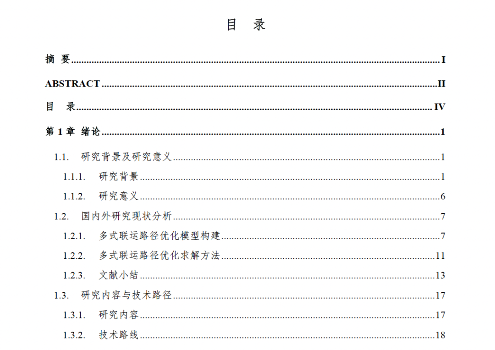
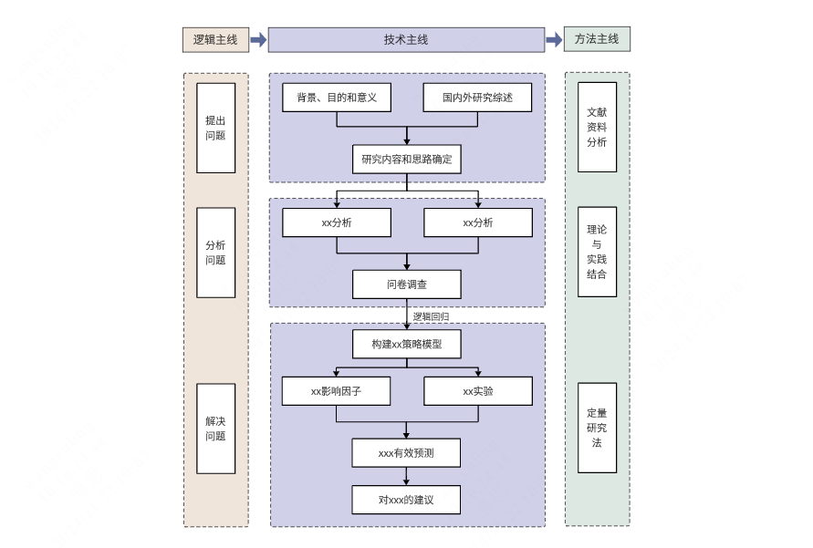

# 如何写好一篇MEM非全日制硕士论文 | 开题篇：研究内容与研究方法的“避坑指南”

> 原文链接：[如何写好一篇MEM非全日制硕士论文 | 开题篇：研究内容与研究方法的“避坑指南”](https://mp.weixin.qq.com/s/p6_N75K_oCu761ubrhvCfA)

MEM论文写作系列

开题报告核心：研究内容与研究方法

开题报告中，研究内容与方法是你给评委老师的“施工蓝图”。写不实、写不对，答辩评委凭什么让你过关？

研究内容与方法写得越具体、越有依据，评委老师才越放心让你开工。

阅读时长约8分钟归云

📑 目录01研究内容 ≠ 论文章节目录02研究方法“避坑”03技术路线图：一图胜千言04总结

← 左右滑动查看更多 →
 系列第七篇 | 前情：开篇定调、精准选题、Word排版、搭建骨架、文献综述、文献管理 

开题答辩中，除了文献综述，还有哪一部分最容易被评委“盯上”？

是**研究内容与研究方法**。

为什么？因为这两部分，是你在梳理完研究背景、文献综述后，为自己论文绘制的“施工蓝图”。评委们要看的，就是这张蓝图——凭你现有的时间、数据、能力和资源，到底能不能落地？

开题的核心目的，就是确认你的研究 **“可完成”**。如果研究内容只是目录的复制粘贴，没有详细的可落地内容；研究方法含糊其辞，堆一堆“文献分析法”“定量分析法”之类的笼统概念，那么评委的第一反应往往是：“这个学生自己都还没想清楚。”

这一篇，我们就来聊聊：如何把研究内容写实、把研究方法写对，让你的开题报告真正立得住，让答辩评委觉得你的论文开题“靠谱”。

01CHAPTER ONE研究内容 ≠ 论文章节目录

很多同学写研究内容时，直接复制论文的章节目录：“第一章：绪论；第二章：相关理论；第三章：现状分析；第四章：方案设计……”

这等于没写。评委要看的不是你的论文有几章，而是：先整体介绍论文的研究内容、研究对象或关键创新，让人理解研究的潜在价值和研究逻辑；然后分段依次介绍每一章的研究内容。

完整的研究内容一般包括四个部分：研究目标、研究内容、拟解决的关键问题、论文三级目录。

研究目标：先说背景，再列目标，最后总结价值

写研究目标之前，先用一两句话把问题的“来龙去脉”点清楚——你为什么要做这个研究？企业或现实中到底卡在哪儿了？让评委知道你的论文出发点。

例如：A公司中欧运输业务中，运输成本居高不下、货损风险难以控制、碳排放约束日益严格，现有运输模式已经无法适应当前的业务发展需求。

有了这个背景，再分条列出你具体要达成的成果。每条目标都要指向一个可交付的结果，不要写“提出优化方案”这种空话，而要写“构建……模型，预期降低成本X%”。

研究目标的关键是具体、可衡量、能落地。**能量化的尽量量化，不能量化的也要说清楚用哪个指标来评价**。

最后，用一句话概括研究价值和意义，让评委感受到：你的论文不只是为了毕业，而是真的能帮企业解决实际问题。

研究内容：整体概述+分章介绍

这部分是开题报告最核心的内容，需要先做整体概述，再逐章介绍。

整体概述用一到两段话，讲清楚：研究对象是谁、核心问题是什么、用什么核心方法、关键创新点在哪里、全文按什么逻辑展开、预期有什么价值。让评委一眼就看出你的研究“有骨架、有亮点”。

例如：本研究以A公司中欧班列多式联运业务为对象，针对运输成本高、货损风险大、时效波动严重三个实际问题，构建一个同时考虑运输成本、碳税成本、货损成本与时间成本的多目标路径优化模型。关键创新在于将货损率与运输方式、路径选择进行内生性联动建模，并引入碳税成本作为独立优化目标。全文按“现状诊断→模型构建→算法求解→案例验证”的逻辑展开，研究成果可用于公司的实际业务中，预期降低综合成本xx%。

分章介绍则从第一章到最后一章，每章用一两句话说明：本章解决什么具体问题、用什么方法或数据、产出什么结果。注意不要只写章节标题，要写出“动作”和“成果”。

拟解决的关键问题：提炼最难的2-4个“坎”

关键问题不是“数据难收集”这种操作性困难，而是研究内容中最核心、最具挑战性的技术或管理难点。评委通过这部分判断你的研究是否有深度。

一般写2到4个，每个问题要具体、有针对性。常见类型包括：多目标冲突如何处理、某个关键参数如何内生建模、企业脏数据如何清洗适配等。

（1）多目标冲突处理：如何在运输成本、时间、碳税、货损四个目标之间进行权衡，避免某个目标被边缘化？ （2）货损风险内生建模：如何将货损率设计为与运输方式、路径节点数量相关的函数，而非固定常数？

这里有一个关键点，在写需要解决的关键问题时，一定要基于前文所说的**以你现有的时间、数据、能力和资源可以解决这些关键问题**。

附上三级目录

在这部分还需要给出初步的章节目录，具体到三级标题，后续论文写作过程中可以调整和完善章节目录。

02CHAPTER TWO研究方法“避坑”

说完了研究内容，再来看看研究方法。这部分同样容易踩坑，有三个最常见的“雷区”与大家分享。

雷区1：把“万能词汇”当方法

常见错误写法：“本文采用文献研究法、定量分析法、案例分析法……”

这些词本身没错，但它们太泛了，放任何论文里都能用。评委看完等于没看。

正确做法：写出具体的技术、工具、模型、算法。错误写法正确写法定量分析法采用混合整数线性规划（MILP），使用xx求解器或使用xx算法求解……案例分析法选取A公司202X年XX-XX月的XX票中欧班列订单作为样本，进行数据提取分析……

雷区2：方法之间层次混乱

错误写法：“本研究方法包括：系统工程理论、遗传算法、SPSS统计分析……”

“系统工程理论”是一个学科领域，而“遗传算法”是一种具体算法，两者不在一个层面。并列列举会让评委觉得你概念不清。

正确做法：按方法的功能或层次分组。

本研究采用以下方法： 建模方法：多目标混合整数线性规划（MILP） 求解算法：改进的NSGA-II遗传算法

雷区3：只写方法，不写“用在哪儿”

错误写法：“本文将使用遗传算法。”

评委会问：用在哪儿？解决什么问题？为什么是它而不是其他？

正确做法：每写一个方法，紧接着说明它的应用场景和选择理由。

例如：“针对多目标优化问题，本文采用NSGA-II遗传算法。该算法能够同时优化成本、时间、碳排放三个冲突目标，且在多式联运路径规划场景中已被验证具有较好的收敛性。算法将嵌入到第四章的模型求解中，用于搜索帕累托最优路径集合。”

03CHAPTER THREE技术路线图：一图胜千言

技术路线图是研究内容和方法的“可视化汇总”。一张好的路线图，应该让人一眼看出：你的研究分几个阶段**问题界定→模型构建→数据采集→求解验证→结论建议**，每个阶段用什么方法，阶段之间如何衔接。

绘制时注意几点：从上到下或从左到右，符合阅读习惯。用不同形状区分“研究方法”“研究内容”。在正文中必须有一段话解释这张图，不能只贴图不说话。

常见错误是图太复杂、没有逻辑箭头、或图中内容与正文不一致。

格式可参考下图：

04CHAPTER FOUR总结

开题报告，本质上是让答辩评委知道：我清楚地知道我要做什么、怎么做、做出什么。 写得越具体，评委越相信你能完成；写得越空泛，评委越觉得你还没想好。

开题答辩不是走过场，而是你正式动工前的“图纸会审”。蓝图对了，后面的砖瓦才不会白搭。

内容为王

开题报告里，研究内容与方法就是你给评委的“可行性证明”。点赞在看评论

—— 归云

