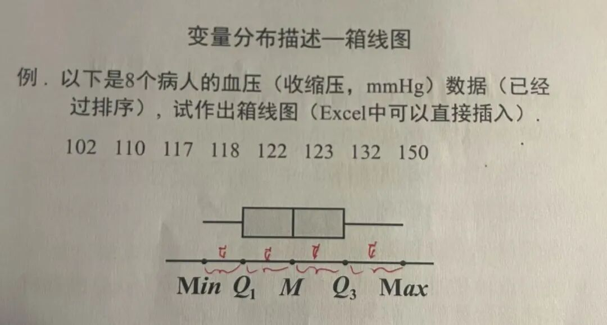
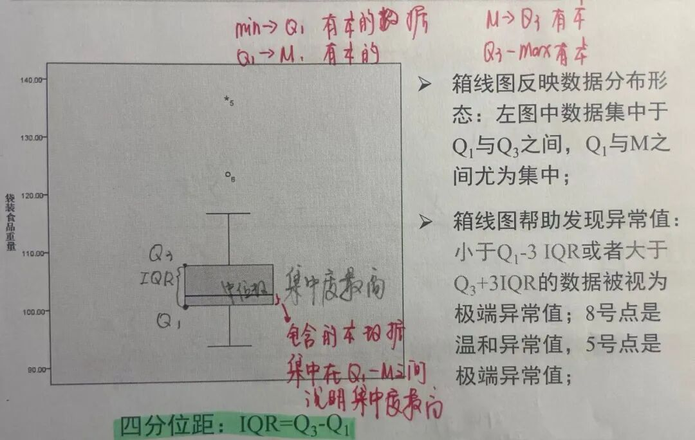

# 如何写好一篇MEM非全日制硕士论文 | 数据采集与处理篇：数据从哪里来、怎么洗干净

> 原文链接：[如何写好一篇MEM非全日制硕士论文 | 数据采集与处理篇：数据从哪里来、怎么洗干净](https://mp.weixin.qq.com/s/vqCquMjQR4DYIKjOc-srLg)

MEM论文写作系列

**清洗脏数据**

从各方获取的一手数据，有的格式不一致，有的缺少某个关键值，有的有明显的逻辑错误，这些数据很脏，需要清洗后方能使用。

**数据质量四维度：完整性、准确性、一致性、及时性。清洗过程占数据分析总时间的60%-80%，但极其值得。**

阅读时长约 10 分钟归云

📑 目录01数据搜集：按图索骥02数据清洗四步法03数据质量评估框架04数据处理的文档化与可复现性05最后说几句

← 左右滑动查看更多 →

系列第九篇| 前情：开篇定调、选题、排版、骨架、文献综述、文献管理、研究内容与方法、现状诊断

上一篇文章我们聊了如何从数据中挖出“真问题”，在构思本篇文章的写作思路时，发现不对呀，第八篇的内容有一个硬前提——你得先有数据，而且数据要足够干净。于是，便有了这篇关于数据获取与清洗的文章。

MEM的论文一般是基于我们工作内容，所以相对来说数据的获取不难，但难的是从各方拿到的数据不是统计标准不一样、就是有明显逻辑错误、抑或是前后不一致……

是不是看着这样的数据头就大？

怎么办？

追加这一篇内容，从我的实践经验来说说：**数据从哪里找？拿到脏数据怎么洗？什么样的数据才算合格？**

01CHAPTER ONE数据搜集：按图索骥

按需所取

在实际业务中，每一项业务都会产生大量数据，不同数据参数对应不同的业务模块。搜集数据时，首先要在论文所需的整体数据结构框架下去搜集，而不是眉毛胡子一把抓，把业务数据一股脑地复制粘贴。而是需要先厘清论文的研究边界与指标口径，有针对性地抽取关键数据。**列出你需要的所有变量**：因变量（你要解决的问题指标）、自变量（可能的影响因素）、控制变量（其他需要固定的条件）。**明确数据粒度**：每条记录代表一个订单？一个项目？一天的生产记录？粒度决定了你能做什么分析。**确定时间范围**：是否需要季节性对比？是否需要足够样本量？MEM论文通常需要覆盖典型周期。

**举例说明**： 

我需要研究多式联运路径优化，变量清单如下：因变量：单票总成本、总运输时间、货损率、碳排放量。自变量：运输方式组合（铁路/公路/海运占比）、中转节点个数、货物类型、季节等。粒度：每票订单为一条记录。时间范围：近两年完整数据，覆盖旺季淡季。

数据来源渠道**企业一手数据**：这是核心数据，来源于SAP、CTM等企业的数据管理系统，以及企业在政府管理平台上的数据。这部分数据涉及到企业的商业机密，需要提前与数据负责人沟通，说明用途并签署保密协议，在论文中数据做脱敏处理。**公开数据**：行业统计年鉴、上市公司年报、政府开放数据（如交通运输部货运量）。**第三方数据**：行业协会、专业分析机构的统计数据；学术论文公开的案例数据。**调查/测量数据**：问卷、实地测量统计的数据。

企业数据通常分散在多个系统，可以通过导出Excel再使用 Power Query进行数据整理。

02CHAPTER TWO数据清洗四步法

正如前文所说，拿到的基础数据大概率会有以下问题：缺失值、异常值、重复值、格式不一致、单位不统一、逻辑矛盾……这样的数据很脏，需要清洗。

可以尝试使用以下步骤进行数据清洗：
 步骤1 
 初步探查与描述统计 →
 步骤2 
 缺失值处理 →
 步骤3 
 异常值识别与处理 →
 步骤4 
 格式统一与变量派生 

第一步：初步探查与描述统计用`=COUNT()`、`=AVERAGE()`、`=STDEV()`等函数或数据分析工具SPSS查看数据概况。列出每个变量的：样本量、均值、中位数、标准差、最小值、最大值。**目的**：发现明显异常（如最大值为负数、缺失比例极高）。

第二步：缺失值处理

数据缺失的原因有很多，比如数据未录入、录入错误，数据不适用（如某类订单无货损记录）等，在处理缺失值时，需要根据不同的数据缺失情况进行分类处理。缺失比例处理方法说明&lt;5%删除对应行（若数据量大且随机）最简单，但会减少样本量5%-20%均值/中位数填充 或 同类样本均值填充适用于连续变量，分组填充更准确&gt;20%保留为单独类别（分类变量）或删除该变量若缺失集中在某一类，可将其视为“未知”

**进阶方法**（可选）：使用移动平均法、回归预测进行填充，这些需一定统计基础。

第三步：异常值识别与处理**异常值识别方法**1业务规则：直接从业务逻辑判断，这是最没有争议的一类。比如，成本、工时不能为负数，合格率不能超过 100%，这些一看就不对。2IQR 四分位距法（箱线图）：这个方法不看平均数，而是基于数据“中间一半”样本的范围来划一条边界。它最大的好处是不怕数据有偏斜，比如大多数成本正常、少数极高的情况，也能准确识别。低于 Q1 - 3×IQR 或高于 Q3 + 3×IQR 的点，就视为异常。

**异常值处理方法**1 明显错误：如果知道正确值，则进行修正，否则删除。2 真实极端值：可以保留，在分析时单独讨论。3 无法判断：标记并请相关业务人员确认。

第四步：格式统一与变量派生**单位统一**：全部转为“元”、“公里”、“吨”。**日期格式**：统一为YYYY-MM-DD。**分类变量编码**：如运输方式=1(铁路)，2(公路)，3(海运)。**派生新变量**：根据原始数据计算更有意义的指标。例如：碳税成本 = 碳排放量 × 碳税价格。

03CHAPTER THREE数据质量评估框架

数据清洗完成后，可以从以下四个维度来评估数据是否真正可用：维度定义判断标准不达标对策完整性数据是否存在缺失？关键变量缺失比例 &lt;5% 为优，&lt;20% 可接受缺失严重时，考虑缩小研究范围或采用插补估算准确性数据是否真实反映业务现实？抽样核对业务系统，或与业务方确认，偏差在可接受范围内偏差较大时，重新采集或通过加权校正一致性不同来源的数据是否存在逻辑矛盾？无冲突，如总成本应等于各分项之和以权威来源为准，记录并说明差异时效性数据的时间跨度是否覆盖研究问题？至少覆盖2年，且包含典型业务周期时间不足时，相应缩小研究结论的适用范围

04CHAPTER FOUR数据处理的文档化与可复现性

**数据处理的过程记录**，虽然只是数据清洗的一条“支线”，却也是很多同学容易忽略的一步。但它其实非常重要。一份可追溯的数据，意味着当你发现清洗后的数据仍然存在问题时，可以凭记录回溯到原始数据，进行比对与复核。**建立一份“数据字典”**：记录每个变量的名称、含义、单位、来源、缺失比例以及清洗方法，相当于给数据配一本说明书。**保留原始数据副本**：永远不要在原始文件上直接修改。复制一份出来，在副本上做清洗。**记录清洗步骤**：用注释或独立文档，把每一步操作都留下来，比如“删除了3笔成本为0的异常记录”“将单位从元转换为千元”。**方便随时回溯**：当导师或评委对某个数据点提出疑问时，你能快速讲出它的处理过程，有理有据。

05CHAPTER FIVE最后说几句

写这篇关于数据采集与处理的文章时，我顺手翻看了当初准备的数据。现在的原始数据文件夹里，还保存着当时各种格式的原始文件。即便今天以一个已经把这些数据洗干净、理清楚的“过来人”身份去看，看到那些格式不一、标着红色波浪线的数值，依然觉得头疼。

这些数据的收集、整理与清洗，确实耗费了我大量时间。

但现在回头看，那些时间反而是最值得的投入。数据干净了，后面的制图、分析、建模，一路畅通。**如果当初偷懒不洗，后面每一步都会磕磕绊绊，甚至可能全盘推翻重来。**

**源清本正**

数据采集不贪多求全，但要系统设计；清洗过程多花时间，但要透明可复现。点赞在看评论

—— 归云

