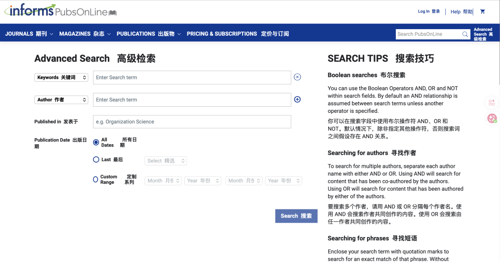
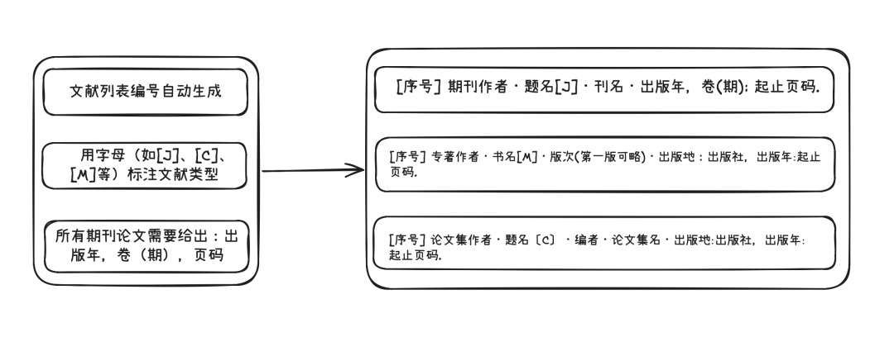

# 如何写好一篇MEM非全日制硕士论文 | 文献工具篇：搜得准、管得好、引得对

> 原文链接：[如何写好一篇MEM非全日制硕士论文 | 文献工具篇：搜得准、管得好、引得对](https://mp.weixin.qq.com/s/73zcWX5ICNXc5bvddRlWaQ)

MEM论文写作系列

文献搜索、管理、引用

搜不到、管不拢、引不对——文献工作的三大痛点，一次解决。别让自己淹没在PDF里，也别让参考文献格式毁掉你的严谨。

搜得准、管得好、引得对——文献管理的三大基本功，缺一不可

阅读时长：约10分钟归云

📑 目录01定界：明确需求，精准出击02建序：高效搜索，找到核心文献03升维：高效管理，让文献为你服务04落位：规范引用，避免学术不端05明义：文献是脚手架，不是牢笼

← 左右滑动查看更多 →
 系列第六篇 | 前情：开篇定调、精准选题、Word排版、搭建骨架、文献综述 

啊哈～写这篇文章时我才意识到，它本该放在文献综述那篇之前。难怪当初写完文献综述，总觉得少了点什么——原来我还没写如何检索、管理、阅读文献，就一头扎进了文献综述的环节了。

文献综述，写是一方面，而文献检索、管理、引用又是写的重要基石。打开知网搜出一堆不相关文献？下载的PDF散落桌面找不到？手动敲参考文献，改一个序号就要重新排半天？**搜索、管理、引用**，是文献工作的三大基本功。 这一篇，我们就来聊聊如何用最高效的方式，把这三件事做对、做好。

01CHAPTER ONE定界：明确需求，精准出击

在打开数据库之前，先问自己三个问题，与写MEM论文的核心“目标导向”一致：**我需要什么类型的文献？**

MEM论文通常需要：学术期刊论文、学位论文、会议论文、行业报告、标准规范等。其中，**高质量期刊论文是核心参考来源**。建议：1少引用硕士学位论文。2不引用页数少于4页的“摘要式”论文。3优先选择管理科学与工程领域相关的、评级较高的期刊。**我需要多少文献？**

一篇MEM论文的文献综述，一般精读至少50篇高质量文献，其中英文文献不少于20篇。当然，这也与学校的要求相关——我们学校要求最少65篇文献。
 质量重要，数量也很重要。 如果引用文献质量太低，论文可能会被评审老师直接判入“垃圾论文”序列。 **我需要什么时间范围的文献？**1要多引用近5年的中英文期刊论文。2经典理论文献可以适当引用近10年的文献。

明确需求后，再开始搜索，而不是漫无目的地“逛数据库”。

02CHAPTER TWO建序：高效搜索，找到核心文献

选对数据库与访问途径文献类型推荐数据库中文期刊/学位论文中国知网（CNKI）、万方外文期刊ScienceDirect、INFORMS行业报告/标准国家标准化管理委员会、各行业协会官网

掌握关键词与高级检索技巧

关键词不是随便敲几个词进去。建议采用 “核心关键词 + 限定词” 的组合策略，并善用数据库的高级检索功能**核心关键词**：你的研究主题，如“多式联运”“路径优化”“项目进度管理”。**限定词**：方法、场景、目标等，如“遗传算法”“碳排放”“风险管理”。

**实用技巧**：1使用布尔运算符：使用 AND（与）、OR（或）、NOT（非）组合检索条件。2利用“主题词”、“篇名”等字段进行精准检索，避免全文搜索带来的噪音。3善用综述文献，综述是了解一个新课题或领域最快的方式之一，覆盖面广，能让后续目标文献检索事半功倍。可在检索词中加入“综述”或“review”。4检索词转化，每一个检索词有可能有多种表达形式，可以对间多次的同义词、近义词、缩写等形式进行检索。

顺藤摸瓜：从一篇好文献出发

找到一篇高质量的核心文献后，可以做两件事，这也是主动学习的高效方法。**看它的参考文献（往回找）**：找到该领域的基础性、奠基性文献。**看它的被引文献（往前找）**：找到后续发展的最新研究，了解学术脉络的延伸。

03CHAPTER THREE升维：高效管理，让文献为你服务

下载了几十篇PDF之后，如果不加管理，很快就会陷入“找一篇比读一篇还久”的困境。强烈推荐使用专业的文献管理工具。

使用文献管理工具

论文文献管理工具有很多，根据自己的使用习惯选择即可。推荐两款免费、开源、好用的工具：文献管理工具优点备注Zotero免费、开源、插件丰富GitHub、Zotero官网都有很多很好用的插件Mendeley免费、支持PDF拖拽导入、网页插件抓取与Word无缝集成，实现参考文献的自动插入和格式编排

建立分类与标记体系

在文献管理工具中，建议建立清晰的文件夹或标签系统，例如：**按论文章节分类**：如“第一章 绪论”、“第三章 问题分析”。**按重要性/状态分类**：如“核心文献”、“已读-待总结”、“已引用”。**做好阅读笔记**：在工具中记录文献的核心观点、研究方法、与自身研究的关联，以及可引用的原文（标注页码）。

文献阅读技巧**注重摘要**：多数文章看摘要，少数文章看全文。通过阅读摘要可以快速筛选掉价值不高的论文，把更多时间留给核心文献。**碎片化阅读**：结合非全日制同学的实际情况，充分利用碎片化时间进行文献阅读，但一定要做好记录，对关键内容进行标记。**阅读顺序**：管理类论文的一般结构为：摘要→引言→方法→结果→讨论→结论。建议阅读顺序：**先看摘要、引言，再看结论，最后详细阅读方法和结果**。

04CHAPTER FOUR落位：规范引用，避免学术不端

引用参考文献是严肃的学术行为，必须严格遵守规范。

严格遵守引用格式

不同学校、不同期刊对参考文献格式有不同要求。MEM学位论文的文献引用格式，一般要求遵循 GB/T 7714-2015 这一国内通用标准。**关键要点**：1文献类型标识（如[J], [M], [C]）要正确。2期刊论文需著录“年，卷(期)：起止页码”。3文献中的英文名字不可进行缩写，一定要写正确的人名称呼。4中文和英文参考文献书写并不相同。中文的作者一般是“姓+名”。而英文参考文献是采用“姓,名.”的方式。5如果引用的中文文献作者有多个，一般是采用前三位作者署名，第三位作者后面添加等字；英文文献则采用，“姓, 名, and姓, 名”的方式进行书写，除第一位以外，都按照正常顺序写。

**实操建议**：在Word中，使用Mendeley或Zotero的插件，将引文样式设置为“GB/T 7714 (numeric)”，即可实现一键插入和自动生成格式规范的参考文献列表。当然，自动生成有时也会有错误，需要人工仔细核对。

引用的时机、方式与常见问题

引用他人观点时，应用自己的话转述并标注出处；引用数据、图表需明确来源；引用经典定义可使用原文，但必须加引号。场景正确做法错误做法引用他人观点用自己的话转述 + 标注出处大段抄写原文引用数据/图表注明来源，必要时获取授权直接复制粘贴引用经典定义可用原文，但必须加引号和出处不加引号，让人误以为是自己的定义

必须避免的问题**过度引用**：一句话后面跟三四个参考文献，显得堆砌。**无效引用**：引用了一篇与论点关系很弱的文献，或者引用二手文献而不查原文。**引用领域不符**：不要引用与论文主题无关的医学、教育等非主流期刊。**格式不规范**：格式混乱会直接导致评审老师对论文严谨性产生负面评价。**照搬照抄**：绝对禁止直接复制粘贴。

文献列表的整理

在论文定稿前，务必逐条核对参考文献列表，确保：正文中的每一个引用序号[序号]，在文末列表中都有对应的条目。列表中的每一个条目，都在正文中被引用过。所有格式细节（标点、空格、字体等）均符合GB/T 7714-2015规范。

05CHAPTER FIVE 明义：文献是脚手架，不是牢笼

最后，仍需要回到根本：我们为何要如此严谨地对待文献？

因为文献是你与学术共同体对话的桥梁，是你研究立论的基石。扎实的文献工作能确保你的研究“站在巨人的肩膀上”。

但切记，文献是工具，是支撑你表达个人见解、解决实际问题的“脚手架”。切勿陷入“为文献而文献”的误区，淹没在资料堆中而失去了自己的思考和创新。

当你熟练掌握了“搜、管、引”的系统方法，并严格遵循学术规范，文献将不再是写作的负担，而会成为你高效、高质量完成MEM学位论文最得力的伙伴。

善假于物

文献是工具，不是目的——学会“搜索、管理、引用”，让它为你所用。点赞在看评论

—— 归云

