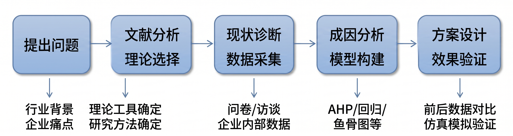

# 非全日制 MEM 工程管理硕士毕业论文实战指南

> 本指南面向一个具体的人：你是非全日制 MEM 在读生，白天上班，晚上带着焦虑打开电脑，不知道论文该怎么开始。这份文档的目标是让你 **每一步都知道做什么、怎么做、做到什么程度算合格**。

---

## 第零章 在一切开始之前——给迷茫的你

### 0.1 你的焦虑是正常的，但可以被结构化

你现在的状态大概率是这样的：

- 不知道自己能写什么
- 觉得同学们都已经开始了，只有自己还在原地
- 打开知网看了几篇论文，完全看不懂在说什么
- 害怕选了一个太难的题目，更害怕选了一个太水的题目

**这些都是正常的。** 很多非全日制 MEM 学生在开题前都会经历这个阶段。焦虑的本质不是"你不行"，而是"你不知道全貌"。当你看完这份指南，你会发现整个论文就是一个项目管理题——而你恰好在学项目管理。

### 0.2 MEM 论文到底是什么？一句话讲清楚

**MEM 论文 = 用学过的管理理论和工具，解决你工作中一个真实的工程管理问题，并用数据、调研或评鉴证明你的方案有效。**

它不是：
- 学术发现（不需要你提出新理论）
- 工作总结（不能只有"我做了什么"，还要有"为什么这么做"和"效果如何"）
- 技术报告（重点不是技术本身，而是**管理**技术实施的过程）

### 0.3 给自己做一次"资源盘点"

在选题之前，先用 30 分钟填写下面这张表。它决定了你后续所有的选择：

| 盘点维度 | 你的回答 |
|---------|---------|
| 你目前的行业和岗位？ | （如：互联网/基础架构运维） |
| 你在这个岗位上最头疼的管理问题是什么？（列 3 个） | 1.____ 2.____ 3.____ |
| 你能拿到哪些企业内部数据？（如：项目工期记录、故障工单、成本报表等） | |
| 你的直属领导是否支持你用公司案例写论文？ | 是 / 否 / 没问过 |
| 你还剩多少时间到提交盲审？ | ____个月 |
| 你每周能投入论文的时间？ | ____小时 |
| 你的数学/统计基础如何？ | 几乎零基础 / 学过但忘了 / 还行 |
| 你会用哪些工具？ | Excel / SPSS / Python / 都不会 |

**这张表非常重要。** 后面每一步的决策都会回来参考它。如果你现在还没有答案，没关系——带着这些问题继续往下读。

### 0.4 如果你现在很迷茫，先做这 7 个动作

迷茫时最怕继续“想清楚再开始”。论文不是靠想清楚启动的，而是靠交付物启动的。今天先完成下面 7 个动作，不追求完美，只追求留下痕迹。

| 顺序 | 动作 | 产出 | 合格标准 |
|------|------|------|----------|
| 1 | 建一个论文文件夹 | `00_总控表`、`01_文献`、`02_数据`、`03_开题`、`04_正文`、`99_归档` | 所有材料从今天开始只放这里 |
| 2 | 写 10 个工作痛点 | 一张痛点清单 | 每个痛点必须来自真实工作，不写宏大口号 |
| 3 | 找 5 篇相似硕士论文 | 文献列表 | 题目里至少包含你的行业、方法或管理问题之一 |
| 4 | 写 3 个候选题目 | 题目草案 | 每个题目都包含“对象 + 问题 + 方法” |
| 5 | 列可获取数据 | 数据清单 | 写清楚数据在哪、谁能给、是否涉密 |
| 6 | 找 1 位同学或师兄师姐问流程 | 访谈纪要 | 问清楚学校时间节点、盲审要求、导师风格 |
| 7 | 给导师发第一次材料 | 一页纸选题卡 | 不是问“老师我写什么”，而是给老师做选择题 |

**今天结束时，你只需要拿到一个最低可用版本：**

```
我目前在 [行业/岗位]，能接触到 [项目/系统/流程]。
我观察到的核心管理问题是 [具体痛点]，它造成了 [可量化后果]。
我初步想用 [理论/方法] 分析原因并提出 [优化方向]。
我能获取的数据包括 [数据1]、[数据2]、[访谈/问卷对象]。
我担心的问题是 [数据权限/方法不会/题目太大]，希望导师帮我判断是否可行。
```

### 0.5 论文不是“写文章”，而是交付一个管理改进证据链

从第一天开始，你就要把论文理解成一条证据链：

```
真实工程场景
  → 具体管理问题
    → 数据证明问题存在
      → 理论/方法解释问题成因
        → 方案逐项回应成因
          → 数据或专家评审证明方案有效
            → 形成可复用的管理启示
```

后面所有章节都服务于这条链。只要某一段内容不能回答“它在证据链里承担什么作用”，就要删掉或重写。

---

## 第一章 整体规划——把论文当项目管

### 1.1 论文全流程里程碑（以 12 个月为例）

MEM 论文本质上就是一个项目，你是项目经理。以下是推荐的时间分配：

| 阶段 | 时间 | 核心交付物 | 每周投入 |
|------|------|-----------|---------|
| **Phase 0: 准备期** | 第 1-2 月 | 资源盘点表、导师确认、初步选题方向 3 选 1 | 5h/周 |
| **Phase 1: 开题** | 第 3-4 月 | 开题报告（含文献综述初稿） | 8h/周 |
| **Phase 2: 理论与现状** | 第 5-6 月 | 第 2 章理论综述 + 第 3 章现状诊断 | 10h/周 |
| **Phase 3: 核心研究** | 第 7-9 月 | 第 4 章成因分析 + 第 5 章方案设计 + 数据收集 | 12h/周 |
| **Phase 4: 验证与收尾** | 第 10-11 月 | 第 6 章效果验证 + 第 1/7 章（绪论和结论放最后写/改，此时你才真正知道自己做了什么） + 全文统稿 | 12h/周 |
| **Phase 5: 打磨** | 第 12 月 | 查重、格式、预答辩修改、盲审提交 | 15h/周 |

> **关键原则：永远不要"憋大招"。** 写完一章发给导师一章，每 2 周和导师至少沟通一次。

### 1.2 你现在应该做的第一件事

根据你离提交盲审的时间，找到你应该处于的阶段，然后直接跳到对应的章节开始读。

### 1.3 先查你的学校节点——所有计划的起点

**在做任何时间规划之前，先去学校研究生院官网或问教务老师，确认以下时间节点：**

| 节点 | 你的学校日期 | 备注 |
|------|------------|------|
| 开题答辩 | ____ 年 ____ 月 | 有些学校每学期固定时间，错过要等半年 |
| 中期检查 | ____ 年 ____ 月 | 很多学校要求提交中期报告，证明论文在推进 |
| 预答辩 | ____ 年 ____ 月 | 通常在盲审前 1-2 个月 |
| 盲审提交 | ____ 年 ____ 月 | 这是你真正的 deadline |
| 正式答辩 | ____ 年 ____ 月 | 盲审通过后才能参加 |
| 学位授予 | ____ 年 ____ 月 | 一年通常只有 1-2 次 |

**同时确认：** 你学校对论文字数、查重率、参考文献数量、论文类型有没有明确规定？格式模板在哪里下载？这些信息优先级高于本指南的任何建议——**学校要求和本指南冲突时，以学校要求为准。**

### 1.4 按剩余时间反向排期

不同剩余时间对应不同策略。不要拿 12 个月的悠闲计划安慰只剩 4 个月的自己。（注：如果你的学校有中期检查环节，需要在中期检查前完成至少第 2-3 章初稿。）

| 距离盲审 | 选题策略 | 数据策略 | 写作策略 | 风险提示 |
|----------|----------|----------|----------|----------|
| 12 个月以上 | 可以多比较 2-3 个方向 | 可做问卷、访谈、试点、前后对比 | 按章节稳步写 | 不要一直停在选题阶段 |
| 9 个月 | 选最熟悉、数据最稳的方向 | 企业内部数据 + 少量访谈 | 开题后每月完成 1 章 | 研究方法不要过度复杂 |
| 6 个月 | 选案例研究或管理诊断型题目 | 已有数据优先，问卷只做补充 | 先搭框架，再填内容 | 不建议做复杂仿真或大样本模型 |
| 3-4 个月 | 只选“手里已有材料”的题目 | 项目报表、工单、会议纪要、访谈 | 每周交 1 个小版本给导师 | 目标是合格通过，不追求花哨创新 |

### 1.5 每周论文例会：就算导师不催，你也要自己催自己

非全日制学生最容易输在“没人管”。建议每周固定一个晚上做 30 分钟自我例会，写下四句话：

| 问题 | 你的回答 |
|------|----------|
| 本周完成了什么？ | 如：读完 3 篇文献，整理了进度数据 |
| 本周卡在哪里？ | 如：不知道 AHP 指标怎么设 |
| 下周交付物是什么？ | 如：完成选题卡 V2 和文献矩阵 10 篇 |
| 需要谁帮忙？ | 如：找领导确认数据脱敏范围，问导师方法是否合适 |

**每周必须有一个可见交付物。** 可以是一页选题卡、一张数据表、一版目录、一张技术路线图。不要把“我想了很多”当作进展。

### 1.6 把学校硬节点写进你的项目计划

网友经验可以参考，但论文管理流程不能靠经验猜。以华南理工大学 2025 年修订的研究生学位论文工作管理办法为例，开题、中期、预答辩、学术不端检测、论文评阅、答辩都是论文工作的关键控制点；其中开题、中期和预答辩属于论文工作三个考核环节。你的计划表必须先服从学院通知，再套用本指南的节奏。

**建议你建立一张“学校要求总控表”：**

| 要求类别 | 必查内容 | 你要做的动作 |
|----------|----------|--------------|
| 开题 | 最晚时间、开题组人数、开题报告模板、是否允许线上 | 把开题报告、文献矩阵、数据清单提前 2-3 周交给导师 |
| 中期 | 是否必须中期检查、是否能与开题合并、需提交哪些材料 | 至少准备已完成章节、问题-成因-方案表、数据进展 |
| 预答辩 | 何时进行、PPT 时长、是否作为送审前置条件 | 按正式答辩标准演练，不要当成普通汇报 |
| 查重/AI | 查重系统、重复率要求、AI 使用声明或限制 | 留出修改余量，保留 AI 辅助使用和人工核验记录 |
| 评阅/盲审 | 送审条件、评阅结论处理、重评机会 | 不要赌运气；送审前先做 11.4 的自评表 |
| 正式答辩 | 答辩资格、答辩委员会要求、归档材料 | 提前准备论文定稿、PPT、答辩记录修改说明 |

**判断原则：** 本指南里所有“常见”“建议”“通常”的内容都是帮助你行动的经验口径；凡是和学校、学院、导师组的正式要求不一致，一律以正式要求为准。

---

## 第二章 选导师——不是选"最好的"，而是选"最对的"

### 2.1 导师类型速查表

| 类型 | 特征 | 适合你吗？ |
|------|------|-----------|
| **学术大咖** | 院长/博导/项目多 | 适合有自驱力、不需要频繁指导的人。风险：可能被分配给博士生代管 |
| **中青年骨干** | 副教授/讲师/学术上升期 | **最推荐**。回复快、要求明确、会逐章帮你改 |
| **行业背景导师** | 有企业经历或横向课题多 | 适合选题偏实践的同学，能帮你判断案例的价值 |
| **热门导师** | 每届带 10+ 人 | 风险：每人分到的精力有限，需要你主动推进 |

### 2.2 和导师第一次见面前的准备清单

**绝对不要空手去。** 带着以下材料：

1. **你的资源盘点表**（第零章那张）
2. **3 个备选选题方向**，每个用一句话描述：
   - "我在 XX 公司负责 XX，发现 XX 问题，想用 XX 方法来研究"
3. **你能获取的数据清单**：
   - "我能拿到过去 3 年的项目成本报表"
   - "我能在公司内部发放问卷，预计可以回收 150-200 份"
4. **你的时间安排**：告诉导师你每周能投入多少时间、计划什么时候提交

### 2.3 如何判断一个导师"靠不靠谱"

在确定导师前，做这三件事：
1. **找该导师往届学生问**：导师多久回一次消息？会不会帮你逐章修改？盲审通过率如何？
2. **看导师的研究方向**：在知网搜导师名字，看他近 3 年发了什么论文，和你想做的方向有没有交集
3. **第一次沟通后评估**：导师是否在 3 天内回复了你？是否给了明确的方向建议？

### 2.4 导师选择评分表

如果你能选择导师，用下面这张表打分。不要只看名气，要看“能不能把你带过论文全过程”。

| 维度 | 权重 | 评分标准 | 你的评分 |
|------|------|----------|----------|
| 研究方向匹配 | 25% | 导师近年论文、课题、学生论文是否与你的方向接近 | 1-5 |
| 指导频率 | 25% | 是否愿意定期看材料、给明确修改意见 | 1-5 |
| 实践理解 | 20% | 是否理解企业案例、工程管理、非全日制学生处境 | 1-5 |
| 方法支持 | 15% | 能否指导问卷、案例、模型、数据分析等方法 | 1-5 |
| 沟通风格 | 15% | 回复是否及时，要求是否清楚，是否愿意指出问题 | 1-5 |

**建议：** 总分低于 3.5 分要谨慎；如果导师名气很大但沟通极少，你需要额外找企业导师、师兄师姐或同门补位。

### 2.5 第一次联系导师的话术模板

不要发“老师您好，我想请您指导论文，可以吗？”这种空消息。你要让导师一眼看出你做过准备。

```
老师您好，我是 [年级/专业/姓名]，目前在 [公司/行业/岗位] 工作。

我初步想围绕 [具体工程场景] 中的 [具体管理问题] 做 MEM 论文。
目前有 3 个备选方向：
1. [题目1]：可用数据是 [数据]，可能方法是 [方法]
2. [题目2]：可用数据是 [数据]，可能方法是 [方法]
3. [题目3]：可用数据是 [数据]，可能方法是 [方法]

我比较担心 [最大不确定性]，想请老师帮忙判断哪个方向更适合作为毕业论文。
如果方便，我想约您 [两个可选时间] 沟通 20 分钟。我会提前把一页纸选题卡发给您。
谢谢老师。
```

导师看重的不是你已经多厉害，而是你是否主动、具体、可推进。

---

## 第三章 选题——从"我不知道写什么"到"就写这个"

### 3.1 选题自检流程（决策树）

按顺序回答以下问题：

```
Q1: 你目前工作中最头疼的管理问题是什么？
   ├─ 能说出具体问题 → 进入 Q2
   └─ 说不出来 → 执行"痛点挖掘练习"（见 3.2）

Q2: 这个问题属于"工程管理"范畴吗？（进度/成本/质量/风险/供应链/组织协同）
   ├─ 是 → 进入 Q3
   └─ 不确定 → 见 3.3 "MEM 选题边界判断"

Q3: 你能拿到支撑这个问题的数据吗？（企业内部数据 / 可发问卷 / 公开行业数据）
   ├─ 能 → 进入 Q4
   └─ 不能 → 换一个痛点，回到 Q1

Q4: 用一句话描述你的研究："针对 [企业/项目] 的 [具体问题]，运用 [理论/方法]，
    提出 [优化方案]，并通过 [验证方式] 证明方案有效。"
   ├─ 能写出来 → 恭喜，你有选题了！
   └─ 写不出来 → 见 3.4 "题目公式化生成"
```

### 3.2 痛点挖掘练习（如果你真的"想不出来"）

用一周时间，每天下班后花 10 分钟记录：

| 日期 | 今天工作中让我觉得"太蠢了/太低效了/又出问题了"的事 | 它属于哪个管理环节？ |
|------|--------------------------------------------------|-------------------|
| 周一 | 又有一台服务器宕机了，上次的改进方案没人执行 | 质量管理 / 变更管理 |
| 周二 | 跨部门协调一个需求拉了 3 个会还没结论 | 沟通管理 / 组织协同 |
| ... | ... | ... |

一周后，你会发现某个问题反复出现——**那就是你的选题方向**。

### 3.3 MEM 选题的边界：什么能写、什么不能写

| 能写（管理视角） | 不能写（纯技术视角） |
|----------------|-------------------|
| BIM 在多参与方协同管理中的应用 | BIM 建模技术的参数优化 |
| 基于机器学习的设备维护**决策**研究 | 某深度学习算法的改进 |
| 敏捷开发团队的**需求变更管理**机制 | 某微服务架构的设计与实现 |
| 数据中心**容量规划**与成本优化 | 某服务器散热系统的工程设计 |

**核心判断标准：** 你的研究对象是"人、流程、决策、组织"，而不是"材料、电路、代码、设备本身"。

### 3.4 题目公式化生成

**万能公式：**

```
基于 [理论/方法/工具] 的 [具体企业或项目名] [细分管理问题] [研究/优化/评价]
```

**实操示例——从工作痛点到论文题目的转化：**

| 你的工作痛点 | 差的题目 | 好的题目 |
|-------------|---------|---------|
| 项目经常延期 | 项目进度管理研究 | 基于关键链法的 H 公司软件开发项目进度优化研究 |
| 服务器老出故障 | IT 运维管理研究 | 基于 FMEA 的 M 公司数据中心设备故障预防管理研究 |
| 采购成本居高不下 | 企业成本控制研究 | 基于 ABC 分类法的 Z 制造企业原材料采购成本管控研究 |
| 部门之间扯皮 | 跨部门协作研究 | 基于 RACI 矩阵的 L 公司 EPC 项目多部门协同机制优化研究 |
| 新员工上手太慢 | 人力资源管理研究 | 基于 ADDIE 模型的 G 公司工程项目经理岗位能力培养体系构建研究 |

### 3.5 选题的"安全区"——低风险、高通过率的方向

如果你实在没有强烈的倾向，以下是从常见 MEM 论文实践中总结出的相对稳妥选题：

| 方向 | 为什么稳妥 | 适合谁 |
|------|-----------|-------|
| **项目进度/成本/质量管控** | 资料最多、方法最成熟、数据好拿 | 第一选择，尤其适合时间紧的同学 |
| **项目风险识别与评价** | AHP/模糊综合评价有大量模板可参考 | 适合数学基础一般但愿意学 SPSS 的同学 |
| **供应链优化** | 政策热点（双循环），案例好找 | 适合制造业、物流行业同学 |
| **数字化转型管理** | 几乎所有企业都在做，天然有话题 | 适合 IT/互联网行业同学 |
| **绿色/ESG 管理** | 政策驱动（双碳），创新性好讲 | 适合建筑、能源行业同学 |

### 3.6 选题评分矩阵：别凭感觉选题

把每个候选题目按 5 分制评分，再按权重计算加权得分（满分 5 分）。得分最高的不一定最终入选，但低于 4.0 分的题目通常风险较高；如果你懒得算权重，也可以先看原始总分，低于 24/30 分要谨慎。

| 评价维度 | 权重 | 1 分 | 3 分 | 5 分 |
|----------|------|------|------|------|
| 工程管理属性 | 20% | 偏技术或纯管理 | 有工程背景但管理问题不清 | 工程场景明确，研究对象是流程、决策、组织或资源 |
| 问题具体性 | 20% | 题目大而空 | 有问题但边界模糊 | 明确到某企业/项目/流程的某类问题 |
| 数据可获得性 | 25% | 基本拿不到 | 可通过问卷或访谈补充 | 已有内部数据或能稳定收集一手数据 |
| 方法适配性 | 15% | 先有方法再找问题 | 方法大致可用 | 方法能直接解释问题、生成方案、验证效果 |
| 实践价值 | 10% | 结论难落地 | 有一般建议 | 能形成企业可执行的制度、流程、模型或工具 |
| 时间可控性 | 10% | 需要大量外部协作 | 有一定不确定性 | 你个人能主导完成主要工作 |

**决策规则：**
- 数据可获得性低于 3 分，原则上不要选。
- 工程管理属性低于 3 分，容易被认为“不像 MEM”。
- 方法适配性低于 3 分，后面会变成“理论和实践两张皮”。

### 3.7 先选论文类型，再选写法

MEM 论文不是只有一种写法。按工程管理硕士论文标准，常见实践性论文可以分成以下几类。你要先判断自己属于哪一类，再决定章节结构和数据要求。

| 类型 | 适合情况 | 核心问题 | 典型章节主线 | 关键证据 |
|------|----------|----------|--------------|----------|
| 工程管理专题研究类 | 你要研究某类工程管理问题，如风险、成本、进度、质量 | 为什么发生，如何改进 | 背景 → 理论 → 现状 → 成因 → 对策 → 验证 | 文献、案例数据、问卷/访谈、指标对比 |
| 工程管理设计类 | 你要设计流程、系统、机制、评价体系、预警模型 | 设计什么，为什么这样设计，如何证明可行 | 需求分析 → 设计依据 → 方案设计 → 实施/评鉴 → 优化 | 设计图、指标体系、专家评审、试运行数据 |
| 工程管理案例研究类 | 你掌握一个成功或失败的真实项目案例 | 这个案例说明了什么规律，给同类项目什么启示 | 案例背景 → 问题/事件 → 数据分析 → 规律提炼 → 建议 | 项目文档、访谈、会议纪要、过程数据 |
| 管理诊断/调研报告类 | 时间较紧或难以实施完整方案 | 现状是什么，问题在哪里，怎么改 | 调研设计 → 现状诊断 → 问题归因 → 改进建议 → 可行性评估 | 调研数据、专家访谈、管理诊断表 |

**最稳妥选择：** 非全日制学生如果能拿到企业内部数据，优先考虑“专题研究类”或“案例研究类”。它们最容易形成“问题-分析-方案-验证”的闭环。

**特别提醒：** 如果你选择“工程管理设计类”或“工程管理案例研究类”，提前问清学院是否要求成果评鉴、企业证明、专家意见或附录材料。评鉴材料通常需要写明评鉴主体、专家信息、评鉴过程和结论，临近盲审再补会很被动。

### 3.8 从宽题目压缩到可写题目的 5 次收窄

很多题目不是不能写，而是还没收窄。按下面顺序压缩：

| 收窄层级 | 坏例子 | 改进后 |
|----------|--------|--------|
| 行业 | 工程项目管理研究 | 软件开发项目管理研究 |
| 企业/项目 | 软件开发项目管理研究 | H 公司软件开发项目管理研究 |
| 管理问题 | H 公司软件开发项目管理研究 | H 公司软件开发项目进度延误问题研究 |
| 方法工具 | H 公司软件开发项目进度延误问题研究 | 基于关键链法的 H 公司软件开发项目进度优化研究 |
| 验证方式 | 基于关键链法的 H 公司软件开发项目进度优化研究 | 基于关键链法的 H 公司 A 产品研发项目进度优化及实施效果研究 |

当题目收窄到最后一层，你的论文目录、数据、方法基本就能跟着长出来。

### 3.9 “现象”不是“问题”：选题前先过三道门

网友经验里最值得吸收的一点是：**不要把现象当问题。** “成本高、效率低、协同差、质量不稳定”都只是现象。合格的 MEM 论文问题，至少要同时说清楚边界、偏差、原因线索和管理改进空间。

**把现象翻译成研究问题，可以套这个句式：**

```
在 [企业/项目/流程] 的 [时间范围/业务范围] 内，
[指标] 相比 [目标值/历史均值/行业基准/内部对标对象] 偏离 [数值或比例]，
该偏差主要集中在 [线路/部门/阶段/产品/人群]，
初步原因可能是 [可被管理手段干预的机制]，
因此拟运用 [理论/方法/工具] 对 [管理机制/流程/资源配置/决策规则] 进行优化。
```

**三道门：**

| 门槛 | 自问 | 不通过时怎么改 |
|------|------|----------------|
| 真实熟悉 | 这个问题是否来自你能接触的真实工程场景？ | 换成自己岗位、企业、项目中能拿到材料的场景 |
| 学术支撑 | 能否找到相近文献、成熟理论或方法？ | 不要只靠个人经验，先找 5 篇相似硕士论文和 10 篇期刊论文 |
| 资源可行 | 数据、访谈对象、导师方向和时间是否支撑？ | 缩小范围，优先选“能拿到证据”的题 |

**选题自我预答辩三问：**

1. **所以呢？** 这个问题不解决，会造成什么可量化后果？
2. **凭什么？** 你凭什么说它是问题，有没有基准、数据和文献？
3. **然后呢？** 你提出的方案能怎样回应问题，如何验证有效？

如果这三问答不上来，题目暂时还只是一个工作抱怨，不是论文选题。

---

## 第四章 文献综述——从"完全看不懂"到"写出 8000 字"

这是大多数非全日制学生最头疼的部分，因为你可能已经很多年没读过学术论文了。以下是一个完全从零开始的操作流程。

### 4.1 文献查找：去哪找、搜什么、怎么筛

**第一步：确定搜索关键词（5 分钟）**

把你的题目拆成 3-4 个关键词组合。以"基于关键链法的 H 公司软件开发项目进度优化研究"为例：

- 关键词组 A：关键链法 / 关键链项目管理 / CCM / Critical Chain
- 关键词组 B：软件项目 / IT 项目 / 软件开发项目 / 敏捷项目
- 关键词组 C：进度管理 / 进度优化 / 工期控制 / Schedule Management

检索时不要只输入一个大词。更稳的方式是“核心关键词 + 限定词”：

```
核心问题词：进度延误 / 成本超支 / 质量缺陷 / 风险评价
场景限定词：软件项目 / EPC 项目 / 数据中心 / 供应链 / 多式联运
方法限定词：关键链 / FMEA / AHP / 回归分析 / 价值流图
目标限定词：优化 / 评价 / 预警 / 协同 / 控制
```

在数据库高级检索里优先用“篇名/主题/关键词”字段，少用全文搜索；用 `AND` 缩小范围，用 `OR` 纳入同义词，用 `NOT` 排除明显无关领域。找到一篇高质量核心文献后，再做两件事：往回看它的参考文献，往前看它的被引文献，这比随机翻页效率高得多。

**第二步：按优先级搜索以下平台**

| 平台 | 搜索什么 | 数量目标 |
|------|---------|---------|
| **中国知网 CNKI**（首选） | 用关键词组 A+B 或 A+C 搜索硕博论文 | 找到 10-15 篇近 5 年的高质量硕博论文 |
| **知网期刊** | 同上关键词搜核心期刊论文 | 找到 15-20 篇近 5 年论文 |
| **万方/维普** | 补充知网没有的内容 | 补充 5-10 篇 |
| **Web of Science / Google Scholar** | 用英文关键词搜索 | 找到 5-10 篇英文文献（展示国际视野） |

**第三步：快速筛选论文的技巧（每篇 3 分钟）**

不需要一上来就通读。按这个顺序扫：
1. **看题目**：和你的方向相关吗？
2. **看摘要**：他用了什么方法？解决了什么问题？
3. **看目录**：论文结构是什么？有没有你可以参考的框架？
4. **看结论**：他的发现是什么？有什么不足？
5. **标记**：在文献管理工具（推荐 Zotero，免费）中标记为"精读"或"泛读"

### 4.2 文献阅读：先精读 10 篇核心文献，再扩展到 50 篇左右

从筛选出的文献中，先选出 **10 篇和你最相关的** 进行精读，用它们搭起目录、变量、方法和研究缺口的骨架。注意：这不是说最终只读 10 篇。终稿参考文献数量要以学校要求为准；如果学校没有明确要求，50-60 篇是较稳妥的目标，其中近 5 年文献和高质量期刊文献要占足够比例。

精读时填写以下表格：

| 序号 | 作者/年份 | 研究对象 | 研究方法 | 核心发现 | 不足之处（你能补什么） |
|------|----------|---------|---------|---------|---------------------|
| 1 | 张三(2024) | 某建筑项目进度 | 关键路径法+EVM | 发现变更是延误主因 | 没考虑供应链因素 |
| 2 | ... | ... | ... | ... | ... |

> **"不足之处"这一列极其重要**——它直接构成你文献综述最后一段"研究缺口"的内容，也是你论文存在的理由。

### 4.3 文献综述的写作结构（可直接套用的模板）

文献综述不是罗列"张三说了什么、李四说了什么"，而是要按**主题**组织，形成**有观点的叙述**：

```
2.1 [核心理论] 的研究现状
    2.1.1 [理论]的起源与发展（3-5 段，讲清楚这个理论是什么、核心要素有哪些）
    2.1.2 [理论]在工程管理中的应用（综述别人怎么用的，按时间线或应用场景分）
    
2.2 [你的研究主题] 的研究现状
    2.2.1 国外研究综述（按主题归类，不是按作者罗列）
    2.2.2 国内研究综述（同上）
    
2.3 文献评述与研究缺口（最关键的一节，500-800字）
    - 现有研究取得了哪些成果？（肯定前人）
    - 现有研究存在哪些不足？（指出缺口）
    - 本研究如何弥补这些不足？（亮出你的价值）
```

**"研究缺口"怎么写——常用句式：**

- "现有研究多聚焦于大型基建项目，针对 [你的行业] 的 [具体问题] 研究较少"
- "已有成果在方法上以定性分析为主，缺乏 [你要用的定量方法] 的实证研究"
- "当前研究较少将 [理论A] 与 [理论B] 结合应用于 [你的场景]"

**每个主题小节都要从“述”走到“评”：**

| 写作层级 | 要回答的问题 | 可用句式 |
|----------|--------------|----------|
| 述 | 这一类研究主要做了什么？ | “现有研究主要从……展开，代表性成果包括……” |
| 比 | 不同研究之间有什么差异？ | “相比之下，另一类研究更关注……” |
| 评 | 这些方法适不适合你的场景？ | “该方法适用于……，但在……场景下存在局限” |
| 引 | 你的研究接在哪里？ | “因此，本文拟在……基础上，进一步……” |

一个好用的段尾小结模板：

```
综上，现有研究在 [主题] 方面已形成 [共识/成熟方法]，
但在 [你的行业/对象/变量/约束/验证方式] 上仍存在不足。
结合 [企业/项目] 的实际场景，本文将 [方法/理论] 用于 [具体问题]，
以弥补上述研究与实践之间的缺口。
```

### 4.4 参考文献的常见要求

不同学校对参考文献数量、近年文献比例和英文文献数量的要求可能不同。下表可作为开题和初稿阶段的保守目标，最终以学校模板和导师要求为准。

| 指标 | 常见底线 | 建议目标 |
|------|---------|---------|
| 总数量 | 40 篇 | 50-60 篇 |
| 近 5 年占比 | ≥ 50% | ≥ 60% |
| 英文文献 | ≥ 5 篇 | ≥ 10 篇 |
| 核心期刊占比 | ≥ 30% | ≥ 40% |
| 格式 | 严格按 GB/T 7714 | 用 Zotero 自动生成后再人工校对 |

**工具提醒：** Zotero、Mendeley 可以大幅减少格式工作量，但自动识别经常会把作者、页码、期刊卷期、英文大小写识别错。定稿前必须逐条核对，做到正文引用和文末参考文献一一对应。

### 4.5 文献综述矩阵：读文献不是摘抄，是建地图

建议建一个 Excel 或飞书表格，把每篇文献拆成以下字段：

| 字段 | 你要填什么 | 为什么重要 |
|------|------------|------------|
| 题名 | 完整题名 | 后续引用和归类 |
| 年份/来源 | 作者、年份、期刊/学位论文 | 判断新旧和质量 |
| 研究对象 | 哪个行业、项目、企业或群体 | 判断能不能借鉴 |
| 管理问题 | 研究的是进度、成本、风险、协同还是质量 | 和你的问题对齐 |
| 理论/方法 | AHP、EVM、FMEA、回归、案例研究等 | 帮你选择方法 |
| 数据来源 | 问卷、访谈、企业数据、公开数据 | 判断数据难度 |
| 主要结论 | 2-3 句话概括 | 写综述时归纳观点 |
| 不足与启发 | 它没解决什么，你能补什么 | 形成研究缺口 |
| 可借鉴内容 | 目录、指标、变量、问卷题项、图表 | 直接服务你的写作 |

**综述写作的正确姿势：**

```
不要写：张三研究了 A，李四研究了 B，王五研究了 C。

要写：现有研究主要从三个方向展开：第一类关注 A，代表研究包括……；
第二类关注 B，主要采用……方法；第三类关注 C，但在 [你的场景] 中仍存在……
因此，本文拟……
```

### 4.6 30 篇核心文献包：开题前最低配置

开题前不要盲目追求 60 篇文献。你先凑齐一个“30 篇核心包”，用于支撑开题报告和论文目录。这个包是**开题最低配置**，不是终稿总量。

| 类型 | 数量 | 用途 |
|------|------|------|
| 与你题目高度相似的硕士论文 | 5 篇 | 学目录、学章节、学方法 |
| 与核心方法相关的论文 | 8 篇 | 证明方法成熟且适配 |
| 与行业/场景相关的论文 | 7 篇 | 写研究背景和行业现状 |
| 与管理问题相关的论文 | 7 篇 | 写问题成因和研究缺口 |
| 英文文献 | 3 篇以上 | 补国际视野，不必贪多 |

**最先精读的不是顶刊，而是优秀硕士论文。** 因为你的第一目标不是发顶刊，而是写出一篇结构合格、方法闭环、能通过盲审的专业硕士论文。

---

## 第五章 开题报告——你的论文"立项书"

### 5.1 开题报告是什么？

开题报告就是你向导师和评审组"汇报"：我打算做什么研究、为什么做、怎么做、做多久。它是论文正式开工前的"可行性评审"。

### 5.2 开题报告的标准结构与写法

| 板块 | 字数 | 写什么 | 常见翻车点 |
|------|------|-------|-----------|
| **选题背景与意义** | 1000-1500 字 | 行业大背景（2-3 段）→ 企业具体问题（2 段）→ 理论意义 + 实践意义 | 只有宏观叙述，没有落到具体企业/项目 |
| **国内外研究现状** | 2000-3000 字 | 文献综述精简版（综述 + 缺口） | 抄摘要、不归类、没有评述 |
| **研究内容与目标** | 500-800 字 | 你要解决什么问题？预期目标是什么？ | 目标太宏大、不可量化 |
| **研究方法与技术路线** | 500 字 + 1 张流程图 | 你用什么方法、分几步做 | 没有技术路线图（这是加分项！） |
| **论文章节安排** | 300-500 字 | 列出 6-7 章的标题和每章核心内容 | 章节之间逻辑断裂 |
| **研究计划** | 一张甘特图 | 按月排列各阶段任务 | 没有 |
| **参考文献** | 列出已读文献 | 20-30 篇即可 | 格式不规范 |

### 5.3 技术路线图怎么画

技术路线图是开题报告的"门面"，用 PPT 或 Visio 画一张即可：



这张图的重点不是“画得复杂”，而是让老师一眼看到：你从提出问题出发，经过文献与理论选择、现状诊断、成因分析，最终落到方案设计与效果验证。图中的每个模块都要能对应到论文章节和具体交付物。

### 5.4 开题报告最容易被问的 8 个问题

开题答辩不是看你写了多少，而是看你的研究是否“值得做、能做完、做出来有用”。

| 老师可能会问 | 实际在考察什么 | 你应该准备的回答 |
|--------------|----------------|------------------|
| 为什么选这个题？ | 问题价值 | 说明企业真实痛点、行业背景、具体后果 |
| 这个题目是不是太大？ | 边界控制 | 明确研究对象、时间范围、流程范围、数据范围 |
| 数据从哪里来？ | 可行性 | 列出数据来源、样本量、获取方式、脱敏方案 |
| 为什么用这个方法？ | 方法适配 | 说明方法能解决哪个研究问题，并举文献依据 |
| 你的创新点是什么？ | 研究贡献 | 说应用场景创新、方法组合创新或管理方案创新 |
| 你和已有研究有什么不同？ | 文献缺口 | 用 2-3 类文献综述说明别人做了什么、没做什么 |
| 方案怎么验证？ | 闭环能力 | 前后对比、仿真、专家评审、问卷检验至少选一种 |
| 计划能按时完成吗？ | 进度风险 | 拿出甘特图和每月交付物 |

### 5.5 开题前必须交给导师的 5 个材料

| 材料 | 页数 | 内容 |
|------|------|------|
| 一页纸选题卡 | 1 页 | 题目、背景、问题、数据、方法、预期成果 |
| 论文目录 V1 | 1-2 页 | 写到三级标题，体现问题-成因-方案-验证 |
| 文献矩阵 | 1 个表 | 至少 20-30 篇，标出可借鉴内容 |
| 数据清单 | 1 页 | 数据字段、时间范围、来源、权限、脱敏方式 |
| 技术路线图 | 1 页 | 一图说明你怎么从问题走到结论 |

导师如果只看一眼，也能从这 5 个材料判断你的论文能不能做下去。

### 5.6 “研究内容”和“研究方法”不要写虚

开题报告最常见的毛病，是把“研究内容”写成目录，把“研究方法”写成一串名词。评委真正关心的是：你到底要交付什么、每个方法用来解决哪个问题。

**研究内容不是章节目录，而是研究任务。** 可以按下面方式写：

| 模块 | 你要写清楚什么 | 不合格写法 |
|------|----------------|------------|
| 研究对象 | 研究哪个企业、项目、流程、系统，边界到哪里 | “研究企业项目管理问题” |
| 核心问题 | 具体偏差、后果、成因线索是什么 | “分析存在的问题” |
| 研究任务 | 诊断、归因、设计、验证分别产出什么 | “提出优化建议” |
| 预期成果 | 流程、模型、指标体系、机制、工具或实施方案 | “提升管理水平” |

**方法也要落到章节和问题：**

| 方法层级 | 示例 | 你必须说明 |
|----------|------|------------|
| 理论 | 约束理论、精益管理、风险管理理论 | 为什么能解释你的问题 |
| 方法 | 案例研究、问卷调查、访谈、AHP、回归 | 用在哪一章，解决什么研究任务 |
| 工具 | SPSS、Excel、yaahp、MS Project、Visio | 如何处理数据或呈现结果 |
| 算法/模型 | NSGA-II、整数规划、时间序列模型 | 输入变量、输出结果、适用前提 |

**开题时每个方法都要能回答三句话：** 我在哪一章用它？它解决哪个问题？为什么不用更简单或更适配的方法？

---

## 第六章 论文正文——逐章手把手写作指南

### 6.1 第 1 章 绪论（3000-4000 字）

**这一章的使命：** 让审稿人在 3 分钟内知道你要做什么、为什么做、怎么做。

| 节 | 写什么 | 字数 | 怎么写 |
|---|-------|------|-------|
| 1.1 研究背景 | 从宏观到微观：行业趋势 → 企业现状 → 具体问题 | 800-1200 | 最后落到"XX 企业在 XX 方面存在 XX 问题"，不要停在行业层面 |
| 1.2 研究目的与意义 | 理论意义 + 实践意义 | 500-800 | 实践意义要具体："本研究可帮助 XX 企业将 XX 成本降低 XX%" |
| 1.3 国内外研究综述 | 如果开题报告已写 2.X 的综述，这里精简引用即可 | 800-1500 | 或者把综述放到独立的第 2 章（更常见） |
| 1.4 研究内容与方法 | 你的研究用什么方法解决什么问题 | 400-600 | 列出 2-3 种方法，每种一句话说清楚"用来干什么" |
| 1.5 研究技术路线 | 放技术路线图 | 1 页图 | 和开题报告一致，正式排版 |
| 1.6 论文结构安排 | 每章一句话 | 300-400 | "第 X 章 ……，主要内容包括……" |

**绪论的"开场白"——不要这样写：**
> ~~"在经济全球化和科技飞速发展的背景下，工程管理面临着前所未有的挑战……"~~

**要这样写：**
> "假设某行业报告显示软件项目延期问题较为普遍，H 公司作为一家中型软件企业，近两年内部开发项目平均延期 23 天，直接导致客户满意度下降和合同违约风险增加。"

**注意：上面只是写法示例。正式论文中必须替换为你能追溯来源的数据，不要保留“假设”或虚拟来源。**

### 6.2 第 2 章 理论基础与文献综述（5000-8000 字）

**这一章的使命：** 证明你有理论储备，并且清楚知道"别人做到了哪里、还差什么"。

**核心原则：只写你要用的理论，不要当成教科书。**

以"基于关键链法的 H 公司软件开发项目进度优化研究"为例：

| 该写的 | 不该写的 |
|-------|---------|
| 关键链法（CCM）的核心概念、三要素、运作机制 | 项目管理的起源与发展历史 |
| CCM 与 CPM/PERT 的区别和联系（一张对比表就够） | PMBOK 十大知识领域逐一介绍 |
| CCM 在 IT/软件项目中的应用案例（3-5 个） | 制造业、建筑业的全部应用 |

### 6.3 第 3 章 现状与问题诊断（6000-8000 字）

**这一章的使命：** 用数据和事实证明"问题真实存在，而且很严重"。

**结构模板：**

```
3.1 研究对象概况
    3.1.1 企业简介（行业、规模、主营业务，1页即可）
    3.1.2 项目概况（你选的具体项目/业务线的基本信息）
    
3.2 XX 管理现状分析
    3.2.1 现有管理流程描述（画流程图！不要纯文字）
    3.2.2 现状数据呈现（表格 + 图表，如：近3年项目工期统计表）
    
3.3 存在的主要问题
    3.3.1 问题一：XX（用数据支撑，如"延期项目占比62%"）
    3.3.2 问题二：XX
    3.3.3 问题三：XX
    
3.4 本章小结
```

**让问题"可视化"的数据呈现方式：**

| 你要展示的内容 | 建议用的图表 |
|--------------|------------|
| 不同时期的对比趋势 | 折线图 |
| 各类问题的占比分布 | 饼图或帕累托图 |
| 流程的各环节耗时 | 柱状图或甘特图 |
| 多维度指标对比 | 雷达图 |
| 因果关系梳理 | 鱼骨图（石川图） |

**图表质量要求：** 图表是盲审专家重点扫视的内容。Excel 截图直接粘贴到 Word 的做法很常见但很粗糙。建议：①图表字体和正文保持一致（宋体/Times New Roman），②分辨率足够清晰（导出为高清图片或使用 Word 内嵌图表），③坐标轴有单位、图例清晰、颜色不超过 3-4 种，④每张图/表下方标注数据来源（如"数据来源：M 公司 2023-2025 年项目周报"）。

**现状诊断四步法：**

| 步骤 | 目的 | 写作产出 |
|------|------|----------|
| 定基准 | 判断“高/低/慢/差”相对谁而言 | 目标值、历史均值、行业标准、内部对标对象 |
| 算偏差 | 把问题严重程度量化 | 实际值、基准值、偏差值、偏差比例 |
| 找分布 | 找到问题集中在哪里 | 按部门、流程、线路、阶段、产品、时间分组统计 |
| 挖根因 | 找到可干预的管理或技术原因 | 5Why、鱼骨图、帕累托图、访谈证据 |

第 3 章最重要的一句话是：**没有基准，就没有问题；没有分层，就没有重点；没有根因，就没有出路。**

**问题描述模板：**

```
在 [时间/业务范围] 内，[指标] 的实际值为 [数值]，
相比 [基准] 偏离 [偏差值/比例]。
该偏差主要集中在 [具体子集]，例如 [数据证据]。
进一步分析发现，根本原因是 [可干预因素]，
导致 [业务后果]，因此需要通过 [工程管理手段] 进行改进。
```

第 3 章结尾建议提前放一张“问题-根因-后续方案”表，和 6.9 的全文闭环表保持一致。这样评委会很容易看出：你不是在堆数据，而是在为后面第 4-6 章铺路。

### 6.4 第 4 章 问题成因深度分析（5000-7000 字）

**这一章的使命：** 回答"为什么会出现这些问题"，展示你的管理思维深度。

**这是拉开档次的核心章节。** 大多数被盲审打低分的论文，都是"只列问题、不分析成因"。

**成因分析的四维度框架（可直接套用）：**

| 维度 | 分析什么 | 举例 |
|------|---------|------|
| **制度层面** | 管理制度是否健全？流程是否规范？ | "公司没有标准化的项目变更审批流程，导致变更随意" |
| **人员层面** | 能力够不够？意识到不到位？ | "项目经理缺乏风险识别培训，对关键路径判断失误" |
| **技术/工具层面** | 是否有信息化手段？工具是否到位？ | "仍依赖 Excel 手动排期，无法动态追踪进度偏差" |
| **外部环境层面** | 市场、政策、供应链等外部因素 | "原材料价格波动导致供应商临时更换，影响交付" |

**加分操作——用分析工具让成因分析更"学术"：**
- **鱼骨图（石川图）**：从"人、机、料、法、环"五个维度分解原因，画一张图放在论文中
- **层次分析法（AHP）**：如果原因超过 5 个，可用 AHP 计算各原因的权重排序
- **问卷验证**：设计问卷让企业相关人员对各原因的影响程度打分，用 SPSS 分析

### 6.5 第 5 章 优化方案设计（6000-10000 字）

**这一章的使命：** 针对第 4 章的每一个成因，给出具体、可落地的解决方案。

**核心要求：方案必须和问题一一对应，不能"答非所问"。**

```
                问题 1 ←──→ 成因 1a, 1b ←──→ 方案 A（对应 1a）、方案 B（对应 1b）
                问题 2 ←──→ 成因 2a      ←──→ 方案 C（对应 2a）
                问题 3 ←──→ 成因 3a, 3b ←──→ 方案 D（对应 3a）、方案 E（对应 3b）
```

**方案设计的三层结构：**

1. **策略层**（做什么）：如"建立项目成本动态监控机制"
2. **措施层**（怎么做）：如"每周五由项目经理使用 EVM 三指标核算偏差，偏差超 5% 自动触发预警"
3. **保障层**（谁来做、需要什么资源）：如"成立成本管控小组，成员包括 XX，每月复盘一次"

### 6.6 第 6 章 方案实施与效果验证（4000-6000 字）

**这一章的使命：** 证明你的方案不是"纸上谈兵"。

**效果验证有三种方式，按难度递增：**

| 方式 | 适用场景 | 操作方法 |
|------|---------|---------|
| **前后数据对比** | 方案已在企业试行 | 收集实施前后的关键指标数据，做对比分析 |
| **软件仿真** | 方案尚未实施或无法实施 | 用 AnyLogic/FlexSim/MS Project 模拟优化效果 |
| **专家评审打分** | 上述两种都做不到 | 邀请 3-5 位行业专家对方案可行性评分（用 AHP/模糊评价法） |

**注意：** 纯定性的"预期效果"（如"预计可以提升效率"）是最弱的验证，尽量避免。至少要做到专家评审打分的程度。

### 6.7 第 7 章 结论与展望（1500-2000 字）

**结论部分：**
- 逐条总结研究发现（不要复制摘要，要有新的概括）
- 用数据说话："通过 XX 方法，XX 指标从 XX 优化到 XX，提升了 XX%"

**不足部分（必须有，且要真诚）：**
- 数据局限："受企业数据保密限制，部分核心财务数据未能获取"
- 样本局限："问卷仅面向 XX 行业，结论推广性有限"
- 方法局限："仅采用 XX 方法，未引入 XX 进行交叉验证"

**展望部分：**
- 和当前热点结合："未来可引入大数据/AI/数字孪生等技术进一步优化"
- 不要上升到国家层面，保持在企业/行业层面即可

### 6.8 全文逻辑闭环检查表

写完初稿后，用这张表逐项检查。只要有一项答不上来，盲审专家大概率也会卡住。

| 检查问题 | 对应章节 | 合格标准 |
|----------|----------|----------|
| 我研究的到底是哪一个具体工程管理问题？ | 第 1 章 | 能用一句话说清对象、问题、后果 |
| 这个问题为什么值得研究？ | 第 1 章 | 有行业背景、企业痛点、数据或事实支撑 |
| 现有研究已经做了什么，还缺什么？ | 第 2 章 | 不是罗列作者，而是归纳主题和缺口 |
| 我为什么选择这个理论/方法？ | 第 2 章 | 理论能直接服务后续分析，不是装饰 |
| 问题是否被数据证明？ | 第 3 章 | 有图表、流程、记录、访谈或问卷证明 |
| 成因是否解释了问题？ | 第 4 章 | 每个成因都能回到第 3 章的问题 |
| 方案是否回应了成因？ | 第 5 章 | 每条方案都有责任主体、步骤、资源和指标 |
| 效果是否被验证？ | 第 6 章 | 有前后对比、仿真、专家评审或统计检验 |
| 结论是否回答了研究问题？ | 第 7 章 | 结论不是空话，能对应第 1 章研究目标 |

### 6.9 “问题-成因-方案-验证”对照表

建议在写第 5 章前先做这张表。它能防止论文写散。

| 发现的问题 | 数据证据 | 主要成因 | 对应方案 | 验证指标 |
|------------|----------|----------|----------|----------|
| 如：变更引发故障占比高 | 近 3 年工单显示占 42% | 变更风险分级粗糙，审批节点缺失 | 建立 FMEA 评分和分级审批机制 | 变更故障率、审批时长、回滚率 |
| 如：项目延期严重 | 项目平均延期 23 天 | 关键资源冲突，缓冲设置不足 | 用关键链法重排计划并设置项目缓冲 | SPI、延期天数、资源利用率 |

如果某个问题没有数据证据，就不要把它当核心问题；如果某条方案找不到对应成因，就说明它只是“建议”，不是研究成果。

---

## 第七章 数据收集与分析——从"零基础"到"够用"

### 7.1 你的论文需要哪种数据？

| 数据类型 | 适用论文 | 来源 | 难度 |
|---------|---------|------|------|
| **企业内部数据** | 案例研究类（某企业 XX 优化） | 公司 ERP、项目报表、工单系统 | 低（如果领导支持） |
| **问卷调查数据** | 因素识别类、评价类、满意度类 | 问卷星 + 微信群/行业群 | 中 |
| **访谈数据** | 补充问卷、深度挖掘原因 | 面对面/电话/视频访谈 | 中 |
| **公开行业数据** | 宏观背景分析 | 统计局、行业报告 | 低 |

取数前先做变量清单，不要把系统里的数据一股脑导出来。至少写清楚：因变量（你要解释或优化的结果指标）、自变量（可能影响结果的因素）、控制变量（需要排除干扰的条件）、数据粒度（每条记录是一张订单、一个项目、一次故障，还是一天的统计值）、时间范围（是否覆盖旺季淡季或完整项目周期）。

### 7.2 问卷设计的"傻瓜式"流程

**Step 1: 确定问卷的目标**

你的问卷要回答什么问题？只有两种：
- **识别型**："影响 XX 的关键因素有哪些？各因素影响程度如何？"
- **评价型**："XX 的现状水平如何？各维度得分如何？"

**Step 2: 确定量表结构**

使用 **李克特 5 级量表**（1=非常不同意，2=不同意，3=一般，4=同意，5=非常同意）。

问卷结构模板：
```
Part 1: 基本信息（5-8 题）
   - 年龄、性别、学历、工作年限、所属部门、职位层级等

Part 2: 第一个维度（4-6 题）
   例：进度管理因素
   Q1: 项目进度计划制定合理且可执行 [1] [2] [3] [4] [5]
   Q2: 进度偏差能够被及时发现和纠正 [1] [2] [3] [4] [5]
   ...

Part 3: 第二个维度（4-6 题）
Part 4: 第三个维度（4-6 题）
Part 5: 第四个维度（4-6 题）
```

**Step 3: 量表从哪来？**

**不要完全凭空编问卷题目！** 正确做法：
1. 在知网搜索你的研究方向的硕博论文
2. 翻到论文附录，找到他们的问卷
3. 选取和你最相关的题目，根据你的研究情境做适当修改
4. 在论文中注明"本问卷参考了 XX(2023) 的量表，并根据 XX 行业特点进行了调整"

这样更合规，也更容易提高问卷的信效度。

**Step 4: 预测试**

正式发放前，先找 20-30 人做预测试：
- 填写时间是否在 5 分钟内？
- 有没有歧义的题目？
- 数据做一次信度检验，Cronbach's α < 0.7 的维度需要修改

**Step 5: 正式发放与回收**

| 发放渠道 | 预期回收率 | 适用场景 |
|---------|----------|---------|
| 公司内部群/邮件 | 60-80% | 研究自己企业时 |
| 行业微信群/朋友圈 | 20-30% | 研究某个行业时 |
| 问卷星"样本服务" | 按量付费 | 预算充足时的兜底方案 |

**目标：回收有效问卷 150-300 份。**

### 7.3 SPSS 数据分析"最小必要"操作清单

如果你从未用过 SPSS，以下是你 **只需要掌握的操作**（每个操作 B 站都有大量教程，每个 15-30 分钟就能学会）：

| 操作 | 做什么 | 合格标准 | 在论文中放哪里 |
|------|-------|---------|--------------|
| **信度检验** | 证明问卷靠谱 | Cronbach's α > 0.7 | 4.2 信度与效度分析 |
| **效度检验（KMO + Bartlett）** | 证明问卷结构合理 | KMO > 0.6, Bartlett 检验 p < 0.05 | 同上 |
| **描述性统计** | 各题均值、标准差 | 无硬性标准，呈现即可 | 4.3 描述性统计分析 |
| **相关分析** | 变量之间有没有关系 | 看相关系数和显著性 p 值 | 4.4 相关分析 |
| **回归分析** | 哪些因素影响了结果 | 看 R²、β 系数和 p 值 | 4.5 回归分析 |
| **T 检验/方差分析** | 不同群体有没有差异 | 看 p < 0.05 | 4.6 差异分析 |

**样本量与方法的匹配关系：**
- 描述性统计、信效度检验：50-100 份即可
- 相关分析、T 检验、方差分析：建议 ≥ 100 份
- 回归分析：建议 ≥ 150 份（经验法则：样本量 ≥ 自变量数 × 15-20）
- 如果你的问卷只能回收 50-80 份（如企业内部小范围调查），不要硬做回归，改用描述性统计 + 均值排序 + 访谈补充，同样可以形成有说服力的分析

**不需要掌握：** 结构方程模型（SEM）、多层线性模型、贝叶斯分析——这些是博士论文的要求，MEM 论文做到回归分析已经足够。

### 7.4 不做问卷也能毕业——案例研究的数据方案

如果你的论文是"某企业 XX 优化"这类案例研究型，核心数据来源是企业内部。你需要：

| 数据类型 | 具体内容 | 呈现方式 |
|---------|---------|---------|
| 项目基础数据 | 项目规模、预算、工期、团队人数 | 表格 |
| 过程数据 | 进度偏差记录、成本执行数据、故障/缺陷记录 | 折线图、柱状图 |
| 结果数据 | 优化前后的关键指标对比 | 对比表 + 对比图 |
| 访谈数据 | 5-10 位相关人员的结构化访谈 | 访谈记录 + 观点归纳表 |

### 7.5 数据证据台账：从第一天开始留痕

论文最怕写到后面发现“我好像有这个数据，但找不到来源”。建议建立数据台账：

| 数据名称 | 字段/内容 | 时间范围 | 来源系统/人员 | 是否涉密 | 脱敏方式 | 用在哪一章 |
|----------|-----------|----------|---------------|----------|----------|------------|
| 项目进度计划 | 计划开始/结束、实际开始/结束、负责人 | 2023-2025 | Jira/禅道/MS Project | 是 | 项目名改为 A/B/C，日期按相对周展示 | 第 3/6 章 |
| 故障工单 | 故障等级、原因、恢复时长、是否变更引发 | 2022-2025 | 工单系统 | 是 | 删除客户名、服务器名、IP | 第 3/4/6 章 |
| 访谈记录 | 项目经理、研发、运维、业务方观点 | 2026.03 | 半结构化访谈 | 部分 | 只保留角色，不保留姓名 | 第 4 章 |

**数据使用三原则：**
1. 能用真实数据就不用编造案例；真实数据不完整，也比完整但虚假的数据强。
2. 涉密数据先脱敏再写入论文；公司名、人名、金额、客户信息、系统架构都要谨慎。
3. 每张图表都要能追溯到原始数据文件，否则后期答辩很难解释。

### 7.6 问卷质量控制：不要让问卷成为扣分点

问卷不是“发出去越多越好”。低质量问卷会直接伤害论文可信度。

| 控制点 | 做法 | 不合格表现 |
|--------|------|------------|
| 题项来源 | 来自成熟量表或同类硕博论文，并结合场景调整 | 完全自己拍脑袋写题 |
| 题目数量 | 20-35 题较合适，填写 5-8 分钟 | 题目过多，受访者敷衍 |
| 反向题 | 可设置 1-2 道，但不要太多 | 全部同向，无法识别无效问卷 |
| 预测试 | 20-30 人先填，检查歧义和信度 | 正式发放后才发现题目有问题 |
| 无效问卷剔除 | 剔除填写过快、选项高度一致、明显矛盾的问卷 | 有效样本看似很多，实际质量差 |
| 信效度 | Cronbach's α、KMO、Bartlett 至少要做 | 只放描述统计，没有可靠性证明 |

### 7.7 访谈提纲模板

访谈适合用来解释“为什么”。建议每类角色访谈 3-5 人，总计 8-12 人即可形成较扎实的定性材料。

```
访谈对象：项目经理 / 一线工程师 / 业务方 / 供应商 / 管理者
访谈时长：30-45 分钟
访谈方式：面对面 / 腾讯会议 / 电话

1. 您在该项目/流程中承担什么角色？
2. 您认为当前 [管理问题] 最突出的表现是什么？能否举一个具体例子？
3. 这个问题通常在什么环节发生？发生频率大概如何？
4. 您认为主要原因是什么？制度、人员、工具、外部环境中哪个更关键？
5. 现有管理流程中哪些地方最影响效率或质量？
6. 如果要改进，您认为最可行的措施是什么？
7. 对本文拟提出的 [方案方向]，您认为可行性和阻力分别是什么？
8. 是否还有您认为重要但前面没问到的问题？
```

访谈写入论文时，不要大段贴原话。正确写法是“观点归纳表 + 典型短句 + 你的分析”。

### 7.8 数据清洗与可复现：不要在原始文件上动刀

网友经验里“数据清洗很耗时”这一点非常真实，但要把它写成论文能力，而不是只在背后默默加班。你需要让导师和评委相信：你的数据从哪里来、怎么清洗、为什么可信、别人能否复核。

**数据清洗四步法：**

| 步骤 | 检查什么 | 常用做法 |
|------|----------|----------|
| 初步探查 | 样本量、均值、中位数、标准差、最大/最小值 | Excel 数据透视表、描述性统计、箱线图 |
| 缺失值处理 | 哪些变量缺失、缺失比例、是否随机缺失 | 删除、均值/中位数填补、同类样本填补、保留“未知”类别 |
| 异常值识别 | 是否违反业务规则或明显偏离分布 | 业务规则、IQR 四分位距、与业务人员复核 |
| 格式统一 | 日期、单位、分类编码、派生变量 | 统一单位，建立编码表，记录计算公式 |

**注意：** “缺失值低于 5% 可删除、5%-20% 可插补、超过 20% 要谨慎”只是常见经验口径，不是通用规定。真正要看缺失机制、样本量、变量重要性和导师认可程度；不能为了让数据好看而机械删除或填补。

**数据质量四维度：**

| 维度 | 自查问题 | 不合格时怎么处理 |
|------|----------|------------------|
| 完整性 | 关键变量是否缺失？样本是否覆盖研究范围？ | 补采数据、缩小研究边界、说明局限 |
| 准确性 | 数据是否真实反映业务？是否存在录入错误？ | 抽样核对原系统，找业务负责人确认 |
| 一致性 | 不同来源、口径、单位是否冲突？ | 统一口径，以权威来源为准并记录差异 |
| 及时性 | 数据时间跨度是否能回答研究问题？ | 补充近年数据，或收窄结论适用范围 |

**可复现三件套：**

1. **原始数据只读保存。** 新建 `raw/` 文件夹，原始导出文件不直接修改。
2. **清洗日志持续记录。** 例如“删除 3 条成本为负的记录”“将金额单位从元统一为万元”。
3. **数据字典单独维护。** 字段名、含义、单位、来源、缺失比例、处理方式都写清楚。

答辩时如果老师问“这个数怎么来的”，你能从图表追溯到清洗表，再追溯到原始数据，这就是数据可信度。

---

## 第八章 理论与方法选择——"用什么"决策指南

### 8.1 根据研究类型选择方法

| 你要做什么 | 推荐理论/方法 | 工具 | 学习成本 |
|-----------|-------------|------|---------|
| **评价/排序某个东西的优劣** | AHP 层次分析法 + 模糊综合评价 | Excel/yaahp | 3 天 |
| **找出影响某结果的关键因素** | 问卷 + SPSS 回归分析 | SPSS | 5 天 |
| **优化某个流程/排程** | 精益生产 / 关键链法 / TOC 约束理论 | MS Project / Visio | 3 天 |
| **模拟验证一个方案的效果** | 离散事件仿真 | AnyLogic / FlexSim | 7 天 |
| **预测未来趋势** | 时间序列分析 / 机器学习 | Python / Excel | 7-14 天 |
| **识别风险并排优先级** | FMEA / 风险矩阵 / 蒙特卡洛 | Excel / @Risk | 3 天 |
| **诊断根本原因** | 鱼骨图 + 帕累托分析 + 5Why | Visio / Excel | 1 天 |

### 8.2 "理论选择"的核心原则

1. **先选问题，再选理论**：不是"我想用 AHP"，而是"我需要评价供应商，AHP 适合做这件事"
2. **不超过 2-3 个核心理论**：贪多嚼不烂，每个理论都要在正文中实际用到
3. **用成熟理论，不追新**：MEM 论文的创新不是"发明新理论"，而是"把成熟理论用在新场景"
4. **理论和方法要形成闭环**：理论用来分析问题 → 方法用来建模/计算 → 数据用来验证

### 8.3 最常用的"理论 + 方法"组合推荐

| 组合 | 适用场景 | 论文产出 |
|------|---------|---------|
| **AHP + 模糊综合评价** | 供应商评价、风险评级、成熟度评估 | 指标权重表 + 评价结果矩阵 |
| **熵权法 + TOPSIS** | 多方案优选、绩效排名 | 客观权重 + 排名结果 |
| **EVM（挣值管理）+ 偏差分析** | 项目成本/进度联合管控 | SPI/CPI 趋势图 + 预警机制 |
| **FMEA + 风险矩阵** | 设备故障管理、项目风险管理 | 风险等级排序 + 应对策略 |
| **精益生产 + VSM 价值流图** | 生产线/流程优化 | 优化前后的流程对比 |
| **问卷 + SPSS 回归** | 影响因素识别、满意度分析 | 假设检验结果 + 影响因素排序 |

### 8.4 方法选择避坑表

| 你想用的方法 | 常见误用 | 更稳妥的用法 |
|--------------|----------|--------------|
| AHP | 找几个同事随便打分，就说权重科学 | 专家选择要说明标准，判断矩阵要做一致性检验 |
| 模糊综合评价 | 指标很多但没有来源 | 指标来自文献、访谈和业务流程，权重与评价矩阵分开说明 |
| 回归分析 | 变量关系没理论依据，样本也不够 | 先用文献提出假设，再用足够样本检验 |
| 机器学习 | 为了显得高级，模型和管理问题无关 | 只在你有足够历史数据且能解释管理决策时使用 |
| 仿真 | 模型参数拍脑袋 | 参数来自现场观测、历史数据或专家校准 |
| SWOT | 写成泛泛而谈的战略分析 | MEM 论文慎用，除非能和具体工程管理决策结合 |

### 8.5 低数学基础同学的安全方法组合

如果你统计基础一般，优先选择成熟、可解释、学习成本低的方法：

| 论文方向 | 推荐组合 | 为什么安全 |
|----------|----------|------------|
| 进度优化 | WBS + CPM/关键链 + 甘特图前后对比 | 工具成熟，数据直观 |
| 成本管控 | EVM + 偏差分析 + 预警阈值 | 公式简单，管理属性强 |
| 风险管理 | FMEA + 风险矩阵 + 专家评审 | 容易落地，适合企业案例 |
| 流程优化 | 价值流图 + 鱼骨图 + 前后指标对比 | 适合生产、运维、审批流程 |
| 供应商评价 | AHP + 模糊综合评价 | 模板丰富，适合多指标决策 |
| 组织协同 | RACI + 访谈编码 + 满意度问卷 | 不依赖复杂数学，工程管理味明显 |

**记住：** 方法不是越复杂越好。盲审专家更看重方法是否用对、数据是否真实、结论是否能落地。

---

## 第九章 工具学习路径——从零到够用

### 9.1 必备工具与推荐学习路径

| 工具 | 用途 | 学习时间 | 推荐学习资源 |
|------|------|---------|------------|
| **Zotero** | 文献管理 + 自动生成参考文献 | 2 小时 | B 站搜"Zotero 入门" |
| **Excel** | 基础数据分析、图表制作 | 你已经会了 | 重点学数据透视表和图表美化 |
| **SPSS** | 问卷数据统计分析 | 1-2 天 | B 站搜"SPSS 问卷分析全流程" |
| **Visio / draw.io** | 画流程图、技术路线图、鱼骨图 | 1 小时 | draw.io 免费在线使用 |
| **问卷星** | 设计和发放问卷 | 30 分钟 | 官网教程足够 |
| **yaahp** | 层次分析法（AHP）计算 | 2 小时 | 官网有教程 + B 站有案例 |
| **MS Project** | 项目进度管理（做甘特图） | 1 天 | 做进度管理论文必备 |

### 9.2 工具学习优先级

```
第一梯队（必须掌握）：Word 排版（样式、自动目录、交叉引用）、Zotero、Excel
第二梯队（看论文类型）：SPSS（问卷类） 或 Visio（案例类）
第三梯队（加分项）：  AnyLogic/FlexSim（仿真） 或 Python（数据分析/机器学习）
```

### 9.3 最小工具工作流

不要一开始装一堆软件。先跑通最小工作流：

| 任务 | 工具 | 产出 |
|------|------|------|
| 文献收集 | CNKI + Zotero | 文献库、引用格式 |
| 文献阅读 | Zotero PDF 标注 / MarginNote | 文献矩阵 |
| 数据整理 | Excel | 清洗后的数据表、透视表 |
| 问卷分析 | SPSSPRO / SPSS | 信效度、描述统计、回归结果 |
| 图表绘制 | Excel / draw.io | 流程图、鱼骨图、对比图 |
| 正文排版 | Word 样式 | 自动目录、图表编号、交叉引用 |

如果工具学习让你拖延，就先用 Excel 和 Word。论文真正的难点是问题、数据和逻辑，不是软件。

---

## 第十章 写作规范与排版——盲审专家的"第一印象"

### 10.1 盲审专家常见的扫读顺序

1. **封面和目录** → 判断"格式是否认真"
2. **摘要** → 判断"研究有没有价值"
3. **第 3-4 章的图表** → 判断"数据是不是真的"
4. **第 5-6 章** → 判断"方案能不能落地"
5. **参考文献** → 判断"学术态度是否端正"

**这意味着：格式和摘要是你的"第一道门槛"。** 如果这两个地方出问题，后面写得再好也可能被低分。

### 10.2 排版硬性规范清单

> **重要提醒：** 以下规范是常见默认值，**你的学校几乎一定有自己的论文格式模板**（通常在研究生院官网下载）。拿到学校模板后，以学校模板为准。格式一分不能错——这是最容易拿满分、也最容易白丢分的地方。

| 项目 | 常见要求（仅供参考，以学校模板为准） | 常见错误 |
|------|------|---------|
| 字体 | 章标题黑体三号、节标题黑体四号、正文宋体小四 | 全文字体不统一 |
| 行距 | 1.5 倍行距 | 部分段落行距不一致 |
| 页码 | 摘要用罗马数字，正文用阿拉伯数字 | 忘记分节 |
| 图表编号 | "图 3-1""表 4-2"（章号-序号） | 图表没有编号 |
| 图表标题 | 图标题在图下方居中、表标题在表上方居中 | 位置反了 |
| 参考文献 | GB/T 7714 格式 | 格式混乱，中英文标点不分 |
| 目录 | 自动生成（Word 样式 → 引用 → 目录） | 手动编写，页码对不上 |

### 10.3 摘要写作模板（中文摘要 500-800 字）

```
[1 句话背景] 随着 XX 行业的发展，XX 问题日益突出。
[1-2 句话问题] XX 企业在 XX 方面存在 XX 问题，导致了 XX 后果。
[1 句话目的] 本文以 XX 企业为研究对象，针对 XX 问题展开研究。
[2-3 句话方法] 首先，通过 XX 方法分析了 XX 现状；其次，运用 XX 理论/模型构建了
XX；最后，通过 XX 验证了方案的有效性。
[2-3 句话结果] 研究发现：(1) XX；(2) XX；(3) XX。优化方案实施后，XX 指标
从 XX 提升/降低至 XX，改善幅度达 XX%。
[1 句话意义] 本研究为 XX 行业/企业的 XX 管理提供了理论参考和实践指导。
```

---

## 第十一章 查重、预答辩与正式答辩

### 11.1 查重策略

| 阶段 | 使用工具 | 目标重复率 | 注意事项 |
|------|---------|----------|---------|
| 初稿自查 | PaperPass / 维普（便宜） | 低于学校要求并留余量 | 标注来源，初步了解哪里重复率高 |
| 终稿定稿 | 学校指定或最接近的系统 | 低于学校要求并留余量 | 以学校指定系统的结果为准 |
| 最终确认 | 学校统一检测 | 按学校要求 | 不要在淘宝买来路不明的查重，论文会被盗 |

**降重技巧：**
- **不要"换近义词"式降重**，这会让语句不通顺
- 正确做法：**理解原文意思后用自己的话重新组织**
- 引用他人观点时，用"XX(2023)指出……"并加角标；规范引用不能替代原创分析，也不要大段照搬
- 公式、表格、自己的分析内容不会重复，多产出原创分析是最有效的降重

### 11.2 预答辩准备

预答辩是"正式答辩的彩排"，通常在提交盲审前。

**PPT 制作要点：**
- 控制在 15-20 页
- 结构：选题背景（2页）→ 文献综述（1页）→ 研究方法（1页）→ 现状与问题（3页）→ 成因分析（2页）→ 优化方案（3页）→ 效果验证（2页）→ 结论（1页）
- **每页一个核心观点，图表优先于文字**

### 11.3 答辩高频问题与应对策略

| 问题类别 | 典型问题 | 应答要点 |
|---------|---------|---------|
| **研究意义** | "你的研究有什么价值？" | 先说实践价值（能帮企业解决什么），再说理论贡献（填补了什么研究空白） |
| **方法选择** | "为什么用这个方法而不是那个？" | 说清楚方法和问题的匹配性，举 1-2 个用同样方法的先行研究 |
| **创新点** | "你的创新在哪里？" | 应用创新（新场景）或组合创新（新的方法组合），不需要理论创新 |
| **数据可靠性** | "数据够吗？可信吗？" | 说明数据来源、样本量、信效度检验结果 |
| **局限性** | "你的研究有什么不足？" | 坦诚说 1-2 点，但要跟上"下一步可以怎么改进" |
| **刁钻问题** | 指出你论文的漏洞 | **绝不硬刚。** 话术："感谢老师指正，受限于 XX 条件，这部分确实有待完善，老师的建议为后续研究指明了方向" |

### 11.4 盲审前自评表：按专家视角给自己打分

正式提交前，按 100 分给自己评一遍。低于 80 分不要急着送审，先补硬伤。

| 维度 | 权重 | 自查问题 | 得分 |
|------|------|----------|------|
| 选题价值与 MEM 属性 | 15 | 是否来自真实工程管理问题？是否避免纯技术/纯管理？ | |
| 文献综述与研究缺口 | 15 | 是否按主题归纳？是否说明已有研究不足？ | |
| 研究方法适配性 | 15 | 方法是否服务问题？是否有使用依据和操作过程？ | |
| 数据真实性与充分性 | 20 | 数据来源是否可追溯？样本、访谈、项目数据是否足够？ | |
| 问题-成因-方案闭环 | 20 | 第 3-6 章是否一一对应？方案是否可落地？ | |
| 写作规范与格式 | 10 | 摘要、图表、引用、参考文献、排版是否规范？ | |
| 答辩表达准备 | 5 | PPT 是否能在 10-15 分钟讲清主线？ | |

**一票否决项：**
- 数据来源说不清或涉嫌编造。
- 题目不属于工程管理范畴。
- 方案与前文问题明显不对应。
- 大段复制文献、AI 生成痕迹重、参考文献疑似不存在。

### 11.5 盲审意见常见关键词翻译

| 盲审意见 | 真正意思 | 修改方向 |
|----------|----------|----------|
| 选题意义不足 | 没说明为什么值得研究 | 补行业背景、企业痛点、数据后果、研究缺口 |
| 工程管理特色不鲜明 | 写成了技术报告或普通管理论文 | 增加工程场景、流程、资源、风险、协同、决策分析 |
| 文献综述不系统 | 只堆文献，没有归类和评述 | 按主题重写，最后明确研究缺口 |
| 研究方法不当 | 方法和问题不匹配或操作不规范 | 解释方法选择依据，补检验过程 |
| 数据支撑不足 | 只有描述，没有证据 | 补项目数据、问卷、访谈、前后对比 |
| 创新性不足 | 看不出你的贡献 | 明确场景创新、流程优化、指标体系或方法组合 |
| 格式不规范 | 态度分被扣 | 按学校模板逐项重排 |

---

## 第十二章 时间管理与心态管理——非全日制学生的"隐形战场"

### 12.1 工作与论文的平衡策略

| 策略 | 具体做法 |
|------|---------|
| **固定时间块** | 每周固定 3 个晚上（如周二/四/六）为"论文时间"，每次 2-3 小时，雷打不动 |
| **碎片时间利用** | 通勤时用手机看知网论文（知网有 APP）；午休时整理文献笔记 |
| **和领导沟通** | 如果要用公司数据，提前和领导说明，大多数领导对"读研写论文"持支持态度 |
| **降低启动成本** | 每次结束时写一行"下次从这里开始"，避免下次坐下来不知道该干什么 |
| **善用 AI 辅助** | 用 AI 做文献翻译、语法润色、公式推导——但**绝不让 AI 替你写正文** |

不要把“熬夜等灵感”当成默认策略。非全日制论文靠的是稳定交付，不是偶尔爆发。偶尔赶节点可以理解，但长期熬夜会直接拖垮工作、论文和心态。更可靠的做法是每周固定 2-3 个时间块，每次只推进一个可交付物。

### 12.2 AI 工具的正确使用边界

| 可以用 AI 做的 | 不能用 AI 做的 |
|---------------|---------------|
| 翻译英文文献 | 直接生成正文段落 |
| 润色你已写好的段落的语法/表达 | 替你写文献综述 |
| 帮你理解一个理论概念 | 在你不理解方法和原始数据的情况下替你直接下结论 |
| 整理访谈录音为文字 | 编造企业案例或数据 |
| 画流程图的初稿 | 不经核验直接生成最终提交的图表 |

**再确认一件事：** 有些学校会要求提交 AI 使用声明，甚至限制生成式 AI 在论文写作中的使用范围。开写前先查学校最新规定；如果用了 AI 辅助翻译、润色或制图，保留原始材料、修改记录和人工核验过程。

**盲审专家识别 AI 论文的常见特征：**
1. 文风过于流畅、缺少个人风格和专业术语的精准使用
2. 论述"正确但空洞"，缺乏具体数据和真实案例细节
3. 参考文献中混入不存在的论文（AI 编造的）
4. 开头千篇一律用"随着 XX 的快速发展……日益凸显"，没有落到具体行业和企业
5. 过渡衔接全靠"此外""然而""因此"等固定连接词，前后文缺少真正的逻辑铺垫
6. 遇到解释不清的地方就用"可能会产生一定影响""具体机制尚不清楚，需进一步研究"来回避

### 12.3 心态管理

**正常情况下你会经历的情绪周期：**

```
兴奋（"终于开始了"）
  → 迷茫（"我到底该写什么"）
    → 焦虑（"同学都开题了我还没方向"）   ← 你可能在这里
      → 痛苦（"写第三章好烦好无聊"）
        → 绝望（"导师说全部重写"）
          → 麻木（"改就改吧"）
            → 释然（"好像也就那样"）
              → 自豪（"答辩通过了！"）
```

**每一个阶段都是正常的。** 以下是对应策略：

| 情绪 | 应对策略 |
|------|---------|
| 迷茫 | 回到"痛点挖掘练习"（3.2），把问题具体化 |
| 焦虑 | 不要和同学比进度，看自己的里程碑表（1.1），完成当前阶段就好 |
| 痛苦 | 降低单次投入预期，"今天只写 500 字"比"今天要写完一章"可执行得多 |
| 被导师打回 | 这是好事——说明导师在认真看你的论文。先消化情绪，24 小时后再客观评估修改意见 |

---

## 第十三章 完整案例示范——从痛点到成稿

为了让你看到完整的"从 0 到 1"过程，这里给出一个案例的全流程推演：

### 案例背景

**小王**，互联网公司 SRE（运维工程师），工作 5 年，MEM 在读，剩余 10 个月提交盲审。

### Step 1: 资源盘点

| 维度 | 小王的回答 |
|------|-----------|
| 行业/岗位 | 互联网 / 基础架构运维 |
| 头疼的问题 | 1. 线上故障响应慢 2. 变更导致的故障占 40% 3. 值班排期混乱 |
| 可用数据 | 故障工单系统（3 年数据）、变更审批记录、值班排班表 |
| 领导支持 | 支持（领导也想解决故障率高的问题） |
| 剩余时间 | 10 个月 |
| 每周可投入 | 8-10 小时 |
| 统计基础 | 学过概率论但忘了，会基础 Excel |

### Step 2: 选题

从三个痛点中选"变更导致的故障"——数据最多、最具体、有明确的优化空间。

**题目：基于 FMEA 的 M 互联网公司 IT 变更风险管理优化研究**

### Step 3: 论文框架

```
第 1 章 绪论
第 2 章 相关理论基础
    2.1 IT 变更管理（ITIL 框架）
    2.2 FMEA（失效模式与影响分析）
    2.3 风险矩阵理论
第 3 章 M 公司 IT 变更管理现状与问题
    3.1 公司概况与 IT 运维组织架构
    3.2 现有变更管理流程分析（配流程图）
    3.3 变更故障数据统计分析（3年数据、帕累托图）
    3.4 存在的主要问题
第 4 章 变更风险成因分析
    4.1 基于鱼骨图的成因梳理
    4.2 基于问卷调查的成因验证（面向 50 名运维同事）
    4.3 关键风险因素识别
第 5 章 基于 FMEA 的变更风险管理优化方案
    5.1 变更风险 FMEA 分析模型构建
    5.2 变更风险等级评估标准设计
    5.3 分级管控策略设计（高/中/低风险变更的不同审批流程）
    5.4 变更风险管理制度与保障措施
第 6 章 方案实施与效果验证
    6.1 试点实施方案（选取 1 个业务线试运行 2 个月）
    6.2 实施前后故障率数据对比
    6.3 FMEA 评分改善情况
第 7 章 结论与展望
```

### Step 4: 关键数据产出

- **第 3 章**：3 年故障工单统计 → 帕累托图显示"变更引发的故障占 42%"
- **第 4 章**：鱼骨图 + 50 份内部问卷 → 描述性统计 + 均值排序识别出 TOP 5 风险因素（注意：50 份样本适合做描述性统计和简单排序，不足以支撑复杂回归模型。如果需要回归分析，样本量建议 ≥ 100）
- **第 5 章**：FMEA 评分矩阵（风险优先数 RPN = 严重度 × 发生度 × 检测度）
- **第 6 章**：试点 2 个月后，变更故障率从 42% 降至 18%

**这就是一篇完整的、可以通过盲审的 MEM 论文。** 它没有用高深的算法，没有复杂的数学模型，但它有真实的问题、真实的数据、成熟的方法、可验证的结果。

---

## 第十四章 同学常见问题 FAQ

### Q1: 导师不回消息怎么办？

先确认沟通方式（有些导师只看邮件，不看微信）。每次发消息时带上你的具体问题和你的思考（"老师，我在 XX 方面遇到困难，我目前的想法是 XX，请问这样可以吗？"），而不是"老师，我该怎么办？"。如果持续一周无回复，可以尝试：①发邮件 ②通过师兄师姐转达 ③在组会上当面沟通。

### Q2: 企业数据涉密怎么处理？

三种策略：
1. **脱敏处理**：将公司名改为"M 公司"、具体金额改为区间或指数化数据；如果确需按比例缩放，必须保持相对关系一致，并在论文中说明处理方式
2. **签署知情同意**：和领导/法务确认可以使用的数据范围
3. **降级使用**：如果核心数据实在不能用，改用"问卷 + 访谈"收集定性定量数据

### Q3: 时间只剩 6 个月了，来得及吗？

来得及，但需要压缩。建议：
- 选"案例研究型"论文（数据好拿、不需要大量问卷）
- 选你最熟悉的工作场景（不需要额外调研）
- 导师沟通频率从 2 周一次改为每周一次
- 每天稳定推进 300-500 字或 1 个小任务。不要把目标理解成凑字数，真正重要的是每周都有可交付版本。

### Q4: 我的行业太小众，找不到参考文献怎么办？

1. 扩大搜索范围：如果你是做"宠物医院管理"的，搜索"医疗服务机构管理""连锁门店运营管理"
2. 跨行业借鉴：你面临的管理问题（进度、成本、质量、风险）是通用的，文献不限于你的行业
3. 英文文献搜索：小众行业在国外可能有大量研究

### Q5: 感觉自己一个人在战斗，怎么找到同伴？

非全日制学生最大的劣势不是能力，是孤立。你需要主动建立支持网络：
1. **同门/同导师群**：找到和你同一届、同一导师的同学，分享进度、互相督促、交换文献
2. **往届师兄师姐**：他们的论文就是你最好的参考模板，问他们导师的偏好、盲审的尺度、答辩的流程
3. **MEM 同学论文互助群**：很多学校的 MEM 班级群里会自然形成"论文互助小组"，如果没有可以主动发起
4. **论文写作打卡**：找 2-3 个同进度的同学，每周互相汇报进度，比一个人死撑有效得多

### Q6: 导师的修改意见和我的想法不一致怎么办？

先区分两种情况：
1. **学术规范层面的意见**（如"文献综述要按主题归类""需要补信效度检验""方法选择要有文献依据"）：这类意见几乎一定要听。导师比你更了解盲审评委会关注什么。
2. **实践判断层面的分歧**（如"这个方案在企业里不可行""行业实际情况不是这样的"）：这类你可以和导师讨论，但方式很重要——带着数据和事实去沟通（"老师，我在企业的实际观察是 XX，数据显示 XX，所以我倾向于 XX 的处理方式，您觉得这样在学术上是否站得住？"），而不是"我觉得不对"。

**底线原则：** 导师签字才能送审。即使你有保留意见，在学术规范问题上和导师对齐是第一优先级。实践层面的分歧，大多可以在"研究不足"中体现，不需要硬刚。

### Q7: 被盲审打回（低于 70 分）还能救吗？

能救，但几乎等于重写。按优先级处理：
1. **先救选题**：如果选题被否，必须换题
2. **再救逻辑**：确保"问题→成因→方案→验证"一条线贯穿到底
3. **补数据**：加入缺失的实证数据和分析
4. **改文字**：去掉"工作总结"式表述，加入学术引用和规范表述
5. **磨格式**：按学校模板逐项检查

---

## 附录：快速参考卡片

### A. 论文各章字数参考

| 章节 | 字数 | 占比 |
|------|------|------|
| 第 1 章 绪论 | 3000-4000 | 8-10% |
| 第 2 章 理论基础与文献综述 | 5000-8000 | 15-20% |
| 第 3 章 现状与问题 | 6000-8000 | 15-20% |
| 第 4 章 成因分析 | 5000-7000 | 12-18% |
| 第 5 章 优化方案 | 6000-10000 | 18-25% |
| 第 6 章 效果验证 | 4000-6000 | 10-15% |
| 第 7 章 结论与展望 | 1500-2000 | 3-5% |
| **合计** | **30000-45000** | **100%** |

### B. 论文写作检查清单

**内容完整性：**
- [ ] 题目包含：具体企业/项目 + 管理问题 + 理论方法
- [ ] 中文摘要 500-800 字，包含背景、方法、结果、意义
- [ ] 关键词 3-5 个
- [ ] 英文摘要经过人工校对（不是纯机翻；建议请英语好的同学或用专业润色工具校对，AI 直译往往术语不准）
- [ ] 每章有"本章小结"
- [ ] 所有图表有编号、有标题、有来源说明
- [ ] 所有数据有出处，引用有角标
- [ ] 参考文献 ≥ 40 篇，近 5 年 ≥ 50%
- [ ] 参考文献格式统一（GB/T 7714）
- [ ] 查重率满足学校要求，并预留安全余量
- [ ] 全文无错别字（至少通读 3 遍）
- [ ] 页眉页脚、页码、目录、字体字号均符合学校模板

**容易遗漏的页面/附件：**
- [ ] 独创性声明和学位论文版权使用授权书（学校模板中通常有，需要手写签名）
- [ ] 致谢（简短真诚即可，不要写成获奖感言，感谢导师、企业配合、家人支持）
- [ ] 附录：问卷原件、访谈提纲、企业知情同意/数据授权说明（如涉及）、大型数据表（正文放不下的）
- [ ] 如果学校要求伦理审查（涉及人类受试者的问卷/访谈），需提前确认流程并取得批件

**逻辑一致性：**
- [ ] 摘要中提到的方法/结论，正文中都有对应内容
- [ ] 第 3 章提出的每个问题，在第 4-5 章都有成因分析和对应方案
- [ ] 第 6 章验证的指标，和第 3 章的问题描述指标一致
- [ ] 关键词和题目中出现的核心概念，在第 2 章有理论定义

### C. 一页纸选题卡模板

```
候选题目：

1. 研究对象：
   [公司/项目/流程/系统]，时间范围为 [年份/阶段]。

2. 真实问题：
   当前存在 [具体问题]，表现为 [数据或事实]，造成 [后果]。

3. MEM 属性：
   该问题涉及 [进度/成本/质量/风险/协同/供应链/运维/创新管理]，
   研究对象是 [流程/资源/组织/决策/机制]。

4. 可用数据：
   - 数据 1：[来源、字段、时间范围]
   - 数据 2：[来源、字段、时间范围]
   - 访谈/问卷对象：[人数、角色、是否可触达]

5. 拟用理论/方法：
   [理论/方法] 用于 [分析成因/评价指标/设计方案/验证效果]。

6. 预期成果：
   输出 [流程优化方案/风险评价模型/管理制度/预警机制/指标体系]，
   并通过 [前后对比/仿真/专家评审/问卷统计] 验证。

7. 当前风险：
   [数据权限/方法学习/导师方向/时间不足]。
```

### D. 30 天从迷茫到可开题计划

| 时间 | 核心任务 | 交付物 |
|------|----------|--------|
| 第 1-3 天 | 资源盘点、痛点清单、建立论文文件夹 | 资源盘点表、10 个痛点 |
| 第 4-7 天 | 找相似论文和本校模板 | 5 篇相似论文、学校格式文件 |
| 第 8-10 天 | 形成 3 个候选题目 | 3 张一页纸选题卡 |
| 第 11-14 天 | 与导师/师兄师姐沟通 | 沟通纪要、题目排序 |
| 第 15-18 天 | 确定主选题和备选题 | 选题评分矩阵、题目 V1 |
| 第 19-23 天 | 搭论文目录和技术路线 | 目录 V1、技术路线图 |
| 第 24-27 天 | 建文献矩阵和数据台账 | 30 篇文献包、数据清单 |
| 第 28-30 天 | 写开题报告初稿 | 开题报告 V1 |

30 天后你不一定完成开题，但应该已经从“我不知道写什么”变成“我知道要验证哪些不确定性”。

### E. 本指南使用的依据与可继续阅读资料

**官方/准官方依据：**（以下链接访问时间为 2026 年 5 月，如失效请通过标题搜索原文）

- [全国工程管理专业学位研究生教育指导委员会《关于发布〈工程管理硕士专业学位基本要求（试行）〉的通知》](https://www.imem.tsinghua.edu.cn/info/1276/1767.htm)：确认 MEM 专业学位基本要求由教指委组织起草并发布。
- [《工程管理硕士（MEM）专业学位论文标准》PDF](https://pdec.bucea.edu.cn/docs/2022-07/7cc185e621d9475b96cf8e2ad57d5d56.pdf)：本文关于“工程背景、问题导向、理论指导、数据支撑、成果实用、写作规范、工作量饱满”等要求，以及专题研究类、设计类、案例研究类论文分型，主要参考此标准。
- [全国工程专业学位研究生教育指导委员会《工程类专业学位类别硕士学位论文基本要求（试行）》发布通知](https://www.wuyiu.edu.cn/yjsc/2024/0528/c4186a103227/page.htm)：虽面向工程类 8 个专业学位类别，不直接等同 MEM，但体现了专业学位论文分类评价、实践导向和质量保证的最新趋势。
- [《华南理工大学研究生学位（毕业）论文工作管理办法（2025 年修订）》](https://www2.scut.edu.cn/_upload/article/files/c9/6a/6cb8521e42ecbf33ae3dde8edd4f/b4b98f4d-3fa5-4d89-ab5d-c32bc214a952.pdf)：本指南关于开题、中期、预答辩、评阅、答辩等学校硬节点提醒，参考该办法及学院最新通知。
- [教育部《学位论文作假行为处理办法》（教育部令第 34 号）](https://hudong.moe.gov.cn/jyb_xxgk/xxgk/zhengce/guizhang/202112/t20211206_585120.html)：购买、代写、抄袭、伪造数据等均属于高风险学术不端，数据和引用部分必须守住底线。

**仓库内已参考材料：**

- `2026/02/工程管理案例怎么选？MEM论文实战指南/工程管理案例怎么选？MEM论文实战指南.md`
- `2026/02/工程管理（MEM）专业毕业论文往哪个方向写比较好或者比较容易成文？/工程管理（MEM）专业毕业论文往哪个方向写比较好或者比较容易成文？.md`
- `2026/02/还在瞎套理论？MEM 论文理论与工程实践结合的正确写法！/还在瞎套理论？MEM 论文理论与工程实践结合的正确写法！.md`
- `2026/02/零基础也能写！MEM论文数据收集与分析超全攻略/零基础也能写！MEM论文数据收集与分析超全攻略.md`
- `2026/05/MEM论文盲审70分以下，到底哪里出了问题？/MEM论文盲审70分以下，到底哪里出了问题？.md`
- `2026/05/MEM硕士学位论文的一般选题范围有哪些？/MEM硕士学位论文的一般选题范围有哪些？.md`
- `mem/2026/05/如何精准定位你的“真问题”——MEM论文选题的三大法则/如何精准定位你的“真问题”——MEM论文选题的三大法则.md`
- `mem/2026/05/如何写好一篇MEM非全日制硕士论文 - 文献综述篇：不做文献的搬运工/如何写好一篇MEM非全日制硕士论文 - 文献综述篇：不做文献的搬运工.md`
- `mem/2026/05/如何写好一篇MEM非全日制硕士论文 - 文献工具篇：搜得准、管得好、引得对/如何写好一篇MEM非全日制硕士论文 - 文献工具篇：搜得准、管得好、引得对.md`
- `mem/2026/05/如何写好一篇MEM非全日制硕士论文 - 开题篇：研究内容与研究方法的“避坑指南”/如何写好一篇MEM非全日制硕士论文 - 开题篇：研究内容与研究方法的“避坑指南”.md`
- `mem/2026/05/如何写好一篇MEM非全日制硕士论文 - 现状诊断篇：让数据开口说话/如何写好一篇MEM非全日制硕士论文 - 现状诊断篇：让数据开口说话.md`
- `mem/2026/05/如何写好一篇MEM非全日制硕士论文 - 数据采集与处理篇：数据从哪里来、怎么洗干净/如何写好一篇MEM非全日制硕士论文 - 数据采集与处理篇：数据从哪里来、怎么洗干净.md`
- `mem/2026/05/如何写好一篇MEM非全日制硕士论文 - 骨架篇：从零到一搭建黄金框架/如何写好一篇MEM非全日制硕士论文 - 骨架篇：从零到一搭建黄金框架.md`
- `mem/2026/05/如何写好一篇MEM非全日制硕士论文 - 从开题到答辩的务实指南（开篇）/如何写好一篇MEM非全日制硕士论文 - 从开题到答辩的务实指南（开篇）.md`

### F. 网友经验吸收与纠偏速记

| 网友经验 | 本指南如何吸收 | 需要纠偏的地方 |
|----------|----------------|----------------|
| MEM 论文要以真实工程管理问题为中心 | 增加“现象不是问题”和三问预答辩 | 不能理解成必须写当前单位；只要工程实践场景真实、数据授权合规，也可写其他可验证案例 |
| 选题要看熟悉度、学术价值和资源可行性 | 增加选题三道门 | 熟悉不等于随便写工作总结，仍要有理论、方法和证据链 |
| 文献综述不要按作者罗列 | 增加“述-比-评-引”模板 | “国内外研究现状”不一定要机械分国内/国外，最终以学院模板和导师意见为准 |
| 开题报告要把研究内容和方法写具体 | 增加 5.6 方法落位表 | 研究方法不能只列“文献法、问卷法、访谈法”，必须说明用在哪里、解决什么问题 |
| 第三章要用数据找真问题 | 增加定基准、算偏差、找分布、挖根因四步法 | 不能只有大量图表；没有基准和根因的数据展示仍只是现状 |
| 数据清洗要花很多时间 | 增加数据清洗四步法、质量四维度、可复现三件套 | “清洗占 60%-80% 时间”“缺失值按固定阈值处理”只能当经验提醒，不能写成硬规则 |
| 六章黄金骨架简单好用 | 保留本指南 6-7 章框架并说明章节主线 | 章节数量不是统一标准；文献综述是否独立成章、是否设置成因分析章，要以学校模板和导师要求为准 |
| 论文不是”写”垮的，是”搭”垮的；一章一主题、模块化设计 | 第 6 章逐章指南已按”每章一个使命”组织 | 模块化框架是好起点，但最终章节数和结构要以学校模板和导师要求为准 |
| 论文是持久战，需固定”论文时间”，大目标拆成小任务 | 12.1 固定时间块策略和每次结束写”下次从这里开始” | 偶尔灵感来时可以加班，但长期靠熬夜冲刺不可持续 |
| 靠灵感和熬夜冲刺也能写出来 | 只保留”持续推进”的提醒 | 不建议把熬夜当方法。非全日制同学更需要可持续节奏和每周交付物 |
